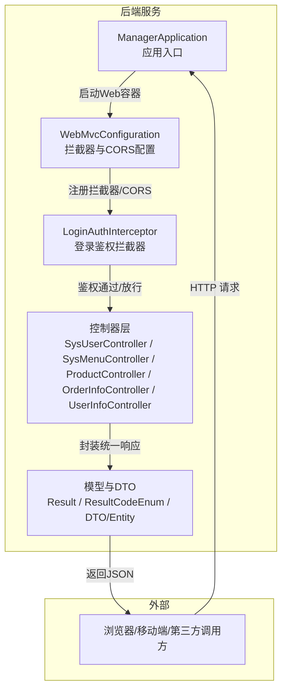
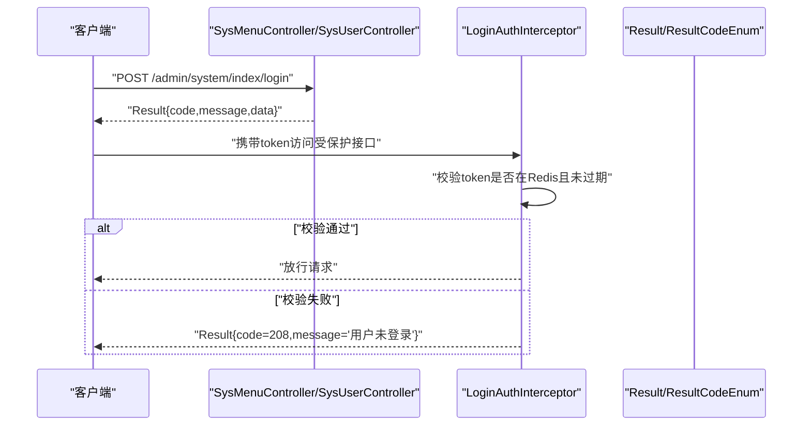
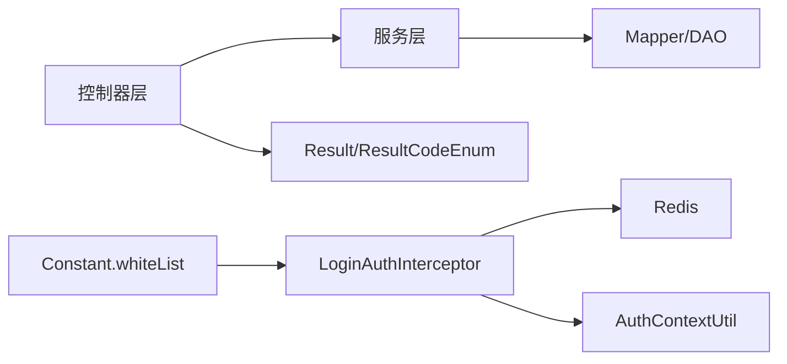

# API接口文档

<cite>
**本文引用的文件**
- [ManagerApplication.java](file://spzx-manager/src/main/java/com/joker/spzx/manager/ManagerApplication.java)
- [WebMvcConfiguration.java](file://spzx-manager/src/main/java/com/joker/spzx/manager/config/WebMvcConfiguration.java)
- [LoginAuthInterceptor.java](file://spzx-manager/src/main/java/com/joker/spzx/manager/config/LoginAuthInterceptor.java)
- [Constant.java](file://spzx-common/common-util/src/main/java/com/joker/spzx/utils/Constant.java)
- [application.yml](file://spzx-manager/src/main/resources/application.yml)
- [SysUserController.java](file://spzx-manager/src/main/java/com/joker/spzx/manager/controller/SysUserController.java)
- [SysMenuController.java](file://spzx-manager/src/main/java/com/joker/spzx/manager/controller/SysMenuController.java)
- [ProductController.java](file://spzx-manager/src/main/java/com/joker/spzx/manager/controller/ProductController.java)
- [OrderInfoController.java](file://spzx-manager/src/main/java/com/joker/spzx/manager/controller/OrderInfoController.java)
- [UserInfoController.java](file://spzx-manager/src/main/java/com/joker/spzx/manager/controller/UserInfoController.java)
- [Result.java](file://spzx-model/src/main/java/com/joker/spzx/model/vo/common/Result.java)
- [ResultCodeEnum.java](file://spzx-model/src/main/java/com/joker/spzx/model/vo/common/ResultCodeEnum.java)
- [LoginDto.java](file://spzx-model/src/main/java/com/joker/spzx/model/dto/system/LoginDto.java)
- [SysUserDto.java](file://spzx-model/src/main/java/com/joker/spzx/model/dto/system/SysUserDto.java)
- [ProductDto.java](file://spzx-model/src/main/java/com/joker/spzx/model/dto/product/ProductDto.java)
- [SysUser.java](file://spzx-model/src/main/java/com/joker/spzx/model/entity/system/SysUser.java)
</cite>

## 目录
1. [简介](#简介)
2. [项目结构](#项目结构)
3. [核心组件](#核心组件)
4. [架构总览](#架构总览)
5. [详细组件分析](#详细组件分析)
6. [依赖分析](#依赖分析)
7. [性能考虑](#性能考虑)
8. [故障排查指南](#故障排查指南)
9. [结论](#结论)
10. [附录](#附录)

## 简介
本文件为SPZX电商管理系统提供的RESTful API接口文档，覆盖用户认证、系统用户与菜单管理、商品管理、订单统计以及会员信息等模块。文档明确各接口的HTTP方法、URL模式、请求参数、响应格式，并给出统一的响应体结构、错误码说明、参数校验与安全控制策略。同时提供接口测试工具推荐、Postman集合建议、自动化测试方案、最佳实践、性能优化与限流策略。

## 项目结构
SPZX采用前后端分离架构，后端基于Spring Boot，统一通过拦截器进行登录鉴权，跨域策略开放，响应体统一包装，便于前端统一处理。

图表来源
- [ManagerApplication.java:10-15](file://spzx-manager/src/main/java/com/joker/spzx/manager/ManagerApplication.java#L10-L15)
- [WebMvcConfiguration.java:19-35](file://spzx-manager/src/main/java/com/joker/spzx/manager/config/WebMvcConfiguration.java#L19-L35)
- [LoginAuthInterceptor.java:29-58](file://spzx-manager/src/main/java/com/joker/spzx/manager/config/LoginAuthInterceptor.java#L29-L58)
- [Result.java:27-42](file://spzx-model/src/main/java/com/joker/spzx/model/vo/common/Result.java#L27-L42)

章节来源
- [application.yml:1-5](file://spzx-manager/src/main/resources/application.yml#L1-L5)
- [WebMvcConfiguration.java:12-38](file://spzx-manager/src/main/java/com/joker/spzx/manager/config/WebMvcConfiguration.java#L12-L38)

## 核心组件
- 统一响应体Result：所有接口返回统一结构，包含code、message、data三部分，便于前端统一处理与错误提示。
- 错误码ResultCodeEnum：定义标准业务状态码与消息，如成功、登录失败、验证码错误、未登录、系统错误等。
- 登录鉴权拦截器LoginAuthInterceptor：对除白名单外的所有请求进行登录态校验，校验通过后将用户信息写入上下文。
- 白名单Constant：定义无需登录即可访问的公开接口，如登录、验证码生成、静态资源、Swagger文档等。
- CORS跨域：允许本地开发环境跨域访问，支持凭证传递与自定义请求头。

章节来源
- [Result.java:8-44](file://spzx-model/src/main/java/com/joker/spzx/model/vo/common/Result.java#L8-L44)
- [ResultCodeEnum.java:6-31](file://spzx-model/src/main/java/com/joker/spzx/model/vo/common/ResultCodeEnum.java#L6-L31)
- [LoginAuthInterceptor.java:29-74](file://spzx-manager/src/main/java/com/joker/spzx/manager/config/LoginAuthInterceptor.java#L29-L74)
- [Constant.java:9-25](file://spzx-common/common-util/src/main/java/com/joker/spzx/utils/Constant.java#L9-L25)
- [WebMvcConfiguration.java:28-35](file://spzx-manager/src/main/java/com/joker/spzx/manager/config/WebMvcConfiguration.java#L28-L35)

## 架构总览
以下序列图展示一次典型登录请求的流程，包括验证码校验、登录校验与Token下发，以及后续受保护接口的鉴权流程。

图表来源
- [SysMenuController.java:28-33](file://spzx-manager/src/main/java/com/joker/spzx/manager/controller/SysMenuController.java#L28-L33)
- [LoginAuthInterceptor.java:29-58](file://spzx-manager/src/main/java/com/joker/spzx/manager/config/LoginAuthInterceptor.java#L29-L58)
- [ResultCodeEnum.java:11](file://spzx-model/src/main/java/com/joker/spzx/model/vo/common/ResultCodeEnum.java#L11)

## 详细组件分析

### 用户认证与登录
- 接口目标：管理员登录、获取验证码、退出登录（如需）
- 关键点：
  - 登录接口：接收用户名、密码、验证码及验证码key，返回统一响应体。
  - 验证码key用于服务端校验，防止暴力破解。
  - 登录成功后由前端存储token，后续请求需在请求头携带token。
  - 白名单接口无需登录即可访问，如登录、验证码生成等。

接口定义
- POST /admin/system/index/login
  - 请求头：无特殊要求
  - 请求体：LoginDto
    - 字段：userName、password、captcha、codeKey
  - 响应体：Result
    - 成功时data为登录凭据或空；失败时code对应ResultCodeEnum中的登录相关错误码
  - 示例请求路径参考：[LoginDto.java:9-27](file://spzx-model/src/main/java/com/joker/spzx/model/dto/system/LoginDto.java#L9-L27)
  - 示例响应路径参考：[Result.java:27-42](file://spzx-model/src/main/java/com/joker/spzx/model/vo/common/Result.java#L27-L42)

章节来源
- [LoginDto.java:9-27](file://spzx-model/src/main/java/com/joker/spzx/model/dto/system/LoginDto.java#L9-L27)
- [Result.java:27-42](file://spzx-model/src/main/java/com/joker/spzx/model/vo/common/Result.java#L27-L42)
- [ResultCodeEnum.java:8-11](file://spzx-model/src/main/java/com/joker/spzx/model/vo/common/ResultCodeEnum.java#L8-L11)

### 系统用户管理
- 接口目标：系统用户的增删改查、分页查询、角色分配
- URL前缀：/admin/system/sysUser

接口定义
- POST /admin/system/sysUser/findByPage/{pageNum}/{pageSize}
  - 方法：POST
  - 路径参数：pageNum、pageSize
  - 请求体：SysUserDto
  - 响应体：Result<IPage<SysUser>>
  - 示例请求路径参考：[SysUserDto.java:8-19](file://spzx-model/src/main/java/com/joker/spzx/model/dto/system/SysUserDto.java#L8-L19)
  - 示例响应路径参考：[Result.java:27-42](file://spzx-model/src/main/java/com/joker/spzx/model/vo/common/Result.java#L27-L42)

- POST /admin/system/sysUser/saveSysUser
  - 方法：POST
  - 请求体：SysUser
  - 响应体：Result

- POST /admin/system/sysUser/updateSysUser
  - 方法：POST
  - 请求体：SysUser
  - 响应体：Result

- DELETE /admin/system/sysUser/deleteById/{id}
  - 方法：DELETE
  - 路径参数：id
  - 响应体：Result

- POST /admin/system/sysUser/doAssgin
  - 方法：POST
  - 请求体：AssginRoleDto（角色分配）
  - 响应体：Result

章节来源
- [SysUserController.java:33-68](file://spzx-manager/src/main/java/com/joker/spzx/manager/controller/SysUserController.java#L33-L68)
- [SysUserDto.java:8-19](file://spzx-model/src/main/java/com/joker/spzx/model/dto/system/SysUserDto.java#L8-L19)
- [SysUser.java:12-42](file://spzx-model/src/main/java/com/joker/spzx/model/entity/system/SysUser.java#L12-L42)

### 系统菜单管理
- 接口目标：菜单树形列表、新增、修改、删除
- URL前缀：/admin/system/sysMenu

接口定义
- GET /admin/system/sysMenu/findNodes
  - 方法：GET
  - 响应体：Result<List<SysMenu>>

- POST /admin/system/sysMenu/save
  - 方法：POST
  - 请求体：SysMenu
  - 响应体：Result

- PUT /admin/system/sysMenu/update
  - 方法：PUT
  - 请求体：SysMenu
  - 响应体：Result

- DELETE /admin/system/sysMenu/removeById/{id}
  - 方法：DELETE
  - 路径参数：id
  - 响应体：Result

章节来源
- [SysMenuController.java:28-56](file://spzx-manager/src/main/java/com/joker/spzx/manager/controller/SysMenuController.java#L28-L56)

### 商品管理
- 接口目标：商品分页查询、新增、修改、删除、详情查看
- URL前缀：/admin/product/sourceProduct

接口定义
- GET /admin/product/sourceProduct/pageList
  - 方法：GET
  - 查询参数：ProductDto
  - 响应体：Result<IPage<ProductPageVo>>

- POST /admin/product/sourceProduct/saveData
  - 方法：POST
  - 请求体：Product
  - 响应体：Result

- PUT /admin/product/sourceProduct/updateData
  - 方法：PUT
  - 请求体：Product
  - 响应体：Result

- DELETE /admin/product/sourceProduct/deleteById/{id}
  - 方法：DELETE
  - 路径参数：id
  - 响应体：Result

- GET /admin/product/sourceProduct/getDetail?id={id}
  - 方法：GET
  - 查询参数：id
  - 响应体：Result<ProductPageVo>

章节来源
- [ProductController.java:28-57](file://spzx-manager/src/main/java/com/joker/spzx/manager/controller/ProductController.java#L28-L57)
- [ProductDto.java:9-23](file://spzx-model/src/main/java/com/joker/spzx/model/dto/product/ProductDto.java#L9-L23)

### 订单统计
- 接口目标：订单统计数据查询
- URL前缀：/admin/order/orderInfo

接口定义
- GET /admin/order/orderInfo/getOrderStatisticsData
  - 方法：GET
  - 查询参数：OrderStatisticsDto
  - 响应体：Result<OrderStatisticsVo>

章节来源
- [OrderInfoController.java:28-32](file://spzx-manager/src/main/java/com/joker/spzx/manager/controller/OrderInfoController.java#L28-L32)

### 会员信息
- 接口目标：会员信息相关接口（当前为空接口占位，后续扩展）
- URL前缀：/manager/user-info

章节来源
- [UserInfoController.java:15-18](file://spzx-manager/src/main/java/com/joker/spzx/manager/controller/UserInfoController.java#L15-L18)

## 依赖分析
- 控制器依赖服务层（Service），服务层依赖Mapper与MyBatis-Plus进行数据库操作。
- 拦截器依赖Redis进行登录态校验，白名单常量定义了无需登录的路由。
- 统一响应体与错误码贯穿所有接口，保证前后端交互一致性。

图表来源
- [LoginAuthInterceptor.java:26-52](file://spzx-manager/src/main/java/com/joker/spzx/manager/config/LoginAuthInterceptor.java#L26-L52)
- [Constant.java:9-25](file://spzx-common/common-util/src/main/java/com/joker/spzx/utils/Constant.java#L9-L25)
- [Result.java:27-42](file://spzx-model/src/main/java/com/joker/spzx/model/vo/common/Result.java#L27-L42)

## 性能考虑
- 缓存与会话：登录态使用Redis存储，建议设置合理的过期时间与内存策略，避免热点Key。
- 分页查询：商品与用户列表均支持分页，建议前端传入合理页码与大小，避免一次性加载过多数据。
- 跨域与CORS：生产环境建议限制allowedOrigins，仅允许可信域名，减少CSRF风险。
- 并发与锁：高并发场景下，订单统计与库存扣减建议使用分布式锁或数据库层面的乐观锁。
- 监控与日志：结合全局异常与操作日志，定位慢查询与异常请求。

## 故障排查指南
- 未登录/登录过期
  - 现象：返回code=208，message为“用户未登录”
  - 处理：检查请求头是否携带token，确认Redis中是否存在对应键，核对过期时间
  - 参考：[ResultCodeEnum.java:11](file://spzx-model/src/main/java/com/joker/spzx/model/vo/common/ResultCodeEnum.java#L11)，[LoginAuthInterceptor.java:46-52](file://spzx-manager/src/main/java/com/joker/spzx/manager/config/LoginAuthInterceptor.java#L46-L52)

- 参数校验失败
  - 现象：登录接口字段缺失或为空，触发校验异常
  - 处理：确保LoginDto中userName、password、captcha、codeKey均非空
  - 参考：[LoginDto.java:11-25](file://spzx-model/src/main/java/com/joker/spzx/model/dto/system/LoginDto.java#L11-L25)

- 跨域问题
  - 现象：浏览器报跨域错误
  - 处理：确认CORS配置允许的origin与headers，生产环境限制allowedOrigins
  - 参考：[WebMvcConfiguration.java:28-35](file://spzx-manager/src/main/java/com/joker/spzx/manager/config/WebMvcConfiguration.java#L28-L35)

- 统一响应体解析
  - 现象：前端无法解析后端返回
  - 处理：统一读取Result.code与message，data为具体业务数据
  - 参考：[Result.java:27-42](file://spzx-model/src/main/java/com/joker/spzx/model/vo/common/Result.java#L27-L42)

章节来源
- [ResultCodeEnum.java:8-21](file://spzx-model/src/main/java/com/joker/spzx/model/vo/common/ResultCodeEnum.java#L8-L21)
- [LoginAuthInterceptor.java:46-52](file://spzx-manager/src/main/java/com/joker/spzx/manager/config/LoginAuthInterceptor.java#L46-L52)
- [WebMvcConfiguration.java:28-35](file://spzx-manager/src/main/java/com/joker/spzx/manager/config/WebMvcConfiguration.java#L28-L35)
- [Result.java:27-42](file://spzx-model/src/main/java/com/joker/spzx/model/vo/common/Result.java#L27-L42)

## 结论
本文档提供了SPZX电商管理系统的核心API接口规范，涵盖用户认证、系统用户与菜单、商品管理、订单统计与会员信息等模块。通过统一的响应体与错误码、严格的登录鉴权与白名单机制、以及可扩展的跨域策略，系统具备良好的可维护性与安全性。建议在生产环境中进一步完善限流、熔断与监控体系，并持续补充接口文档与自动化测试。

## 附录

### 统一响应体结构
- 字段说明
  - code：业务状态码（整型）
  - message：响应消息（字符串）
  - data：业务数据（任意类型）

- 示例
  - 成功：code=200，message="操作成功"，data为具体数据
  - 失败：code=208，message="用户未登录"，data=null

章节来源
- [Result.java:8-44](file://spzx-model/src/main/java/com/joker/spzx/model/vo/common/Result.java#L8-L44)
- [ResultCodeEnum.java:8-21](file://spzx-model/src/main/java/com/joker/spzx/model/vo/common/ResultCodeEnum.java#L8-L21)

### 错误码一览
- 200：操作成功
- 201：用户名或密码错误
- 202：验证码错误
- 208：用户未登录
- 209：用户名已存在
- 9999：网络异常，请稍后重试
- 217：该节点下有子节点，不可删除
- 204：数据异常
- 216：账号已停用
- 219：库存不足

章节来源
- [ResultCodeEnum.java:6-31](file://spzx-model/src/main/java/com/joker/spzx/model/vo/common/ResultCodeEnum.java#L6-L31)

### 参数校验与安全控制
- 登录参数校验：用户名、密码、验证码、验证码key均不能为空
- 登录态校验：所有受保护接口需携带token，服务端从Redis读取用户信息并刷新过期时间
- 白名单：无需登录即可访问的接口集合，如登录、验证码、静态资源、Swagger文档等
- CORS：开发环境允许本地3000端口跨域，生产环境建议限制来源

章节来源
- [LoginDto.java:11-25](file://spzx-model/src/main/java/com/joker/spzx/model/dto/system/LoginDto.java#L11-L25)
- [LoginAuthInterceptor.java:40-52](file://spzx-manager/src/main/java/com/joker/spzx/manager/config/LoginAuthInterceptor.java#L40-L52)
- [Constant.java:9-25](file://spzx-common/common-util/src/main/java/com/joker/spzx/utils/Constant.java#L9-L25)
- [WebMvcConfiguration.java:28-35](file://spzx-manager/src/main/java/com/joker/spzx/manager/config/WebMvcConfiguration.java#L28-L35)

### 接口测试工具与自动化测试
- Postman集合建议
  - 创建环境变量：baseUrl、token
  - 登录接口：先调用登录获取token，再在后续接口中设置Authorization头或携带token
  - 菜单与用户接口：使用GET/POST/PUT/DELETE分别验证功能
  - 商品与订单接口：构造分页查询与CRUD场景
- 自动化测试方案
  - 使用Jest/Pytest等框架编写接口测试脚本，覆盖登录、分页、新增、更新、删除、查询详情等场景
  - 引入Mock服务模拟Redis与数据库，提升测试稳定性
  - 集成CI/CD流水线，每次提交自动执行接口测试

[本节为通用实践建议，不直接分析具体文件]

### API版本管理
- 当前未见显式版本号（如/v1），建议在URL中加入版本前缀，如/admin/v1/system/sysUser，便于未来演进与向后兼容

[本节为通用实践建议，不直接分析具体文件]

### 性能优化与限流策略
- Redis缓存：热点数据与登录态缓存，设置合理TTL
- 分页与索引：对高频查询字段建立索引，避免全表扫描
- 限流：针对登录、验证码等敏感接口实施IP/用户维度限流
- CDN与静态资源：将静态资源部署至CDN，降低服务器压力

[本节为通用实践建议，不直接分析具体文件]