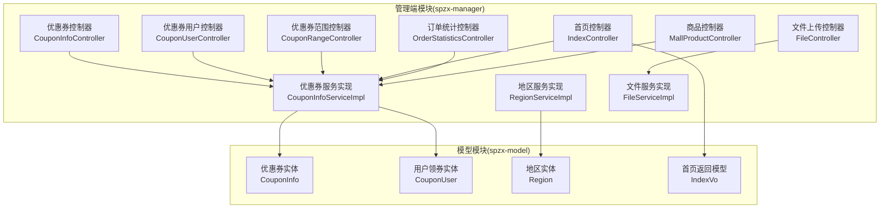
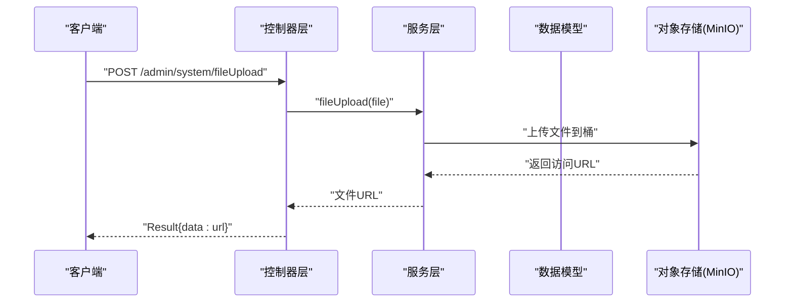
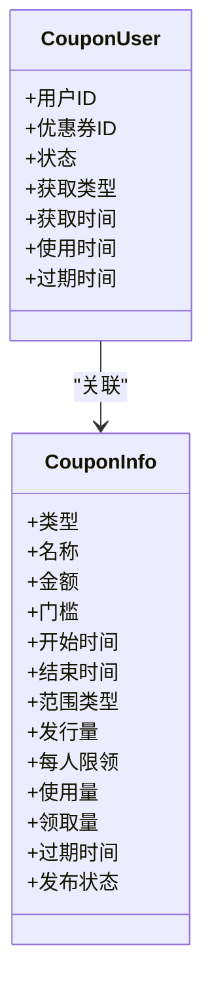
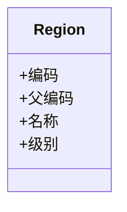
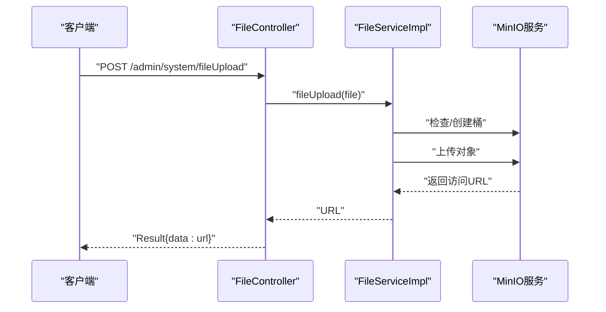
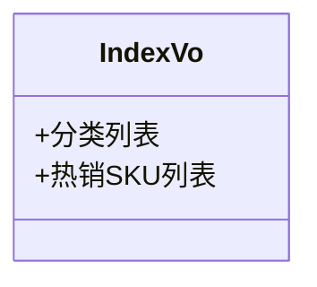
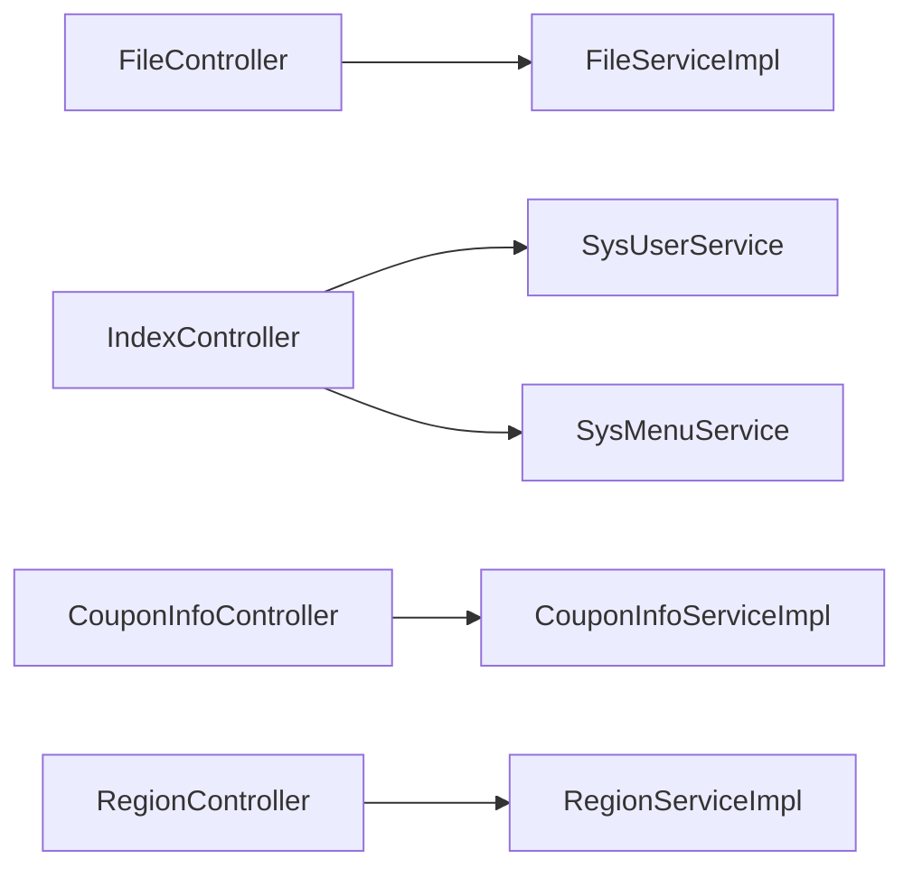

# 业务功能接口

<cite>
**本文引用的文件**
- [CouponInfoController.java](file://spzx-manager/src/main/java/com/joker/spzx/manager/controller/CouponInfoController.java)
- [CouponUserController.java](file://spzx-manager/src/main/java/com/joker/spzx/manager/controller/CouponUserController.java)
- [CouponRangeController.java](file://spzx-manager/src/main/java/com/joker/spzx/manager/controller/CouponRangeController.java)
- [FileController.java](file://spzx-manager/src/main/java/com/joker/spzx/manager/controller/FileController.java)
- [IndexController.java](file://spzx-manager/src/main/java/com/joker/spzx/manager/controller/IndexController.java)
- [OrderStatisticsController.java](file://spzx-manager/src/main/java/com/joker/spzx/manager/controller/OrderStatisticsController.java)
- [MallProductController.java](file://spzx-manager/src/main/java/com/joker/spzx/manager/controller/MallProductController.java)
- [CouponInfoServiceImpl.java](file://spzx-manager/src/main/java/com/joker/spzx/manager/service/impl/CouponInfoServiceImpl.java)
- [RegionServiceImpl.java](file://spzx-manager/src/main/java/com/joker/spzx/manager/service/impl/RegionServiceImpl.java)
- [FileServiceImpl.java](file://spzx-manager/src/main/java/com/joker/spzx/manager/service/impl/FileServiceImpl.java)
- [CouponInfo.java](file://spzx-model/src/main/java/com/joker/spzx/model/entity/system/CouponInfo.java)
- [CouponUser.java](file://spzx-model/src/main/java/com/joker/spzx/model/entity/system/CouponUser.java)
- [Region.java](file://spzx-model/src/main/java/com/joker/spzx/model/entity/base/Region.java)
- [IndexVo.java](file://spzx-model/src/main/java/com/joker/spzx/model/vo/h5/IndexVo.java)
</cite>

## 目录
1. [简介](#简介)
2. [项目结构](#项目结构)
3. [核心组件](#核心组件)
4. [架构总览](#架构总览)
5. [详细组件分析](#详细组件分析)
6. [依赖分析](#依赖分析)
7. [性能考虑](#性能考虑)
8. [故障排查指南](#故障排查指南)
9. [结论](#结论)
10. [附录](#附录)

## 简介
本文件面向SPZX电商管理系统，聚焦于业务功能接口文档，覆盖以下主题：
- 优惠券：发放、使用与范围管理
- 地区管理：省市区层级联动
- 文件上传：基于MinIO的对象存储与CDN集成建议
- 首页数据：首页推荐与统计数据接口
- 业务数据模型：优惠券、用户领券、地区、首页返回模型
- 缓存与性能：缓存策略与性能优化建议
- 报表与统计：订单统计接口定位与扩展方向

说明：
- 当前仓库中部分控制器仅声明路径，具体接口尚未实现；本文在“接口定义”部分以“待完善”标注，并给出可落地的实现建议与数据模型。
- 文件上传已实现基于MinIO的直传逻辑，本文提供CDN集成方案与最佳实践。

## 项目结构
系统采用前后端分离的多模块结构，核心业务集中在spzx-manager模块，数据模型集中在spzx-model模块，公共日志与异常处理在spzx-common模块。

图表来源
- [CouponInfoController.java:1-19](file://spzx-manager/src/main/java/com/joker/spzx/manager/controller/CouponInfoController.java#L1-L19)
- [CouponUserController.java:1-19](file://spzx-manager/src/main/java/com/joker/spzx/manager/controller/CouponUserController.java#L1-L19)
- [CouponRangeController.java:1-19](file://spzx-manager/src/main/java/com/joker/spzx/manager/controller/CouponRangeController.java#L1-L19)
- [FileController.java:1-26](file://spzx-manager/src/main/java/com/joker/spzx/manager/controller/FileController.java#L1-L26)
- [IndexController.java:1-69](file://spzx-manager/src/main/java/com/joker/spzx/manager/controller/IndexController.java#L1-L69)
- [OrderStatisticsController.java:1-19](file://spzx-manager/src/main/java/com/joker/spzx/manager/controller/OrderStatisticsController.java#L1-L19)
- [MallProductController.java:1-61](file://spzx-manager/src/main/java/com/joker/spzx/manager/controller/MallProductController.java#L1-L61)
- [CouponInfoServiceImpl.java:1-21](file://spzx-manager/src/main/java/com/joker/spzx/manager/service/impl/CouponInfoServiceImpl.java#L1-L21)
- [RegionServiceImpl.java:1-21](file://spzx-manager/src/main/java/com/joker/spzx/manager/service/impl/RegionServiceImpl.java#L1-L21)
- [FileServiceImpl.java:1-51](file://spzx-manager/src/main/java/com/joker/spzx/manager/service/impl/FileServiceImpl.java#L1-L51)
- [CouponInfo.java:1-85](file://spzx-model/src/main/java/com/joker/spzx/model/entity/system/CouponInfo.java#L1-L85)
- [CouponUser.java:1-88](file://spzx-model/src/main/java/com/joker/spzx/model/entity/system/CouponUser.java#L1-L88)
- [Region.java:1-22](file://spzx-model/src/main/java/com/joker/spzx/model/entity/base/Region.java#L1-L22)
- [IndexVo.java:1-15](file://spzx-model/src/main/java/com/joker/spzx/model/vo/h5/IndexVo.java#L1-L15)

章节来源
- [CouponInfoController.java:1-19](file://spzx-manager/src/main/java/com/joker/spzx/manager/controller/CouponInfoController.java#L1-L19)
- [FileController.java:1-26](file://spzx-manager/src/main/java/com/joker/spzx/manager/controller/FileController.java#L1-L26)
- [IndexController.java:1-69](file://spzx-manager/src/main/java/com/joker/spzx/manager/controller/IndexController.java#L1-L69)
- [CouponInfo.java:1-85](file://spzx-model/src/main/java/com/joker/spzx/model/entity/system/CouponInfo.java#L1-L85)
- [CouponUser.java:1-88](file://spzx-model/src/main/java/com/joker/spzx/model/entity/system/CouponUser.java#L1-L88)
- [Region.java:1-22](file://spzx-model/src/main/java/com/joker/spzx/model/entity/base/Region.java#L1-L22)
- [IndexVo.java:1-15](file://spzx-model/src/main/java/com/joker/spzx/model/vo/h5/IndexVo.java#L1-L15)

## 核心组件
- 控制器层：负责HTTP路由与请求转发，当前已实现文件上传、首页登录/菜单等接口；优惠券、地区、统计等控制器存在但接口未实现。
- 服务层：封装业务逻辑，当前已实现文件上传服务与基础优惠券/地区服务实现。
- 数据模型：定义优惠券、用户领券、地区、首页返回等数据结构。

章节来源
- [CouponInfoController.java:1-19](file://spzx-manager/src/main/java/com/joker/spzx/manager/controller/CouponInfoController.java#L1-L19)
- [CouponUserController.java:1-19](file://spzx-manager/src/main/java/com/joker/spzx/manager/controller/CouponUserController.java#L1-L19)
- [CouponRangeController.java:1-19](file://spzx-manager/src/main/java/com/joker/spzx/manager/controller/CouponRangeController.java#L1-L19)
- [FileController.java:1-26](file://spzx-manager/src/main/java/com/joker/spzx/manager/controller/FileController.java#L1-L26)
- [IndexController.java:1-69](file://spzx-manager/src/main/java/com/joker/spzx/manager/controller/IndexController.java#L1-L69)
- [OrderStatisticsController.java:1-19](file://spzx-manager/src/main/java/com/joker/spzx/manager/controller/OrderStatisticsController.java#L1-L19)
- [MallProductController.java:1-61](file://spzx-manager/src/main/java/com/joker/spzx/manager/controller/MallProductController.java#L1-L61)
- [CouponInfoServiceImpl.java:1-21](file://spzx-manager/src/main/java/com/joker/spzx/manager/service/impl/CouponInfoServiceImpl.java#L1-L21)
- [RegionServiceImpl.java:1-21](file://spzx-manager/src/main/java/com/joker/spzx/manager/service/impl/RegionServiceImpl.java#L1-L21)
- [FileServiceImpl.java:1-51](file://spzx-manager/src/main/java/com/joker/spzx/manager/service/impl/FileServiceImpl.java#L1-L51)
- [CouponInfo.java:1-85](file://spzx-model/src/main/java/com/joker/spzx/model/entity/system/CouponInfo.java#L1-L85)
- [CouponUser.java:1-88](file://spzx-model/src/main/java/com/joker/spzx/model/entity/system/CouponUser.java#L1-L88)
- [Region.java:1-22](file://spzx-model/src/main/java/com/joker/spzx/model/entity/base/Region.java#L1-L22)
- [IndexVo.java:1-15](file://spzx-model/src/main/java/com/joker/spzx/model/vo/h5/IndexVo.java#L1-L15)

## 架构总览
下图展示从HTTP请求到服务与数据模型的调用链路，以及文件上传到MinIO的流程。

图表来源
- [FileController.java:1-26](file://spzx-manager/src/main/java/com/joker/spzx/manager/controller/FileController.java#L1-L26)
- [FileServiceImpl.java:1-51](file://spzx-manager/src/main/java/com/joker/spzx/manager/service/impl/FileServiceImpl.java#L1-L51)

## 详细组件分析

### 优惠券功能接口
- 接口定义
  - 发放与管理
    - 方法：GET/POST/PUT/DELETE
    - 路径：/manager/coupon-info
    - 请求参数：按业务需要设计（如分页、筛选条件）
    - 响应：Result包装的分页或单条记录
  - 用户领券
    - 方法：GET/POST/PUT/DELETE
    - 路径：/manager/coupon-user
    - 请求参数：用户ID、优惠券ID、领取方式等
    - 响应：Result包装操作结果
  - 使用范围
    - 方法：GET/POST/PUT/DELETE
    - 路径：/manager/coupon-range
    - 请求参数：范围类型、关联ID等
    - 响应：Result包装操作结果
- 业务规则
  - 发放时间窗口：开始/结束日期
  - 使用门槛：满减条件
  - 领取上限：每人限领张数
  - 过期时间：统一过期时间字段
  - 使用状态：未使用/已使用
- 数据模型
  - 优惠券实体：包含类型、金额、门槛、范围、发行量、使用量、状态等
  - 用户领券实体：包含用户ID、优惠券ID、状态、获取类型、时间等
- 实现建议
  - 分页查询与条件筛选
  - 领取并发控制与库存校验
  - 使用时的订单绑定与状态流转
  - 范围匹配（全场/分类/商品）

图表来源
- [CouponInfo.java:1-85](file://spzx-model/src/main/java/com/joker/spzx/model/entity/system/CouponInfo.java#L1-L85)
- [CouponUser.java:1-88](file://spzx-model/src/main/java/com/joker/spzx/model/entity/system/CouponUser.java#L1-L88)

章节来源
- [CouponInfoController.java:1-19](file://spzx-manager/src/main/java/com/joker/spzx/manager/controller/CouponInfoController.java#L1-L19)
- [CouponUserController.java:1-19](file://spzx-manager/src/main/java/com/joker/spzx/manager/controller/CouponUserController.java#L1-L19)
- [CouponRangeController.java:1-19](file://spzx-manager/src/main/java/com/joker/spzx/manager/controller/CouponRangeController.java#L1-L19)
- [CouponInfo.java:1-85](file://spzx-model/src/main/java/com/joker/spzx/model/entity/system/CouponInfo.java#L1-L85)
- [CouponUser.java:1-88](file://spzx-model/src/main/java/com/joker/spzx/model/entity/system/CouponUser.java#L1-L88)

### 地区管理接口
- 接口定义
  - 联动查询
    - 方法：GET
    - 路径：/manager/region
    - 请求参数：父区域编码/级别
    - 响应：Result包装的区域列表
- 业务规则
  - 级别：省/市/区县三级
  - 上级编码：父子关系
- 数据模型
  - 区域实体：包含编码、父编码、名称、级别

图表来源
- [Region.java:1-22](file://spzx-model/src/main/java/com/joker/spzx/model/entity/base/Region.java#L1-L22)

章节来源
- [RegionController.java:1-19](file://spzx-manager/src/main/java/com/joker/spzx/manager/controller/RegionController.java#L1-L19)
- [Region.java:1-22](file://spzx-model/src/main/java/com/joker/spzx/model/entity/base/Region.java#L1-L22)

### 文件上传接口
- 接口定义
  - 方法：POST
  - 路径：/admin/system/fileUpload
  - 请求参数：multipart文件
  - 响应：Result包装文件访问URL
- 存储策略
  - 对象存储：MinIO
  - 桶名：spzx-manager
  - 文件命名：按日期目录组织
- CDN集成方案
  - MinIO作为源站，通过CDN回源
  - 建议开启缓存头与压缩
  - 使用独立域名与HTTPS
  - 失败重试与降级策略

图表来源
- [FileController.java:1-26](file://spzx-manager/src/main/java/com/joker/spzx/manager/controller/FileController.java#L1-L26)
- [FileServiceImpl.java:1-51](file://spzx-manager/src/main/java/com/joker/spzx/manager/service/impl/FileServiceImpl.java#L1-L51)

章节来源
- [FileController.java:1-26](file://spzx-manager/src/main/java/com/joker/spzx/manager/controller/FileController.java#L1-L26)
- [FileServiceImpl.java:1-51](file://spzx-manager/src/main/java/com/joker/spzx/manager/service/impl/FileServiceImpl.java#L1-L51)

### 首页数据接口
- 接口定义
  - 登录：POST /admin/system/index/login
  - 获取验证码：GET /admin/system/index/genVarifyCode
  - 获取用户信息：GET /admin/system/index/getUserInfo
  - 退出：GET /admin/system/index/logout
  - 动态菜单：GET /admin/system/index/menus
- 返回模型
  - 首页返回模型：包含分类列表与热销商品SKU列表

图表来源
- [IndexVo.java:1-15](file://spzx-model/src/main/java/com/joker/spzx/model/vo/h5/IndexVo.java#L1-L15)

章节来源
- [IndexController.java:1-69](file://spzx-manager/src/main/java/com/joker/spzx/manager/controller/IndexController.java#L1-L69)
- [IndexVo.java:1-15](file://spzx-model/src/main/java/com/joker/spzx/model/vo/h5/IndexVo.java#L1-L15)

### 订单统计接口
- 接口定义
  - 路径：/manager/order-statistics
  - 方法：GET/POST/PUT/DELETE（待完善）
  - 请求参数：统计维度（时间区间、品类、渠道等）
  - 响应：统计结果集合
- 扩展建议
  - 结合定时任务生成周期性报表
  - 提供导出能力

章节来源
- [OrderStatisticsController.java:1-19](file://spzx-manager/src/main/java/com/joker/spzx/manager/controller/OrderStatisticsController.java#L1-L19)

### 商品管理接口
- 接口定义
  - 分页查询：GET /admin/mall/product/pageList/{pageNum}/{pageSize}
  - 新增：POST /admin/mall/product/saveData
  - 修改：PUT /admin/mall/product/update
  - 查询全部：GET /admin/mall/product/all
- 适用场景
  - 后台商品维护与运营

章节来源
- [MallProductController.java:1-61](file://spzx-manager/src/main/java/com/joker/spzx/manager/controller/MallProductController.java#L1-L61)

## 依赖分析
- 控制器与服务
  - FileController依赖FileServiceImpl
  - IndexController依赖SysUserService与SysMenuService（接口存在但实现未在当前片段体现）
  - 优惠券/地区控制器依赖对应服务实现
- 服务与模型
  - 服务实现类映射至MyBatis-Plus实体，实体来自spzx-model模块

图表来源
- [FileController.java:1-26](file://spzx-manager/src/main/java/com/joker/spzx/manager/controller/FileController.java#L1-L26)
- [IndexController.java:1-69](file://spzx-manager/src/main/java/com/joker/spzx/manager/controller/IndexController.java#L1-L69)
- [CouponInfoController.java:1-19](file://spzx-manager/src/main/java/com/joker/spzx/manager/controller/CouponInfoController.java#L1-L19)
- [RegionController.java:1-19](file://spzx-manager/src/main/java/com/joker/spzx/manager/controller/RegionController.java#L1-L19)
- [CouponInfoServiceImpl.java:1-21](file://spzx-manager/src/main/java/com/joker/spzx/manager/service/impl/CouponInfoServiceImpl.java#L1-L21)
- [RegionServiceImpl.java:1-21](file://spzx-manager/src/main/java/com/joker/spzx/manager/service/impl/RegionServiceImpl.java#L1-L21)

章节来源
- [FileController.java:1-26](file://spzx-manager/src/main/java/com/joker/spzx/manager/controller/FileController.java#L1-L26)
- [IndexController.java:1-69](file://spzx-manager/src/main/java/com/joker/spzx/manager/controller/IndexController.java#L1-L69)
- [CouponInfoController.java:1-19](file://spzx-manager/src/main/java/com/joker/spzx/manager/controller/CouponInfoController.java#L1-L19)
- [RegionController.java:1-19](file://spzx-manager/src/main/java/com/joker/spzx/manager/controller/RegionController.java#L1-L19)
- [CouponInfoServiceImpl.java:1-21](file://spzx-manager/src/main/java/com/joker/spzx/manager/service/impl/CouponInfoServiceImpl.java#L1-L21)
- [RegionServiceImpl.java:1-21](file://spzx-manager/src/main/java/com/joker/spzx/manager/service/impl/RegionServiceImpl.java#L1-L21)

## 性能考虑
- 缓存策略
  - 首页数据：对分类与热销商品列表进行短期缓存，结合事件驱动失效
  - 地区数据：静态或低频变更，设置较长缓存时间
  - 优惠券：按用户维度缓存可用券列表，避免重复查询
- 传输优化
  - 文件上传：启用Gzip/Br压缩与断点续传
  - CDN：静态资源走CDN，缩短首屏加载时间
- 并发控制
  - 优惠券领取：使用分布式锁或数据库乐观锁
  - 统计报表：异步生成，提供下载链接
- 监控与告警
  - 接口耗时、错误率、存储容量监控

## 故障排查指南
- 文件上传失败
  - 检查MinIO连接参数与桶权限
  - 确认桶是否存在且可写
  - 查看服务端异常日志
- 登录/菜单接口异常
  - 核对token传递与解析
  - 检查用户会话与权限
- 优惠券/地区接口未返回数据
  - 确认服务实现是否完成
  - 检查数据库连接与SQL执行

章节来源
- [FileServiceImpl.java:1-51](file://spzx-manager/src/main/java/com/joker/spzx/manager/service/impl/FileServiceImpl.java#L1-L51)
- [IndexController.java:1-69](file://spzx-manager/src/main/java/com/joker/spzx/manager/controller/IndexController.java#L1-L69)

## 结论
- 当前系统已具备文件上传与首页登录/菜单的基础能力。
- 优惠券、地区、统计等控制器已定义路径，建议尽快补齐接口与服务实现。
- 建议引入缓存与CDN，提升首页与静态资源访问性能。
- 报表与统计可通过定时任务与导出能力进一步完善。

## 附录
- 接口清单（待完善）
  - 优惠券：/manager/coupon-info（分页/新增/修改/删除）
  - 用户领券：/manager/coupon-user（分页/核销）
  - 优惠券范围：/manager/coupon-range（分页/绑定）
  - 地区：/manager/region（按级别/父编码查询）
  - 统计：/manager/order-statistics（按维度统计）
  - 商品：/admin/mall/product（分页/新增/修改/查询全部）
  - 文件：/admin/system/fileUpload（上传）
  - 首页：/admin/system/index/*（登录/验证码/用户信息/菜单/退出）