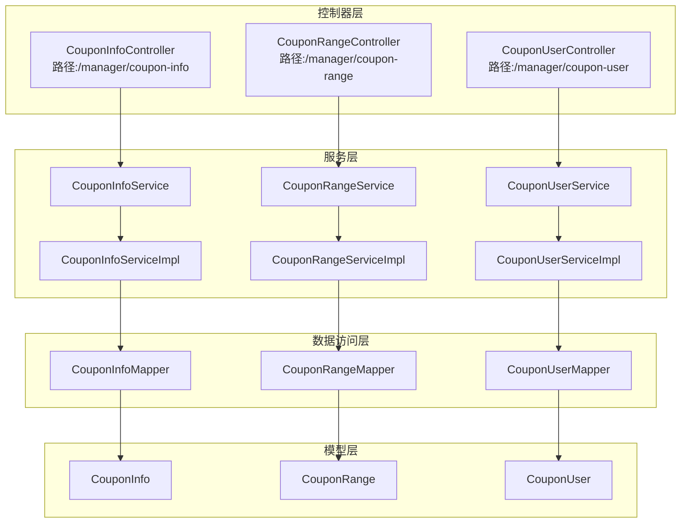
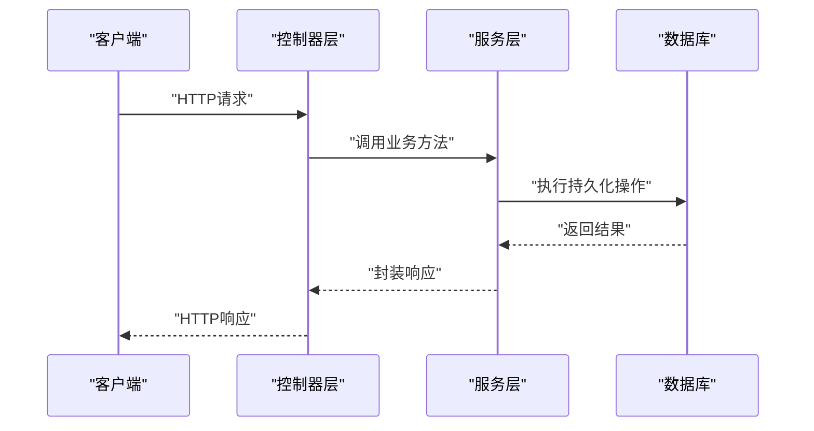
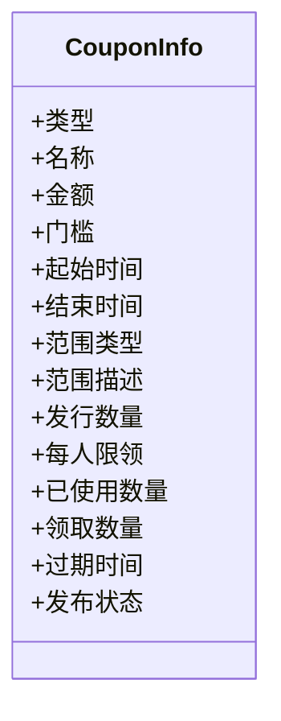
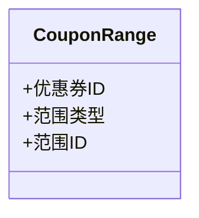
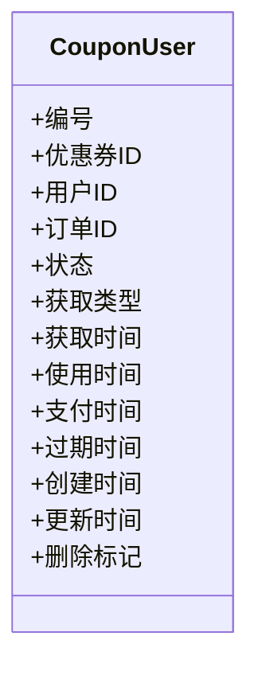
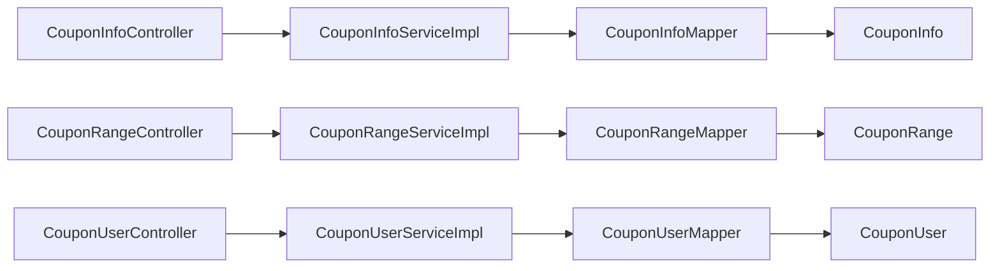

# 优惠券业务接口

<cite>
**本文引用的文件**
- [CouponInfoController.java](file://spzx-manager/src/main/java/com/joker/spzx/manager/controller/CouponInfoController.java)
- [CouponRangeController.java](file://spzx-manager/src/main/java/com/joker/spzx/manager/controller/CouponRangeController.java)
- [CouponUserController.java](file://spzx-manager/src/main/java/com/joker/spzx/manager/controller/CouponUserController.java)
- [CouponInfoService.java](file://spzx-manager/src/main/java/com/joker/spzx/manager/service/CouponInfoService.java)
- [CouponRangeService.java](file://spzx-manager/src/main/java/com/joker/spzx/manager/service/CouponRangeService.java)
- [CouponUserService.java](file://spzx-manager/src/main/java/com/joker/spzx/manager/service/CouponUserService.java)
- [CouponInfoServiceImpl.java](file://spzx-manager/src/main/java/com/joker/spzx/manager/service/impl/CouponInfoServiceImpl.java)
- [CouponRangeServiceImpl.java](file://spzx-manager/src/main/java/com/joker/spzx/manager/service/impl/CouponRangeServiceImpl.java)
- [CouponUserServiceImpl.java](file://spzx-manager/src/main/java/com/joker/spzx/manager/service/impl/CouponUserServiceImpl.java)
- [CouponInfoMapper.java](file://spzx-manager/src/main/java/com/joker/spzx/manager/mapper/CouponInfoMapper.java)
- [CouponRangeMapper.java](file://spzx-manager/src/main/java/com/joker/spzx/manager/mapper/CouponRangeMapper.java)
- [CouponUserMapper.java](file://spzx-manager/src/main/java/com/joker/spzx/manager/mapper/CouponUserMapper.java)
- [CouponInfo.java](file://spzx-model/src/main/java/com/joker/spzx/model/entity/system/CouponInfo.java)
- [CouponRange.java](file://spzx-model/src/main/java/com/joker/spzx/model/entity/system/CouponRange.java)
- [CouponUser.java](file://spzx-model/src/main/java/com/joker/spzx/model/entity/system/CouponUser.java)
</cite>

## 目录
1. [简介](#简介)
2. [项目结构](#项目结构)
3. [核心组件](#核心组件)
4. [架构总览](#架构总览)
5. [详细组件分析](#详细组件分析)
6. [依赖分析](#依赖分析)
7. [性能考虑](#性能考虑)
8. [故障排查指南](#故障排查指南)
9. [结论](#结论)

## 简介
本文件面向SPZX电商管理系统中的“优惠券业务”，系统性梳理优惠券信息管理、优惠券范围设置、用户优惠券管理三大模块的接口设计与数据模型。内容覆盖：
- 优惠券类型与使用条件
- 有效期与发布状态规则
- 范围设置（全场、指定分类、指定商品）
- 用户领取与使用记录
- 状态流转与并发控制要点
- 接口路径与职责边界

当前仓库中，优惠券相关控制器仅定义了基础路径，具体接口方法尚未在代码中实现；本文在不臆造现有实现的前提下，基于实体模型与命名约定，给出规范化的接口设计建议与说明。

## 项目结构
优惠券业务位于管理端模块，采用经典的分层架构：
- 控制器层：负责HTTP路由与请求入口
- 服务层：封装业务逻辑与事务控制
- 数据访问层：MyBatis-Plus Mapper接口
- 模型层：数据库实体与字段语义

图表来源
- [CouponInfoController.java:1-19](file://spzx-manager/src/main/java/com/joker/spzx/manager/controller/CouponInfoController.java#L1-L19)
- [CouponRangeController.java:1-19](file://spzx-manager/src/main/java/com/joker/spzx/manager/controller/CouponRangeController.java#L1-L19)
- [CouponUserController.java:1-19](file://spzx-manager/src/main/java/com/joker/spzx/manager/controller/CouponUserController.java#L1-L19)
- [CouponInfoService.java:1-17](file://spzx-manager/src/main/java/com/joker/spzx/manager/service/CouponInfoService.java#L1-L17)
- [CouponRangeService.java:1-17](file://spzx-manager/src/main/java/com/joker/spzx/manager/service/CouponRangeService.java#L1-L17)
- [CouponUserService.java:1-17](file://spzx-manager/src/main/java/com/joker/spzx/manager/service/CouponUserService.java#L1-L17)
- [CouponInfoServiceImpl.java:1-21](file://spzx-manager/src/main/java/com/joker/spzx/manager/service/impl/CouponInfoServiceImpl.java#L1-L21)
- [CouponRangeServiceImpl.java:1-21](file://spzx-manager/src/main/java/com/joker/spzx/manager/service/impl/CouponRangeServiceImpl.java#L1-L21)
- [CouponUserServiceImpl.java:1-21](file://spzx-manager/src/main/java/com/joker/spzx/manager/service/impl/CouponUserServiceImpl.java#L1-L21)
- [CouponInfoMapper.java:1-19](file://spzx-manager/src/main/java/com/joker/spzx/manager/mapper/CouponInfoMapper.java#L1-L19)
- [CouponRangeMapper.java:1-19](file://spzx-manager/src/main/java/com/joker/spzx/manager/mapper/CouponRangeMapper.java#L1-L19)
- [CouponUserMapper.java:1-19](file://spzx-manager/src/main/java/com/joker/spzx/manager/mapper/CouponUserMapper.java#L1-L19)
- [CouponInfo.java:1-85](file://spzx-model/src/main/java/com/joker/spzx/model/entity/system/CouponInfo.java#L1-L85)
- [CouponRange.java:1-38](file://spzx-model/src/main/java/com/joker/spzx/model/entity/system/CouponRange.java#L1-L38)
- [CouponUser.java:1-88](file://spzx-model/src/main/java/com/joker/spzx/model/entity/system/CouponUser.java#L1-L88)

章节来源
- [CouponInfoController.java:1-19](file://spzx-manager/src/main/java/com/joker/spzx/manager/controller/CouponInfoController.java#L1-L19)
- [CouponRangeController.java:1-19](file://spzx-manager/src/main/java/com/joker/spzx/manager/controller/CouponRangeController.java#L1-L19)
- [CouponUserController.java:1-19](file://spzx-manager/src/main/java/com/joker/spzx/manager/controller/CouponUserController.java#L1-L19)

## 核心组件
- 优惠券信息(CouponInfo)：描述优惠券类型、金额、门槛、有效期、发布状态、范围类型等
- 优惠券范围(CouponRange)：记录优惠券可使用的商品或分类范围
- 用户优惠券(CouponUser)：记录用户领取、使用、过期等状态及时间戳

章节来源
- [CouponInfo.java:22-84](file://spzx-model/src/main/java/com/joker/spzx/model/entity/system/CouponInfo.java#L22-L84)
- [CouponRange.java:18-37](file://spzx-model/src/main/java/com/joker/spzx/model/entity/system/CouponRange.java#L18-L37)
- [CouponUser.java:23-87](file://spzx-model/src/main/java/com/joker/spzx/model/entity/system/CouponUser.java#L23-L87)

## 架构总览
下图展示优惠券业务在系统中的职责划分与调用链：

图表来源
- [CouponInfoController.java:14-18](file://spzx-manager/src/main/java/com/joker/spzx/manager/controller/CouponInfoController.java#L14-L18)
- [CouponRangeController.java:14-18](file://spzx-manager/src/main/java/com/joker/spzx/manager/controller/CouponRangeController.java#L14-L18)
- [CouponUserController.java:14-18](file://spzx-manager/src/main/java/com/joker/spzx/manager/controller/CouponUserController.java#L14-L18)
- [CouponInfoServiceImpl.java:17-20](file://spzx-manager/src/main/java/com/joker/spzx/manager/service/impl/CouponInfoServiceImpl.java#L17-L20)
- [CouponRangeServiceImpl.java:17-20](file://spzx-manager/src/main/java/com/joker/spzx/manager/service/impl/CouponRangeServiceImpl.java#L17-L20)
- [CouponUserServiceImpl.java:17-20](file://spzx-manager/src/main/java/com/joker/spzx/manager/service/impl/CouponUserServiceImpl.java#L17-L20)

## 详细组件分析

### 优惠券信息管理接口设计
- 接口路径
  - 基础路径：/manager/coupon-info
- 设计原则
  - 使用REST风格，按资源进行CRUD
  - 通过请求参数与请求体表达业务意图
  - 响应统一包装，便于前端处理
- 字段与规则
  - 类型：现金券/满减券
  - 面额与门槛：支持0门槛
  - 有效期：起止日期与过期时间
  - 发布状态：未发布/已发布
  - 范围类型：全场通用/指定分类/指定商品
  - 库存与限领：发行数量、每人限领张数
- 并发与库存
  - 领取时需检查剩余库存与限领
  - 使用时校验有效期与状态
- 接口建议（基于现有实体字段）
  - 新增/修改：提交优惠券基本信息与范围类型
  - 查询列表：分页、状态过滤、时间范围
  - 发布/撤销：变更发布状态
  - 删除：软删除（结合实体中的删除标记）

图表来源
- [CouponInfo.java:22-84](file://spzx-model/src/main/java/com/joker/spzx/model/entity/system/CouponInfo.java#L22-L84)

章节来源
- [CouponInfoController.java:14-18](file://spzx-manager/src/main/java/com/joker/spzx/manager/controller/CouponInfoController.java#L14-L18)
- [CouponInfoService.java:14-16](file://spzx-manager/src/main/java/com/joker/spzx/manager/service/CouponInfoService.java#L14-L16)
- [CouponInfoServiceImpl.java:17-20](file://spzx-manager/src/main/java/com/joker/spzx/manager/service/impl/CouponInfoServiceImpl.java#L17-L20)
- [CouponInfoMapper.java:15-18](file://spzx-manager/src/main/java/com/joker/spzx/manager/mapper/CouponInfoMapper.java#L15-L18)
- [CouponInfo.java:22-84](file://spzx-model/src/main/java/com/joker/spzx/model/entity/system/CouponInfo.java#L22-L84)

### 优惠券范围设置接口设计
- 接口路径
  - 基础路径：/manager/coupon-range
- 功能
  - 维护优惠券可使用的范围：商品(SPU/SKU)或分类
  - 支持批量导入/清空后重置
- 数据模型
  - 关联优惠券ID、范围类型（商品/分类）、范围ID

图表来源
- [CouponRange.java:18-37](file://spzx-model/src/main/java/com/joker/spzx/model/entity/system/CouponRange.java#L18-L37)

章节来源
- [CouponRangeController.java:14-18](file://spzx-manager/src/main/java/com/joker/spzx/manager/controller/CouponRangeController.java#L14-L18)
- [CouponRangeService.java:14-16](file://spzx-manager/src/main/java/com/joker/spzx/manager/service/CouponRangeService.java#L14-L16)
- [CouponRangeServiceImpl.java:17-20](file://spzx-manager/src/main/java/com/joker/spzx/manager/service/impl/CouponRangeServiceImpl.java#L17-L20)
- [CouponRangeMapper.java:15-18](file://spzx-manager/src/main/java/com/joker/spzx/manager/mapper/CouponRangeMapper.java#L15-L18)
- [CouponRange.java:18-37](file://spzx-model/src/main/java/com/joker/spzx/model/entity/system/CouponRange.java#L18-L37)

### 用户优惠券管理接口设计
- 接口路径
  - 基础路径：/manager/coupon-user
- 功能
  - 记录用户领取、使用、过期等状态
  - 获取方式：后台赠送/主动领取
  - 时间线：领取时间、使用时间、过期时间
- 状态管理
  - 未使用、已使用、已过期
  - 结合优惠券有效期与使用状态联动

图表来源
- [CouponUser.java:23-87](file://spzx-model/src/main/java/com/joker/spzx/model/entity/system/CouponUser.java#L23-L87)

章节来源
- [CouponUserController.java:14-18](file://spzx-manager/src/main/java/com/joker/spzx/manager/controller/CouponUserController.java#L14-L18)
- [CouponUserService.java:14-16](file://spzx-manager/src/main/java/com/joker/spzx/manager/service/CouponUserService.java#L14-L16)
- [CouponUserServiceImpl.java:17-20](file://spzx-manager/src/main/java/com/joker/spzx/manager/service/impl/CouponUserServiceImpl.java#L17-L20)
- [CouponUserMapper.java:15-18](file://spzx-manager/src/main/java/com/joker/spzx/manager/mapper/CouponUserMapper.java#L15-L18)
- [CouponUser.java:23-87](file://spzx-model/src/main/java/com/joker/spzx/model/entity/system/CouponUser.java#L23-L87)

## 依赖分析
- 控制器到服务：每个控制器依赖对应的服务接口
- 服务到Mapper：服务实现类继承MyBatis-Plus的ServiceImpl，依赖Mapper接口
- Mapper到实体：Mapper映射到对应的实体类

图表来源
- [CouponInfoController.java:14-18](file://spzx-manager/src/main/java/com/joker/spzx/manager/controller/CouponInfoController.java#L14-L18)
- [CouponRangeController.java:14-18](file://spzx-manager/src/main/java/com/joker/spzx/manager/controller/CouponRangeController.java#L14-L18)
- [CouponUserController.java:14-18](file://spzx-manager/src/main/java/com/joker/spzx/manager/controller/CouponUserController.java#L14-L18)
- [CouponInfoServiceImpl.java:17-20](file://spzx-manager/src/main/java/com/joker/spzx/manager/service/impl/CouponInfoServiceImpl.java#L17-L20)
- [CouponRangeServiceImpl.java:17-20](file://spzx-manager/src/main/java/com/joker/spzx/manager/service/impl/CouponRangeServiceImpl.java#L17-L20)
- [CouponUserServiceImpl.java:17-20](file://spzx-manager/src/main/java/com/joker/spzx/manager/service/impl/CouponUserServiceImpl.java#L17-L20)
- [CouponInfoMapper.java:15-18](file://spzx-manager/src/main/java/com/joker/spzx/manager/mapper/CouponInfoMapper.java#L15-L18)
- [CouponRangeMapper.java:15-18](file://spzx-manager/src/main/java/com/joker/spzx/manager/mapper/CouponRangeMapper.java#L15-L18)
- [CouponUserMapper.java:15-18](file://spzx-manager/src/main/java/com/joker/spzx/manager/mapper/CouponUserMapper.java#L15-L18)
- [CouponInfo.java:22-84](file://spzx-model/src/main/java/com/joker/spzx/model/entity/system/CouponInfo.java#L22-L84)
- [CouponRange.java:18-37](file://spzx-model/src/main/java/com/joker/spzx/model/entity/system/CouponRange.java#L18-L37)
- [CouponUser.java:23-87](file://spzx-model/src/main/java/com/joker/spzx/model/entity/system/CouponUser.java#L23-L87)

## 性能考虑
- 分页查询：列表接口建议分页，避免一次性加载大量数据
- 索引策略：对常用过滤字段（如优惠券ID、用户ID、状态、时间）建立索引
- 缓存：热点数据（如优惠券基本信息）可引入缓存，降低数据库压力
- 批量操作：范围设置支持批量导入/清空，减少多次往返
- 并发控制：领取/使用涉及库存与状态变更，建议采用乐观锁或分布式锁

## 故障排查指南
- 接口未实现
  - 当前控制器仅定义基础路径，具体接口方法尚未实现，需补充@RequestMapping与业务逻辑
- 参数校验
  - 请求参数需校验必填项与范围（如金额、门槛、数量、时间区间）
- 状态异常
  - 使用状态与有效期不一致时，需检查状态机与定时任务
- 并发问题
  - 领取超卖：检查库存与限领逻辑，必要时加锁或原子更新
- 日志与监控
  - 建议接入统一日志与异常处理，定位问题更高效

## 结论
本文件基于现有实体模型与控制器骨架，给出了优惠券业务的接口设计建议与实现要点。后续可在控制器中完善具体接口方法，并结合服务层与Mapper完成完整的功能闭环。同时，应重视并发控制、状态管理与性能优化，确保系统稳定与高可用。