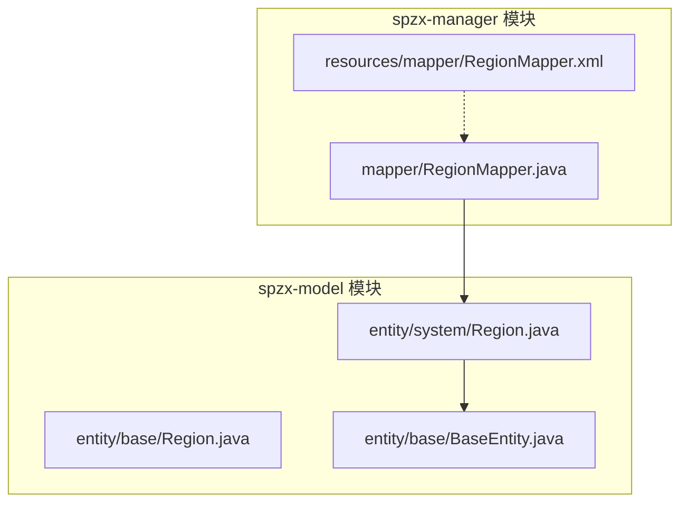
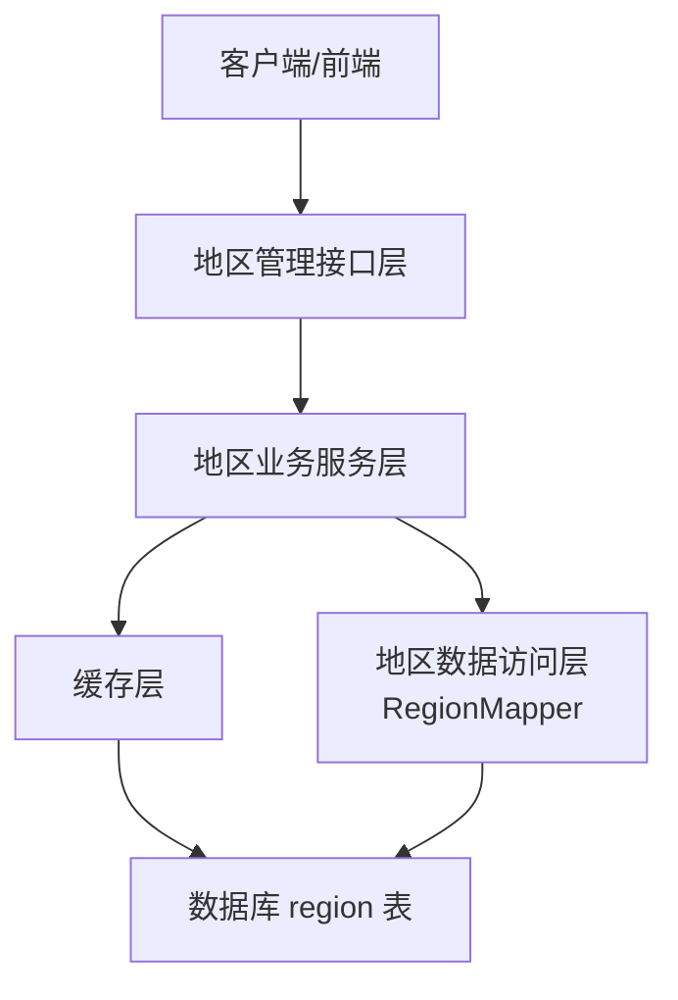
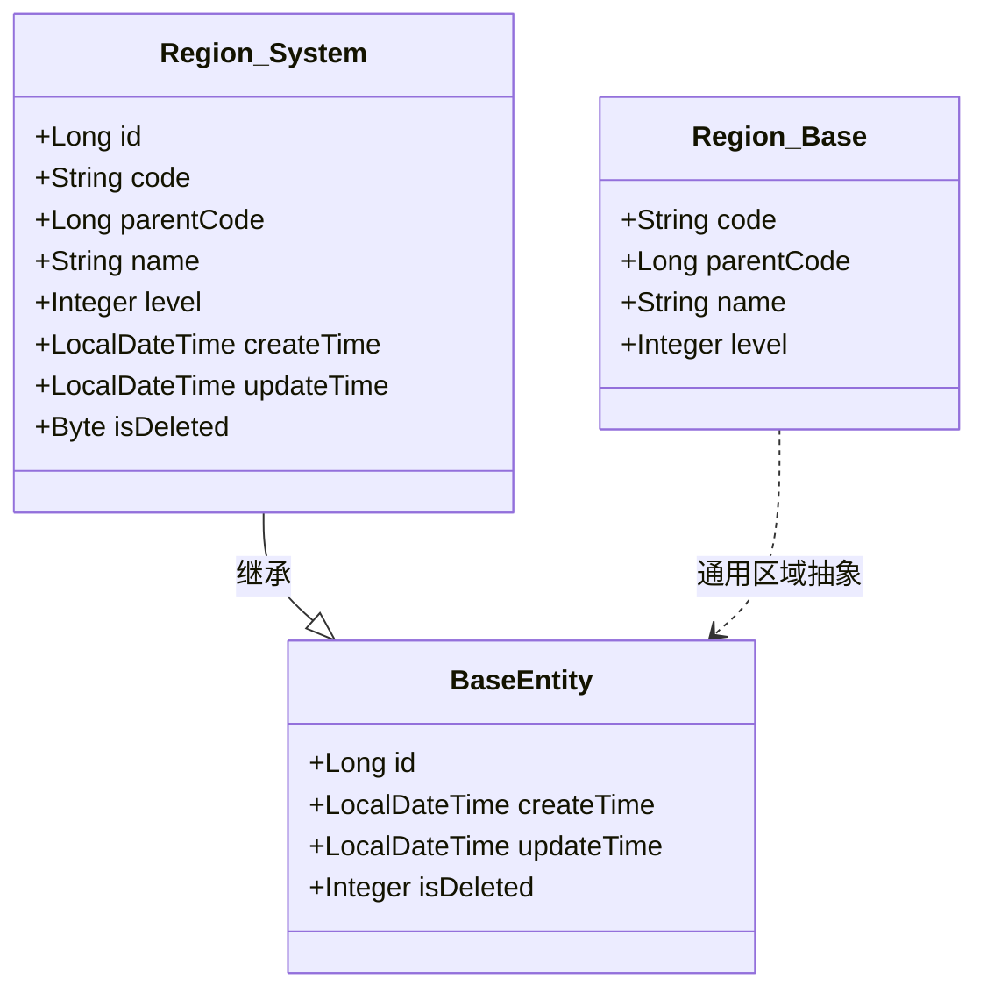
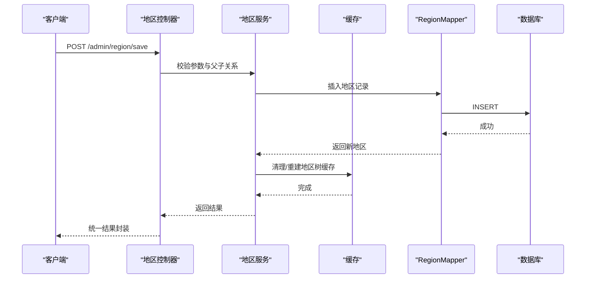
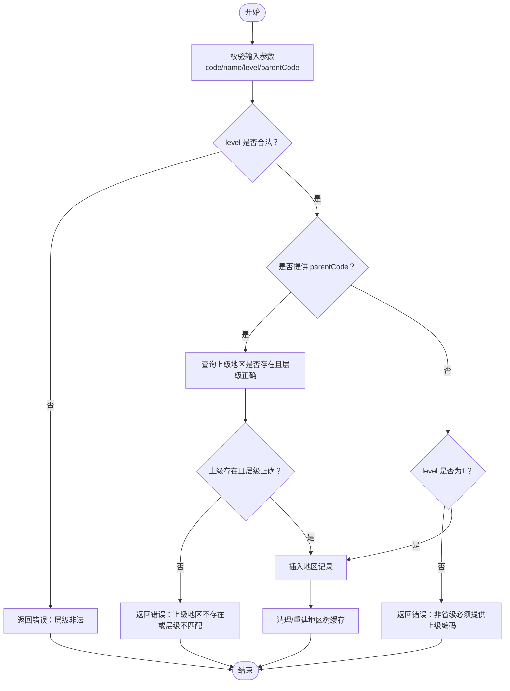

# 地区管理接口

<cite>
**本文引用的文件**
- [RegionMapper.java](file://spzx-manager/src/main/java/com/joker/spzx/manager/mapper/RegionMapper.java)
- [RegionMapper.xml](file://spzx-manager/src/main/resources/mapper/RegionMapper.xml)
- [Region.java（系统实体）](file://spzx-model/src/main/java/com/joker/spzx/model/entity/system/Region.java)
- [Region.java（基础实体）](file://spzx-model/src/main/java/com/joker/spzx/model/entity/base/Region.java)
- [BaseEntity.java](file://spzx-model/src/main/java/com/joker/spzx/model/entity/base/BaseEntity.java)
</cite>

## 目录
1. [简介](#简介)
2. [项目结构](#项目结构)
3. [核心组件](#核心组件)
4. [架构总览](#架构总览)
5. [详细组件分析](#详细组件分析)
6. [依赖分析](#依赖分析)
7. [性能考虑](#性能考虑)
8. [故障排查指南](#故障排查指南)
9. [结论](#结论)
10. [附录](#附录)

## 简介
本文件面向SPZX电商管理系统中的“地区管理”能力，基于当前仓库中已存在的地区数据模型与Mapper接口，梳理并设计一套完整的地区管理接口规范，覆盖省市区县联动、地区层级查询、父子关系查询、地区编码管理、地区信息维护（增删改查）、地区搜索与分页查询、以及缓存策略与性能优化建议。由于当前仓库尚未包含控制器与服务层实现，本文以“接口规范+数据模型+架构建议”的形式输出，便于后续开发落地。

## 项目结构
地区管理相关代码位于以下模块与包中：
- spzx-model：定义地区实体与基础实体
- spzx-manager：定义地区Mapper接口与MyBatis映射文件

图表来源
- [RegionMapper.java:1-18](file://spzx-manager/src/main/java/com/joker/spzx/manager/mapper/RegionMapper.java#L1-L18)
- [RegionMapper.xml:1-6](file://spzx-manager/src/main/resources/mapper/RegionMapper.xml#L1-L6)
- [Region.java（系统实体）:1-68](file://spzx-model/src/main/java/com/joker/spzx/model/entity/system/Region.java#L1-L68)
- [Region.java（基础实体）:1-22](file://spzx-model/src/main/java/com/joker/spzx/model/entity/base/Region.java#L1-L22)
- [BaseEntity.java:1-34](file://spzx-model/src/main/java/com/joker/spzx/model/entity/base/BaseEntity.java#L1-L34)

章节来源
- [RegionMapper.java:1-18](file://spzx-manager/src/main/java/com/joker/spzx/manager/mapper/RegionMapper.java#L1-L18)
- [RegionMapper.xml:1-6](file://spzx-manager/src/main/resources/mapper/RegionMapper.xml#L1-L6)
- [Region.java（系统实体）:1-68](file://spzx-model/src/main/java/com/joker/spzx/model/entity/system/Region.java#L1-L68)
- [Region.java（基础实体）:1-22](file://spzx-model/src/main/java/com/joker/spzx/model/entity/base/Region.java#L1-L22)
- [BaseEntity.java:1-34](file://spzx-model/src/main/java/com/joker/spzx/model/entity/base/BaseEntity.java#L1-L34)

## 核心组件
- 数据模型：系统实体Region（系统级地区表），包含地区编码、上级编码、名称、层级、时间戳与逻辑删除字段；基础实体Region（通用区域抽象），用于通用场景下的区域描述。
- 数据访问：RegionMapper继承MyBatis-Plus的BaseMapper，提供通用CRUD能力；RegionMapper.xml为空，需补充SQL语句。
- 关键字段说明
  - code：地区编码（唯一标识）
  - parent_code：上级地区编码（自关联）
  - level：地区层级（1-省/自治区/直辖市；2-地级市/地区/自治州/盟；3-市辖区/县级市/县）
  - is_deleted：逻辑删除标记
  - create_time/update_time：创建与更新时间

章节来源
- [Region.java（系统实体）:31-61](file://spzx-model/src/main/java/com/joker/spzx/model/entity/system/Region.java#L31-L61)
- [Region.java（基础实体）:10-20](file://spzx-model/src/main/java/com/joker/spzx/model/entity/base/Region.java#L10-L20)
- [BaseEntity.java:16-32](file://spzx-model/src/main/java/com/joker/spzx/model/entity/base/BaseEntity.java#L16-L32)
- [RegionMapper.java:15-16](file://spzx-manager/src/main/java/com/joker/spzx/manager/mapper/RegionMapper.java#L15-L16)
- [RegionMapper.xml:3-5](file://spzx-manager/src/main/resources/mapper/RegionMapper.xml#L3-L5)

## 架构总览
地区管理接口建议采用“控制器-服务-数据访问层”的分层架构，并结合缓存策略提升查询性能。下图展示概念性架构与数据流：

说明
- 控制器：负责接收HTTP请求、参数校验、调用服务层、返回统一结果封装
- 服务层：处理业务规则（如层级校验、父子关系校验、编码唯一性校验）
- 缓存层：缓存地区树、地区字典、父子关系映射，减少数据库压力
- 数据库：存储地区编码、名称、层级、父子关系与时间戳

## 详细组件分析

### 数据模型与层级关系
地区实体采用“编码+层级+父子关系”的设计，支持三级联动（省-市-区县）。建议在服务层构建“地区树”结构，便于前端级联选择。

图表来源
- [Region.java（系统实体）:23-67](file://spzx-model/src/main/java/com/joker/spzx/model/entity/system/Region.java#L23-L67)
- [Region.java（基础实体）:8-22](file://spzx-model/src/main/java/com/joker/spzx/model/entity/base/Region.java#L8-L22)
- [BaseEntity.java:14-33](file://spzx-model/src/main/java/com/joker/spzx/model/entity/base/BaseEntity.java#L14-L33)

章节来源
- [Region.java（系统实体）:23-67](file://spzx-model/src/main/java/com/joker/spzx/model/entity/system/Region.java#L23-L67)
- [Region.java（基础实体）:8-22](file://spzx-model/src/main/java/com/joker/spzx/model/entity/base/Region.java#L8-L22)
- [BaseEntity.java:14-33](file://spzx-model/src/main/java/com/joker/spzx/model/entity/base/BaseEntity.java#L14-L33)

### 接口设计规范（建议）

- 基础路径
  - 建议前缀：/admin/region
  - 统一响应：使用系统统一结果封装（Result）

- 查询类接口
  - 获取地区树（省市区县全量）
    - 方法：GET
    - 路径：/admin/region/tree
    - 参数：无
    - 返回：地区树结构（根节点为全国，子节点按层级展开）
  - 获取某级地区列表
    - 方法：GET
    - 路径：/admin/region/listByLevel
    - 查询参数：level（1/2/3）、parentCode（可选，若level=1则可不传）
    - 返回：该层级下所有地区列表
  - 获取父子关系
    - 方法：GET
    - 路径：/admin/region/children/{parentCode}
    - 路径参数：parentCode（上级地区编码）
    - 返回：直接子级地区列表
  - 按编码查询
    - 方法：GET
    - 路径：/admin/region/code/{code}
    - 路径参数：code（地区编码）
    - 返回：单个地区详情
  - 搜索与分页
    - 方法：GET
    - 路径：/admin/region/page
    - 查询参数：code/name关键字、level、parentCode、pageNum、pageSize
    - 返回：分页结果（含总数与列表）

- 维护类接口
  - 新增地区
    - 方法：POST
    - 路径：/admin/region/save
    - 请求体：地区对象（code、name、level、parentCode）
    - 返回：新增成功与否
  - 更新地区
    - 方法：PUT
    - 路径：/admin/region/update
    - 请求体：地区对象（id或code必填，其余字段可选）
    - 返回：更新成功与否
  - 删除地区
    - 方法：DELETE
    - 路径：/admin/region/remove/{id}
    - 路径参数：id（地区主键）
    - 返回：删除成功与否（建议软删除）

- 数据同步与实时更新
  - 后台导入/导出：提供Excel导入模板与批量导入接口
  - 实时更新：监听地区变更事件，清理相关缓存并广播更新
  - 广播机制：通过消息队列或事件总线通知各模块刷新本地缓存

- 接口调用序列示意（新增地区为例）

说明
- 该图为概念流程，具体实现需在服务层完成参数校验、父子关系合法性校验与缓存更新。

### 复杂逻辑流程（父子关系校验）

## 依赖分析
- 组件耦合
  - RegionMapper依赖系统实体Region（系统级地区表）
  - RegionMapper.xml为空，需补充SQL（如按层级查询、父子关系查询、树形构建等）
- 外部依赖
  - MyBatis-Plus：提供通用CRUD与分页能力
  - Spring Boot：提供Web与自动配置能力
  - Swagger/OpenAPI：用于接口文档生成（可选）

图表来源
- [RegionMapper.xml:3-5](file://spzx-manager/src/main/resources/mapper/RegionMapper.xml#L3-L5)
- [RegionMapper.java:15-16](file://spzx-manager/src/main/java/com/joker/spzx/manager/mapper/RegionMapper.java#L15-L16)
- [Region.java（系统实体）:23-67](file://spzx-model/src/main/java/com/joker/spzx/model/entity/system/Region.java#L23-L67)

章节来源
- [RegionMapper.xml:1-6](file://spzx-manager/src/main/resources/mapper/RegionMapper.xml#L1-L6)
- [RegionMapper.java:1-18](file://spzx-manager/src/main/java/com/joker/spzx/manager/mapper/RegionMapper.java#L1-L18)
- [Region.java（系统实体）:1-68](file://spzx-model/src/main/java/com/joker/spzx/model/entity/system/Region.java#L1-L68)

## 性能考虑
- 查询优化
  - 建立索引：对code、parentCode、level建立复合索引，加速层级查询与父子关系查询
  - 分页查询：默认每页大小限制（如100条），避免一次性加载全量数据
- 缓存策略
  - 地区树缓存：以“全国树”为Key，定期刷新或事件驱动失效
  - 字典缓存：按level缓存各层级地区列表，减少重复查询
  - 父子映射缓存：parentCode -> 子列表，提高级联查询效率
- 写入优化
  - 批量导入：提供Excel模板与批量写入接口，减少频繁小事务
  - 异步更新：写入后异步清理缓存，降低请求延迟
- 监控与告警
  - 对慢查询与高并发场景进行监控，设置阈值告警

## 故障排查指南
- 常见问题
  - 上级地区缺失或层级不匹配：检查parentCode与level是否一致
  - 编码冲突：确保code唯一性，新增/更新时进行唯一性校验
  - 查询性能差：确认索引是否生效，必要时调整分页参数
- 日志与异常
  - 使用统一异常处理器捕获并记录异常，返回标准化错误信息
  - 记录关键操作日志（新增/修改/删除），便于审计与回溯

## 结论
本文基于现有数据模型与Mapper接口，给出了地区管理接口的完整设计建议，包括层级查询、父子关系、编码管理、增删改查、搜索分页、缓存策略与性能优化。建议尽快补齐服务层与控制器实现，并完善RegionMapper.xml中的SQL语句，以支撑后续业务迭代与扩展。

## 附录
- 响应示例（概念）
  - 成功：{"code":200,"message":"success","data":{}}
  - 失败：{"code":400,"message":"参数错误","data":null}
- 建议的数据库索引
  - idx_code：(code)
  - idx_parent_level：(parentCode, level)
  - idx_level：(level)