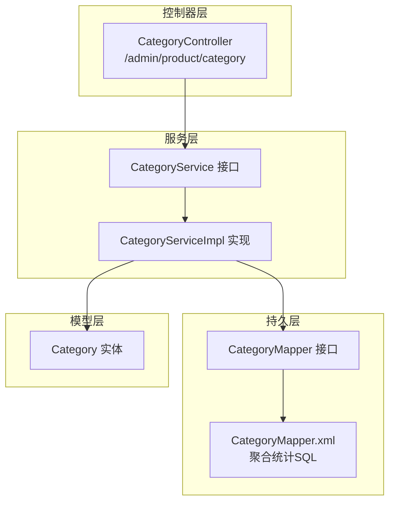
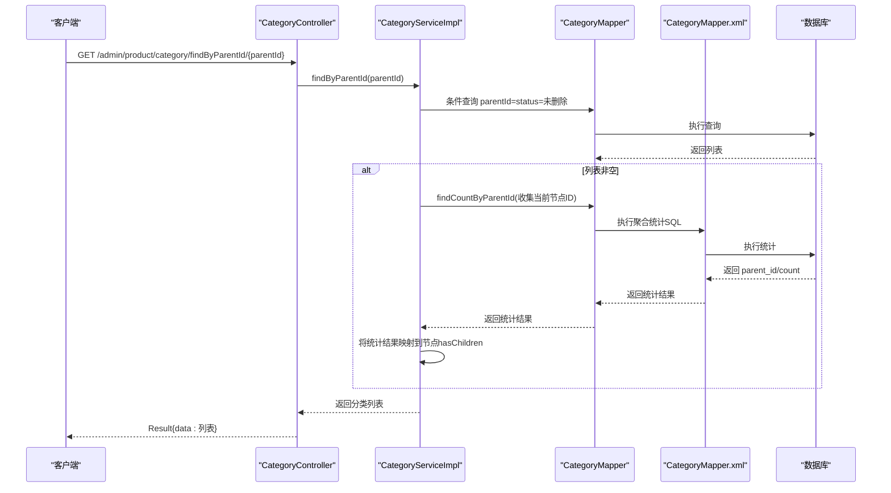
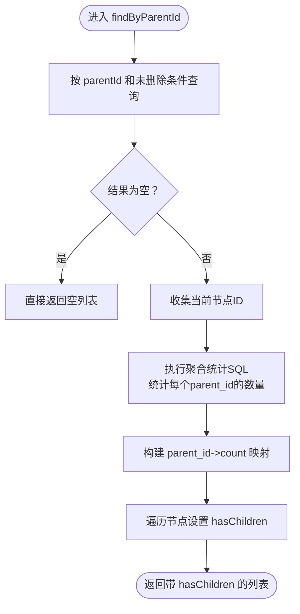
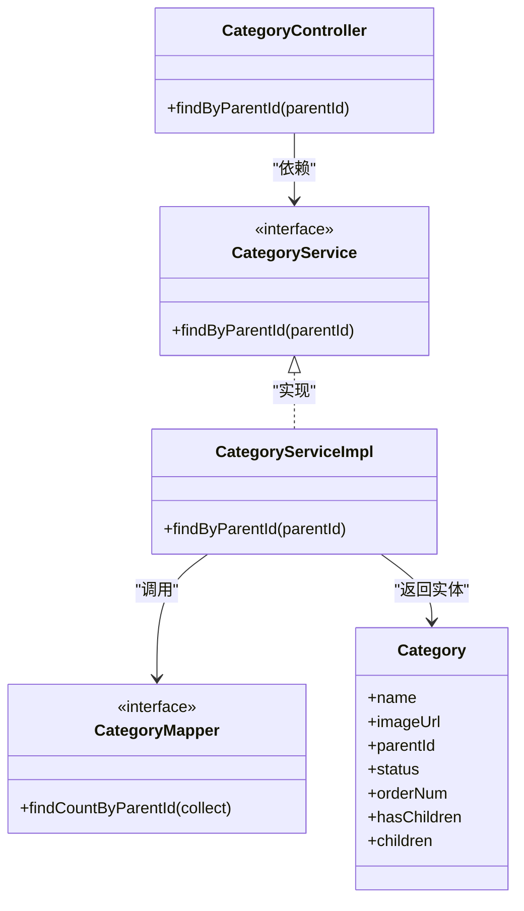
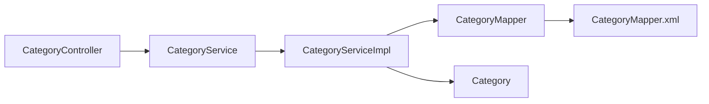

# 分类接口

<cite>
**本文引用的文件**
- [CategoryController.java](file://spzx-manager/src/main/java/com/joker/spzx/manager/controller/CategoryController.java)
- [CategoryService.java](file://spzx-manager/src/main/java/com/joker/spzx/manager/service/CategoryService.java)
- [CategoryServiceImpl.java](file://spzx-manager/src/main/java/com/joker/spzx/manager/service/impl/CategoryServiceImpl.java)
- [CategoryMapper.java](file://spzx-manager/src/main/java/com/joker/spzx/manager/mapper/CategoryMapper.java)
- [CategoryMapper.xml](file://spzx-manager/src/main/resources/mapper/CategoryMapper.xml)
- [Category.java](file://spzx-model/src/main/java/com/joker/spzx/model/entity/product/Category.java)
</cite>

## 目录
1. [简介](#简介)
2. [项目结构](#项目结构)
3. [核心组件](#核心组件)
4. [架构总览](#架构总览)
5. [详细组件分析](#详细组件分析)
6. [依赖分析](#依赖分析)
7. [性能考虑](#性能考虑)
8. [故障排查指南](#故障排查指南)
9. [结论](#结论)

## 简介
本文件为 SPZX 电商管理系统的“分类管理”接口文档，聚焦于商品分类的树形结构查询与父子关系处理能力。当前代码库中已实现按父级 ID 查询下级节点的接口，并在服务层通过一次额外的 SQL 统计聚合判断是否存在子节点，从而支持前端渲染树形结构时的展开/收起状态。

需要注意的是：当前仓库中仅实现了“根据父级 ID 获取下级节点”的单一接口；未包含分类新增、修改、删除、树形全量查询、状态批量控制、分类与商品关联查询等扩展能力。后续如需完善，请参考本文档的“详细组件分析”中的设计建议进行扩展。

## 项目结构
围绕分类管理的相关模块分布如下：
- 控制器层：负责接收 HTTP 请求并返回统一结果包装
- 服务层：封装业务逻辑，包括父子关系判断
- 持久层：MyBatis Mapper 负责基础 CRUD 与聚合统计
- 实体模型：描述数据库表结构及序列化字段

图表来源
- [CategoryController.java:27-38](file://spzx-manager/src/main/java/com/joker/spzx/manager/controller/CategoryController.java#L27-L38)
- [CategoryService.java:16-18](file://spzx-manager/src/main/java/com/joker/spzx/manager/service/CategoryService.java#L16-L18)
- [CategoryServiceImpl.java:24-42](file://spzx-manager/src/main/java/com/joker/spzx/manager/service/impl/CategoryServiceImpl.java#L24-L42)
- [CategoryMapper.java:20-22](file://spzx-manager/src/main/java/com/joker/spzx/manager/mapper/CategoryMapper.java#L20-L22)
- [CategoryMapper.xml:5-10](file://spzx-manager/src/main/resources/mapper/CategoryMapper.xml#L5-L10)
- [Category.java:14-42](file://spzx-model/src/main/java/com/joker/spzx/model/entity/product/Category.java#L14-L42)

章节来源
- [CategoryController.java:27-38](file://spzx-manager/src/main/java/com/joker/spzx/manager/controller/CategoryController.java#L27-L38)
- [CategoryService.java:16-18](file://spzx-manager/src/main/java/com/joker/spzx/manager/service/CategoryService.java#L16-L18)
- [CategoryServiceImpl.java:24-42](file://spzx-manager/src/main/java/com/joker/spzx/manager/service/impl/CategoryServiceImpl.java#L24-L42)
- [CategoryMapper.java:20-22](file://spzx-manager/src/main/java/com/joker/spzx/manager/mapper/CategoryMapper.java#L20-L22)
- [CategoryMapper.xml:5-10](file://spzx-manager/src/main/resources/mapper/CategoryMapper.xml#L5-L10)
- [Category.java:14-42](file://spzx-model/src/main/java/com/joker/spzx/model/entity/product/Category.java#L14-L42)

## 核心组件
- 控制器：提供 HTTP 接口，接收父级 ID 参数，调用服务层查询并返回统一结果包装
- 服务层：执行基础查询与聚合统计，判断是否存在子节点
- 持久层：提供基础分页/条件查询能力与聚合统计 SQL
- 实体模型：映射数据库字段，包含“是否存在子节点”和“子节点列表”用于树形渲染

章节来源
- [CategoryController.java:27-38](file://spzx-manager/src/main/java/com/joker/spzx/manager/controller/CategoryController.java#L27-L38)
- [CategoryService.java:16-18](file://spzx-manager/src/main/java/com/joker/spzx/manager/service/CategoryService.java#L16-L18)
- [CategoryServiceImpl.java:24-42](file://spzx-manager/src/main/java/com/joker/spzx/manager/service/impl/CategoryServiceImpl.java#L24-L42)
- [CategoryMapper.java:20-22](file://spzx-manager/src/main/java/com/joker/spzx/manager/mapper/CategoryMapper.java#L20-L22)
- [Category.java:14-42](file://spzx-model/src/main/java/com/joker/spzx/model/entity/product/Category.java#L14-L42)

## 架构总览
以下序列图展示了“按父级 ID 获取下级节点”的完整调用链路：

图表来源
- [CategoryController.java:33-38](file://spzx-manager/src/main/java/com/joker/spzx/manager/controller/CategoryController.java#L33-L38)
- [CategoryServiceImpl.java:27-42](file://spzx-manager/src/main/java/com/joker/spzx/manager/service/impl/CategoryServiceImpl.java#L27-L42)
- [CategoryMapper.java:22](file://spzx-manager/src/main/java/com/joker/spzx/manager/mapper/CategoryMapper.java#L22)
- [CategoryMapper.xml:5-10](file://spzx-manager/src/main/resources/mapper/CategoryMapper.xml#L5-L10)

## 详细组件分析

### 接口定义
- HTTP 方法：GET
- URL 模式：/admin/product/category/findByParentId/{parentId}
- 请求参数：
  - 路径变量：parentId（父级分类 ID）
- 响应格式：统一结果包装，data 字段为分类列表
  - 列表元素包含：分类名称、父级 ID、状态、排序、是否存在子节点、子节点列表等

章节来源
- [CategoryController.java:33-38](file://spzx-manager/src/main/java/com/joker/spzx/manager/controller/CategoryController.java#L33-L38)

### 数据模型与字段说明
- 实体类：Category
- 关键字段：
  - 名称：name
  - 图片地址：imageUrl
  - 父级 ID：parentId
  - 状态：status（0-不显示，1显示）
  - 排序：orderNum
  - 是否存在子节点：hasChildren（非持久化字段）
  - 子节点列表：children（非持久化字段）

章节来源
- [Category.java:16-42](file://spzx-model/src/main/java/com/joker/spzx/model/entity/product/Category.java#L16-L42)

### 服务层处理逻辑
- 基础查询：按 parentId 查询未删除的子节点
- 聚合统计：对当前节点集合执行 parent_id 聚合统计，得到每个节点的子数量
- 结果映射：将统计结果映射到节点的 hasChildren 字段，用于前端树形渲染

图表来源
- [CategoryServiceImpl.java:27-42](file://spzx-manager/src/main/java/com/joker/spzx/manager/service/impl/CategoryServiceImpl.java#L27-L42)
- [CategoryMapper.xml:5-10](file://spzx-manager/src/main/resources/mapper/CategoryMapper.xml#L5-L10)

章节来源
- [CategoryServiceImpl.java:27-42](file://spzx-manager/src/main/java/com/joker/spzx/manager/service/impl/CategoryServiceImpl.java#L27-L42)
- [CategoryMapper.xml:5-10](file://spzx-manager/src/main/resources/mapper/CategoryMapper.xml#L5-L10)

### 类关系图

图表来源
- [CategoryController.java:27-38](file://spzx-manager/src/main/java/com/joker/spzx/manager/controller/CategoryController.java#L27-L38)
- [CategoryService.java:16-18](file://spzx-manager/src/main/java/com/joker/spzx/manager/service/CategoryService.java#L16-L18)
- [CategoryServiceImpl.java:24-42](file://spzx-manager/src/main/java/com/joker/spzx/manager/service/impl/CategoryServiceImpl.java#L24-L42)
- [CategoryMapper.java:20-22](file://spzx-manager/src/main/java/com/joker/spzx/manager/mapper/CategoryMapper.java#L20-L22)
- [Category.java:14-42](file://spzx-model/src/main/java/com/joker/spzx/model/entity/product/Category.java#L14-L42)

## 依赖分析
- 控制器依赖服务接口
- 服务实现依赖 Mapper 接口
- Mapper 通过 XML 文件提供聚合统计 SQL
- 实体类映射数据库表字段

图表来源
- [CategoryController.java:27-38](file://spzx-manager/src/main/java/com/joker/spzx/manager/controller/CategoryController.java#L27-L38)
- [CategoryService.java:16-18](file://spzx-manager/src/main/java/com/joker/spzx/manager/service/CategoryService.java#L16-L18)
- [CategoryServiceImpl.java:24-42](file://spzx-manager/src/main/java/com/joker/spzx/manager/service/impl/CategoryServiceImpl.java#L24-L42)
- [CategoryMapper.java:20-22](file://spzx-manager/src/main/java/com/joker/spzx/manager/mapper/CategoryMapper.java#L20-L22)
- [CategoryMapper.xml:5-10](file://spzx-manager/src/main/resources/mapper/CategoryMapper.xml#L5-L10)
- [Category.java:14-42](file://spzx-model/src/main/java/com/joker/spzx/model/entity/product/Category.java#L14-L42)

章节来源
- [CategoryController.java:27-38](file://spzx-manager/src/main/java/com/joker/spzx/manager/controller/CategoryController.java#L27-L38)
- [CategoryService.java:16-18](file://spzx-manager/src/main/java/com/joker/spzx/manager/service/CategoryService.java#L16-L18)
- [CategoryServiceImpl.java:24-42](file://spzx-manager/src/main/java/com/joker/spzx/manager/service/impl/CategoryServiceImpl.java#L24-L42)
- [CategoryMapper.java:20-22](file://spzx-manager/src/main/java/com/joker/spzx/manager/mapper/CategoryMapper.java#L20-L22)
- [CategoryMapper.xml:5-10](file://spzx-manager/src/main/resources/mapper/CategoryMapper.xml#L5-L10)
- [Category.java:14-42](file://spzx-model/src/main/java/com/joker/spzx/model/entity/product/Category.java#L14-L42)

## 性能考虑
- 单次查询后进行一次聚合统计，避免 N+1 查询问题
- 使用流式收集与映射，减少中间对象开销
- 建议在数据库为 parent_id 字段建立索引以提升统计效率

## 故障排查指南
- 若返回列表为空但期望有数据：
  - 检查 parentId 是否正确
  - 确认数据库中该节点未被标记为删除
- 若 hasChildren 字段始终为 false：
  - 检查聚合统计 SQL 是否正确执行
  - 确认子节点的 parent_id 与当前节点 id 匹配
- 若出现性能问题：
  - 优化数据库索引
  - 考虑缓存热点父节点的子节点列表

## 结论
当前系统已具备“按父级 ID 获取下级节点”的核心能力，并通过聚合统计高效标注“是否存在子节点”，满足前端树形渲染的基本需求。若需进一步完善分类管理能力（如树形全量查询、新增/修改/删除、状态批量控制、分类与商品关联查询），可在现有架构基础上扩展服务层与持久层接口，并补充相应的控制器接口与 DTO。