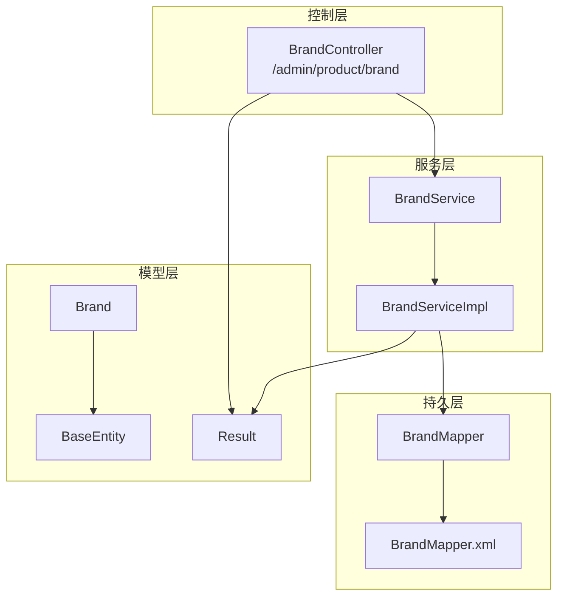
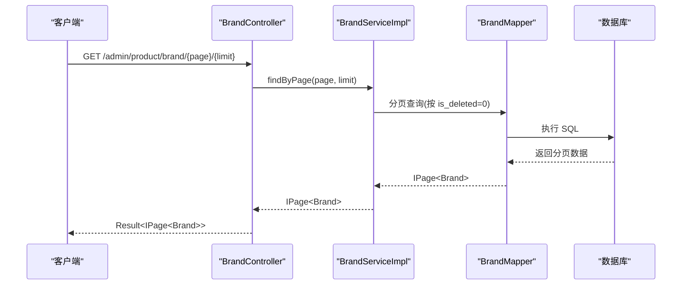
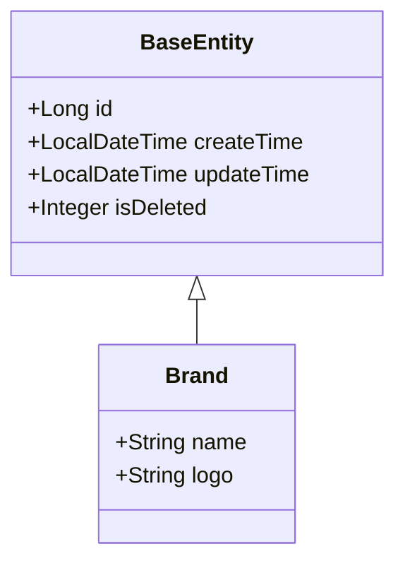
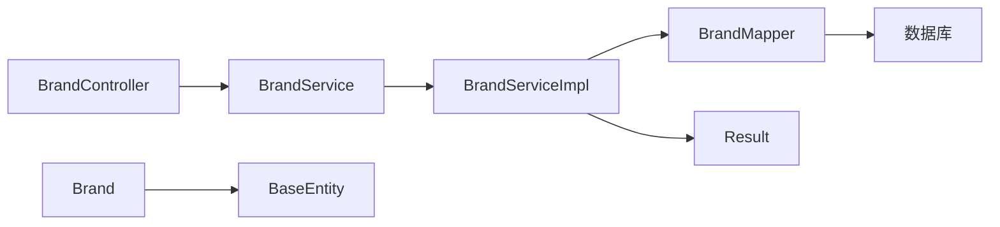

# 品牌接口

<cite>
**本文引用的文件**
- [BrandController.java](file://spzx-manager/src/main/java/com/joker/spzx/manager/controller/BrandController.java)
- [BrandService.java](file://spzx-manager/src/main/java/com/joker/spzx/manager/service/BrandService.java)
- [BrandServiceImpl.java](file://spzx-manager/src/main/java/com/joker/spzx/manager/service/impl/BrandServiceImpl.java)
- [BrandMapper.java](file://spzx-manager/src/main/java/com/joker/spzx/manager/mapper/BrandMapper.java)
- [BrandMapper.xml](file://spzx-manager/src/main/resources/mapper/BrandMapper.xml)
- [Brand.java](file://spzx-model/src/main/java/com/joker/spzx/model/entity/product/Brand.java)
- [BaseEntity.java](file://spzx-model/src/main/java/com/joker/spzx/model/entity/base/BaseEntity.java)
- [Result.java](file://spzx-model/src/main/java/com/joker/spzx/model/vo/common/Result.java)
- [application.yml](file://spzx-manager/src/main/resources/application.yml)
</cite>

## 目录
1. [简介](#简介)
2. [项目结构](#项目结构)
3. [核心组件](#核心组件)
4. [架构总览](#架构总览)
5. [详细组件分析](#详细组件分析)
6. [依赖分析](#依赖分析)
7. [性能考虑](#性能考虑)
8. [故障排查指南](#故障排查指南)
9. [结论](#结论)
10. [附录](#附录)

## 简介
本文件为 SPZX 电商管理系统中的“品牌管理”接口文档，聚焦于品牌模块的 API 定义与数据模型说明。当前仓库中已实现品牌分页查询与全量查询接口；同时提供了品牌与分类关联的查询能力。本文档将明确各接口的 HTTP 方法、URL 模式、请求参数、响应格式及错误处理方式，并对品牌数据结构、搜索过滤与分页机制进行说明。

## 项目结构
品牌相关能力由“控制层-服务层-持久层-模型层”四层构成，采用 Spring Boot + MyBatis-Plus 架构，统一使用 Result 包装响应体。

图示来源
- [BrandController.java:28-46](file://spzx-manager/src/main/java/com/joker/spzx/manager/controller/BrandController.java#L28-L46)
- [BrandService.java:17-22](file://spzx-manager/src/main/java/com/joker/spzx/manager/service/BrandService.java#L17-L22)
- [BrandServiceImpl.java:23-38](file://spzx-manager/src/main/java/com/joker/spzx/manager/service/impl/BrandServiceImpl.java#L23-L38)
- [BrandMapper.java:15-18](file://spzx-manager/src/main/java/com/joker/spzx/manager/mapper/BrandMapper.java#L15-L18)
- [BrandMapper.xml:1-6](file://spzx-manager/src/main/resources/mapper/BrandMapper.xml#L1-L6)
- [Brand.java:12-21](file://spzx-model/src/main/java/com/joker/spzx/model/entity/product/Brand.java#L12-L21)
- [BaseEntity.java:14-34](file://spzx-model/src/main/java/com/joker/spzx/model/entity/base/BaseEntity.java#L14-L34)
- [Result.java:8-44](file://spzx-model/src/main/java/com/joker/spzx/model/vo/common/Result.java#L8-L44)

章节来源
- [BrandController.java:28-46](file://spzx-manager/src/main/java/com/joker/spzx/manager/controller/BrandController.java#L28-L46)
- [BrandService.java:17-22](file://spzx-manager/src/main/java/com/joker/spzx/manager/service/BrandService.java#L17-L22)
- [BrandServiceImpl.java:23-38](file://spzx-manager/src/main/java/com/joker/spzx/manager/service/impl/BrandServiceImpl.java#L23-L38)
- [BrandMapper.java:15-18](file://spzx-manager/src/main/java/com/joker/spzx/manager/mapper/BrandMapper.java#L15-L18)
- [BrandMapper.xml:1-6](file://spzx-manager/src/main/resources/mapper/BrandMapper.xml#L1-L6)
- [Brand.java:12-21](file://spzx-model/src/main/java/com/joker/spzx/model/entity/product/Brand.java#L12-L21)
- [BaseEntity.java:14-34](file://spzx-model/src/main/java/com/joker/spzx/model/entity/base/BaseEntity.java#L14-L34)
- [Result.java:8-44](file://spzx-model/src/main/java/com/joker/spzx/model/vo/common/Result.java#L8-L44)

## 核心组件
- 控制器：负责接收请求、调用服务层并封装响应。
- 服务接口与实现：定义分页查询与全量查询能力，内部完成分页与软删除过滤。
- 持久层：基于 MyBatis-Plus 的通用 Mapper，BrandMapper.xml 提供空实现（默认走通用 CRUD）。
- 数据模型：Brand 继承 BaseEntity，包含 id、创建/更新时间、逻辑删除标记以及品牌名称与 logo 字段。
- 响应包装：Result 统一返回 code、message、data 结构。

章节来源
- [BrandController.java:28-46](file://spzx-manager/src/main/java/com/joker/spzx/manager/controller/BrandController.java#L28-L46)
- [BrandService.java:17-22](file://spzx-manager/src/main/java/com/joker/spzx/manager/service/BrandService.java#L17-L22)
- [BrandServiceImpl.java:23-38](file://spzx-manager/src/main/java/com/joker/spzx/manager/service/impl/BrandServiceImpl.java#L23-L38)
- [BrandMapper.java:15-18](file://spzx-manager/src/main/java/com/joker/spzx/manager/mapper/BrandMapper.java#L15-L18)
- [BrandMapper.xml:1-6](file://spzx-manager/src/main/resources/mapper/BrandMapper.xml#L1-L6)
- [Brand.java:12-21](file://spzx-model/src/main/java/com/joker/spzx/model/entity/product/Brand.java#L12-L21)
- [BaseEntity.java:14-34](file://spzx-model/src/main/java/com/joker/spzx/model/entity/base/BaseEntity.java#L14-L34)
- [Result.java:8-44](file://spzx-model/src/main/java/com/joker/spzx/model/vo/common/Result.java#L8-L44)

## 架构总览
品牌模块遵循标准的 MVC 分层架构，控制层仅暴露查询接口，未包含新增、修改、删除等写操作接口。

图示来源
- [BrandController.java:33-38](file://spzx-manager/src/main/java/com/joker/spzx/manager/controller/BrandController.java#L33-L38)
- [BrandServiceImpl.java:25-31](file://spzx-manager/src/main/java/com/joker/spzx/manager/service/impl/BrandServiceImpl.java#L25-L31)
- [BrandMapper.java:15-18](file://spzx-manager/src/main/java/com/joker/spzx/manager/mapper/BrandMapper.java#L15-L18)

## 详细组件分析

### 品牌数据模型
品牌实体继承自 BaseEntity，包含以下关键字段：
- id：主键
- createTime、updateTime：创建与更新时间
- isDeleted：逻辑删除标记
- name：品牌名称
- logo：品牌图标

图示来源
- [BaseEntity.java:14-34](file://spzx-model/src/main/java/com/joker/spzx/model/entity/base/BaseEntity.java#L14-L34)
- [Brand.java:12-21](file://spzx-model/src/main/java/com/joker/spzx/model/entity/product/Brand.java#L12-L21)

章节来源
- [BaseEntity.java:14-34](file://spzx-model/src/main/java/com/joker/spzx/model/entity/base/BaseEntity.java#L14-L34)
- [Brand.java:12-21](file://spzx-model/src/main/java/com/joker/spzx/model/entity/product/Brand.java#L12-L21)

### 品牌接口定义

- 基础路径
  - 品牌管理：/admin/product/brand

- 查询品牌分页列表
  - 方法：GET
  - 路径：/admin/product/brand/{page}/{limit}
  - 路径参数：
    - page：页码（从 1 开始）
    - limit：每页条数
  - 响应：
    - data：IPage<Brand>，包含 records、total、size、current 等分页信息
    - code：业务状态码
    - message：响应消息
  - 过滤条件：
    - 默认过滤：isDeleted=0（逻辑未删除）
  - 示例响应结构（字段名以实际返回为准）：
    - code：200
    - message："成功"
    - data：{
        "records": [...],
        "total": 100,
        "size": 10,
        "current": 1
      }

- 查询品牌全量列表
  - 方法：GET
  - 路径：/admin/product/brand/findAll
  - 响应：
    - data：List<Brand>
    - code：200
    - message："成功"
  - 过滤条件：
    - 默认过滤：isDeleted=0（逻辑未删除）

章节来源
- [BrandController.java:33-44](file://spzx-manager/src/main/java/com/joker/spzx/manager/controller/BrandController.java#L33-L44)
- [BrandServiceImpl.java:25-37](file://spzx-manager/src/main/java/com/joker/spzx/manager/service/impl/BrandServiceImpl.java#L25-L37)
- [Result.java:8-44](file://spzx-model/src/main/java/com/joker/spzx/model/vo/common/Result.java#L8-L44)

### 品牌搜索与过滤说明
- 当前品牌查询接口未提供显式的查询参数（如品牌名称模糊匹配），仅支持分页与全量查询。
- 默认过滤 isDeleted=0，确保不返回已逻辑删除的品牌数据。
- 若需扩展搜索条件（如按名称过滤），可在服务层增加相应查询条件并在控制器暴露对应参数。

章节来源
- [BrandServiceImpl.java:25-37](file://spzx-manager/src/main/java/com/joker/spzx/manager/service/impl/BrandServiceImpl.java#L25-L37)

### 品牌状态管理与批量操作
- 逻辑删除：isDeleted 字段用于软删除，查询时默认过滤未删除记录。
- 新增/修改/删除接口：当前未在 BrandController 中实现，若需支持请参考标准 CRUD 控制器模式扩展。
- 批量操作：当前未提供批量接口，可基于现有分页查询与逻辑删除策略扩展。

章节来源
- [BaseEntity.java:30-32](file://spzx-model/src/main/java/com/joker/spzx/model/entity/base/BaseEntity.java#L30-L32)
- [BrandController.java:28-46](file://spzx-manager/src/main/java/com/joker/spzx/manager/controller/BrandController.java#L28-L46)

### 品牌关联商品查询（补充说明）
- 当前仓库未提供直接“品牌关联商品”的查询接口。
- 可通过“分类-品牌”关联表进行扩展：先根据分类查询品牌，再结合商品与分类的关联进行商品筛选。
- 若需要该能力，建议在 CategoryBrand 相关接口基础上扩展品牌到商品的查询链路。

章节来源
- [BrandController.java:28-46](file://spzx-manager/src/main/java/com/joker/spzx/manager/controller/BrandController.java#L28-L46)

## 依赖分析
- 控制层依赖服务层接口，服务层依赖 Mapper 与 MyBatis-Plus 的分页与查询能力。
- 响应统一由 Result 包装，便于前端统一处理。
- 品牌实体继承 BaseEntity，复用通用字段与注解。

图示来源
- [BrandController.java:28-46](file://spzx-manager/src/main/java/com/joker/spzx/manager/controller/BrandController.java#L28-L46)
- [BrandService.java:17-22](file://spzx-manager/src/main/java/com/joker/spzx/manager/service/BrandService.java#L17-L22)
- [BrandServiceImpl.java:23-38](file://spzx-manager/src/main/java/com/joker/spzx/manager/service/impl/BrandServiceImpl.java#L23-L38)
- [BrandMapper.java:15-18](file://spzx-manager/src/main/java/com/joker/spzx/manager/mapper/BrandMapper.java#L15-L18)
- [Brand.java:12-21](file://spzx-model/src/main/java/com/joker/spzx/model/entity/product/Brand.java#L12-L21)
- [BaseEntity.java:14-34](file://spzx-model/src/main/java/com/joker/spzx/model/entity/base/BaseEntity.java#L14-L34)
- [Result.java:8-44](file://spzx-model/src/main/java/com/joker/spzx/model/vo/common/Result.java#L8-L44)

章节来源
- [BrandController.java:28-46](file://spzx-manager/src/main/java/com/joker/spzx/manager/controller/BrandController.java#L28-L46)
- [BrandService.java:17-22](file://spzx-manager/src/main/java/com/joker/spzx/manager/service/BrandService.java#L17-L22)
- [BrandServiceImpl.java:23-38](file://spzx-manager/src/main/java/com/joker/spzx/manager/service/impl/BrandServiceImpl.java#L23-L38)
- [BrandMapper.java:15-18](file://spzx-manager/src/main/java/com/joker/spzx/manager/mapper/BrandMapper.java#L15-L18)
- [Brand.java:12-21](file://spzx-model/src/main/java/com/joker/spzx/model/entity/product/Brand.java#L12-L21)
- [BaseEntity.java:14-34](file://spzx-model/src/main/java/com/joker/spzx/model/entity/base/BaseEntity.java#L14-L34)
- [Result.java:8-44](file://spzx-model/src/main/java/com/joker/spzx/model/vo/common/Result.java#L8-L44)

## 性能考虑
- 分页查询：使用 MyBatis-Plus Page 对象进行分页，避免一次性加载大量数据。
- 条件过滤：默认 isDeleted=0，减少无效数据扫描。
- 建议：
  - 如需按名称过滤，可在服务层增加 like 或模糊匹配条件，并配合索引优化。
  - 全量查询仅适用于小规模数据集；大规模场景建议使用分页或带条件的查询。

## 故障排查指南
- 常见问题
  - 404：路径拼写错误或未正确配置基础路径。
  - 500：数据库连接异常或 SQL 执行失败。
  - 无数据：确认 isDeleted 是否被设置为 0，或是否存在过滤条件导致结果为空。
- 排查步骤
  - 检查应用配置文件是否正确加载。
  - 核对请求路径与控制器映射是否一致。
  - 查看服务层分页与过滤逻辑是否符合预期。
  - 使用数据库客户端验证基础数据与索引情况。

章节来源
- [application.yml:1-5](file://spzx-manager/src/main/resources/application.yml#L1-L5)
- [BrandController.java:28-46](file://spzx-manager/src/main/java/com/joker/spzx/manager/controller/BrandController.java#L28-L46)
- [BrandServiceImpl.java:25-37](file://spzx-manager/src/main/java/com/joker/spzx/manager/service/impl/BrandServiceImpl.java#L25-L37)

## 结论
当前品牌模块已具备分页查询与全量查询能力，默认过滤逻辑删除数据，响应统一使用 Result 包装。若需完善品牌管理的完整 CRUD 能力与更丰富的搜索过滤、状态管理与批量操作，请在现有分层架构上扩展控制器与服务层接口，并在 Mapper 层补充相应 SQL 或条件构造。

## 附录

### 响应体结构说明
- Result
  - code：业务状态码
  - message：响应消息
  - data：具体业务数据（如 IPage<Brand> 或 List<Brand>）

章节来源
- [Result.java:8-44](file://spzx-model/src/main/java/com/joker/spzx/model/vo/common/Result.java#L8-L44)