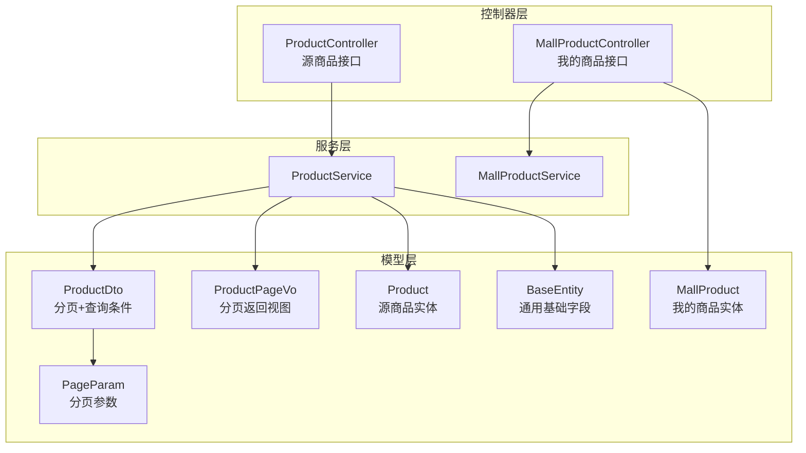
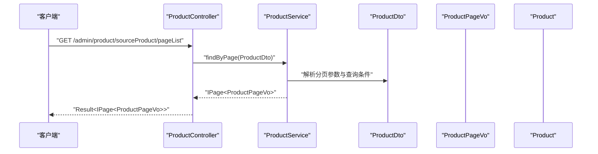
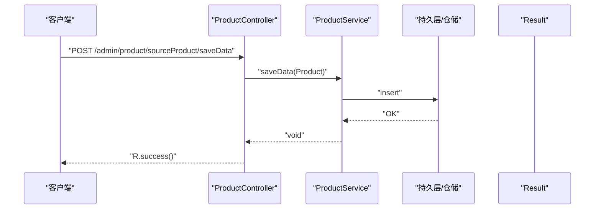
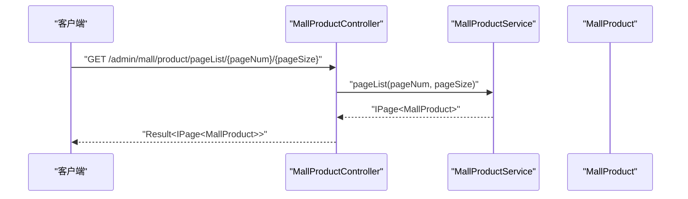
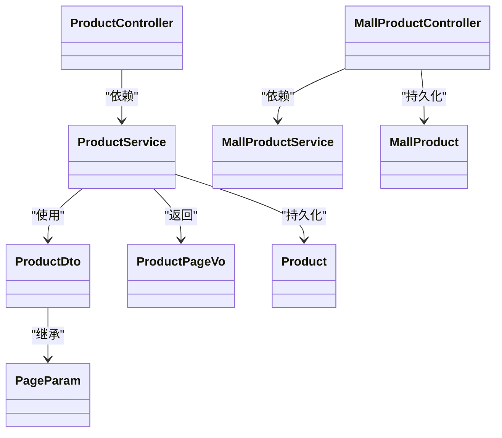

# 商品接口

<cite>
**本文引用的文件**
- [ProductController.java](file://spzx-manager/src/main/java/com/joker/spzx/manager/controller/ProductController.java)
- [ProductService.java](file://spzx-manager/src/main/java/com/joker/spzx/manager/service/ProductService.java)
- [ProductDto.java](file://spzx-model/src/main/java/com/joker/spzx/model/dto/product/ProductDto.java)
- [ProductPageVo.java](file://spzx-model/src/main/java/com/joker/spzx/model/vo/product/ProductPageVo.java)
- [Product.java](file://spzx-model/src/main/java/com/joker/spzx/model/entity/product/Product.java)
- [PageParam.java](file://spzx-model/src/main/java/com/joker/spzx/model/dto/system/PageParam.java)
- [BaseEntity.java](file://spzx-model/src/main/java/com/joker/spzx/model/entity/base/BaseEntity.java)
- [MallProductController.java](file://spzx-manager/src/main/java/com/joker/spzx/manager/controller/MallProductController.java)
- [MallProductService.java](file://spzx-manager/src/main/java/com/joker/spzx/manager/service/MallProductService.java)
- [MallProduct.java](file://spzx-model/src/main/java/com/joker/spzx/model/entity/oper/MallProduct.java)
</cite>

## 目录
1. [简介](#简介)
2. [项目结构](#项目结构)
3. [核心组件](#核心组件)
4. [架构总览](#架构总览)
5. [详细组件分析](#详细组件分析)
6. [依赖分析](#依赖分析)
7. [性能考虑](#性能考虑)
8. [故障排查指南](#故障排查指南)
9. [结论](#结论)
10. [附录](#附录)

## 简介
本文件为 SPZX 电商管理系统中的“商品接口”文档，聚焦于两类商品相关能力：
- 源商品（sourceProduct）管理：支持分页查询、新增、修改、删除、详情获取等。
- 我的商品（mallProduct）管理：支持分页查询、新增、修改、查询全部等。

文档覆盖：
- 接口的 HTTP 方法与 URL 模式
- 请求参数与响应格式
- 商品数据结构说明（基本信息、价格、库存、状态等）
- 搜索条件过滤、分页参数传递与排序机制
- 商品状态管理、批量操作与数据验证规则

## 项目结构
围绕商品管理的关键文件组织如下：
- 控制器层：负责接收请求、组装参数、调用服务并返回结果
- 服务层：封装业务逻辑，处理分页、保存、更新、删除、状态变更等
- 数据传输对象（DTO/VO）：承载查询条件、分页参数、返回视图对象
- 实体类：映射数据库表结构，包含基础字段如创建/更新时间、删除标记等

图表来源
- [ProductController.java:22-58](file://spzx-manager/src/main/java/com/joker/spzx/manager/controller/ProductController.java#L22-L58)
- [MallProductController.java:22-60](file://spzx-manager/src/main/java/com/joker/spzx/manager/controller/MallProductController.java#L22-L60)
- [ProductService.java:17-32](file://spzx-manager/src/main/java/com/joker/spzx/manager/service/ProductService.java#L17-L32)
- [MallProductService.java](file://spzx-manager/src/main/java/com/joker/spzx/manager/service/MallProductService.java)
- [ProductDto.java:9-23](file://spzx-model/src/main/java/com/joker/spzx/model/dto/product/ProductDto.java#L9-L23)
- [ProductPageVo.java:10-45](file://spzx-model/src/main/java/com/joker/spzx/model/vo/product/ProductPageVo.java#L10-L45)
- [Product.java:12-58](file://spzx-model/src/main/java/com/joker/spzx/model/entity/product/Product.java#L12-L58)
- [MallProduct.java:27-75](file://spzx-model/src/main/java/com/joker/spzx/model/entity/oper/MallProduct.java#L27-L75)
- [PageParam.java:10-21](file://spzx-model/src/main/java/com/joker/spzx/model/dto/system/PageParam.java#L10-L21)
- [BaseEntity.java:14-34](file://spzx-model/src/main/java/com/joker/spzx/model/entity/base/BaseEntity.java#L14-L34)

章节来源
- [ProductController.java:22-58](file://spzx-manager/src/main/java/com/joker/spzx/manager/controller/ProductController.java#L22-L58)
- [MallProductController.java:22-60](file://spzx-manager/src/main/java/com/joker/spzx/manager/controller/MallProductController.java#L22-L60)
- [ProductService.java:17-32](file://spzx-manager/src/main/java/com/joker/spzx/manager/service/ProductService.java#L17-L32)
- [MallProductService.java](file://spzx-manager/src/main/java/com/joker/spzx/manager/service/MallProductService.java)
- [ProductDto.java:9-23](file://spzx-model/src/main/java/com/joker/spzx/model/dto/product/ProductDto.java#L9-L23)
- [ProductPageVo.java:10-45](file://spzx-model/src/main/java/com/joker/spzx/model/vo/product/ProductPageVo.java#L10-L45)
- [Product.java:12-58](file://spzx-model/src/main/java/com/joker/spzx/model/entity/product/Product.java#L12-L58)
- [MallProduct.java:27-75](file://spzx-model/src/main/java/com/joker/spzx/model/entity/oper/MallProduct.java#L27-L75)
- [PageParam.java:10-21](file://spzx-model/src/main/java/com/joker/spzx/model/dto/system/PageParam.java#L10-L21)
- [BaseEntity.java:14-34](file://spzx-model/src/main/java/com/joker/spzx/model/entity/base/BaseEntity.java#L14-L34)

## 核心组件
- 源商品接口（ProductController）
  - 分页查询：GET /admin/product/sourceProduct/pageList
  - 新增：POST /admin/product/sourceProduct/saveData
  - 修改：PUT /admin/product/sourceProduct/updateData
  - 删除：DELETE /admin/product/sourceProduct/deleteById/{id}
  - 详情：GET /admin/product/sourceProduct/getDetail?id={id}
- 我的商品接口（MallProductController）
  - 分页查询：GET /admin/mall/product/pageList/{pageNum}/{pageSize}
  - 新增：POST /admin/mall/product/saveData
  - 修改：PUT /admin/mall/product/update
  - 查询全部：GET /admin/mall/product/all

章节来源
- [ProductController.java:28-57](file://spzx-manager/src/main/java/com/joker/spzx/manager/controller/ProductController.java#L28-L57)
- [MallProductController.java:30-57](file://spzx-manager/src/main/java/com/joker/spzx/manager/controller/MallProductController.java#L30-L57)

## 架构总览
下图展示从控制器到服务再到模型的数据流与职责边界：

图表来源
- [ProductController.java:28-32](file://spzx-manager/src/main/java/com/joker/spzx/manager/controller/ProductController.java#L28-L32)
- [ProductService.java:19](file://spzx-manager/src/main/java/com/joker/spzx/manager/service/ProductService.java#L19)
- [ProductDto.java:9-23](file://spzx-model/src/main/java/com/joker/spzx/model/dto/product/ProductDto.java#L9-L23)
- [ProductPageVo.java:10-45](file://spzx-model/src/main/java/com/joker/spzx/model/vo/product/ProductPageVo.java#L10-L45)

## 详细组件分析

### 源商品接口（ProductController）
- 分页查询
  - 方法与路径：GET /admin/product/sourceProduct/pageList
  - 请求参数：ProductDto（继承自 PageParam），包含分页参数与查询条件
  - 响应：Result<IPage<ProductPageVo>>
  - 关键点：分页参数默认值在 PageParam 中定义；查询条件包括源头商品名称、编码、货源工厂Id、稳定状态等
- 新增
  - 方法与路径：POST /admin/product/sourceProduct/saveData
  - 请求体：Product 实体
  - 响应：Result<Void>
- 修改
  - 方法与路径：PUT /admin/product/sourceProduct/updateData
  - 请求体：Product 实体
  - 响应：Result<Void>
- 删除
  - 方法与路径：DELETE /admin/product/sourceProduct/deleteById/{id}
  - 路径参数：id（Long）
  - 响应：Result<Void>
- 详情
  - 方法与路径：GET /admin/product/sourceProduct/getDetail
  - 查询参数：id（Long）
  - 响应：Result<ProductPageVo>

图表来源
- [ProductController.java:34-38](file://spzx-manager/src/main/java/com/joker/spzx/manager/controller/ProductController.java#L34-L38)
- [ProductService.java:21](file://spzx-manager/src/main/java/com/joker/spzx/manager/service/ProductService.java#L21)

章节来源
- [ProductController.java:28-57](file://spzx-manager/src/main/java/com/joker/spzx/manager/controller/ProductController.java#L28-L57)
- [ProductService.java:19-32](file://spzx-manager/src/main/java/com/joker/spzx/manager/service/ProductService.java#L19-L32)
- [ProductDto.java:9-23](file://spzx-model/src/main/java/com/joker/spzx/model/dto/product/ProductDto.java#L9-L23)
- [ProductPageVo.java:10-45](file://spzx-model/src/main/java/com/joker/spzx/model/vo/product/ProductPageVo.java#L10-L45)
- [Product.java:12-58](file://spzx-model/src/main/java/com/joker/spzx/model/entity/product/Product.java#L12-L58)
- [PageParam.java:10-21](file://spzx-model/src/main/java/com/joker/spzx/model/dto/system/PageParam.java#L10-L21)
- [BaseEntity.java:14-34](file://spzx-model/src/main/java/com/joker/spzx/model/entity/base/BaseEntity.java#L14-L34)

### 我的商品接口（MallProductController）
- 分页查询
  - 方法与路径：GET /admin/mall/product/pageList/{pageNum}/{pageSize}
  - 路径参数：pageNum、pageSize（Integer）
  - 响应：Result<IPage<MallProduct>>
- 新增
  - 方法与路径：POST /admin/mall/product/saveData
  - 请求体：MallProduct 实体
  - 响应：Result<String>
- 修改
  - 方法与路径：PUT /admin/mall/product/update
  - 请求体：MallProduct 实体
  - 响应：Result<String>
- 查询全部
  - 方法与路径：GET /admin/mall/product/all
  - 响应：Result<List<MallProduct>>

图表来源
- [MallProductController.java:30-35](file://spzx-manager/src/main/java/com/joker/spzx/manager/controller/MallProductController.java#L30-L35)
- [MallProductService.java](file://spzx-manager/src/main/java/com/joker/spzx/manager/service/MallProductService.java)
- [MallProduct.java:27-75](file://spzx-model/src/main/java/com/joker/spzx/model/entity/oper/MallProduct.java#L27-L75)

章节来源
- [MallProductController.java:30-57](file://spzx-manager/src/main/java/com/joker/spzx/manager/controller/MallProductController.java#L30-L57)
- [MallProductService.java](file://spzx-manager/src/main/java/com/joker/spzx/manager/service/MallProductService.java)
- [MallProduct.java:27-75](file://spzx-model/src/main/java/com/joker/spzx/model/entity/oper/MallProduct.java#L27-L75)

### 数据模型与字段说明

#### 分页参数（PageParam）
- 字段
  - pageNum：页码，默认 1
  - pageSize：每页条数，默认 10
  - 提供 getPage() 将其转换为 MyBatis-Plus 的 IPage 对象
- 作用
  - 统一分页参数规范，用于源商品与我的商品的分页查询

章节来源
- [PageParam.java:10-21](file://spzx-model/src/main/java/com/joker/spzx/model/dto/system/PageParam.java#L10-L21)

#### 源商品查询条件（ProductDto）
- 继承：PageParam
- 字段
  - sourceProductName：源头商品名称（模糊匹配）
  - sourceProductCode：源头商品编码（精确匹配）
  - productFactoryId：货源工厂Id（精确匹配）
  - steadyStatus：稳定状态（精确匹配）
- 用途
  - 作为分页查询的过滤条件

章节来源
- [ProductDto.java:9-23](file://spzx-model/src/main/java/com/joker/spzx/model/dto/product/ProductDto.java#L9-L23)

#### 源商品返回视图（ProductPageVo）
- 字段
  - id、sourceProductName、productFactoryId、productFactoryName、sourceProductCode、sourceProductUrl、headImgUrl、logisticsName、freightCost、dispatchTime、steadyStatus
- 用途
  - 分页查询返回的视图对象，包含商品基本信息与物流信息

章节来源
- [ProductPageVo.java:10-45](file://spzx-model/src/main/java/com/joker/spzx/model/vo/product/ProductPageVo.java#L10-L45)

#### 源商品实体（Product）
- 继承：BaseEntity
- 字段
  - sourceProductName、productFactoryId、sourceProductCode、sourceProductUrl、headImgUrl、logisticsName、freightCost、dispatchTime、steadyStatus
  - createBy、updateBy（审计字段）
- 用途
  - 新增/修改/删除/详情等业务操作的数据载体

章节来源
- [Product.java:12-58](file://spzx-model/src/main/java/com/joker/spzx/model/entity/product/Product.java#L12-L58)
- [BaseEntity.java:14-34](file://spzx-model/src/main/java/com/joker/spzx/model/entity/base/BaseEntity.java#L14-L34)

#### 我的商品实体（MallProduct）
- 字段
  - code、title、guideTitle、picUrl、remark
  - createBy、createTime、updateBy、updateTime
- 用途
  - 我的商品列表、新增、修改、查询全部等业务操作的数据载体

章节来源
- [MallProduct.java:27-75](file://spzx-model/src/main/java/com/joker/spzx/model/entity/oper/MallProduct.java#L27-L75)

### 搜索条件过滤、分页参数与排序机制
- 搜索条件过滤
  - 源商品：通过 ProductDto 的字段进行精确或模糊匹配；具体 SQL 条件由服务实现决定
- 分页参数
  - 使用 PageParam 的 pageNum 与 pageSize；默认值在 PageParam 中定义
- 排序机制
  - 当前控制器未显式传入排序字段；若需排序，请在服务层的分页查询中配置排序策略（例如按创建时间倒序）

章节来源
- [ProductDto.java:9-23](file://spzx-model/src/main/java/com/joker/spzx/model/dto/product/ProductDto.java#L9-L23)
- [PageParam.java:10-21](file://spzx-model/src/main/java/com/joker/spzx/model/dto/system/PageParam.java#L10-L21)
- [ProductController.java:28-32](file://spzx-manager/src/main/java/com/joker/spzx/manager/controller/ProductController.java#L28-L32)
- [MallProductController.java:30-35](file://spzx-manager/src/main/java/com/joker/spzx/manager/controller/MallProductController.java#L30-L35)

### 商品状态管理与批量操作
- 状态管理
  - ProductService 提供 updateAuditStatus 与 updateStatus 方法，可用于审核状态与业务状态的变更
- 批量操作
  - 当前控制器未提供批量删除/批量状态变更接口；如需批量操作，可在服务层扩展相应方法并通过控制器暴露

章节来源
- [ProductService.java:29-31](file://spzx-manager/src/main/java/com/joker/spzx/manager/service/ProductService.java#L29-L31)

### 数据验证规则
- 控制器层使用注解对请求参数进行约束（如 @PathVariable、@RequestParam、@RequestBody）
- 实体与 DTO 字段具备描述性注解，便于前端与后端协同约定
- 建议在新增/修改接口中增加参数校验（如非空、范围校验），可结合 Spring Validation 进行统一处理

章节来源
- [ProductController.java:46-57](file://spzx-manager/src/main/java/com/joker/spzx/manager/controller/ProductController.java#L46-L57)
- [MallProductController.java:37-57](file://spzx-manager/src/main/java/com/joker/spzx/manager/controller/MallProductController.java#L37-L57)
- [Product.java:12-58](file://spzx-model/src/main/java/com/joker/spzx/model/entity/product/Product.java#L12-L58)
- [MallProduct.java:27-75](file://spzx-model/src/main/java/com/joker/spzx/model/entity/oper/MallProduct.java#L27-L75)

## 依赖分析
- 控制器依赖服务接口，服务接口依赖实体与 DTO
- ProductController 依赖 ProductService；MallProductController 依赖 MallProductService
- ProductDto 继承 PageParam，统一分页参数；ProductPageVo 作为分页返回视图

图表来源
- [ProductController.java:22-58](file://spzx-manager/src/main/java/com/joker/spzx/manager/controller/ProductController.java#L22-L58)
- [ProductService.java:17-32](file://spzx-manager/src/main/java/com/joker/spzx/manager/service/ProductService.java#L17-L32)
- [ProductDto.java:9-23](file://spzx-model/src/main/java/com/joker/spzx/model/dto/product/ProductDto.java#L9-L23)
- [ProductPageVo.java:10-45](file://spzx-model/src/main/java/com/joker/spzx/model/vo/product/ProductPageVo.java#L10-L45)
- [Product.java:12-58](file://spzx-model/src/main/java/com/joker/spzx/model/entity/product/Product.java#L12-L58)
- [PageParam.java:10-21](file://spzx-model/src/main/java/com/joker/spzx/model/dto/system/PageParam.java#L10-L21)
- [MallProductController.java:22-60](file://spzx-manager/src/main/java/com/joker/spzx/manager/controller/MallProductController.java#L22-L60)
- [MallProductService.java](file://spzx-manager/src/main/java/com/joker/spzx/manager/service/MallProductService.java)
- [MallProduct.java:27-75](file://spzx-model/src/main/java/com/joker/spzx/model/entity/oper/MallProduct.java#L27-L75)

章节来源
- [ProductController.java:22-58](file://spzx-manager/src/main/java/com/joker/spzx/manager/controller/ProductController.java#L22-L58)
- [MallProductController.java:22-60](file://spzx-manager/src/main/java/com/joker/spzx/manager/controller/MallProductController.java#L22-L60)
- [ProductService.java:17-32](file://spzx-manager/src/main/java/com/joker/spzx/manager/service/ProductService.java#L17-L32)
- [MallProductService.java](file://spzx-manager/src/main/java/com/joker/spzx/manager/service/MallProductService.java)
- [ProductDto.java:9-23](file://spzx-model/src/main/java/com/joker/spzx/model/dto/product/ProductDto.java#L9-L23)
- [ProductPageVo.java:10-45](file://spzx-model/src/main/java/com/joker/spzx/model/vo/product/ProductPageVo.java#L10-L45)
- [Product.java:12-58](file://spzx-model/src/main/java/com/joker/spzx/model/entity/product/Product.java#L12-L58)
- [PageParam.java:10-21](file://spzx-model/src/main/java/com/joker/spzx/model/dto/system/PageParam.java#L10-L21)
- [MallProduct.java:27-75](file://spzx-model/src/main/java/com/joker/spzx/model/entity/oper/MallProduct.java#L27-L75)

## 性能考虑
- 分页查询建议设置合理的 pageSize，避免一次性返回过多数据
- 复杂查询条件（如多表关联、模糊匹配）可能影响性能，建议在服务层优化 SQL 并添加必要的索引
- 对频繁访问的字段（如商品名称、编码、工厂Id）建立索引，提升检索效率
- 合理使用缓存策略（如商品详情、热门商品）降低数据库压力

## 故障排查指南
- 参数错误
  - 确认分页参数 pageNum、pageSize 是否为正整数
  - 确认路径参数 id 是否存在且类型正确
- 数据为空
  - 检查查询条件是否过于严格导致无结果
  - 核对数据库中是否存在对应记录
- 返回结构异常
  - 确认控制器返回的 Result 包装是否正确
  - 检查服务层是否抛出异常并被全局异常处理器捕获

## 结论
本文档梳理了 SPZX 系统中“源商品”与“我的商品”的核心接口与数据模型，明确了分页查询、新增、修改、删除、详情获取等能力，并给出了搜索条件、分页参数与排序机制的说明。建议后续补充批量操作、状态变更接口与参数校验，以进一步完善商品管理能力。

## 附录
- 响应包装
  - 所有接口均返回 Result<T> 包装，其中 SUCCESS 表示成功，失败时会携带错误码与消息
- 基础字段
  - 所有实体均继承 BaseEntity，包含 id、create_time、update_time、is_deleted 等通用字段

章节来源
- [BaseEntity.java:14-34](file://spzx-model/src/main/java/com/joker/spzx/model/entity/base/BaseEntity.java#L14-L34)