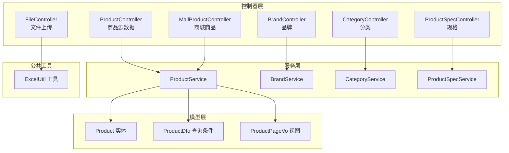
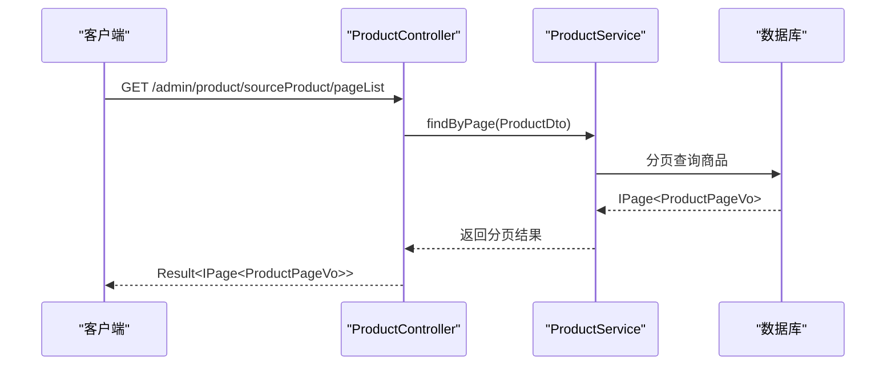
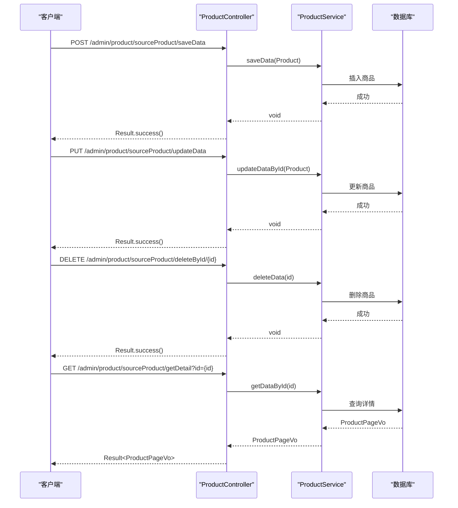
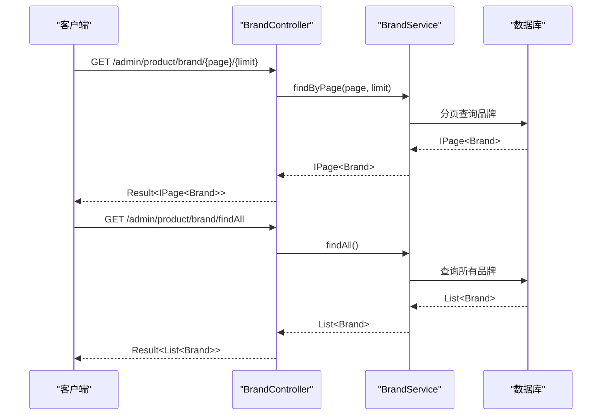
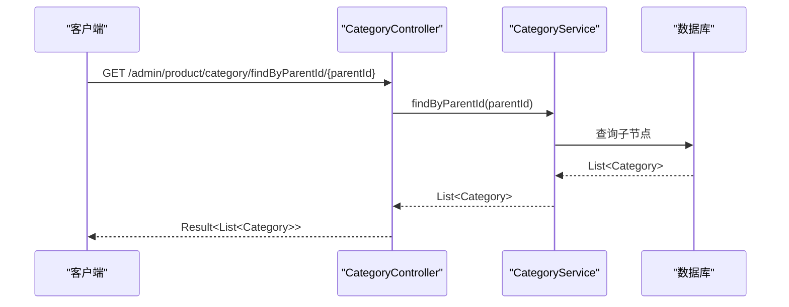
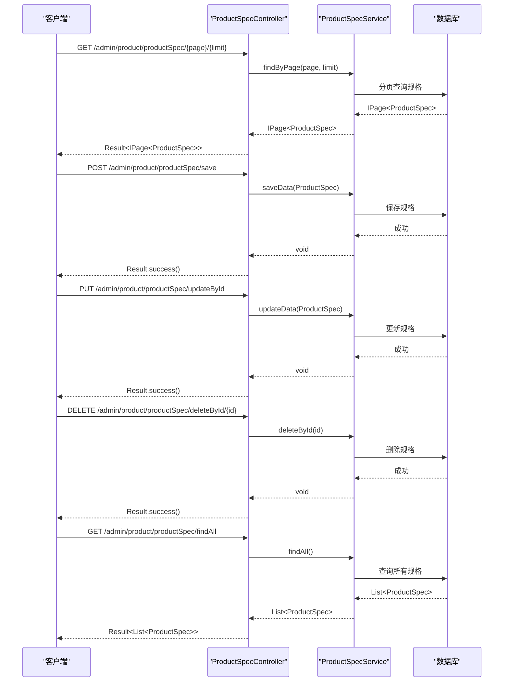
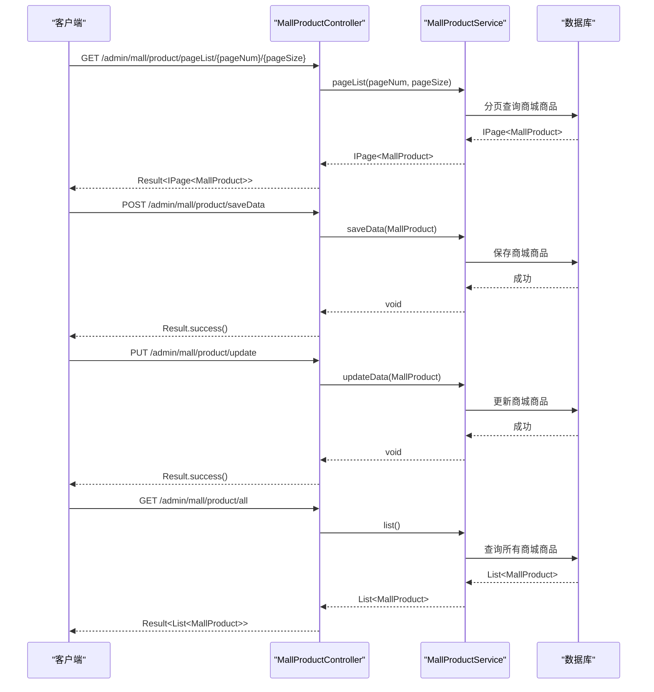
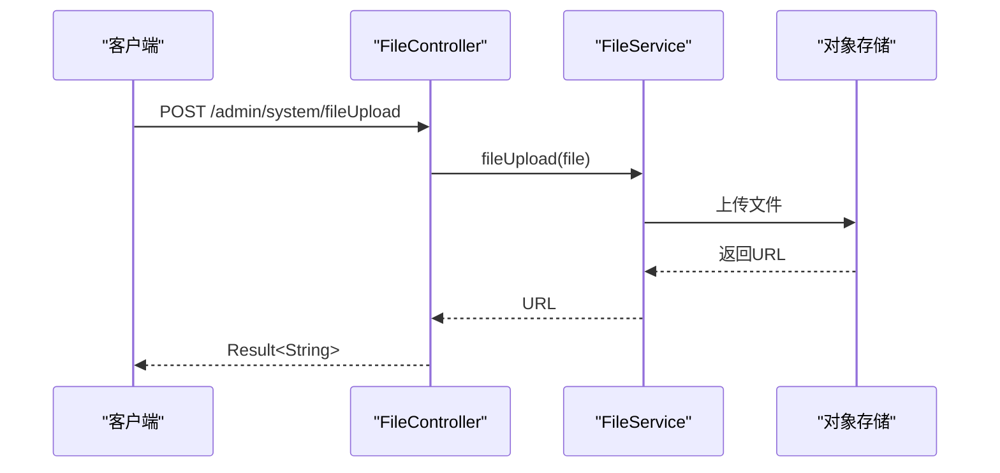
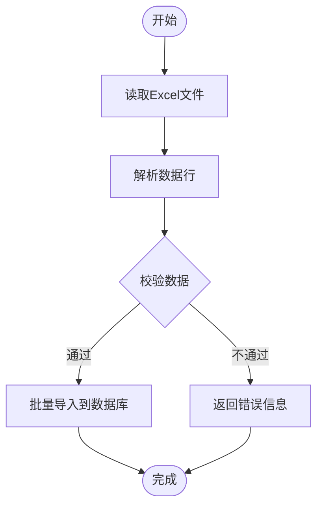
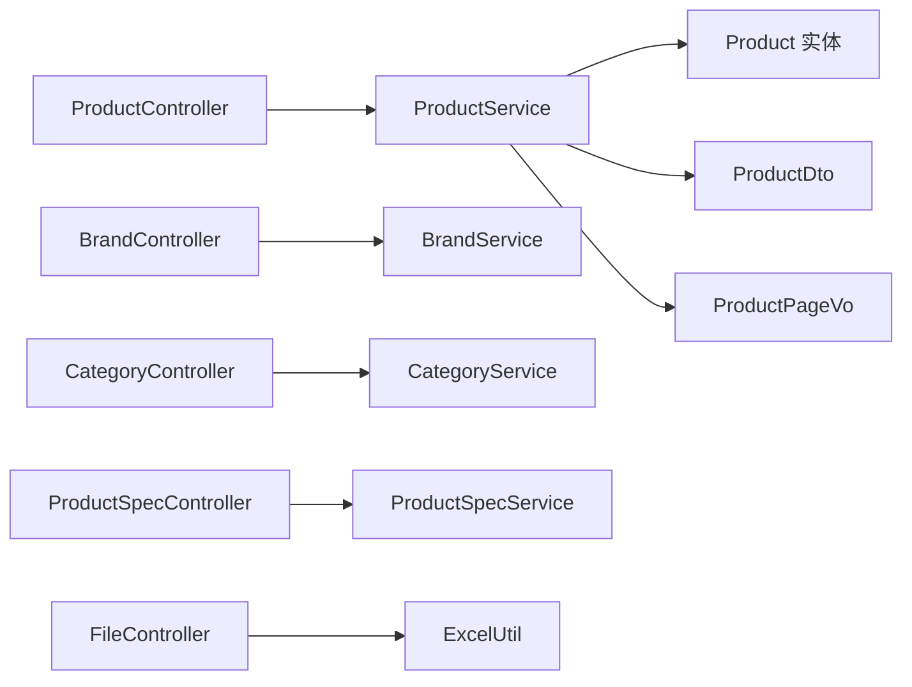

# 商品管理接口

<cite>
**本文引用的文件**
- [ProductController.java](file://spzx-manager/src/main/java/com/joker/spzx/manager/controller/ProductController.java)
- [ProductService.java](file://spzx-manager/src/main/java/com/joker/spzx/manager/service/ProductService.java)
- [BrandController.java](file://spzx-manager/src/main/java/com/joker/spzx/manager/controller/BrandController.java)
- [BrandService.java](file://spzx-manager/src/main/java/com/joker/spzx/manager/service/BrandService.java)
- [CategoryController.java](file://spzx-manager/src/main/java/com/joker/spzx/manager/controller/CategoryController.java)
- [CategoryService.java](file://spzx-manager/src/main/java/com/joker/spzx/manager/service/CategoryService.java)
- [ProductSpecController.java](file://spzx-manager/src/main/java/com/joker/spzx/manager/controller/ProductSpecController.java)
- [ProductSpecService.java](file://spzx-manager/src/main/java/com/joker/spzx/manager/service/ProductSpecService.java)
- [MallProductController.java](file://spzx-manager/src/main/java/com/joker/spzx/manager/controller/MallProductController.java)
- [FileController.java](file://spzx-manager/src/main/java/com/joker/spzx/manager/controller/FileController.java)
- [Product.java](file://spzx-model/src/main/java/com/joker/spzx/model/entity/product/Product.java)
- [ProductDto.java](file://spzx-model/src/main/java/com/joker/spzx/model/dto/product/ProductDto.java)
- [ProductPageVo.java](file://spzx-model/src/main/java/com/joker/spzx/model/vo/product/ProductPageVo.java)
- [ExcelUtil.java](file://spzx-common/common-util/src/main/java/com/joker/spzx/utils/excel/ExcelUtil.java)
</cite>

## 目录
1. [简介](#简介)
2. [项目结构](#项目结构)
3. [核心组件](#核心组件)
4. [架构总览](#架构总览)
5. [详细组件分析](#详细组件分析)
6. [依赖分析](#依赖分析)
7. [性能考虑](#性能考虑)
8. [故障排查指南](#故障排查指南)
9. [结论](#结论)
10. [附录](#附录)

## 简介
本接口文档面向SPZX电商管理系统中的商品管理模块，覆盖商品、品牌、分类、规格等核心业务的REST接口，包括增删改查、分页查询、状态变更、图片上传与Excel导入导出能力。文档同时解释商品搜索、分页与排序机制，并给出商品审核流程、库存与价格计算的扩展建议。

## 项目结构
商品管理相关代码主要分布在以下模块：
- 控制器层（controller）：负责HTTP路由与请求转发
- 服务层（service）：封装业务逻辑与数据访问
- 模型层（entity/dto/vo）：定义实体、查询条件与返回视图
- 公共工具（common-util）：提供Excel工具能力

**图表来源**
- [ProductController.java:22-58](file://spzx-manager/src/main/java/com/joker/spzx/manager/controller/ProductController.java#L22-L58)
- [BrandController.java:26-46](file://spzx-manager/src/main/java/com/joker/spzx/manager/controller/BrandController.java#L26-L46)
- [CategoryController.java:25-39](file://spzx-manager/src/main/java/com/joker/spzx/manager/controller/CategoryController.java#L25-L39)
- [ProductSpecController.java:21-57](file://spzx-manager/src/main/java/com/joker/spzx/manager/controller/ProductSpecController.java#L21-L57)
- [MallProductController.java:22-60](file://spzx-manager/src/main/java/com/joker/spzx/manager/controller/MallProductController.java#L22-L60)
- [FileController.java:13-25](file://spzx-manager/src/main/java/com/joker/spzx/manager/controller/FileController.java#L13-L25)
- [ProductService.java:17-32](file://spzx-manager/src/main/java/com/joker/spzx/manager/service/ProductService.java#L17-L32)
- [BrandService.java:17-22](file://spzx-manager/src/main/java/com/joker/spzx/manager/service/BrandService.java#L17-L22)
- [CategoryService.java:16-19](file://spzx-manager/src/main/java/com/joker/spzx/manager/service/CategoryService.java#L16-L19)
- [ProductSpecService.java:17-29](file://spzx-manager/src/main/java/com/joker/spzx/manager/service/ProductSpecService.java#L17-L29)
- [Product.java:10-58](file://spzx-model/src/main/java/com/joker/spzx/model/entity/product/Product.java#L10-L58)
- [ProductDto.java:9-23](file://spzx-model/src/main/java/com/joker/spzx/model/dto/product/ProductDto.java#L9-L23)
- [ProductPageVo.java:10-45](file://spzx-model/src/main/java/com/joker/spzx/model/vo/product/ProductPageVo.java#L10-L45)
- [ExcelUtil.java](file://spzx-common/common-util/src/main/java/com/joker/spzx/utils/excel/ExcelUtil.java)

**章节来源**
- [ProductController.java:22-58](file://spzx-manager/src/main/java/com/joker/spzx/manager/controller/ProductController.java#L22-L58)
- [BrandController.java:26-46](file://spzx-manager/src/main/java/com/joker/spzx/manager/controller/BrandController.java#L26-L46)
- [CategoryController.java:25-39](file://spzx-manager/src/main/java/com/joker/spzx/manager/controller/CategoryController.java#L25-L39)
- [ProductSpecController.java:21-57](file://spzx-manager/src/main/java/com/joker/spzx/manager/controller/ProductSpecController.java#L21-L57)
- [MallProductController.java:22-60](file://spzx-manager/src/main/java/com/joker/spzx/manager/controller/MallProductController.java#L22-L60)
- [FileController.java:13-25](file://spzx-manager/src/main/java/com/joker/spzx/manager/controller/FileController.java#L13-L25)
- [ProductService.java:17-32](file://spzx-manager/src/main/java/com/joker/spzx/manager/service/ProductService.java#L17-L32)
- [BrandService.java:17-22](file://spzx-manager/src/main/java/com/joker/spzx/manager/service/BrandService.java#L17-L22)
- [CategoryService.java:16-19](file://spzx-manager/src/main/java/com/joker/spzx/manager/service/CategoryService.java#L16-L19)
- [ProductSpecService.java:17-29](file://spzx-manager/src/main/java/com/joker/spzx/manager/service/ProductSpecService.java#L17-L29)
- [Product.java:10-58](file://spzx-model/src/main/java/com/joker/spzx/model/entity/product/Product.java#L10-L58)
- [ProductDto.java:9-23](file://spzx-model/src/main/java/com/joker/spzx/model/dto/product/ProductDto.java#L9-L23)
- [ProductPageVo.java:10-45](file://spzx-model/src/main/java/com/joker/spzx/model/vo/product/ProductPageVo.java#L10-L45)
- [ExcelUtil.java](file://spzx-common/common-util/src/main/java/com/joker/spzx/utils/excel/ExcelUtil.java)

## 核心组件
- 商品源数据接口：提供分页查询、保存、更新、删除、详情查询等能力
- 品牌接口：提供分页查询与全量查询
- 分类接口：提供按父级ID查询子节点
- 规格接口：提供分页查询、保存、更新、删除、全量查询
- 商城商品接口：提供分页查询、新增、修改、全量查询
- 文件上传接口：提供图片上传能力
- Excel工具：提供通用Excel导入导出能力（通过工具类）

**章节来源**
- [ProductController.java:22-58](file://spzx-manager/src/main/java/com/joker/spzx/manager/controller/ProductController.java#L22-L58)
- [BrandController.java:26-46](file://spzx-manager/src/main/java/com/joker/spzx/manager/controller/BrandController.java#L26-L46)
- [CategoryController.java:25-39](file://spzx-manager/src/main/java/com/joker/spzx/manager/controller/CategoryController.java#L25-L39)
- [ProductSpecController.java:21-57](file://spzx-manager/src/main/java/com/joker/spzx/manager/controller/ProductSpecController.java#L21-L57)
- [MallProductController.java:22-60](file://spzx-manager/src/main/java/com/joker/spzx/manager/controller/MallProductController.java#L22-L60)
- [FileController.java:13-25](file://spzx-manager/src/main/java/com/joker/spzx/manager/controller/FileController.java#L13-L25)
- [ExcelUtil.java](file://spzx-common/common-util/src/main/java/com/joker/spzx/utils/excel/ExcelUtil.java)

## 架构总览
系统采用典型的分层架构：控制器接收HTTP请求，调用服务层处理业务，服务层与数据访问层交互；模型层承载实体、查询条件与返回视图；公共工具提供Excel等通用能力。

**图表来源**
- [ProductController.java:28-32](file://spzx-manager/src/main/java/com/joker/spzx/manager/controller/ProductController.java#L28-L32)
- [ProductService.java:19-19](file://spzx-manager/src/main/java/com/joker/spzx/manager/service/ProductService.java#L19-L19)
- [ProductDto.java:9-23](file://spzx-model/src/main/java/com/joker/spzx/model/dto/product/ProductDto.java#L9-L23)
- [ProductPageVo.java:10-45](file://spzx-model/src/main/java/com/joker/spzx/model/vo/product/ProductPageVo.java#L10-L45)

## 详细组件分析

### 商品源数据接口
- 路由前缀：/admin/product/sourceProduct
- 功能：分页查询、保存、更新、删除、详情查询
- 关键点：
  - 分页查询使用ProductDto作为查询条件，继承自PageParam
  - 返回视图为IPage<ProductPageVo>
  - 支持按源头商品名称、编码、工厂ID、稳定状态等字段过滤

**图表来源**
- [ProductController.java:34-57](file://spzx-manager/src/main/java/com/joker/spzx/manager/controller/ProductController.java#L34-L57)
- [ProductService.java:21-27](file://spzx-manager/src/main/java/com/joker/spzx/manager/service/ProductService.java#L21-L27)
- [Product.java:10-58](file://spzx-model/src/main/java/com/joker/spzx/model/entity/product/Product.java#L10-L58)
- [ProductPageVo.java:10-45](file://spzx-model/src/main/java/com/joker/spzx/model/vo/product/ProductPageVo.java#L10-L45)

**章节来源**
- [ProductController.java:22-58](file://spzx-manager/src/main/java/com/joker/spzx/manager/controller/ProductController.java#L22-L58)
- [ProductService.java:17-32](file://spzx-manager/src/main/java/com/joker/spzx/manager/service/ProductService.java#L17-L32)
- [Product.java:10-58](file://spzx-model/src/main/java/com/joker/spzx/model/entity/product/Product.java#L10-L58)
- [ProductDto.java:9-23](file://spzx-model/src/main/java/com/joker/spzx/model/dto/product/ProductDto.java#L9-L23)
- [ProductPageVo.java:10-45](file://spzx-model/src/main/java/com/joker/spzx/model/vo/product/ProductPageVo.java#L10-L45)

### 品牌接口
- 路由前缀：/admin/product/brand
- 功能：分页查询、全量查询
- 关键点：
  - 分页查询支持路径变量page与limit
  - 全量查询返回品牌列表

**图表来源**
- [BrandController.java:33-44](file://spzx-manager/src/main/java/com/joker/spzx/manager/controller/BrandController.java#L33-L44)
- [BrandService.java:19-21](file://spzx-manager/src/main/java/com/joker/spzx/manager/service/BrandService.java#L19-L21)

**章节来源**
- [BrandController.java:26-46](file://spzx-manager/src/main/java/com/joker/spzx/manager/controller/BrandController.java#L26-L46)
- [BrandService.java:17-22](file://spzx-manager/src/main/java/com/joker/spzx/manager/service/BrandService.java#L17-L22)

### 分类接口
- 路由前缀：/admin/product/category
- 功能：按父级ID查询子节点
- 关键点：
  - 使用路径变量parentId进行查询
  - 返回子节点列表

**图表来源**
- [CategoryController.java:33-37](file://spzx-manager/src/main/java/com/joker/spzx/manager/controller/CategoryController.java#L33-L37)
- [CategoryService.java:18-18](file://spzx-manager/src/main/java/com/joker/spzx/manager/service/CategoryService.java#L18-L18)

**章节来源**
- [CategoryController.java:25-39](file://spzx-manager/src/main/java/com/joker/spzx/manager/controller/CategoryController.java#L25-L39)
- [CategoryService.java:16-19](file://spzx-manager/src/main/java/com/joker/spzx/manager/service/CategoryService.java#L16-L19)

### 规格接口
- 路由前缀：/admin/product/productSpec
- 功能：分页查询、保存、更新、删除、全量查询
- 关键点：
  - 分页查询支持路径变量page与limit
  - 其余操作为标准CRUD

**图表来源**
- [ProductSpecController.java:28-56](file://spzx-manager/src/main/java/com/joker/spzx/manager/controller/ProductSpecController.java#L28-L56)
- [ProductSpecService.java:19-27](file://spzx-manager/src/main/java/com/joker/spzx/manager/service/ProductSpecService.java#L19-L27)

**章节来源**
- [ProductSpecController.java:21-57](file://spzx-manager/src/main/java/com/joker/spzx/manager/controller/ProductSpecController.java#L21-L57)
- [ProductSpecService.java:17-29](file://spzx-manager/src/main/java/com/joker/spzx/manager/service/ProductSpecService.java#L17-L29)

### 商城商品接口
- 路由前缀：/admin/mall/product
- 功能：分页查询、新增、修改、全量查询
- 关键点：
  - 分页查询使用路径变量pageNum与pageSize
  - 新增与修改接收JSON请求体

**图表来源**
- [MallProductController.java:30-57](file://spzx-manager/src/main/java/com/joker/spzx/manager/controller/MallProductController.java#L30-L57)

**章节来源**
- [MallProductController.java:22-60](file://spzx-manager/src/main/java/com/joker/spzx/manager/controller/MallProductController.java#L22-L60)

### 图片上传接口
- 路由前缀：/admin/system
- 功能：文件上传并返回访问URL
- 关键点：
  - 接收multipart/form-data类型文件
  - 返回字符串类型的文件URL

**图表来源**
- [FileController.java:20-24](file://spzx-manager/src/main/java/com/joker/spzx/manager/controller/FileController.java#L20-L24)

**章节来源**
- [FileController.java:13-25](file://spzx-manager/src/main/java/com/joker/spzx/manager/controller/FileController.java#L13-L25)

### Excel导入导出接口
- 能力来源：ExcelUtil工具类
- 适用场景：商品、品牌、分类等数据的批量导入与导出
- 关键点：
  - 提供通用的Excel读取与写入能力
  - 可结合具体业务控制器进行封装

**图表来源**
- [ExcelUtil.java](file://spzx-common/common-util/src/main/java/com/joker/spzx/utils/excel/ExcelUtil.java)

**章节来源**
- [ExcelUtil.java](file://spzx-common/common-util/src/main/java/com/joker/spzx/utils/excel/ExcelUtil.java)

## 依赖分析
- 控制器与服务层解耦：控制器仅负责路由与参数绑定，业务逻辑在服务层实现
- 服务层与数据访问层解耦：服务层通过Mapper或Repository访问数据库
- 模型层职责清晰：实体用于持久化映射，DTO用于查询条件，VO用于响应视图
- 工具层独立：Excel工具与业务解耦，便于复用

**图表来源**
- [ProductController.java:22-58](file://spzx-manager/src/main/java/com/joker/spzx/manager/controller/ProductController.java#L22-L58)
- [BrandController.java:26-46](file://spzx-manager/src/main/java/com/joker/spzx/manager/controller/BrandController.java#L26-L46)
- [CategoryController.java:25-39](file://spzx-manager/src/main/java/com/joker/spzx/manager/controller/CategoryController.java#L25-L39)
- [ProductSpecController.java:21-57](file://spzx-manager/src/main/java/com/joker/spzx/manager/controller/ProductSpecController.java#L21-L57)
- [FileController.java:13-25](file://spzx-manager/src/main/java/com/joker/spzx/manager/controller/FileController.java#L13-L25)
- [ProductService.java:17-32](file://spzx-manager/src/main/java/com/joker/spzx/manager/service/ProductService.java#L17-L32)
- [BrandService.java:17-22](file://spzx-manager/src/main/java/com/joker/spzx/manager/service/BrandService.java#L17-L22)
- [CategoryService.java:16-19](file://spzx-manager/src/main/java/com/joker/spzx/manager/service/CategoryService.java#L16-L19)
- [ProductSpecService.java:17-29](file://spzx-manager/src/main/java/com/joker/spzx/manager/service/ProductSpecService.java#L17-L29)
- [Product.java:10-58](file://spzx-model/src/main/java/com/joker/spzx/model/entity/product/Product.java#L10-L58)
- [ProductDto.java:9-23](file://spzx-model/src/main/java/com/joker/spzx/model/dto/product/ProductDto.java#L9-L23)
- [ProductPageVo.java:10-45](file://spzx-model/src/main/java/com/joker/spzx/model/vo/product/ProductPageVo.java#L10-L45)
- [ExcelUtil.java](file://spzx-common/common-util/src/main/java/com/joker/spzx/utils/excel/ExcelUtil.java)

**章节来源**
- [ProductController.java:22-58](file://spzx-manager/src/main/java/com/joker/spzx/manager/controller/ProductController.java#L22-L58)
- [BrandController.java:26-46](file://spzx-manager/src/main/java/com/joker/spzx/manager/controller/BrandController.java#L26-L46)
- [CategoryController.java:25-39](file://spzx-manager/src/main/java/com/joker/spzx/manager/controller/CategoryController.java#L25-L39)
- [ProductSpecController.java:21-57](file://spzx-manager/src/main/java/com/joker/spzx/manager/controller/ProductSpecController.java#L21-L57)
- [FileController.java:13-25](file://spzx-manager/src/main/java/com/joker/spzx/manager/controller/FileController.java#L13-L25)
- [ProductService.java:17-32](file://spzx-manager/src/main/java/com/joker/spzx/manager/service/ProductService.java#L17-L32)
- [BrandService.java:17-22](file://spzx-manager/src/main/java/com/joker/spzx/manager/service/BrandService.java#L17-L22)
- [CategoryService.java:16-19](file://spzx-manager/src/main/java/com/joker/spzx/manager/service/CategoryService.java#L16-L19)
- [ProductSpecService.java:17-29](file://spzx-manager/src/main/java/com/joker/spzx/manager/service/ProductSpecService.java#L17-L29)
- [Product.java:10-58](file://spzx-model/src/main/java/com/joker/spzx/model/entity/product/Product.java#L10-L58)
- [ProductDto.java:9-23](file://spzx-model/src/main/java/com/joker/spzx/model/dto/product/ProductDto.java#L9-L23)
- [ProductPageVo.java:10-45](file://spzx-model/src/main/java/com/joker/spzx/model/vo/product/ProductPageVo.java#L10-L45)
- [ExcelUtil.java](file://spzx-common/common-util/src/main/java/com/joker/spzx/utils/excel/ExcelUtil.java)

## 性能考虑
- 分页查询：优先使用分页接口，避免一次性加载大量数据
- 过滤条件：合理使用ProductDto中的过滤字段，减少数据库扫描范围
- 批量操作：对于大量数据导入/导出，建议使用Excel工具进行批处理
- 缓存策略：对品牌、分类等静态数据可考虑缓存，降低数据库压力
- 并发控制：在高并发场景下，注意接口幂等性与锁机制

## 故障排查指南
- 参数校验失败：检查请求参数是否符合DTO定义
- 数据库异常：确认Mapper配置与SQL语句正确性
- 文件上传失败：检查文件大小限制、MIME类型与存储权限
- Excel导入异常：核对Excel列名与数据类型，确保与工具类期望一致

## 结论
本接口文档梳理了SPZX电商管理系统中商品相关的核心REST接口，明确了各模块的职责边界与交互方式。通过分页查询、状态管理、文件上传与Excel工具的组合，能够满足商品管理的日常需求。建议在实际部署中结合业务场景进一步完善鉴权、限流与监控体系。

## 附录

### 商品数据结构说明
- Product实体字段
  - 源头商品名称、货源厂商ID、源头商品编码、源头商品链接、头图链接、物流公司、运费、发货时长、稳定状态、创建人、更新人
- ProductDto查询条件
  - 源头商品名称、源头商品编码、货源工厂ID、三级分类ID、稳定状态
- ProductPageVo返回视图
  - ID、源头商品名称、货源厂商ID、货源厂商名称、源头商品编码、源头商品链接、头图链接、物流公司、运费、发货时长、稳定状态

**章节来源**
- [Product.java:10-58](file://spzx-model/src/main/java/com/joker/spzx/model/entity/product/Product.java#L10-L58)
- [ProductDto.java:9-23](file://spzx-model/src/main/java/com/joker/spzx/model/dto/product/ProductDto.java#L9-L23)
- [ProductPageVo.java:10-45](file://spzx-model/src/main/java/com/joker/spzx/model/vo/product/ProductPageVo.java#L10-L45)