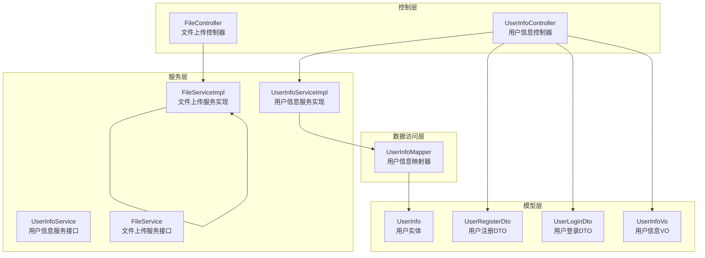
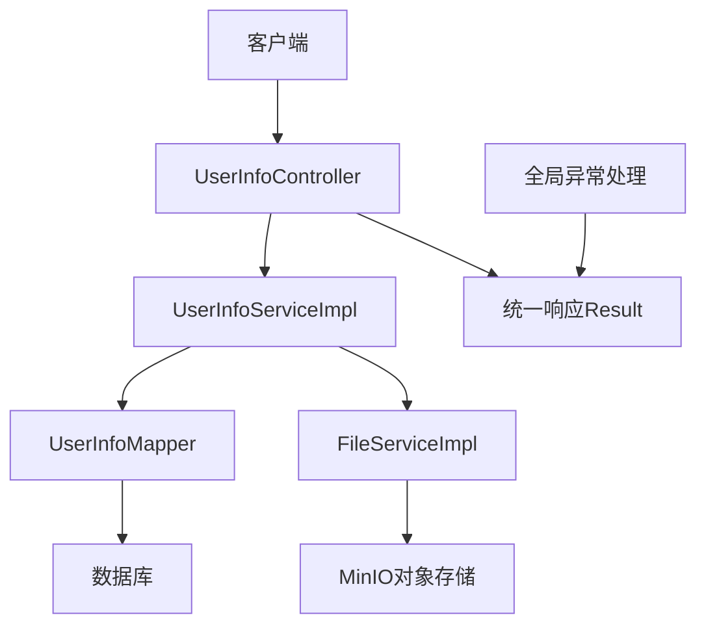
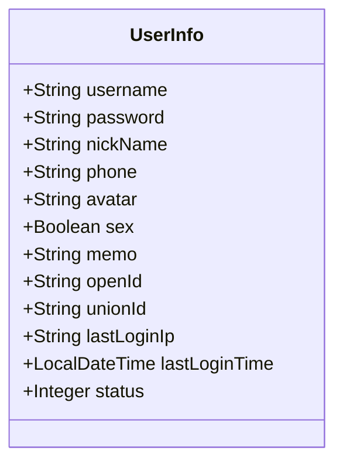
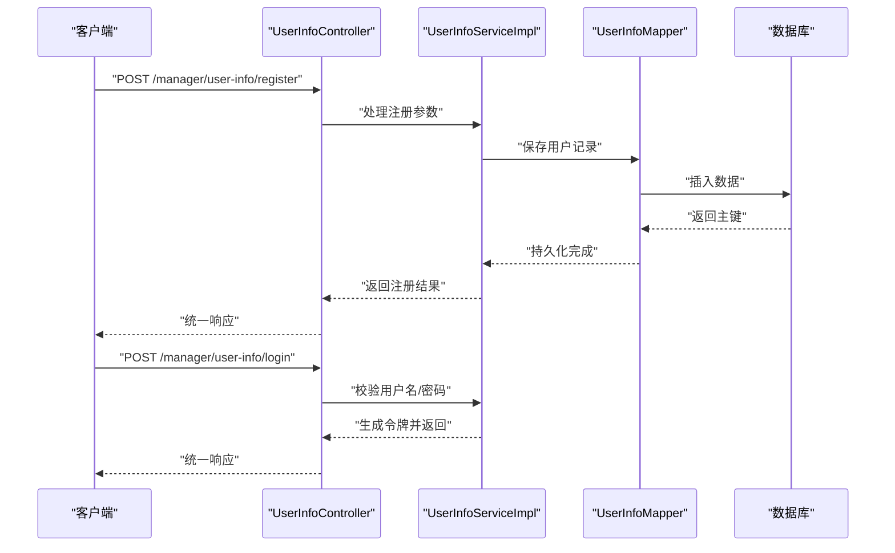
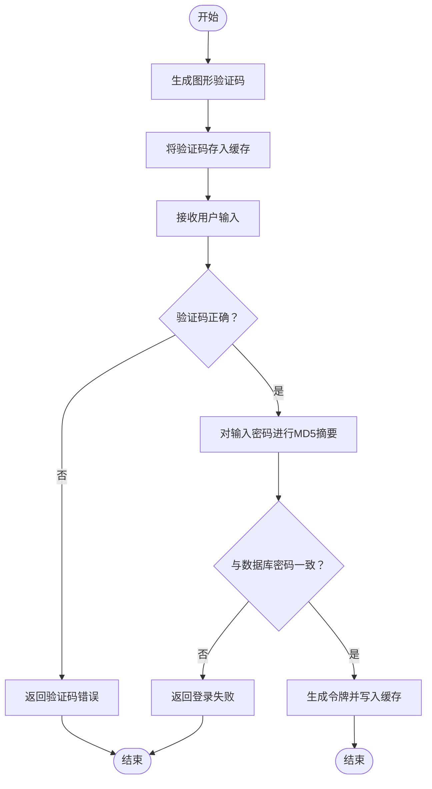
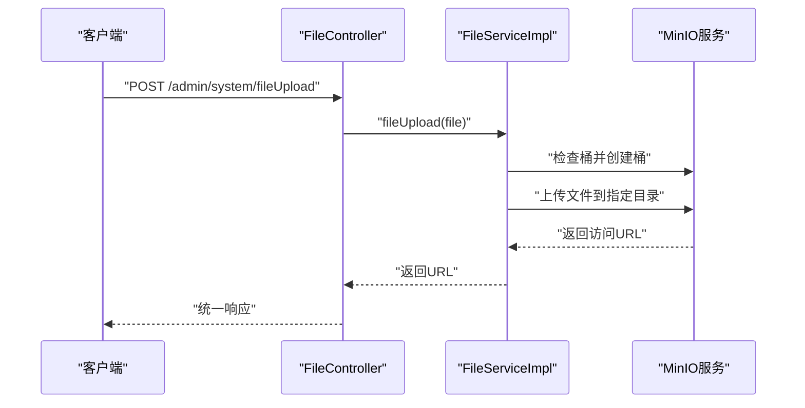
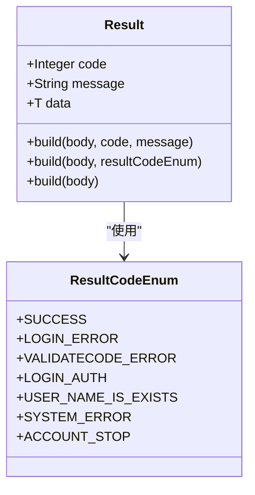
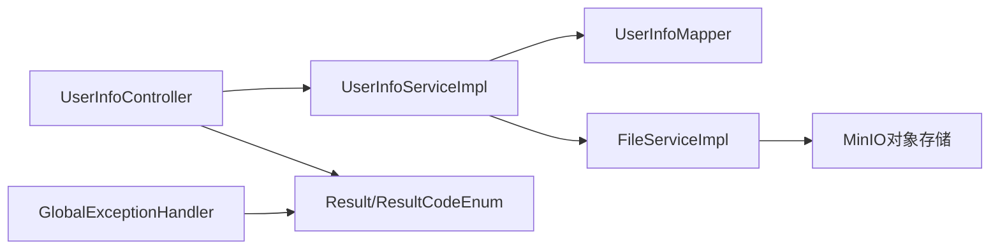

# 用户信息管理接口

<cite>
**本文档引用的文件**
- [UserInfoController.java](file://spzx-manager/src/main/java/com/joker/spzx/manager/controller/UserInfoController.java)
- [UserInfoService.java](file://spzx-manager/src/main/java/com/joker/spzx/manager/service/UserInfoService.java)
- [UserInfoServiceImpl.java](file://spzx-manager/src/main/java/com/joker/spzx/manager/service/impl/UserInfoServiceImpl.java)
- [UserInfoMapper.java](file://spzx-manager/src/main/java/com/joker/spzx/manager/mapper/UserInfoMapper.java)
- [UserInfo.java](file://spzx-model/src/main/java/com/joker/spzx/model/entity/user/UserInfo.java)
- [UserRegisterDto.java](file://spzx-model/src/main/java/com/joker/spzx/model/dto/h5/UserRegisterDto.java)
- [UserLoginDto.java](file://spzx-model/src/main/java/com/joker/spzx/model/dto/h5/UserLoginDto.java)
- [UserInfoVo.java](file://spzx-model/src/main/java/com/joker/spzx/model/vo/h5/UserInfoVo.java)
- [SysUserServiceImpl.java](file://spzx-manager/src/main/java/com/joker/spzx/manager/service/impl/SysUserServiceImpl.java)
- [SysUser.java](file://spzx-model/src/main/java/com/joker/spzx/model/entity/system/SysUser.java)
- [FileController.java](file://spzx-manager/src/main/java/com/joker/spzx/manager/controller/FileController.java)
- [FileServiceImpl.java](file://spzx-manager/src/main/java/com/joker/spzx/manager/service/impl/FileServiceImpl.java)
- [Result.java](file://spzx-model/src/main/java/com/joker/spzx/model/vo/common/Result.java)
- [ResultCodeEnum.java](file://spzx-model/src/main/java/com/joker/spzx/model/vo/common/ResultCodeEnum.java)
- [GlobalExceptionHandler.java](file://spzx-common/common-service/src/main/java/com/joker/spzx/common/exception/GlobalExceptionHandler.java)
- [application.yml](file://spzx-manager/src/main/resources/application.yml)
</cite>

## 目录
1. [简介](#简介)
2. [项目结构](#项目结构)
3. [核心组件](#核心组件)
4. [架构总览](#架构总览)
5. [详细组件分析](#详细组件分析)
6. [依赖关系分析](#依赖关系分析)
7. [性能考虑](#性能考虑)
8. [故障排除指南](#故障排除指南)
9. [结论](#结论)

## 简介
本文件面向SPZX电商管理系统中的“用户信息管理”模块，聚焦于用户基本信息的增删改查能力与相关配套功能（如注册、登录、个人信息修改、头像上传等）。文档从数据模型、认证流程、密码加密机制与安全验证等方面进行系统性梳理，并提供接口设计规范、请求参数说明、响应格式与错误码定义，帮助开发者快速理解与集成。

## 项目结构
围绕用户信息管理的相关代码分布在以下模块与包中：
- 控制层：用户信息控制器位于 manager 模块的 controller 包
- 服务层：用户信息服务接口与实现位于 manager 模块的 service 包
- 数据访问层：用户信息映射器位于 manager 模块的 mapper 包
- 模型层：用户实体、DTO、VO 定义位于 model 模块
- 文件上传：文件上传控制器与实现位于 manager 模块
- 公共异常与响应：统一异常处理与响应封装位于 common-service 与 model 模块

**图表来源**
- [UserInfoController.java:1-19](file://spzx-manager/src/main/java/com/joker/spzx/manager/controller/UserInfoController.java#L1-L19)
- [UserInfoService.java:1-17](file://spzx-manager/src/main/java/com/joker/spzx/manager/service/UserInfoService.java#L1-L17)
- [UserInfoServiceImpl.java:1-21](file://spzx-manager/src/main/java/com/joker/spzx/manager/service/impl/UserInfoServiceImpl.java#L1-L21)
- [UserInfoMapper.java:1-19](file://spzx-manager/src/main/java/com/joker/spzx/manager/mapper/UserInfoMapper.java#L1-L19)
- [UserInfo.java:1-64](file://spzx-model/src/main/java/com/joker/spzx/model/entity/user/UserInfo.java#L1-L64)
- [UserRegisterDto.java:1-22](file://spzx-model/src/main/java/com/joker/spzx/model/dto/h5/UserRegisterDto.java#L1-L22)
- [UserLoginDto.java:1-15](file://spzx-model/src/main/java/com/joker/spzx/model/dto/h5/UserLoginDto.java#L1-L15)
- [UserInfoVo.java:1-16](file://spzx-model/src/main/java/com/joker/spzx/model/vo/h5/UserInfoVo.java#L1-L16)
- [FileController.java:1-25](file://spzx-manager/src/main/java/com/joker/spzx/manager/controller/FileController.java#L1-L25)
- [FileServiceImpl.java:1-50](file://spzx-manager/src/main/java/com/joker/spzx/manager/service/impl/FileServiceImpl.java#L1-L50)

**章节来源**
- [UserInfoController.java:1-19](file://spzx-manager/src/main/java/com/joker/spzx/manager/controller/UserInfoController.java#L1-L19)
- [UserInfoService.java:1-17](file://spzx-manager/src/main/java/com/joker/spzx/manager/service/UserInfoService.java#L1-L17)
- [UserInfoServiceImpl.java:1-21](file://spzx-manager/src/main/java/com/joker/spzx/manager/service/impl/UserInfoServiceImpl.java#L1-L21)
- [UserInfoMapper.java:1-19](file://spzx-manager/src/main/java/com/joker/spzx/manager/mapper/UserInfoMapper.java#L1-L19)
- [UserInfo.java:1-64](file://spzx-model/src/main/java/com/joker/spzx/model/entity/user/UserInfo.java#L1-L64)
- [UserRegisterDto.java:1-22](file://spzx-model/src/main/java/com/joker/spzx/model/dto/h5/UserRegisterDto.java#L1-L22)
- [UserLoginDto.java:1-15](file://spzx-model/src/main/java/com/joker/spzx/model/dto/h5/UserLoginDto.java#L1-L15)
- [UserInfoVo.java:1-16](file://spzx-model/src/main/java/com/joker/spzx/model/vo/h5/UserInfoVo.java#L1-L16)
- [FileController.java:1-25](file://spzx-manager/src/main/java/com/joker/spzx/manager/controller/FileController.java#L1-L25)
- [FileServiceImpl.java:1-50](file://spzx-manager/src/main/java/com/joker/spzx/manager/service/impl/FileServiceImpl.java#L1-L50)

## 核心组件
- 用户信息实体：定义用户基本信息字段，包括用户名、密码、昵称、手机号、头像、性别、备注、第三方标识、最后登录IP与时间、状态等。
- 用户注册DTO：用于接收注册请求参数，包含用户名、密码、昵称与手机验证码。
- 用户登录DTO：用于接收登录请求参数，包含用户名与密码。
- 用户信息VO：用于对外返回用户的基本信息，包含昵称与头像。
- 用户信息服务接口与实现：基于MyBatis-Plus提供通用CRUD能力。
- 文件上传服务：基于MinIO实现头像上传，返回可访问URL。
- 统一响应与异常处理：提供标准响应体与全局异常处理，统一错误码。

**章节来源**
- [UserInfo.java:1-64](file://spzx-model/src/main/java/com/joker/spzx/model/entity/user/UserInfo.java#L1-L64)
- [UserRegisterDto.java:1-22](file://spzx-model/src/main/java/com/joker/spzx/model/dto/h5/UserRegisterDto.java#L1-L22)
- [UserLoginDto.java:1-15](file://spzx-model/src/main/java/com/joker/spzx/model/dto/h5/UserLoginDto.java#L1-L15)
- [UserInfoVo.java:1-16](file://spzx-model/src/main/java/com/joker/spzx/model/vo/h5/UserInfoVo.java#L1-L16)
- [UserInfoService.java:1-17](file://spzx-manager/src/main/java/com/joker/spzx/manager/service/UserInfoService.java#L1-L17)
- [UserInfoServiceImpl.java:1-21](file://spzx-manager/src/main/java/com/joker/spzx/manager/service/impl/UserInfoServiceImpl.java#L1-L21)
- [FileServiceImpl.java:1-50](file://spzx-manager/src/main/java/com/joker/spzx/manager/service/impl/FileServiceImpl.java#L1-L50)
- [Result.java:1-45](file://spzx-model/src/main/java/com/joker/spzx/model/vo/common/Result.java#L1-L45)
- [ResultCodeEnum.java:1-32](file://spzx-model/src/main/java/com/joker/spzx/model/vo/common/ResultCodeEnum.java#L1-L32)
- [GlobalExceptionHandler.java:1-20](file://spzx-common/common-service/src/main/java/com/joker/spzx/common/exception/GlobalExceptionHandler.java#L1-L20)

## 架构总览
用户信息管理采用经典的分层架构：
- 表现层：控制器负责接收HTTP请求，调用服务层处理业务逻辑。
- 服务层：封装业务规则，协调数据访问与外部依赖（如MinIO）。
- 数据访问层：基于MyBatis-Plus简化数据库操作。
- 模型层：统一的数据结构定义，确保前后端契约清晰。
- 异常与响应：全局异常捕获与统一响应封装，提升一致性与可观测性。

**图表来源**
- [UserInfoController.java:1-19](file://spzx-manager/src/main/java/com/joker/spzx/manager/controller/UserInfoController.java#L1-L19)
- [UserInfoServiceImpl.java:1-21](file://spzx-manager/src/main/java/com/joker/spzx/manager/service/impl/UserInfoServiceImpl.java#L1-L21)
- [UserInfoMapper.java:1-19](file://spzx-manager/src/main/java/com/joker/spzx/manager/mapper/UserInfoMapper.java#L1-L19)
- [FileServiceImpl.java:1-50](file://spzx-manager/src/main/java/com/joker/spzx/manager/service/impl/FileServiceImpl.java#L1-L50)
- [Result.java:1-45](file://spzx-model/src/main/java/com/joker/spzx/model/vo/common/Result.java#L1-L45)
- [GlobalExceptionHandler.java:1-20](file://spzx-common/common-service/src/main/java/com/joker/spzx/common/exception/GlobalExceptionHandler.java#L1-L20)

## 详细组件分析

### 用户信息实体与数据模型
用户信息实体包含以下关键字段：
- 基本信息：用户名、昵称、性别、手机号、备注
- 安全信息：密码、第三方标识（open_id、union_id）
- 登录信息：最后登录IP、最后登录时间
- 状态：1为正常，0为禁止
- 资源信息：头像URL

**图表来源**
- [UserInfo.java:1-64](file://spzx-model/src/main/java/com/joker/spzx/model/entity/user/UserInfo.java#L1-L64)

**章节来源**
- [UserInfo.java:1-64](file://spzx-model/src/main/java/com/joker/spzx/model/entity/user/UserInfo.java#L1-L64)

### 用户注册与登录流程
- 注册：接收用户名、密码、昵称与手机验证码，完成用户创建（密码需加密存储）。
- 登录：接收用户名与密码，进行身份校验与令牌签发。

**图表来源**
- [UserInfoController.java:1-19](file://spzx-manager/src/main/java/com/joker/spzx/manager/controller/UserInfoController.java#L1-L19)
- [UserInfoServiceImpl.java:1-21](file://spzx-manager/src/main/java/com/joker/spzx/manager/service/impl/UserInfoServiceImpl.java#L1-L21)
- [UserInfoMapper.java:1-19](file://spzx-manager/src/main/java/com/joker/spzx/manager/mapper/UserInfoMapper.java#L1-L19)

**章节来源**
- [UserRegisterDto.java:1-22](file://spzx-model/src/main/java/com/joker/spzx/model/dto/h5/UserRegisterDto.java#L1-L22)
- [UserLoginDto.java:1-15](file://spzx-model/src/main/java/com/joker/spzx/model/dto/h5/UserLoginDto.java#L1-L15)
- [UserInfoServiceImpl.java:1-21](file://spzx-manager/src/main/java/com/joker/spzx/manager/service/impl/UserInfoServiceImpl.java#L1-L21)

### 密码加密机制与安全验证
- 密码加密：服务层在保存或校验密码时使用MD5摘要算法进行加密存储与比对。
- 验证码：系统支持图形验证码生成与校验，防止暴力破解。
- 会话管理：登录成功后生成令牌并存储至缓存，后续接口通过令牌鉴权。

**图表来源**
- [SysUserServiceImpl.java:56-84](file://spzx-manager/src/main/java/com/joker/spzx/manager/service/impl/SysUserServiceImpl.java#L56-L84)
- [ResultCodeEnum.java:1-32](file://spzx-model/src/main/java/com/joker/spzx/model/vo/common/ResultCodeEnum.java#L1-L32)

**章节来源**
- [SysUserServiceImpl.java:56-84](file://spzx-manager/src/main/java/com/joker/spzx/manager/service/impl/SysUserServiceImpl.java#L56-L84)
- [ResultCodeEnum.java:1-32](file://spzx-model/src/main/java/com/joker/spzx/model/vo/common/ResultCodeEnum.java#L1-L32)

### 头像上传与资源管理
- 接口路径：/admin/system/fileUpload
- 请求方式：POST
- 参数：multipart/form-data，字段名为file
- 存储：使用MinIO对象存储，按日期目录组织文件名
- 返回：统一响应，data为可访问的文件URL

**图表来源**
- [FileController.java:1-25](file://spzx-manager/src/main/java/com/joker/spzx/manager/controller/FileController.java#L1-L25)
- [FileServiceImpl.java:1-50](file://spzx-manager/src/main/java/com/joker/spzx/manager/service/impl/FileServiceImpl.java#L1-L50)

**章节来源**
- [FileController.java:1-25](file://spzx-manager/src/main/java/com/joker/spzx/manager/controller/FileController.java#L1-L25)
- [FileServiceImpl.java:1-50](file://spzx-manager/src/main/java/com/joker/spzx/manager/service/impl/FileServiceImpl.java#L1-L50)

### 统一响应与错误码
- 统一响应体：包含业务状态码、消息与业务数据
- 错误码枚举：涵盖登录失败、验证码错误、用户未登录、用户名已存在、系统错误等
- 全局异常处理：捕获自定义异常并返回对应错误码

**图表来源**
- [Result.java:1-45](file://spzx-model/src/main/java/com/joker/spzx/model/vo/common/Result.java#L1-L45)
- [ResultCodeEnum.java:1-32](file://spzx-model/src/main/java/com/joker/spzx/model/vo/common/ResultCodeEnum.java#L1-L32)

**章节来源**
- [Result.java:1-45](file://spzx-model/src/main/java/com/joker/spzx/model/vo/common/Result.java#L1-L45)
- [ResultCodeEnum.java:1-32](file://spzx-model/src/main/java/com/joker/spzx/model/vo/common/ResultCodeEnum.java#L1-L32)
- [GlobalExceptionHandler.java:1-20](file://spzx-common/common-service/src/main/java/com/joker/spzx/common/exception/GlobalExceptionHandler.java#L1-L20)

## 依赖关系分析
- 控制器依赖服务层；服务层依赖映射器；映射器依赖数据库。
- 文件上传控制器依赖文件上传服务；服务层依赖MinIO客户端。
- 统一响应与异常处理贯穿各层，保证接口一致性。

**图表来源**
- [UserInfoController.java:1-19](file://spzx-manager/src/main/java/com/joker/spzx/manager/controller/UserInfoController.java#L1-L19)
- [UserInfoServiceImpl.java:1-21](file://spzx-manager/src/main/java/com/joker/spzx/manager/service/impl/UserInfoServiceImpl.java#L1-L21)
- [UserInfoMapper.java:1-19](file://spzx-manager/src/main/java/com/joker/spzx/manager/mapper/UserInfoMapper.java#L1-L19)
- [FileServiceImpl.java:1-50](file://spzx-manager/src/main/java/com/joker/spzx/manager/service/impl/FileServiceImpl.java#L1-L50)
- [Result.java:1-45](file://spzx-model/src/main/java/com/joker/spzx/model/vo/common/Result.java#L1-L45)
- [ResultCodeEnum.java:1-32](file://spzx-model/src/main/java/com/joker/spzx/model/vo/common/ResultCodeEnum.java#L1-L32)
- [GlobalExceptionHandler.java:1-20](file://spzx-common/common-service/src/main/java/com/joker/spzx/common/exception/GlobalExceptionHandler.java#L1-L20)

**章节来源**
- [UserInfoController.java:1-19](file://spzx-manager/src/main/java/com/joker/spzx/manager/controller/UserInfoController.java#L1-L19)
- [UserInfoServiceImpl.java:1-21](file://spzx-manager/src/main/java/com/joker/spzx/manager/service/impl/UserInfoServiceImpl.java#L1-L21)
- [UserInfoMapper.java:1-19](file://spzx-manager/src/main/java/com/joker/spzx/manager/mapper/UserInfoMapper.java#L1-L19)
- [FileServiceImpl.java:1-50](file://spzx-manager/src/main/java/com/joker/spzx/manager/service/impl/FileServiceImpl.java#L1-L50)
- [Result.java:1-45](file://spzx-model/src/main/java/com/joker/spzx/model/vo/common/Result.java#L1-L45)
- [ResultCodeEnum.java:1-32](file://spzx-model/src/main/java/com/joker/spzx/model/vo/common/ResultCodeEnum.java#L1-L32)
- [GlobalExceptionHandler.java:1-20](file://spzx-common/common-service/src/main/java/com/joker/spzx/common/exception/GlobalExceptionHandler.java#L1-L20)

## 性能考虑
- 缓存策略：登录态令牌建议存储于高性能缓存（如Redis），设置合理过期时间，降低数据库压力。
- 文件存储：头像上传采用对象存储，具备高可用与扩展性；建议开启CDN加速与压缩。
- 分页查询：用户列表查询建议使用分页参数，避免一次性加载大量数据。
- 加密成本：MD5摘要计算简单高效，但生产环境建议采用更安全的哈希算法与盐值策略。

## 故障排除指南
- 登录失败：检查用户名与密码是否匹配，确认验证码是否正确。
- 验证码错误：确认验证码是否在有效期内，以及提交的key与value是否一致。
- 用户未登录：确认请求头中携带正确的令牌，令牌是否已过期。
- 用户名已存在：注册时检查用户名唯一性约束。
- 系统错误：查看全局异常处理器返回的具体错误码与消息，定位问题根因。

**章节来源**
- [ResultCodeEnum.java:1-32](file://spzx-model/src/main/java/com/joker/spzx/model/vo/common/ResultCodeEnum.java#L1-L32)
- [GlobalExceptionHandler.java:1-20](file://spzx-common/common-service/src/main/java/com/joker/spzx/common/exception/GlobalExceptionHandler.java#L1-L20)

## 结论
本接口文档基于现有代码结构梳理了用户信息管理的关键能力与实现要点，明确了数据模型、认证流程、密码加密与安全验证机制，并提供了统一响应与异常处理方案。建议在后续迭代中完善用户信息控制器的具体接口实现，补充头像上传与个人信息修改等接口，并持续优化安全策略与性能表现。