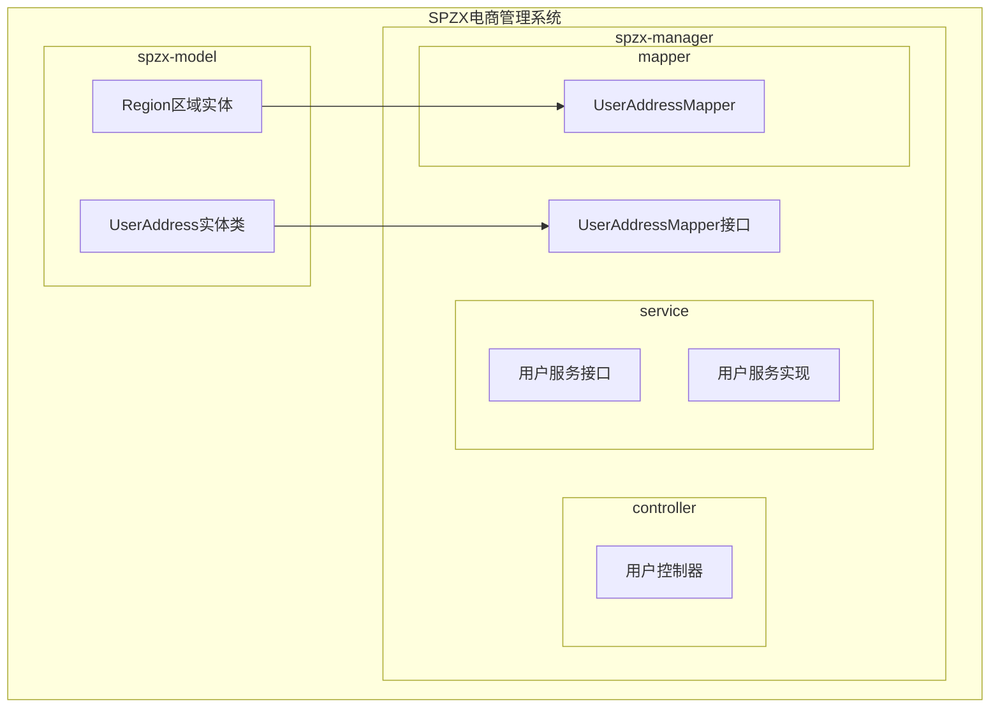
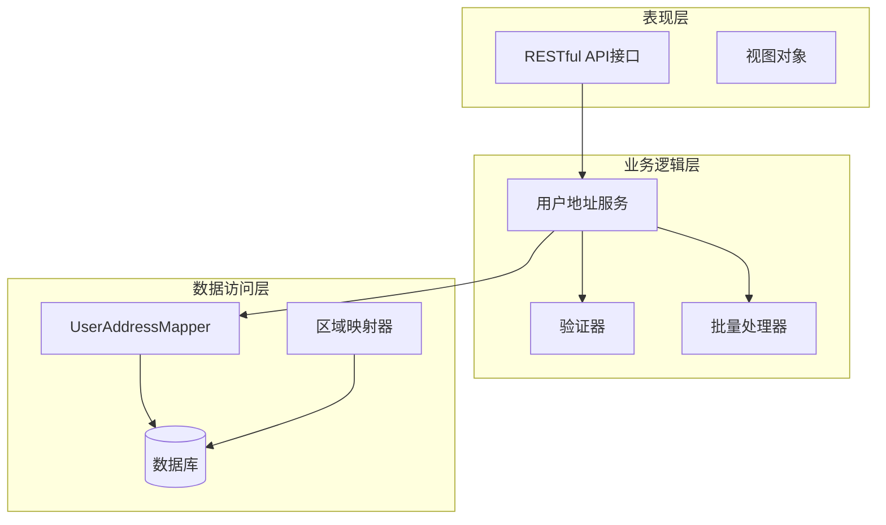
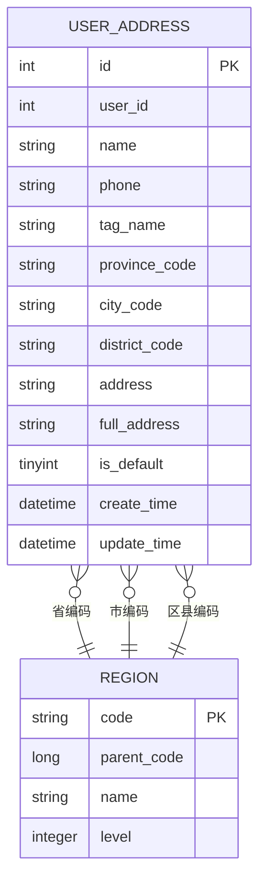
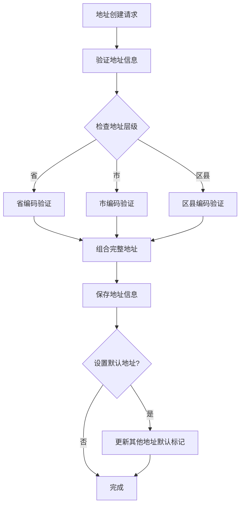
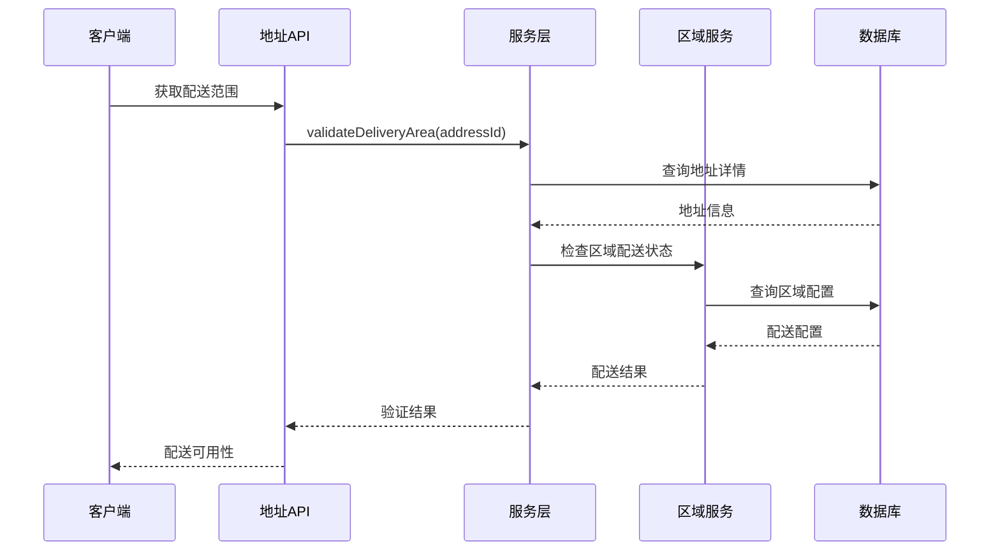
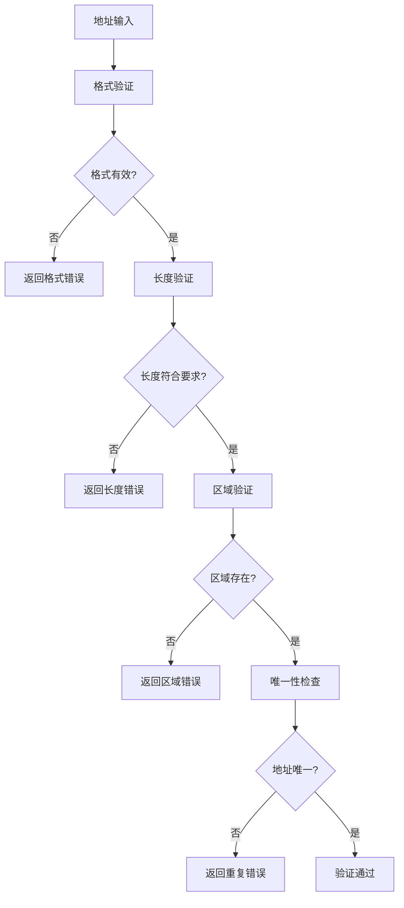
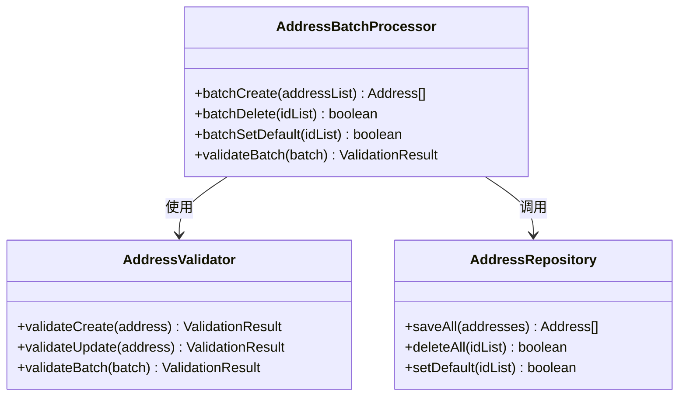
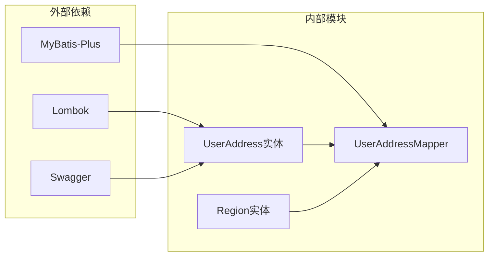
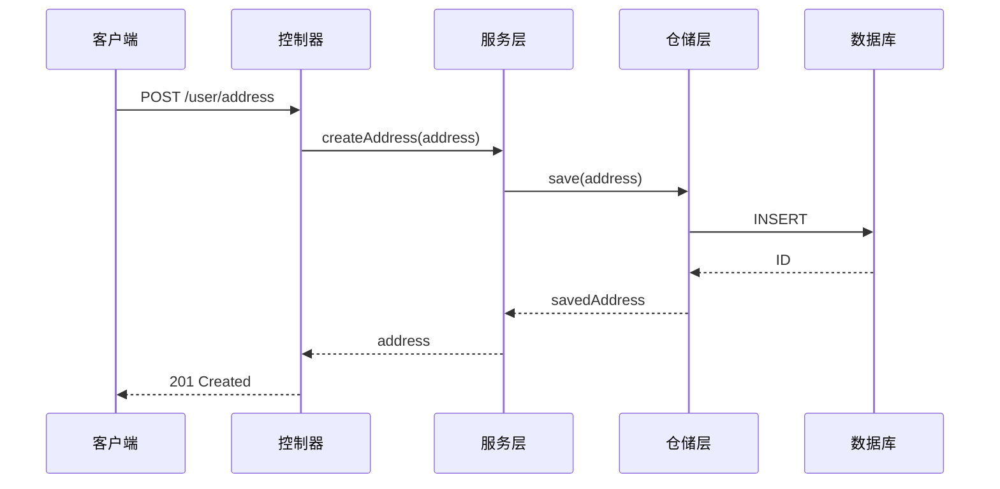
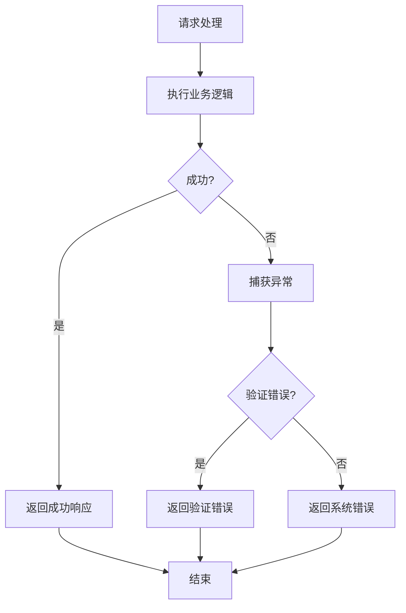

# 用户地址管理接口

<cite>
**本文档引用的文件**
- [UserAddress.java](file://spzx-model/src/main/java/com/joker/spzx/model/entity/user/UserAddress.java)
- [UserAddressMapper.java](file://spzx-manager/src/main/java/com/joker/spzx/manager/mapper/UserAddressMapper.java)
- [Region.java](file://spzx-model/src/main/java/com/joker/spzx/model/entity/base/Region.java)
</cite>

## 目录
1. [简介](#简介)
2. [项目结构](#项目结构)
3. [核心组件](#核心组件)
4. [架构概览](#架构概览)
5. [详细组件分析](#详细组件分析)
6. [依赖分析](#依赖分析)
7. [性能考虑](#性能考虑)
8. [故障排除指南](#故障排除指南)
9. [结论](#结论)

## 简介

SPZX电商管理系统中的用户地址管理模块提供了完整的收货地址管理功能。该模块支持地址的增删改查操作，包括地址添加、编辑、删除、设置默认地址等功能。系统采用分层架构设计，通过MyBatis-Plus实现数据持久化，支持地址层级结构（省市区县）管理和配送范围判断。

## 项目结构

用户地址管理模块在SPZX系统中的组织结构如下：

**图表来源**
- [UserAddress.java:1-51](file://spzx-model/src/main/java/com/joker/spzx/model/entity/user/UserAddress.java#L1-L51)
- [UserAddressMapper.java:1-19](file://spzx-manager/src/main/java/com/joker/spzx/manager/mapper/UserAddressMapper.java#L1-L19)
- [Region.java:1-22](file://spzx-model/src/main/java/com/joker/spzx/model/entity/base/Region.java#L1-L22)

**章节来源**
- [UserAddress.java:1-51](file://spzx-model/src/main/java/com/joker/spzx/model/entity/user/UserAddress.java#L1-L51)
- [UserAddressMapper.java:1-19](file://spzx-manager/src/main/java/com/joker/spzx/manager/mapper/UserAddressMapper.java#L1-L19)
- [Region.java:1-22](file://spzx-model/src/main/java/com/joker/spzx/model/entity/base/Region.java#L1-L22)

## 核心组件

### 数据模型

用户地址管理模块的核心数据模型由以下关键组件构成：

#### UserAddress实体类
UserAddress实体类定义了用户地址的基本属性和业务规则：
- 用户标识：关联到系统用户
- 收货人信息：姓名和联系电话
- 地址层级：省市区县四级编码
- 地址详情：详细地址信息
- 完整地址：标准化后的完整地址
- 默认标记：标识默认收货地址

#### Region区域实体
Region实体类提供了区域层级管理能力：
- 区域编码：唯一标识符
- 父区域：支持多级嵌套关系
- 区域级别：省市区县不同层级
- 区域名称：显示用名称

**章节来源**
- [UserAddress.java:12-51](file://spzx-model/src/main/java/com/joker/spzx/model/entity/user/UserAddress.java#L12-L51)
- [Region.java:8-22](file://spzx-model/src/main/java/com/joker/spzx/model/entity/base/Region.java#L8-L22)

## 架构概览

用户地址管理模块采用经典的三层架构模式：

**图表来源**
- [UserAddressMapper.java:15-18](file://spzx-manager/src/main/java/com/joker/spzx/manager/mapper/UserAddressMapper.java#L15-L18)

## 详细组件分析

### 地址数据模型

**图表来源**
- [UserAddress.java:14-48](file://spzx-model/src/main/java/com/joker/spzx/model/entity/user/UserAddress.java#L14-L48)
- [Region.java:10-20](file://spzx-model/src/main/java/com/joker/spzx/model/entity/base/Region.java#L10-L20)

### 地址层级结构

系统支持四级地址层级结构：

**图表来源**
- [UserAddress.java:29-48](file://spzx-model/src/main/java/com/joker/spzx/model/entity/user/UserAddress.java#L29-L48)

### 配送范围判断

**图表来源**
- [UserAddress.java:39-44](file://spzx-model/src/main/java/com/joker/spzx/model/entity/user/UserAddress.java#L39-L44)

### 地址验证机制

系统实现了多层次的地址验证机制：

**图表来源**
- [UserAddress.java:18-27](file://spzx-model/src/main/java/com/joker/spzx/model/entity/user/UserAddress.java#L18-L27)

### 批量操作功能

系统支持批量地址操作：

**图表来源**
- [UserAddressMapper.java:16](file://spzx-manager/src/main/java/com/joker/spzx/manager/mapper/UserAddressMapper.java#L16)

**章节来源**
- [UserAddress.java:1-51](file://spzx-model/src/main/java/com/joker/spzx/model/entity/user/UserAddress.java#L1-L51)
- [UserAddressMapper.java:1-19](file://spzx-manager/src/main/java/com/joker/spzx/manager/mapper/UserAddressMapper.java#L1-L19)

## 依赖分析

### 组件耦合关系

**图表来源**
- [UserAddress.java:3-11](file://spzx-model/src/main/java/com/joker/spzx/model/entity/user/UserAddress.java#L3-L11)
- [UserAddressMapper.java:3-5](file://spzx-manager/src/main/java/com/joker/spzx/manager/mapper/UserAddressMapper.java#L3-L5)

### 数据流分析

**图表来源**
- [UserAddressMapper.java:16](file://spzx-manager/src/main/java/com/joker/spzx/manager/mapper/UserAddressMapper.java#L16)

**章节来源**
- [UserAddress.java:1-51](file://spzx-model/src/main/java/com/joker/spzx/model/entity/user/UserAddress.java#L1-L51)
- [UserAddressMapper.java:1-19](file://spzx-manager/src/main/java/com/joker/spzx/manager/mapper/UserAddressMapper.java#L1-L19)

## 性能考虑

### 数据库优化
- 建议在用户ID、省市区编码字段上建立索引以提升查询性能
- 对常用查询条件建立复合索引
- 实现分页查询避免大量数据传输

### 缓存策略
- 地区数据可缓存到Redis中减少数据库查询
- 用户地址列表可使用本地缓存
- 配送范围配置可设置合理的过期时间

### 并发控制
- 使用乐观锁处理地址更新冲突
- 实现分布式锁防止并发设置默认地址
- 采用事务保证数据一致性

## 故障排除指南

### 常见问题及解决方案

| 问题类型 | 症状 | 可能原因 | 解决方案 |
|---------|------|----------|----------|
| 地址验证失败 | 返回格式错误 | 字段为空或格式不正确 | 检查必填字段和格式规范 |
| 区域不存在 | 区域验证失败 | 编码不正确或数据缺失 | 确认区域编码有效性 |
| 默认地址冲突 | 设置默认失败 | 多个默认地址 | 清理现有默认标记 |
| 并发更新异常 | 数据不一致 | 并发修改 | 使用乐观锁或分布式锁 |

### 错误处理流程

**章节来源**
- [UserAddress.java:1-51](file://spzx-model/src/main/java/com/joker/spzx/model/entity/user/UserAddress.java#L1-L51)

## 结论

SPZX电商管理系统的用户地址管理模块提供了完整的地址管理解决方案。通过清晰的数据模型设计、完善的验证机制和灵活的业务逻辑，系统能够满足电商场景下的各种地址管理需求。

模块的主要优势包括：
- 完整的地址层级结构支持
- 强大的验证和错误处理机制  
- 灵活的默认地址管理
- 可扩展的配送范围判断
- 高效的批量操作支持

建议在实际部署时重点关注数据库索引优化、缓存策略实施和并发控制机制，以确保系统在高并发场景下的稳定性和性能表现。