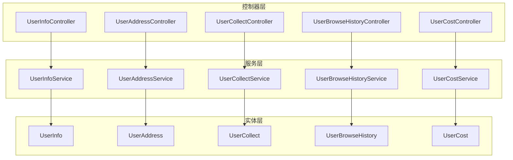
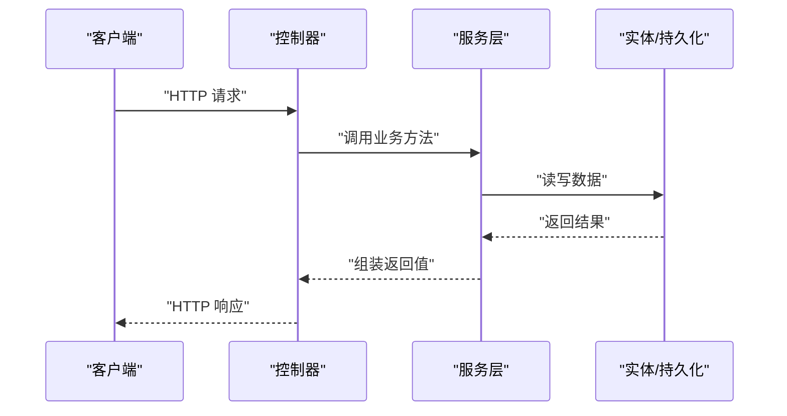
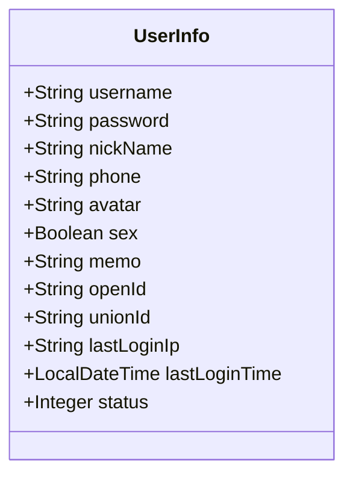
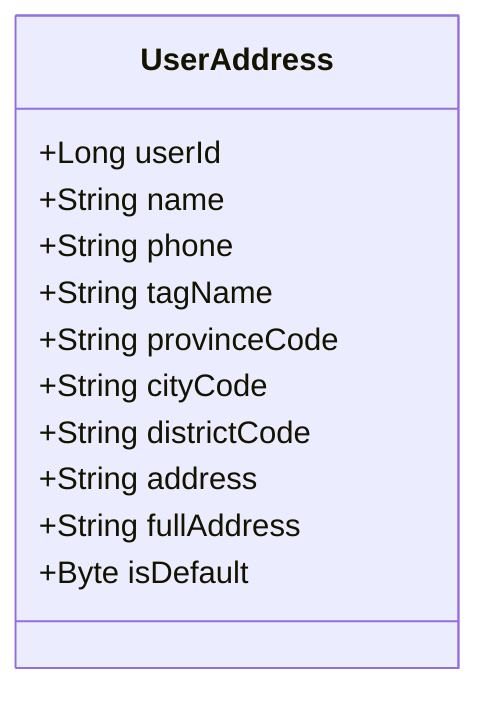
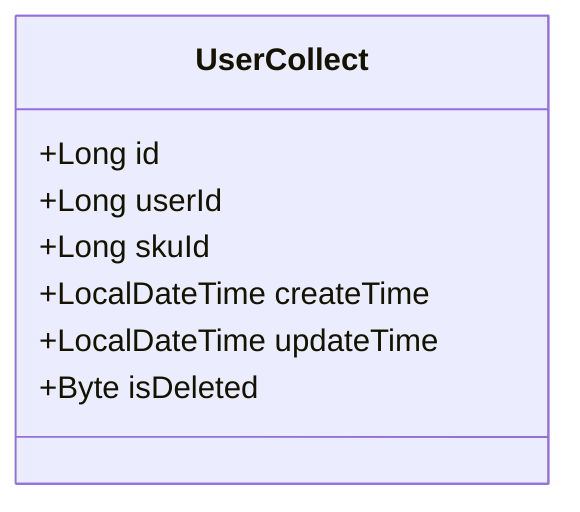
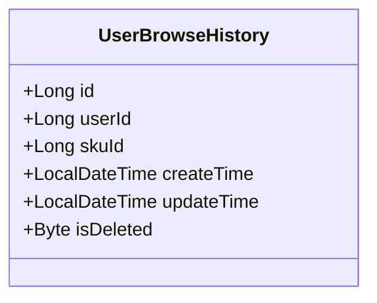
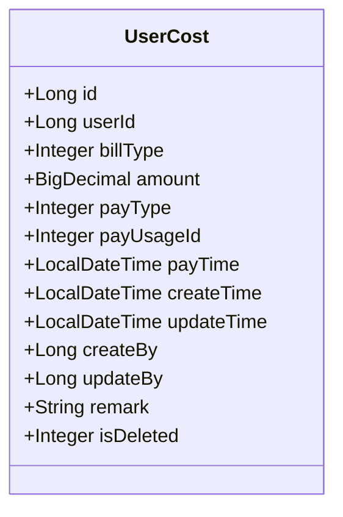
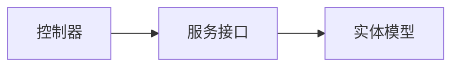

# 用户管理接口

<cite>
**本文引用的文件**
- [UserInfoController.java](file://spzx-manager/src/main/java/com/joker/spzx/manager/controller/UserInfoController.java)
- [UserAddressController.java](file://spzx-manager/src/main/java/com/joker/spzx/manager/controller/UserAddressController.java)
- [UserCollectController.java](file://spzx-manager/src/main/java/com/joker/spzx/manager/controller/UserCollectController.java)
- [UserBrowseHistoryController.java](file://spzx-manager/src/main/java/com/joker/spzx/manager/controller/UserBrowseHistoryController.java)
- [UserCostController.java](file://spzx-manager/src/main/java/com/joker/spzx/manager/controller/UserCostController.java)
- [UserInfoService.java](file://spzx-manager/src/main/java/com/joker/spzx/manager/service/UserInfoService.java)
- [UserAddressService.java](file://spzx-manager/src/main/java/com/joker/spzx/manager/service/UserAddressService.java)
- [UserCollectService.java](file://spzx-manager/src/main/java/com/joker/spzx/manager/service/UserCollectService.java)
- [UserBrowseHistoryService.java](file://spzx-manager/src/main/java/com/joker/spzx/manager/service/UserBrowseHistoryService.java)
- [UserCostService.java](file://spzx-manager/src/main/java/com/joker/spzx/manager/service/UserCostService.java)
- [UserInfo.java](file://spzx-model/src/main/java/com/joker/spzx/model/entity/user/UserInfo.java)
- [UserAddress.java](file://spzx-model/src/main/java/com/joker/spzx/model/entity/user/UserAddress.java)
- [UserCollect.java](file://spzx-model/src/main/java/com/joker/spzx/model/entity/user/UserCollect.java)
- [UserBrowseHistory.java](file://spzx-model/src/main/java/com/joker/spzx/model/entity/user/UserBrowseHistory.java)
- [UserCost.java](file://spzx-model/src/main/java/com/joker/spzx/model/entity/user/UserCost.java)
</cite>

## 目录
1. [简介](#简介)
2. [项目结构](#项目结构)
3. [核心组件](#核心组件)
4. [架构总览](#架构总览)
5. [详细组件分析](#详细组件分析)
6. [依赖分析](#依赖分析)
7. [性能考虑](#性能考虑)
8. [故障排查指南](#故障排查指南)
9. [结论](#结论)
10. [附录](#附录)

## 简介
本文件面向SPZX电商管理系统中的“用户管理”模块，聚焦于用户信息、收货地址、收藏夹与浏览历史等用户相关能力的接口设计与实现说明。文档覆盖以下主题：
- 用户资料管理：用户信息的增删改查与分页查询
- 收货地址管理：地址的增删改查、层级查询与默认地址设置
- 商品收藏与浏览历史：收藏与浏览记录的增删改查
- 账单与成本：用户收支明细的分页查询、详情查看、新增与修改、删除
- 数据模型与字段说明：用户、地址、收藏、浏览历史、账单的字段定义与约束
- 隐私与安全：登录态、权限控制与敏感字段处理建议
- 扩展方向：用户等级、积分、优惠券关联的扩展点说明

## 项目结构
用户管理相关代码采用典型的分层架构：
- 控制器层：负责HTTP接口暴露与参数接收
- 服务层：封装业务逻辑与数据访问边界
- 实体层：描述数据库表结构与字段含义
- DTO/VO：传输对象与视图对象，用于接口参数与返回值建模

图表来源
- [UserInfoController.java:1-19](file://spzx-manager/src/main/java/com/joker/spzx/manager/controller/UserInfoController.java#L1-L19)
- [UserAddressController.java:1-19](file://spzx-manager/src/main/java/com/joker/spzx/manager/controller/UserAddressController.java#L1-L19)
- [UserCollectController.java:1-19](file://spzx-manager/src/main/java/com/joker/spzx/manager/controller/UserCollectController.java#L1-L19)
- [UserBrowseHistoryController.java:1-19](file://spzx-manager/src/main/java/com/joker/spzx/manager/controller/UserBrowseHistoryController.java#L1-L19)
- [UserCostController.java:1-59](file://spzx-manager/src/main/java/com/joker/spzx/manager/controller/UserCostController.java#L1-L59)
- [UserInfoService.java:1-17](file://spzx-manager/src/main/java/com/joker/spzx/manager/service/UserInfoService.java#L1-L17)
- [UserAddressService.java:1-17](file://spzx-manager/src/main/java/com/joker/spzx/manager/service/UserAddressService.java#L1-L17)
- [UserCollectService.java:1-17](file://spzx-manager/src/main/java/com/joker/spzx/manager/service/UserCollectService.java#L1-L17)
- [UserBrowseHistoryService.java:1-17](file://spzx-manager/src/main/java/com/joker/spzx/manager/service/UserBrowseHistoryService.java#L1-L17)
- [UserCostService.java:1-31](file://spzx-manager/src/main/java/com/joker/spzx/manager/service/UserCostService.java#L1-L31)
- [UserInfo.java:1-64](file://spzx-model/src/main/java/com/joker/spzx/model/entity/user/UserInfo.java#L1-L64)
- [UserAddress.java:1-51](file://spzx-model/src/main/java/com/joker/spzx/model/entity/user/UserAddress.java#L1-L51)
- [UserCollect.java:1-58](file://spzx-model/src/main/java/com/joker/spzx/model/entity/user/UserCollect.java#L1-L58)
- [UserBrowseHistory.java:1-58](file://spzx-model/src/main/java/com/joker/spzx/model/entity/user/UserBrowseHistory.java#L1-L58)
- [UserCost.java:1-79](file://spzx-model/src/main/java/com/joker/spzx/model/entity/user/UserCost.java#L1-L79)

章节来源
- [UserInfoController.java:1-19](file://spzx-manager/src/main/java/com/joker/spzx/manager/controller/UserInfoController.java#L1-L19)
- [UserAddressController.java:1-19](file://spzx-manager/src/main/java/com/joker/spzx/manager/controller/UserAddressController.java#L1-L19)
- [UserCollectController.java:1-19](file://spzx-manager/src/main/java/com/joker/spzx/manager/controller/UserCollectController.java#L1-L19)
- [UserBrowseHistoryController.java:1-19](file://spzx-manager/src/main/java/com/joker/spzx/manager/controller/UserBrowseHistoryController.java#L1-L19)
- [UserCostController.java:1-59](file://spzx-manager/src/main/java/com/joker/spzx/manager/controller/UserCostController.java#L1-L59)

## 核心组件
- 用户信息控制器与服务：提供用户资料的CRUD与分页查询能力
- 地址控制器与服务：提供地址的CRUD、层级查询与默认地址设置
- 收藏控制器与服务：提供收藏的CRUD与列表查询
- 浏览历史控制器与服务：提供浏览记录的CRUD与列表查询
- 成本账单控制器与服务：提供用户收支明细的分页、详情、新增、修改、删除

章节来源
- [UserInfoController.java:1-19](file://spzx-manager/src/main/java/com/joker/spzx/manager/controller/UserInfoController.java#L1-L19)
- [UserAddressController.java:1-19](file://spzx-manager/src/main/java/com/joker/spzx/manager/controller/UserAddressController.java#L1-L19)
- [UserCollectController.java:1-19](file://spzx-manager/src/main/java/com/joker/spzx/manager/controller/UserCollectController.java#L1-L19)
- [UserBrowseHistoryController.java:1-19](file://spzx-manager/src/main/java/com/joker/spzx/manager/controller/UserBrowseHistoryController.java#L1-L19)
- [UserCostController.java:1-59](file://spzx-manager/src/main/java/com/joker/spzx/manager/controller/UserCostController.java#L1-L59)
- [UserInfoService.java:1-17](file://spzx-manager/src/main/java/com/joker/spzx/manager/service/UserInfoService.java#L1-L17)
- [UserAddressService.java:1-17](file://spzx-manager/src/main/java/com/joker/spzx/manager/service/UserAddressService.java#L1-L17)
- [UserCollectService.java:1-17](file://spzx-manager/src/main/java/com/joker/spzx/manager/service/UserCollectService.java#L1-L17)
- [UserBrowseHistoryService.java:1-17](file://spzx-manager/src/main/java/com/joker/spzx/manager/service/UserBrowseHistoryService.java#L1-L17)
- [UserCostService.java:1-31](file://spzx-manager/src/main/java/com/joker/spzx/manager/service/UserCostService.java#L1-L31)

## 架构总览
用户管理模块遵循“控制器-服务-实体”的分层设计，控制器负责HTTP映射与参数绑定，服务层封装业务规则与数据访问，实体层映射数据库表结构。

图表来源
- [UserInfoController.java:1-19](file://spzx-manager/src/main/java/com/joker/spzx/manager/controller/UserInfoController.java#L1-L19)
- [UserAddressController.java:1-19](file://spzx-manager/src/main/java/com/joker/spzx/manager/controller/UserAddressController.java#L1-L19)
- [UserCollectController.java:1-19](file://spzx-manager/src/main/java/com/joker/spzx/manager/controller/UserCollectController.java#L1-L19)
- [UserBrowseHistoryController.java:1-19](file://spzx-manager/src/main/java/com/joker/spzx/manager/controller/UserBrowseHistoryController.java#L1-L19)
- [UserCostController.java:1-59](file://spzx-manager/src/main/java/com/joker/spzx/manager/controller/UserCostController.java#L1-L59)
- [UserInfoService.java:1-17](file://spzx-manager/src/main/java/com/joker/spzx/manager/service/UserInfoService.java#L1-L17)
- [UserAddressService.java:1-17](file://spzx-manager/src/main/java/com/joker/spzx/manager/service/UserAddressService.java#L1-L17)
- [UserCollectService.java:1-17](file://spzx-manager/src/main/java/com/joker/spzx/manager/service/UserCollectService.java#L1-L17)
- [UserBrowseHistoryService.java:1-17](file://spzx-manager/src/main/java/com/joker/spzx/manager/service/UserBrowseHistoryService.java#L1-L17)
- [UserCostService.java:1-31](file://spzx-manager/src/main/java/com/joker/spzx/manager/service/UserCostService.java#L1-L31)

## 详细组件分析

### 用户信息接口
- 接口范围
  - 用户资料CRUD与分页查询
  - 参数与返回值通过服务层与实体层进行约束
- 数据模型要点
  - 字段涵盖用户名、密码、昵称、电话、头像、性别、备注、第三方登录标识、最后登录IP与时间、状态等
- 安全与隐私
  - 密码字段属于敏感信息，需在接口中避免明文传输与存储
  - 登录态与权限校验应在控制器层统一处理

图表来源
- [UserInfo.java:1-64](file://spzx-model/src/main/java/com/joker/spzx/model/entity/user/UserInfo.java#L1-L64)

章节来源
- [UserInfoController.java:1-19](file://spzx-manager/src/main/java/com/joker/spzx/manager/controller/UserInfoController.java#L1-L19)
- [UserInfoService.java:1-17](file://spzx-manager/src/main/java/com/joker/spzx/manager/service/UserInfoService.java#L1-L17)
- [UserInfo.java:1-64](file://spzx-model/src/main/java/com/joker/spzx/model/entity/user/UserInfo.java#L1-L64)

### 收货地址接口
- 接口范围
  - 地址CRUD、层级查询（省市区编码）、默认地址设置
- 数据模型要点
  - 关联用户ID、收件人姓名、电话、标签、省市区编码、详细地址、完整地址、默认标记
- 默认地址策略
  - 同一用户仅允许一个默认地址；设置新默认地址时需先取消旧默认地址

图表来源
- [UserAddress.java:1-51](file://spzx-model/src/main/java/com/joker/spzx/model/entity/user/UserAddress.java#L1-L51)

章节来源
- [UserAddressController.java:1-19](file://spzx-manager/src/main/java/com/joker/spzx/manager/controller/UserAddressController.java#L1-L19)
- [UserAddressService.java:1-17](file://spzx-manager/src/main/java/com/joker/spzx/manager/service/UserAddressService.java#L1-L17)
- [UserAddress.java:1-51](file://spzx-model/src/main/java/com/joker/spzx/model/entity/user/UserAddress.java#L1-L51)

### 商品收藏接口
- 接口范围
  - 收藏CRUD与列表查询
- 数据模型要点
  - 关联用户ID与商品SKU ID，带创建/更新时间与软删除标记

图表来源
- [UserCollect.java:1-58](file://spzx-model/src/main/java/com/joker/spzx/model/entity/user/UserCollect.java#L1-L58)

章节来源
- [UserCollectController.java:1-19](file://spzx-manager/src/main/java/com/joker/spzx/manager/controller/UserCollectController.java#L1-L19)
- [UserCollectService.java:1-17](file://spzx-manager/src/main/java/com/joker/spzx/manager/service/UserCollectService.java#L1-L17)
- [UserCollect.java:1-58](file://spzx-model/src/main/java/com/joker/spzx/model/entity/user/UserCollect.java#L1-L58)

### 浏览历史接口
- 接口范围
  - 浏览记录CRUD与列表查询
- 数据模型要点
  - 关联用户ID与商品SKU ID，带创建/更新时间与软删除标记

图表来源
- [UserBrowseHistory.java:1-58](file://spzx-model/src/main/java/com/joker/spzx/model/entity/user/UserBrowseHistory.java#L1-L58)

章节来源
- [UserBrowseHistoryController.java:1-19](file://spzx-manager/src/main/java/com/joker/spzx/manager/controller/UserBrowseHistoryController.java#L1-L19)
- [UserBrowseHistoryService.java:1-17](file://spzx-manager/src/main/java/com/joker/spzx/manager/service/UserBrowseHistoryService.java#L1-L17)
- [UserBrowseHistory.java:1-58](file://spzx-model/src/main/java/com/joker/spzx/model/entity/user/UserBrowseHistory.java#L1-L58)

### 用户成本账单接口
- 接口范围
  - 分页查询、详情查看、新增、修改、删除
- 数据模型要点
  - 收支类型（收入/支出）、金额、支付方式、用途ID、时间、创建/更新人、备注等

图表来源
- [UserCost.java:1-79](file://spzx-model/src/main/java/com/joker/spzx/model/entity/user/UserCost.java#L1-L79)

章节来源
- [UserCostController.java:1-59](file://spzx-manager/src/main/java/com/joker/spzx/manager/controller/UserCostController.java#L1-L59)
- [UserCostService.java:1-31](file://spzx-manager/src/main/java/com/joker/spzx/manager/service/UserCostService.java#L1-L31)
- [UserCost.java:1-79](file://spzx-model/src/main/java/com/joker/spzx/model/entity/user/UserCost.java#L1-L79)

## 依赖分析
- 控制器到服务：每个控制器均依赖对应的服务接口，形成清晰的职责边界
- 服务到实体：服务层通过实体类进行数据建模与持久化操作
- 耦合与内聚：控制器与服务之间通过接口解耦，实体与服务之间通过MyBatis-Plus进行数据交互

图表来源
- [UserInfoController.java:1-19](file://spzx-manager/src/main/java/com/joker/spzx/manager/controller/UserInfoController.java#L1-L19)
- [UserAddressController.java:1-19](file://spzx-manager/src/main/java/com/joker/spzx/manager/controller/UserAddressController.java#L1-L19)
- [UserCollectController.java:1-19](file://spzx-manager/src/main/java/com/joker/spzx/manager/controller/UserCollectController.java#L1-L19)
- [UserBrowseHistoryController.java:1-19](file://spzx-manager/src/main/java/com/joker/spzx/manager/controller/UserBrowseHistoryController.java#L1-L19)
- [UserCostController.java:1-59](file://spzx-manager/src/main/java/com/joker/spzx/manager/controller/UserCostController.java#L1-L59)
- [UserInfoService.java:1-17](file://spzx-manager/src/main/java/com/joker/spzx/manager/service/UserInfoService.java#L1-L17)
- [UserAddressService.java:1-17](file://spzx-manager/src/main/java/com/joker/spzx/manager/service/UserAddressService.java#L1-L17)
- [UserCollectService.java:1-17](file://spzx-manager/src/main/java/com/joker/spzx/manager/service/UserCollectService.java#L1-L17)
- [UserBrowseHistoryService.java:1-17](file://spzx-manager/src/main/java/com/joker/spzx/manager/service/UserBrowseHistoryService.java#L1-L17)
- [UserCostService.java:1-31](file://spzx-manager/src/main/java/com/joker/spzx/manager/service/UserCostService.java#L1-L31)
- [UserInfo.java:1-64](file://spzx-model/src/main/java/com/joker/spzx/model/entity/user/UserInfo.java#L1-L64)
- [UserAddress.java:1-51](file://spzx-model/src/main/java/com/joker/spzx/model/entity/user/UserAddress.java#L1-L51)
- [UserCollect.java:1-58](file://spzx-model/src/main/java/com/joker/spzx/model/entity/user/UserCollect.java#L1-L58)
- [UserBrowseHistory.java:1-58](file://spzx-model/src/main/java/com/joker/spzx/model/entity/user/UserBrowseHistory.java#L1-L58)
- [UserCost.java:1-79](file://spzx-model/src/main/java/com/joker/spzx/model/entity/user/UserCost.java#L1-L79)

## 性能考虑
- 分页查询：对列表接口使用分页参数，避免一次性加载大量数据
- 索引优化：针对常用查询字段（如用户ID、SKU ID、创建时间）建立索引
- 缓存策略：对热点数据（如默认地址、最近浏览）引入缓存，降低数据库压力
- 并发控制：对默认地址切换、收藏/取消收藏等关键操作使用乐观锁或分布式锁
- 日志与监控：对高频接口增加埋点与告警，便于定位性能瓶颈

## 故障排查指南
- 常见问题
  - 参数缺失或类型不匹配：检查控制器参数绑定与DTO字段映射
  - 权限不足：确认登录态与角色权限校验逻辑
  - 默认地址冲突：确保同一用户仅有一个默认地址
  - 软删除影响：确认查询时是否排除已删除记录
- 排查步骤
  - 查看控制器日志与异常捕获
  - 核对服务层SQL执行计划与慢查询
  - 检查实体字段与数据库表结构一致性
  - 对比接口文档与实际返回值

## 结论
用户管理模块以清晰的分层架构实现了用户信息、地址、收藏、浏览历史与成本账单的核心能力。通过标准化的数据模型与接口设计，可为后续扩展用户等级、积分与优惠券关联提供良好基础。建议在生产环境中强化安全与性能措施，并完善接口文档与自动化测试。

## 附录

### 接口清单与规范
- 用户信息
  - GET /manager/user-info/{id}：获取用户详情
  - PUT /manager/user-info/update：更新用户信息
  - DELETE /manager/user-info/remove/{id}：删除用户
  - GET /manager/user-info/list：分页查询用户列表
- 收货地址
  - GET /manager/user-address/{id}：获取地址详情
  - PUT /manager/user-address/update：更新地址
  - DELETE /manager/user-address/remove/{id}：删除地址
  - GET /manager/user-address/list：分页查询地址列表
  - GET /manager/user-address/default：获取默认地址
  - PUT /manager/user-address/set-default/{id}：设置默认地址
- 商品收藏
  - GET /manager/user-collect/{id}：获取收藏详情
  - POST /manager/user-collect/save：新增收藏
  - DELETE /manager/user-collect/remove/{id}：删除收藏
  - GET /manager/user-collect/list：分页查询收藏列表
- 浏览历史
  - GET /manager/user-browse-history/{id}：获取浏览记录详情
  - POST /manager/user-browse-history/save：新增浏览记录
  - DELETE /manager/user-browse-history/remove/{id}：删除浏览记录
  - GET /manager/user-browse-history/list：分页查询浏览记录列表
- 用户成本账单
  - GET /admin/user/cost/findByPage：分页查询
  - GET /admin/user/cost/getDetail?id={id}：查看详情
  - POST /admin/user/cost/save：新增
  - PUT /admin/user/cost/update：修改
  - DELETE /admin/user/cost/remove?id={id}：删除

章节来源
- [UserInfoController.java:1-19](file://spzx-manager/src/main/java/com/joker/spzx/manager/controller/UserInfoController.java#L1-L19)
- [UserAddressController.java:1-19](file://spzx-manager/src/main/java/com/joker/spzx/manager/controller/UserAddressController.java#L1-L19)
- [UserCollectController.java:1-19](file://spzx-manager/src/main/java/com/joker/spzx/manager/controller/UserCollectController.java#L1-L19)
- [UserBrowseHistoryController.java:1-19](file://spzx-manager/src/main/java/com/joker/spzx/manager/controller/UserBrowseHistoryController.java#L1-L19)
- [UserCostController.java:1-59](file://spzx-manager/src/main/java/com/joker/spzx/manager/controller/UserCostController.java#L1-L59)

### 数据模型字段说明
- 用户信息
  - 字段：用户名、密码、昵称、电话、头像、性别、备注、第三方登录标识、最后登录IP与时间、状态
- 收货地址
  - 字段：用户ID、收件人姓名、电话、标签、省市区编码、详细地址、完整地址、默认标记
- 商品收藏
  - 字段：用户ID、SKU ID、创建/更新时间、软删除标记
- 浏览历史
  - 字段：用户ID、SKU ID、创建/更新时间、软删除标记
- 用户成本账单
  - 字段：用户ID、收支类型、金额、支付方式、用途ID、支付时间、创建/更新时间、创建/更新人、备注、删除标记

章节来源
- [UserInfo.java:1-64](file://spzx-model/src/main/java/com/joker/spzx/model/entity/user/UserInfo.java#L1-L64)
- [UserAddress.java:1-51](file://spzx-model/src/main/java/com/joker/spzx/model/entity/user/UserAddress.java#L1-L51)
- [UserCollect.java:1-58](file://spzx-model/src/main/java/com/joker/spzx/model/entity/user/UserCollect.java#L1-L58)
- [UserBrowseHistory.java:1-58](file://spzx-model/src/main/java/com/joker/spzx/model/entity/user/UserBrowseHistory.java#L1-L58)
- [UserCost.java:1-79](file://spzx-model/src/main/java/com/joker/spzx/model/entity/user/UserCost.java#L1-L79)

### 用户行为追踪、个性化推荐与隐私保护
- 行为追踪
  - 通过浏览历史与收藏记录构建用户画像，支持个性化推荐
- 个性化推荐
  - 基于浏览与收藏的协同过滤或内容相似度算法
- 隐私保护
  - 对敏感字段（如密码、手机号）进行脱敏与加密
  - 提供用户删除其浏览与收藏记录的能力
  - 明确数据留存期限与删除策略

### 用户等级、积分与优惠券扩展
- 用户等级
  - 基于消费金额或积分累计设定等级，不同等级享有差异化权益
- 积分系统
  - 设置消费返积分、签到、评价等积分获取规则
- 优惠券关联
  - 将优惠券与用户等级、积分余额、购买行为联动，提升转化率