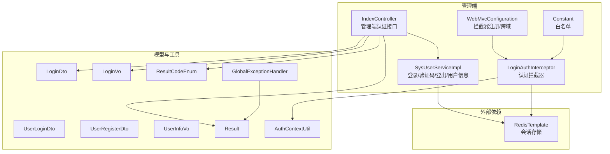
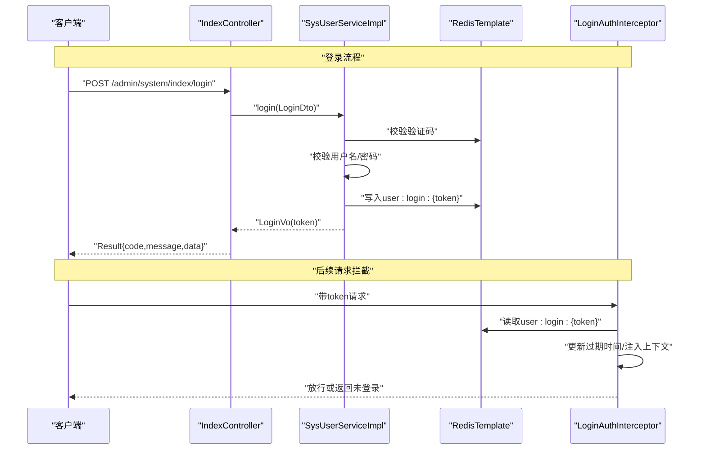
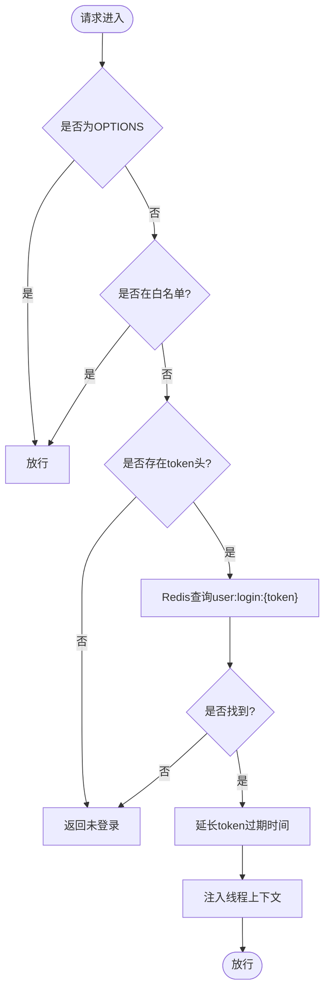
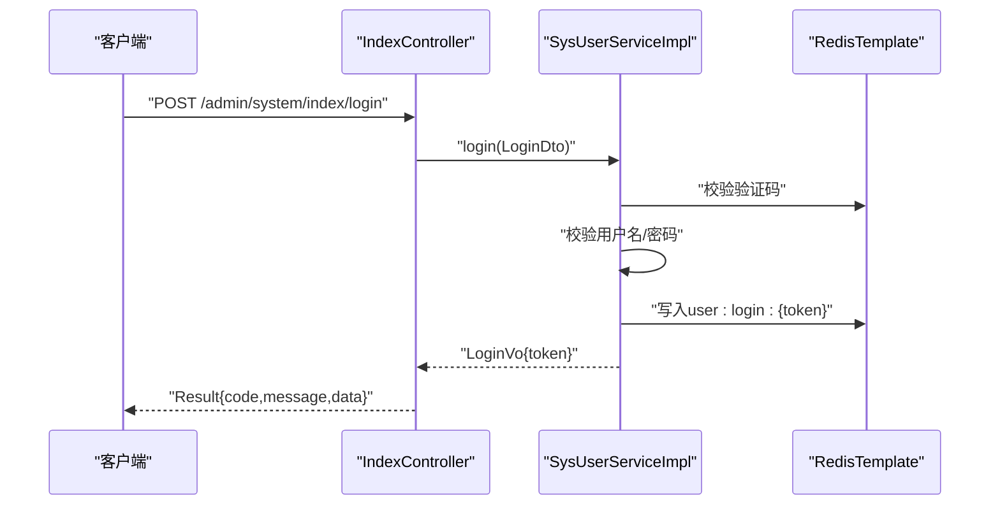
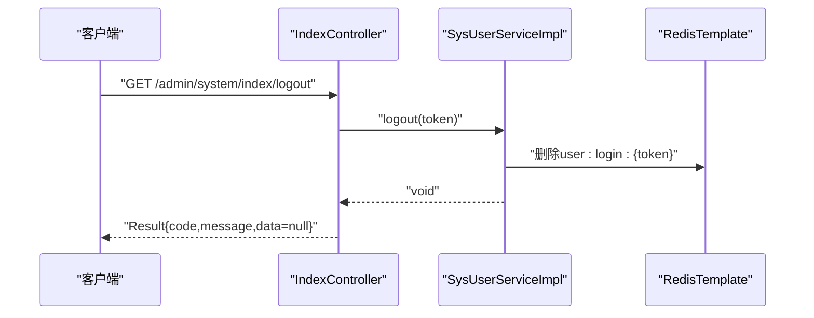
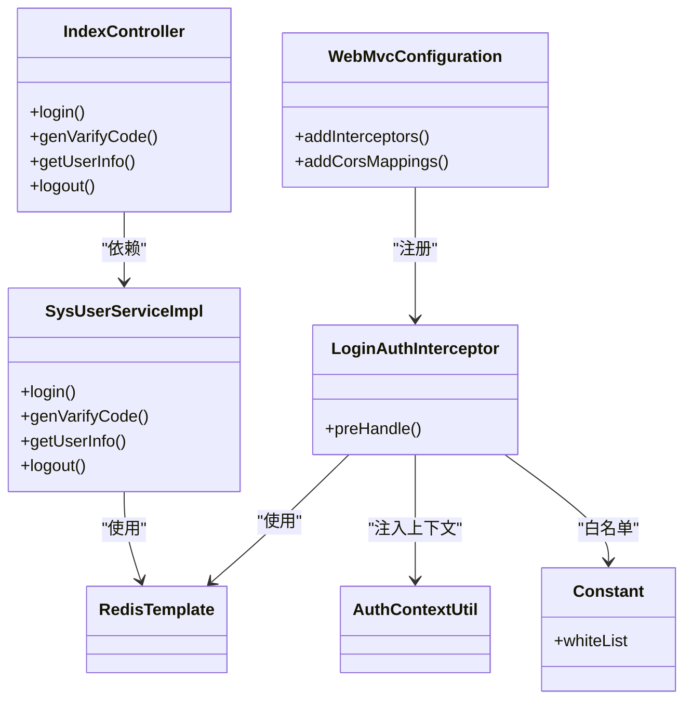

# 用户认证接口

<cite>
**本文引用的文件**
- [IndexController.java](file://spzx-manager/src/main/java/com/joker/spzx/manager/controller/IndexController.java)
- [SysUserServiceImpl.java](file://spzx-manager/src/main/java/com/joker/spzx/manager/service/impl/SysUserServiceImpl.java)
- [LoginAuthInterceptor.java](file://spzx-manager/src/main/java/com/joker/spzx/manager/config/LoginAuthInterceptor.java)
- [WebMvcConfiguration.java](file://spzx-manager/src/main/java/com/joker/spzx/manager/config/WebMvcConfiguration.java)
- [Constant.java](file://spzx-common/common-util/src/main/java/com/joker/spzx/utils/Constant.java)
- [LoginDto.java](file://spzx-model/src/main/java/com/joker/spzx/model/dto/system/LoginDto.java)
- [UserLoginDto.java](file://spzx-model/src/main/java/com/joker/spzx/model/dto/h5/UserLoginDto.java)
- [UserRegisterDto.java](file://spzx-model/src/main/java/com/joker/spzx/model/dto/h5/UserRegisterDto.java)
- [LoginVo.java](file://spzx-model/src/main/java/com/joker/spzx/model/vo/system/LoginVo.java)
- [UserInfoVo.java](file://spzx-model/src/main/java/com/joker/spzx/model/vo/h5/UserInfoVo.java)
- [Result.java](file://spzx-model/src/main/java/com/joker/spzx/model/vo/common/Result.java)
- [ResultCodeEnum.java](file://spzx-model/src/main/java/com/joker/spzx/model/vo/common/ResultCodeEnum.java)
- [GlobalExceptionHandler.java](file://spzx-common/common-service/src/main/java/com/joker/spzx/common/exception/GlobalExceptionHandler.java)
- [AuthContextUtil.java](file://spzx-common/common-util/src/main/java/com/joker/spzx/utils/AuthContextUtil.java)
</cite>

## 目录
1. [简介](#简介)
2. [项目结构](#项目结构)
3. [核心组件](#核心组件)
4. [架构总览](#架构总览)
5. [详细组件分析](#详细组件分析)
6. [依赖关系分析](#依赖关系分析)
7. [性能考虑](#性能考虑)
8. [故障排查指南](#故障排查指南)
9. [结论](#结论)
10. [附录](#附录)

## 简介
本文件为 SPZX 电商管理系统“用户认证接口”的权威技术文档，覆盖管理端与 H5 用户端的认证能力，包括：
- 登录、退出登录、获取用户信息等认证相关 API 的 HTTP 方法、URL 模式、请求参数与响应格式
- JWT Token 生成、刷新机制与安全控制策略说明
- 认证中间件配置、权限拦截与会话管理的技术实现
- 完整的登录注册示例、Token 验证流程与错误处理方案

注意：当前代码库采用基于 Redis 的会话令牌机制，而非标准 JWT。文档将明确标注并给出替代的安全实践建议。

## 项目结构
围绕认证功能的关键模块分布如下：
- 控制器层：管理端认证控制器
- 服务层：系统用户登录、验证码生成、用户信息查询与登出
- 配置层：拦截器与跨域配置
- 工具与常量：认证上下文工具、白名单常量
- 数据传输对象与视图对象：登录 DTO、H5 登录/注册 DTO、登录响应 VO、通用响应封装
- 异常处理：全局异常与业务异常

图表来源
- [IndexController.java:32-58](file://spzx-manager/src/main/java/com/joker/spzx/manager/controller/IndexController.java#L32-L58)
- [SysUserServiceImpl.java:55-111](file://spzx-manager/src/main/java/com/joker/spzx/manager/service/impl/SysUserServiceImpl.java#L55-L111)
- [LoginAuthInterceptor.java:30-58](file://spzx-manager/src/main/java/com/joker/spzx/manager/config/LoginAuthInterceptor.java#L30-L58)
- [WebMvcConfiguration.java:20-35](file://spzx-manager/src/main/java/com/joker/spzx/manager/config/WebMvcConfiguration.java#L20-L35)
- [Constant.java:9-25](file://spzx-common/common-util/src/main/java/com/joker/spzx/utils/Constant.java#L9-L25)
- [LoginDto.java:9-27](file://spzx-model/src/main/java/com/joker/spzx/model/dto/system/LoginDto.java#L9-L27)
- [UserLoginDto.java:8-15](file://spzx-model/src/main/java/com/joker/spzx/model/dto/h5/UserLoginDto.java#L8-L15)
- [UserRegisterDto.java:7-22](file://spzx-model/src/main/java/com/joker/spzx/model/dto/h5/UserRegisterDto.java#L7-L22)
- [LoginVo.java:7-16](file://spzx-model/src/main/java/com/joker/spzx/model/vo/system/LoginVo.java#L7-L16)
- [UserInfoVo.java:7-16](file://spzx-model/src/main/java/com/joker/spzx/model/vo/h5/UserInfoVo.java#L7-L16)
- [Result.java:8-44](file://spzx-model/src/main/java/com/joker/spzx/model/vo/common/Result.java#L8-L44)
- [ResultCodeEnum.java:6-31](file://spzx-model/src/main/java/com/joker/spzx/model/vo/common/ResultCodeEnum.java#L6-L31)
- [GlobalExceptionHandler.java:7-20](file://spzx-common/common-service/src/main/java/com/joker/spzx/common/exception/GlobalExceptionHandler.java#L7-L20)
- [AuthContextUtil.java:5-20](file://spzx-common/common-util/src/main/java/com/joker/spzx/utils/AuthContextUtil.java#L5-L20)

章节来源
- [IndexController.java:21-68](file://spzx-manager/src/main/java/com/joker/spzx/manager/controller/IndexController.java#L21-L68)
- [SysUserServiceImpl.java:45-174](file://spzx-manager/src/main/java/com/joker/spzx/manager/service/impl/SysUserServiceImpl.java#L45-L174)
- [WebMvcConfiguration.java:14-38](file://spzx-manager/src/main/java/com/joker/spzx/manager/config/WebMvcConfiguration.java#L14-L38)
- [LoginAuthInterceptor.java:22-80](file://spzx-manager/src/main/java/com/joker/spzx/manager/config/LoginAuthInterceptor.java#L22-L80)
- [Constant.java:7-27](file://spzx-common/common-util/src/main/java/com/joker/spzx/utils/Constant.java#L7-L27)

## 核心组件
- 管理端认证控制器：提供登录、验证码生成、获取用户信息、退出登录等接口
- 系统用户服务实现：完成验证码校验、用户身份校验、会话令牌发放与维护、用户信息查询、登出清理
- 认证拦截器：统一校验 token，维护线程上下文，处理未登录与跨域
- 结果封装与异常处理：统一响应结构与业务异常映射
- 数据模型：登录 DTO、H5 登录/注册 DTO、登录响应 VO、通用响应封装、状态码枚举

章节来源
- [IndexController.java:32-58](file://spzx-manager/src/main/java/com/joker/spzx/manager/controller/IndexController.java#L32-L58)
- [SysUserServiceImpl.java:55-111](file://spzx-manager/src/main/java/com/joker/spzx/manager/service/impl/SysUserServiceImpl.java#L55-L111)
- [LoginAuthInterceptor.java:30-58](file://spzx-manager/src/main/java/com/joker/spzx/manager/config/LoginAuthInterceptor.java#L30-L58)
- [Result.java:27-44](file://spzx-model/src/main/java/com/joker/spzx/model/vo/common/Result.java#L27-L44)
- [ResultCodeEnum.java:6-31](file://spzx-model/src/main/java/com/joker/spzx/model/vo/common/ResultCodeEnum.java#L6-L31)

## 架构总览
管理端认证采用“基于 Redis 的会话令牌”机制：
- 登录时生成随机 token，存入 Redis 并设置长期过期时间
- 请求携带 token，拦截器从 Redis 取回用户信息并注入线程上下文
- 白名单放行，支持跨域与预检请求
- 统一异常处理与响应封装

图表来源
- [IndexController.java:32-37](file://spzx-manager/src/main/java/com/joker/spzx/manager/controller/IndexController.java#L32-L37)
- [SysUserServiceImpl.java:55-84](file://spzx-manager/src/main/java/com/joker/spzx/manager/service/impl/SysUserServiceImpl.java#L55-L84)
- [LoginAuthInterceptor.java:30-58](file://spzx-manager/src/main/java/com/joker/spzx/manager/config/LoginAuthInterceptor.java#L30-L58)

## 详细组件分析

### 管理端认证接口规范
- 登录
  - 方法：POST
  - 路径：/admin/system/index/login
  - 请求体：LoginDto
  - 响应体：Result<LoginVo>
  - 成功响应包含 token；refresh_token 字段可为空
- 获取验证码
  - 方法：GET
  - 路径：/admin/system/index/genVarifyCode
  - 响应体：Result<ValidateCodeVo>，包含验证码 key 与 base64 图片
- 获取用户信息
  - 方法：GET
  - 路径：/admin/system/index/getUserInfo
  - 请求头：token
  - 响应体：Result<SysUser>
- 退出登录
  - 方法：GET
  - 路径：/admin/system/index/logout
  - 请求头：token
  - 响应体：Result<Void>

章节来源
- [IndexController.java:32-58](file://spzx-manager/src/main/java/com/joker/spzx/manager/controller/IndexController.java#L32-L58)
- [LoginDto.java:9-27](file://spzx-model/src/main/java/com/joker/spzx/model/dto/system/LoginDto.java#L9-L27)
- [LoginVo.java:7-16](file://spzx-model/src/main/java/com/joker/spzx/model/vo/system/LoginVo.java#L7-L16)
- [Result.java:27-44](file://spzx-model/src/main/java/com/joker/spzx/model/vo/common/Result.java#L27-L44)

### H5 用户端认证接口规范
- 登录
  - 方法：POST
  - 路径：/h5/user/login
  - 请求体：UserLoginDto（用户名、密码）
  - 响应体：Result<UserInfoVo>
- 注册
  - 方法：POST
  - 路径：/h5/user/register
  - 请求体：UserRegisterDto（用户名、密码、昵称、手机验证码）
  - 响应体：Result<Void>
- 获取用户信息
  - 方法：GET
  - 路径：/h5/user/getUserInfo
  - 请求头：token
  - 响应体：Result<UserInfoVo>

说明：H5 端接口定义位于模型层 DTO/VO，具体控制器需按上述路径与参数约定进行实现。

章节来源
- [UserLoginDto.java:8-15](file://spzx-model/src/main/java/com/joker/spzx/model/dto/h5/UserLoginDto.java#L8-L15)
- [UserRegisterDto.java:7-22](file://spzx-model/src/main/java/com/joker/spzx/model/dto/h5/UserRegisterDto.java#L7-L22)
- [UserInfoVo.java:7-16](file://spzx-model/src/main/java/com/joker/spzx/model/vo/h5/UserInfoVo.java#L7-L16)

### 会话与安全控制
- 令牌生成：登录成功后生成随机 token，并写入 Redis，键名格式为 user:login:{token}，设置长期过期时间
- 令牌校验：拦截器从请求头读取 token，查询 Redis 中的用户信息，若存在则延长过期时间并注入线程上下文
- 白名单：无需登录即可访问的资源列表，如登录、验证码生成、静态资源、Swagger 文档等
- 跨域：允许指定来源、方法与头部，支持凭据传递
- 未登录响应：统一返回 208 状态码与提示信息

图表来源
- [LoginAuthInterceptor.java:30-58](file://spzx-manager/src/main/java/com/joker/spzx/manager/config/LoginAuthInterceptor.java#L30-L58)
- [Constant.java:9-25](file://spzx-common/common-util/src/main/java/com/joker/spzx/utils/Constant.java#L9-L25)

章节来源
- [LoginAuthInterceptor.java:30-58](file://spzx-manager/src/main/java/com/joker/spzx/manager/config/LoginAuthInterceptor.java#L30-L58)
- [WebMvcConfiguration.java:20-35](file://spzx-manager/src/main/java/com/joker/spzx/manager/config/WebMvcConfiguration.java#L20-L35)
- [Constant.java:9-25](file://spzx-common/common-util/src/main/java/com/joker/spzx/utils/Constant.java#L9-L25)

### 登录流程（管理端）

图表来源
- [IndexController.java:32-37](file://spzx-manager/src/main/java/com/joker/spzx/manager/controller/IndexController.java#L32-L37)
- [SysUserServiceImpl.java:55-84](file://spzx-manager/src/main/java/com/joker/spzx/manager/service/impl/SysUserServiceImpl.java#L55-L84)

章节来源
- [IndexController.java:32-37](file://spzx-manager/src/main/java/com/joker/spzx/manager/controller/IndexController.java#L32-L37)
- [SysUserServiceImpl.java:55-84](file://spzx-manager/src/main/java/com/joker/spzx/manager/service/impl/SysUserServiceImpl.java#L55-L84)

### 退出登录流程

图表来源
- [IndexController.java:53-58](file://spzx-manager/src/main/java/com/joker/spzx/manager/controller/IndexController.java#L53-L58)
- [SysUserServiceImpl.java:109-111](file://spzx-manager/src/main/java/com/joker/spzx/manager/service/impl/SysUserServiceImpl.java#L109-L111)

章节来源
- [IndexController.java:53-58](file://spzx-manager/src/main/java/com/joker/spzx/manager/controller/IndexController.java#L53-L58)
- [SysUserServiceImpl.java:109-111](file://spzx-manager/src/main/java/com/joker/spzx/manager/service/impl/SysUserServiceImpl.java#L109-L111)

### 错误处理与响应格式
- 统一响应结构：Result，包含 code、message、data
- 业务异常：ServiceException，由全局异常处理器转换为 Result
- 常见错误码：
  - 登录失败：用户名或密码错误
  - 验证码错误：验证码不正确
  - 未登录：用户未登录（208）
  - 系统错误：SYSTEM_ERROR（9999）

章节来源
- [Result.java:27-44](file://spzx-model/src/main/java/com/joker/spzx/model/vo/common/Result.java#L27-L44)
- [ResultCodeEnum.java:6-31](file://spzx-model/src/main/java/com/joker/spzx/model/vo/common/ResultCodeEnum.java#L6-L31)
- [GlobalExceptionHandler.java:7-20](file://spzx-common/common-service/src/main/java/com/joker/spzx/common/exception/GlobalExceptionHandler.java#L7-L20)

## 依赖关系分析
- 控制器依赖服务实现
- 服务实现依赖 RedisTemplate 进行会话存储
- 拦截器依赖 RedisTemplate 与线程上下文工具
- WebMvcConfiguration 注册拦截器并配置跨域
- 异常处理器统一处理业务异常与系统异常

图表来源
- [IndexController.java:22-68](file://spzx-manager/src/main/java/com/joker/spzx/manager/controller/IndexController.java#L22-L68)
- [SysUserServiceImpl.java:46-174](file://spzx-manager/src/main/java/com/joker/spzx/manager/service/impl/SysUserServiceImpl.java#L46-L174)
- [LoginAuthInterceptor.java:23-80](file://spzx-manager/src/main/java/com/joker/spzx/manager/config/LoginAuthInterceptor.java#L23-L80)
- [WebMvcConfiguration.java:14-38](file://spzx-manager/src/main/java/com/joker/spzx/manager/config/WebMvcConfiguration.java#L14-L38)
- [Constant.java:7-27](file://spzx-common/common-util/src/main/java/com/joker/spzx/utils/Constant.java#L7-L27)
- [AuthContextUtil.java:5-20](file://spzx-common/common-util/src/main/java/com/joker/spzx/utils/AuthContextUtil.java#L5-L20)

章节来源
- [IndexController.java:22-68](file://spzx-manager/src/main/java/com/joker/spzx/manager/controller/IndexController.java#L22-L68)
- [SysUserServiceImpl.java:46-174](file://spzx-manager/src/main/java/com/joker/spzx/manager/service/impl/SysUserServiceImpl.java#L46-L174)
- [LoginAuthInterceptor.java:23-80](file://spzx-manager/src/main/java/com/joker/spzx/manager/config/LoginAuthInterceptor.java#L23-L80)
- [WebMvcConfiguration.java:14-38](file://spzx-manager/src/main/java/com/joker/spzx/manager/config/WebMvcConfiguration.java#L14-L38)
- [Constant.java:7-27](file://spzx-common/common-util/src/main/java/com/joker/spzx/utils/Constant.java#L7-L27)
- [AuthContextUtil.java:5-20](file://spzx-common/common-util/src/main/java/com/joker/spzx/utils/AuthContextUtil.java#L5-L20)

## 性能考虑
- Redis 会话存储：建议开启持久化与合理内存上限，避免热 key
- 过期时间：登录态长期有效，但可通过拦截器续期，注意并发场景下的过期更新
- 跨域配置：生产环境限制 allowedOrigins，避免通配符带来的安全风险
- 验证码缓存：验证码短期有效，及时清理，防止缓存堆积

## 故障排查指南
- 未登录（208）：检查请求头 token 是否缺失或已过期
- 验证码错误：确认验证码 key 与输入一致，且未超时
- 用户名或密码错误：确认用户名存在且密码 MD5 匹配
- 全局异常：系统异常统一返回 201 或 9999，查看日志定位

章节来源
- [LoginAuthInterceptor.java:40-58](file://spzx-manager/src/main/java/com/joker/spzx/manager/config/LoginAuthInterceptor.java#L40-L58)
- [SysUserServiceImpl.java:61-78](file://spzx-manager/src/main/java/com/joker/spzx/manager/service/impl/SysUserServiceImpl.java#L61-L78)
- [ResultCodeEnum.java:8-17](file://spzx-model/src/main/java/com/joker/spzx/model/vo/common/ResultCodeEnum.java#L8-L17)
- [GlobalExceptionHandler.java:9-19](file://spzx-common/common-service/src/main/java/com/joker/spzx/common/exception/GlobalExceptionHandler.java#L9-L19)

## 结论
本认证体系以 Redis 会话令牌为核心，结合拦截器与线程上下文实现统一鉴权，具备良好的扩展性与安全性。对于需要更细粒度权限控制与跨系统共享的场景，建议引入标准 JWT 并配合刷新令牌与签名算法，同时完善密钥轮换与审计日志。

## 附录

### API 列表与字段说明
- 管理端登录
  - 请求体字段：userName、password、captcha、codeKey
  - 响应字段：token（必填）、refresh_token（可空）
- H5 登录
  - 请求体字段：username、password
  - 响应字段：UserInfoVo（昵称、头像）
- H5 注册
  - 请求体字段：username、password、nickName、code
- 通用响应
  - 字段：code、message、data

章节来源
- [LoginDto.java:9-27](file://spzx-model/src/main/java/com/joker/spzx/model/dto/system/LoginDto.java#L9-L27)
- [UserLoginDto.java:8-15](file://spzx-model/src/main/java/com/joker/spzx/model/dto/h5/UserLoginDto.java#L8-L15)
- [UserRegisterDto.java:7-22](file://spzx-model/src/main/java/com/joker/spzx/model/dto/h5/UserRegisterDto.java#L7-L22)
- [LoginVo.java:7-16](file://spzx-model/src/main/java/com/joker/spzx/model/vo/system/LoginVo.java#L7-L16)
- [UserInfoVo.java:7-16](file://spzx-model/src/main/java/com/joker/spzx/model/vo/h5/UserInfoVo.java#L7-L16)
- [Result.java:11-20](file://spzx-model/src/main/java/com/joker/spzx/model/vo/common/Result.java#L11-L20)