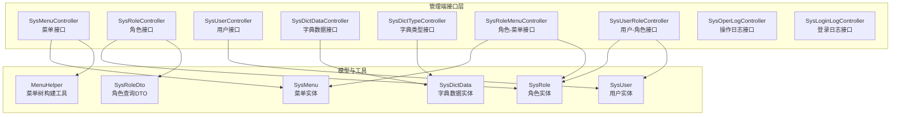
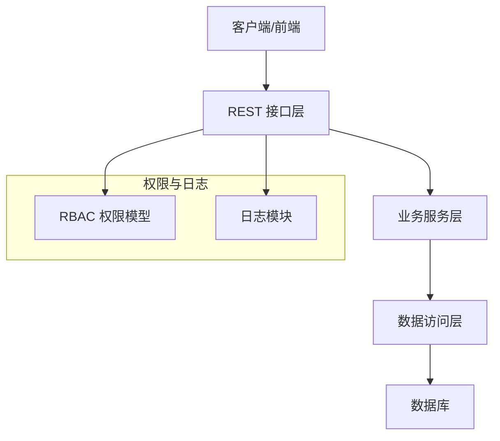
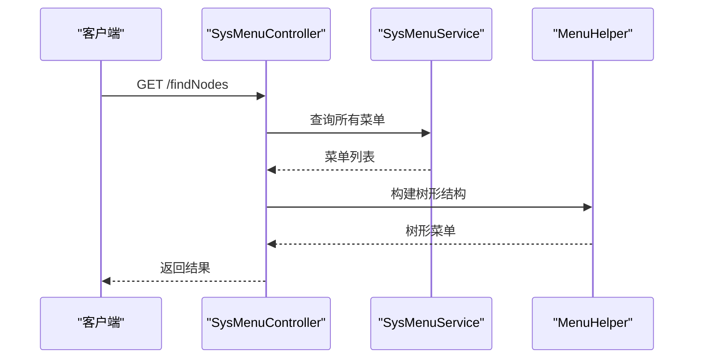
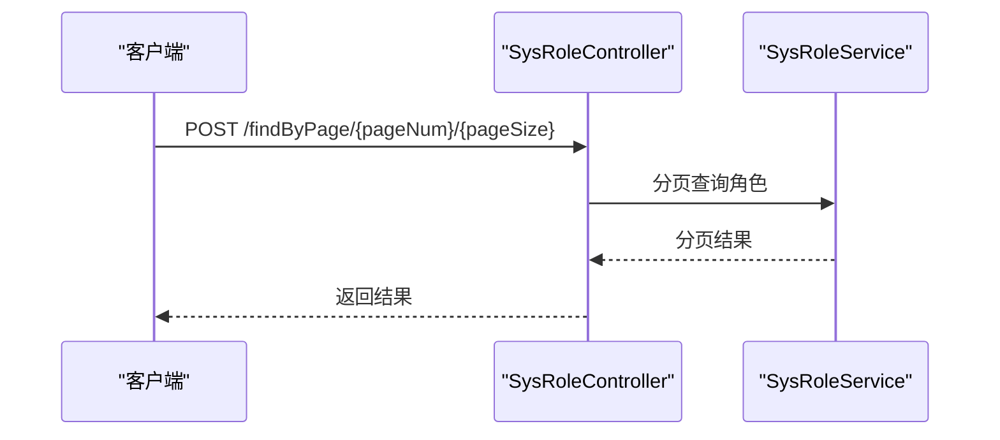
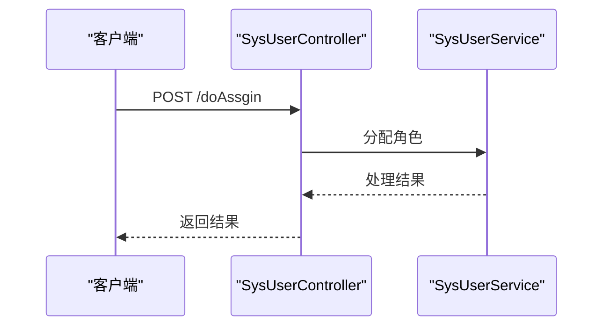
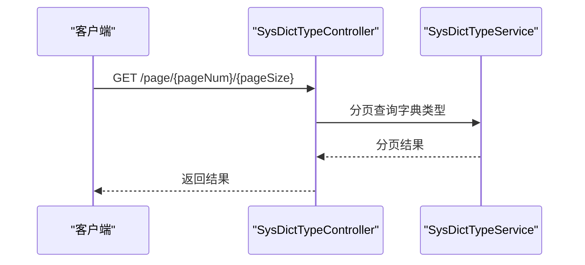
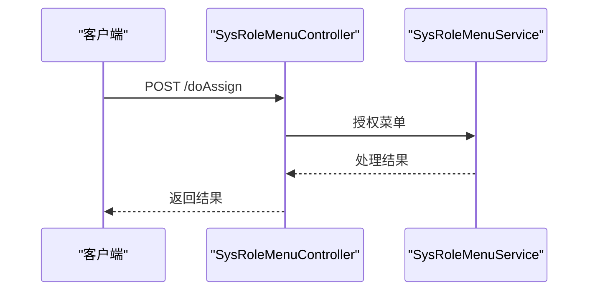
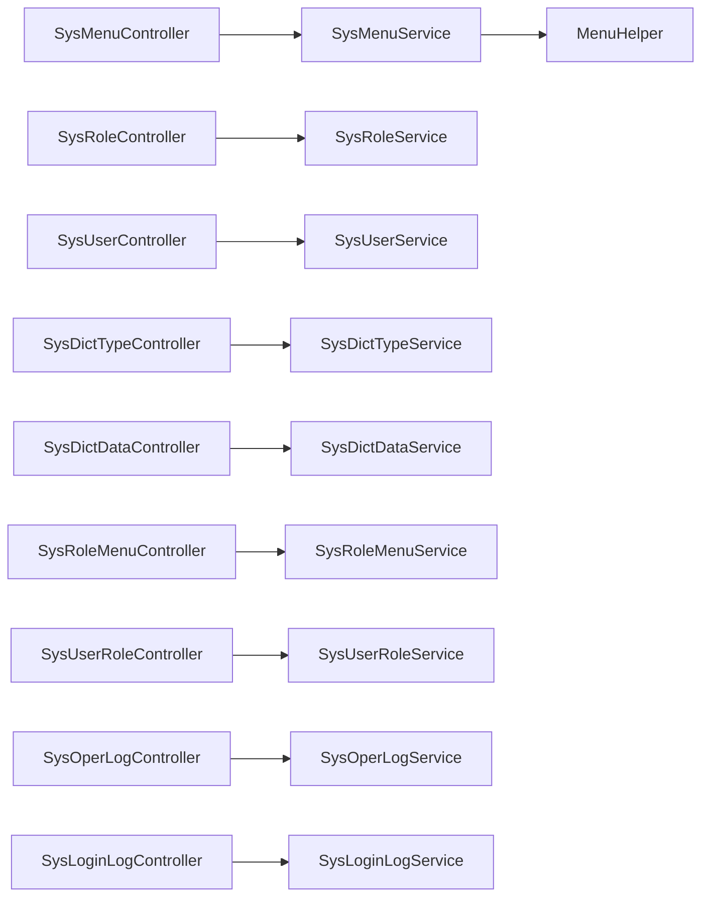
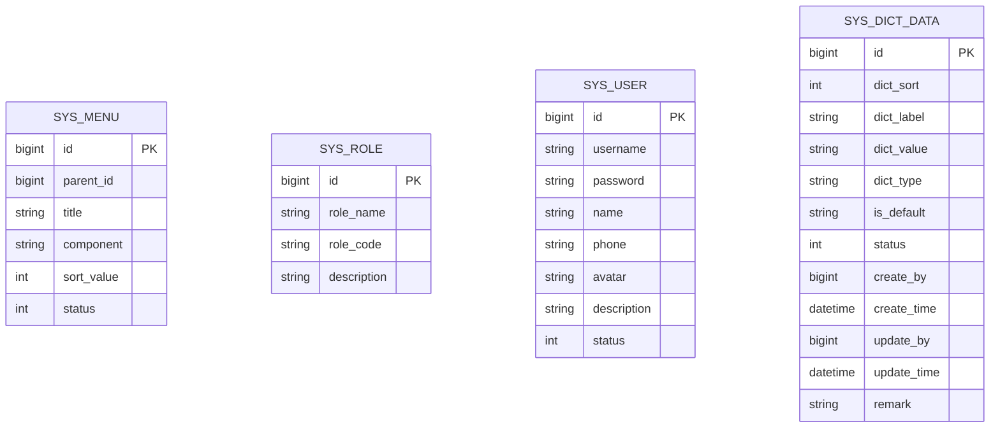

# 系统管理接口

<cite>
**本文引用的文件**
- [SysMenuController.java](file://spzx-manager/src/main/java/com/joker/spzx/manager/controller/SysMenuController.java)
- [SysRoleController.java](file://spzx-manager/src/main/java/com/joker/spzx/manager/controller/SysRoleController.java)
- [SysUserController.java](file://spzx-manager/src/main/java/com/joker/spzx/manager/controller/SysUserController.java)
- [SysDictDataController.java](file://spzx-manager/src/main/java/com/joker/spzx/manager/controller/SysDictDataController.java)
- [SysDictTypeController.java](file://spzx-manager/src/main/java/com/joker/spzx/manager/controller/SysDictTypeController.java)
- [SysRoleMenuController.java](file://spzx-manager/src/main/java/com/joker/spzx/manager/controller/SysRoleMenuController.java)
- [SysUserRoleController.java](file://spzx-manager/src/main/java/com/joker/spzx/manager/controller/SysUserRoleController.java)
- [SysOperLogController.java](file://spzx-manager/src/main/java/com/joker/spzx/manager/controller/SysOperLogController.java)
- [SysLoginLogController.java](file://spzx-manager/src/main/java/com/joker/spzx/manager/controller/SysLoginLogController.java)
- [MenuHelper.java](file://spzx-manager/src/main/java/com/joker/spzx/manager/helper/MenuHelper.java)
- [SysMenu.java](file://spzx-model/src/main/java/com/joker/spzx/model/entity/system/SysMenu.java)
- [SysRole.java](file://spzx-model/src/main/java/com/joker/spzx/model/entity/system/SysRole.java)
- [SysUser.java](file://spzx-model/src/main/java/com/joker/spzx/model/entity/system/SysUser.java)
- [SysDictData.java](file://spzx-model/src/main/java/com/joker/spzx/model/entity/system/SysDictData.java)
- [SysRoleDto.java](file://spzx-model/src/main/java/com/joker/spzx/model/dto/system/SysRoleDto.java)
</cite>

## 目录
1. [简介](#简介)
2. [项目结构](#项目结构)
3. [核心组件](#核心组件)
4. [架构总览](#架构总览)
5. [详细组件分析](#详细组件分析)
6. [依赖分析](#依赖分析)
7. [性能考虑](#性能考虑)
8. [故障排查指南](#故障排查指南)
9. [结论](#结论)
10. [附录](#附录)

## 简介
本文件为 SPZX 电商管理系统“系统管理”模块的接口文档，覆盖菜单管理、角色管理、用户管理、字典管理、操作日志与登录日志等系统配置能力。文档从接口设计、数据模型、权限控制、菜单树构建、RBAC 权限模型、动态菜单加载与操作权限控制等方面进行说明，并提供架构图与流程图帮助理解。

## 项目结构
系统管理相关接口集中在 manager 模块的 controller 包中，配合 model 层的实体与 DTO 定义，通过服务层完成业务处理。菜单树形结构由工具类辅助生成，便于前端按需渲染。

图表来源
- [SysMenuController.java:1-58](file://spzx-manager/src/main/java/com/joker/spzx/manager/controller/SysMenuController.java#L1-L58)
- [SysRoleController.java:1-70](file://spzx-manager/src/main/java/com/joker/spzx/manager/controller/SysRoleController.java#L1-L70)
- [SysUserController.java:1-70](file://spzx-manager/src/main/java/com/joker/spzx/manager/controller/SysUserController.java#L1-L70)
- [SysDictDataController.java:1-47](file://spzx-manager/src/main/java/com/joker/spzx/manager/controller/SysDictDataController.java#L1-L47)
- [SysDictTypeController.java:1-45](file://spzx-manager/src/main/java/com/joker/spzx/manager/controller/SysDictTypeController.java#L1-L45)
- [SysRoleMenuController.java:1-45](file://spzx-manager/src/main/java/com/joker/spzx/manager/controller/SysRoleMenuController.java#L1-L45)
- [SysUserRoleController.java:1-19](file://spzx-manager/src/main/java/com/joker/spzx/manager/controller/SysUserRoleController.java#L1-L19)
- [SysOperLogController.java:1-19](file://spzx-manager/src/main/java/com/joker/spzx/manager/controller/SysOperLogController.java#L1-L19)
- [SysLoginLogController.java:1-19](file://spzx-manager/src/main/java/com/joker/spzx/manager/controller/SysLoginLogController.java#L1-L19)
- [MenuHelper.java:1-45](file://spzx-manager/src/main/java/com/joker/spzx/manager/helper/MenuHelper.java#L1-L45)
- [SysMenu.java:1-41](file://spzx-model/src/main/java/com/joker/spzx/model/entity/system/SysMenu.java#L1-L41)
- [SysRole.java:1-28](file://spzx-model/src/main/java/com/joker/spzx/model/entity/system/SysRole.java#L1-L28)
- [SysUser.java:1-42](file://spzx-model/src/main/java/com/joker/spzx/model/entity/system/SysUser.java#L1-L42)
- [SysDictData.java:1-84](file://spzx-model/src/main/java/com/joker/spzx/model/entity/system/SysDictData.java#L1-L84)
- [SysRoleDto.java:1-14](file://spzx-model/src/main/java/com/joker/spzx/model/dto/system/SysRoleDto.java#L1-L14)

章节来源
- [SysMenuController.java:1-58](file://spzx-manager/src/main/java/com/joker/spzx/manager/controller/SysMenuController.java#L1-L58)
- [SysRoleController.java:1-70](file://spzx-manager/src/main/java/com/joker/spzx/manager/controller/SysRoleController.java#L1-L70)
- [SysUserController.java:1-70](file://spzx-manager/src/main/java/com/joker/spzx/manager/controller/SysUserController.java#L1-L70)
- [SysDictDataController.java:1-47](file://spzx-manager/src/main/java/com/joker/spzx/manager/controller/SysDictDataController.java#L1-L47)
- [SysDictTypeController.java:1-45](file://spzx-manager/src/main/java/com/joker/spzx/manager/controller/SysDictTypeController.java#L1-L45)
- [SysRoleMenuController.java:1-45](file://spzx-manager/src/main/java/com/joker/spzx/manager/controller/SysRoleMenuController.java#L1-L45)
- [SysUserRoleController.java:1-19](file://spzx-manager/src/main/java/com/joker/spzx/manager/controller/SysUserRoleController.java#L1-L19)
- [SysOperLogController.java:1-19](file://spzx-manager/src/main/java/com/joker/spzx/manager/controller/SysOperLogController.java#L1-L19)
- [SysLoginLogController.java:1-19](file://spzx-manager/src/main/java/com/joker/spzx/manager/controller/SysLoginLogController.java#L1-L19)
- [MenuHelper.java:1-45](file://spzx-manager/src/main/java/com/joker/spzx/manager/helper/MenuHelper.java#L1-L45)
- [SysMenu.java:1-41](file://spzx-model/src/main/java/com/joker/spzx/model/entity/system/SysMenu.java#L1-L41)
- [SysRole.java:1-28](file://spzx-model/src/main/java/com/joker/spzx/model/entity/system/SysRole.java#L1-L28)
- [SysUser.java:1-42](file://spzx-model/src/main/java/com/joker/spzx/model/entity/system/SysUser.java#L1-L42)
- [SysDictData.java:1-84](file://spzx-model/src/main/java/com/joker/spzx/model/entity/system/SysDictData.java#L1-L84)
- [SysRoleDto.java:1-14](file://spzx-model/src/main/java/com/joker/spzx/model/dto/system/SysRoleDto.java#L1-L14)

## 核心组件
- 接口层：提供 RESTful 接口，统一返回包装结果对象。
- 实体层：定义系统菜单、角色、用户、字典等核心数据模型。
- 工具层：提供菜单树形结构构建算法，支持递归组装父子关系。
- DTO 层：封装查询参数与分配参数，保证接口入参规范。

章节来源
- [SysMenuController.java:1-58](file://spzx-manager/src/main/java/com/joker/spzx/manager/controller/SysMenuController.java#L1-L58)
- [SysRoleController.java:1-70](file://spzx-manager/src/main/java/com/joker/spzx/manager/controller/SysRoleController.java#L1-L70)
- [SysUserController.java:1-70](file://spzx-manager/src/main/java/com/joker/spzx/manager/controller/SysUserController.java#L1-L70)
- [SysDictDataController.java:1-47](file://spzx-manager/src/main/java/com/joker/spzx/manager/controller/SysDictDataController.java#L1-L47)
- [SysDictTypeController.java:1-45](file://spzx-manager/src/main/java/com/joker/spzx/manager/controller/SysDictTypeController.java#L1-L45)
- [SysRoleMenuController.java:1-45](file://spzx-manager/src/main/java/com/joker/spzx/manager/controller/SysRoleMenuController.java#L1-L45)
- [MenuHelper.java:1-45](file://spzx-manager/src/main/java/com/joker/spzx/manager/helper/MenuHelper.java#L1-L45)
- [SysMenu.java:1-41](file://spzx-model/src/main/java/com/joker/spzx/model/entity/system/SysMenu.java#L1-L41)
- [SysRole.java:1-28](file://spzx-model/src/main/java/com/joker/spzx/model/entity/system/SysRole.java#L1-L28)
- [SysUser.java:1-42](file://spzx-model/src/main/java/com/joker/spzx/model/entity/system/SysUser.java#L1-L42)
- [SysDictData.java:1-84](file://spzx-model/src/main/java/com/joker/spzx/model/entity/system/SysDictData.java#L1-L84)
- [SysRoleDto.java:1-14](file://spzx-model/src/main/java/com/joker/spzx/model/dto/system/SysRoleDto.java#L1-L14)

## 架构总览
系统管理采用典型的 MVC 分层与 RBAC 权限模型：
- 控制器负责接收请求、参数校验与返回结果。
- 服务层实现业务规则与权限判断。
- 数据访问层基于 MyBatis-Plus 访问数据库。
- 菜单树构建通过工具类递归生成，支持前端按需渲染。
- 日志模块通过注解与异步服务记录操作与登录行为。

图表来源
- [SysMenuController.java:1-58](file://spzx-manager/src/main/java/com/joker/spzx/manager/controller/SysMenuController.java#L1-L58)
- [SysRoleController.java:1-70](file://spzx-manager/src/main/java/com/joker/spzx/manager/controller/SysRoleController.java#L1-L70)
- [SysUserController.java:1-70](file://spzx-manager/src/main/java/com/joker/spzx/manager/controller/SysUserController.java#L1-L70)
- [SysDictDataController.java:1-47](file://spzx-manager/src/main/java/com/joker/spzx/manager/controller/SysDictDataController.java#L1-L47)
- [SysDictTypeController.java:1-45](file://spzx-manager/src/main/java/com/joker/spzx/manager/controller/SysDictTypeController.java#L1-L45)
- [SysRoleMenuController.java:1-45](file://spzx-manager/src/main/java/com/joker/spzx/manager/controller/SysRoleMenuController.java#L1-L45)
- [SysOperLogController.java:1-19](file://spzx-manager/src/main/java/com/joker/spzx/manager/controller/SysOperLogController.java#L1-L19)
- [SysLoginLogController.java:1-19](file://spzx-manager/src/main/java/com/joker/spzx/manager/controller/SysLoginLogController.java#L1-L19)

## 详细组件分析

### 菜单管理接口
- 功能概述：提供菜单树形列表、新增、编辑、删除等能力。
- 接口清单：
  - GET /admin/system/sysMenu/findNodes：获取树形菜单列表
  - POST /admin/system/sysMenu/save：新增菜单
  - PUT /admin/system/sysMenu/update：编辑菜单
  - DELETE /admin/system/sysMenu/removeById/{id}：删除菜单
- 请求参数与响应：
  - 新增/编辑：请求体为菜单实体；响应为通用结果包装。
  - 删除：路径参数为菜单 ID。
- 菜单树构建：
  - 使用工具类递归生成树形结构，支持多级父子关系。
- 权限控制：
  - 建议在服务层对菜单操作进行权限校验与审计。

图表来源
- [SysMenuController.java:28-33](file://spzx-manager/src/main/java/com/joker/spzx/manager/controller/SysMenuController.java#L28-L33)
- [MenuHelper.java:16-43](file://spzx-manager/src/main/java/com/joker/spzx/manager/helper/MenuHelper.java#L16-L43)

章节来源
- [SysMenuController.java:28-56](file://spzx-manager/src/main/java/com/joker/spzx/manager/controller/SysMenuController.java#L28-L56)
- [MenuHelper.java:16-43](file://spzx-manager/src/main/java/com/joker/spzx/manager/helper/MenuHelper.java#L16-L43)
- [SysMenu.java:14-41](file://spzx-model/src/main/java/com/joker/spzx/model/entity/system/SysMenu.java#L14-L41)

### 角色管理接口
- 功能概述：提供角色分页查询、角色列表、新增、修改、删除等能力。
- 接口清单：
  - POST /admin/system/sysRole/findByPage/{pageNum}/{pageSize}：分页查询角色
  - GET /admin/system/sysRole/roleList/{userId}：获取用户的角色集合
  - POST /admin/system/sysRole/saveSysRole：新增角色
  - POST /admin/system/sysRole/updateSysRole：修改角色
  - DELETE /admin/system/sysRole/deleteById/{id}：删除角色
- 请求参数与响应：
  - 分页查询：请求体为角色查询 DTO；路径参数为页码与页大小。
  - 获取角色列表：路径参数为用户 ID。
  - 新增/修改/删除：请求体为角色实体或路径参数为角色 ID。

图表来源
- [SysRoleController.java:32-38](file://spzx-manager/src/main/java/com/joker/spzx/manager/controller/SysRoleController.java#L32-L38)
- [SysRoleDto.java:8-14](file://spzx-model/src/main/java/com/joker/spzx/model/dto/system/SysRoleDto.java#L8-L14)

章节来源
- [SysRoleController.java:31-67](file://spzx-manager/src/main/java/com/joker/spzx/manager/controller/SysRoleController.java#L31-L67)
- [SysRoleDto.java:8-14](file://spzx-model/src/main/java/com/joker/spzx/model/dto/system/SysRoleDto.java#L8-L14)
- [SysRole.java:12-28](file://spzx-model/src/main/java/com/joker/spzx/model/entity/system/SysRole.java#L12-L28)

### 用户管理接口
- 功能概述：提供用户分页查询、新增、修改、删除与角色分配能力。
- 接口清单：
  - POST /admin/system/sysUser/findByPage/{pageNum}/{pageSize}：分页查询用户
  - POST /admin/system/sysUser/saveSysUser：新增用户
  - POST /admin/system/sysUser/updateSysUser：修改用户
  - DELETE /admin/system/sysUser/deleteById/{id}：删除用户
  - POST /admin/system/sysUser/doAssgin：分配角色给用户
- 请求参数与响应：
  - 分页查询：请求体为用户查询 DTO；路径参数为页码与页大小。
  - 分配角色：请求体为角色分配 DTO。

图表来源
- [SysUserController.java:63-68](file://spzx-manager/src/main/java/com/joker/spzx/manager/controller/SysUserController.java#L63-L68)

章节来源
- [SysUserController.java:33-68](file://spzx-manager/src/main/java/com/joker/spzx/manager/controller/SysUserController.java#L33-L68)
- [SysUser.java:12-42](file://spzx-model/src/main/java/com/joker/spzx/model/entity/system/SysUser.java#L12-L42)

### 字典管理接口
- 字典类型接口：
  - GET /admin/system/dictType/page/{pageNum}/{pageSize}：分页查询字典类型
  - POST /admin/system/dictType/insert：新增字典类型
  - PUT /admin/system/dictType/update：修改字典类型
- 字典数据接口：
  - GET /admin/dictData/getList/{dictType}：按类型获取字典数据列表
  - POST /admin/dictData/insert：新增字典数据
  - POST /admin/dictData/update：修改字典数据
- 请求参数与响应：
  - 分页查询：路径参数为页码与页大小，查询条件为 DTO。
  - 获取列表：路径参数为字典类型键。
  - 新增/修改：请求体为对应实体。

图表来源
- [SysDictTypeController.java:26-30](file://spzx-manager/src/main/java/com/joker/spzx/manager/controller/SysDictTypeController.java#L26-L30)

章节来源
- [SysDictTypeController.java:26-43](file://spzx-manager/src/main/java/com/joker/spzx/manager/controller/SysDictTypeController.java#L26-L43)
- [SysDictDataController.java:28-44](file://spzx-manager/src/main/java/com/joker/spzx/manager/controller/SysDictDataController.java#L28-L44)
- [SysDictData.java:27-84](file://spzx-model/src/main/java/com/joker/spzx/model/entity/system/SysDictData.java#L27-L84)

### 角色-菜单与用户-角色接口
- 角色-菜单：
  - GET /admin/system/sysRoleMenu/findSysRoleMenuByRoleId/{roleId}：查询角色已授权菜单树
  - POST /admin/system/sysRoleMenu/doAssign：为角色授权菜单
- 用户-角色：
  - GET /manager/sys-user-role：用户-角色关联接口（预留）
- 请求参数与响应：
  - 查询角色菜单：路径参数为角色 ID。
  - 授权菜单：请求体为菜单分配 DTO。

图表来源
- [SysRoleMenuController.java:38-42](file://spzx-manager/src/main/java/com/joker/spzx/manager/controller/SysRoleMenuController.java#L38-L42)

章节来源
- [SysRoleMenuController.java:30-42](file://spzx-manager/src/main/java/com/joker/spzx/manager/controller/SysRoleMenuController.java#L30-L42)
- [SysUserRoleController.java:14-18](file://spzx-manager/src/main/java/com/joker/spzx/manager/controller/SysUserRoleController.java#L14-L18)

### 操作日志与登录日志接口
- 操作日志：
  - GET /manager/sys-oper-log：操作日志接口（预留）
- 登录日志：
  - GET /manager/sys-login-log：登录日志接口（预留）

章节来源
- [SysOperLogController.java:14-18](file://spzx-manager/src/main/java/com/joker/spzx/manager/controller/SysOperLogController.java#L14-L18)
- [SysLoginLogController.java:14-18](file://spzx-manager/src/main/java/com/joker/spzx/manager/controller/SysLoginLogController.java#L14-L18)

## 依赖分析
- 控制器与服务层解耦：控制器仅负责参数接收与结果封装，业务逻辑在服务层实现。
- 实体与 DTO 的职责分离：实体用于持久化映射，DTO 用于接口参数传输。
- 菜单树构建工具独立：避免在服务层重复实现递归逻辑。
- 日志模块与接口层解耦：日志记录通过注解与异步服务实现，不影响接口主流程。

图表来源
- [SysMenuController.java:25-26](file://spzx-manager/src/main/java/com/joker/spzx/manager/controller/SysMenuController.java#L25-L26)
- [SysRoleController.java:28-29](file://spzx-manager/src/main/java/com/joker/spzx/manager/controller/SysRoleController.java#L28-L29)
- [SysUserController.java:27-31](file://spzx-manager/src/main/java/com/joker/spzx/manager/controller/SysUserController.java#L27-L31)
- [SysDictTypeController.java:23-24](file://spzx-manager/src/main/java/com/joker/spzx/manager/controller/SysDictTypeController.java#L23-L24)
- [SysDictDataController.java:22-26](file://spzx-manager/src/main/java/com/joker/spzx/manager/controller/SysDictDataController.java#L22-L26)
- [SysRoleMenuController.java:27-28](file://spzx-manager/src/main/java/com/joker/spzx/manager/controller/SysRoleMenuController.java#L27-L28)
- [SysUserRoleController.java:14-18](file://spzx-manager/src/main/java/com/joker/spzx/manager/controller/SysUserRoleController.java#L14-L18)
- [SysOperLogController.java:14-18](file://spzx-manager/src/main/java/com/joker/spzx/manager/controller/SysOperLogController.java#L14-L18)
- [SysLoginLogController.java:14-18](file://spzx-manager/src/main/java/com/joker/spzx/manager/controller/SysLoginLogController.java#L14-L18)
- [MenuHelper.java:1-45](file://spzx-manager/src/main/java/com/joker/spzx/manager/helper/MenuHelper.java#L1-L45)

## 性能考虑
- 菜单树构建：建议在缓存层存储热点菜单树，减少重复递归计算。
- 分页查询：合理设置分页大小与索引，避免大数据量扫描。
- 日志写入：采用异步队列或批处理方式记录日志，降低接口延迟。
- 权限校验：在服务层集中实现权限拦截，避免重复判断。

## 故障排查指南
- 参数校验失败：检查请求体字段与 DTO 映射是否一致。
- 权限不足：确认用户角色与菜单/接口权限映射是否正确。
- 菜单树异常：检查父 ID 关系与排序字段，确保递归构建逻辑正确。
- 日志未记录：确认日志注解与异步服务是否启用。

## 结论
本系统管理接口以 RBAC 权限模型为核心，结合菜单树形结构与字典管理能力，提供完善的系统配置与审计能力。通过清晰的分层设计与工具化组件，能够支撑前端动态菜单加载与精细化权限控制。

## 附录

### 数据模型概览

图表来源
- [SysMenu.java:14-41](file://spzx-model/src/main/java/com/joker/spzx/model/entity/system/SysMenu.java#L14-L41)
- [SysRole.java:12-28](file://spzx-model/src/main/java/com/joker/spzx/model/entity/system/SysRole.java#L12-L28)
- [SysUser.java:12-42](file://spzx-model/src/main/java/com/joker/spzx/model/entity/system/SysUser.java#L12-L42)
- [SysDictData.java:27-84](file://spzx-model/src/main/java/com/joker/spzx/model/entity/system/SysDictData.java#L27-L84)