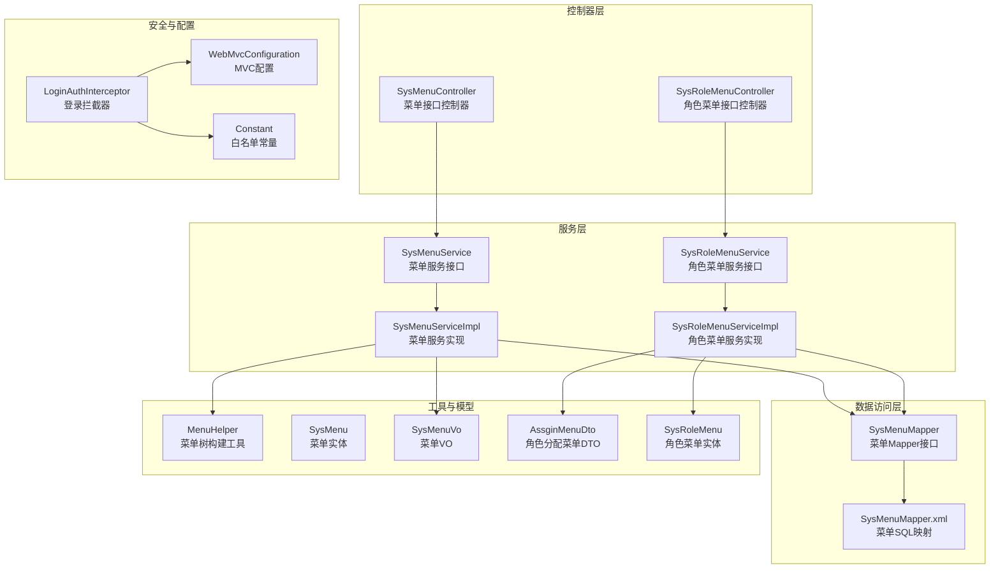
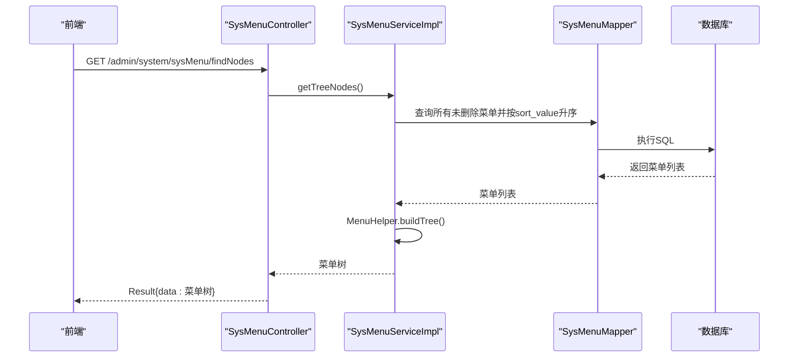
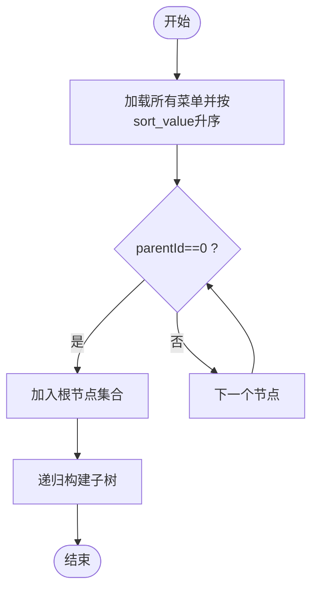
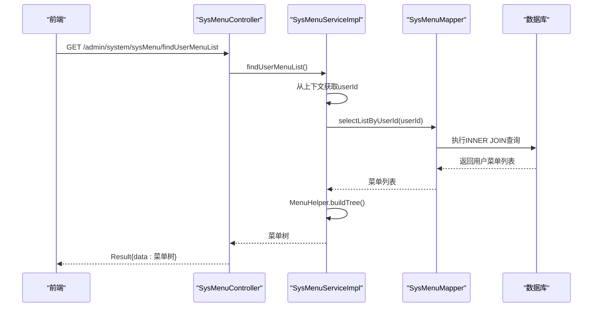
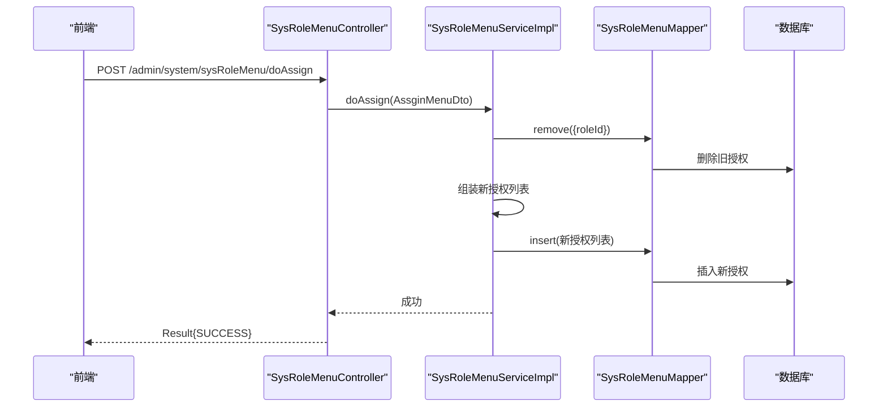
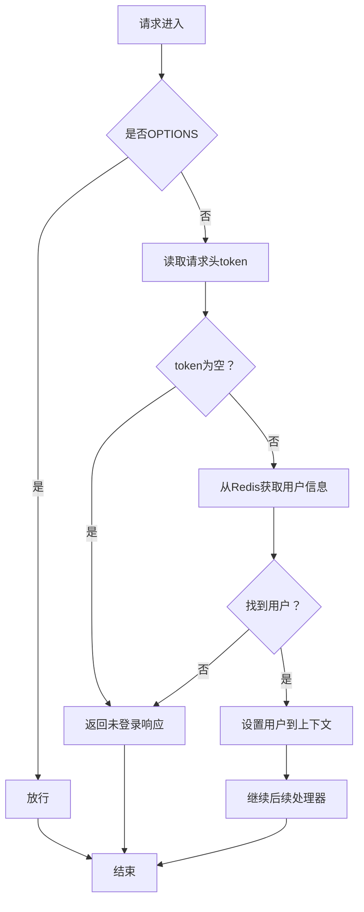
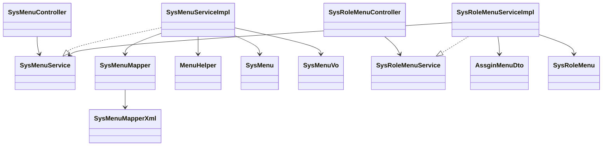

# 菜单管理接口

<cite>
**本文引用的文件**
- [SysMenuController.java](file://spzx-manager/src/main/java/com/joker/spzx/manager/controller/SysMenuController.java)
- [SysMenuService.java](file://spzx-manager/src/main/java/com/joker/spzx/manager/service/SysMenuService.java)
- [SysMenuServiceImpl.java](file://spzx-manager/src/main/java/com/joker/spzx/manager/service/impl/SysMenuServiceImpl.java)
- [SysMenuMapper.java](file://spzx-manager/src/main/java/com/joker/spzx/manager/mapper/SysMenuMapper.java)
- [SysMenuMapper.xml](file://spzx-manager/src/main/resources/mapper/SysMenuMapper.xml)
- [MenuHelper.java](file://spzx-manager/src/main/java/com/joker/spzx/manager/helper/MenuHelper.java)
- [SysMenu.java](file://spzx-model/src/main/java/com/joker/spzx/model/entity/system/SysMenu.java)
- [SysMenuVo.java](file://spzx-model/src/main/java/com/joker/spzx/model/vo/system/SysMenuVo.java)
- [SysRoleMenuController.java](file://spzx-manager/src/main/java/com/joker/spzx/manager/controller/SysRoleMenuController.java)
- [SysRoleMenuService.java](file://spzx-manager/src/main/java/com/joker/spzx/manager/service/SysRoleMenuService.java)
- [SysRoleMenuServiceImpl.java](file://spzx-manager/src/main/java/com/joker/spzx/manager/service/impl/SysRoleMenuServiceImpl.java)
- [SysRoleMenu.java](file://spzx-model/src/main/java/com/joker/spzx/model/entity/system/SysRoleMenu.java)
- [AssginMenuDto.java](file://spzx-model/src/main/java/com/joker/spzx/model/dto/system/AssginMenuDto.java)
- [LoginAuthInterceptor.java](file://spzx-manager/src/main/java/com/joker/spzx/manager/config/LoginAuthInterceptor.java)
- [WebMvcConfiguration.java](file://spzx-manager/src/main/java/com/joker/spzx/manager/config/WebMvcConfiguration.java)
- [Constant.java](file://spzx-common/common-util/src/main/java/com/joker/spzx/utils/Constant.java)
</cite>

## 目录
1. [简介](#简介)
2. [项目结构](#项目结构)
3. [核心组件](#核心组件)
4. [架构总览](#架构总览)
5. [详细组件分析](#详细组件分析)
6. [依赖关系分析](#依赖关系分析)
7. [性能考虑](#性能考虑)
8. [故障排查指南](#故障排查指南)
9. [结论](#结论)
10. [附录](#附录)

## 简介
本文件为 SPZX 电商管理系统“菜单管理”模块的接口文档，覆盖菜单 CRUD 操作、菜单树形结构查询、基于用户的动态菜单加载与权限过滤机制。文档同时说明菜单数据模型、菜单树构建算法以及前端菜单渲染逻辑，并给出权限验证、状态管理与排序功能的技术要点。

## 项目结构
菜单管理相关代码主要分布在 manager 层的 controller、service、mapper 与 helper，以及 model 层的数据模型与 VO/DTO 定义；权限拦截通过 Spring MVC 拦截器完成。

图表来源
- [SysMenuController.java:21-57](file://spzx-manager/src/main/java/com/joker/spzx/manager/controller/SysMenuController.java#L21-L57)
- [SysRoleMenuController.java:22-44](file://spzx-manager/src/main/java/com/joker/spzx/manager/controller/SysRoleMenuController.java#L22-L44)
- [SysMenuService.java:17-29](file://spzx-manager/src/main/java/com/joker/spzx/manager/service/SysMenuService.java#L17-L29)
- [SysMenuServiceImpl.java:30-117](file://spzx-manager/src/main/java/com/joker/spzx/manager/service/impl/SysMenuServiceImpl.java#L30-L117)
- [SysRoleMenuService.java:17-22](file://spzx-manager/src/main/java/com/joker/spzx/manager/service/SysRoleMenuService.java#L17-L22)
- [SysRoleMenuServiceImpl.java:31-76](file://spzx-manager/src/main/java/com/joker/spzx/manager/service/impl/SysRoleMenuServiceImpl.java#L31-L76)
- [SysMenuMapper.java:18-22](file://spzx-manager/src/main/java/com/joker/spzx/manager/mapper/SysMenuMapper.java#L18-L22)
- [SysMenuMapper.xml:5-12](file://spzx-manager/src/main/resources/mapper/SysMenuMapper.xml#L5-L12)
- [MenuHelper.java:8-44](file://spzx-manager/src/main/java/com/joker/spzx/manager/helper/MenuHelper.java#L8-L44)
- [SysMenu.java:14-41](file://spzx-model/src/main/java/com/joker/spzx/model/entity/system/SysMenu.java#L14-L41)
- [SysMenuVo.java:10-21](file://spzx-model/src/main/java/com/joker/spzx/model/vo/system/SysMenuVo.java#L10-L21)
- [AssginMenuDto.java:11-19](file://spzx-model/src/main/java/com/joker/spzx/model/dto/system/AssginMenuDto.java#L11-L19)
- [SysRoleMenu.java:27-59](file://spzx-model/src/main/java/com/joker/spzx/model/entity/system/SysRoleMenu.java#L27-L59)
- [LoginAuthInterceptor.java:23-81](file://spzx-manager/src/main/java/com/joker/spzx/manager/config/LoginAuthInterceptor.java#L23-L81)
- [WebMvcConfiguration.java:14-39](file://spzx-manager/src/main/java/com/joker/spzx/manager/config/WebMvcConfiguration.java#L14-L39)
- [Constant.java:7-27](file://spzx-common/common-util/src/main/java/com/joker/spzx/utils/Constant.java#L7-L27)

章节来源
- [SysMenuController.java:21-57](file://spzx-manager/src/main/java/com/joker/spzx/manager/controller/SysMenuController.java#L21-L57)
- [SysMenuService.java:17-29](file://spzx-manager/src/main/java/com/joker/spzx/manager/service/SysMenuService.java#L17-L29)
- [SysMenuServiceImpl.java:30-117](file://spzx-manager/src/main/java/com/joker/spzx/manager/service/impl/SysMenuServiceImpl.java#L30-L117)
- [SysMenuMapper.java:18-22](file://spzx-manager/src/main/java/com/joker/spzx/manager/mapper/SysMenuMapper.java#L18-L22)
- [SysMenuMapper.xml:5-12](file://spzx-manager/src/main/resources/mapper/SysMenuMapper.xml#L5-L12)
- [MenuHelper.java:8-44](file://spzx-manager/src/main/java/com/joker/spzx/manager/helper/MenuHelper.java#L8-L44)
- [SysMenu.java:14-41](file://spzx-model/src/main/java/com/joker/spzx/model/entity/system/SysMenu.java#L14-L41)
- [SysMenuVo.java:10-21](file://spzx-model/src/main/java/com/joker/spzx/model/vo/system/SysMenuVo.java#L10-L21)
- [SysRoleMenuController.java:22-44](file://spzx-manager/src/main/java/com/joker/spzx/manager/controller/SysRoleMenuController.java#L22-L44)
- [SysRoleMenuService.java:17-22](file://spzx-manager/src/main/java/com/joker/spzx/manager/service/SysRoleMenuService.java#L17-L22)
- [SysRoleMenuServiceImpl.java:31-76](file://spzx-manager/src/main/java/com/joker/spzx/manager/service/impl/SysRoleMenuServiceImpl.java#L31-L76)
- [AssginMenuDto.java:11-19](file://spzx-model/src/main/java/com/joker/spzx/model/dto/system/AssginMenuDto.java#L11-L19)
- [SysRoleMenu.java:27-59](file://spzx-model/src/main/java/com/joker/spzx/model/entity/system/SysRoleMenu.java#L27-L59)
- [LoginAuthInterceptor.java:23-81](file://spzx-manager/src/main/java/com/joker/spzx/manager/config/LoginAuthInterceptor.java#L23-L81)
- [WebMvcConfiguration.java:14-39](file://spzx-manager/src/main/java/com/joker/spzx/manager/config/WebMvcConfiguration.java#L14-L39)
- [Constant.java:7-27](file://spzx-common/common-util/src/main/java/com/joker/spzx/utils/Constant.java#L7-L27)

## 核心组件
- 控制器：SysMenuController 提供菜单树查询、新增、修改、删除接口；SysRoleMenuController 提供角色菜单分配与查询接口。
- 服务层：SysMenuService/SysMenuServiceImpl 实现菜单树构建、用户动态菜单加载、菜单持久化；SysRoleMenuService/SysRoleMenuServiceImpl 实现角色菜单分配与查询。
- 数据访问：SysMenuMapper 定义按用户查询菜单的 SQL；MenuHelper 提供菜单树构建算法。
- 模型与视图：SysMenu 实体定义菜单字段；SysMenuVo 用于前端渲染；AssginMenuDto 用于角色分配菜单时的请求参数。
- 权限拦截：LoginAuthInterceptor 结合 WebMvcConfiguration 和 Constant 白名单完成登录校验与上下文注入。

章节来源
- [SysMenuController.java:21-57](file://spzx-manager/src/main/java/com/joker/spzx/manager/controller/SysMenuController.java#L21-L57)
- [SysMenuService.java:17-29](file://spzx-manager/src/main/java/com/joker/spzx/manager/service/SysMenuService.java#L17-L29)
- [SysMenuServiceImpl.java:30-117](file://spzx-manager/src/main/java/com/joker/spzx/manager/service/impl/SysMenuServiceImpl.java#L30-L117)
- [SysMenuMapper.java:18-22](file://spzx-manager/src/main/java/com/joker/spzx/manager/mapper/SysMenuMapper.java#L18-L22)
- [MenuHelper.java:8-44](file://spzx-manager/src/main/java/com/joker/spzx/manager/helper/MenuHelper.java#L8-L44)
- [SysMenu.java:14-41](file://spzx-model/src/main/java/com/joker/spzx/model/entity/system/SysMenu.java#L14-L41)
- [SysMenuVo.java:10-21](file://spzx-model/src/main/java/com/joker/spzx/model/vo/system/SysMenuVo.java#L10-L21)
- [AssginMenuDto.java:11-19](file://spzx-model/src/main/java/com/joker/spzx/model/dto/system/AssginMenuDto.java#L11-L19)
- [SysRoleMenuController.java:22-44](file://spzx-manager/src/main/java/com/joker/spzx/manager/controller/SysRoleMenuController.java#L22-L44)
- [SysRoleMenuService.java:17-22](file://spzx-manager/src/main/java/com/joker/spzx/manager/service/SysRoleMenuService.java#L17-L22)
- [SysRoleMenuServiceImpl.java:31-76](file://spzx-manager/src/main/java/com/joker/spzx/manager/service/impl/SysRoleMenuServiceImpl.java#L31-L76)
- [SysRoleMenu.java:27-59](file://spzx-model/src/main/java/com/joker/spzx/model/entity/system/SysRoleMenu.java#L27-L59)
- [LoginAuthInterceptor.java:23-81](file://spzx-manager/src/main/java/com/joker/spzx/manager/config/LoginAuthInterceptor.java#L23-L81)
- [WebMvcConfiguration.java:14-39](file://spzx-manager/src/main/java/com/joker/spzx/manager/config/WebMvcConfiguration.java#L14-L39)
- [Constant.java:7-27](file://spzx-common/common-util/src/main/java/com/joker/spzx/utils/Constant.java#L7-L27)

## 架构总览
菜单管理采用典型的分层架构：控制器负责接收请求与返回响应，服务层处理业务逻辑（菜单树构建、用户菜单过滤、角色菜单分配），数据访问层通过 MyBatis 执行 SQL 查询，拦截器负责登录鉴权与上下文注入。

图表来源
- [SysMenuController.java:28-33](file://spzx-manager/src/main/java/com/joker/spzx/manager/controller/SysMenuController.java#L28-L33)
- [SysMenuServiceImpl.java:40-49](file://spzx-manager/src/main/java/com/joker/spzx/manager/service/impl/SysMenuServiceImpl.java#L40-L49)
- [SysMenuMapper.xml:5-12](file://spzx-manager/src/main/resources/mapper/SysMenuMapper.xml#L5-L12)
- [MenuHelper.java:16-24](file://spzx-manager/src/main/java/com/joker/spzx/manager/helper/MenuHelper.java#L16-L24)

## 详细组件分析

### 菜单数据模型
- SysMenu 字段说明
  - parentId：所属上级菜单 ID（根节点为 0）
  - title：菜单标题
  - component：前端组件名称
  - sortValue：排序值（升序）
  - status：状态（0:禁用, 1:正常）
  - children：子节点列表（非持久化字段）

- SysMenuVo 字段说明
  - title：菜单标题
  - name：组件名称
  - children：子菜单列表

- SysRoleMenu 字段说明
  - roleId：角色 ID
  - menuId：菜单 ID
  - isHalf：是否半选（用于角色分配时的半选状态）
  - isDeleted：删除标记
  - createTime/updateTime：创建与更新时间

章节来源
- [SysMenu.java:14-41](file://spzx-model/src/main/java/com/joker/spzx/model/entity/system/SysMenu.java#L14-L41)
- [SysMenuVo.java:10-21](file://spzx-model/src/main/java/com/joker/spzx/model/vo/system/SysMenuVo.java#L10-L21)
- [SysRoleMenu.java:27-59](file://spzx-model/src/main/java/com/joker/spzx/model/entity/system/SysRoleMenu.java#L27-L59)

### 菜单树构建算法
- buildTree：从顶层节点开始，遍历所有菜单，使用 findChildren 递归构建子树。
- findChildren：对每个父节点，查找其所有子节点并递归构建。

图表来源
- [MenuHelper.java:16-24](file://spzx-manager/src/main/java/com/joker/spzx/manager/helper/MenuHelper.java#L16-L24)
- [MenuHelper.java:32-43](file://spzx-manager/src/main/java/com/joker/spzx/manager/helper/MenuHelper.java#L32-L43)

章节来源
- [MenuHelper.java:8-44](file://spzx-manager/src/main/java/com/joker/spzx/manager/helper/MenuHelper.java#L8-L44)

### 动态菜单加载与权限过滤
- 用户登录后，拦截器将用户信息写入线程上下文；服务层通过用户 ID 查询其关联的所有菜单，并构建菜单树。
- SQL 通过 sys_user_role 与 sys_role_menu 过滤出该用户具备权限的菜单，且仅返回未删除的菜单。

图表来源
- [SysMenuServiceImpl.java:93-98](file://spzx-manager/src/main/java/com/joker/spzx/manager/service/impl/SysMenuServiceImpl.java#L93-L98)
- [SysMenuMapper.xml:5-12](file://spzx-manager/src/main/resources/mapper/SysMenuMapper.xml#L5-L12)
- [LoginAuthInterceptor.java:54-55](file://spzx-manager/src/main/java/com/joker/spzx/manager/config/LoginAuthInterceptor.java#L54-L55)

章节来源
- [SysMenuServiceImpl.java:93-117](file://spzx-manager/src/main/java/com/joker/spzx/manager/service/impl/SysMenuServiceImpl.java#L93-L117)
- [SysMenuMapper.xml:5-12](file://spzx-manager/src/main/resources/mapper/SysMenuMapper.xml#L5-L12)
- [LoginAuthInterceptor.java:29-58](file://spzx-manager/src/main/java/com/joker/spzx/manager/config/LoginAuthInterceptor.java#L29-L58)

### 角色菜单分配与半选状态
- 角色分配菜单时，先清空该角色已有的菜单授权，再批量插入新的授权记录。
- AssginMenuDto 的 menuIdList 中，Map 的键为菜单 ID，值为是否半选（0 否，1 是）。

图表来源
- [SysRoleMenuController.java:38-42](file://spzx-manager/src/main/java/com/joker/spzx/manager/controller/SysRoleMenuController.java#L38-L42)
- [SysRoleMenuServiceImpl.java:52-76](file://spzx-manager/src/main/java/com/joker/spzx/manager/service/impl/SysRoleMenuServiceImpl.java#L52-L76)
- [AssginMenuDto.java:11-19](file://spzx-model/src/main/java/com/joker/spzx/model/dto/system/AssginMenuDto.java#L11-L19)

章节来源
- [SysRoleMenuController.java:22-44](file://spzx-manager/src/main/java/com/joker/spzx/manager/controller/SysRoleMenuController.java#L22-L44)
- [SysRoleMenuServiceImpl.java:31-76](file://spzx-manager/src/main/java/com/joker/spzx/manager/service/impl/SysRoleMenuServiceImpl.java#L31-L76)
- [AssginMenuDto.java:11-19](file://spzx-model/src/main/java/com/joker/spzx/model/dto/system/AssginMenuDto.java#L11-L19)

### 登录拦截与权限验证
- 登录拦截器从请求头读取 token，从 Redis 获取用户信息，校验通过后将用户写入线程上下文；白名单路径不拦截。
- WebMvcConfiguration 注册拦截器并排除白名单。

图表来源
- [LoginAuthInterceptor.java:29-58](file://spzx-manager/src/main/java/com/joker/spzx/manager/config/LoginAuthInterceptor.java#L29-L58)
- [WebMvcConfiguration.java:19-25](file://spzx-manager/src/main/java/com/joker/spzx/manager/config/WebMvcConfiguration.java#L19-L25)
- [Constant.java:9-25](file://spzx-common/common-util/src/main/java/com/joker/spzx/utils/Constant.java#L9-L25)

章节来源
- [LoginAuthInterceptor.java:23-81](file://spzx-manager/src/main/java/com/joker/spzx/manager/config/LoginAuthInterceptor.java#L23-L81)
- [WebMvcConfiguration.java:14-39](file://spzx-manager/src/main/java/com/joker/spzx/manager/config/WebMvcConfiguration.java#L14-L39)
- [Constant.java:7-27](file://spzx-common/common-util/src/main/java/com/joker/spzx/utils/Constant.java#L7-L27)

## 依赖关系分析
- 控制器依赖服务接口；服务实现依赖 Mapper 与工具类；Mapper 依赖 XML 映射；拦截器依赖 Redis 与上下文工具。
- 角色菜单分配流程中，服务实现依赖菜单服务以获取菜单树，依赖 DTO 与实体进行授权写入。

图表来源
- [SysMenuController.java:21-57](file://spzx-manager/src/main/java/com/joker/spzx/manager/controller/SysMenuController.java#L21-L57)
- [SysMenuService.java:17-29](file://spzx-manager/src/main/java/com/joker/spzx/manager/service/SysMenuService.java#L17-L29)
- [SysMenuServiceImpl.java:30-117](file://spzx-manager/src/main/java/com/joker/spzx/manager/service/impl/SysMenuServiceImpl.java#L30-L117)
- [SysMenuMapper.java:18-22](file://spzx-manager/src/main/java/com/joker/spzx/manager/mapper/SysMenuMapper.java#L18-L22)
- [SysMenuMapper.xml:5-12](file://spzx-manager/src/main/resources/mapper/SysMenuMapper.xml#L5-L12)
- [MenuHelper.java:8-44](file://spzx-manager/src/main/java/com/joker/spzx/manager/helper/MenuHelper.java#L8-L44)
- [SysMenu.java:14-41](file://spzx-model/src/main/java/com/joker/spzx/model/entity/system/SysMenu.java#L14-L41)
- [SysMenuVo.java:10-21](file://spzx-model/src/main/java/com/joker/spzx/model/vo/system/SysMenuVo.java#L10-L21)
- [SysRoleMenuController.java:22-44](file://spzx-manager/src/main/java/com/joker/spzx/manager/controller/SysRoleMenuController.java#L22-L44)
- [SysRoleMenuService.java:17-22](file://spzx-manager/src/main/java/com/joker/spzx/manager/service/SysRoleMenuService.java#L17-L22)
- [SysRoleMenuServiceImpl.java:31-76](file://spzx-manager/src/main/java/com/joker/spzx/manager/service/impl/SysRoleMenuServiceImpl.java#L31-L76)
- [AssginMenuDto.java:11-19](file://spzx-model/src/main/java/com/joker/spzx/model/dto/system/AssginMenuDto.java#L11-L19)
- [SysRoleMenu.java:27-59](file://spzx-model/src/main/java/com/joker/spzx/model/entity/system/SysRoleMenu.java#L27-L59)

章节来源
- [SysMenuServiceImpl.java:30-117](file://spzx-manager/src/main/java/com/joker/spzx/manager/service/impl/SysMenuServiceImpl.java#L30-L117)
- [SysRoleMenuServiceImpl.java:31-76](file://spzx-manager/src/main/java/com/joker/spzx/manager/service/impl/SysRoleMenuServiceImpl.java#L31-L76)

## 性能考虑
- 菜单树构建：buildTree 与 findChildren 为 O(n^2) 最坏情况，建议在菜单数量较大时优化为一次遍历 + 哈希索引（当前实现为简单递归，适合中小规模）。
- 排序：数据库侧已按 sort_value 升序，避免重复排序。
- 权限查询：通过 INNER JOIN 限制查询范围，减少无效数据传输。
- 缓存：可考虑将用户菜单树缓存至 Redis，降低重复查询成本。

## 故障排查指南
- 登录拦截失败
  - 检查请求头是否携带 token，确认 Redis 中是否存在 user:login:{token} 键。
  - 核对白名单配置，确保接口路径正确。
- 动态菜单为空
  - 确认用户是否绑定角色，角色是否授予菜单权限。
  - 检查 sys_menu 表中 is_deleted 与 status 字段是否符合预期。
- 菜单树异常
  - 检查 parentId 与 id 关系，避免循环引用或孤儿节点。
  - 确认数据库排序字段 sort_value 是否正确。

章节来源
- [LoginAuthInterceptor.java:40-58](file://spzx-manager/src/main/java/com/joker/spzx/manager/config/LoginAuthInterceptor.java#L40-L58)
- [WebMvcConfiguration.java:19-25](file://spzx-manager/src/main/java/com/joker/spzx/manager/config/WebMvcConfiguration.java#L19-L25)
- [Constant.java:9-25](file://spzx-common/common-util/src/main/java/com/joker/spzx/utils/Constant.java#L9-L25)
- [SysMenuMapper.xml:5-12](file://spzx-manager/src/main/resources/mapper/SysMenuMapper.xml#L5-L12)
- [SysMenuServiceImpl.java:40-49](file://spzx-manager/src/main/java/com/joker/spzx/manager/service/impl/SysMenuServiceImpl.java#L40-L49)

## 结论
本接口文档梳理了菜单管理的完整链路：从控制器到服务、数据访问、权限拦截与模型定义。通过菜单树构建与用户权限过滤，实现了动态菜单加载；通过角色菜单分配，支持半选状态与批量授权。建议在生产环境中结合缓存与索引优化，进一步提升性能与稳定性。

## 附录

### 接口清单与规范

- 菜单树形列表
  - 方法：GET
  - URL：/admin/system/sysMenu/findNodes
  - 请求参数：无
  - 响应：Result<List<SysMenu>>
  - 说明：返回按 sort_value 升序排列的菜单树

- 新增菜单
  - 方法：POST
  - URL：/admin/system/sysMenu/save
  - 请求参数：SysMenu（包含 parentId、title、component、sortValue、status 等）
  - 响应：Result<String>
  - 说明：插入新菜单并更新角色菜单半选状态

- 修改菜单
  - 方法：PUT
  - URL：/admin/system/sysMenu/update
  - 请求参数：SysMenu（包含更新字段）
  - 响应：Result<String>
  - 说明：更新菜单信息

- 删除菜单
  - 方法：DELETE
  - URL：/admin/system/sysMenu/removeById/{id}
  - 请求参数：路径变量 id
  - 响应：Result<String>
  - 说明：逻辑删除（设置 is_deleted=1）

- 用户动态菜单
  - 方法：GET
  - URL：/admin/system/sysMenu/findUserMenuList
  - 请求参数：无
  - 响应：Result<List<SysMenuVo>>
  - 说明：返回当前用户具备权限的菜单树（前端渲染用）

- 角色菜单分配
  - 方法：POST
  - URL：/admin/system/sysRoleMenu/doAssign
  - 请求参数：AssginMenuDto（roleId、menuIdList）
  - 响应：Result<String>
  - 说明：清空旧授权后批量插入新授权

- 根据角色查询菜单树
  - 方法：GET
  - URL：/admin/system/sysRoleMenu/findSysRoleMenuByRoleId/{roleId}
  - 请求参数：路径变量 roleId
  - 响应：Result<Map<String,Object>>
  - 说明：返回 sysMenuList（菜单树）与 roleMenuIds（已授权菜单ID集合）

章节来源
- [SysMenuController.java:28-57](file://spzx-manager/src/main/java/com/joker/spzx/manager/controller/SysMenuController.java#L28-L57)
- [SysMenuServiceImpl.java:93-117](file://spzx-manager/src/main/java/com/joker/spzx/manager/service/impl/SysMenuServiceImpl.java#L93-L117)
- [SysRoleMenuController.java:30-42](file://spzx-manager/src/main/java/com/joker/spzx/manager/controller/SysRoleMenuController.java#L30-L42)
- [AssginMenuDto.java:11-19](file://spzx-model/src/main/java/com/joker/spzx/model/dto/system/AssginMenuDto.java#L11-L19)

### 前端菜单渲染逻辑
- 后端返回 SysMenuVo 列表，包含 title、name 与 children。
- 前端根据 name 渲染路由组件，children 递归渲染子菜单。
- 可结合 element-plus 或类似 UI 库的 Tree/Menu 组件进行展示。

章节来源
- [SysMenuVo.java:10-21](file://spzx-model/src/main/java/com/joker/spzx/model/vo/system/SysMenuVo.java#L10-L21)
- [SysMenuServiceImpl.java:102-116](file://spzx-manager/src/main/java/com/joker/spzx/manager/service/impl/SysMenuServiceImpl.java#L102-L116)