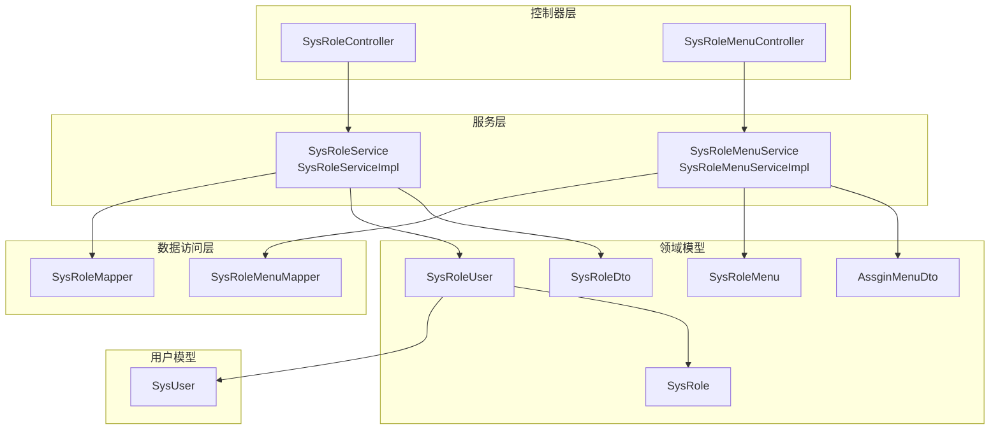
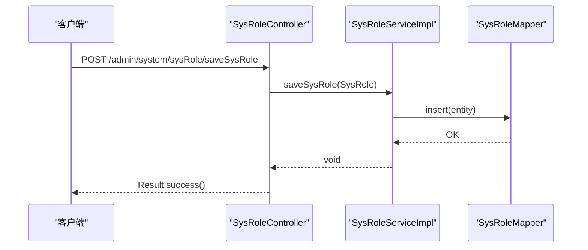
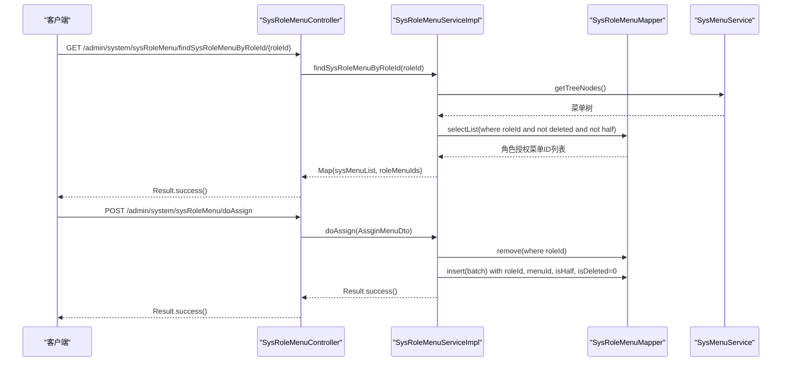
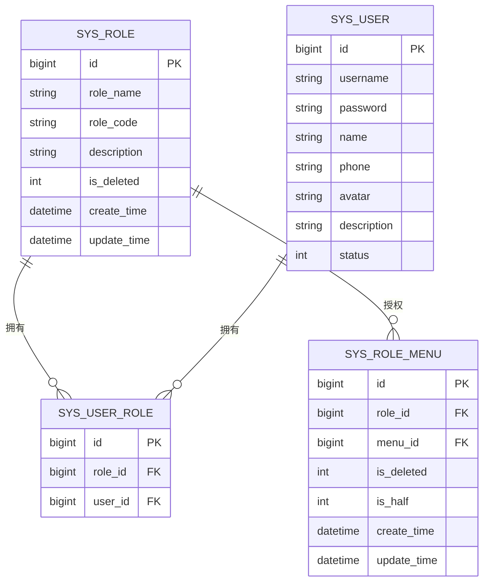
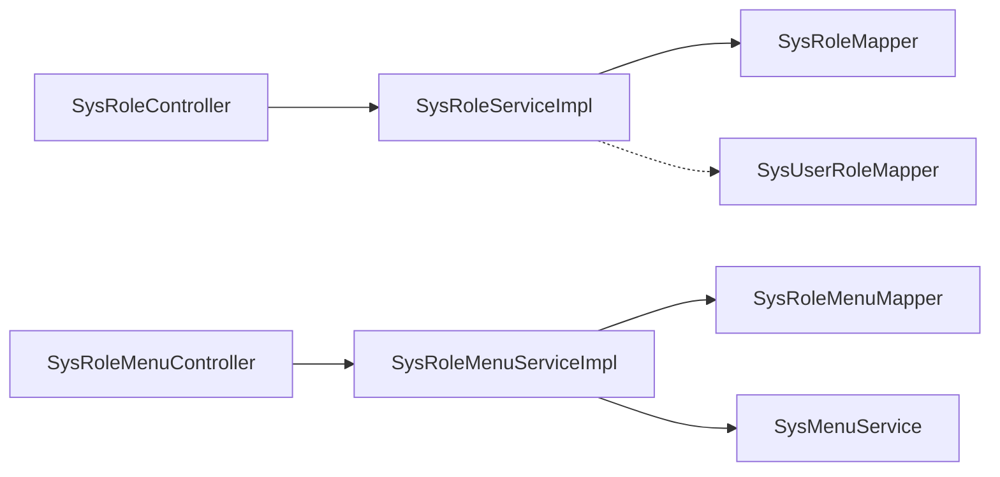

# 角色管理接口

<cite>
**本文引用的文件**
- [SysRoleController.java](file://spzx-manager/src/main/java/com/joker/spzx/manager/controller/SysRoleController.java)
- [SysRoleService.java](file://spzx-manager/src/main/java/com/joker/spzx/manager/service/SysRoleService.java)
- [SysRoleServiceImpl.java](file://spzx-manager/src/main/java/com/joker/spzx/manager/service/impl/SysRoleServiceImpl.java)
- [SysRoleMapper.java](file://spzx-manager/src/main/java/com/joker/spzx/manager/mapper/SysRoleMapper.java)
- [SysRole.java](file://spzx-model/src/main/java/com/joker/spzx/model/entity/system/SysRole.java)
- [SysRoleDto.java](file://spzx-model/src/main/java/com/joker/spzx/model/dto/system/SysRoleDto.java)
- [SysRoleMenuController.java](file://spzx-manager/src/main/java/com/joker/spzx/manager/controller/SysRoleMenuController.java)
- [SysRoleMenuService.java](file://spzx-manager/src/main/java/com/joker/spzx/manager/service/SysRoleMenuService.java)
- [SysRoleMenuServiceImpl.java](file://spzx-manager/src/main/java/com/joker/spzx/manager/service/impl/SysRoleMenuServiceImpl.java)
- [SysRoleMenuMapper.java](file://spzx-manager/src/main/java/com/joker/spzx/manager/mapper/SysRoleMenuMapper.java)
- [SysRoleMenu.java](file://spzx-model/src/main/java/com/joker/spzx/model/entity/system/SysRoleMenu.java)
- [AssginMenuDto.java](file://spzx-model/src/main/java/com/joker/spzx/model/dto/system/AssginMenuDto.java)
- [SysUser.java](file://spzx-model/src/main/java/com/joker/spzx/model/entity/system/SysUser.java)
- [SysRoleUser.java](file://spzx-model/src/main/java/com/joker/spzx/model/entity/system/SysRoleUser.java)
</cite>

## 目录
1. [简介](#简介)
2. [项目结构](#项目结构)
3. [核心组件](#核心组件)
4. [架构总览](#架构总览)
5. [详细组件分析](#详细组件分析)
6. [依赖分析](#依赖分析)
7. [性能考虑](#性能考虑)
8. [故障排查指南](#故障排查指南)
9. [结论](#结论)
10. [附录](#附录)

## 简介
本文件为 SPZX 电商管理系统“角色管理”模块的接口文档，覆盖角色 CRUD 操作、角色权限分配、角色菜单授权、角色与用户的关联关系、角色状态与逻辑删除、角色数据范围控制等能力。文档同时给出角色数据模型、权限矩阵与角色继承机制说明，并提供批量授权、权限回收与角色统计的扩展建议。

## 项目结构
围绕角色管理的相关代码分布在 manager 层的 controller、service、mapper 与 model 层的 entity、dto 中，形成清晰的分层架构：
- 控制器层：SysRoleController、SysRoleMenuController
- 服务层：SysRoleService、SysRoleMenuService 及其实现类
- 数据访问层：SysRoleMapper、SysRoleMenuMapper
- 领域模型：SysRole、SysRoleMenu、SysRoleUser、AssginMenuDto、SysRoleDto
- 用户模型：SysUser

图表来源
- [SysRoleController.java:23-69](file://spzx-manager/src/main/java/com/joker/spzx/manager/controller/SysRoleController.java#L23-L69)
- [SysRoleMenuController.java:22-44](file://spzx-manager/src/main/java/com/joker/spzx/manager/controller/SysRoleMenuController.java#L22-L44)
- [SysRoleService.java:18-30](file://spzx-manager/src/main/java/com/joker/spzx/manager/service/SysRoleService.java#L18-L30)
- [SysRoleMenuService.java:17-22](file://spzx-manager/src/main/java/com/joker/spzx/manager/service/SysRoleMenuService.java#L17-L22)
- [SysRoleServiceImpl.java:31-84](file://spzx-manager/src/main/java/com/joker/spzx/manager/service/impl/SysRoleServiceImpl.java#L31-L84)
- [SysRoleMenuServiceImpl.java:30-77](file://spzx-manager/src/main/java/com/joker/spzx/manager/service/impl/SysRoleMenuServiceImpl.java#L30-L77)
- [SysRoleMapper.java:15-18](file://spzx-manager/src/main/java/com/joker/spzx/manager/mapper/SysRoleMapper.java#L15-L18)
- [SysRoleMenuMapper.java:15-18](file://spzx-manager/src/main/java/com/joker/spzx/manager/mapper/SysRoleMenuMapper.java#L15-L18)
- [SysRole.java:12-27](file://spzx-model/src/main/java/com/joker/spzx/model/entity/system/SysRole.java#L12-L27)
- [SysRoleMenu.java:23-59](file://spzx-model/src/main/java/com/joker/spzx/model/entity/system/SysRoleMenu.java#L23-L59)
- [SysRoleUser.java:10-22](file://spzx-model/src/main/java/com/joker/spzx/model/entity/system/SysRoleUser.java#L10-L22)
- [SysRoleDto.java:8-13](file://spzx-model/src/main/java/com/joker/spzx/model/dto/system/SysRoleDto.java#L8-L13)
- [AssginMenuDto.java:11-18](file://spzx-model/src/main/java/com/joker/spzx/model/dto/system/AssginMenuDto.java#L11-L18)
- [SysUser.java:10-41](file://spzx-model/src/main/java/com/joker/spzx/model/entity/system/SysUser.java#L10-L41)

章节来源
- [SysRoleController.java:15-69](file://spzx-manager/src/main/java/com/joker/spzx/manager/controller/SysRoleController.java#L15-L69)
- [SysRoleMenuController.java:14-44](file://spzx-manager/src/main/java/com/joker/spzx/manager/controller/SysRoleMenuController.java#L14-L44)

## 核心组件
- 角色实体与DTO
  - 实体：SysRole（角色名称、角色编码、描述、通用字段）
  - DTO：SysRoleDto（分页查询条件：角色名称）
- 角色菜单实体与DTO
  - 实体：SysRoleMenu（角色菜单关联、创建/更新时间、软删、半选标记）
  - DTO：AssginMenuDto（角色ID、菜单ID列表及半选标记）
- 用户角色关联
  - 实体：SysRoleUser（用户与角色多对多中间表）

章节来源
- [SysRole.java:12-27](file://spzx-model/src/main/java/com/joker/spzx/model/entity/system/SysRole.java#L12-L27)
- [SysRoleDto.java:8-13](file://spzx-model/src/main/java/com/joker/spzx/model/dto/system/SysRoleDto.java#L8-L13)
- [SysRoleMenu.java:23-59](file://spzx-model/src/main/java/com/joker/spzx/model/entity/system/SysRoleMenu.java#L23-L59)
- [AssginMenuDto.java:11-18](file://spzx-model/src/main/java/com/joker/spzx/model/dto/system/AssginMenuDto.java#L11-L18)
- [SysRoleUser.java:10-22](file://spzx-model/src/main/java/com/joker/spzx/model/entity/system/SysRoleUser.java#L10-L22)

## 架构总览
角色管理采用标准的 MVC 分层架构，控制器负责接收请求并返回统一结果包装；服务层封装业务逻辑；Mapper 负责数据库交互；Model 定义实体与传输对象。

图表来源
- [SysRoleController.java:48-53](file://spzx-manager/src/main/java/com/joker/spzx/manager/controller/SysRoleController.java#L48-L53)
- [SysRoleServiceImpl.java:48-52](file://spzx-manager/src/main/java/com/joker/spzx/manager/service/impl/SysRoleServiceImpl.java#L48-L52)
- [SysRoleMapper.java:15-18](file://spzx-manager/src/main/java/com/joker/spzx/manager/mapper/SysRoleMapper.java#L15-L18)

## 详细组件分析

### 角色CRUD接口
- 分页查询
  - 方法与路径：POST /admin/system/sysRole/findByPage/{pageNum}/{pageSize}
  - 请求体：SysRoleDto（可选：角色名称）
  - 返回：分页的角色列表
- 新增角色
  - 方法与路径：POST /admin/system/sysRole/saveSysRole
  - 请求体：SysRole（角色名称、角色编码、描述）
  - 行为：设置软删标志与创建时间后保存
- 修改角色
  - 方法与路径：POST /admin/system/sysRole/updateSysRole
  - 请求体：SysRole（含主键）
  - 行为：更新时写入更新时间
- 删除角色
  - 方法与路径：DELETE /admin/system/sysRole/deleteById/{id}
  - 行为：逻辑删除（软删），更新时间

响应统一使用 Result 包装，成功时返回空数据或分页信息。

章节来源
- [SysRoleController.java:31-67](file://spzx-manager/src/main/java/com/joker/spzx/manager/controller/SysRoleController.java#L31-L67)
- [SysRoleServiceImpl.java:38-68](file://spzx-manager/src/main/java/com/joker/spzx/manager/service/impl/SysRoleServiceImpl.java#L38-L68)
- [SysRole.java:12-27](file://spzx-model/src/main/java/com/joker/spzx/model/entity/system/SysRole.java#L12-L27)

### 角色与用户关联接口
- 查询用户的角色列表
  - 方法与路径：GET /admin/system/sysRole/roleList/{userId}
  - 返回：Map，包含“所有角色列表”和“当前用户已拥有的角色ID集合”

该接口用于前端勾选/展示用户已有角色，便于角色分配。

章节来源
- [SysRoleController.java:41-46](file://spzx-manager/src/main/java/com/joker/spzx/manager/controller/SysRoleController.java#L41-L46)
- [SysRoleServiceImpl.java:70-82](file://spzx-manager/src/main/java/com/joker/spzx/manager/service/impl/SysRoleServiceImpl.java#L70-L82)
- [SysRoleUser.java:10-22](file://spzx-model/src/main/java/com/joker/spzx/model/entity/system/SysRoleUser.java#L10-L22)

### 角色菜单授权接口
- 查询角色已授权的菜单树与勾选项
  - 方法与路径：GET /admin/system/sysRoleMenu/findSysRoleMenuByRoleId/{roleId}
  - 返回：Map，包含“菜单树节点”和“角色已授权的菜单ID集合”
- 批量授权菜单
  - 方法与路径：POST /admin/system/sysRoleMenu/doAssign
  - 请求体：AssginMenuDto（roleId、menuIdList，其中每项为菜单ID与半选标记）
  - 行为：先按角色清空旧授权，再批量插入新授权；支持半选标记

图表来源
- [SysRoleMenuController.java:30-42](file://spzx-manager/src/main/java/com/joker/spzx/manager/controller/SysRoleMenuController.java#L30-L42)
- [SysRoleMenuServiceImpl.java:37-75](file://spzx-manager/src/main/java/com/joker/spzx/manager/service/impl/SysRoleMenuServiceImpl.java#L37-L75)
- [SysRoleMenuMapper.java:15-18](file://spzx-manager/src/main/java/com/joker/spzx/manager/mapper/SysRoleMenuMapper.java#L15-L18)
- [AssginMenuDto.java:11-18](file://spzx-model/src/main/java/com/joker/spzx/model/dto/system/AssginMenuDto.java#L11-L18)
- [SysRoleMenu.java:23-59](file://spzx-model/src/main/java/com/joker/spzx/model/entity/system/SysRoleMenu.java#L23-L59)

章节来源
- [SysRoleMenuController.java:30-42](file://spzx-manager/src/main/java/com/joker/spzx/manager/controller/SysRoleMenuController.java#L30-L42)
- [SysRoleMenuServiceImpl.java:37-75](file://spzx-manager/src/main/java/com/joker/spzx/manager/service/impl/SysRoleMenuServiceImpl.java#L37-L75)
- [AssginMenuDto.java:11-18](file://spzx-model/src/main/java/com/joker/spzx/model/dto/system/AssginMenuDto.java#L11-L18)

### 角色状态管理与数据范围控制
- 软删除控制
  - 角色与角色菜单均具备 is_deleted 字段，删除时仅更新软删标志，避免物理删除影响历史审计与关联完整性。
- 分页与查询过滤
  - 分页查询默认过滤已删除角色；授权查询默认排除半选标记且未软删的记录。
- 用户状态
  - 用户实体包含状态字段，用于控制用户启用/停用，间接影响角色生效范围。

章节来源
- [SysRoleServiceImpl.java:39-45](file://spzx-manager/src/main/java/com/joker/spzx/manager/service/impl/SysRoleServiceImpl.java#L39-L45)
- [SysRoleMenuServiceImpl.java:37-50](file://spzx-manager/src/main/java/com/joker/spzx/manager/service/impl/SysRoleMenuServiceImpl.java#L37-L50)
- [SysRole.java:12-27](file://spzx-model/src/main/java/com/joker/spzx/model/entity/system/SysRole.java#L12-L27)
- [SysRoleMenu.java:23-59](file://spzx-model/src/main/java/com/joker/spzx/model/entity/system/SysRoleMenu.java#L23-L59)
- [SysUser.java:10-41](file://spzx-model/src/main/java/com/joker/spzx/model/entity/system/SysUser.java#L10-L41)

### 角色数据模型与权限矩阵

图表来源
- [SysRole.java:12-27](file://spzx-model/src/main/java/com/joker/spzx/model/entity/system/SysRole.java#L12-L27)
- [SysRoleMenu.java:23-59](file://spzx-model/src/main/java/com/joker/spzx/model/entity/system/SysRoleMenu.java#L23-L59)
- [SysRoleUser.java:10-22](file://spzx-model/src/main/java/com/joker/spzx/model/entity/system/SysRoleUser.java#L10-L22)
- [SysUser.java:10-41](file://spzx-model/src/main/java/com/joker/spzx/model/entity/system/SysUser.java#L10-L41)

### 角色继承机制
- 当前代码未实现显式“角色继承”（如角色A继承角色B的权限）。若需实现，可在服务层扩展：在查询角色权限时，递归合并被继承角色的菜单ID集合，再进行去重与排序处理。此为概念性建议，非现有实现。

## 依赖分析
- 控制器到服务：通过注解注入，职责清晰，耦合度低
- 服务到Mapper：MyBatis-Plus 提供通用 CRUD，减少重复SQL
- 权限查询依赖菜单服务：角色菜单授权查询依赖菜单树构建能力
- 关联关系：用户-角色-菜单三者通过中间表建立多对多关系

图表来源
- [SysRoleController.java:23-69](file://spzx-manager/src/main/java/com/joker/spzx/manager/controller/SysRoleController.java#L23-L69)
- [SysRoleServiceImpl.java:31-84](file://spzx-manager/src/main/java/com/joker/spzx/manager/service/impl/SysRoleServiceImpl.java#L31-L84)
- [SysRoleMenuController.java:22-44](file://spzx-manager/src/main/java/com/joker/spzx/manager/controller/SysRoleMenuController.java#L22-L44)
- [SysRoleMenuServiceImpl.java:30-77](file://spzx-manager/src/main/java/com/joker/spzx/manager/service/impl/SysRoleMenuServiceImpl.java#L30-L77)

章节来源
- [SysRoleServiceImpl.java:35-36](file://spzx-manager/src/main/java/com/joker/spzx/manager/service/impl/SysRoleServiceImpl.java#L35-L36)
- [SysRoleMenuServiceImpl.java:34-35](file://spzx-manager/src/main/java/com/joker/spzx/manager/service/impl/SysRoleMenuServiceImpl.java#L34-L35)

## 性能考虑
- 分页查询：使用 MyBatis-Plus 分页插件，建议在角色名称上建立索引以提升模糊查询性能
- 批量授权：doAssign 使用批量插入，避免逐条写入带来的事务开销
- 软删过滤：在分页与授权查询中默认过滤已删除记录，减少无效数据扫描
- 缓存建议：菜单树与角色列表可引入缓存，降低高频查询压力（概念性建议）

## 故障排查指南
- 授权失败或权限未生效
  - 检查 AssginMenuDto 的 roleId 是否正确，menuIdList 是否包含有效菜单ID
  - 确认 doAssign 是否执行了清空旧授权与批量插入
- 查询不到角色或菜单
  - 确认 SysRole.is_deleted 与 SysRoleMenu.is_deleted 是否为未删除状态
  - 确认 SysRoleMenu.is_half 是否按预期过滤（授权查询默认排除半选）
- 用户无法登录或权限异常
  - 检查用户状态字段是否为启用状态
  - 确认用户-角色关联是否存在

章节来源
- [SysRoleMenuServiceImpl.java:52-75](file://spzx-manager/src/main/java/com/joker/spzx/manager/service/impl/SysRoleMenuServiceImpl.java#L52-L75)
- [SysRoleMenuServiceImpl.java:37-50](file://spzx-manager/src/main/java/com/joker/spzx/manager/service/impl/SysRoleMenuServiceImpl.java#L37-L50)
- [SysUser.java:10-41](file://spzx-model/src/main/java/com/joker/spzx/model/entity/system/SysUser.java#L10-L41)

## 结论
本接口体系完整覆盖角色 CRUD、角色与用户的关联查询、角色菜单授权与批量授权，配合软删除与半选标记实现灵活的权限控制。建议后续扩展角色继承与权限统计功能，进一步完善权限治理能力。

## 附录

### 接口清单与规范
- 角色管理
  - POST /admin/system/sysRole/findByPage/{pageNum}/{pageSize}：分页查询（请求体：SysRoleDto）
  - POST /admin/system/sysRole/saveSysRole：新增角色（请求体：SysRole）
  - POST /admin/system/sysRole/updateSysRole：修改角色（请求体：SysRole）
  - DELETE /admin/system/sysRole/deleteById/{id}：逻辑删除角色
  - GET /admin/system/sysRole/roleList/{userId}：查询用户角色列表（返回：Map）
- 角色菜单授权
  - GET /admin/system/sysRoleMenu/findSysRoleMenuByRoleId/{roleId}：查询角色菜单树与勾选项
  - POST /admin/system/sysRoleMenu/doAssign：批量授权（请求体：AssginMenuDto）

章节来源
- [SysRoleController.java:31-67](file://spzx-manager/src/main/java/com/joker/spzx/manager/controller/SysRoleController.java#L31-L67)
- [SysRoleMenuController.java:30-42](file://spzx-manager/src/main/java/com/joker/spzx/manager/controller/SysRoleMenuController.java#L30-L42)