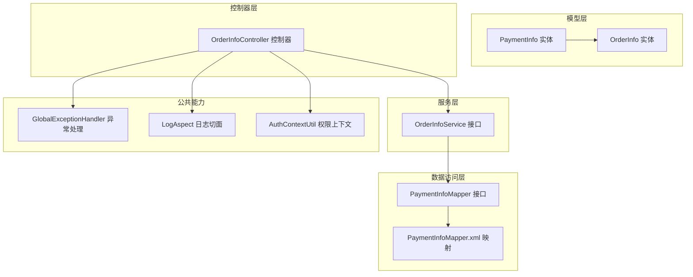
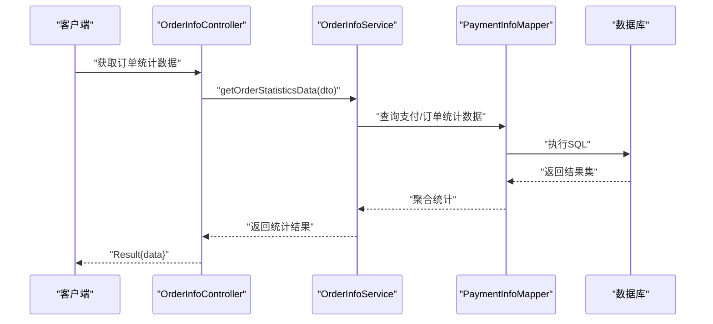
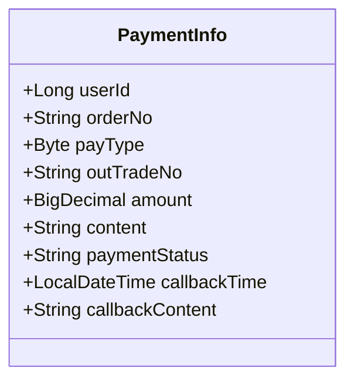
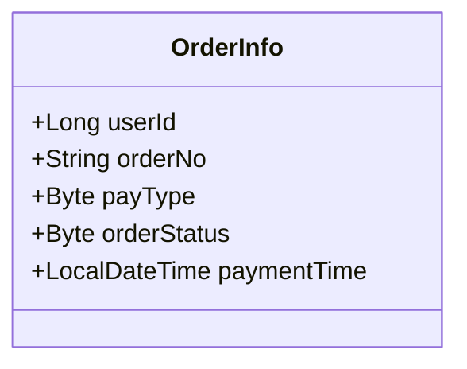
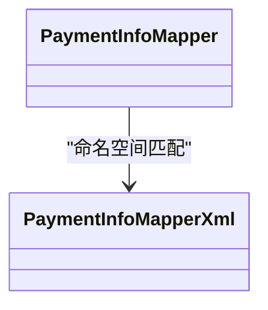
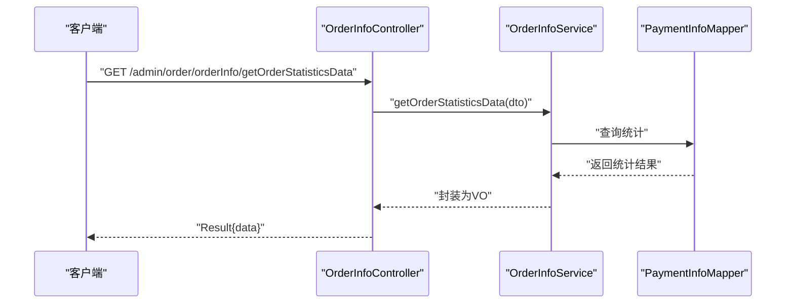
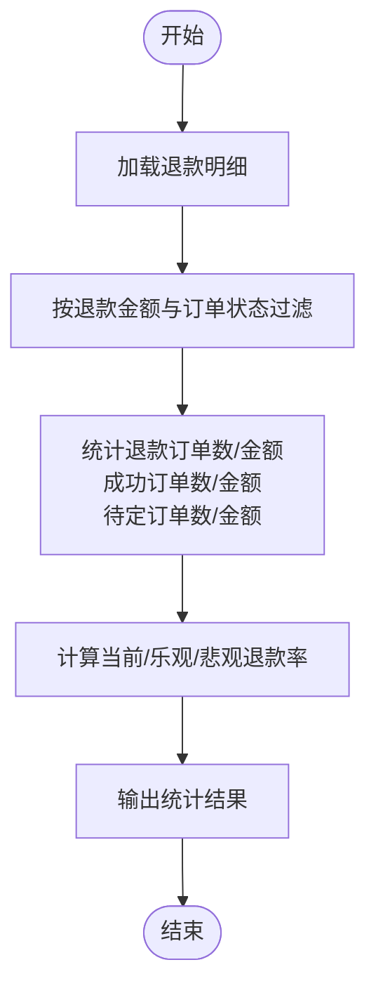
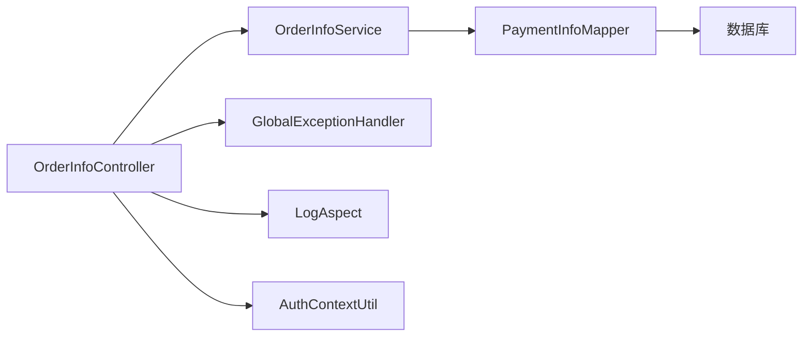

# 支付处理接口

<cite>
**本文引用的文件**
- [PaymentInfo.java](file://spzx-model/src/main/java/com/joker/spzx/model/entity/pay/PaymentInfo.java)
- [PaymentInfoMapper.java](file://spzx-manager/src/main/java/com/joker/spzx/manager/mapper/PaymentInfoMapper.java)
- [PaymentInfoMapper.xml](file://spzx-manager/src/main/resources/mapper/PaymentInfoMapper.xml)
- [OrderInfo.java](file://spzx-model/src/main/java/com/joker/spzx/model/entity/order/OrderInfo.java)
- [OrderInfoController.java](file://spzx-manager/src/main/java/com/joker/spzx/manager/controller/OrderInfoController.java)
- [OrderInfoService.java](file://spzx-manager/src/main/java/com/joker/spzx/manager/service/OrderInfoService.java)
- [MallRefundRecordServiceImpl.java](file://spzx-manager/src/main/java/com/joker/spzx/manager/service/impl/MallRefundRecordServiceImpl.java)
- [GlobalExceptionHandler.java](file://spzx-common/src/main/java/com/joker/spzx/common/exception/GlobalExceptionHandler.java)
- [ServiceException.java](file://spzx-common/src/main/java/com/joker/spzx/common/exception/ServiceException.java)
- [AsyncOperLogService.java](file://spzx-common/src/main/java/com/joker/spzx/common/service/AsyncOperLogService.java)
- [LogAspect.java](file://spzx-common/src/main/java/com/joker/spzx/common/aspect/LogAspect.java)
- [Log.java](file://spzx-common/src/main/java/com/joker/spzx/common/annotation/Log.java)
- [OperatorType.java](file://spzx-common/src/main/java/com/joker/spzx/common/enums/OperatorType.java)
- [AuthContextUtil.java](file://spzx-common/src/main/java/com/joker/spzx/utils/AuthContextUtil.java)
- [Constant.java](file://spzx-common/src/main/java/com/joker/spzx/utils/Constant.java)
- [Main.java](file://spzx-common/src/main/java/com/joker/spzx/utils/Main.java)
- [ExcelUtil.java](file://spzx-common/src/main/java/com/joker/spzx/utils/excel/ExcelUtil.java)
- [DefaultExcelListener.java](file://spzx-common/src/main/java/com/joker/spzx/utils/excel/DefaultExcelListener.java)
- [ExcelResult.java](file://spzx-common/src/main/java/com/joker/spzx/utils/excel/ExcelResult.java)
- [PreHeaderListener.java](file://spzx-common/src/main/java/com/joker/spzx/utils/excel/PreHeaderListener.java)
- [CellPosition.java](file://spzx-common/src/main/java/com/joker/spzx/utils/excel/CellPosition.java)
- [LogUtil.java](file://spzx-common/src/main/java/com/joker/spzx/common/util/LogUtil.java)
- [WebMvcConfiguration.java](file://spzx-manager/src/main/java/com/joker/spzx/manager/config/WebMvcConfiguration.java)
- [TransactionConfig.java](file://spzx-manager/src/main/java/com/joker/spzx/manager/config/TransactionConfig.java)
- [MybatisPlusConfig.java](file://spzx-manager/src/main/java/com/joker/spzx/manager/config/MybatisPlusConfig.java)
- [DroolsConfig.java](file://spzx-manager/src/main/java/com/joker/spzx/manager/config/DroolsConfig.java)
- [DroolsProperties.java](file://spzx-manager/src/main/java/com/joker/spzx/manager/config/DroolsProperties.java)
- [LoginAuthInterceptor.java](file://spzx-manager/src/main/java/com/joker/spzx/manager/config/LoginAuthInterceptor.java)
- [Knife4jConfig.java](file://spzx-common/src/main/java/com/joker/spzx/common/config/Knife4jConfig.java)
- [application.yml](file://spzx-manager/src/main/resources/application.yml)
- [application-dev.yml](file://spzx-manager/src/main/resources/application-dev.yml)
</cite>

## 目录
1. [简介](#简介)
2. [项目结构](#项目结构)
3. [核心组件](#核心组件)
4. [架构总览](#架构总览)
5. [详细组件分析](#详细组件分析)
6. [依赖分析](#依赖分析)
7. [性能考虑](#性能考虑)
8. [故障排查指南](#故障排查指南)
9. [结论](#结论)
10. [附录](#附录)

## 简介
本文件面向SPZX电商管理系统中的支付处理接口，聚焦于支付相关信息管理API的设计与实现要点，覆盖支付订单创建、支付状态查询、支付回调处理、支付记录管理等关键能力。文档同时阐述多支付方式集成思路、支付安全验证建议、异常处理策略、退款对接接口、支付通知处理、对账接口与支付统计分析方法，并给出支付风控机制、重复支付防护与支付超时处理策略的实践建议。

## 项目结构
围绕支付处理的相关模块主要分布在以下位置：
- 模型层（实体与DTO）：位于 spzx-model 模块，定义支付信息与订单实体。
- 控制器与服务：位于 spzx-manager 模块，提供支付相关接口与业务逻辑入口。
- 数据访问：位于 spzx-manager 的 MyBatis Mapper 与 XML 映射文件。
- 公共工具与异常：位于 spzx-common 模块，提供通用工具、日志与异常处理能力。
- 配置：位于 spzx-manager 的 Spring MVC、事务、分页插件、规则引擎与拦截器配置。

图表来源
- [PaymentInfo.java:1-53](file://spzx-model/src/main/java/com/joker/spzx/model/entity/pay/PaymentInfo.java#L1-L53)
- [OrderInfo.java:1-113](file://spzx-model/src/main/java/com/joker/spzx/model/entity/order/OrderInfo.java#L1-L113)
- [OrderInfoController.java:1-34](file://spzx-manager/src/main/java/com/joker/spzx/manager/controller/OrderInfoController.java#L1-L34)
- [OrderInfoService.java:1-20](file://spzx-manager/src/main/java/com/joker/spzx/manager/service/OrderInfoService.java#L1-L20)
- [PaymentInfoMapper.java:1-18](file://spzx-manager/src/main/java/com/joker/spzx/manager/mapper/PaymentInfoMapper.java#L1-L18)
- [PaymentInfoMapper.xml:1-6](file://spzx-manager/src/main/resources/mapper/PaymentInfoMapper.xml#L1-L6)
- [GlobalExceptionHandler.java](file://spzx-common/src/main/java/com/joker/spzx/common/exception/GlobalExceptionHandler.java)
- [LogAspect.java](file://spzx-common/src/main/java/com/joker/spzx/common/aspect/LogAspect.java)
- [AuthContextUtil.java](file://spzx-common/src/main/java/com/joker/spzx/utils/AuthContextUtil.java)

章节来源
- [PaymentInfo.java:1-53](file://spzx-model/src/main/java/com/joker/spzx/model/entity/pay/PaymentInfo.java#L1-L53)
- [OrderInfo.java:1-113](file://spzx-model/src/main/java/com/joker/spzx/model/entity/order/OrderInfo.java#L1-L113)
- [OrderInfoController.java:1-34](file://spzx-manager/src/main/java/com/joker/spzx/manager/controller/OrderInfoController.java#L1-L34)
- [OrderInfoService.java:1-20](file://spzx-manager/src/main/java/com/joker/spzx/manager/service/OrderInfoService.java#L1-L20)
- [PaymentInfoMapper.java:1-18](file://spzx-manager/src/main/java/com/joker/spzx/manager/mapper/PaymentInfoMapper.java#L1-L18)
- [PaymentInfoMapper.xml:1-6](file://spzx-manager/src/main/resources/mapper/PaymentInfoMapper.xml#L1-L6)

## 核心组件
- 支付信息实体 PaymentInfo：用于存储支付订单的核心字段，包括用户ID、订单号、支付方式、外部交易号、金额、交易内容、支付状态、回调时间与回调内容等。
- 订单实体 OrderInfo：包含订单号、支付方式、订单状态、支付时间等字段，支撑支付状态与订单状态联动。
- 支付信息Mapper：基于MyBatis-Plus的基础接口，提供支付记录的增删改查能力。
- 订单统计接口：提供订单统计分析能力，可作为支付对账与报表的基础数据来源。

章节来源
- [PaymentInfo.java:1-53](file://spzx-model/src/main/java/com/joker/spzx/model/entity/pay/PaymentInfo.java#L1-L53)
- [OrderInfo.java:1-113](file://spzx-model/src/main/java/com/joker/spzx/model/entity/order/OrderInfo.java#L1-L113)
- [PaymentInfoMapper.java:1-18](file://spzx-manager/src/main/java/com/joker/spzx/manager/mapper/PaymentInfoMapper.java#L1-L18)
- [OrderInfoController.java:1-34](file://spzx-manager/src/main/java/com/joker/spzx/manager/controller/OrderInfoController.java#L1-L34)

## 架构总览
支付处理在系统中的交互路径如下：
- 控制器接收请求，调用服务层进行业务处理；
- 服务层通过Mapper访问数据库，读写支付与订单信息；
- 异常统一由全局异常处理器捕获并返回标准结果；
- 日志切面与权限上下文贯穿请求生命周期，保障可观测性与安全性。

图表来源
- [OrderInfoController.java:28-32](file://spzx-manager/src/main/java/com/joker/spzx/manager/controller/OrderInfoController.java#L28-L32)
- [OrderInfoService.java:16-18](file://spzx-manager/src/main/java/com/joker/spzx/manager/service/OrderInfoService.java#L16-L18)
- [PaymentInfoMapper.java:1-18](file://spzx-manager/src/main/java/com/joker/spzx/manager/mapper/PaymentInfoMapper.java#L1-L18)
- [PaymentInfoMapper.xml:1-6](file://spzx-manager/src/main/resources/mapper/PaymentInfoMapper.xml#L1-L6)

## 详细组件分析

### 支付信息实体 PaymentInfo
- 字段设计要点
  - 用户ID、订单号、支付方式、外部交易号、金额、交易内容、支付状态、回调时间与回调内容。
  - 支付状态采用字符串类型，便于扩展不同状态值。
- 复杂度与性能
  - 作为持久化实体，字段数量适中，查询通常基于订单号或外部交易号，建议在对应字段建立索引以提升查询效率。
- 错误处理与边界
  - 金额使用高精度类型，避免浮点误差；状态字段需严格校验取值范围。

图表来源
- [PaymentInfo.java:15-52](file://spzx-model/src/main/java/com/joker/spzx/model/entity/pay/PaymentInfo.java#L15-L52)

章节来源
- [PaymentInfo.java:1-53](file://spzx-model/src/main/java/com/joker/spzx/model/entity/pay/PaymentInfo.java#L1-L53)

### 订单实体 OrderInfo
- 字段设计要点
  - 包含订单号、支付方式、订单状态、支付时间等，支撑支付与订单状态联动。
- 与支付实体的关系
  - 支付实体与订单实体通过订单号进行关联，支付回调可更新订单状态与支付时间。

图表来源
- [OrderInfo.java:16-88](file://spzx-model/src/main/java/com/joker/spzx/model/entity/order/OrderInfo.java#L16-L88)

章节来源
- [OrderInfo.java:1-113](file://spzx-model/src/main/java/com/joker/spzx/model/entity/order/OrderInfo.java#L1-L113)

### 支付信息Mapper与XML映射
- Mapper接口
  - 继承MyBatis-Plus基础接口，提供通用CRUD能力。
- XML映射
  - 当前为空，后续可按需扩展SQL，如按订单号或外部交易号查询、按状态批量查询等。

图表来源
- [PaymentInfoMapper.java:1-18](file://spzx-manager/src/main/java/com/joker/spzx/manager/mapper/PaymentInfoMapper.java#L1-L18)
- [PaymentInfoMapper.xml:1-6](file://spzx-manager/src/main/resources/mapper/PaymentInfoMapper.xml#L1-L6)

章节来源
- [PaymentInfoMapper.java:1-18](file://spzx-manager/src/main/java/com/joker/spzx/manager/mapper/PaymentInfoMapper.java#L1-L18)
- [PaymentInfoMapper.xml:1-6](file://spzx-manager/src/main/resources/mapper/PaymentInfoMapper.xml#L1-L6)

### 订单统计接口与支付对账
- 接口职责
  - 提供订单统计分析能力，可用于支付对账与运营报表。
- 与支付实体的协作
  - 可结合支付状态与金额进行汇总统计，形成对账依据。

图表来源
- [OrderInfoController.java:28-32](file://spzx-manager/src/main/java/com/joker/spzx/manager/controller/OrderInfoController.java#L28-L32)
- [OrderInfoService.java:16-18](file://spzx-manager/src/main/java/com/joker/spzx/manager/service/OrderInfoService.java#L16-L18)

章节来源
- [OrderInfoController.java:1-34](file://spzx-manager/src/main/java/com/joker/spzx/manager/controller/OrderInfoController.java#L1-L34)
- [OrderInfoService.java:1-20](file://spzx-manager/src/main/java/com/joker/spzx/manager/service/OrderInfoService.java#L1-L20)

### 退款对接与支付统计分析
- 退款统计逻辑
  - 基于退款记录明细，统计退款订单数、退款金额、成功订单数、待定订单数等指标，并计算当前退款率、乐观退款率与悲观退款率。
- 对账与风控
  - 结合退款统计与订单状态，辅助对账与风控策略制定。

图表来源
- [MallRefundRecordServiceImpl.java:240-299](file://spzx-manager/src/main/java/com/joker/spzx/manager/service/impl/MallRefundRecordServiceImpl.java#L240-L299)

章节来源
- [MallRefundRecordServiceImpl.java:240-301](file://spzx-manager/src/main/java/com/joker/spzx/manager/service/impl/MallRefundRecordServiceImpl.java#L240-L301)

## 依赖分析
- 组件耦合
  - 控制器依赖服务接口，服务依赖Mapper接口，实体为数据载体，整体呈现清晰的分层依赖。
- 外部依赖
  - MyBatis-Plus提供ORM支持；Spring MVC提供Web层；Knife4j提供接口文档；全局异常处理与日志切面提供横切能力。
- 风险点
  - 支付状态与订单状态一致性需在业务层严格保证；回调处理需幂等设计，避免重复入账。

图表来源
- [OrderInfoController.java:1-34](file://spzx-manager/src/main/java/com/joker/spzx/manager/controller/OrderInfoController.java#L1-L34)
- [OrderInfoService.java:1-20](file://spzx-manager/src/main/java/com/joker/spzx/manager/service/OrderInfoService.java#L1-L20)
- [PaymentInfoMapper.java:1-18](file://spzx-manager/src/main/java/com/joker/spzx/manager/mapper/PaymentInfoMapper.java#L1-L18)
- [GlobalExceptionHandler.java](file://spzx-common/src/main/java/com/joker/spzx/common/exception/GlobalExceptionHandler.java)
- [LogAspect.java](file://spzx-common/src/main/java/com/joker/spzx/common/aspect/LogAspect.java)
- [AuthContextUtil.java](file://spzx-common/src/main/java/com/joker/spzx/utils/AuthContextUtil.java)

## 性能考虑
- 查询优化
  - 在订单号、外部交易号、支付状态等字段上建立索引，减少全表扫描。
- 批量处理
  - 对账与统计分析建议采用分页或批处理策略，避免一次性加载大量数据。
- 缓存策略
  - 对高频查询的支付状态与订单状态可引入缓存，降低数据库压力。
- 并发控制
  - 回调处理需加分布式锁或唯一键约束，防止重复入账。

## 故障排查指南
- 全局异常处理
  - 使用统一异常处理器捕获业务异常，返回标准化错误码与提示信息，便于前端与监控系统识别。
- 日志与审计
  - 通过日志切面记录请求参数、响应结果与耗时，结合权限上下文定位问题。
- 常见问题
  - 支付回调未生效：检查回调签名、幂等校验与状态更新逻辑。
  - 对账不平：核对退款统计口径与订单状态变更时间窗。

章节来源
- [GlobalExceptionHandler.java](file://spzx-common/src/main/java/com/joker/spzx/common/exception/GlobalExceptionHandler.java)
- [LogAspect.java](file://spzx-common/src/main/java/com/joker/spzx/common/aspect/LogAspect.java)
- [Log.java](file://spzx-common/src/main/java/com/joker/spzx/common/annotation/Log.java)
- [OperatorType.java](file://spzx-common/src/main/java/com/joker/spzx/common/enums/OperatorType.java)
- [AsyncOperLogService.java](file://spzx-common/src/main/java/com/joker/spzx/common/service/AsyncOperLogService.java)
- [LogUtil.java](file://spzx-common/src/main/java/com/joker/spzx/common/util/LogUtil.java)

## 结论
本支付处理接口文档梳理了SPZX系统中支付信息管理的关键能力与实现路径，明确了实体设计、接口职责、依赖关系与异常处理策略。建议在后续迭代中完善支付回调的幂等与安全校验、扩展多支付方式的适配层、强化对账与风控指标，并持续优化查询与统计性能。

## 附录

### 支付数据模型
- 支付信息实体 PaymentInfo
  - 关键字段：用户ID、订单号、支付方式、外部交易号、金额、交易内容、支付状态、回调时间、回调内容。
- 订单实体 OrderInfo
  - 关键字段：订单号、支付方式、订单状态、支付时间。

章节来源
- [PaymentInfo.java:1-53](file://spzx-model/src/main/java/com/joker/spzx/model/entity/pay/PaymentInfo.java#L1-L53)
- [OrderInfo.java:1-113](file://spzx-model/src/main/java/com/joker/spzx/model/entity/order/OrderInfo.java#L1-L113)

### 支付状态机与流程控制
- 支付状态
  - 未支付、已支付等状态值，建议以字符串枚举形式维护，便于扩展。
- 流程控制
  - 支付创建 → 发起支付 → 支付回调 → 更新支付状态与订单状态 → 对账与统计。

章节来源
- [PaymentInfo.java:41-43](file://spzx-model/src/main/java/com/joker/spzx/model/entity/pay/PaymentInfo.java#L41-L43)
- [OrderInfo.java:54-56](file://spzx-model/src/main/java/com/joker/spzx/model/entity/order/OrderInfo.java#L54-L56)

### 支付安全验证与风控
- 安全验证
  - 回调签名验证、参数完整性校验、IP白名单限制。
- 风控机制
  - 重复支付防护（唯一键/幂等）、超时处理（定时任务清理）、异常补偿（重试与人工干预）。

章节来源
- [LogAspect.java](file://spzx-common/src/main/java/com/joker/spzx/common/aspect/LogAspect.java)
- [AuthContextUtil.java](file://spzx-common/src/main/java/com/joker/spzx/utils/AuthContextUtil.java)

### 配置与环境
- Web与拦截器
  - Spring MVC配置、登录拦截器、事务与分页插件、规则引擎配置。
- 应用配置
  - application.yml与开发环境配置文件。

章节来源
- [WebMvcConfiguration.java](file://spzx-manager/src/main/java/com/joker/spzx/manager/config/WebMvcConfiguration.java)
- [TransactionConfig.java](file://spzx-manager/src/main/java/com/joker/spzx/manager/config/TransactionConfig.java)
- [MybatisPlusConfig.java](file://spzx-manager/src/main/java/com/joker/spzx/manager/config/MybatisPlusConfig.java)
- [DroolsConfig.java](file://spzx-manager/src/main/java/com/joker/spzx/manager/config/DroolsConfig.java)
- [DroolsProperties.java](file://spzx-manager/src/main/java/com/joker/spzx/manager/config/DroolsProperties.java)
- [LoginAuthInterceptor.java](file://spzx-manager/src/main/java/com/joker/spzx/manager/config/LoginAuthInterceptor.java)
- [Knife4jConfig.java](file://spzx-common/src/main/java/com/joker/spzx/common/config/Knife4jConfig.java)
- [application.yml](file://spzx-manager/src/main/resources/application.yml)
- [application-dev.yml](file://spzx-manager/src/main/resources/application-dev.yml)