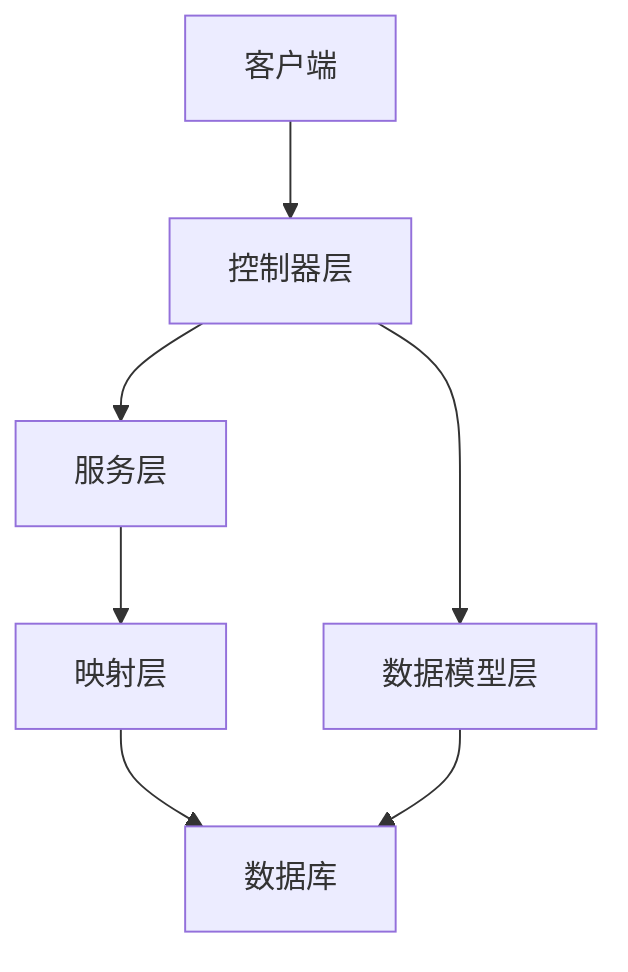
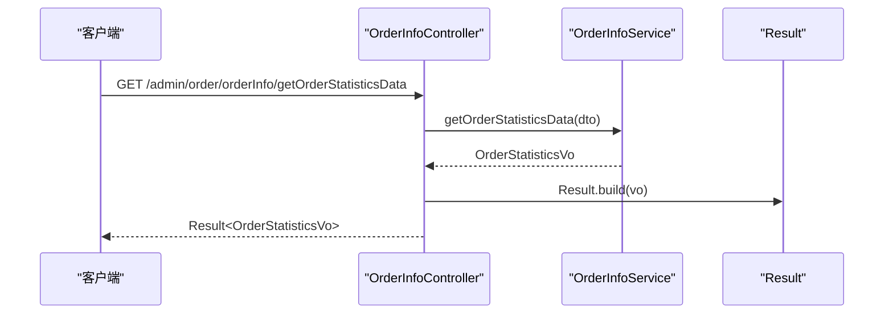
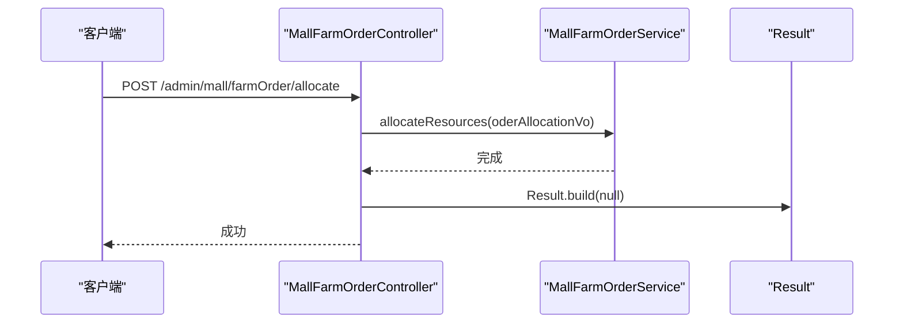
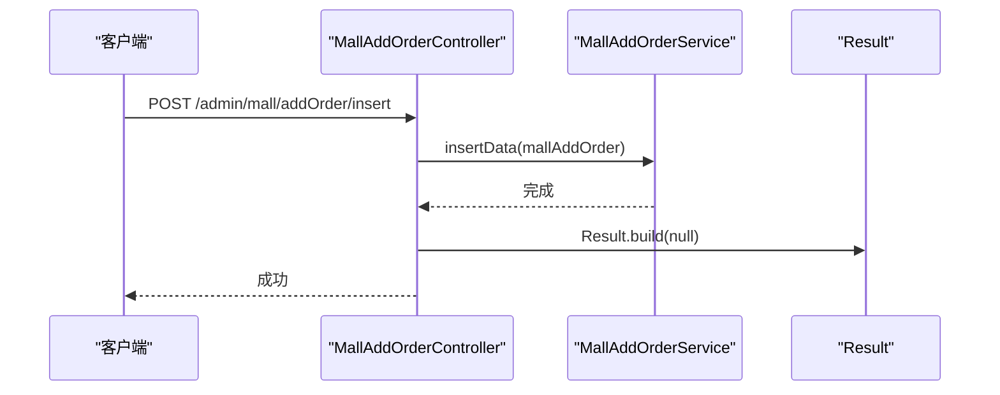
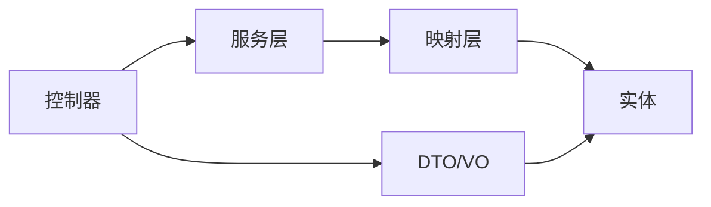
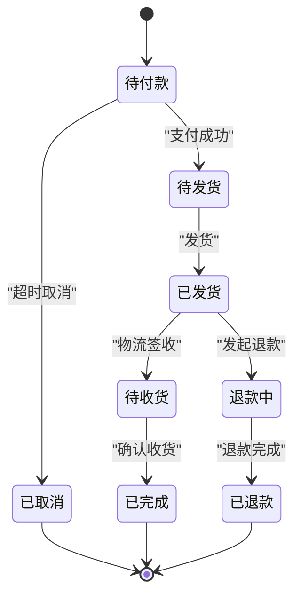
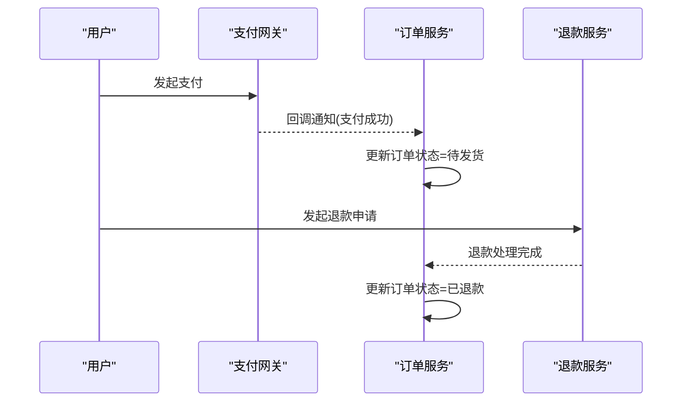

# 订单处理接口

<cite>
**本文引用的文件**
- [spzx-manager/src/main/java/com/joker/spzx/manager/controller/OrderInfoController.java](file://spzx-manager/src/main/java/com/joker/spzx/manager/controller/OrderInfoController.java)
- [spzx-manager/src/main/java/com/joker/spzx/manager/controller/PaymentInfoController.java](file://spzx-manager/src/main/java/com/joker/spzx/manager/controller/PaymentInfoController.java)
- [spzx-manager/src/main/java/com/joker/spzx/manager/controller/MallRefundRecordController.java](file://spzx-manager/src/main/java/com/joker/spzx/manager/controller/MallRefundRecordController.java)
- [spzx-manager/src/main/java/com/joker/spzx/manager/controller/OrderItemController.java](file://spzx-manager/src/main/java/com/joker/spzx/manager/controller/OrderItemController.java)
- [spzx-manager/src/main/java/com/joker/spzx/manager/controller/OrderLogController.java](file://spzx-manager/src/main/java/com/joker/spzx/manager/controller/OrderLogController.java)
- [spzx-manager/src/main/java/com/joker/spzx/manager/controller/OrderStatisticsController.java](file://spzx-manager/src/main/java/com/joker/spzx/manager/controller/OrderStatisticsController.java)
- [spzx-manager/src/main/java/com/joker/spzx/manager/controller/MallFarmOrderController.java](file://spzx-manager/src/main/java/com/joker/spzx/manager/controller/MallFarmOrderController.java)
- [spzx-manager/src/main/java/com/joker/spzx/manager/controller/MallAddOrderController.java](file://spzx-manager/src/main/java/com/joker/spzx/manager/controller/MallAddOrderController.java)
- [spzx-model/src/main/java/com/joker/spzx/model/entity/order/OrderInfo.java](file://spzx-model/src/main/java/com/joker/spzx/model/entity/order/OrderInfo.java)
- [spzx-model/src/main/java/com/joker/spzx/model/entity/order/OrderItem.java](file://spzx-model/src/main/java/com/joker/spzx/model/entity/order/OrderItem.java)
- [spzx-model/src/main/java/com/joker/spzx/model/entity/pay/PaymentInfo.java](file://spzx-model/src/main/java/com/joker/spzx/model/entity/pay/PaymentInfo.java)
- [spzx-model/src/main/java/com/joker/spzx/model/entity/oper/MallFarmOrder.java](file://spzx-model/src/main/java/com/joker/spzx/model/entity/oper/MallFarmOrder.java)
- [spzx-model/src/main/java/com/joker/spzx/model/entity/oper/MallAddOrder.java](file://spzx-model/src/main/java/com/joker/spzx/model/entity/oper/MallAddOrder.java)
- [spzx-model/src/main/java/com/joker/spzx/model/dto/order/OrderStatisticsDto.java](file://spzx-model/src/main/java/com/joker/spzx/model/dto/order/OrderStatisticsDto.java)
- [spzx-model/src/main/java/com/joker/spzx/model/vo/order/OrderStatisticsVo.java](file://spzx-model/src/main/java/com/joker/spzx/model/vo/order/OrderStatisticsVo.java)
- [spzx-model/src/main/java/com/joker/spzx/model/vo/mall/OderAllocationVo.java](file://spzx-model/src/main/java/com/joker/spzx/model/vo/mall/OderAllocationVo.java)
- [spzx-model/src/main/java/com/joker/spzx/model/dto/mall/FarmOrderPageDto.java](file://spzx-model/src/main/java/com/joker/spzx/model/dto/mall/FarmOrderPageDto.java)
- [spzx-model/src/main/java/com/joker/spzx/model/dto/mall/MallAddOrderPageVo.java](file://spzx-model/src/main/java/com/joker/spzx/model/dto/mall/MallAddOrderPageVo.java)
</cite>

## 目录
1. [简介](#简介)
2. [项目结构](#项目结构)
3. [核心组件](#核心组件)
4. [架构总览](#架构总览)
5. [详细组件分析](#详细组件分析)
6. [依赖分析](#依赖分析)
7. [性能考虑](#性能考虑)
8. [故障排查指南](#故障排查指南)
9. [结论](#结论)
10. [附录](#附录)

## 简介
本文件面向SPZX电商管理系统的订单处理接口，覆盖订单全生命周期的关键能力：订单创建、支付、发货、退款、评价、统计与报表、售后处理、物流跟踪以及异常处理机制。文档以接口定义、数据模型、状态流转、业务逻辑为主线，帮助开发者快速理解并集成相关能力。

## 项目结构
围绕订单处理的核心模块主要分布在以下位置：
- 控制器层：负责HTTP接口暴露与请求转发
- 实体与DTO/VO：描述订单、订单项、支付、农场补单、刷单补单等数据模型
- 服务与映射：订单统计、农场补单、刷单补单等业务实现入口

```mermaid
graph TB
subgraph "控制器层"
C_OrderInfo["OrderInfoController<br/>GET /admin/order/orderInfo/getOrderStatisticsData"]
C_MallFarm["MallFarmOrderController<br/>分页/保存/更新/资源分配/导入/生成晒单"]
C_MallAdd["MallAddOrderController<br/>分页/新增/修改"]
C_Payment["PaymentInfoController"]
C_Refund["MallRefundRecordController"]
C_Item["OrderItemController"]
C_Log["OrderLogController"]
C_Stats["OrderStatisticsController"]
end
subgraph "实体与DTO/VO"
E_OrderInfo["OrderInfo"]
E_OrderItem["OrderItem"]
E_Payment["PaymentInfo"]
E_Farm["MallFarmOrder"]
E_Add["MallAddOrder"]
D_OrderStatsDto["OrderStatisticsDto"]
V_OrderStatsVo["OrderStatisticsVo"]
V_OderAllocationVo["OderAllocationVo"]
D_FarmPage["FarmOrderPageDto"]
D_AddPageVo["MallAddOrderPageVo"]
end
C_OrderInfo --> D_OrderStatsDto
C_OrderInfo --> V_OrderStatsVo
C_MallFarm --> D_FarmPage
C_MallFarm --> V_OderAllocationVo
C_MallFarm --> E_Farm
C_MallAdd --> D_AddPageVo
C_MallAdd --> E_Add
C_Payment --> E_Payment
C_Item --> E_OrderItem
C_OrderInfo --> E_OrderInfo
```

图表来源
- [spzx-manager/src/main/java/com/joker/spzx/manager/controller/OrderInfoController.java:28-32](file://spzx-manager/src/main/java/com/joker/spzx/manager/controller/OrderInfoController.java#L28-L32)
- [spzx-manager/src/main/java/com/joker/spzx/manager/controller/MallFarmOrderController.java:37-71](file://spzx-manager/src/main/java/com/joker/spzx/manager/controller/MallFarmOrderController.java#L37-L71)
- [spzx-manager/src/main/java/com/joker/spzx/manager/controller/MallAddOrderController.java:30-46](file://spzx-manager/src/main/java/com/joker/spzx/manager/controller/MallAddOrderController.java#L30-L46)
- [spzx-model/src/main/java/com/joker/spzx/model/entity/order/OrderInfo.java:1-113](file://spzx-model/src/main/java/com/joker/spzx/model/entity/order/OrderInfo.java#L1-L113)
- [spzx-model/src/main/java/com/joker/spzx/model/entity/order/OrderItem.java:1-42](file://spzx-model/src/main/java/com/joker/spzx/model/entity/order/OrderItem.java#L1-L42)
- [spzx-model/src/main/java/com/joker/spzx/model/entity/pay/PaymentInfo.java:1-53](file://spzx-model/src/main/java/com/joker/spzx/model/entity/pay/PaymentInfo.java#L1-L53)
- [spzx-model/src/main/java/com/joker/spzx/model/entity/oper/MallFarmOrder.java:1-100](file://spzx-model/src/main/java/com/joker/spzx/model/entity/oper/MallFarmOrder.java#L1-L100)
- [spzx-model/src/main/java/com/joker/spzx/model/entity/oper/MallAddOrder.java:1-98](file://spzx-model/src/main/java/com/joker/spzx/model/entity/oper/MallAddOrder.java#L1-L98)
- [spzx-model/src/main/java/com/joker/spzx/model/dto/order/OrderStatisticsDto.java](file://spzx-model/src/main/java/com/joker/spzx/model/dto/order/OrderStatisticsDto.java)
- [spzx-model/src/main/java/com/joker/spzx/model/vo/order/OrderStatisticsVo.java](file://spzx-model/src/main/java/com/joker/spzx/model/vo/order/OrderStatisticsVo.java)
- [spzx-model/src/main/java/com/joker/spzx/model/vo/mall/OderAllocationVo.java](file://spzx-model/src/main/java/com/joker/spzx/model/vo/mall/OderAllocationVo.java)
- [spzx-model/src/main/java/com/joker/spzx/model/dto/mall/FarmOrderPageDto.java:1-14](file://spzx-model/src/main/java/com/joker/spzx/model/dto/mall/FarmOrderPageDto.java#L1-L14)
- [spzx-model/src/main/java/com/joker/spzx/model/dto/mall/MallAddOrderPageVo.java:1-53](file://spzx-model/src/main/java/com/joker/spzx/model/dto/mall/MallAddOrderPageVo.java#L1-L53)

章节来源
- [spzx-manager/src/main/java/com/joker/spzx/manager/controller/OrderInfoController.java:1-34](file://spzx-manager/src/main/java/com/joker/spzx/manager/controller/OrderInfoController.java#L1-L34)
- [spzx-manager/src/main/java/com/joker/spzx/manager/controller/MallFarmOrderController.java:1-147](file://spzx-manager/src/main/java/com/joker/spzx/manager/controller/MallFarmOrderController.java#L1-L147)
- [spzx-manager/src/main/java/com/joker/spzx/manager/controller/MallAddOrderController.java:1-48](file://spzx-manager/src/main/java/com/joker/spzx/manager/controller/MallAddOrderController.java#L1-L48)
- [spzx-model/src/main/java/com/joker/spzx/model/entity/order/OrderInfo.java:1-113](file://spzx-model/src/main/java/com/joker/spzx/model/entity/order/OrderInfo.java#L1-L113)
- [spzx-model/src/main/java/com/joker/spzx/model/entity/order/OrderItem.java:1-42](file://spzx-model/src/main/java/com/joker/spzx/model/entity/order/OrderItem.java#L1-L42)
- [spzx-model/src/main/java/com/joker/spzx/model/entity/pay/PaymentInfo.java:1-53](file://spzx-model/src/main/java/com/joker/spzx/model/entity/pay/PaymentInfo.java#L1-L53)
- [spzx-model/src/main/java/com/joker/spzx/model/entity/oper/MallFarmOrder.java:1-100](file://spzx-model/src/main/java/com/joker/spzx/model/entity/oper/MallFarmOrder.java#L1-L100)
- [spzx-model/src/main/java/com/joker/spzx/model/entity/oper/MallAddOrder.java:1-98](file://spzx-model/src/main/java/com/joker/spzx/model/entity/oper/MallAddOrder.java#L1-L98)

## 核心组件
- 订单统计接口：提供后台订单关键指标查询能力
- 农场补单接口：支持农场类刷单场景的订单分页、资源分配、导入、生成晒单等
- 刷单补单接口：支持刷单补单场景的数据维护与分页展示
- 支付信息接口：预留支付相关接口入口
- 订单日志与统计接口：预留日志与统计接口入口
- 订单与订单项实体：承载订单主体、明细、支付等核心数据

章节来源
- [spzx-manager/src/main/java/com/joker/spzx/manager/controller/OrderInfoController.java:28-32](file://spzx-manager/src/main/java/com/joker/spzx/manager/controller/OrderInfoController.java#L28-L32)
- [spzx-manager/src/main/java/com/joker/spzx/manager/controller/MallFarmOrderController.java:37-71](file://spzx-manager/src/main/java/com/joker/spzx/manager/controller/MallFarmOrderController.java#L37-L71)
- [spzx-manager/src/main/java/com/joker/spzx/manager/controller/MallAddOrderController.java:30-46](file://spzx-manager/src/main/java/com/joker/spzx/manager/controller/MallAddOrderController.java#L30-L46)
- [spzx-manager/src/main/java/com/joker/spzx/manager/controller/PaymentInfoController.java:1-19](file://spzx-manager/src/main/java/com/joker/spzx/manager/controller/PaymentInfoController.java#L1-L19)
- [spzx-manager/src/main/java/com/joker/spzx/manager/controller/OrderLogController.java:1-19](file://spzx-manager/src/main/java/com/joker/spzx/manager/controller/OrderLogController.java#L1-L19)
- [spzx-manager/src/main/java/com/joker/spzx/manager/controller/OrderStatisticsController.java:1-19](file://spzx-manager/src/main/java/com/joker/spzx/manager/controller/OrderStatisticsController.java#L1-L19)

## 架构总览
订单处理接口采用典型的分层架构：
- 控制器层：接收HTTP请求，进行参数校验与结果封装
- 服务层：承接业务逻辑（当前仓库中部分控制器直接调用服务，部分控制器暂未注入服务）
- 数据访问层：MyBatis Plus映射数据库表
- 数据模型层：实体、DTO、VO清晰分离职责

## 详细组件分析

### 订单统计接口
- 接口路径：GET /admin/order/orderInfo/getOrderStatisticsData
- 请求参数：OrderStatisticsDto（由控制器方法参数传入）
- 返回值：Result<OrderStatisticsVo>
- 作用：返回订单统计指标，如订单量、金额等

图表来源
- [spzx-manager/src/main/java/com/joker/spzx/manager/controller/OrderInfoController.java:28-32](file://spzx-manager/src/main/java/com/joker/spzx/manager/controller/OrderInfoController.java#L28-L32)
- [spzx-model/src/main/java/com/joker/spzx/model/dto/order/OrderStatisticsDto.java](file://spzx-model/src/main/java/com/joker/spzx/model/dto/order/OrderStatisticsDto.java)
- [spzx-model/src/main/java/com/joker/spzx/model/vo/order/OrderStatisticsVo.java](file://spzx-model/src/main/java/com/joker/spzx/model/vo/order/OrderStatisticsVo.java)

章节来源
- [spzx-manager/src/main/java/com/joker/spzx/manager/controller/OrderInfoController.java:28-32](file://spzx-manager/src/main/java/com/joker/spzx/manager/controller/OrderInfoController.java#L28-L32)

### 农场补单接口
- 分页查询：GET /admin/mall/farmOrder findByPage
  - 请求参数：FarmOrderPageDto（pageNum、pageSize、productId、status）
  - 返回值：Result<IPage<MallFarmOrder>>
- 新增：POST /admin/mall/farmOrder/save
  - 请求体：MallFarmOrder
  - 返回值：Result<MallFarmOrder>
- 更新：PUT /admin/mall/farmOrder/update
  - 请求体：MallFarmOrder
  - 返回值：Result<MallFarmOrder>
- 资源分配：POST /admin/mall/farmOrder/allocate
  - 请求体：OderAllocationVo
  - 返回值：Result<MallFarmOrder>
- 生成晒单：POST /admin/mall/farmOrder/gennerShouBuy
  - 请求体：List<Long>（orderIdList）
  - 返回值：void（输出流）
- 导入订单：POST /admin/mall/farmOrder/importOrder
  - 请求体：multipart/form-data（file + 其他参数）
  - 返回值：Result<String>
- 临时导入：POST /admin/mall/farmOrder/importTemp
  - 返回值：Result<String>

图表来源
- [spzx-manager/src/main/java/com/joker/spzx/manager/controller/MallFarmOrderController.java:56-60](file://spzx-manager/src/main/java/com/joker/spzx/manager/controller/MallFarmOrderController.java#L56-L60)
- [spzx-model/src/main/java/com/joker/spzx/model/vo/mall/OderAllocationVo.java](file://spzx-model/src/main/java/com/joker/spzx/model/vo/mall/OderAllocationVo.java)

章节来源
- [spzx-manager/src/main/java/com/joker/spzx/manager/controller/MallFarmOrderController.java:37-71](file://spzx-manager/src/main/java/com/joker/spzx/manager/controller/MallFarmOrderController.java#L37-L71)
- [spzx-model/src/main/java/com/joker/spzx/model/dto/mall/FarmOrderPageDto.java:1-14](file://spzx-model/src/main/java/com/joker/spzx/model/dto/mall/FarmOrderPageDto.java#L1-L14)

### 刷单补单接口
- 分页查询：GET /admin/mall/addOrder findByPage
  - 请求参数：MallAddOrderPageDto
  - 返回值：Result<IPage<MallAddOrderPageVo>>
- 新增：POST /admin/mall/addOrder insert
  - 请求体：MallAddOrder
  - 返回值：Result<String>
- 修改：POST /admin/mall/addOrder update
  - 请求体：MallAddOrder
  - 返回值：Result<String>

图表来源
- [spzx-manager/src/main/java/com/joker/spzx/manager/controller/MallAddOrderController.java:36-40](file://spzx-manager/src/main/java/com/joker/spzx/manager/controller/MallAddOrderController.java#L36-L40)
- [spzx-model/src/main/java/com/joker/spzx/model/dto/mall/MallAddOrderPageVo.java:1-53](file://spzx-model/src/main/java/com/joker/spzx/model/dto/mall/MallAddOrderPageVo.java#L1-L53)

章节来源
- [spzx-manager/src/main/java/com/joker/spzx/manager/controller/MallAddOrderController.java:30-46](file://spzx-manager/src/main/java/com/joker/spzx/manager/controller/MallAddOrderController.java#L30-L46)

### 支付信息接口
- 当前控制器为空，预留后续接入支付回调、查询等能力

章节来源
- [spzx-manager/src/main/java/com/joker/spzx/manager/controller/PaymentInfoController.java:1-19](file://spzx-manager/src/main/java/com/joker/spzx/manager/controller/PaymentInfoController.java#L1-L19)

### 订单日志与统计接口
- 当前控制器为空，预留后续接入订单操作日志与统计分析

章节来源
- [spzx-manager/src/main/java/com/joker/spzx/manager/controller/OrderLogController.java:1-19](file://spzx-manager/src/main/java/com/joker/spzx/manager/controller/OrderLogController.java#L1-L19)
- [spzx-manager/src/main/java/com/joker/spzx/manager/controller/OrderStatisticsController.java:1-19](file://spzx-manager/src/main/java/com/joker/spzx/manager/controller/OrderStatisticsController.java#L1-L19)

## 依赖分析
- 控制器与服务层：农场补单与刷单补单控制器已注入对应服务，订单统计控制器注入了订单统计服务
- 数据模型：订单、订单项、支付、农场补单、刷单补单等实体定义清晰，字段覆盖订单全生命周期关键信息
- DTO/VO：统计、农场补单分页、刷单补单展示等DTO/VO明确参数与返回结构

## 性能考虑
- 分页查询：农场补单与刷单补单均提供分页接口，建议在大数据量场景下使用分页参数控制单页规模
- 批量操作：农场补单支持批量生成晒单与临时导入，注意批量大小与事务边界，避免长时间占用数据库连接
- 缓存策略：统计接口可结合缓存提升热点查询性能（需在服务层实现）

## 故障排查指南
- 参数校验失败：检查请求参数类型与必填项，确保DTO字段与接口签名一致
- 服务未注入：农场补单与刷单补单控制器已注入服务，若出现空指针，请确认Spring上下文加载顺序与注解配置
- 文件上传异常：导入订单接口使用multipart/form-data，确保前端正确设置Content-Type与表单字段名
- 统计接口异常：确认OrderStatisticsDto参数与OrderInfoService实现匹配

章节来源
- [spzx-manager/src/main/java/com/joker/spzx/manager/controller/MallFarmOrderController.java:67-71](file://spzx-manager/src/main/java/com/joker/spzx/manager/controller/MallFarmOrderController.java#L67-L71)
- [spzx-manager/src/main/java/com/joker/spzx/manager/controller/MallAddOrderController.java:36-46](file://spzx-manager/src/main/java/com/joker/spzx/manager/controller/MallAddOrderController.java#L36-L46)

## 结论
本仓库提供了订单统计、农场补单、刷单补单等核心接口与完整数据模型，能够支撑电商订单全生命周期管理的基础需求。后续可在支付回调、物流跟踪、售后退款等方面扩展接口与服务实现，以完善订单处理闭环。

## 附录

### 订单数据模型

```mermaid
erDiagram
ORDER_INFO {
bigint id PK
bigint user_id
varchar nick_name
varchar order_no
bigint coupon_id
decimal total_amount
decimal coupon_amount
decimal original_total_amount
decimal feight_fee
tinyint pay_type
tinyint order_status
varchar receiver_name
varchar receiver_phone
varchar receiver_tag_name
bigint receiver_province
bigint receiver_city
bigint receiver_district
varchar receiver_address
datetime payment_time
datetime delivery_time
datetime receive_time
varchar remark
datetime cancel_time
varchar cancel_reason
}
ORDER_ITEM {
bigint id PK
bigint order_id
bigint sku_id
varchar sku_name
varchar thumb_img
decimal sku_price
int sku_num
}
PAYMENT_INFO {
bigint id PK
bigint user_id
varchar order_no
tinyint pay_type
varchar out_trade_no
decimal amount
varchar content
varchar payment_status
datetime callback_time
varchar callback_content
}
subgraph "运营补单"
MALL_FARM_ORDER {
bigint id PK
varchar tb_order_code
bigint product_id
varchar sku_name
bigint shoot_person_id
double seed_money
double hire_money
int order_type
int status
bigint create_by
datetime create_time
bigint update_by
datetime update_time
varchar remark
int seed_is_pay
int hire_is_pay
varchar comment
int comment_status
}
MALL_ADD_ORDER {
bigint id PK
bigint brush_person_id
varchar product_id
varchar tb_order_id
datetime order_time
int order_state
double seed_money
double hire_money
double way_bill_money
varchar way_bill_code
varchar way_bill_name
bigint create_by
datetime create_time
bigint update_by
datetime update_time
varchar remark
}
end
ORDER_INFO ||--o{ ORDER_ITEM : "包含"
```

图表来源
- [spzx-model/src/main/java/com/joker/spzx/model/entity/order/OrderInfo.java:1-113](file://spzx-model/src/main/java/com/joker/spzx/model/entity/order/OrderInfo.java#L1-L113)
- [spzx-model/src/main/java/com/joker/spzx/model/entity/order/OrderItem.java:1-42](file://spzx-model/src/main/java/com/joker/spzx/model/entity/order/OrderItem.java#L1-L42)
- [spzx-model/src/main/java/com/joker/spzx/model/entity/pay/PaymentInfo.java:1-53](file://spzx-model/src/main/java/com/joker/spzx/model/entity/pay/PaymentInfo.java#L1-L53)
- [spzx-model/src/main/java/com/joker/spzx/model/entity/oper/MallFarmOrder.java:1-100](file://spzx-model/src/main/java/com/joker/spzx/model/entity/oper/MallFarmOrder.java#L1-L100)
- [spzx-model/src/main/java/com/joker/spzx/model/entity/oper/MallAddOrder.java:1-98](file://spzx-model/src/main/java/com/joker/spzx/model/entity/oper/MallAddOrder.java#L1-L98)

### 订单状态流转（概念示意）

### 支付回调与退款流程（概念示意）
