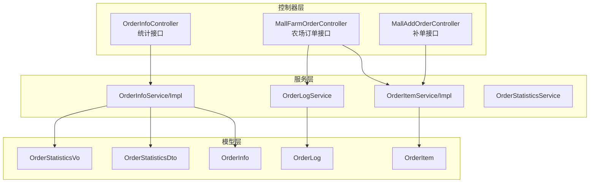
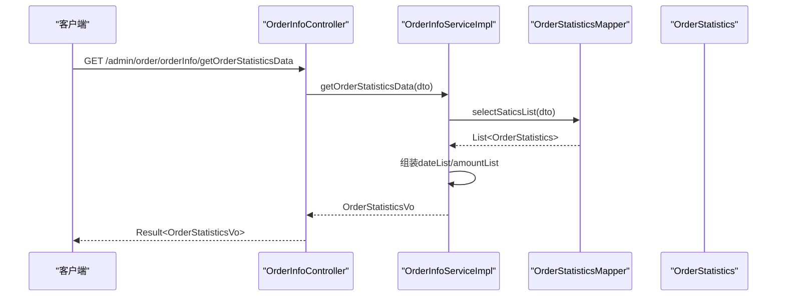
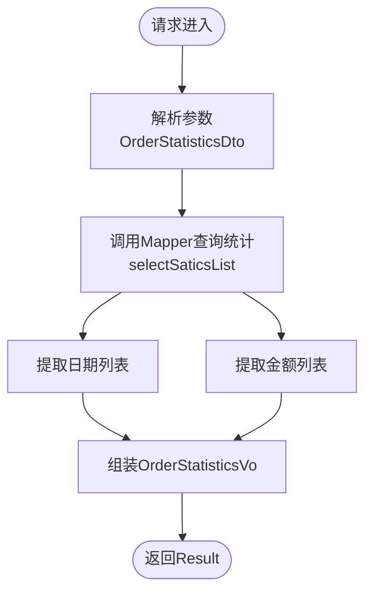
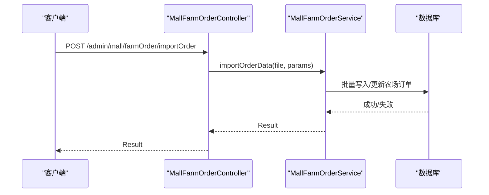
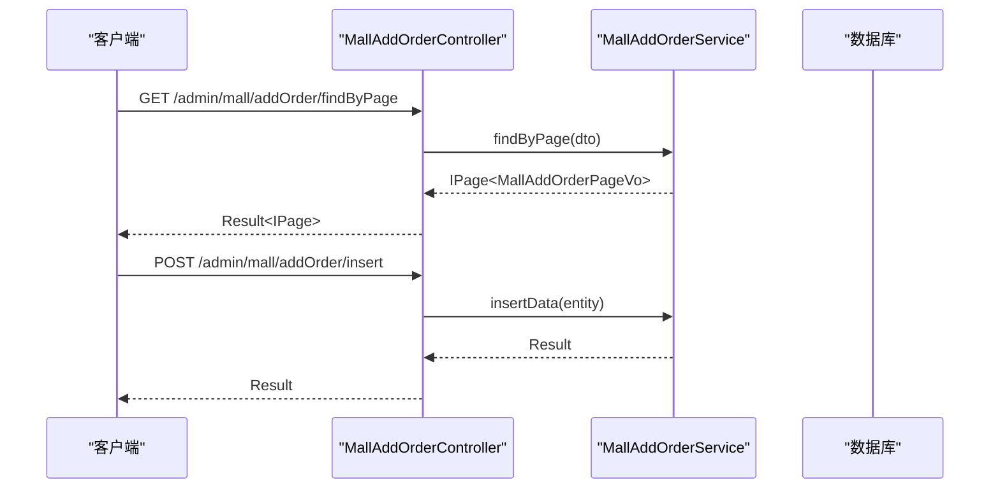
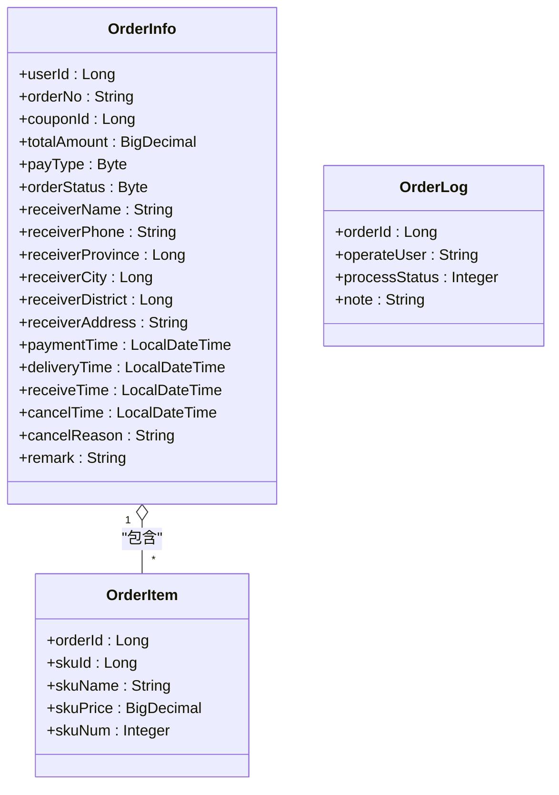
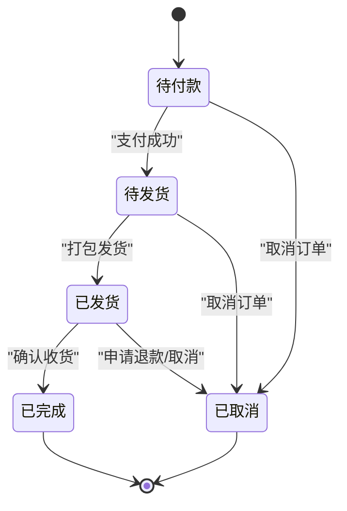
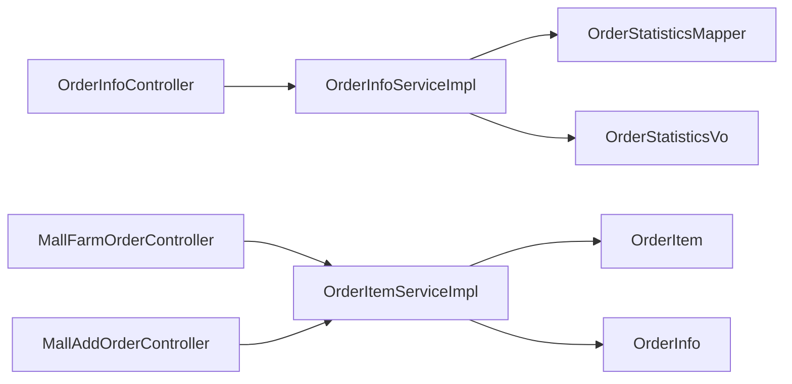

# 订单管理接口

<cite>
**本文引用的文件**
- [OrderInfoController.java](file://spzx-manager/src/main/java/com/joker/spzx/manager/controller/OrderInfoController.java)
- [MallAddOrderController.java](file://spzx-manager/src/main/java/com/joker/spzx/manager/controller/MallAddOrderController.java)
- [MallFarmOrderController.java](file://spzx-manager/src/main/java/com/joker/spzx/manager/controller/MallFarmOrderController.java)
- [OrderInfoService.java](file://spzx-manager/src/main/java/com/joker/spzx/manager/service/OrderInfoService.java)
- [OrderInfoServiceImpl.java](file://spzx-manager/src/main/java/com/joker/spzx/manager/service/impl/OrderInfoServiceImpl.java)
- [OrderItemService.java](file://spzx-manager/src/main/java/com/joker/spzx/manager/service/OrderItemService.java)
- [OrderItemServiceImpl.java](file://spzx-manager/src/main/java/com/joker/spzx/manager/service/impl/OrderItemServiceImpl.java)
- [OrderLogService.java](file://spzx-manager/src/main/java/com/joker/spzx/manager/service/OrderLogService.java)
- [OrderStatisticsService.java](file://spzx-manager/src/main/java/com/joker/spzx/manager/service/OrderStatisticsService.java)
- [OrderInfo.java](file://spzx-model/src/main/java/com/joker/spzx/model/entity/order/OrderInfo.java)
- [OrderItem.java](file://spzx-model/src/main/java/com/joker/spzx/model/entity/order/OrderItem.java)
- [OrderLog.java](file://spzx-model/src/main/java/com/joker/spzx/model/entity/order/OrderLog.java)
- [OrderStatisticsDto.java](file://spzx-model/src/main/java/com/joker/spzx/model/dto/order/OrderStatisticsDto.java)
- [OrderStatisticsVo.java](file://spzx-model/src/main/java/com/joker/spzx/model/vo/order/OrderStatisticsVo.java)
</cite>

## 目录
1. [简介](#简介)
2. [项目结构](#项目结构)
3. [核心组件](#核心组件)
4. [架构总览](#架构总览)
5. [详细组件分析](#详细组件分析)
6. [依赖关系分析](#依赖关系分析)
7. [性能考虑](#性能考虑)
8. [故障排查指南](#故障排查指南)
9. [结论](#结论)
10. [附录](#附录)

## 简介
本文件面向SPZX电商管理系统中的“订单管理接口”，聚焦于订单基本信息管理相关API，包括订单统计分析、订单分页查询与搜索过滤、订单状态更新与流转控制、订单日志记录等能力。同时对订单数据模型、状态枚举值、业务规则约束进行说明，并给出统计分析、导出与批量操作的扩展建议与流程图示。

## 项目结构
围绕订单管理的关键模块分布如下：
- 控制器层（Controller）：负责HTTP接口暴露，如订单统计、农场订单、补单等。
- 服务层（Service/Impl）：封装业务逻辑，如订单统计计算、订单项与日志的CRUD。
- 模型层（Entity/DTO/VO）：定义订单、订单项、订单日志及统计查询参数与返回结构。

图表来源
- [OrderInfoController.java:21-34](file://spzx-manager/src/main/java/com/joker/spzx/manager/controller/OrderInfoController.java#L21-L34)
- [MallFarmOrderController.java:30-147](file://spzx-manager/src/main/java/com/joker/spzx/manager/controller/MallFarmOrderController.java#L30-L147)
- [MallAddOrderController.java:21-48](file://spzx-manager/src/main/java/com/joker/spzx/manager/controller/MallAddOrderController.java#L21-L48)
- [OrderInfoService.java:16-19](file://spzx-manager/src/main/java/com/joker/spzx/manager/service/OrderInfoService.java#L16-L19)
- [OrderInfoServiceImpl.java:27-55](file://spzx-manager/src/main/java/com/joker/spzx/manager/service/impl/OrderInfoServiceImpl.java#L27-L55)
- [OrderItemService.java:14-16](file://spzx-manager/src/main/java/com/joker/spzx/manager/service/OrderItemService.java#L14-L16)
- [OrderLogService.java:14-16](file://spzx-manager/src/main/java/com/joker/spzx/manager/service/OrderLogService.java#L14-L16)
- [OrderInfo.java:13-113](file://spzx-model/src/main/java/com/joker/spzx/model/entity/order/OrderInfo.java#L13-L113)
- [OrderItem.java:11-42](file://spzx-model/src/main/java/com/joker/spzx/model/entity/order/OrderItem.java#L11-L42)
- [OrderLog.java:9-32](file://spzx-model/src/main/java/com/joker/spzx/model/entity/order/OrderLog.java#L9-L32)
- [OrderStatisticsDto.java:6-17](file://spzx-model/src/main/java/com/joker/spzx/model/dto/order/OrderStatisticsDto.java#L6-L17)
- [OrderStatisticsVo.java:9-19](file://spzx-model/src/main/java/com/joker/spzx/model/vo/order/OrderStatisticsVo.java#L9-L19)

章节来源
- [OrderInfoController.java:21-34](file://spzx-manager/src/main/java/com/joker/spzx/manager/controller/OrderInfoController.java#L21-L34)
- [MallFarmOrderController.java:30-147](file://spzx-manager/src/main/java/com/joker/spzx/manager/controller/MallFarmOrderController.java#L30-L147)
- [MallAddOrderController.java:21-48](file://spzx-manager/src/main/java/com/joker/spzx/manager/controller/MallAddOrderController.java#L21-L48)

## 核心组件
- 订单统计接口：提供按日期维度的订单金额统计，支持起止时间筛选。
- 农场订单接口：提供农场订单的分页查询、保存/更新、资源分配、导入、导出等能力。
- 补单接口：提供补单的分页查询、新增与更新。
- 订单模型：包含订单基础信息、收货信息、支付与状态时间戳、状态字段等。
- 订单项模型：描述订单中每个商品SKU的明细。
- 订单日志模型：记录订单状态变更与操作人信息。

章节来源
- [OrderInfoController.java:21-34](file://spzx-manager/src/main/java/com/joker/spzx/manager/controller/OrderInfoController.java#L21-L34)
- [MallFarmOrderController.java:30-147](file://spzx-manager/src/main/java/com/joker/spzx/manager/controller/MallFarmOrderController.java#L30-L147)
- [MallAddOrderController.java:21-48](file://spzx-manager/src/main/java/com/joker/spzx/manager/controller/MallAddOrderController.java#L21-L48)
- [OrderInfo.java:13-113](file://spzx-model/src/main/java/com/joker/spzx/model/entity/order/OrderInfo.java#L13-L113)
- [OrderItem.java:11-42](file://spzx-model/src/main/java/com/joker/spzx/model/entity/order/OrderItem.java#L11-L42)
- [OrderLog.java:9-32](file://spzx-model/src/main/java/com/joker/spzx/model/entity/order/OrderLog.java#L9-L32)

## 架构总览
下图展示从控制器到服务与模型的数据流与职责边界：

图表来源
- [OrderInfoController.java:28-32](file://spzx-manager/src/main/java/com/joker/spzx/manager/controller/OrderInfoController.java#L28-L32)
- [OrderInfoServiceImpl.java:33-53](file://spzx-manager/src/main/java/com/joker/spzx/manager/service/impl/OrderInfoServiceImpl.java#L33-L53)

## 详细组件分析

### 订单统计接口
- 接口名称：获取订单统计数据
- 请求路径：GET /admin/order/orderInfo/getOrderStatisticsData
- 功能说明：根据起止时间查询订单统计，返回日期序列与对应总金额序列。
- 输入参数：OrderStatisticsDto（开始时间、结束时间）
- 输出结果：Result<OrderStatisticsVo>（日期列表、金额列表）

图表来源
- [OrderInfoController.java:28-32](file://spzx-manager/src/main/java/com/joker/spzx/manager/controller/OrderInfoController.java#L28-L32)
- [OrderInfoServiceImpl.java:33-53](file://spzx-manager/src/main/java/com/joker/spzx/manager/service/impl/OrderInfoServiceImpl.java#L33-L53)
- [OrderStatisticsDto.java:8-17](file://spzx-model/src/main/java/com/joker/spzx/model/dto/order/OrderStatisticsDto.java#L8-L17)
- [OrderStatisticsVo.java:11-19](file://spzx-model/src/main/java/com/joker/spzx/model/vo/order/OrderStatisticsVo.java#L11-L19)

章节来源
- [OrderInfoController.java:28-32](file://spzx-manager/src/main/java/com/joker/spzx/manager/controller/OrderInfoController.java#L28-L32)
- [OrderInfoServiceImpl.java:33-53](file://spzx-manager/src/main/java/com/joker/spzx/manager/service/impl/OrderInfoServiceImpl.java#L33-L53)
- [OrderStatisticsDto.java:8-17](file://spzx-model/src/main/java/com/joker/spzx/model/dto/order/OrderStatisticsDto.java#L8-L17)
- [OrderStatisticsVo.java:11-19](file://spzx-model/src/main/java/com/joker/spzx/model/vo/order/OrderStatisticsVo.java#L11-L19)

### 农场订单接口
- 分页查询：GET /admin/mall/farmOrder/findByPage
- 保存/更新：POST /admin/mall/farmOrder/save 与 PUT /admin/mall/farmOrder/update
- 资源分配：POST /admin/mall/farmOrder/allocate
- 导出清单：POST /admin/mall/farmOrder/gennerShouBuy（接收订单ID列表，输出文件）
- 导入订单：POST /admin/mall/farmOrder/importOrder（文件上传）
- 临时导入：POST /admin/mall/farmOrder/importTemp（演示数据填充）

图表来源
- [MallFarmOrderController.java:67-71](file://spzx-manager/src/main/java/com/joker/spzx/manager/controller/MallFarmOrderController.java#L67-L71)

章节来源
- [MallFarmOrderController.java:37-71](file://spzx-manager/src/main/java/com/joker/spzx/manager/controller/MallFarmOrderController.java#L37-L71)

### 补单接口
- 分页查询：GET /admin/mall/addOrder/findByPage
- 新增：POST /admin/mall/addOrder/insert
- 更新：POST /admin/mall/addOrder/update

图表来源
- [MallAddOrderController.java:30-46](file://spzx-manager/src/main/java/com/joker/spzx/manager/controller/MallAddOrderController.java#L30-L46)

章节来源
- [MallAddOrderController.java:30-46](file://spzx-manager/src/main/java/com/joker/spzx/manager/controller/MallAddOrderController.java#L30-L46)

### 订单数据模型与状态规则
- 订单实体（OrderInfo）关键字段
  - 订单号、会员ID、昵称
  - 优惠券ID、优惠金额、原价、运费、应付总额
  - 支付方式、订单状态、收货人信息、时间戳（支付/发货/收货/取消）
  - 备注、取消原因
  - 订单项列表（聚合）
- 订单状态（order_status）
  - 0：待付款
  - 1：待发货
  - 2：已发货
  - 3：已完成（待用户收货后完成）
  - -1：已取消
- 订单项（OrderItem）关键字段
  - 关联订单ID、SKU ID/名称/图片、单价、数量
- 订单日志（OrderLog）关键字段
  - 订单ID、操作人、处理状态、备注

图表来源
- [OrderInfo.java:13-113](file://spzx-model/src/main/java/com/joker/spzx/model/entity/order/OrderInfo.java#L13-L113)
- [OrderItem.java:11-42](file://spzx-model/src/main/java/com/joker/spzx/model/entity/order/OrderItem.java#L11-L42)
- [OrderLog.java:9-32](file://spzx-model/src/main/java/com/joker/spzx/model/entity/order/OrderLog.java#L9-L32)

章节来源
- [OrderInfo.java:54-56](file://spzx-model/src/main/java/com/joker/spzx/model/entity/order/OrderInfo.java#L54-L56)
- [OrderItem.java:18-40](file://spzx-model/src/main/java/com/joker/spzx/model/entity/order/OrderItem.java#L18-L40)
- [OrderLog.java:16-30](file://spzx-model/src/main/java/com/joker/spzx/model/entity/order/OrderLog.java#L16-L30)

### 订单状态流转控制
- 典型流转路径：待付款 → 待发货 → 已发货 → 完成；或在任意阶段可转为“已取消”
- 状态变更应伴随日志记录（OrderLog），并更新相应时间戳（支付/发货/收货/取消）

（本图为概念性状态机示意，不直接映射具体代码文件）

## 依赖关系分析
- 控制器依赖服务接口；服务实现依赖Mapper与实体模型。
- 订单统计接口通过OrderStatisticsMapper查询统计数据，再组装为VO返回。
- 农场订单与补单接口分别对应不同的实体与业务场景，但均遵循统一的Result封装。

图表来源
- [OrderInfoController.java:21-34](file://spzx-manager/src/main/java/com/joker/spzx/manager/controller/OrderInfoController.java#L21-L34)
- [OrderInfoServiceImpl.java:27-55](file://spzx-manager/src/main/java/com/joker/spzx/manager/service/impl/OrderInfoServiceImpl.java#L27-L55)
- [MallFarmOrderController.java:30-147](file://spzx-manager/src/main/java/com/joker/spzx/manager/controller/MallFarmOrderController.java#L30-L147)
- [MallAddOrderController.java:21-48](file://spzx-manager/src/main/java/com/joker/spzx/manager/controller/MallAddOrderController.java#L21-L48)
- [OrderItemServiceImpl.java:17-21](file://spzx-manager/src/main/java/com/joker/spzx/manager/service/impl/OrderItemServiceImpl.java#L17-L21)

章节来源
- [OrderInfoServiceImpl.java:30-37](file://spzx-manager/src/main/java/com/joker/spzx/manager/service/impl/OrderInfoServiceImpl.java#L30-L37)
- [OrderItemServiceImpl.java:17-21](file://spzx-manager/src/main/java/com/joker/spzx/manager/service/impl/OrderItemServiceImpl.java#L17-L21)

## 性能考虑
- 统计接口建议在数据库侧进行聚合，避免在Java侧做大规模内存计算。
- 分页查询需确保索引覆盖（如订单创建时间、订单号、用户ID等）。
- 导入/导出大文件时采用流式处理与分批提交，避免内存峰值过高。
- 日志记录建议异步化，降低主流程阻塞风险。

## 故障排查指南
- 统计接口无数据
  - 检查时间范围是否正确传入
  - 核对数据库中是否存在对应时间段的订单
- 导入失败
  - 检查文件格式与字段映射
  - 查看服务端异常日志与事务回滚情况
- 状态更新异常
  - 确认当前状态允许的流转方向
  - 核对OrderLog是否正确记录

## 结论
本文档梳理了SPZX订单管理的核心接口与数据模型，明确了统计、农场订单、补单等模块的职责边界与交互流程。基于现有实现，建议后续补充订单分页查询与搜索过滤、订单状态更新与异常恢复、订单导出与批量操作等能力，并完善状态机与日志审计机制。

## 附录

### 订单状态枚举值定义
- 0：待付款
- 1：待发货
- 2：已发货
- 3：已完成
- -1：已取消

章节来源
- [OrderInfo.java:54-56](file://spzx-model/src/main/java/com/joker/spzx/model/entity/order/OrderInfo.java#L54-L56)

### 订单统计接口参数与返回
- 参数：OrderStatisticsDto（开始时间、结束时间）
- 返回：OrderStatisticsVo（日期列表、金额列表）

章节来源
- [OrderStatisticsDto.java:8-17](file://spzx-model/src/main/java/com/joker/spzx/model/dto/order/OrderStatisticsDto.java#L8-L17)
- [OrderStatisticsVo.java:11-19](file://spzx-model/src/main/java/com/joker/spzx/model/vo/order/OrderStatisticsVo.java#L11-L19)