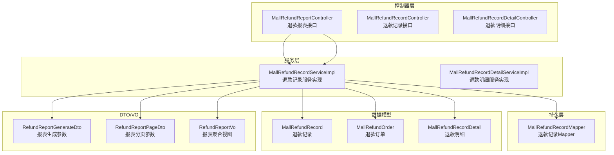
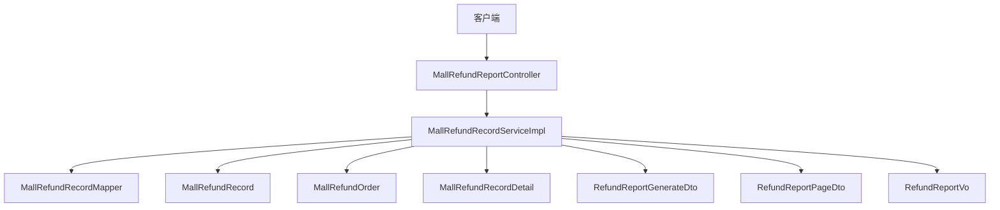
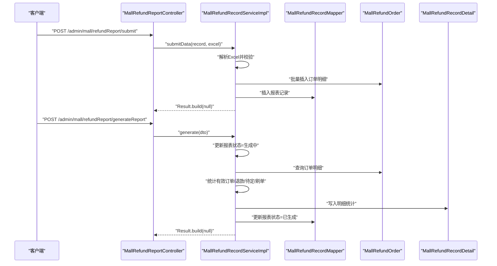
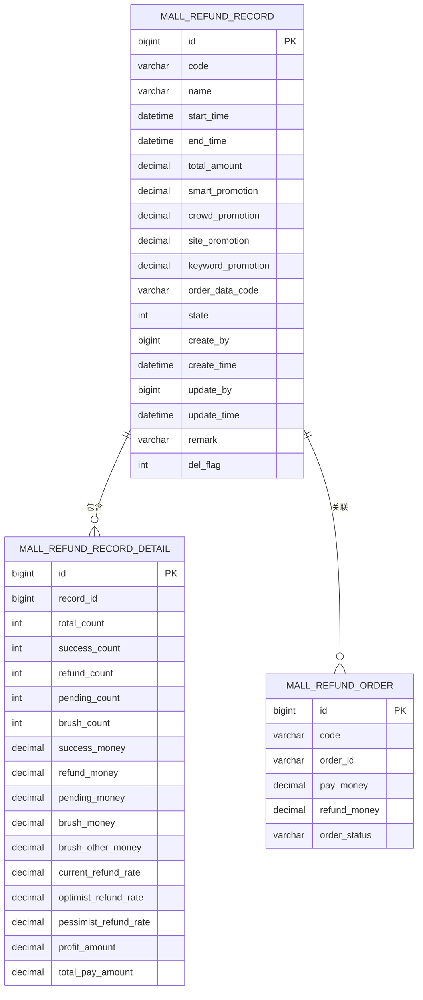
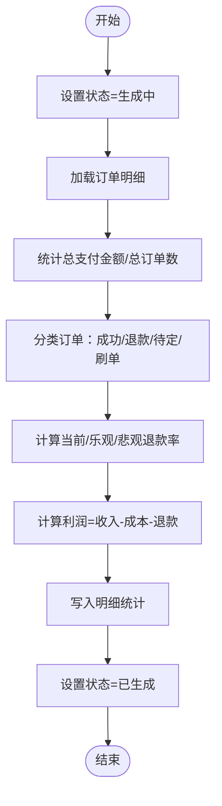
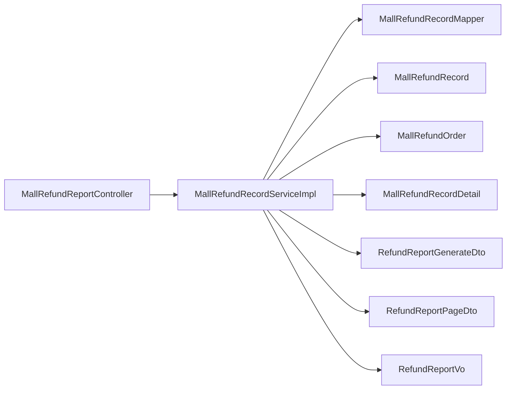

# 退款管理接口

<cite>
**本文引用的文件**
- [MallRefundReportController.java](file://spzx-manager/src/main/java/com/joker/spzx/manager/controller/MallRefundReportController.java)
- [MallRefundRecordController.java](file://spzx-manager/src/main/java/com/joker/spzx/manager/controller/MallRefundRecordController.java)
- [MallRefundRecordDetailController.java](file://spzx-manager/src/main/java/com/joker/spzx/manager/controller/MallRefundRecordDetailController.java)
- [MallRefundRecordServiceImpl.java](file://spzx-manager/src/main/java/com/joker/spzx/manager/service/impl/MallRefundRecordServiceImpl.java)
- [MallRefundRecordDetailServiceImpl.java](file://spzx-manager/src/main/java/com/joker/spzx/manager/service/impl/MallRefundRecordDetailServiceImpl.java)
- [MallRefundRecordMapper.java](file://spzx-manager/src/main/java/com/joker/spzx/manager/mapper/MallRefundRecordMapper.java)
- [MallRefundRecord.java](file://spzx-model/src/main/java/com/joker/spzx/model/entity/oper/MallRefundRecord.java)
- [MallRefundOrder.java](file://spzx-model/src/main/java/com/joker/spzx/model/entity/oper/MallRefundOrder.java)
- [MallRefundRecordDetail.java](file://spzx-model/src/main/java/com/joker/spzx/model/entity/oper/MallRefundRecordDetail.java)
- [RefundReportGenerateDto.java](file://spzx-model/src/main/java/com/joker/spzx/model/dto/mall/RefundReportGenerateDto.java)
- [RefundReportPageDto.java](file://spzx-model/src/main/java/com/joker/spzx/model/dto/mall/RefundReportPageDto.java)
- [RefundReportVo.java](file://spzx-model/src/main/java/com/joker/spzx/model/vo/mall/RefundReportVo.java)
</cite>

## 目录
1. [简介](#简介)
2. [项目结构](#项目结构)
3. [核心组件](#核心组件)
4. [架构概览](#架构概览)
5. [详细组件分析](#详细组件分析)
6. [依赖分析](#依赖分析)
7. [性能考虑](#性能考虑)
8. [故障排查指南](#故障排查指南)
9. [结论](#结论)
10. [附录](#附录)

## 简介
本文件为 SPZX 电商管理系统的“退款管理接口”技术文档，聚焦于退款相关的信息管理与报表能力。系统围绕“退款分析报表”展开，提供以下能力：
- 退款数据导入与提交
- 报表分页查询与详情聚合
- 订单明细查询与更新
- 报表生成与统计计算
- 报表删除与状态管理

同时，文档对退款数据模型、报表统计口径、状态流转与异常处理进行说明，并给出流程图与时序图帮助理解。

## 项目结构
与退款管理直接相关的模块与文件如下：
- 控制器层：退款报表控制器、退款记录控制器、退款明细控制器
- 服务层：退款记录服务实现、退款明细服务实现
- 持久层：退款记录 Mapper
- 数据模型：退款记录、退款订单、退款明细
- DTO/VO：报表生成参数、报表分页查询参数、报表聚合视图

图表来源
- [MallRefundReportController.java:30-86](file://spzx-manager/src/main/java/com/joker/spzx/manager/controller/MallRefundReportController.java#L30-L86)
- [MallRefundRecordServiceImpl.java:54-324](file://spzx-manager/src/main/java/com/joker/spzx/manager/service/impl/MallRefundRecordServiceImpl.java#L54-L324)
- [MallRefundRecordMapper.java:15-18](file://spzx-manager/src/main/java/com/joker/spzx/manager/mapper/MallRefundRecordMapper.java#L15-L18)
- [MallRefundRecord.java:24-108](file://spzx-model/src/main/java/com/joker/spzx/model/entity/oper/MallRefundRecord.java#L24-L108)
- [MallRefundOrder.java:23-59](file://spzx-model/src/main/java/com/joker/spzx/model/entity/oper/MallRefundOrder.java#L23-L59)
- [MallRefundRecordDetail.java:22-97](file://spzx-model/src/main/java/com/joker/spzx/model/entity/oper/MallRefundRecordDetail.java#L22-L97)
- [RefundReportGenerateDto.java:7-13](file://spzx-model/src/main/java/com/joker/spzx/model/dto/mall/RefundReportGenerateDto.java#L7-L13)
- [RefundReportPageDto.java:10-17](file://spzx-model/src/main/java/com/joker/spzx/model/dto/mall/RefundReportPageDto.java#L10-L17)
- [RefundReportVo.java:11-21](file://spzx-model/src/main/java/com/joker/spzx/model/vo/mall/RefundReportVo.java#L11-L21)

章节来源
- [MallRefundReportController.java:30-86](file://spzx-manager/src/main/java/com/joker/spzx/manager/controller/MallRefundReportController.java#L30-L86)
- [MallRefundRecordServiceImpl.java:54-324](file://spzx-manager/src/main/java/com/joker/spzx/manager/service/impl/MallRefundRecordServiceImpl.java#L54-L324)

## 核心组件
- 控制器
  - 退款报表控制器：提供报表提交、分页查询、详情聚合、订单明细查询与更新、报表删除、报表生成等接口。
  - 退款记录与明细控制器：预留接口路径，当前为空实现，后续可扩展具体业务。
- 服务实现
  - 退款记录服务：负责导入 Excel、生成报表、统计计算、分页查询、详情聚合、删除报表等。
  - 退款明细服务：提供明细数据的 CRUD 能力。
- 数据模型
  - 退款记录：报表基础信息、状态、时间范围、关联订单文件编码、创建/更新信息等。
  - 退款订单：来自 Excel 的订单条目，包含订单编号、实付金额、退款金额、状态等。
  - 退款明细：按报表维度统计的汇总指标，如总订单数、成功/退款/待定/刷单数量与金额、当前/乐观/悲观退款率、利润等。

章节来源
- [MallRefundReportController.java:30-86](file://spzx-manager/src/main/java/com/joker/spzx/manager/controller/MallRefundReportController.java#L30-L86)
- [MallRefundRecordServiceImpl.java:54-324](file://spzx-manager/src/main/java/com/joker/spzx/manager/service/impl/MallRefundRecordServiceImpl.java#L54-L324)
- [MallRefundRecord.java:24-108](file://spzx-model/src/main/java/com/joker/spzx/model/entity/oper/MallRefundRecord.java#L24-L108)
- [MallRefundOrder.java:23-59](file://spzx-model/src/main/java/com/joker/spzx/model/entity/oper/MallRefundOrder.java#L23-L59)
- [MallRefundRecordDetail.java:22-97](file://spzx-model/src/main/java/com/joker/spzx/model/entity/oper/MallRefundRecordDetail.java#L22-L97)

## 架构概览
退款管理采用典型的 MVC 分层架构：
- 控制器接收请求并封装参数，调用服务层完成业务处理。
- 服务层协调 Mapper 与实体模型，执行数据持久化与统计计算。
- 数据模型定义数据库表结构与字段含义。
- DTO/VO 提供接口参数与返回值的契约。

图表来源
- [MallRefundReportController.java:30-86](file://spzx-manager/src/main/java/com/joker/spzx/manager/controller/MallRefundReportController.java#L30-L86)
- [MallRefundRecordServiceImpl.java:54-324](file://spzx-manager/src/main/java/com/joker/spzx/manager/service/impl/MallRefundRecordServiceImpl.java#L54-L324)
- [MallRefundRecordMapper.java:15-18](file://spzx-manager/src/main/java/com/joker/spzx/manager/mapper/MallRefundRecordMapper.java#L15-L18)
- [MallRefundRecord.java:24-108](file://spzx-model/src/main/java/com/joker/spzx/model/entity/oper/MallRefundRecord.java#L24-L108)
- [MallRefundOrder.java:23-59](file://spzx-model/src/main/java/com/joker/spzx/model/entity/oper/MallRefundOrder.java#L23-L59)
- [MallRefundRecordDetail.java:22-97](file://spzx-model/src/main/java/com/joker/spzx/model/entity/oper/MallRefundRecordDetail.java#L22-L97)
- [RefundReportGenerateDto.java:7-13](file://spzx-model/src/main/java/com/joker/spzx/model/dto/mall/RefundReportGenerateDto.java#L7-L13)
- [RefundReportPageDto.java:10-17](file://spzx-model/src/main/java/com/joker/spzx/model/dto/mall/RefundReportPageDto.java#L10-L17)
- [RefundReportVo.java:11-21](file://spzx-model/src/main/java/com/joker/spzx/model/vo/mall/RefundReportVo.java#L11-L21)

## 详细组件分析

### 控制器：退款报表接口
- 接口职责
  - 提交报表数据：接收 Excel 文件与基础报表信息，写入订单明细与报表记录。
  - 分页查询：按日期范围、报表编码等条件分页查询报表列表。
  - 详情聚合：合并报表记录与明细统计，返回聚合视图。
  - 订单明细查询：按报表编码或订单编号查询订单明细并支持分页。
  - 更新订单：更新订单明细状态或金额等字段。
  - 删除报表：逻辑删除报表记录。
  - 生成报表：触发统计计算，更新报表状态与明细。

- 关键接口与参数
  - 提交数据：POST /admin/mall/refundReport/submit（multipart/form-data）
  - 分页查询：GET /admin/mall/refundReport/page（RefundReportPageDto）
  - 详情查询：GET /admin/mall/refundReport/detail/{id}（RefundReportVo）
  - 订单明细：GET /admin/mall/refundReport/orderDetail（OrderDetailQueryDto）
  - 更新订单：PUT /admin/mall/refundReport/updateOrder（MallRefundOrder）
  - 删除报表：DELETE /admin/mall/refundReport/deleteReport/{id}
  - 生成报表：POST /admin/mall/refundReport/generateReport（RefundReportGenerateDto）

- 返回约定
  - 统一使用 Result 包裹结果；成功返回 Result.build(null)，失败抛出异常或返回错误码。

章节来源
- [MallRefundReportController.java:30-86](file://spzx-manager/src/main/java/com/joker/spzx/manager/controller/MallRefundReportController.java#L30-L86)
- [RefundReportPageDto.java:10-17](file://spzx-model/src/main/java/com/joker/spzx/model/dto/mall/RefundReportPageDto.java#L10-L17)
- [RefundReportGenerateDto.java:7-13](file://spzx-model/src/main/java/com/joker/spzx/model/dto/mall/RefundReportGenerateDto.java#L7-L13)

### 服务实现：退款记录服务
- 导入与提交
  - 解析 Excel，转换为订单明细批量入库。
  - 生成报表与订单数据编码，设置初始状态，记录创建人与时间。
- 分页查询
  - 支持按创建日期范围、报表编码过滤，返回分页结果。
- 详情聚合
  - 合并报表记录与明细统计，返回 RefundReportVo。
- 订单明细查询
  - 支持按报表编码与订单编号过滤，返回分页结果。
- 报表生成
  - 将报表状态置为“生成中”，读取订单明细与有效订单集合，执行统计计算：
    - 总支付金额、总订单数、成功/退款/待定/刷单数量与金额
    - 当前/乐观/悲观退款率
    - 利润 = 总支付金额 - 刷单成本 - 运费/推广费用 - 退款金额
  - 写入明细并更新报表状态为“已生成”。

- 异常处理
  - Excel 解析失败、报表不存在等场景抛出业务异常。

图表来源
- [MallRefundReportController.java:41-85](file://spzx-manager/src/main/java/com/joker/spzx/manager/controller/MallRefundReportController.java#L41-L85)
- [MallRefundRecordServiceImpl.java:67-314](file://spzx-manager/src/main/java/com/joker/spzx/manager/service/impl/MallRefundRecordServiceImpl.java#L67-L314)

章节来源
- [MallRefundRecordServiceImpl.java:67-314](file://spzx-manager/src/main/java/com/joker/spzx/manager/service/impl/MallRefundRecordServiceImpl.java#L67-L314)

### 数据模型与统计口径
- 退款记录（MallRefundRecord）
  - 字段：主键、报表编码、名称、起止时间、总金额、推广/佣金/运费/关键词推广、关联订单文件编码、状态、创建/更新人与时间、备注、删除标识。
  - 状态：1 未生成、2 生成中、3 已生成、4 异常。
- 退款订单（MallRefundOrder）
  - 字段：主键、所属报表编码、订单编号、实付金额、退款金额、订单状态。
- 退款明细（MallRefundRecordDetail）
  - 字段：总订单数、成功/退款/待定/刷单数量与金额、当前/乐观/悲观退款率、利润、总支付金额等。

图表来源
- [MallRefundRecord.java:24-108](file://spzx-model/src/main/java/com/joker/spzx/model/entity/oper/MallRefundRecord.java#L24-L108)
- [MallRefundOrder.java:23-59](file://spzx-model/src/main/java/com/joker/spzx/model/entity/oper/MallRefundOrder.java#L23-L59)
- [MallRefundRecordDetail.java:22-97](file://spzx-model/src/main/java/com/joker/spzx/model/entity/oper/MallRefundRecordDetail.java#L22-L97)

章节来源
- [MallRefundRecord.java:24-108](file://spzx-model/src/main/java/com/joker/spzx/model/entity/oper/MallRefundRecord.java#L24-L108)
- [MallRefundOrder.java:23-59](file://spzx-model/src/main/java/com/joker/spzx/model/entity/oper/MallRefundOrder.java#L23-L59)
- [MallRefundRecordDetail.java:22-97](file://spzx-model/src/main/java/com/joker/spzx/model/entity/oper/MallRefundRecordDetail.java#L22-L97)

### 报表生成流程与统计算法
- 流程步骤
  1. 设置报表状态为“生成中”
  2. 读取订单明细与有效订单集合
  3. 统计总支付金额、总订单数
  4. 区分成功/退款/待定/刷单订单并统计金额
  5. 计算当前/乐观/悲观退款率
  6. 计算利润 = 总支付金额 - 刷单成本 - 推广/运费/佣金/关键词推广 - 退款金额
  7. 写入明细并更新报表状态为“已生成”

图表来源
- [MallRefundRecordServiceImpl.java:151-314](file://spzx-manager/src/main/java/com/joker/spzx/manager/service/impl/MallRefundRecordServiceImpl.java#L151-L314)

章节来源
- [MallRefundRecordServiceImpl.java:151-314](file://spzx-manager/src/main/java/com/joker/spzx/manager/service/impl/MallRefundRecordServiceImpl.java#L151-L314)

## 依赖分析
- 控制器依赖服务实现，服务实现依赖 Mapper 与实体模型。
- 统计计算依赖订单明细与有效订单集合，最终落库明细并更新报表状态。
- DTO/VO 作为参数与返回值契约，确保接口一致性。

图表来源
- [MallRefundReportController.java:30-86](file://spzx-manager/src/main/java/com/joker/spzx/manager/controller/MallRefundReportController.java#L30-L86)
- [MallRefundRecordServiceImpl.java:54-324](file://spzx-manager/src/main/java/com/joker/spzx/manager/service/impl/MallRefundRecordServiceImpl.java#L54-L324)
- [MallRefundRecordMapper.java:15-18](file://spzx-manager/src/main/java/com/joker/spzx/manager/mapper/MallRefundRecordMapper.java#L15-L18)
- [RefundReportGenerateDto.java:7-13](file://spzx-model/src/main/java/com/joker/spzx/model/dto/mall/RefundReportGenerateDto.java#L7-L13)
- [RefundReportPageDto.java:10-17](file://spzx-model/src/main/java/com/joker/spzx/model/dto/mall/RefundReportPageDto.java#L10-L17)
- [RefundReportVo.java:11-21](file://spzx-model/src/main/java/com/joker/spzx/model/vo/mall/RefundReportVo.java#L11-L21)

章节来源
- [MallRefundReportController.java:30-86](file://spzx-manager/src/main/java/com/joker/spzx/manager/controller/MallRefundReportController.java#L30-L86)
- [MallRefundRecordServiceImpl.java:54-324](file://spzx-manager/src/main/java/com/joker/spzx/manager/service/impl/MallRefundRecordServiceImpl.java#L54-L324)

## 性能考虑
- 批量导入：Excel 解析后批量插入订单明细，减少事务次数。
- 分页查询：在报表与订单明细查询中使用分页包装器，避免一次性加载大量数据。
- 统计计算：使用流式聚合与原子引用减少中间变量与锁竞争。
- 时间范围：报表起止时间统一到天粒度，减少边界复杂度。

## 故障排查指南
- Excel 导入失败
  - 现象：提交接口抛出业务异常。
  - 排查：检查 Excel 格式、列映射、空值与数值格式。
  - 参考位置：[MallRefundRecordServiceImpl.java:71-74](file://spzx-manager/src/main/java/com/joker/spzx/manager/service/impl/MallRefundRecordServiceImpl.java#L71-L74)
- 报表不存在
  - 现象：生成报表时抛出异常并标记状态为异常。
  - 排查：确认报表 ID 是否正确、是否已被删除。
  - 参考位置：[MallRefundRecordServiceImpl.java:161-166](file://spzx-manager/src/main/java/com/joker/spzx/manager/service/impl/MallRefundRecordServiceImpl.java#L161-L166)
- 统计不一致
  - 现象：退款率或利润与预期不符。
  - 排查：核对订单状态分类、刷单订单剔除逻辑、推广/运费/佣金等扣减项。
  - 参考位置：[MallRefundRecordServiceImpl.java:186-309](file://spzx-manager/src/main/java/com/joker/spzx/manager/service/impl/MallRefundRecordServiceImpl.java#L186-L309)

章节来源
- [MallRefundRecordServiceImpl.java:71-74](file://spzx-manager/src/main/java/com/joker/spzx/manager/service/impl/MallRefundRecordServiceImpl.java#L71-L74)
- [MallRefundRecordServiceImpl.java:161-166](file://spzx-manager/src/main/java/com/joker/spzx/manager/service/impl/MallRefundRecordServiceImpl.java#L161-L166)
- [MallRefundRecordServiceImpl.java:186-309](file://spzx-manager/src/main/java/com/joker/spzx/manager/service/impl/MallRefundRecordServiceImpl.java#L186-L309)

## 结论
本退款管理接口以“退款分析报表”为核心，提供从数据导入、报表生成到统计展示的完整链路。通过清晰的数据模型与严格的统计口径，能够支撑退款趋势分析与运营决策。后续可在此基础上扩展退款申请、审核、执行与风控策略，完善全流程闭环。

## 附录

### 接口清单与说明
- 提交报表数据
  - 方法：POST
  - 路径：/admin/mall/refundReport/submit
  - 参数：multipart/form-data（map + excelFile）
  - 返回：Result
- 分页查询报表
  - 方法：GET
  - 路径：/admin/mall/refundReport/page
  - 参数：RefundReportPageDto（startDate、endDate、code）
  - 返回：IPage<MallRefundRecord>
- 查询报表详情
  - 方法：GET
  - 路径：/admin/mall/refundReport/detail/{id}
  - 返回：RefundReportVo
- 查询订单明细
  - 方法：GET
  - 路径：/admin/mall/refundReport/orderDetail
  - 参数：OrderDetailQueryDto（orderDataCode、orderId）
  - 返回：IPage<MallRefundOrder>
- 更新订单明细
  - 方法：PUT
  - 路径：/admin/mall/refundReport/updateOrder
  - 参数：MallRefundOrder
  - 返回：Result
- 删除报表
  - 方法：DELETE
  - 路径：/admin/mall/refundReport/deleteReport/{id}
  - 返回：Result
- 生成报表
  - 方法：POST
  - 路径：/admin/mall/refundReport/generateReport
  - 参数：RefundReportGenerateDto（id）
  - 返回：Result

章节来源
- [MallRefundReportController.java:41-85](file://spzx-manager/src/main/java/com/joker/spzx/manager/controller/MallRefundReportController.java#L41-L85)
- [RefundReportPageDto.java:10-17](file://spzx-model/src/main/java/com/joker/spzx/model/dto/mall/RefundReportPageDto.java#L10-L17)
- [RefundReportGenerateDto.java:7-13](file://spzx-model/src/main/java/com/joker/spzx/model/dto/mall/RefundReportGenerateDto.java#L7-L13)