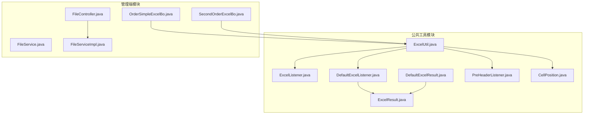
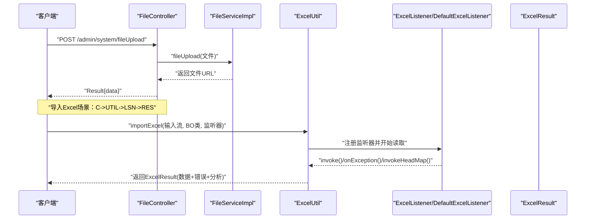
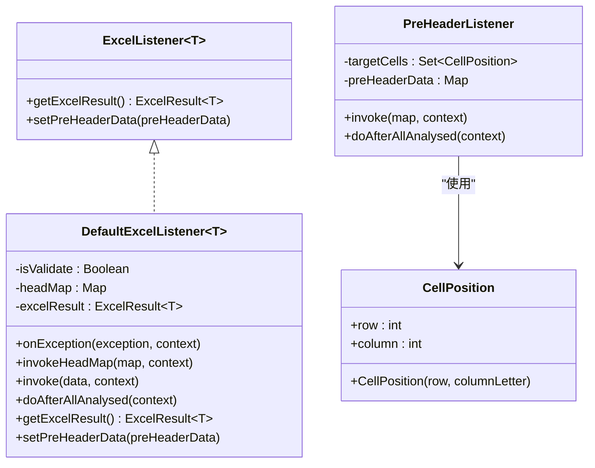
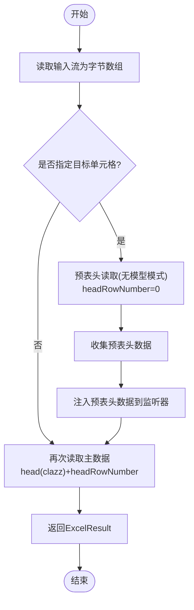
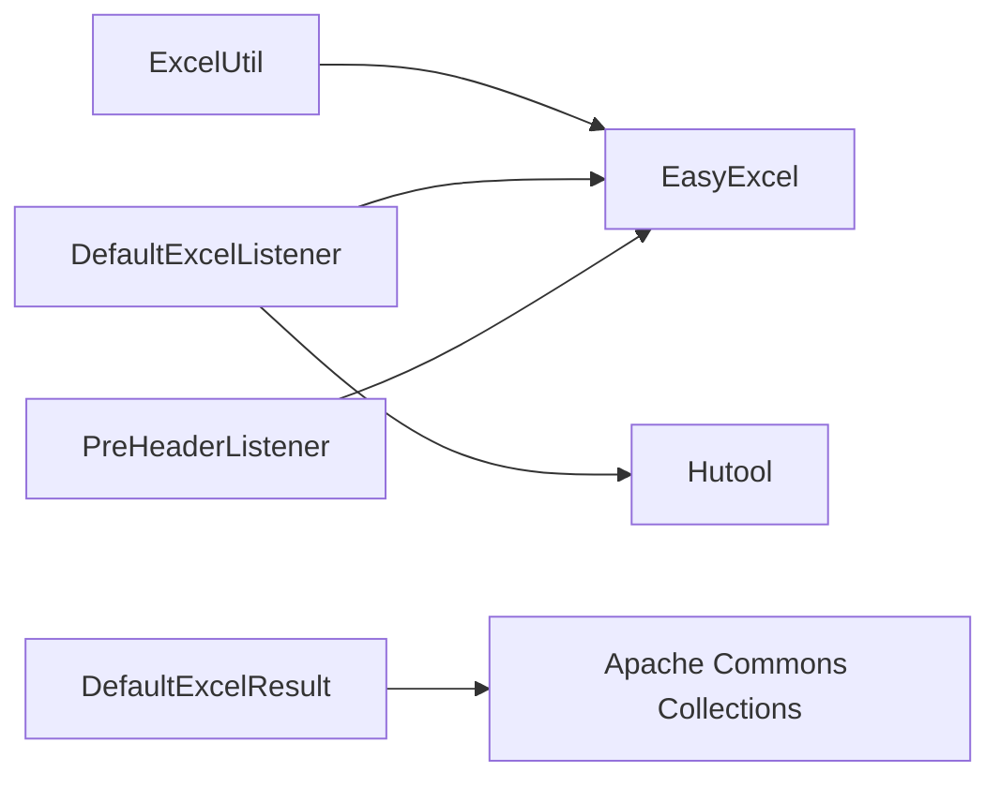

# Excel导入导出

<cite>
**本文引用的文件**
- [ExcelUtil.java](file://spzx-common/common-util/src/main/java/com/joker/spzx/utils/excel/ExcelUtil.java)
- [DefaultExcelListener.java](file://spzx-common/common-util/src/main/java/com/joker/spzx/utils/excel/DefaultExcelListener.java)
- [ExcelListener.java](file://spzx-common/common-util/src/main/java/com/joker/spzx/utils/excel/ExcelListener.java)
- [DefaultExcelResult.java](file://spzx-common/common-util/src/main/java/com/joker/spzx/utils/excel/DefaultExcelResult.java)
- [ExcelResult.java](file://spzx-common/common-util/src/main/java/com/joker/spzx/utils/excel/ExcelResult.java)
- [PreHeaderListener.java](file://spzx-common/common-util/src/main/java/com/joker/spzx/utils/excel/PreHeaderListener.java)
- [CellPosition.java](file://spzx-common/common-util/src/main/java/com/joker/spzx/utils/excel/CellPosition.java)
- [OrderSimpleExcelBo.java](file://spzx-manager/src/main/java/com/joker/spzx/manager/excel/OrderSimpleExcelBo.java)
- [SecondOrderExcelBo.java](file://spzx-manager/src/main/java/com/joker/spzx/manager/excel/SecondOrderExcelBo.java)
- [FileController.java](file://spzx-manager/src/main/java/com/joker/spzx/manager/controller/FileController.java)
- [FileService.java](file://spzx-manager/src/main/java/com/joker/spzx/manager/service/FileService.java)
- [FileServiceImpl.java](file://spzx-manager/src/main/java/com/joker/spzx/manager/service/impl/FileServiceImpl.java)
- [pom.xml（spzx-common）](file://spzx-common/pom.xml)
- [pom.xml（spzx-model）](file://spzx-model/pom.xml)
</cite>

## 目录
1. [简介](#简介)
2. [项目结构](#项目结构)
3. [核心组件](#核心组件)
4. [架构总览](#架构总览)
5. [详细组件分析](#详细组件分析)
6. [依赖分析](#依赖分析)
7. [性能考虑](#性能考虑)
8. [故障排查指南](#故障排查指南)
9. [结论](#结论)
10. [附录](#附录)

## 简介
本文件系统性梳理 SPZX 项目中基于 EasyExcel 的 Excel 导入与导出能力，重点覆盖：
- 工具类 ExcelUtil 的实现原理与使用方式
- 导入监听器设计模式：默认监听器、自定义监听器与预表头监听器
- 导出扩展机制与可拓展点
- 读写流程、数据校验与错误处理策略
- 具体使用示例、配置参数与性能优化建议
- 不同 Excel 格式支持、大数据量处理与内存优化
- 自定义监听器开发指南、批量处理与并发控制
- 常见问题排查与调试技巧

## 项目结构
围绕 Excel 功能的相关模块与文件分布如下：
- 工具与监听器：位于公共工具模块 common-util 的 excel 包
- 业务 BO 类：位于 manager 模块的 excel 包
- 文件上传服务：位于 manager 模块的 controller 与 service 层
- 依赖声明：在公共模块与模型模块的 pom.xml 中引入 EasyExcel

**图表来源**
- [ExcelUtil.java:1-112](file://spzx-common/common-util/src/main/java/com/joker/spzx/utils/excel/ExcelUtil.java#L1-L112)
- [ExcelListener.java:1-19](file://spzx-common/common-util/src/main/java/com/joker/spzx/utils/excel/ExcelListener.java#L1-L19)
- [DefaultExcelListener.java:1-104](file://spzx-common/common-util/src/main/java/com/joker/spzx/utils/excel/DefaultExcelListener.java#L1-L104)
- [ExcelResult.java:1-25](file://spzx-common/common-util/src/main/java/com/joker/spzx/utils/excel/ExcelResult.java#L1-L25)
- [DefaultExcelResult.java:1-75](file://spzx-common/common-util/src/main/java/com/joker/spzx/utils/excel/DefaultExcelResult.java#L1-L75)
- [PreHeaderListener.java:1-87](file://spzx-common/common-util/src/main/java/com/joker/spzx/utils/excel/PreHeaderListener.java#L1-L87)
- [CellPosition.java:1-53](file://spzx-common/common-util/src/main/java/com/joker/spzx/utils/excel/CellPosition.java#L1-L53)
- [OrderSimpleExcelBo.java:1-22](file://spzx-manager/src/main/java/com/joker/spzx/manager/excel/OrderSimpleExcelBo.java#L1-L22)
- [SecondOrderExcelBo.java:1-19](file://spzx-manager/src/main/java/com/joker/spzx/manager/excel/SecondOrderExcelBo.java#L1-L19)
- [FileController.java:1-26](file://spzx-manager/src/main/java/com/joker/spzx/manager/controller/FileController.java#L1-L26)
- [FileService.java:1-8](file://spzx-manager/src/main/java/com/joker/spzx/manager/service/FileService.java#L1-L8)
- [FileServiceImpl.java:1-51](file://spzx-manager/src/main/java/com/joker/spzx/manager/service/impl/FileServiceImpl.java#L1-L51)

**章节来源**
- [ExcelUtil.java:1-112](file://spzx-common/common-util/src/main/java/com/joker/spzx/utils/excel/ExcelUtil.java#L1-L112)
- [pom.xml（spzx-common）](file://spzx-common/pom.xml)
- [pom.xml（spzx-model）](file://spzx-model/pom.xml)

## 核心组件
- Excel 工具类：封装同步/异步导入、带预表头的导入、以及结果收集与返回
- 监听器接口与默认实现：统一读取回调、异常处理、数据收集与校验开关
- 结果聚合：统一返回数据列表、错误列表与分析摘要
- 预表头监听器与单元格定位：支持按指定行列读取表头值并传递给下游监听器
- BO 类：通过注解映射 Excel 字段，作为导入/导出的目标对象

关键职责与关系：
- ExcelUtil 提供静态方法，屏蔽 EasyExcel 读取细节，暴露统一入口
- DefaultExcelListener 实现读取回调、异常捕获与结果收集
- ExcelResult/DefaultExcelResult 统一结果结构与分析摘要
- PreHeaderListener 与 CellPosition 支持灵活定位表头单元格
- BO 类通过注解声明字段映射，配合 ExcelUtil 完成读写

**章节来源**
- [ExcelUtil.java:29-110](file://spzx-common/common-util/src/main/java/com/joker/spzx/utils/excel/ExcelUtil.java#L29-L110)
- [DefaultExcelListener.java:23-98](file://spzx-common/common-util/src/main/java/com/joker/spzx/utils/excel/DefaultExcelListener.java#L23-L98)
- [ExcelResult.java:5-23](file://spzx-common/common-util/src/main/java/com/joker/spzx/utils/excel/ExcelResult.java#L5-L23)
- [DefaultExcelResult.java:10-73](file://spzx-common/common-util/src/main/java/com/joker/spzx/utils/excel/DefaultExcelResult.java#L10-L73)
- [PreHeaderListener.java:21-84](file://spzx-common/common-util/src/main/java/com/joker/spzx/utils/excel/PreHeaderListener.java#L21-L84)
- [CellPosition.java:13-51](file://spzx-common/common-util/src/main/java/com/joker/spzx/utils/excel/CellPosition.java#L13-L51)
- [OrderSimpleExcelBo.java:8-21](file://spzx-manager/src/main/java/com/joker/spzx/manager/excel/OrderSimpleExcelBo.java#L8-L21)
- [SecondOrderExcelBo.java:8-18](file://spzx-manager/src/main/java/com/joker/spzx/manager/excel/SecondOrderExcelBo.java#L8-L18)

## 架构总览
整体流程从“请求-服务-工具-监听器-结果”展开，支持多种导入模式与扩展点。

**图表来源**
- [FileController.java:20-24](file://spzx-manager/src/main/java/com/joker/spzx/manager/controller/FileController.java#L20-L24)
- [FileServiceImpl.java:18-49](file://spzx-manager/src/main/java/com/joker/spzx/manager/service/impl/FileServiceImpl.java#L18-L49)
- [ExcelUtil.java:42-59](file://spzx-common/common-util/src/main/java/com/joker/spzx/utils/excel/ExcelUtil.java#L42-L59)
- [DefaultExcelListener.java:52-98](file://spzx-common/common-util/src/main/java/com/joker/spzx/utils/excel/DefaultExcelListener.java#L52-L98)
- [ExcelResult.java:5-23](file://spzx-common/common-util/src/main/java/com/joker/spzx/utils/excel/ExcelResult.java#L5-L23)

## 详细组件分析

### Excel 工具类（ExcelUtil）
- 同步导入：适用于小数据量，直接返回列表
- 异步导入（带校验监听器）：返回 ExcelResult，包含数据与错误列表
- 异步导入（自定义监听器）：允许业务自定义监听器与返回结构
- 异步导入（预表头模式）：先读取指定单元格的表头值，再进行主数据读取，并将预表头数据注入下游监听器

关键点：
- 使用 EasyExcel 读取，支持 sheet 读取与自动关闭流控制
- 预表头模式通过一次性读取字节流，分阶段执行两次读取
- 返回结构统一由监听器维护，最终由 ExcelResult 汇总

**章节来源**
- [ExcelUtil.java:29-110](file://spzx-common/common-util/src/main/java/com/joker/spzx/utils/excel/ExcelUtil.java#L29-L110)

### 监听器体系
- 接口层：ExcelListener 扩展 EasyExcel 的 ReadListener，新增 getExcelResult 与 setPreHeaderData
- 默认实现：DefaultExcelListener
  - 异常处理：区分单元格转换异常与 Bean 校验异常，记录行号、列号与表头名
  - 数据收集：在 invoke 中将对象加入结果列表
  - 校验开关：isValidate 控制是否启用校验（当前代码预留）
- 预表头监听器：PreHeaderListener
  - 将目标单元格位置映射为键值对，供下游监听器使用
  - 支持列字母转列索引与行索引转列字母的辅助逻辑

**图表来源**
- [ExcelListener.java:7-16](file://spzx-common/common-util/src/main/java/com/joker/spzx/utils/excel/ExcelListener.java#L7-L16)
- [DefaultExcelListener.java:23-104](file://spzx-common/common-util/src/main/java/com/joker/spzx/utils/excel/DefaultExcelListener.java#L23-L104)
- [PreHeaderListener.java:21-84](file://spzx-common/common-util/src/main/java/com/joker/spzx/utils/excel/PreHeaderListener.java#L21-L84)
- [CellPosition.java:13-51](file://spzx-common/common-util/src/main/java/com/joker/spzx/utils/excel/CellPosition.java#L13-L51)

**章节来源**
- [ExcelListener.java:7-16](file://spzx-common/common-util/src/main/java/com/joker/spzx/utils/excel/ExcelListener.java#L7-L16)
- [DefaultExcelListener.java:23-104](file://spzx-common/common-util/src/main/java/com/joker/spzx/utils/excel/DefaultExcelListener.java#L23-L104)
- [PreHeaderListener.java:21-84](file://spzx-common/common-util/src/main/java/com/joker/spzx/utils/excel/PreHeaderListener.java#L21-L84)
- [CellPosition.java:13-51](file://spzx-common/common-util/src/main/java/com/joker/spzx/utils/excel/CellPosition.java#L13-L51)

### 结果聚合（ExcelResult/DefaultExcelResult）
- 统一接口：getList/getErrorList/getAnalysis/isSuccess
- 默认实现：DefaultExcelResult
  - 分析摘要：根据成功/失败计数生成提示文本
  - 成功判断：当错误列表为空时视为成功

**章节来源**
- [ExcelResult.java:5-23](file://spzx-common/common-util/src/main/java/com/joker/spzx/utils/excel/ExcelResult.java#L5-L23)
- [DefaultExcelResult.java:10-73](file://spzx-common/common-util/src/main/java/com/joker/spzx/utils/excel/DefaultExcelResult.java#L10-L73)

### BO 类与注解映射
- BO 类通过注解声明字段与列映射，配合 ExcelUtil 的 head(clazz) 完成读取
- 示例 BO：
  - 订单简表 BO：包含订单编号、实付金额、订单状态、退款金额等字段
  - 第二版订单 BO：字段名略有差异，便于演示多 BO 场景

**章节来源**
- [OrderSimpleExcelBo.java:8-21](file://spzx-manager/src/main/java/com/joker/spzx/manager/excel/OrderSimpleExcelBo.java#L8-L21)
- [SecondOrderExcelBo.java:8-18](file://spzx-manager/src/main/java/com/joker/spzx/manager/excel/SecondOrderExcelBo.java#L8-L18)

### 预表头读取流程

**图表来源**
- [ExcelUtil.java:71-110](file://spzx-common/common-util/src/main/java/com/joker/spzx/utils/excel/ExcelUtil.java#L71-L110)
- [PreHeaderListener.java:62-84](file://spzx-common/common-util/src/main/java/com/joker/spzx/utils/excel/PreHeaderListener.java#L62-L84)
- [CellPosition.java:33-50](file://spzx-common/common-util/src/main/java/com/joker/spzx/utils/excel/CellPosition.java#L33-L50)

## 依赖分析
- EasyExcel 依赖：在公共模块与模型模块的 pom.xml 中引入，确保工具类可用
- 依赖关系：ExcelUtil 依赖 EasyExcel；监听器依赖 EasyExcel 的 AnalysisEventListener；结果聚合依赖 Apache Commons Collections 与 Hutool

**图表来源**
- [pom.xml（spzx-common）](file://spzx-common/pom.xml)
- [pom.xml（spzx-model）](file://spzx-model/pom.xml)
- [DefaultExcelListener.java:3-19](file://spzx-common/common-util/src/main/java/com/joker/spzx/utils/excel/DefaultExcelListener.java#L3-L19)
- [DefaultExcelResult.java:3-5](file://spzx-common/common-util/src/main/java/com/joker/spzx/utils/excel/DefaultExcelResult.java#L3-L5)

**章节来源**
- [pom.xml（spzx-common）](file://spzx-common/pom.xml)
- [pom.xml（spzx-model）](file://spzx-model/pom.xml)

## 性能考虑
- 小数据量：使用同步导入，减少监听器开销
- 大数据量：使用异步导入，避免阻塞线程；结合分片读取与批量处理
- 内存优化：预表头模式仅读取必要单元格，降低内存占用；避免在监听器中持有大对象引用
- 并发控制：监听器内部应保证线程安全；如需并发，建议在业务层做任务拆分与限流
- I/O 优化：尽量使用流式读取，避免一次性加载整个文件至内存

[本节为通用指导，不直接分析具体文件]

## 故障排查指南
- 单元格转换异常：监听器会记录行号、列号与对应表头，便于快速定位
- Bean 校验异常：收集约束校验消息，输出到错误列表
- 预表头读取失败：检查目标单元格位置是否正确，确认 headRowNumber 与表头行一致
- 文件格式问题：确认 Excel 版本与 EasyExcel 兼容性；优先使用 .xlsx
- 上传与导出：若涉及文件上传，检查 MinIO 配置与桶存在性

**章节来源**
- [DefaultExcelListener.java:52-74](file://spzx-common/common-util/src/main/java/com/joker/spzx/utils/excel/DefaultExcelListener.java#L52-L74)
- [ExcelUtil.java:71-110](file://spzx-common/common-util/src/main/java/com/joker/spzx/utils/excel/ExcelUtil.java#L71-L110)
- [FileServiceImpl.java:18-49](file://spzx-manager/src/main/java/com/joker/spzx/manager/service/impl/FileServiceImpl.java#L18-L49)

## 结论
该实现以 ExcelUtil 为核心入口，结合监听器模式与结果聚合，提供了灵活、可扩展的 Excel 导入能力。通过预表头监听器与单元格定位，进一步增强了对复杂表头场景的支持。配合 EasyExcel 的流式读取与合理的并发控制，可在保证性能的同时满足生产环境的需求。

[本节为总结性内容，不直接分析具体文件]

## 附录

### 使用示例与最佳实践
- 同步导入（小数据量）
  - 调用路径：[ExcelUtil.importExcel(InputStream, Class):29-31](file://spzx-common/common-util/src/main/java/com/joker/spzx/utils/excel/ExcelUtil.java#L29-L31)
  - 适用场景：文件较小且需要快速返回
- 异步导入（带默认监听器）
  - 调用路径：[ExcelUtil.importExcel(InputStream, Class, boolean):42-46](file://spzx-common/common-util/src/main/java/com/joker/spzx/utils/excel/ExcelUtil.java#L42-L46)
  - 适用场景：需要错误收集与分析摘要
- 异步导入（自定义监听器）
  - 调用路径：[ExcelUtil.importExcel(InputStream, Class, ExcelListener):56-59](file://spzx-common/common-util/src/main/java/com/joker/spzx/utils/excel/ExcelUtil.java#L56-L59)
  - 适用场景：业务自定义处理逻辑或自定义返回结构
- 预表头导入
  - 调用路径：[ExcelUtil.importExcel(InputStream, Class, Set, Integer, ExcelListener):71-110](file://spzx-common/common-util/src/main/java/com/joker/spzx/utils/excel/ExcelUtil.java#L71-L110)
  - 适用场景：表头不在固定位置或需要读取特定单元格值

- BO 类映射
  - 示例 BO：[OrderSimpleExcelBo:8-21](file://spzx-manager/src/main/java/com/joker/spzx/manager/excel/OrderSimpleExcelBo.java#L8-L21)、[SecondOrderExcelBo:8-18](file://spzx-manager/src/main/java/com/joker/spzx/manager/excel/SecondOrderExcelBo.java#L8-L18)
  - 映射方式：通过注解声明字段与列索引

- 文件上传（与导入导出关联）
  - 控制器：[FileController:20-24](file://spzx-manager/src/main/java/com/joker/spzx/manager/controller/FileController.java#L20-L24)
  - 服务实现：[FileServiceImpl:18-49](file://spzx-manager/src/main/java/com/joker/spzx/manager/service/impl/FileServiceImpl.java#L18-L49)

**章节来源**
- [ExcelUtil.java:29-110](file://spzx-common/common-util/src/main/java/com/joker/spzx/utils/excel/ExcelUtil.java#L29-L110)
- [OrderSimpleExcelBo.java:8-21](file://spzx-manager/src/main/java/com/joker/spzx/manager/excel/OrderSimpleExcelBo.java#L8-L21)
- [SecondOrderExcelBo.java:8-18](file://spzx-manager/src/main/java/com/joker/spzx/manager/excel/SecondOrderExcelBo.java#L8-L18)
- [FileController.java:20-24](file://spzx-manager/src/main/java/com/joker/spzx/manager/controller/FileController.java#L20-L24)
- [FileServiceImpl.java:18-49](file://spzx-manager/src/main/java/com/joker/spzx/manager/service/impl/FileServiceImpl.java#L18-L49)

### 配置参数与扩展点
- 校验开关：默认监听器支持 isValidate 开关（预留）
- 表头行数：通过 headRowNumber 指定
- 监听器扩展：实现 ExcelListener 接口，自定义错误收集与返回结构
- 预表头扩展：通过 CellPosition 指定行列，PreHeaderListener 收集并注入

**章节来源**
- [DefaultExcelListener.java:40-43](file://spzx-common/common-util/src/main/java/com/joker/spzx/utils/excel/DefaultExcelListener.java#L40-L43)
- [ExcelUtil.java:71-110](file://spzx-common/common-util/src/main/java/com/joker/spzx/utils/excel/ExcelUtil.java#L71-L110)
- [CellPosition.java:33-50](file://spzx-common/common-util/src/main/java/com/joker/spzx/utils/excel/CellPosition.java#L33-L50)

### 导出功能扩展机制
- 当前仓库主要提供导入能力；导出可通过 EasyExcel 的写入 API 扩展
- 建议在业务层封装导出工具类，复用 BO 类注解与模板样式
- 导出流程可参考导入的监听器模式：写入前准备、写入中回调、写入后汇总

[本节为概念性说明，不直接分析具体文件]

### 不同 Excel 格式支持
- 基于 EasyExcel 的依赖，通常支持 .xlsx（推荐）与 .xls（部分兼容）
- 建议优先使用 .xlsx，以获得更好的性能与稳定性

**章节来源**
- [pom.xml（spzx-common）](file://spzx-common/pom.xml)
- [pom.xml（spzx-model）](file://spzx-model/pom.xml)

### 大数据量处理与内存优化
- 使用异步导入与监听器模式，避免一次性加载
- 预表头仅读取必要单元格，减少内存占用
- 在业务层进行分批处理与并发控制，避免单次任务过大

[本节为通用指导，不直接分析具体文件]

### 自定义监听器开发指南
- 实现 ExcelListener 接口，重写 getExcelResult 与 setPreHeaderData
- 在 invoke 中处理数据并填充业务结果
- 在 onException 中捕获并记录错误，保持线程安全
- 可结合 DefaultExcelListener 的错误处理策略与分析摘要逻辑

**章节来源**
- [ExcelListener.java:7-16](file://spzx-common/common-util/src/main/java/com/joker/spzx/utils/excel/ExcelListener.java#L7-L16)
- [DefaultExcelListener.java:52-98](file://spzx-common/common-util/src/main/java/com/joker/spzx/utils/excel/DefaultExcelListener.java#L52-L98)
- [DefaultExcelResult.java:55-73](file://spzx-common/common-util/src/main/java/com/joker/spzx/utils/excel/DefaultExcelResult.java#L55-L73)

### 批量处理与并发控制
- 监听器内部应保证线程安全；如需并发，建议在业务层拆分任务并限制并发度
- 导入过程中避免持有大对象引用，及时释放中间资源

[本节为通用指导，不直接分析具体文件]