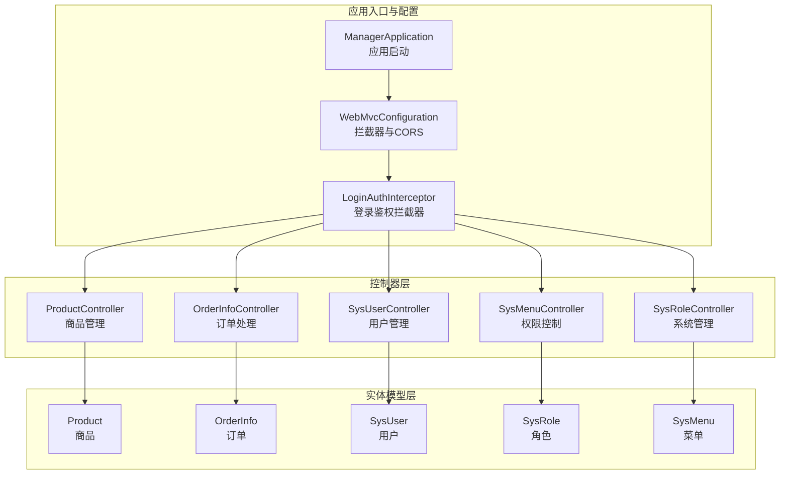
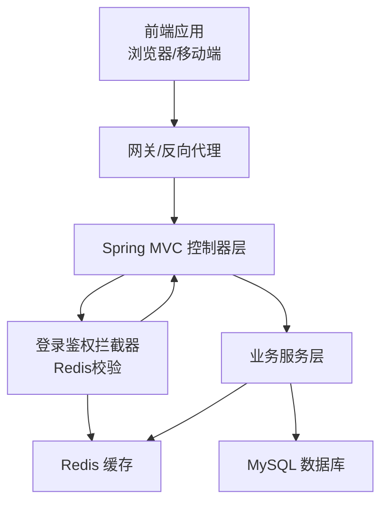
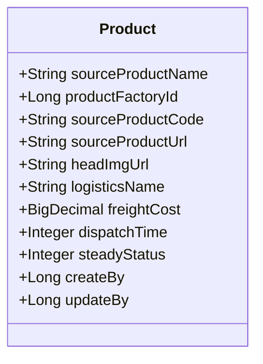
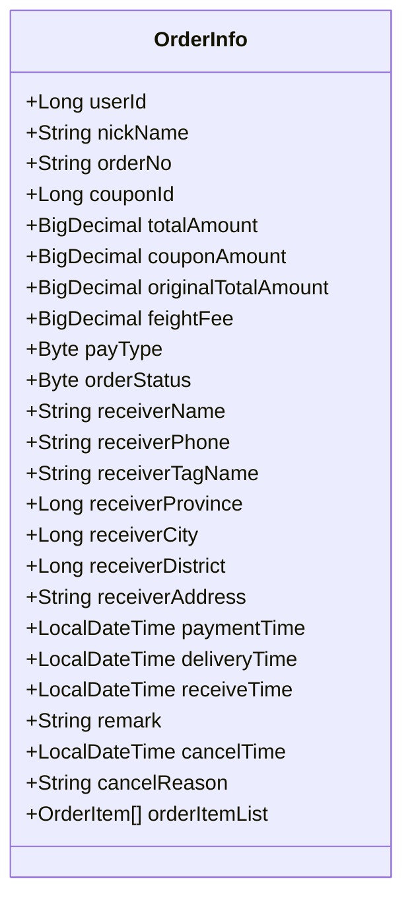
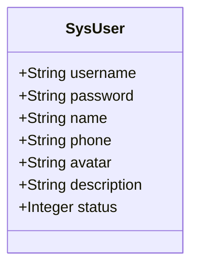
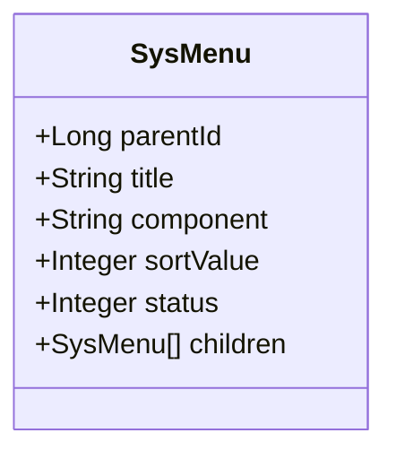
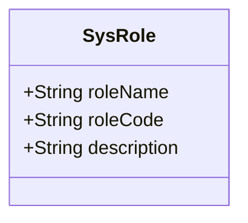
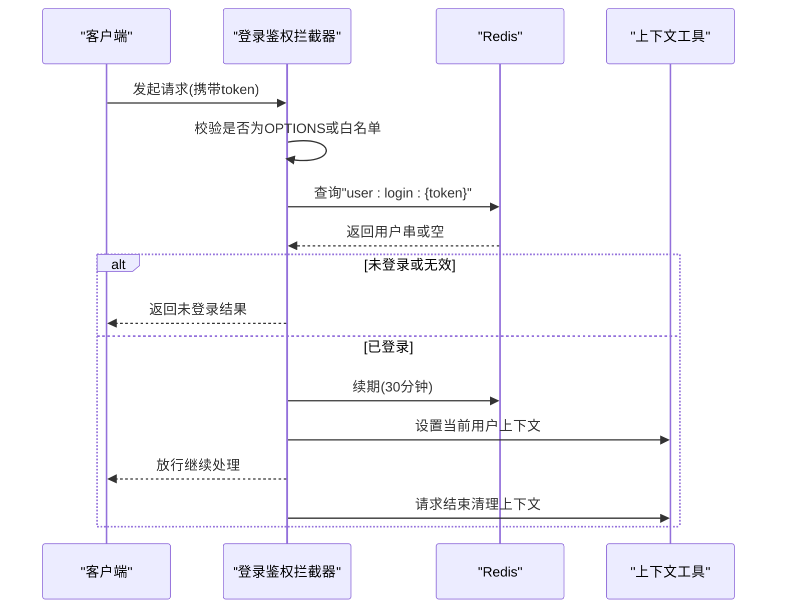
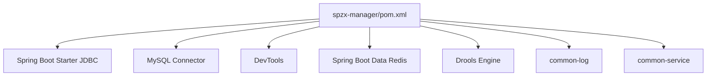

# 业务功能模块

<cite>
**本文引用的文件**
- [ManagerApplication.java](file://spzx-manager/src/main/java/com/joker/spzx/manager/ManagerApplication.java)
- [WebMvcConfiguration.java](file://spzx-manager/src/main/java/com/joker/spzx/manager/config/WebMvcConfiguration.java)
- [LoginAuthInterceptor.java](file://spzx-manager/src/main/java/com/joker/spzx/manager/config/LoginAuthInterceptor.java)
- [application.yml](file://spzx-manager/src/main/resources/application.yml)
- [pom.xml](file://spzx-manager/pom.xml)
- [ProductController.java](file://spzx-manager/src/main/java/com/joker/spzx/manager/controller/ProductController.java)
- [OrderInfoController.java](file://spzx-manager/src/main/java/com/joker/spzx/manager/controller/OrderInfoController.java)
- [SysUserController.java](file://spzx-manager/src/main/java/com/joker/spzx/manager/controller/SysUserController.java)
- [SysRoleController.java](file://spzx-manager/src/main/java/com/joker/spzx/manager/controller/SysRoleController.java)
- [SysMenuController.java](file://spzx-manager/src/main/java/com/joker/spzx/manager/controller/SysMenuController.java)
- [Product.java](file://spzx-model/src/main/java/com/joker/spzx/model/entity/product/Product.java)
- [OrderInfo.java](file://spzx-model/src/main/java/com/joker/spzx/model/entity/order/OrderInfo.java)
- [SysUser.java](file://spzx-model/src/main/java/com/joker/spzx/model/entity/system/SysUser.java)
- [SysRole.java](file://spzx-model/src/main/java/com/joker/spzx/model/entity/system/SysRole.java)
- [SysMenu.java](file://spzx-model/src/main/java/com/joker/spzx/model/entity/system/SysMenu.java)
</cite>

## 目录
1. [简介](#简介)
2. [项目结构](#项目结构)
3. [核心组件](#核心组件)
4. [架构总览](#架构总览)
5. [详细组件分析](#详细组件分析)
6. [依赖分析](#依赖分析)
7. [性能考虑](#性能考虑)
8. [故障排查指南](#故障排查指南)
9. [结论](#结论)
10. [附录](#附录)

## 简介
本文件面向业务与开发人员，系统化梳理 SPZX 电商管理系统“业务功能模块”的设计与实现，覆盖商品管理、订单处理、用户管理、权限控制、系统管理等核心模块。文档从架构、模块职责、业务流程、数据交互、异常处理到性能优化进行全链路说明，并通过图示帮助快速建立对系统的整体认知。

## 项目结构
- 应用入口与配置
  - 应用启动类负责启用日志切面与Spring Boot引导。
  - Web层配置统一注册拦截器与跨域策略，拦截白名单外的所有请求。
  - 登录鉴权拦截器基于Redis校验token有效性，刷新过期时间并将用户上下文注入工具类。
- 控制器层
  - 商品管理：提供分页查询、保存、更新、删除、详情读取等REST接口。
  - 订单处理：提供订单统计查询接口。
  - 用户管理：提供用户分页、新增、更新、删除、角色分配等接口。
  - 权限控制：提供菜单树形列表、新增、更新、删除等接口。
  - 系统管理：提供角色分页、列表、新增、更新、删除等接口。
- 实体模型层
  - 商品、订单、用户、角色、菜单等核心实体定义字段与关系。

**图表来源**
- [ManagerApplication.java:10-15](file://spzx-manager/src/main/java/com/joker/spzx/manager/ManagerApplication.java#L10-L15)
- [WebMvcConfiguration.java:14-38](file://spzx-manager/src/main/java/com/joker/spzx/manager/config/WebMvcConfiguration.java#L14-L38)
- [LoginAuthInterceptor.java:23-80](file://spzx-manager/src/main/java/com/joker/spzx/manager/config/LoginAuthInterceptor.java#L23-L80)
- [ProductController.java:22-58](file://spzx-manager/src/main/java/com/joker/spzx/manager/controller/ProductController.java#L22-L58)
- [OrderInfoController.java:21-34](file://spzx-manager/src/main/java/com/joker/spzx/manager/controller/OrderInfoController.java#L21-L34)
- [SysUserController.java:22-70](file://spzx-manager/src/main/java/com/joker/spzx/manager/controller/SysUserController.java#L22-L70)
- [SysMenuController.java:21-58](file://spzx-manager/src/main/java/com/joker/spzx/manager/controller/SysMenuController.java#L21-L58)
- [SysRoleController.java:23-70](file://spzx-manager/src/main/java/com/joker/spzx/manager/controller/SysRoleController.java#L23-L70)
- [Product.java:10-58](file://spzx-model/src/main/java/com/joker/spzx/model/entity/product/Product.java#L10-L58)
- [OrderInfo.java:13-113](file://spzx-model/src/main/java/com/joker/spzx/model/entity/order/OrderInfo.java#L13-L113)
- [SysUser.java:9-42](file://spzx-model/src/main/java/com/joker/spzx/model/entity/system/SysUser.java#L9-L42)
- [SysRole.java:9-28](file://spzx-model/src/main/java/com/joker/spzx/model/entity/system/SysRole.java#L9-L28)
- [SysMenu.java:11-41](file://spzx-model/src/main/java/com/joker/spzx/model/entity/system/SysMenu.java#L11-L41)

**章节来源**
- [ManagerApplication.java:10-15](file://spzx-manager/src/main/java/com/joker/spzx/manager/ManagerApplication.java#L10-L15)
- [WebMvcConfiguration.java:14-38](file://spzx-manager/src/main/java/com/joker/spzx/manager/config/WebMvcConfiguration.java#L14-L38)
- [LoginAuthInterceptor.java:23-80](file://spzx-manager/src/main/java/com/joker/spzx/manager/config/LoginAuthInterceptor.java#L23-L80)
- [application.yml:1-5](file://spzx-manager/src/main/resources/application.yml#L1-L5)

## 核心组件
- 应用启动与环境
  - 启动类启用日志切面注解，Spring Boot引导应用。
  - 配置文件激活开发环境profile。
- Web层与安全
  - 统一注册登录鉴权拦截器，排除白名单路径。
  - CORS允许本地前端访问，支持凭证传递与通配符头。
- 鉴权与上下文
  - 拦截器从请求头读取token，Redis中校验用户会话，续期并设置线程上下文用户对象。
  - 请求完成后清理上下文，避免线程复用导致的数据残留。

**章节来源**
- [ManagerApplication.java:8-15](file://spzx-manager/src/main/java/com/joker/spzx/manager/ManagerApplication.java#L8-L15)
- [application.yml:1-5](file://spzx-manager/src/main/resources/application.yml#L1-L5)
- [WebMvcConfiguration.java:19-35](file://spzx-manager/src/main/java/com/joker/spzx/manager/config/WebMvcConfiguration.java#L19-L35)
- [LoginAuthInterceptor.java:30-79](file://spzx-manager/src/main/java/com/joker/spzx/manager/config/LoginAuthInterceptor.java#L30-L79)

## 架构总览
系统采用前后端分离架构，后端通过Spring MVC暴露REST接口，拦截器统一鉴权，Redis存储登录态，MyBatis-Plus访问数据库。核心模块围绕商品、订单、用户、角色、菜单展开，控制器作为入口，服务层承载业务逻辑，实体模型映射数据库表。

**图表来源**
- [WebMvcConfiguration.java:19-35](file://spzx-manager/src/main/java/com/joker/spzx/manager/config/WebMvcConfiguration.java#L19-L35)
- [LoginAuthInterceptor.java:40-57](file://spzx-manager/src/main/java/com/joker/spzx/manager/config/LoginAuthInterceptor.java#L40-L57)
- [pom.xml:26-38](file://spzx-manager/pom.xml#L26-L38)

## 详细组件分析

### 商品管理模块
- 功能范围
  - 分页查询货源商品列表，支持按条件筛选。
  - 新增、更新、删除商品记录。
  - 获取商品详情。
- 接口要点
  - 列表分页：GET /admin/product/sourceProduct/pageList
  - 新增：POST /admin/product/sourceProduct/saveData
  - 更新：PUT /admin/product/sourceProduct/updateData
  - 删除：DELETE /admin/product/sourceProduct/deleteById/{id}
  - 详情：GET /admin/product/sourceProduct/getDetail
- 数据模型
  - 商品实体包含货源名称、厂商ID、商品链接、头图URL、物流信息、运费、发货时长、稳定性状态及审计字段。

**图表来源**
- [Product.java:10-58](file://spzx-model/src/main/java/com/joker/spzx/model/entity/product/Product.java#L10-L58)

**章节来源**
- [ProductController.java:22-58](file://spzx-manager/src/main/java/com/joker/spzx/manager/controller/ProductController.java#L22-L58)
- [Product.java:10-58](file://spzx-model/src/main/java/com/joker/spzx/model/entity/product/Product.java#L10-L58)

### 订单处理模块
- 功能范围
  - 提供订单统计查询接口，用于后台运营统计。
- 接口要点
  - 统计：GET /admin/order/orderInfo/getOrderStatisticsData
- 数据模型
  - 订单实体包含用户ID、昵称、订单号、优惠券、总金额、支付方式、订单状态、收货人信息、时间戳、备注以及订单项集合。

**图表来源**
- [OrderInfo.java:13-113](file://spzx-model/src/main/java/com/joker/spzx/model/entity/order/OrderInfo.java#L13-L113)

**章节来源**
- [OrderInfoController.java:21-34](file://spzx-manager/src/main/java/com/joker/spzx/manager/controller/OrderInfoController.java#L21-L34)
- [OrderInfo.java:13-113](file://spzx-model/src/main/java/com/joker/spzx/model/entity/order/OrderInfo.java#L13-L113)

### 用户管理模块
- 功能范围
  - 用户分页查询、新增、更新、删除。
  - 分配角色（为用户绑定角色）。
- 接口要点
  - 分页：POST /admin/system/sysUser/findByPage/{pageNum}/{pageSize}
  - 新增：POST /admin/system/sysUser/saveSysUser
  - 更新：POST /admin/system/sysUser/updateSysUser
  - 删除：DELETE /admin/system/sysUser/deleteById/{id}
  - 分配角色：POST /admin/system/sysUser/doAssgin
- 数据模型
  - 用户实体包含用户名、密码、姓名、手机号、头像、描述、状态等字段。

**图表来源**
- [SysUser.java:9-42](file://spzx-model/src/main/java/com/joker/spzx/model/entity/system/SysUser.java#L9-L42)

**章节来源**
- [SysUserController.java:22-70](file://spzx-manager/src/main/java/com/joker/spzx/manager/controller/SysUserController.java#L22-L70)
- [SysUser.java:9-42](file://spzx-model/src/main/java/com/joker/spzx/model/entity/system/SysUser.java#L9-L42)

### 权限控制模块
- 功能范围
  - 菜单树形列表展示。
  - 新增、更新、删除菜单。
- 接口要点
  - 树形列表：GET /admin/system/sysMenu/findNodes
  - 新增：POST /admin/system/sysMenu/save
  - 更新：PUT /admin/system/sysMenu/update
  - 删除：DELETE /admin/system/sysMenu/removeById/{id}
- 数据模型
  - 菜单实体包含父级ID、标题、组件名、排序值、状态及子节点集合。

**图表来源**
- [SysMenu.java:11-41](file://spzx-model/src/main/java/com/joker/spzx/model/entity/system/SysMenu.java#L11-L41)

**章节来源**
- [SysMenuController.java:21-58](file://spzx-manager/src/main/java/com/joker/spzx/manager/controller/SysMenuController.java#L21-L58)
- [SysMenu.java:11-41](file://spzx-model/src/main/java/com/joker/spzx/model/entity/system/SysMenu.java#L11-L41)

### 系统管理模块
- 功能范围
  - 角色分页查询、角色列表（按用户ID）、新增、更新、删除。
- 接口要点
  - 分页：POST /admin/system/sysRole/findByPage/{pageNum}/{pageSize}
  - 角色列表：GET /admin/system/sysRole/roleList/{userId}
  - 新增：POST /admin/system/sysRole/saveSysRole
  - 更新：POST /admin/system/sysRole/updateSysRole
  - 删除：DELETE /admin/system/sysRole/deleteById/{id}
- 数据模型
  - 角色实体包含角色名称、角色编码、描述等字段。

**图表来源**
- [SysRole.java:9-28](file://spzx-model/src/main/java/com/joker/spzx/model/entity/system/SysRole.java#L9-L28)

**章节来源**
- [SysRoleController.java:23-70](file://spzx-manager/src/main/java/com/joker/spzx/manager/controller/SysRoleController.java#L23-L70)
- [SysRole.java:9-28](file://spzx-model/src/main/java/com/joker/spzx/model/entity/system/SysRole.java#L9-L28)

### 登录鉴权流程（序列图）

**图表来源**
- [LoginAuthInterceptor.java:30-79](file://spzx-manager/src/main/java/com/joker/spzx/manager/config/LoginAuthInterceptor.java#L30-L79)

## 依赖分析
- 外部依赖
  - Spring Boot Starter JDBC、MySQL Connector、Spring Boot DevTools。
  - Redis Starter（运行时依赖）。
  - Drools 规则引擎相关依赖。
- 内部模块
  - 引入公共日志与通用异常处理模块。
- 配置与资源
  - application.yml 激活dev环境。
  - WebMvcConfiguration 注册拦截器与CORS。

**图表来源**
- [pom.xml:21-83](file://spzx-manager/pom.xml#L21-L83)

**章节来源**
- [pom.xml:21-83](file://spzx-manager/pom.xml#L21-L83)
- [application.yml:1-5](file://spzx-manager/src/main/resources/application.yml#L1-L5)

## 性能考虑
- 缓存与会话
  - 使用Redis存储登录态，减少数据库压力；续期机制保障会话活跃性。
- 分页与查询
  - 控制器层使用分页DTO，建议结合索引与合理分页大小，避免一次性加载过多数据。
- 接口幂等与并发
  - 对写操作建议引入幂等键与乐观锁，防止重复提交与并发冲突。
- 跨域与网络
  - CORS配置允许本地开发调试，生产环境建议限制具体域名与头字段，降低风险。
- 规则引擎
  - Drools规则引擎可扩展订单折扣等复杂业务，建议将规则拆分与缓存，避免频繁加载。

[本节为通用指导，无需特定文件引用]

## 故障排查指南
- 未登录/会话失效
  - 现象：返回未登录错误。
  - 排查：确认请求头是否携带token；检查Redis中是否存在"user:login:{token}"；查看拦截器续期逻辑是否生效。
- 跨域问题
  - 现象：前端无法访问后端接口。
  - 排查：确认CORS配置中的allowedOrigins与allowedHeaders；确认是否为OPTIONS预检请求。
- 参数校验与白名单
  - 现象：部分接口被拦截。
  - 排查：确认请求路径是否命中白名单；检查拦截器逻辑与常量白名单配置。
- 数据库连接
  - 现象：接口报数据库异常。
  - 排查：确认MySQL驱动版本与连接参数；检查事务与超时配置。

**章节来源**
- [LoginAuthInterceptor.java:40-79](file://spzx-manager/src/main/java/com/joker/spzx/manager/config/LoginAuthInterceptor.java#L40-L79)
- [WebMvcConfiguration.java:28-35](file://spzx-manager/src/main/java/com/joker/spzx/manager/config/WebMvcConfiguration.java#L28-L35)
- [pom.xml:34-38](file://spzx-manager/pom.xml#L34-L38)

## 结论
本系统以清晰的模块划分与统一的鉴权机制为基础，围绕商品、订单、用户、角色、菜单构建了完整的后台管理能力。通过Redis会话与拦截器实现统一安全控制，结合分页与实体模型支撑高效的数据管理。建议在生产环境中完善跨域白名单、数据库索引与规则引擎缓存，持续提升安全性与性能。

[本节为总结性内容，无需特定文件引用]

## 附录
- 业务场景示例（概念性）
  - 商品上架：管理员在商品管理模块完成新增/更新，前端展示货源商品信息。
  - 订单统计：运营人员调用统计接口获取销售与退款指标。
  - 用户角色分配：人事或管理员为员工分配角色，菜单权限随之生效。
  - 登录流程：用户登录成功后获得token，后续请求携带token访问受控接口。

[本节为概念性说明，无需特定文件引用]