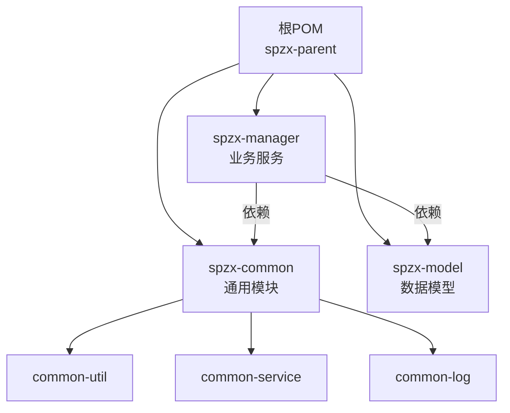
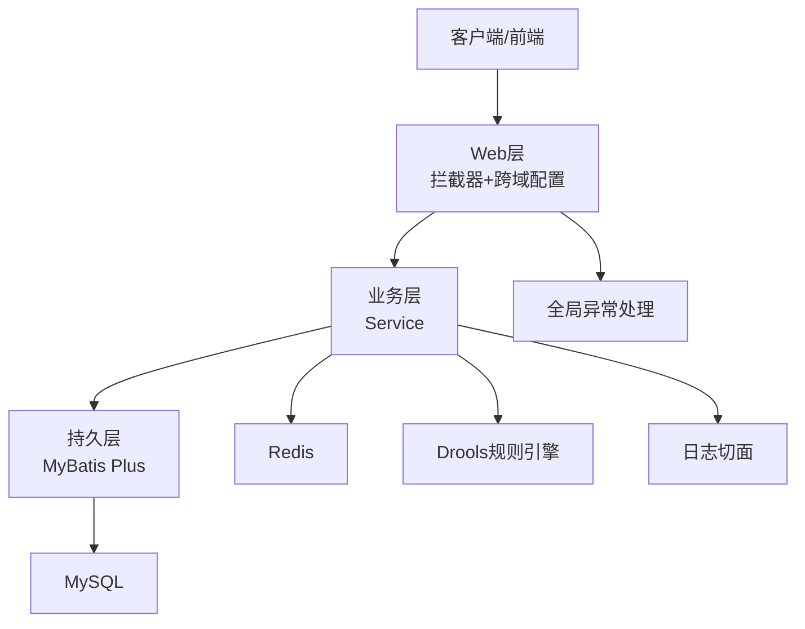
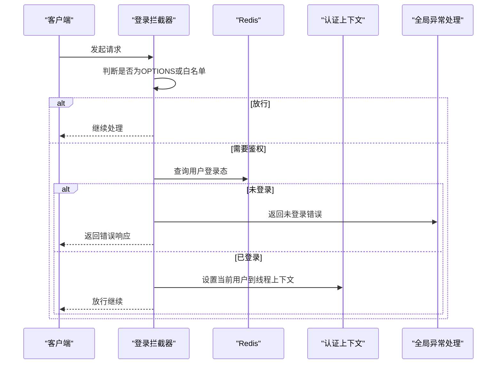
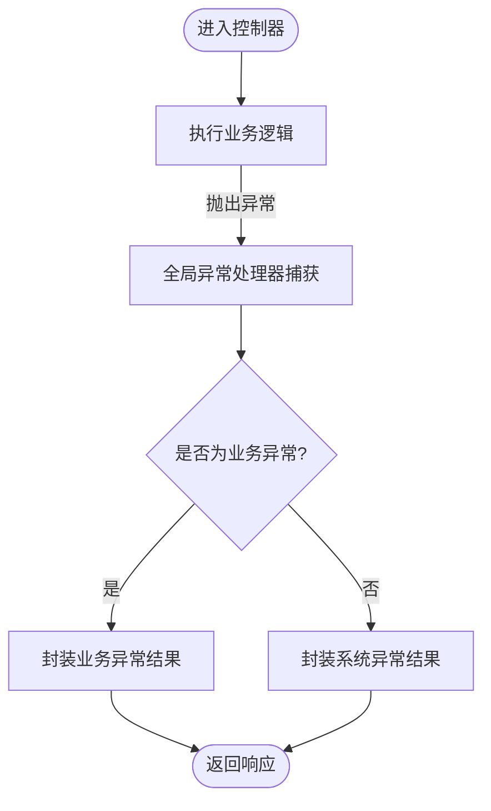
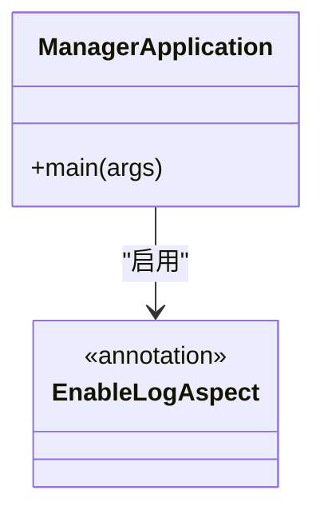
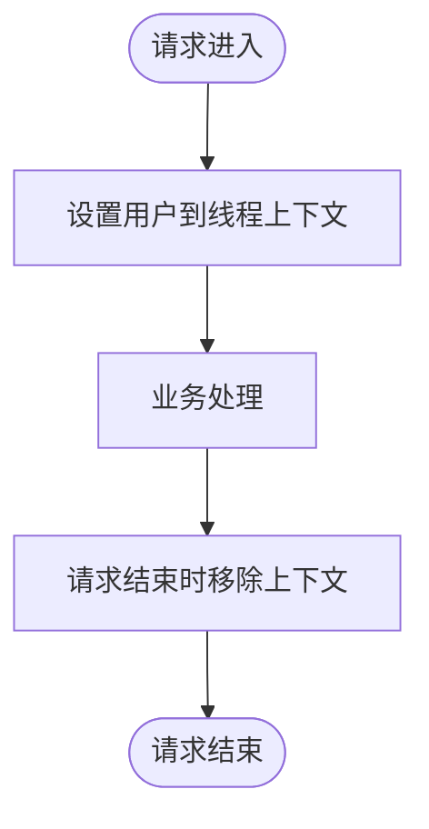
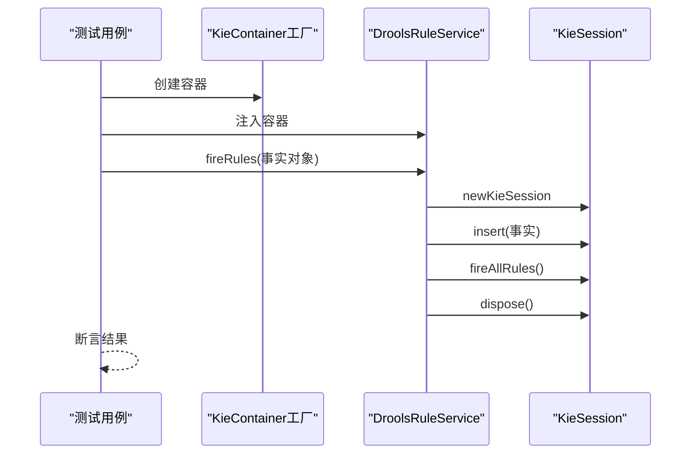
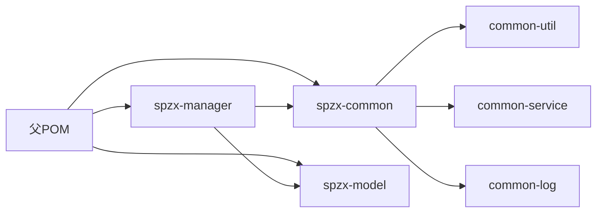

# 开发指南

<cite>
**本文引用的文件**
- [pom.xml](file://pom.xml)
- [spzx-manager/pom.xml](file://spzx-manager/pom.xml)
- [spzx-common/pom.xml](file://spzx-common/pom.xml)
- [spzx-model/pom.xml](file://spzx-model/pom.xml)
- [application.yml](file://spzx-manager/src/main/resources/application.yml)
- [application-dev.yml](file://spzx-manager/src/main/resources/application-dev.yml)
- [WebMvcConfiguration.java](file://spzx-manager/src/main/java/com/joker/spzx/manager/config/WebMvcConfiguration.java)
- [LoginAuthInterceptor.java](file://spzx-manager/src/main/java/com/joker/spzx/manager/config/LoginAuthInterceptor.java)
- [GlobalExceptionHandler.java](file://spzx-common/common-service/src/main/java/com/joker/spzx/common/exception/GlobalExceptionHandler.java)
- [EnableLogAspect.java](file://spzx-common/common-service/src/main/java/com/joker/spzx/common/annotation/EnableLogAspect.java)
- [AuthContextUtil.java](file://spzx-common/common-util/src/main/java/com/joker/spzx/utils/AuthContextUtil.java)
- [Constant.java](file://spzx-common/common-util/src/main/java/com/joker/spzx/utils/Constant.java)
- [ManagerApplication.java](file://spzx-manager/src/main/java/com/joker/spzx/manager/ManagerApplication.java)
- [DroolsRuleService.java](file://spzx-manager/src/main/java/com/joker/spzx/manager/drools/DroolsRuleService.java)
- [OrderDiscountDroolsTest.java](file://spzx-manager/src/test/java/com/joker/spzx/manager/drools/OrderDiscountDroolsTest.java)
</cite>

## 目录
1. [简介](#简介)
2. [项目结构](#项目结构)
3. [核心组件](#核心组件)
4. [架构总览](#架构总览)
5. [详细组件分析](#详细组件分析)
6. [依赖分析](#依赖分析)
7. [性能考虑](#性能考虑)
8. [故障排查指南](#故障排查指南)
9. [结论](#结论)
10. [附录](#附录)

## 简介
本开发指南面向SPZX项目的新老开发者，旨在帮助团队统一开发规范、提升协作效率与交付质量。内容覆盖代码规范、开发流程、IDE配置、代码格式化、Git工作流与分支管理策略、单元测试与集成测试策略、持续集成配置、构建与发布流程、调试与性能分析、问题排查方法以及开发环境优化与依赖管理建议。

## 项目结构
SPZX采用多模块Maven聚合工程组织，核心模块包括：
- spzx-common：通用能力（日志、异常、工具）
- spzx-model：数据模型与接口定义
- spzx-manager：业务服务模块（Spring Boot应用）

图表来源
- [pom.xml:1-90](file://pom.xml#L1-L90)
- [spzx-common/pom.xml:1-44](file://spzx-common/pom.xml#L1-L44)
- [spzx-model/pom.xml:1-82](file://spzx-model/pom.xml#L1-L82)
- [spzx-manager/pom.xml:1-101](file://spzx-manager/pom.xml#L1-L101)

章节来源
- [pom.xml:1-90](file://pom.xml#L1-L90)
- [spzx-common/pom.xml:1-44](file://spzx-common/pom.xml#L1-L44)
- [spzx-model/pom.xml:1-82](file://spzx-model/pom.xml#L1-L82)
- [spzx-manager/pom.xml:1-101](file://spzx-manager/pom.xml#L1-L101)

## 核心组件
- 应用入口与全局配置
  - 应用入口类负责启动Spring Boot应用并启用日志切面功能。
  - Web层通过拦截器实现登录校验与跨域配置。
  - 全局异常处理统一返回结果结构。
- 通用能力
  - 日志切面注解用于开启日志切面。
  - 认证上下文工具类使用ThreadLocal存储当前用户信息。
  - 常量白名单用于放行无需登录的接口或静态资源。
- 规则引擎
  - 基于Drools的规则服务，支持对单个或批量事实对象执行规则，并可按议程组聚焦执行。

章节来源
- [ManagerApplication.java:1-20](file://spzx-manager/src/main/java/com/joker/spzx/manager/ManagerApplication.java#L1-L20)
- [WebMvcConfiguration.java:1-39](file://spzx-manager/src/main/java/com/joker/spzx/manager/config/WebMvcConfiguration.java#L1-L39)
- [LoginAuthInterceptor.java:1-81](file://spzx-manager/src/main/java/com/joker/spzx/manager/config/LoginAuthInterceptor.java#L1-L81)
- [GlobalExceptionHandler.java:1-20](file://spzx-common/common-service/src/main/java/com/joker/spzx/common/exception/GlobalExceptionHandler.java#L1-L20)
- [EnableLogAspect.java:1-17](file://spzx-common/common-service/src/main/java/com/joker/spzx/common/annotation/EnableLogAspect.java#L1-L17)
- [AuthContextUtil.java:1-21](file://spzx-common/common-util/src/main/java/com/joker/spzx/utils/AuthContextUtil.java#L1-L21)
- [Constant.java:1-27](file://spzx-common/common-util/src/main/java/com/joker/spzx/utils/Constant.java#L1-L27)
- [DroolsRuleService.java:1-54](file://spzx-manager/src/main/java/com/joker/spzx/manager/drools/DroolsRuleService.java#L1-L54)

## 架构总览
SPZX整体采用分层架构：表现层（Web）、业务层（Service）、持久层（MyBatis Plus）与基础设施（Redis、MySQL、Drools）。应用通过Spring Boot自动装配与条件化加载完成初始化；全局异常处理器统一兜底；拦截器负责认证与跨域；日志切面统一记录操作日志。

图表来源
- [WebMvcConfiguration.java:1-39](file://spzx-manager/src/main/java/com/joker/spzx/manager/config/WebMvcConfiguration.java#L1-L39)
- [LoginAuthInterceptor.java:1-81](file://spzx-manager/src/main/java/com/joker/spzx/manager/config/LoginAuthInterceptor.java#L1-L81)
- [GlobalExceptionHandler.java:1-20](file://spzx-common/common-service/src/main/java/com/joker/spzx/common/exception/GlobalExceptionHandler.java#L1-L20)
- [DroolsRuleService.java:1-54](file://spzx-manager/src/main/java/com/joker/spzx/manager/drools/DroolsRuleService.java#L1-L54)
- [application-dev.yml:1-65](file://spzx-manager/src/main/resources/application-dev.yml#L1-L65)

## 详细组件分析

### Web层与安全拦截
- 登录拦截器负责：
  - 放行OPTIONS预检请求与白名单路径
  - 从请求头读取token并校验Redis中的登录态
  - 更新token有效期并在请求结束后清理线程上下文
- 跨域配置允许本地前端访问并携带凭证
- 白名单常量集中维护无需登录即可访问的路径

图表来源
- [LoginAuthInterceptor.java:1-81](file://spzx-manager/src/main/java/com/joker/spzx/manager/config/LoginAuthInterceptor.java#L1-L81)
- [Constant.java:1-27](file://spzx-common/common-util/src/main/java/com/joker/spzx/utils/Constant.java#L1-L27)
- [GlobalExceptionHandler.java:1-20](file://spzx-common/common-service/src/main/java/com/joker/spzx/common/exception/GlobalExceptionHandler.java#L1-L20)

章节来源
- [WebMvcConfiguration.java:1-39](file://spzx-manager/src/main/java/com/joker/spzx/manager/config/WebMvcConfiguration.java#L1-L39)
- [LoginAuthInterceptor.java:1-81](file://spzx-manager/src/main/java/com/joker/spzx/manager/config/LoginAuthInterceptor.java#L1-L81)
- [Constant.java:1-27](file://spzx-common/common-util/src/main/java/com/joker/spzx/utils/Constant.java#L1-L27)

### 全局异常处理
- 统一捕获所有异常并返回标准结果结构
- 自定义业务异常按约定枚举返回对应错误码与消息

图表来源
- [GlobalExceptionHandler.java:1-20](file://spzx-common/common-service/src/main/java/com/joker/spzx/common/exception/GlobalExceptionHandler.java#L1-L20)

章节来源
- [GlobalExceptionHandler.java:1-20](file://spzx-common/common-service/src/main/java/com/joker/spzx/common/exception/GlobalExceptionHandler.java#L1-L20)

### 日志切面与应用入口
- 应用入口启用日志切面注解，便于统一记录操作日志
- 切面注解通过@Import导入具体切面实现

图表来源
- [ManagerApplication.java:1-20](file://spzx-manager/src/main/java/com/joker/spzx/manager/ManagerApplication.java#L1-L20)
- [EnableLogAspect.java:1-17](file://spzx-common/common-service/src/main/java/com/joker/spzx/common/annotation/EnableLogAspect.java#L1-L17)

章节来源
- [ManagerApplication.java:1-20](file://spzx-manager/src/main/java/com/joker/spzx/manager/ManagerApplication.java#L1-L20)
- [EnableLogAspect.java:1-17](file://spzx-common/common-service/src/main/java/com/joker/spzx/common/annotation/EnableLogAspect.java#L1-L17)

### 认证上下文与线程安全
- 使用ThreadLocal在请求生命周期内保存当前用户信息
- 请求完成后务必移除，避免内存泄漏

图表来源
- [AuthContextUtil.java:1-21](file://spzx-common/common-util/src/main/java/com/joker/spzx/utils/AuthContextUtil.java#L1-L21)
- [LoginAuthInterceptor.java:1-81](file://spzx-manager/src/main/java/com/joker/spzx/manager/config/LoginAuthInterceptor.java#L1-L81)

章节来源
- [AuthContextUtil.java:1-21](file://spzx-common/common-util/src/main/java/com/joker/spzx/utils/AuthContextUtil.java#L1-L21)
- [LoginAuthInterceptor.java:1-81](file://spzx-manager/src/main/java/com/joker/spzx/manager/config/LoginAuthInterceptor.java#L1-L81)

### 规则引擎（Drools）
- 提供对单个或批量事实对象执行规则的能力
- 可按议程组聚焦执行特定规则集
- 单元测试验证不同会员等级与订单金额下的折扣计算

图表来源
- [DroolsRuleService.java:1-54](file://spzx-manager/src/main/java/com/joker/spzx/manager/drools/DroolsRuleService.java#L1-L54)
- [OrderDiscountDroolsTest.java:1-57](file://spzx-manager/src/test/java/com/joker/spzx/manager/drools/OrderDiscountDroolsTest.java#L1-L57)

章节来源
- [DroolsRuleService.java:1-54](file://spzx-manager/src/main/java/com/joker/spzx/manager/drools/DroolsRuleService.java#L1-L54)
- [OrderDiscountDroolsTest.java:1-57](file://spzx-manager/src/test/java/com/joker/spzx/manager/drools/OrderDiscountDroolsTest.java#L1-L57)

## 依赖分析
- 版本与依赖管理
  - 父POM统一管理Java版本、编码、Spring Boot版本与常用依赖版本
  - 子模块通过dependencyManagement锁定版本，避免冲突
- 模块间依赖
  - spzx-manager依赖spzx-common与spzx-model
  - spzx-common内部再拆分为common-util、common-service、common-log三个子模块

图表来源
- [pom.xml:1-90](file://pom.xml#L1-L90)
- [spzx-manager/pom.xml:1-101](file://spzx-manager/pom.xml#L1-L101)
- [spzx-common/pom.xml:1-44](file://spzx-common/pom.xml#L1-L44)
- [spzx-model/pom.xml:1-82](file://spzx-model/pom.xml#L1-L82)

章节来源
- [pom.xml:1-90](file://pom.xml#L1-L90)
- [spzx-manager/pom.xml:1-101](file://spzx-manager/pom.xml#L1-L101)
- [spzx-common/pom.xml:1-44](file://spzx-common/pom.xml#L1-L44)
- [spzx-model/pom.xml:1-82](file://spzx-model/pom.xml#L1-L82)

## 性能考虑
- 数据库连接池
  - HikariCP参数已显式配置最大池大小、空闲连接数、连接超时等，建议结合压测结果微调
- Redis缓存
  - 登录态基于token存储，注意设置合理的过期时间与键命名规范
- 规则引擎
  - KieSession每次执行后及时释放，避免会话堆积
- Web层
  - 跨域与拦截器路径匹配应尽量精确，减少不必要的处理开销

章节来源
- [application-dev.yml:1-65](file://spzx-manager/src/main/resources/application-dev.yml#L1-L65)
- [LoginAuthInterceptor.java:1-81](file://spzx-manager/src/main/java/com/joker/spzx/manager/config/LoginAuthInterceptor.java#L1-L81)
- [DroolsRuleService.java:1-54](file://spzx-manager/src/main/java/com/joker/spzx/manager/drools/DroolsRuleService.java#L1-L54)

## 故障排查指南
- 登录鉴权失败
  - 检查请求头是否包含token且Redis中存在对应键值
  - 确认白名单路径是否正确配置
- 跨域问题
  - 确认允许的源、方法与头部是否包含前端地址
- 异常统一返回
  - 若出现未预期异常，检查全局异常处理器是否生效
- 规则未命中
  - 检查规则文件路径与议程组名称是否一致

章节来源
- [LoginAuthInterceptor.java:1-81](file://spzx-manager/src/main/java/com/joker/spzx/manager/config/LoginAuthInterceptor.java#L1-L81)
- [WebMvcConfiguration.java:1-39](file://spzx-manager/src/main/java/com/joker/spzx/manager/config/WebMvcConfiguration.java#L1-L39)
- [GlobalExceptionHandler.java:1-20](file://spzx-common/common-service/src/main/java/com/joker/spzx/common/exception/GlobalExceptionHandler.java#L1-L20)
- [application-dev.yml:1-65](file://spzx-manager/src/main/resources/application-dev.yml#L1-L65)

## 结论
本指南提供了SPZX项目的开发规范、流程与最佳实践，涵盖从IDE配置、代码格式化、Git工作流到测试与CI/CD、构建发布、调试与性能优化的全链路要点。建议团队在日常开发中严格遵循，持续改进。

## 附录

### A. IDE配置与代码格式化
- 编码与语言级别
  - 统一使用UTF-8编码与JDK 21
- Lombok
  - 启用注解处理器以生成getter/setter/构造函数等
- 代码风格
  - 推荐使用IDE内置的Google Java Style或Spring Boot官方风格模板
- 插件
  - Maven Helper、MyBatis Log、RESTfulToolkit等

### B. Git工作流与分支管理策略
- 分支模型
  - main：稳定发布分支
  - develop：开发主分支
  - feature/*：功能开发分支
  - hotfix/*：线上紧急修复分支
- 提交规范
  - 类型(scope): 说明（如feat(auth): 新增登录接口）
- 合并与审查
  - Pull Request前需通过本地测试与代码扫描

### C. 单元测试与集成测试
- 单元测试
  - 使用JUnit 5，针对Service与工具类进行隔离测试
- 集成测试
  - 使用@SpringBootTest加载完整上下文，测试Web层与数据库交互
- 规则引擎测试
  - 使用KieContainerFactory创建规则容器，断言规则执行后的事实对象状态

章节来源
- [OrderDiscountDroolsTest.java:1-57](file://spzx-manager/src/test/java/com/joker/spzx/manager/drools/OrderDiscountDroolsTest.java#L1-L57)

### D. 持续集成配置
- 构建工具
  - Maven：使用父POM统一版本与插件配置
- CI任务建议
  - 代码扫描（SonarQube）
  - 单元测试覆盖率统计
  - 容器化镜像构建与推送
- 发布策略
  - 通过CI触发构建与部署脚本，确保环境变量与密钥安全

### E. 构建、打包与发布
- 构建命令
  - mvn clean install -DskipTests
- 打包
  - Spring Boot Maven插件生成可执行jar，默认finalName为模块名
- 运行
  - java -jar spzx-manager.jar --spring.profiles.active=dev

章节来源
- [spzx-manager/pom.xml:86-101](file://spzx-manager/pom.xml#L86-L101)
- [application.yml:1-5](file://spzx-manager/src/main/resources/application.yml#L1-L5)

### F. 调试技巧与性能分析
- 调试
  - 使用IDE断点定位问题；关注拦截器、异常处理器与规则执行路径
- 性能分析
  - 关注数据库慢查询、Redis热点键、规则执行耗时
- 日志
  - 启用SQL日志与业务日志，结合日志切面定位问题

章节来源
- [application-dev.yml:53-59](file://spzx-manager/src/main/resources/application-dev.yml#L53-L59)
- [DroolsRuleService.java:1-54](file://spzx-manager/src/main/java/com/joker/spzx/manager/drools/DroolsRuleService.java#L1-L54)

### G. 开发环境优化与依赖管理建议
- 依赖版本
  - 通过父POM集中管理，避免版本漂移
- 本地开发
  - 使用application-dev.yml，合理配置数据库与Redis连接
- 依赖冲突排查
  - 使用mvn dependency:tree查看依赖树，必要时使用exclusions排除冲突传递依赖

章节来源
- [pom.xml:36-75](file://pom.xml#L36-L75)
- [spzx-manager/pom.xml:19-84](file://spzx-manager/pom.xml#L19-L84)
- [application-dev.yml:1-65](file://spzx-manager/src/main/resources/application-dev.yml#L1-L65)