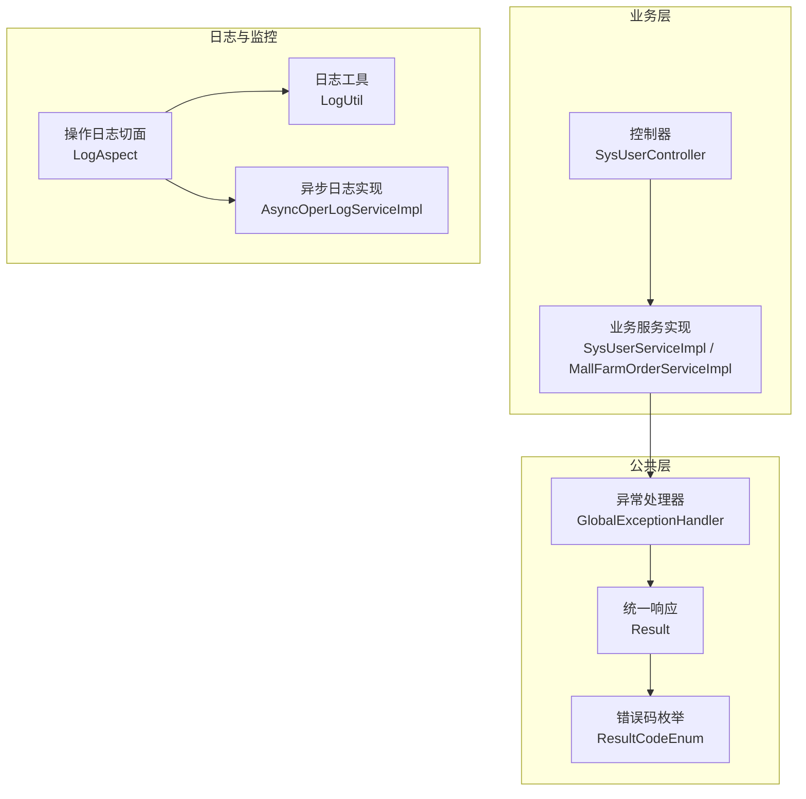
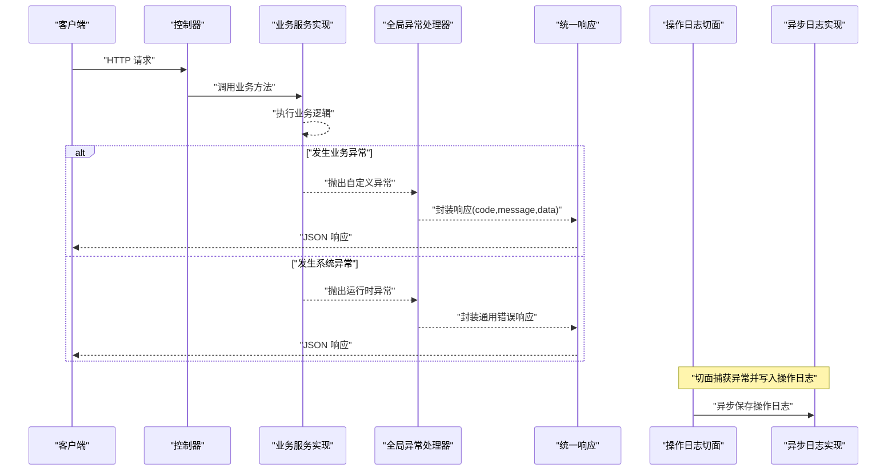
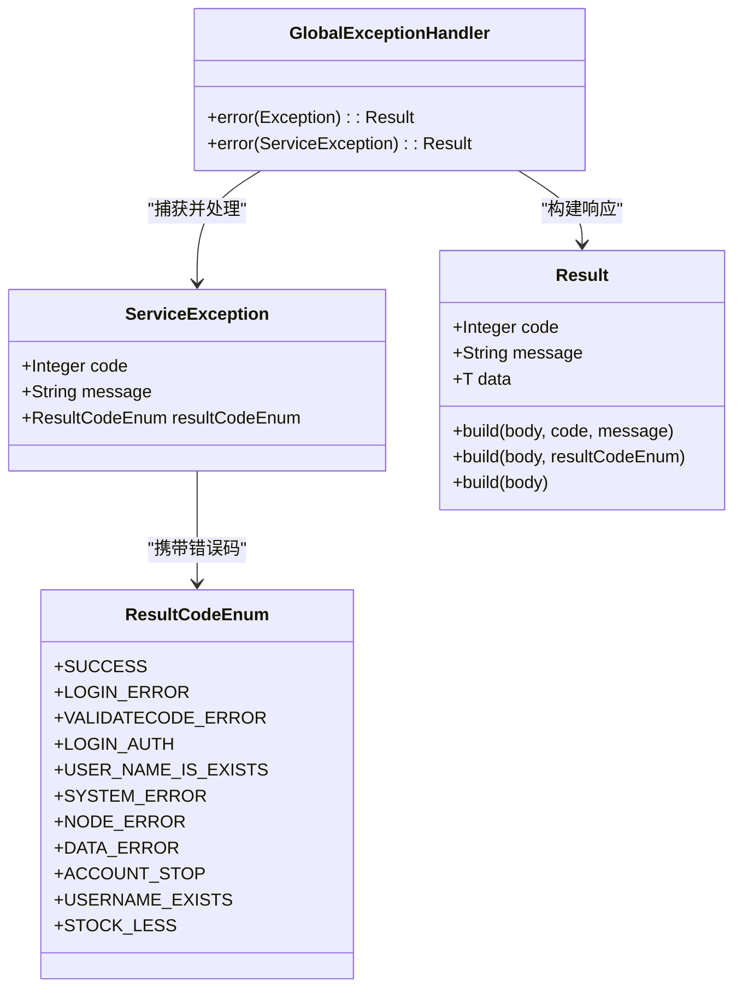
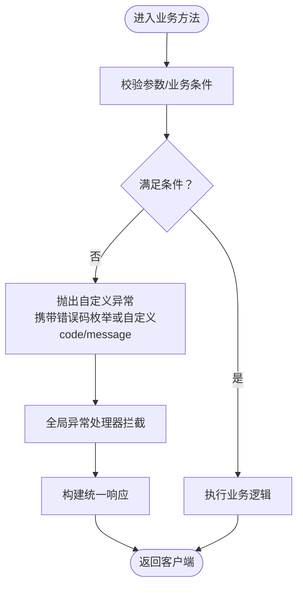
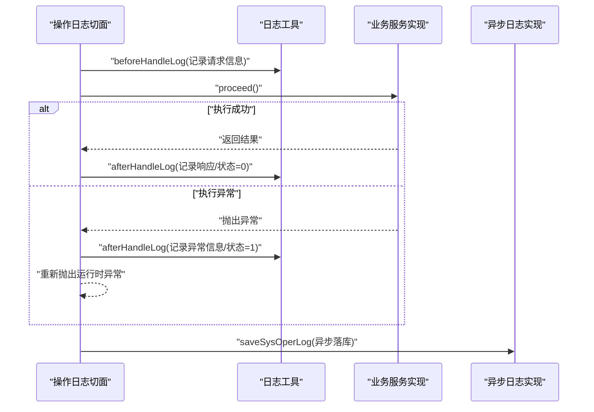
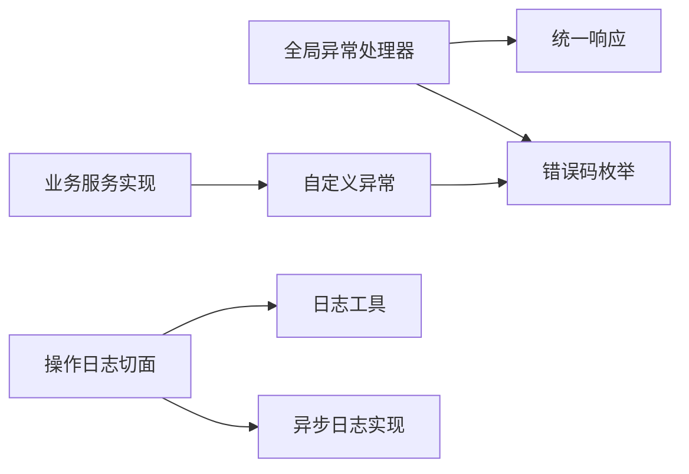

# 异常处理机制

<cite>
**本文引用的文件**
- [GlobalExceptionHandler.java](file://spzx-common/common-service/src/main/java/com/joker/spzx/common/exception/GlobalExceptionHandler.java)
- [ServiceException.java](file://spzx-common/common-service/src/main/java/com/joker/spzx/common/exception/ServiceException.java)
- [Result.java](file://spzx-model/src/main/java/com/joker/spzx/model/vo/common/Result.java)
- [ResultCodeEnum.java](file://spzx-model/src/main/java/com/joker/spzx/model/vo/common/ResultCodeEnum.java)
- [SysUserServiceImpl.java](file://spzx-manager/src/main/java/com/joker/spzx/manager/service/impl/SysUserServiceImpl.java)
- [MallFarmOrderServiceImpl.java](file://spzx-manager/src/main/java/com/joker/spzx/manager/service/impl/MallFarmOrderServiceImpl.java)
- [SysUserController.java](file://spzx-manager/src/main/java/com/joker/spzx/manager/controller/SysUserController.java)
- [LogAspect.java](file://spzx-common/common-log/src/main/java/com/joker/spzx/common/aspect/LogAspect.java)
- [AsyncOperLogServiceImpl.java](file://spzx-manager/src/main/java/com/joker/spzx/manager/service/impl/AsyncOperLogServiceImpl.java)
- [LogUtil.java](file://spzx-common/common-log/src/main/java/com/joker/spzx/common/util/LogUtil.java)
- [ExcelUtil.java](file://spzx-common/common-util/src/main/java/com/joker/spzx/utils/excel/ExcelUtil.java)
- [application.yml](file://spzx-manager/src/main/resources/application.yml)
</cite>

## 目录
1. [简介](#简介)
2. [项目结构](#项目结构)
3. [核心组件](#核心组件)
4. [架构总览](#架构总览)
5. [详细组件分析](#详细组件分析)
6. [依赖分析](#依赖分析)
7. [性能考虑](#性能考虑)
8. [故障排查指南](#故障排查指南)
9. [结论](#结论)
10. [附录](#附录)

## 简介
本文件系统性阐述 SPZX 项目的异常处理机制，覆盖全局异常处理器、自定义异常类、错误码体系与客户端响应格式；解释业务异常、系统异常与参数异常的分类处理策略；给出异常处理流程图、配置项与扩展建议；并说明异常处理在用户体验、系统稳定性与调试支持方面的价值，以及日志记录与异步操作日志的协同机制。

## 项目结构
异常处理相关能力分布在以下模块与包中：
- 公共异常与响应模型：common-service（全局异常处理器）、spzx-model（统一响应与错误码）
- 业务层异常抛出：manager（业务服务实现中抛出自定义异常）
- 日志与监控：common-log（操作日志切面与工具）、manager（异步日志实现）

图表来源
- [GlobalExceptionHandler.java:1-20](file://spzx-common/common-service/src/main/java/com/joker/spzx/common/exception/GlobalExceptionHandler.java#L1-L20)
- [Result.java:1-45](file://spzx-model/src/main/java/com/joker/spzx/model/vo/common/Result.java#L1-L45)
- [ResultCodeEnum.java:1-32](file://spzx-model/src/main/java/com/joker/spzx/model/vo/common/ResultCodeEnum.java#L1-L32)
- [SysUserServiceImpl.java:50-174](file://spzx-manager/src/main/java/com/joker/spzx/manager/service/impl/SysUserServiceImpl.java#L50-L174)
- [MallFarmOrderServiceImpl.java:200-362](file://spzx-manager/src/main/java/com/joker/spzx/manager/service/impl/MallFarmOrderServiceImpl.java#L200-L362)
- [SysUserController.java:1-70](file://spzx-manager/src/main/java/com/joker/spzx/manager/controller/SysUserController.java#L1-L70)
- [LogAspect.java:1-47](file://spzx-common/common-log/src/main/java/com/joker/spzx/common/aspect/LogAspect.java#L1-L47)
- [AsyncOperLogServiceImpl.java:1-22](file://spzx-manager/src/main/java/com/joker/spzx/manager/service/impl/AsyncOperLogServiceImpl.java#L1-L22)
- [LogUtil.java:1-37](file://spzx-common/common-log/src/main/java/com/joker/spzx/common/util/LogUtil.java#L1-L37)

章节来源
- [application.yml:1-5](file://spzx-manager/src/main/resources/application.yml#L1-L5)

## 核心组件
- 全局异常处理器：统一拦截运行时异常与自定义业务异常，封装为统一响应体。
- 自定义异常类：承载业务错误码与消息，并与错误码枚举联动。
- 统一响应模型：标准化 code/message/data 的返回结构。
- 错误码枚举：集中管理业务状态码与消息，便于前端识别与提示。
- 操作日志切面：围绕业务方法进行环绕增强，捕获异常并写入操作日志，同时触发异步落库。

章节来源
- [GlobalExceptionHandler.java:1-20](file://spzx-common/common-service/src/main/java/com/joker/spzx/common/exception/GlobalExceptionHandler.java#L1-L20)
- [ServiceException.java:1-26](file://spzx-common/common-service/src/main/java/com/joker/spzx/common/exception/ServiceException.java#L1-L26)
- [Result.java:1-45](file://spzx-model/src/main/java/com/joker/spzx/model/vo/common/Result.java#L1-L45)
- [ResultCodeEnum.java:1-32](file://spzx-model/src/main/java/com/joker/spzx/model/vo/common/ResultCodeEnum.java#L1-L32)
- [LogAspect.java:1-47](file://spzx-common/common-log/src/main/java/com/joker/spzx/common/aspect/LogAspect.java#L1-L47)

## 架构总览
异常处理在请求生命周期中的流转如下：

图表来源
- [SysUserController.java:1-70](file://spzx-manager/src/main/java/com/joker/spzx/manager/controller/SysUserController.java#L1-L70)
- [SysUserServiceImpl.java:50-174](file://spzx-manager/src/main/java/com/joker/spzx/manager/service/impl/SysUserServiceImpl.java#L50-L174)
- [GlobalExceptionHandler.java:1-20](file://spzx-common/common-service/src/main/java/com/joker/spzx/common/exception/GlobalExceptionHandler.java#L1-L20)
- [Result.java:1-45](file://spzx-model/src/main/java/com/joker/spzx/model/vo/common/Result.java#L1-L45)
- [LogAspect.java:1-47](file://spzx-common/common-log/src/main/java/com/joker/spzx/common/aspect/LogAspect.java#L1-L47)
- [AsyncOperLogServiceImpl.java:1-22](file://spzx-manager/src/main/java/com/joker/spzx/manager/service/impl/AsyncOperLogServiceImpl.java#L1-L22)

## 详细组件分析

### 全局异常处理器
- 职责：作为@RestControllerAdvice，对控制器抛出的异常进行统一拦截与转换。
- 处理策略：
  - 捕获通用异常：返回固定错误码与提示信息。
  - 捕获自定义业务异常：读取异常内封装的错误码枚举或自定义 code/message，生成统一响应。
- 响应格式：基于统一响应模型，包含 code、message、data 字段。

图表来源
- [GlobalExceptionHandler.java:1-20](file://spzx-common/common-service/src/main/java/com/joker/spzx/common/exception/GlobalExceptionHandler.java#L1-L20)
- [ServiceException.java:1-26](file://spzx-common/common-service/src/main/java/com/joker/spzx/common/exception/ServiceException.java#L1-L26)
- [Result.java:1-45](file://spzx-model/src/main/java/com/joker/spzx/model/vo/common/Result.java#L1-L45)
- [ResultCodeEnum.java:1-32](file://spzx-model/src/main/java/com/joker/spzx/model/vo/common/ResultCodeEnum.java#L1-L32)

章节来源
- [GlobalExceptionHandler.java:1-20](file://spzx-common/common-service/src/main/java/com/joker/spzx/common/exception/GlobalExceptionHandler.java#L1-L20)

### 自定义异常类与错误码体系
- 自定义异常类：承载业务错误码与消息，支持两种构造方式（枚举/自定义 code/message）。
- 错误码枚举：集中定义业务状态码与消息，便于前后端约定与国际化扩展。
- 使用场景：
  - 参数校验失败：可直接抛出自定义异常并选择合适的错误码。
  - 业务规则不满足：如登录失败、验证码错误、用户名已存在等。
  - 数据异常：如库存不足、数据异常等。

图表来源
- [ServiceException.java:1-26](file://spzx-common/common-service/src/main/java/com/joker/spzx/common/exception/ServiceException.java#L1-L26)
- [ResultCodeEnum.java:1-32](file://spzx-model/src/main/java/com/joker/spzx/model/vo/common/ResultCodeEnum.java#L1-L32)
- [SysUserServiceImpl.java:50-174](file://spzx-manager/src/main/java/com/joker/spzx/manager/service/impl/SysUserServiceImpl.java#L50-L174)
- [MallFarmOrderServiceImpl.java:200-220](file://spzx-manager/src/main/java/com/joker/spzx/manager/service/impl/MallFarmOrderServiceImpl.java#L200-L220)

章节来源
- [ServiceException.java:1-26](file://spzx-common/common-service/src/main/java/com/joker/spzx/common/exception/ServiceException.java#L1-L26)
- [ResultCodeEnum.java:1-32](file://spzx-model/src/main/java/com/joker/spzx/model/vo/common/ResultCodeEnum.java#L1-L32)
- [SysUserServiceImpl.java:50-174](file://spzx-manager/src/main/java/com/joker/spzx/manager/service/impl/SysUserServiceImpl.java#L50-L174)
- [MallFarmOrderServiceImpl.java:200-220](file://spzx-manager/src/main/java/com/joker/spzx/manager/service/impl/MallFarmOrderServiceImpl.java#L200-L220)

### 控制器与统一响应
- 控制器返回值统一使用统一响应模型，确保客户端收到一致的响应结构。
- 对于业务异常，由全局异常处理器接管并转换为标准响应；对于系统异常，同样转换为统一错误响应。

章节来源
- [SysUserController.java:1-70](file://spzx-manager/src/main/java/com/joker/spzx/manager/controller/SysUserController.java#L1-L70)
- [Result.java:1-45](file://spzx-model/src/main/java/com/joker/spzx/model/vo/common/Result.java#L1-L45)

### 操作日志切面与异步日志
- 切面围绕标注了操作日志注解的方法进行环绕增强，捕获异常并写入操作日志。
- 异步保存日志，避免阻塞主业务线程。
- 日志工具负责组装请求上下文、响应结果与异常信息。

图表来源
- [LogAspect.java:1-47](file://spzx-common/common-log/src/main/java/com/joker/spzx/common/aspect/LogAspect.java#L1-L47)
- [LogUtil.java:1-37](file://spzx-common/common-log/src/main/java/com/joker/spzx/common/util/LogUtil.java#L1-L37)
- [AsyncOperLogServiceImpl.java:1-22](file://spzx-manager/src/main/java/com/joker/spzx/manager/service/impl/AsyncOperLogServiceImpl.java#L1-L22)

章节来源
- [LogAspect.java:1-47](file://spzx-common/common-log/src/main/java/com/joker/spzx/common/aspect/LogAspect.java#L1-L47)
- [LogUtil.java:1-37](file://spzx-common/common-log/src/main/java/com/joker/spzx/common/util/LogUtil.java#L1-L37)
- [AsyncOperLogServiceImpl.java:1-22](file://spzx-manager/src/main/java/com/joker/spzx/manager/service/impl/AsyncOperLogServiceImpl.java#L1-L22)

### 业务异常示例与参数异常处理
- 业务异常：在登录、用户管理、Excel 导入等场景中，通过抛出自定义异常并选择合适的错误码，实现清晰的错误提示与状态码。
- 参数异常：控制器层使用校验注解与 DTO 参数绑定，参数校验失败通常由 Spring MVC 抛出参数异常，交由全局异常处理器统一转换为标准响应。

章节来源
- [SysUserServiceImpl.java:50-174](file://spzx-manager/src/main/java/com/joker/spzx/manager/service/impl/SysUserServiceImpl.java#L50-L174)
- [MallFarmOrderServiceImpl.java:200-220](file://spzx-manager/src/main/java/com/joker/spzx/manager/service/impl/MallFarmOrderServiceImpl.java#L200-L220)
- [SysUserController.java:1-70](file://spzx-manager/src/main/java/com/joker/spzx/manager/controller/SysUserController.java#L1-L70)

## 依赖分析
- 全局异常处理器依赖统一响应模型与错误码枚举，用于构造标准响应。
- 业务服务实现依赖自定义异常类与错误码枚举，用于抛出带业务含义的异常。
- 操作日志切面依赖日志工具与异步日志实现，形成“环绕增强 + 异步落库”的日志链路。

图表来源
- [GlobalExceptionHandler.java:1-20](file://spzx-common/common-service/src/main/java/com/joker/spzx/common/exception/GlobalExceptionHandler.java#L1-L20)
- [Result.java:1-45](file://spzx-model/src/main/java/com/joker/spzx/model/vo/common/Result.java#L1-L45)
- [ResultCodeEnum.java:1-32](file://spzx-model/src/main/java/com/joker/spzx/model/vo/common/ResultCodeEnum.java#L1-L32)
- [ServiceException.java:1-26](file://spzx-common/common-service/src/main/java/com/joker/spzx/common/exception/ServiceException.java#L1-L26)
- [LogAspect.java:1-47](file://spzx-common/common-log/src/main/java/com/joker/spzx/common/aspect/LogAspect.java#L1-L47)
- [LogUtil.java:1-37](file://spzx-common/common-log/src/main/java/com/joker/spzx/common/util/LogUtil.java#L1-L37)
- [AsyncOperLogServiceImpl.java:1-22](file://spzx-manager/src/main/java/com/joker/spzx/manager/service/impl/AsyncOperLogServiceImpl.java#L1-L22)

章节来源
- [GlobalExceptionHandler.java:1-20](file://spzx-common/common-service/src/main/java/com/joker/spzx/common/exception/GlobalExceptionHandler.java#L1-L20)
- [ServiceException.java:1-26](file://spzx-common/common-service/src/main/java/com/joker/spzx/common/exception/ServiceException.java#L1-L26)
- [Result.java:1-45](file://spzx-model/src/main/java/com/joker/spzx/model/vo/common/Result.java#L1-L45)
- [ResultCodeEnum.java:1-32](file://spzx-model/src/main/java/com/joker/spzx/model/vo/common/ResultCodeEnum.java#L1-L32)
- [LogAspect.java:1-47](file://spzx-common/common-log/src/main/java/com/joker/spzx/common/aspect/LogAspect.java#L1-L47)
- [AsyncOperLogServiceImpl.java:1-22](file://spzx-manager/src/main/java/com/joker/spzx/manager/service/impl/AsyncOperLogServiceImpl.java#L1-L22)

## 性能考虑
- 异步日志：将日志写入数据库的操作异步化，降低对主业务路径的影响。
- 统一异常处理：减少重复的 try-catch 与响应封装逻辑，提升开发效率与一致性。
- 错误码枚举：集中管理错误码，避免硬编码，便于缓存与前端复用。

## 故障排查指南
- 定位异常来源：结合操作日志切面记录的异常信息与状态，快速定位问题方法与上下文。
- 统一响应格式：客户端按 code/message/data 结构解析，便于前端统一提示与降级处理。
- 系统异常兜底：当业务异常未覆盖时，全局异常处理器仍会返回统一错误响应，保障接口稳定性。
- 日志落库：确认异步日志实现是否正常工作，避免因数据库异常导致日志丢失。

章节来源
- [LogAspect.java:1-47](file://spzx-common/common-log/src/main/java/com/joker/spzx/common/aspect/LogAspect.java#L1-L47)
- [AsyncOperLogServiceImpl.java:1-22](file://spzx-manager/src/main/java/com/joker/spzx/manager/service/impl/AsyncOperLogServiceImpl.java#L1-L22)
- [GlobalExceptionHandler.java:1-20](file://spzx-common/common-service/src/main/java/com/joker/spzx/common/exception/GlobalExceptionHandler.java#L1-L20)

## 结论
SPZX 项目的异常处理机制以“统一响应 + 自定义异常 + 全局处理器”为核心，配合“操作日志切面 + 异步日志实现”，实现了对业务异常、系统异常与参数异常的统一治理。该机制在提升用户体验、保证系统稳定性的同时，也为调试与审计提供了可靠支撑。建议后续扩展：
- 引入更细粒度的异常分类与国际化支持；
- 在网关层增加统一的异常映射与限流保护；
- 完善异常监控与告警（如接入链路追踪与指标采集）。

## 附录

### 响应格式规范
- 字段说明
  - code：业务状态码（整型）
  - message：响应消息（字符串）
  - data：业务数据（泛型）

章节来源
- [Result.java:1-45](file://spzx-model/src/main/java/com/joker/spzx/model/vo/common/Result.java#L1-L45)

### 错误码枚举参考
- 可用错误码（示例）
  - 成功：200
  - 登录错误：201
  - 验证码错误：202
  - 未登录：208
  - 用户名已存在：209
  - 系统错误：9999
  - 节点下有子节点不可删除：217
  - 数据异常：204
  - 账号停用：216
  - 库存不足：219

章节来源
- [ResultCodeEnum.java:1-32](file://spzx-model/src/main/java/com/joker/spzx/model/vo/common/ResultCodeEnum.java#L1-L32)

### 配置与扩展建议
- 环境配置：通过应用配置文件切换环境，便于在不同环境下调整日志级别与行为。
- 扩展点：
  - 新增错误码：在错误码枚举中添加新条目；
  - 自定义异常：继承自定义异常类并选择合适错误码；
  - 全局异常处理器：可按需新增特定异常类型的处理器；
  - 日志增强：在切面中扩展更多上下文信息（如用户标识、租户信息等）。

章节来源
- [application.yml:1-5](file://spzx-manager/src/main/resources/application.yml#L1-L5)
- [GlobalExceptionHandler.java:1-20](file://spzx-common/common-service/src/main/java/com/joker/spzx/common/exception/GlobalExceptionHandler.java#L1-L20)
- [ServiceException.java:1-26](file://spzx-common/common-service/src/main/java/com/joker/spzx/common/exception/ServiceException.java#L1-L26)
- [ResultCodeEnum.java:1-32](file://spzx-model/src/main/java/com/joker/spzx/model/vo/common/ResultCodeEnum.java#L1-L32)
- [LogAspect.java:1-47](file://spzx-common/common-log/src/main/java/com/joker/spzx/common/aspect/LogAspect.java#L1-L47)