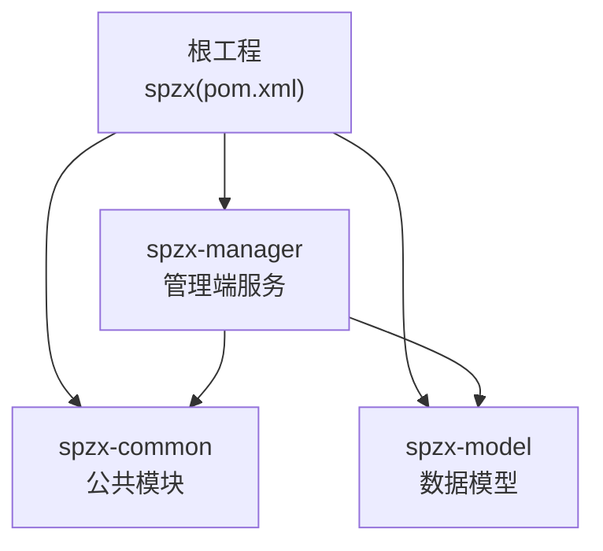
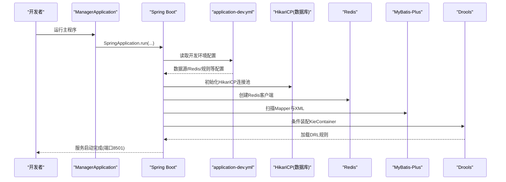
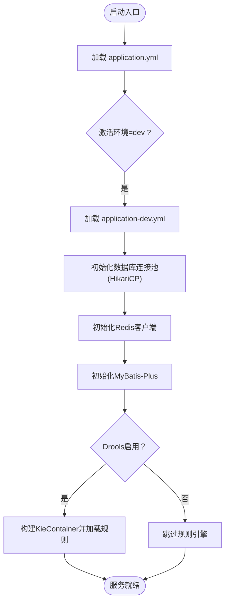
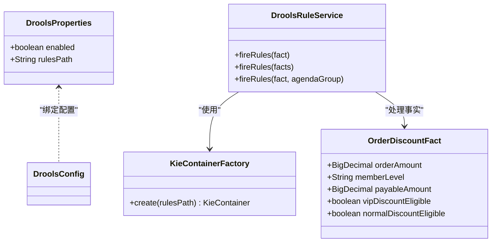
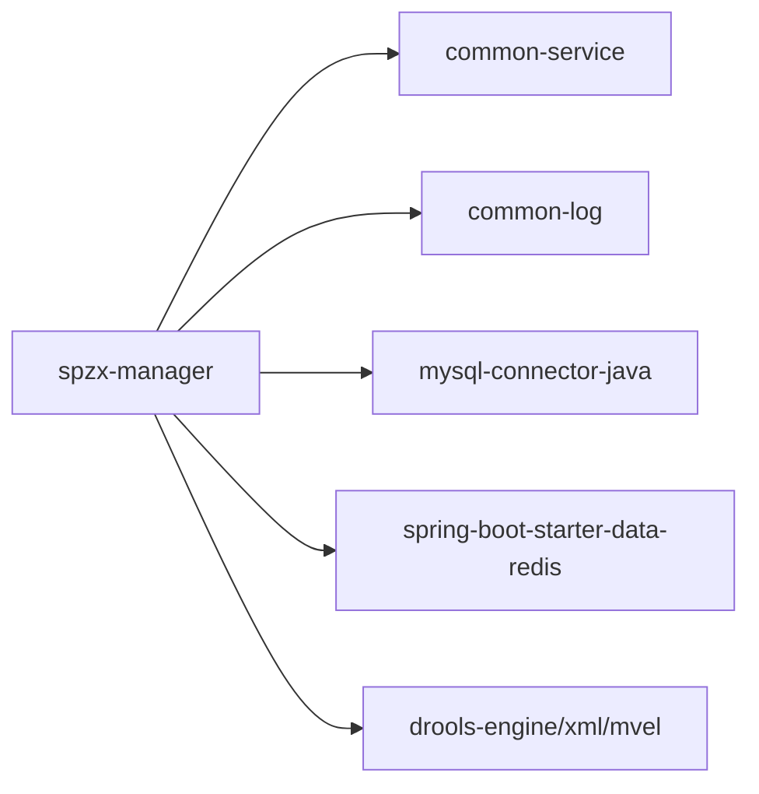

# 快速开始

<cite>
**本文引用的文件**
- [根POM](file://pom.xml)
- [管理端模块POM](file://spzx-manager/pom.xml)
- [管理端应用入口](file://spzx-manager/src/main/java/com/joker/spzx/manager/ManagerApplication.java)
- [管理端应用配置(application.yml)](file://spzx-manager/src/main/resources/application.yml)
- [管理端开发环境配置(application-dev.yml)](file://spzx-manager/src/main/resources/application-dev.yml)
- [管理端日志配置(log4j2-spring.xml)](file://spzx-manager/src/main/resources/log4j2-spring.xml)
- [Drools配置类](file://spzx-manager/src/main/java/com/joker/spzx/manager/config/DroolsConfig.java)
- [Drools属性配置类](file://spzx-manager/src/main/java/com/joker/spzx/manager/config/DroolsProperties.java)
- [Drools容器工厂](file://spzx-manager/src/main/java/com/joker/spzx/manager/drools/KieContainerFactory.java)
- [Drools规则服务](file://spzx-manager/src/main/java/com/joker/spzx/manager/drools/DroolsRuleService.java)
- [Drools规则模型(OrderDiscountFact)](file://spzx-manager/src/main/java/com/joker/spzx/manager/drools/model/OrderDiscountFact.java)
- [Drools规则定义(order-discount.drl)](file://spzx-manager/src/main/resources/rules/order-discount.drl)
- [Drools模块声明(kmodule.xml)](file://spzx-manager/src/main/resources/META-INF/kmodule.xml)
- [通用日志模块POM](file://spzx-common/common-log/pom.xml)
</cite>

## 目录
1. [简介](#简介)
2. [项目结构](#项目结构)
3. [核心组件](#核心组件)
4. [架构总览](#架构总览)
5. [详细组件分析](#详细组件分析)
6. [依赖分析](#依赖分析)
7. [性能考虑](#性能考虑)
8. [故障排查指南](#故障排查指南)
9. [结论](#结论)
10. [附录](#附录)

## 简介
本指南面向新加入的开发者，帮助你在30分钟内完成SPZX电商管理系统的开发环境搭建与首次启动。内容覆盖JDK 21、Maven、数据库与缓存等基础设施准备，项目的克隆、依赖安装与启动流程，并提供配置文件修改示例、常见问题解决与调试技巧。同时给出开发工具推荐与IDE配置建议，确保你能快速上手。

## 项目结构
SPZX采用多模块Maven聚合工程组织，核心模块包括：
- spzx-common：公共能力（日志、异常、工具）
- spzx-model：实体与DTO/VO模型
- spzx-manager：业务管理端微服务

图表来源
- [根POM:11-15](file://pom.xml#L11-L15)
- [管理端模块POM:6-10](file://spzx-manager/pom.xml#L6-L10)

章节来源
- [根POM:1-90](file://pom.xml#L1-L90)
- [管理端模块POM:1-101](file://spzx-manager/pom.xml#L1-L101)

## 核心组件
- 应用入口与启动
  - 管理端应用入口类负责引导Spring Boot应用启动。
  - 参考路径：[管理端应用入口:10-14](file://spzx-manager/src/main/java/com/joker/spzx/manager/ManagerApplication.java#L10-L14)

- 配置体系
  - 应用名称与激活环境：[管理端应用配置(application.yml):1-5](file://spzx-manager/src/main/resources/application.yml#L1-L5)
  - 开发环境数据库、Redis、MyBatis-Plus、Drools等配置：[管理端开发环境配置(application-dev.yml):1-65](file://spzx-manager/src/main/resources/application-dev.yml#L1-L65)

- 日志与监控
  - 控制台日志输出配置：[管理端日志配置(log4j2-spring.xml):1-13](file://spzx-manager/src/main/resources/log4j2-spring.xml#L1-L13)

- 规则引擎（Drools）
  - 启用开关与规则目录：[管理端开发环境配置(application-dev.yml):48-52](file://spzx-manager/src/main/resources/application-dev.yml#L48-L52)
  - 配置类与容器工厂：[Drools配置类:1-23](file://spzx-manager/src/main/java/com/joker/spzx/manager/config/DroolsConfig.java#L1-L23)、[Drools容器工厂:1-23](file://spzx-manager/src/main/java/com/joker/spzx/manager/drools/KieContainerFactory.java#L1-L23)
  - 规则服务与示例规则：[Drools规则服务:1-53](file://spzx-manager/src/main/java/com/joker/spzx/manager/drools/DroolsRuleService.java#L1-L53)、[Drools规则定义(order-discount.drl):1-20](file://spzx-manager/src/main/resources/rules/order-discount.drl#L1-L20)

章节来源
- [管理端应用入口:1-20](file://spzx-manager/src/main/java/com/joker/spzx/manager/ManagerApplication.java#L1-L20)
- [管理端应用配置(application.yml):1-5](file://spzx-manager/src/main/resources/application.yml#L1-L5)
- [管理端开发环境配置(application-dev.yml):1-65](file://spzx-manager/src/main/resources/application-dev.yml#L1-L65)
- [管理端日志配置(log4j2-spring.xml):1-13](file://spzx-manager/src/main/resources/log4j2-spring.xml#L1-L13)
- [Drools配置类:1-23](file://spzx-manager/src/main/java/com/joker/spzx/manager/config/DroolsConfig.java#L1-L23)
- [Drools容器工厂:1-23](file://spzx-manager/src/main/java/com/joker/spzx/manager/drools/KieContainerFactory.java#L1-L23)
- [Drools规则服务:1-53](file://spzx-manager/src/main/java/com/joker/spzx/manager/drools/DroolsRuleService.java#L1-L53)
- [Drools规则定义(order-discount.drl):1-20](file://spzx-manager/src/main/resources/rules/order-discount.drl#L1-L20)

## 架构总览
下图展示了管理端启动时的关键交互：应用入口引导Spring Boot启动，加载开发环境配置，初始化数据库连接池、Redis客户端、MyBatis-Plus与Drools规则引擎。

图表来源
- [管理端应用入口:10-14](file://spzx-manager/src/main/java/com/joker/spzx/manager/ManagerApplication.java#L10-L14)
- [管理端开发环境配置(application-dev.yml):1-65](file://spzx-manager/src/main/resources/application-dev.yml#L1-L65)
- [Drools配置类:17-22](file://spzx-manager/src/main/java/com/joker/spzx/manager/config/DroolsConfig.java#L17-L22)

## 详细组件分析

### 组件A：应用启动与配置加载
- 启动类职责：通过SpringApplication.run启动应用上下文。
- 配置加载顺序：application.yml -> application-dev.yml -> 资源过滤与打包。
- 关键点：
  - 环境激活：dev
  - 服务器端口：8501
  - 数据源：HikariCP + MySQL
  - 缓存：Redis
  - ORM：MyBatis-Plus
  - 规则引擎：Drools

图表来源
- [管理端应用配置(application.yml):1-5](file://spzx-manager/src/main/resources/application.yml#L1-L5)
- [管理端开发环境配置(application-dev.yml):1-65](file://spzx-manager/src/main/resources/application-dev.yml#L1-L65)
- [Drools配置类:16-22](file://spzx-manager/src/main/java/com/joker/spzx/manager/config/DroolsConfig.java#L16-L22)

章节来源
- [管理端应用入口:1-20](file://spzx-manager/src/main/java/com/joker/spzx/manager/ManagerApplication.java#L1-L20)
- [管理端应用配置(application.yml):1-5](file://spzx-manager/src/main/resources/application.yml#L1-L5)
- [管理端开发环境配置(application-dev.yml):1-65](file://spzx-manager/src/main/resources/application-dev.yml#L1-L65)

### 组件B：规则引擎（Drools）集成
- 配置要点
  - 启用开关：drools.enabled=true
  - 规则目录：drools.rules-path=rules/
  - 容器加载：基于classpath下的kmodule.xml与rules/*.drl
- 运行机制
  - 工厂类创建KieContainer
  - 规则服务在会话中插入事实并触发规则
  - 示例规则对订单折扣进行计算

图表来源
- [Drools属性配置类:1-19](file://spzx-manager/src/main/java/com/joker/spzx/manager/config/DroolsProperties.java#L1-L19)
- [Drools容器工厂:1-23](file://spzx-manager/src/main/java/com/joker/spzx/manager/drools/KieContainerFactory.java#L1-L23)
- [Drools规则服务:1-53](file://spzx-manager/src/main/java/com/joker/spzx/manager/drools/DroolsRuleService.java#L1-L53)
- [Drools规则模型(OrderDiscountFact):1-39](file://spzx-manager/src/main/java/com/joker/spzx/manager/drools/model/OrderDiscountFact.java#L1-L39)

章节来源
- [Drools配置类:1-23](file://spzx-manager/src/main/java/com/joker/spzx/manager/config/DroolsConfig.java#L1-L23)
- [Drools容器工厂:1-23](file://spzx-manager/src/main/java/com/joker/spzx/manager/drools/KieContainerFactory.java#L1-L23)
- [Drools规则服务:1-53](file://spzx-manager/src/main/java/com/joker/spzx/manager/drools/DroolsRuleService.java#L1-L53)
- [Drools规则模型(OrderDiscountFact):1-39](file://spzx-manager/src/main/java/com/joker/spzx/manager/drools/model/OrderDiscountFact.java#L1-L39)
- [Drools规则定义(order-discount.drl):1-20](file://spzx-manager/src/main/resources/rules/order-discount.drl#L1-L20)
- [Drools模块声明(kmodule.xml):1-6](file://spzx-manager/src/main/resources/META-INF/kmodule.xml#L1-L6)

## 依赖分析
- 版本与工具链
  - JDK：21
  - Maven：标准插件与资源过滤
  - Spring Boot：3.3.5父工程
  - MyBatis-Plus：3.5.9起步依赖
  - MySQL Connector：8.0.33
  - Lombok：1.18.34
  - Drools：8.44.2.Final（通过BOM统一管理）

- 模块间依赖
  - spzx-manager依赖common-service与common-log，以及MySQL驱动、Redis Starter、Drools相关依赖。

图表来源
- [根POM:37-75](file://pom.xml#L37-L75)
- [管理端模块POM:19-83](file://spzx-manager/pom.xml#L19-L83)
- [通用日志模块POM:33-57](file://spzx-common/common-log/pom.xml#L33-L57)

章节来源
- [根POM:24-75](file://pom.xml#L24-L75)
- [管理端模块POM:14-83](file://spzx-manager/pom.xml#L14-L83)
- [通用日志模块POM:33-57](file://spzx-common/common-log/pom.xml#L33-L57)

## 性能考虑
- 数据库连接池
  - HikariCP参数已在开发配置中设定，如最大连接数、空闲超时、连接生命周期等，适合本地开发场景。
  - 参考路径：[管理端开发环境配置(application-dev.yml):18-32](file://spzx-manager/src/main/resources/application-dev.yml#L18-L32)

- 日志与监控
  - 使用Log4j2控制台输出，便于开发期观察；生产环境建议调整为文件或集中式日志系统。
  - 参考路径：[管理端日志配置(log4j2-spring.xml):1-13](file://spzx-manager/src/main/resources/log4j2-spring.xml#L1-L13)

- 规则引擎
  - Drools仅在启用时装配，避免不必要的开销；规则数量与复杂度会影响会话创建与执行性能。
  - 参考路径：[Drools配置类:16-22](file://spzx-manager/src/main/java/com/joker/spzx/manager/config/DroolsConfig.java#L16-L22)

## 故障排查指南
- 端口占用
  - 默认端口8501，若被占用请在配置中修改端口后重启。
  - 参考路径：[管理端开发环境配置(application-dev.yml):1-2](file://spzx-manager/src/main/resources/application-dev.yml#L1-L2)

- 数据库连接失败
  - 检查URL、用户名、密码与数据库实例连通性；确认MySQL驱动版本与数据库兼容。
  - 参考路径：[管理端开发环境配置(application-dev.yml):12-17](file://spzx-manager/src/main/resources/application-dev.yml#L12-L17)

- Redis连接失败
  - 检查host与port；若无需Redis可将starter依赖设为provided或在配置中禁用。
  - 参考路径：[管理端开发环境配置(application-dev.yml):34-39](file://spzx-manager/src/main/resources/application-dev.yml#L34-L39)

- 规则引擎未生效
  - 确认drools.enabled=true且rules目录存在；检查DRL语法与fact类型匹配。
  - 参考路径：[管理端开发环境配置(application-dev.yml):48-52](file://spzx-manager/src/main/resources/application-dev.yml#L48-L52)、[Drools规则定义(order-discount.drl):1-20](file://spzx-manager/src/main/resources/rules/order-discount.drl#L1-L20)

- 日志输出异常
  - 检查log4j2-spring.xml配置与类路径；确保Log4j2 Starter与Web Starter冲突排除。
  - 参考路径：[管理端日志配置(log4j2-spring.xml):1-13](file://spzx-manager/src/main/resources/log4j2-spring.xml#L1-L13)、[通用日志模块POM:33-57](file://spzx-common/common-log/pom.xml#L33-L57)

章节来源
- [管理端开发环境配置(application-dev.yml):1-65](file://spzx-manager/src/main/resources/application-dev.yml#L1-L65)
- [管理端日志配置(log4j2-spring.xml):1-13](file://spzx-manager/src/main/resources/log4j2-spring.xml#L1-L13)
- [Drools配置类:16-22](file://spzx-manager/src/main/java/com/joker/spzx/manager/config/DroolsConfig.java#L16-L22)
- [Drools规则定义(order-discount.drl):1-20](file://spzx-manager/src/main/resources/rules/order-discount.drl#L1-L20)
- [通用日志模块POM:33-57](file://spzx-common/common-log/pom.xml#L33-L57)

## 结论
按照本指南完成JDK 21、Maven与数据库/缓存的准备，克隆项目、安装依赖并启动管理端服务，即可在30分钟内完成首次运行。遇到问题时，优先检查配置文件与端口/数据库/Redis连通性，结合日志定位问题。后续可按需扩展规则引擎与功能模块。

## 附录

### A. 开发环境搭建步骤
- JDK 21
  - 安装JDK 21并配置JAVA_HOME与PATH。
  - Maven编译版本已在根POM中锁定至21。
  - 参考路径：[根POM:24-26](file://pom.xml#L24-L26)

- Maven
  - 安装Maven并配置镜像加速（可选）。
  - 在项目根目录执行依赖安装与打包命令。

- MySQL
  - 安装MySQL并创建数据库db_spzx。
  - 修改配置中的数据库URL、用户名与密码。
  - 参考路径：[管理端开发环境配置(application-dev.yml):12-17](file://spzx-manager/src/main/resources/application-dev.yml#L12-L17)

- Redis（可选）
  - 若使用缓存功能，请先启动Redis服务。
  - 参考路径：[管理端开发环境配置(application-dev.yml):34-39](file://spzx-manager/src/main/resources/application-dev.yml#L34-L39)

### B. 项目克隆、依赖安装与启动
- 克隆仓库到本地
- 在根目录执行Maven命令安装依赖与打包
- 启动管理端应用
  - 参考路径：[管理端应用入口:10-14](file://spzx-manager/src/main/java/com/joker/spzx/manager/ManagerApplication.java#L10-L14)

### C. 配置文件修改示例
- 切换环境
  - 将application.yml中的profiles.active改为dev
  - 参考路径：[管理端应用配置(application.yml):4-5](file://spzx-manager/src/main/resources/application.yml#L4-L5)

- 修改数据库连接
  - 更新application-dev.yml中的datasource.url、username、password
  - 参考路径：[管理端开发环境配置(application-dev.yml):12-17](file://spzx-manager/src/main/resources/application-dev.yml#L12-L17)

- 修改服务器端口
  - 更新application-dev.yml中的server.port
  - 参考路径：[管理端开发环境配置(application-dev.yml):1-2](file://spzx-manager/src/main/resources/application-dev.yml#L1-L2)

- 启用/禁用规则引擎
  - 设置drools.enabled=true/false
  - 参考路径：[管理端开发环境配置(application-dev.yml):48-52](file://spzx-manager/src/main/resources/application-dev.yml#L48-L52)

### D. 常见问题与调试技巧
- 端口冲突
  - 修改server.port后重启服务
  - 参考路径：[管理端开发环境配置(application-dev.yml):1-2](file://spzx-manager/src/main/resources/application-dev.yml#L1-L2)

- 数据库无法连接
  - 检查MySQL服务状态、网络连通与账号权限
  - 参考路径：[管理端开发环境配置(application-dev.yml):12-17](file://spzx-manager/src/main/resources/application-dev.yml#L12-L17)

- 规则不生效
  - 确认DRL文件与fact类型一致，且规则目录正确
  - 参考路径：[Drools规则定义(order-discount.drl):1-20](file://spzx-manager/src/main/resources/rules/order-discount.drl#L1-L20)

- 日志输出
  - 使用控制台日志观察启动与请求日志
  - 参考路径：[管理端日志配置(log4j2-spring.xml):1-13](file://spzx-manager/src/main/resources/log4j2-spring.xml#L1-L13)

### E. 开发工具推荐与IDE配置
- 推荐工具
  - IDE：IntelliJ IDEA
  - 插件：Lombok、MyBatis Log、Drools支持（可选）
  - 代码格式化：使用项目级checkstyle或IDE自带格式化
- IDE配置要点
  - JDK选择21
  - Maven导入后勾选“Use plugin registry”与“Import Maven projects automatically”
  - 启用注解处理器（Lombok）
  - 运行配置：选择ManagerApplication作为主类，VM选项可保留默认