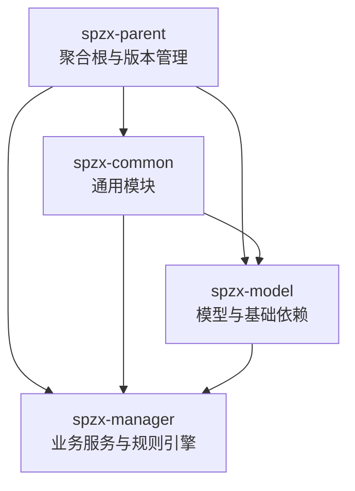
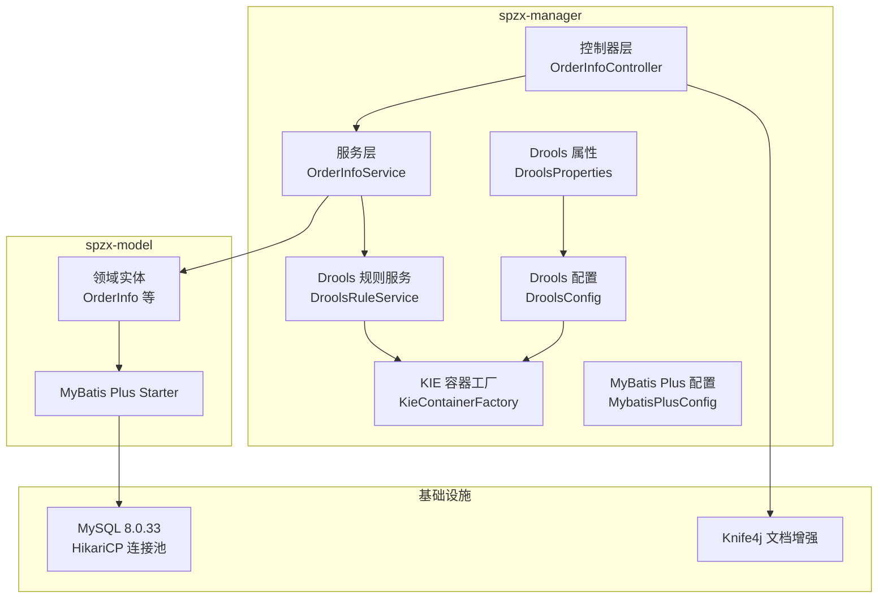
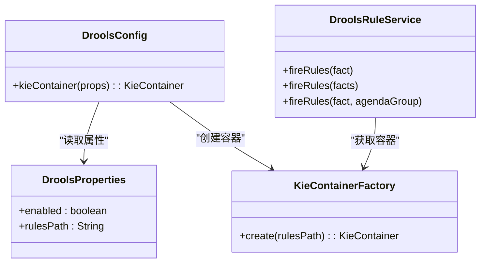
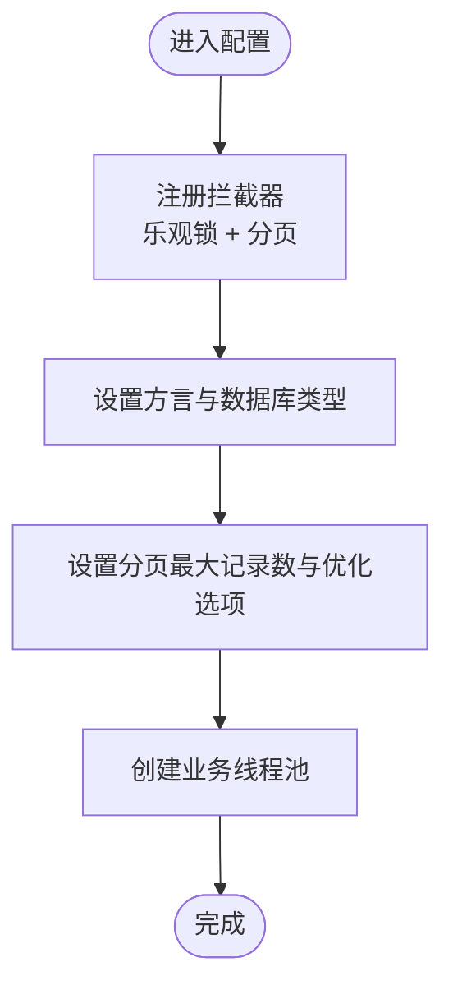
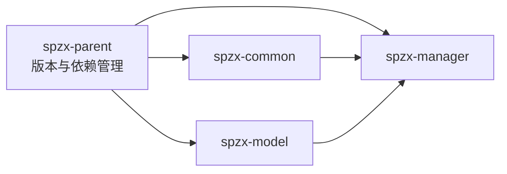

# 技术栈与依赖

<cite>
**本文引用的文件**
- [根POM](file://pom.xml)
- [spzx-manager 模块 POM](file://spzx-manager/pom.xml)
- [spzx-common 模块 POM](file://spzx-common/pom.xml)
- [spzx-model 模块 POM](file://spzx-model/pom.xml)
- [Drools 配置类](file://spzx-manager/src/main/java/com/joker/spzx/manager/config/DroolsConfig.java)
- [Drools 属性类](file://spzx-manager/src/main/java/com/joker/spzx/manager/config/DroolsProperties.java)
- [MyBatis Plus 配置类](file://spzx-manager/src/main/java/com/joker/spzx/manager/config/MybatisPlusConfig.java)
- [Knife4j 配置类](file://spzx-common/common-service/src/main/java/com/joker/spzx/common/config/Knife4jConfig.java)
- [应用配置（dev）](file://spzx-manager/src/main/resources/application-dev.yml)
- [应用配置（主）](file://spzx-manager/src/main/resources/application.yml)
- [KIE 容器工厂](file://spzx-manager/src/main/java/com/joker/spzx/manager/drools/KieContainerFactory.java)
- [Drools 规则服务](file://spzx-manager/src/main/java/com/joker/spzx/manager/drools/DroolsRuleService.java)
- [订单实体示例](file://spzx-model/src/main/java/com/joker/spzx/model/entity/order/OrderInfo.java)
- [全局异常处理器](file://spzx-common/common-service/src/main/java/com/joker/spzx/common/exception/GlobalExceptionHandler.java)
- [订单控制器示例](file://spzx-manager/src/main/java/com/joker/spzx/manager/controller/OrderInfoController.java)
- [Drools 模块声明](file://spzx-manager/src/main/resources/META-INF/kmodule.xml)
</cite>

## 目录
1. [引言](#引言)
2. [项目结构](#项目结构)
3. [核心组件](#核心组件)
4. [架构总览](#架构总览)
5. [详细组件分析](#详细组件分析)
6. [依赖分析](#依赖分析)
7. [性能考虑](#性能考虑)
8. [故障排查指南](#故障排查指南)
9. [结论](#结论)
10. [附录：技术选型对比与替代方案](#附录技术选型对比与替代方案)

## 引言
本文件面向 SPZX 项目的开发者与架构师，系统梳理并解释项目所采用的技术栈与依赖管理策略，重点覆盖以下方面：
- 核心框架与中间件：Spring Boot 3.4.0、MyBatis Plus 3.5.9、MySQL 8.0.33、Drools 8.44.2.Final
- 工具库与增强：Lombok、FastJSON、Knife4j
- 版本锁定与依赖管理：通过父 POM 的 dependencyManagement 实现统一版本控制
- 模块化组织与模块间依赖关系
- 性能、安全与扩展性分析
- 替代方案与选型权衡

## 项目结构
SPZX 采用多模块 Maven 结构，核心模块包括：
- spzx-parent：聚合根，负责统一版本与依赖管理
- spzx-common：通用能力模块（日志、异常、工具）
- spzx-model：领域模型与数据访问基础依赖
- spzx-manager：业务服务模块（控制器、服务、规则引擎、MyBatis Plus 配置）

图表来源
- [根POM:1-90](file://pom.xml#L1-L90)
- [spzx-common 模块 POM:1-44](file://spzx-common/pom.xml#L1-L44)
- [spzx-model 模块 POM:1-82](file://spzx-model/pom.xml#L1-L82)
- [spzx-manager 模块 POM:1-101](file://spzx-manager/pom.xml#L1-L101)

章节来源
- [根POM:1-90](file://pom.xml#L1-L90)
- [spzx-common 模块 POM:1-44](file://spzx-common/pom.xml#L1-L44)
- [spzx-model 模块 POM:1-82](file://spzx-model/pom.xml#L1-L82)
- [spzx-manager 模块 POM:1-101](file://spzx-manager/pom.xml#L1-L101)

## 核心组件
本节聚焦于各技术组件在项目中的定位、作用与配置要点。

- Spring Boot 3.4.0
  - 作为应用启动与自动装配核心，提供 Web、JDBC、Redis、测试等生态支持
  - 在 spzx-manager 中以 starter 形式引入，并通过 spring.factories 等机制实现自动装配
  - 与 MyBatis Plus、Drools、Knife4j 等组件协同工作

- MyBatis Plus 3.5.9
  - 提供代码生成、分页、乐观锁、SQL 注入拦截器等能力
  - 在 spzx-manager 中通过 MyBatis Plus 配置类注册拦截器与线程池
  - 在 spzx-model 中引入 starter 与代码生成器，支撑实体与 Mapper 快速开发

- MySQL 8.0.33
  - 使用 HikariCP 作为连接池，配置连接池大小、超时、预编译缓存等参数
  - 在 application-dev.yml 中集中配置数据源与连接参数

- Drools 8.44.2.Final
  - 通过 KIE 容器加载 classpath 下的规则文件，提供运行时规则执行
  - 支持按 Agenda Group 聚焦执行，便于模块化规则调度
  - 通过属性类与配置类实现开关与路径控制

- Lombok、FastJSON、Knife4j
  - Lombok：简化实体类与配置类样板代码
  - FastJSON：JSON 序列化与反序列化
  - Knife4j：OpenAPI 文档增强，按路径分组与自定义信息

章节来源
- [MyBatis Plus 配置类:1-132](file://spzx-manager/src/main/java/com/joker/spzx/manager/config/MybatisPlusConfig.java#L1-L132)
- [应用配置（dev）:1-65](file://spzx-manager/src/main/resources/application-dev.yml#L1-L65)
- [Drools 配置类:1-24](file://spzx-manager/src/main/java/com/joker/spzx/manager/config/DroolsConfig.java#L1-L24)
- [Drools 属性类:1-20](file://spzx-manager/src/main/java/com/joker/spzx/manager/config/DroolsProperties.java#L1-L20)
- [Knife4j 配置类:1-36](file://spzx-common/common-service/src/main/java/com/joker/spzx/common/config/Knife4jConfig.java#L1-L36)
- [spzx-manager 模块 POM:1-101](file://spzx-manager/pom.xml#L1-L101)
- [spzx-model 模块 POM:1-82](file://spzx-model/pom.xml#L1-L82)

## 架构总览
下图展示 SPZX 的技术架构与模块交互关系，突出规则引擎、持久层与文档增强的关键位置。

图表来源
- [订单控制器示例:1-34](file://spzx-manager/src/main/java/com/joker/spzx/manager/controller/OrderInfoController.java#L1-L34)
- [Drools 配置类:1-24](file://spzx-manager/src/main/java/com/joker/spzx/manager/config/DroolsConfig.java#L1-L24)
- [Drools 属性类:1-20](file://spzx-manager/src/main/java/com/joker/spzx/manager/config/DroolsProperties.java#L1-L20)
- [KIE 容器工厂:1-24](file://spzx-manager/src/main/java/com/joker/spzx/manager/drools/KieContainerFactory.java#L1-L24)
- [Drools 规则服务:1-54](file://spzx-manager/src/main/java/com/joker/spzx/manager/drools/DroolsRuleService.java#L1-L54)
- [MyBatis Plus 配置类:1-132](file://spzx-manager/src/main/java/com/joker/spzx/manager/config/MybatisPlusConfig.java#L1-L132)
- [订单实体示例:1-113](file://spzx-model/src/main/java/com/joker/spzx/model/entity/order/OrderInfo.java#L1-L113)
- [应用配置（dev）:1-65](file://spzx-manager/src/main/resources/application-dev.yml#L1-L65)
- [Knife4j 配置类:1-36](file://spzx-common/common-service/src/main/java/com/joker/spzx/common/config/Knife4jConfig.java#L1-L36)

## 详细组件分析

### Drools 规则引擎
- 组件职责
  - 通过 classpath 下的 kmodule.xml 与规则文件目录加载规则
  - 提供按事实对象执行规则的能力，支持单事实与批量事实
  - 可按 Agenda Group 聚焦执行，便于规则分组与调度

- 关键配置与实现
  - 属性类：启用开关与规则路径
  - 配置类：条件化创建 KIE 容器 Bean
  - 工厂类：从 classpath 获取 KIE 容器
  - 规则服务：封装会话创建、插入事实、执行规则与资源回收

图表来源
- [Drools 属性类:1-20](file://spzx-manager/src/main/java/com/joker/spzx/manager/config/DroolsProperties.java#L1-L20)
- [Drools 配置类:1-24](file://spzx-manager/src/main/java/com/joker/spzx/manager/config/DroolsConfig.java#L1-L24)
- [KIE 容器工厂:1-24](file://spzx-manager/src/main/java/com/joker/spzx/manager/drools/KieContainerFactory.java#L1-L24)
- [Drools 规则服务:1-54](file://spzx-manager/src/main/java/com/joker/spzx/manager/drools/DroolsRuleService.java#L1-L54)

章节来源
- [Drools 配置类:1-24](file://spzx-manager/src/main/java/com/joker/spzx/manager/config/DroolsConfig.java#L1-L24)
- [Drools 属性类:1-20](file://spzx-manager/src/main/java/com/joker/spzx/manager/config/DroolsProperties.java#L1-L20)
- [KIE 容器工厂:1-24](file://spzx-manager/src/main/java/com/joker/spzx/manager/drools/KieContainerFactory.java#L1-L24)
- [Drools 规则服务:1-54](file://spzx-manager/src/main/java/com/joker/spzx/manager/drools/DroolsRuleService.java#L1-L54)
- [Drools 模块声明:1-7](file://spzx-manager/src/main/resources/META-INF/kmodule.xml#L1-L7)

### MyBatis Plus 配置
- 组件职责
  - 注册 MyBatis Plus 拦截器：乐观锁与分页
  - 配置方言与分页上限，优化 SQL 执行
  - 提供业务线程池，隔离耗时任务

- 关键配置点
  - 乐观锁：基于版本号的并发控制
  - 分页：MySQL 方言、最大限制、优化 Join
  - 线程池：根据 CPU 核心数动态计算容量

图表来源
- [MyBatis Plus 配置类:1-132](file://spzx-manager/src/main/java/com/joker/spzx/manager/config/MybatisPlusConfig.java#L1-L132)

章节来源
- [MyBatis Plus 配置类:1-132](file://spzx-manager/src/main/java/com/joker/spzx/manager/config/MybatisPlusConfig.java#L1-L132)

### Knife4j 文档增强
- 组件职责
  - 基于 OpenAPI 3 的接口文档分组与信息定制
  - 将 admin 前缀接口纳入独立分组，便于管理端文档展示

- 关键配置点
  - 分组：admin-api，路径匹配 /admin/**
  - 信息：标题、版本、描述、联系人

章节来源
- [Knife4j 配置类:1-36](file://spzx-common/common-service/src/main/java/com/joker/spzx/common/config/Knife4jConfig.java#L1-L36)

### 数据访问与实体模型
- 组件职责
  - 通过 MyBatis Plus Starter 与实体注解映射数据库表
  - 示例实体 OrderInfo 展示字段、注解与关联集合

章节来源
- [订单实体示例:1-113](file://spzx-model/src/main/java/com/joker/spzx/model/entity/order/OrderInfo.java#L1-L113)
- [spzx-model 模块 POM:1-82](file://spzx-model/pom.xml#L1-L82)

### 全局异常处理
- 组件职责
  - 统一捕获异常并返回标准化结果对象
  - 区分通用异常与业务异常，传递状态码与消息

章节来源
- [全局异常处理器:1-20](file://spzx-common/common-service/src/main/java/com/joker/spzx/common/exception/GlobalExceptionHandler.java#L1-L20)

## 依赖分析
本节从“版本锁定、模块依赖、外部依赖”三个维度分析依赖关系。

- 版本锁定与依赖管理
  - 父 POM 使用 dependencyManagement 锁定关键依赖版本，避免子模块重复声明
  - 通过 Spring Boot Parent 与 BOM（如 Drools BOM）统一版本
  - 子模块仅需声明坐标，无需指定版本

- 模块间依赖
  - spzx-manager 依赖 spzx-common 与 spzx-model
  - spzx-common 内部模块相互依赖，向外提供通用能力
  - spzx-model 向上提供实体与基础依赖

- 外部依赖
  - JDBC、Redis、MySQL Connector、MyBatis Plus、Drools、Knife4j、Lombok、FastJSON

图表来源
- [根POM:1-90](file://pom.xml#L1-L90)
- [spzx-manager 模块 POM:1-101](file://spzx-manager/pom.xml#L1-L101)
- [spzx-common 模块 POM:1-44](file://spzx-common/pom.xml#L1-L44)
- [spzx-model 模块 POM:1-82](file://spzx-model/pom.xml#L1-L82)

章节来源
- [根POM:1-90](file://pom.xml#L1-L90)
- [spzx-manager 模块 POM:1-101](file://spzx-manager/pom.xml#L1-L101)
- [spzx-common 模块 POM:1-44](file://spzx-common/pom.xml#L1-L44)
- [spzx-model 模块 POM:1-82](file://spzx-model/pom.xml#L1-L82)

## 性能考虑
- 连接池与数据库
  - HikariCP 参数：池大小、空闲超时、最大生命周期、连接超时、验证超时、预编译缓存等
  - 建议：结合业务 QPS 与慢查询分析，动态调整池大小与超时阈值

- 规则引擎
  - KIE 会话按需创建与销毁，避免长时间持有会话导致内存压力
  - Agenda Group 可用于规则分组执行，降低规则匹配成本

- ORM 与分页
  - 分页最大记录数限制与 Join 优化，防止大页扫描
  - 乐观锁减少写冲突带来的重试与回滚

- 线程池
  - 业务线程池容量按 CPU 核心数动态计算，避免过载或饥饿
  - 拒绝策略采用调用者运行策略，保证关键任务不丢失

章节来源
- [应用配置（dev）:1-65](file://spzx-manager/src/main/resources/application-dev.yml#L1-L65)
- [MyBatis Plus 配置类:1-132](file://spzx-manager/src/main/java/com/joker/spzx/manager/config/MybatisPlusConfig.java#L1-L132)
- [Drools 规则服务:1-54](file://spzx-manager/src/main/java/com/joker/spzx/manager/drools/DroolsRuleService.java#L1-L54)

## 故障排查指南
- 规则引擎未生效
  - 检查 drools.enabled 开关与 rules-path 配置是否正确
  - 确认 classpath 下存在 kmodule.xml 与规则文件目录
  - 查看 KIE 容器初始化日志

- 数据库连接失败
  - 核对 application-dev.yml 中的 URL、用户名、密码与驱动类名
  - 检查 HikariCP 连接池参数与初始化超时

- 文档无法访问
  - 确认 Knife4j 分组路径匹配控制器路径前缀
  - 检查 OpenAPI Bean 是否成功注册

- 全局异常未按预期返回
  - 检查异常处理器是否被扫描到
  - 确认业务异常是否抛出 ServiceException 并携带状态码

章节来源
- [Drools 属性类:1-20](file://spzx-manager/src/main/java/com/joker/spzx/manager/config/DroolsProperties.java#L1-L20)
- [Drools 配置类:1-24](file://spzx-manager/src/main/java/com/joker/spzx/manager/config/DroolsConfig.java#L1-L24)
- [应用配置（dev）:1-65](file://spzx-manager/src/main/resources/application-dev.yml#L1-L65)
- [Knife4j 配置类:1-36](file://spzx-common/common-service/src/main/java/com/joker/spzx/common/config/Knife4jConfig.java#L1-L36)
- [全局异常处理器:1-20](file://spzx-common/common-service/src/main/java/com/joker/spzx/common/exception/GlobalExceptionHandler.java#L1-L20)

## 结论
SPZX 的技术栈围绕 Spring Boot 3.4.0 构建，配合 MyBatis Plus 3.5.9、MySQL 8.0.33、Drools 8.44.2.Final 以及 Lombok、FastJSON、Knife4j 等工具，形成高内聚、低耦合的模块化架构。通过父 POM 的版本锁定与依赖管理，确保了版本一致性与可维护性。在性能方面，连接池、分页与线程池配置提供了良好的基线；在扩展性方面，规则引擎与文档增强为后续演进预留空间。建议持续关注依赖安全更新与版本兼容性，结合监控与压测不断优化配置。

## 附录：技术选型对比与替代方案
- Spring Boot
  - 选型理由：生态完善、自动装配、可观测性与生产就绪特性
  - 替代：Quarkus（更小内存占用）、Micronaut（更快启动）

- MyBatis Plus
  - 选型理由：代码生成、分页与拦截器生态成熟
  - 替代：JPA/Hibernate（学习曲线较低）、MyBatis-Spring-Boot-Starter（轻量）

- MySQL
  - 选型理由：稳定、社区活跃、性能与成本平衡
  - 替代：PostgreSQL（ACID 与 JSON 支持更强）、TiDB（分布式）

- Drools
  - 选型理由：成熟的规则语言与运行时、可维护性强
  - 替代：Easy Rules（轻量）、Janino（脚本化规则）

- Lombok、FastJSON、Knife4j
  - 选型理由：提升开发效率与可读性
  - 替代：Jackson（更广泛的企业支持）、Swagger（非增强版）、MapStruct（映射）