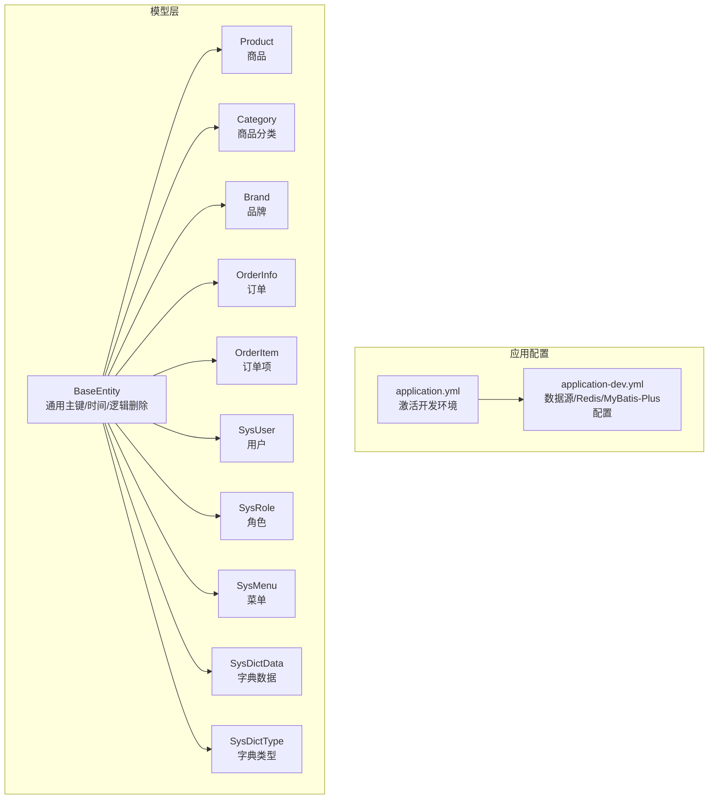
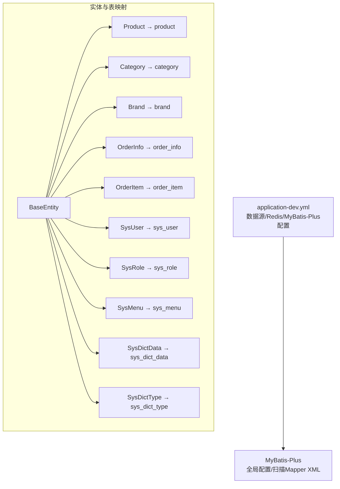
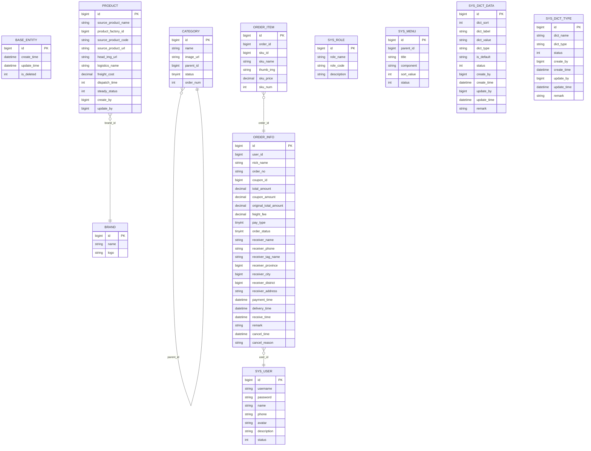
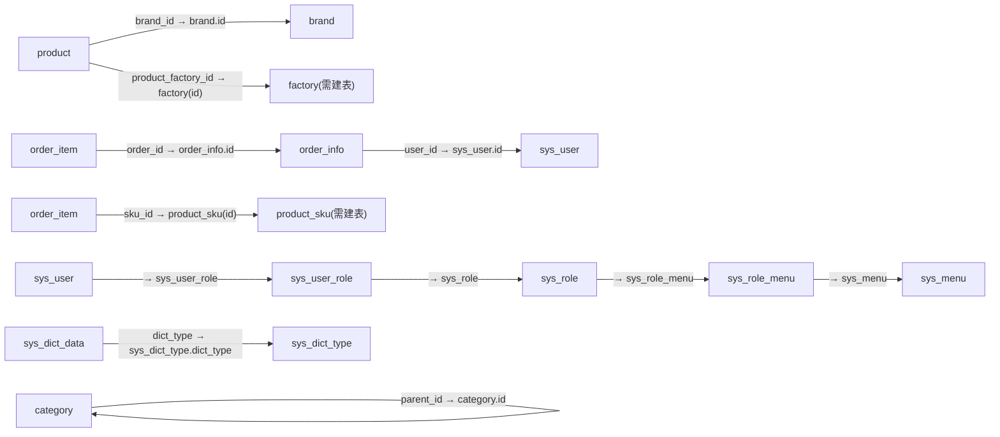
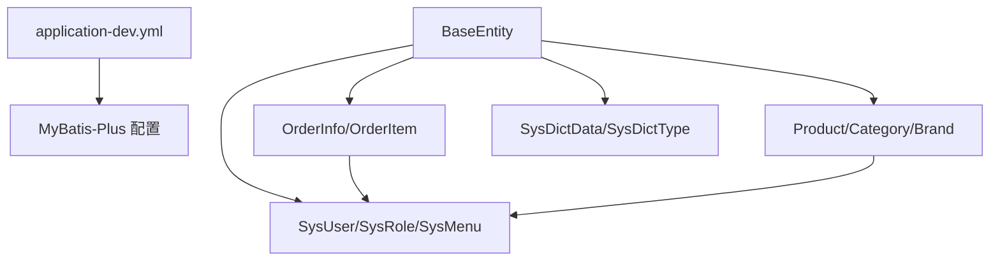

# 数据库设计

<cite>
**本文引用的文件**
- [application-dev.yml](file://spzx-manager/src/main/resources/application-dev.yml)
- [application.yml](file://spzx-manager/src/main/resources/application.yml)
- [BaseEntity.java](file://spzx-model/src/main/java/com/joker/spzx/model/entity/base/BaseEntity.java)
- [Product.java](file://spzx-model/src/main/java/com/joker/spzx/model/entity/product/Product.java)
- [Category.java](file://spzx-model/src/main/java/com/joker/spzx/model/entity/product/Category.java)
- [Brand.java](file://spzx-model/src/main/java/com/joker/spzx/model/entity/product/Brand.java)
- [OrderInfo.java](file://spzx-model/src/main/java/com/joker/spzx/model/entity/order/OrderInfo.java)
- [OrderItem.java](file://spzx-model/src/main/java/com/joker/spzx/model/entity/order/OrderItem.java)
- [SysUser.java](file://spzx-model/src/main/java/com/joker/spzx/model/entity/system/SysUser.java)
- [SysRole.java](file://spzx-model/src/main/java/com/joker/spzx/model/entity/system/SysRole.java)
- [SysMenu.java](file://spzx-model/src/main/java/com/joker/spzx/model/entity/system/SysMenu.java)
- [SysDictData.java](file://spzx-model/src/main/java/com/joker/spzx/model/entity/system/SysDictData.java)
- [SysDictType.java](file://spzx-model/src/main/java/com/joker/spzx/model/entity/system/SysDictType.java)
</cite>

## 目录
1. [简介](#简介)
2. [项目结构](#项目结构)
3. [核心组件](#核心组件)
4. [架构总览](#架构总览)
5. [详细组件分析](#详细组件分析)
6. [依赖分析](#依赖分析)
7. [性能考量](#性能考量)
8. [故障排查指南](#故障排查指南)
9. [结论](#结论)
10. [附录](#附录)

## 简介
本设计文档面向SPZX电商管理系统，聚焦于核心业务实体的数据库结构设计与实现映射，包括商品、订单、用户与权限等模块。文档从实体关系模型、主外键设计、索引策略出发，结合MyBatis-Plus注解映射与Spring Boot配置，给出规范化设计原则、性能优化建议、扩展性考虑，并提供数据迁移、备份与一致性保障思路及SQL示例路径与事务管理最佳实践。

## 项目结构
系统采用分层架构，数据库访问通过MyBatis-Plus实现，实体类使用注解映射到数据库表。应用配置集中于Spring Boot配置文件中，包含数据源、Redis、规则引擎与MyBatis-Plus相关设置。

**图表来源**
- [application.yml:1-5](file://spzx-manager/src/main/resources/application.yml#L1-L5)
- [application-dev.yml:1-65](file://spzx-manager/src/main/resources/application-dev.yml#L1-L65)
- [BaseEntity.java:1-34](file://spzx-model/src/main/java/com/joker/spzx/model/entity/base/BaseEntity.java#L1-L34)
- [Product.java:1-58](file://spzx-model/src/main/java/com/joker/spzx/model/entity/product/Product.java#L1-L58)
- [Category.java:1-43](file://spzx-model/src/main/java/com/joker/spzx/model/entity/product/Category.java#L1-L43)
- [Brand.java:1-21](file://spzx-model/src/main/java/com/joker/spzx/model/entity/product/Brand.java#L1-L21)
- [OrderInfo.java:1-113](file://spzx-model/src/main/java/com/joker/spzx/model/entity/order/OrderInfo.java#L1-L113)
- [OrderItem.java:1-42](file://spzx-model/src/main/java/com/joker/spzx/model/entity/order/OrderItem.java#L1-L42)
- [SysUser.java:1-42](file://spzx-model/src/main/java/com/joker/spzx/model/entity/system/SysUser.java#L1-L42)
- [SysRole.java:1-28](file://spzx-model/src/main/java/com/joker/spzx/model/entity/system/SysRole.java#L1-L28)
- [SysMenu.java:1-41](file://spzx-model/src/main/java/com/joker/spzx/model/entity/system/SysMenu.java#L1-L41)
- [SysDictData.java:1-84](file://spzx-model/src/main/java/com/joker/spzx/model/entity/system/SysDictData.java#L1-L84)
- [SysDictType.java:1-72](file://spzx-model/src/main/java/com/joker/spzx/model/entity/system/SysDictType.java#L1-L72)

**章节来源**
- [application.yml:1-5](file://spzx-manager/src/main/resources/application.yml#L1-L5)
- [application-dev.yml:1-65](file://spzx-manager/src/main/resources/application-dev.yml#L1-L65)

## 核心组件
本节梳理核心业务实体及其在数据库中的映射关系，明确主键、字段含义与约束关系。

- 通用基类
  - BaseEntity：统一主键、创建/更新时间、逻辑删除字段，所有业务实体继承该基类以保持一致的审计与生命周期管理。
- 商品域
  - Product：商品基础信息，包含货源信息、头图、物流与成本、稳定性状态以及创建/更新人。
  - Category：商品分类，支持父子层级、排序与显示状态。
  - Brand：品牌信息，包含品牌名与Logo。
- 订单域
  - OrderInfo：订单主表，包含用户、优惠券、金额、支付方式、收货信息、时间戳与状态。
  - OrderItem：订单明细，记录SKU、数量、单价与图片等。
- 权限与系统域
  - SysUser：用户基本信息与状态。
  - SysRole：角色信息。
  - SysMenu：菜单树形结构，支持父子关系与排序。
  - SysDictData/SysDictType：字典类型与数据，支撑系统参数化配置。

**章节来源**
- [BaseEntity.java:1-34](file://spzx-model/src/main/java/com/joker/spzx/model/entity/base/BaseEntity.java#L1-L34)
- [Product.java:1-58](file://spzx-model/src/main/java/com/joker/spzx/model/entity/product/Product.java#L1-L58)
- [Category.java:1-43](file://spzx-model/src/main/java/com/joker/spzx/model/entity/product/Category.java#L1-L43)
- [Brand.java:1-21](file://spzx-model/src/main/java/com/joker/spzx/model/entity/product/Brand.java#L1-L21)
- [OrderInfo.java:1-113](file://spzx-model/src/main/java/com/joker/spzx/model/entity/order/OrderInfo.java#L1-L113)
- [OrderItem.java:1-42](file://spzx-model/src/main/java/com/joker/spzx/model/entity/order/OrderItem.java#L1-L42)
- [SysUser.java:1-42](file://spzx-model/src/main/java/com/joker/spzx/model/entity/system/SysUser.java#L1-L42)
- [SysRole.java:1-28](file://spzx-model/src/main/java/com/joker/spzx/model/entity/system/SysRole.java#L1-L28)
- [SysMenu.java:1-41](file://spzx-model/src/main/java/com/joker/spzx/model/entity/system/SysMenu.java#L1-L41)
- [SysDictData.java:1-84](file://spzx-model/src/main/java/com/joker/spzx/model/entity/system/SysDictData.java#L1-L84)
- [SysDictType.java:1-72](file://spzx-model/src/main/java/com/joker/spzx/model/entity/system/SysDictType.java#L1-L72)

## 架构总览
下图展示系统中与数据库交互的关键对象与配置映射关系，体现实体类与数据库表的对应关系以及MyBatis-Plus的全局配置。

**图表来源**
- [application-dev.yml:53-59](file://spzx-manager/src/main/resources/application-dev.yml#L53-L59)
- [BaseEntity.java:1-34](file://spzx-model/src/main/java/com/joker/spzx/model/entity/base/BaseEntity.java#L1-L34)
- [Product.java:1-58](file://spzx-model/src/main/java/com/joker/spzx/model/entity/product/Product.java#L1-L58)
- [Category.java:1-43](file://spzx-model/src/main/java/com/joker/spzx/model/entity/product/Category.java#L1-L43)
- [Brand.java:1-21](file://spzx-model/src/main/java/com/joker/spzx/model/entity/product/Brand.java#L1-L21)
- [OrderInfo.java:1-113](file://spzx-model/src/main/java/com/joker/spzx/model/entity/order/OrderInfo.java#L1-L113)
- [OrderItem.java:1-42](file://spzx-model/src/main/java/com/joker/spzx/model/entity/order/OrderItem.java#L1-L42)
- [SysUser.java:1-42](file://spzx-model/src/main/java/com/joker/spzx/model/entity/system/SysUser.java#L1-L42)
- [SysRole.java:1-28](file://spzx-model/src/main/java/com/joker/spzx/model/entity/system/SysRole.java#L1-L28)
- [SysMenu.java:1-41](file://spzx-model/src/main/java/com/joker/spzx/model/entity/system/SysMenu.java#L1-L41)
- [SysDictData.java:1-84](file://spzx-model/src/main/java/com/joker/spzx/model/entity/system/SysDictData.java#L1-L84)
- [SysDictType.java:1-72](file://spzx-model/src/main/java/com/joker/spzx/model/entity/system/SysDictType.java#L1-L72)

## 详细组件分析

### 实体关系模型与主外键设计
- 基础规范
  - 所有业务表均继承BaseEntity，具备统一主键、创建/更新时间与逻辑删除字段，便于审计与软删除。
  - 主键策略：MyBatis-Plus全局配置为自增主键，实体类未显式覆盖时遵循全局策略。
- 商品域
  - product ←→ brand：品牌关联（外键指向brand.id）
  - product ←→ product_factory：工厂信息（外键指向工厂实体，需在数据库中建立对应表与外键）
  - category：父子关系通过parent_id自引用
- 订单域
  - order_info ←→ sys_user：用户与订单一对多
  - order_item ←→ order_info：订单与订单项一对多
  - order_item ←→ product_sku：订单项与SKU关联（需在数据库中建立product_sku表与外键）
- 权限域
  - sys_user ←→ sys_role：用户与角色多对多（中间表sys_user_role）
  - sys_role ←→ sys_menu：角色与菜单多对多（中间表sys_role_menu）

**图表来源**
- [BaseEntity.java:1-34](file://spzx-model/src/main/java/com/joker/spzx/model/entity/base/BaseEntity.java#L1-L34)
- [Product.java:1-58](file://spzx-model/src/main/java/com/joker/spzx/model/entity/product/Product.java#L1-L58)
- [Brand.java:1-21](file://spzx-model/src/main/java/com/joker/spzx/model/entity/product/Brand.java#L1-L21)
- [Category.java:1-43](file://spzx-model/src/main/java/com/joker/spzx/model/entity/product/Category.java#L1-L43)
- [OrderInfo.java:1-113](file://spzx-model/src/main/java/com/joker/spzx/model/entity/order/OrderInfo.java#L1-L113)
- [OrderItem.java:1-42](file://spzx-model/src/main/java/com/joker/spzx/model/entity/order/OrderItem.java#L1-L42)
- [SysUser.java:1-42](file://spzx-model/src/main/java/com/joker/spzx/model/entity/system/SysUser.java#L1-L42)
- [SysRole.java:1-28](file://spzx-model/src/main/java/com/joker/spzx/model/entity/system/SysRole.java#L1-L28)
- [SysMenu.java:1-41](file://spzx-model/src/main/java/com/joker/spzx/model/entity/system/SysMenu.java#L1-L41)
- [SysDictData.java:1-84](file://spzx-model/src/main/java/com/joker/spzx/model/entity/system/SysDictData.java#L1-L84)
- [SysDictType.java:1-72](file://spzx-model/src/main/java/com/joker/spzx/model/entity/system/SysDictType.java#L1-L72)

**章节来源**
- [BaseEntity.java:1-34](file://spzx-model/src/main/java/com/joker/spzx/model/entity/base/BaseEntity.java#L1-L34)
- [application-dev.yml:53-59](file://spzx-manager/src/main/resources/application-dev.yml#L53-L59)

### 字段定义与约束关系
- 通用字段
  - id：自增主键（遵循全局配置）
  - create_time/update_time：记录创建与更新时间
  - is_deleted：逻辑删除标志
- 商品与分类
  - product：包含货源信息、头图、物流、运费、发货时长、稳定状态与审核人字段
  - category：name、imageUrl、parentId、status、orderNum
  - brand：name、logo
- 订单与订单项
  - order_info：用户、订单号、优惠券、金额、支付方式、收货信息、时间戳与状态
  - order_item：order_id、sku_id、sku_name、thumb_img、sku_price、sku_num
- 用户与权限
  - sys_user：username、password、name、phone、avatar、description、status
  - sys_role：role_name、role_code、description
  - sys_menu：parent_id、title、component、sort_value、status
  - sys_dict_data/sys_dict_type：字典类型与数据，含排序、标签、键值、默认标记与状态

**章节来源**
- [Product.java:1-58](file://spzx-model/src/main/java/com/joker/spzx/model/entity/product/Product.java#L1-L58)
- [Category.java:1-43](file://spzx-model/src/main/java/com/joker/spzx/model/entity/product/Category.java#L1-L43)
- [Brand.java:1-21](file://spzx-model/src/main/java/com/joker/spzx/model/entity/product/Brand.java#L1-L21)
- [OrderInfo.java:1-113](file://spzx-model/src/main/java/com/joker/spzx/model/entity/order/OrderInfo.java#L1-L113)
- [OrderItem.java:1-42](file://spzx-model/src/main/java/com/joker/spzx/model/entity/order/OrderItem.java#L1-L42)
- [SysUser.java:1-42](file://spzx-model/src/main/java/com/joker/spzx/model/entity/system/SysUser.java#L1-L42)
- [SysRole.java:1-28](file://spzx-model/src/main/java/com/joker/spzx/model/entity/system/SysRole.java#L1-L28)
- [SysMenu.java:1-41](file://spzx-model/src/main/java/com/joker/spzx/model/entity/system/SysMenu.java#L1-L41)
- [SysDictData.java:1-84](file://spzx-model/src/main/java/com/joker/spzx/model/entity/system/SysDictData.java#L1-L84)
- [SysDictType.java:1-72](file://spzx-model/src/main/java/com/joker/spzx/model/entity/system/SysDictType.java#L1-L72)

### 索引策略
- 唯一性索引
  - sys_user.username：用户名唯一
  - sys_dict_type.dict_type：字典类型唯一
  - order_info.order_no：订单号唯一
- 常用查询索引
  - order_info.user_id：按用户查询订单
  - order_info.order_status：按状态统计与筛选
  - order_item.order_id：按订单查询明细
  - category.parent_id：按父分类查询子分类
  - product.brand_id：按品牌查询商品
- 复合索引
  - 订单统计与报表：基于order_info.payment_time、order_info.order_status组合索引
  - 收货地址：receiver_province/receiver_city/receiver_district联合索引
- 其他
  - sys_menu.parent_id+sort_value：菜单树与排序
  - sys_dict_data.dict_type+dict_sort：字典数据排序检索

**章节来源**
- [SysUser.java:1-42](file://spzx-model/src/main/java/com/joker/spzx/model/entity/system/SysUser.java#L1-L42)
- [SysDictType.java:1-72](file://spzx-model/src/main/java/com/joker/spzx/model/entity/system/SysDictType.java#L1-L72)
- [OrderInfo.java:1-113](file://spzx-model/src/main/java/com/joker/spzx/model/entity/order/OrderInfo.java#L1-L113)
- [OrderItem.java:1-42](file://spzx-model/src/main/java/com/joker/spzx/model/entity/order/OrderItem.java#L1-L42)
- [Category.java:1-43](file://spzx-model/src/main/java/com/joker/spzx/model/entity/product/Category.java#L1-L43)
- [Product.java:1-58](file://spzx-model/src/main/java/com/joker/spzx/model/entity/product/Product.java#L1-L58)
- [SysMenu.java:1-41](file://spzx-model/src/main/java/com/joker/spzx/model/entity/system/SysMenu.java#L1-L41)
- [SysDictData.java:1-84](file://spzx-model/src/main/java/com/joker/spzx/model/entity/system/SysDictData.java#L1-L84)

### 数据字典
- sys_dict_type：字典类型表，包含类型名称、类型键、状态与元数据
- sys_dict_data：字典数据表，包含排序、标签、键值、类型、默认标记与状态
- 关系：sys_dict_data.dict_type → sys_dict_type.dict_type

**章节来源**
- [SysDictType.java:1-72](file://spzx-model/src/main/java/com/joker/spzx/model/entity/system/SysDictType.java#L1-L72)
- [SysDictData.java:1-84](file://spzx-model/src/main/java/com/joker/spzx/model/entity/system/SysDictData.java#L1-L84)

### 表关系图

**图表来源**
- [Product.java:1-58](file://spzx-model/src/main/java/com/joker/spzx/model/entity/product/Product.java#L1-L58)
- [Brand.java:1-21](file://spzx-model/src/main/java/com/joker/spzx/model/entity/product/Brand.java#L1-L21)
- [Category.java:1-43](file://spzx-model/src/main/java/com/joker/spzx/model/entity/product/Category.java#L1-L43)
- [OrderInfo.java:1-113](file://spzx-model/src/main/java/com/joker/spzx/model/entity/order/OrderInfo.java#L1-L113)
- [OrderItem.java:1-42](file://spzx-model/src/main/java/com/joker/spzx/model/entity/order/OrderItem.java#L1-L42)
- [SysUser.java:1-42](file://spzx-model/src/main/java/com/joker/spzx/model/entity/system/SysUser.java#L1-L42)
- [SysRole.java:1-28](file://spzx-model/src/main/java/com/joker/spzx/model/entity/system/SysRole.java#L1-L28)
- [SysMenu.java:1-41](file://spzx-model/src/main/java/com/joker/spzx/model/entity/system/SysMenu.java#L1-L41)
- [SysDictData.java:1-84](file://spzx-model/src/main/java/com/joker/spzx/model/entity/system/SysDictData.java#L1-L84)
- [SysDictType.java:1-72](file://spzx-model/src/main/java/com/joker/spzx/model/entity/system/SysDictType.java#L1-L72)

## 依赖分析
- 配置依赖
  - application-dev.yml提供数据源、Redis与MyBatis-Plus配置，确保实体类与数据库表映射正确加载。
- 实体依赖
  - 所有业务实体继承BaseEntity，形成统一的审计与生命周期管理。
  - 订单域依赖用户域，商品域依赖品牌与分类域，权限域依赖菜单与角色域。
- 外键依赖
  - 订单与用户、订单与订单项、订单项与SKU、商品与品牌、分类自引用等构成主要外键关系。

**图表来源**
- [application-dev.yml:53-59](file://spzx-manager/src/main/resources/application-dev.yml#L53-L59)
- [BaseEntity.java:1-34](file://spzx-model/src/main/java/com/joker/spzx/model/entity/base/BaseEntity.java#L1-L34)
- [Product.java:1-58](file://spzx-model/src/main/java/com/joker/spzx/model/entity/product/Product.java#L1-L58)
- [Category.java:1-43](file://spzx-model/src/main/java/com/joker/spzx/model/entity/product/Category.java#L1-L43)
- [Brand.java:1-21](file://spzx-model/src/main/java/com/joker/spzx/model/entity/product/Brand.java#L1-L21)
- [OrderInfo.java:1-113](file://spzx-model/src/main/java/com/joker/spzx/model/entity/order/OrderInfo.java#L1-L113)
- [OrderItem.java:1-42](file://spzx-model/src/main/java/com/joker/spzx/model/entity/order/OrderItem.java#L1-L42)
- [SysUser.java:1-42](file://spzx-model/src/main/java/com/joker/spzx/model/entity/system/SysUser.java#L1-L42)
- [SysRole.java:1-28](file://spzx-model/src/main/java/com/joker/spzx/model/entity/system/SysRole.java#L1-L28)
- [SysMenu.java:1-41](file://spzx-model/src/main/java/com/joker/spzx/model/entity/system/SysMenu.java#L1-L41)
- [SysDictData.java:1-84](file://spzx-model/src/main/java/com/joker/spzx/model/entity/system/SysDictData.java#L1-L84)
- [SysDictType.java:1-72](file://spzx-model/src/main/java/com/joker/spzx/model/entity/system/SysDictType.java#L1-L72)

**章节来源**
- [application-dev.yml:53-59](file://spzx-manager/src/main/resources/application-dev.yml#L53-L59)
- [BaseEntity.java:1-34](file://spzx-model/src/main/java/com/joker/spzx/model/entity/base/BaseEntity.java#L1-L34)

## 性能考量
- 连接池与缓存
  - 使用HikariCP，合理设置最大连接数、空闲超时与预编译语句缓存，降低连接开销。
- 查询优化
  - 对高频过滤字段建立索引（如订单状态、用户ID、订单号），避免全表扫描。
  - 分页查询配合LIMIT与ORDER BY，避免大偏移量分页。
- 写入优化
  - 批量插入与更新，减少网络往返；使用事务合并多次写操作。
- 缓存策略
  - 利用Redis缓存热点数据（如字典、菜单、品牌、分类），降低数据库压力。
- 监控与日志
  - 启用MyBatis日志输出，定位慢查询；结合数据库慢查询日志进行分析。

**章节来源**
- [application-dev.yml:12-32](file://spzx-manager/src/main/resources/application-dev.yml#L12-L32)
- [application-dev.yml:53-59](file://spzx-manager/src/main/resources/application-dev.yml#L53-L59)

## 故障排查指南
- 连接问题
  - 检查数据源URL、用户名与密码是否正确；确认MySQL服务可用与防火墙放行。
- 映射问题
  - 确认实体类注解与数据库表名一致；检查MyBatis-Plus Mapper XML是否正确加载。
- 索引缺失
  - 对高频查询字段补充索引；使用EXPLAIN分析执行计划。
- 事务问题
  - 确保业务方法在事务边界内；避免跨库事务；必要时使用分布式事务框架。
- 日志与监控
  - 开启MyBatis日志与慢查询日志；结合应用日志定位异常。

**章节来源**
- [application-dev.yml:12-32](file://spzx-manager/src/main/resources/application-dev.yml#L12-L32)
- [application-dev.yml:53-59](file://spzx-manager/src/main/resources/application-dev.yml#L53-L59)

## 结论
本设计以MyBatis-Plus注解映射为核心，结合统一的BaseEntity实现审计与软删除，围绕商品、订单、用户与权限构建清晰的实体关系模型。通过合理的索引策略、连接池配置与缓存机制，兼顾性能与可维护性。后续可在数据库层面完善工厂与SKU等外键表，并持续优化查询与事务处理，以满足业务扩展需求。

## 附录
- SQL示例路径（仅提供路径，不展示具体代码）
  - 创建用户表：[SysUser.java:1-42](file://spzx-model/src/main/java/com/joker/spzx/model/entity/system/SysUser.java#L1-L42)
  - 创建角色表：[SysRole.java:1-28](file://spzx-model/src/main/java/com/joker/spzx/model/entity/system/SysRole.java#L1-L28)
  - 创建菜单表：[SysMenu.java:1-41](file://spzx-model/src/main/java/com/joker/spzx/model/entity/system/SysMenu.java#L1-L41)
  - 创建商品表：[Product.java:1-58](file://spzx-model/src/main/java/com/joker/spzx/model/entity/product/Product.java#L1-L58)
  - 创建分类表：[Category.java:1-43](file://spzx-model/src/main/java/com/joker/spzx/model/entity/product/Category.java#L1-L43)
  - 创建品牌表：[Brand.java:1-21](file://spzx-model/src/main/java/com/joker/spzx/model/entity/product/Brand.java#L1-L21)
  - 创建订单表：[OrderInfo.java:1-113](file://spzx-model/src/main/java/com/joker/spzx/model/entity/order/OrderInfo.java#L1-L113)
  - 创建订单项表：[OrderItem.java:1-42](file://spzx-model/src/main/java/com/joker/spzx/model/entity/order/OrderItem.java#L1-L42)
  - 创建字典类型表：[SysDictType.java:1-72](file://spzx-model/src/main/java/com/joker/spzx/model/entity/system/SysDictType.java#L1-L72)
  - 创建字典数据表：[SysDictData.java:1-84](file://spzx-model/src/main/java/com/joker/spzx/model/entity/system/SysDictData.java#L1-L84)
- 事务管理最佳实践
  - 将业务方法标注为事务传播行为，默认REQUIRED；对只读查询使用readOnly=true。
  - 在Service层聚合多个DAO操作，确保原子性；对外抛出业务异常而非底层异常。
- 数据迁移与备份
  - 迁移：使用版本化的DDL脚本管理结构变更；先在测试环境验证，再灰度到生产。
  - 备份：定期全量备份+增量备份；校验恢复流程；保留至少7天的RPO/RTO窗口。
- 数据一致性
  - 读写分离与最终一致性场景下，使用消息队列削峰填谷；强一致场景使用本地事务或分布式事务框架。