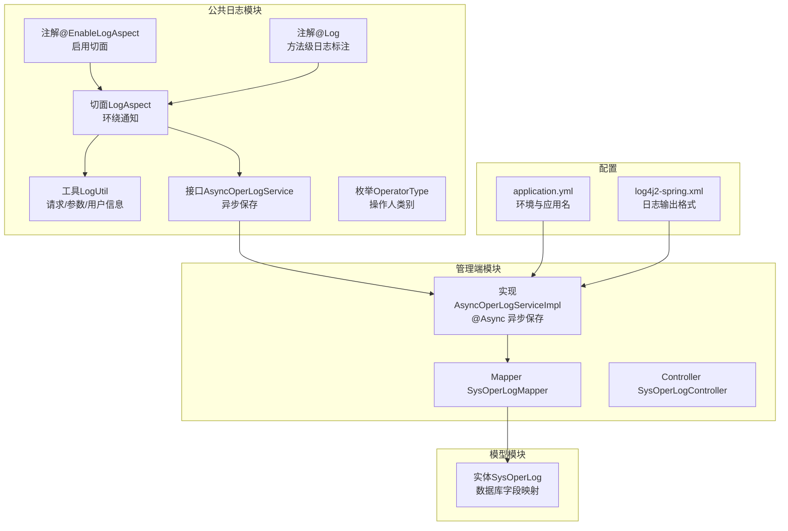
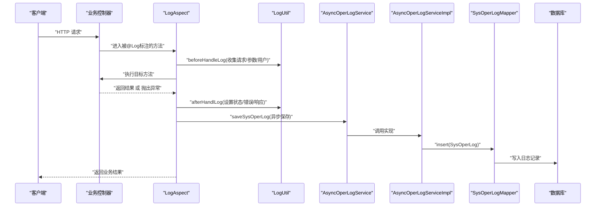
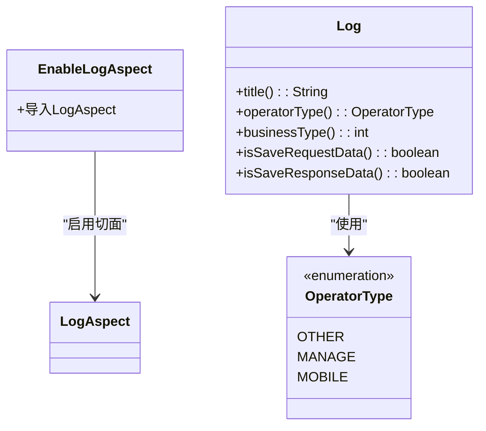
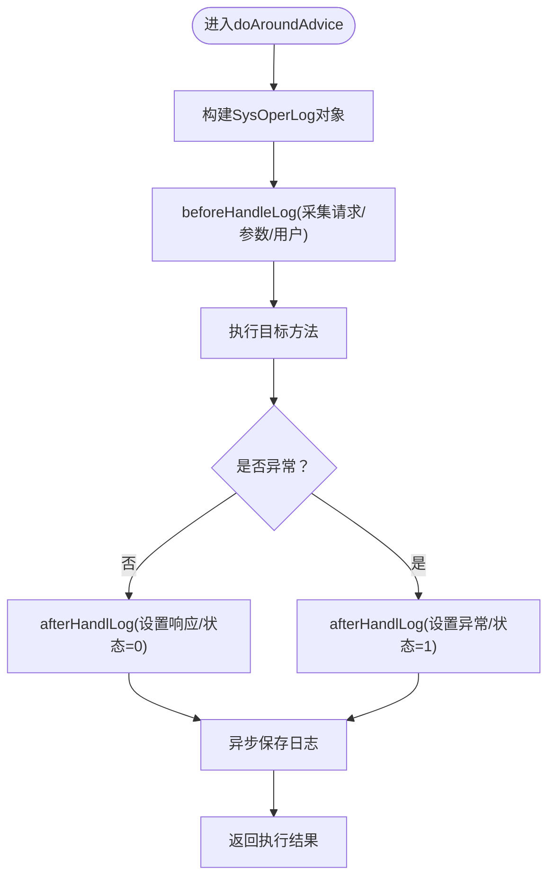
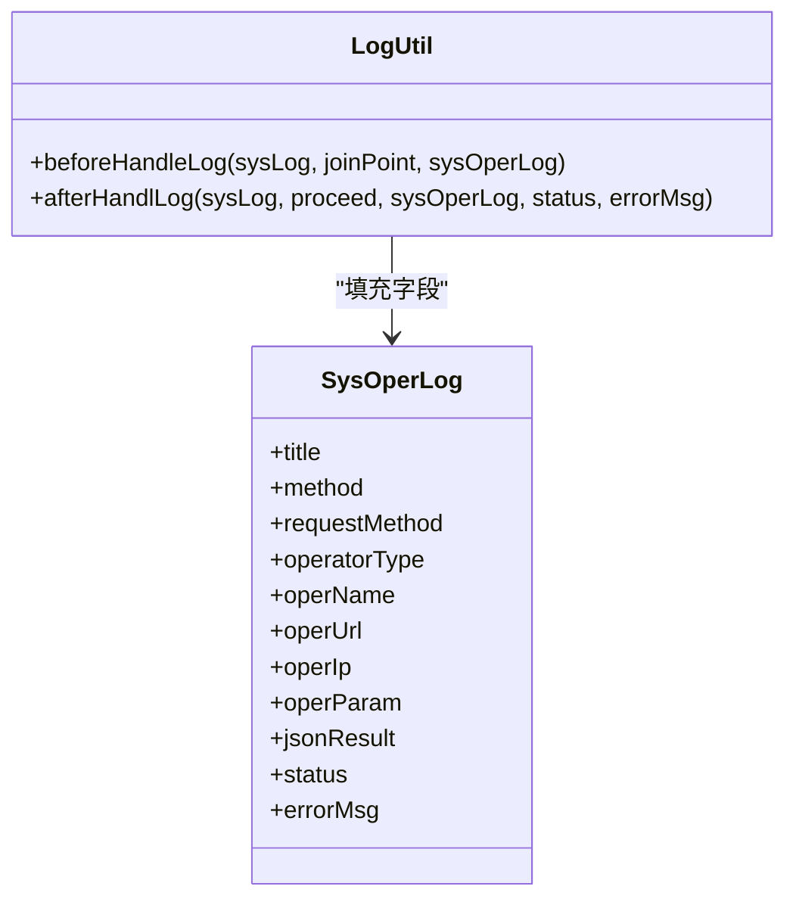
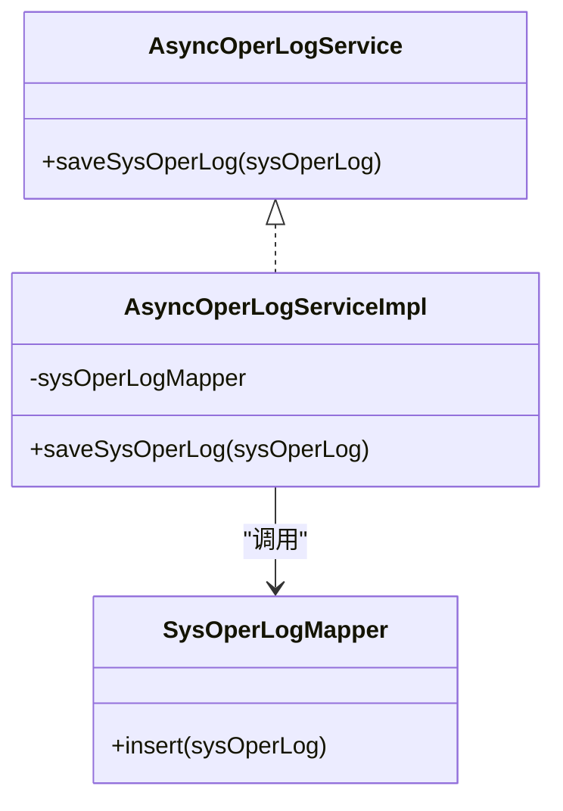
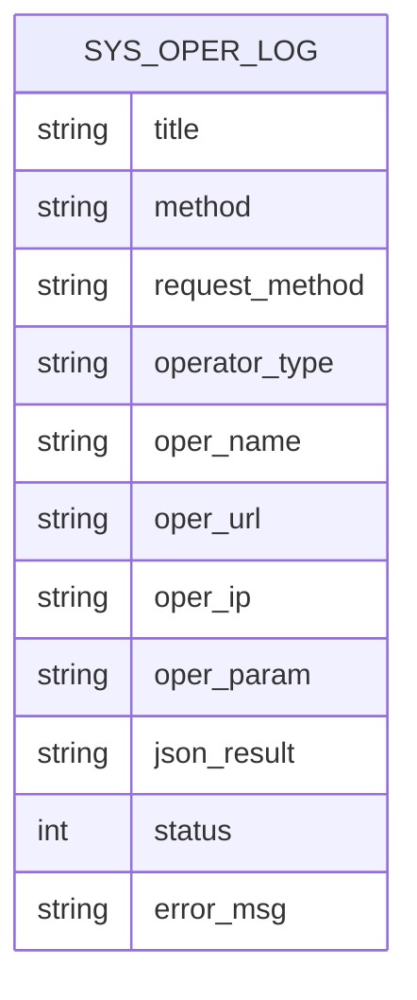
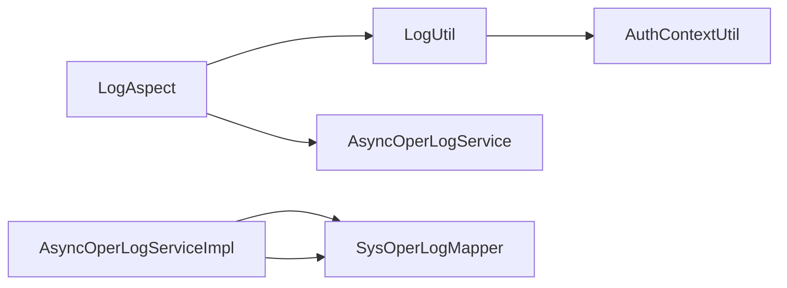

# 日志系统设计

<cite>
**本文引用的文件**
- [EnableLogAspect.java](file://spzx-common/common-log/src/main/java/com/joker/spzx/common/annotation/EnableLogAspect.java)
- [Log.java](file://spzx-common/common-log/src/main/java/com/joker/spzx/common/annotation/Log.java)
- [LogAspect.java](file://spzx-common/common-log/src/main/java/com/joker/spzx/common/aspect/LogAspect.java)
- [AsyncOperLogService.java](file://spzx-common/common-log/src/main/java/com/joker/spzx/common/service/AsyncOperLogService.java)
- [LogUtil.java](file://spzx-common/common-log/src/main/java/com/joker/spzx/common/util/LogUtil.java)
- [OperatorType.java](file://spzx-common/common-log/src/main/java/com/joker/spzx/common/enums/OperatorType.java)
- [SysOperLog.java](file://spzx-model/src/main/java/com/joker/spzx/model/entity/system/SysOperLog.java)
- [AsyncOperLogServiceImpl.java](file://spzx-manager/src/main/java/com/joker/spzx/manager/service/impl/AsyncOperLogServiceImpl.java)
- [SysOperLogMapper.java](file://spzx-manager/src/main/java/com/joker/spzx/manager/mapper/SysOperLogMapper.java)
- [SysOperLogController.java](file://spzx-manager/src/main/java/com/joker/spzx/manager/controller/SysOperLogController.java)
- [application.yml](file://spzx-manager/src/main/resources/application.yml)
- [log4j2-spring.xml](file://spzx-manager/src/main/resources/log4j2-spring.xml)
</cite>

## 目录
1. [引言](#引言)
2. [项目结构](#项目结构)
3. [核心组件](#核心组件)
4. [架构总览](#架构总览)
5. [详细组件分析](#详细组件分析)
6. [依赖分析](#依赖分析)
7. [性能考虑](#性能考虑)
8. [故障排查指南](#故障排查指南)
9. [结论](#结论)
10. [附录](#附录)

## 引言
本设计文档面向SPZX项目的日志系统，围绕基于AOP的操作日志切面、异步日志处理与配置管理展开，系统性阐述操作日志、异常日志与业务日志的分类与记录策略，并给出日志数据结构、查询与分析建议，以及在系统监控、故障排查与审计中的应用价值。

## 项目结构
日志系统主要由以下模块组成：
- 注解层：用于声明式启用与标注日志切面
- 切面层：环绕通知拦截目标方法，统一采集请求与响应上下文
- 工具层：封装请求上下文提取、参数序列化与用户信息注入
- 异步服务层：异步落库，避免阻塞主流程
- 实体与持久层：日志实体与MyBatis映射
- 配置层：Spring Boot与Log4j2配置

图表来源
- [EnableLogAspect.java:1-17](file://spzx-common/common-log/src/main/java/com/joker/spzx/common/annotation/EnableLogAspect.java#L1-L17)
- [Log.java:1-20](file://spzx-common/common-log/src/main/java/com/joker/spzx/common/annotation/Log.java#L1-L20)
- [LogAspect.java:1-47](file://spzx-common/common-log/src/main/java/com/joker/spzx/common/aspect/LogAspect.java#L1-L47)
- [LogUtil.java:1-62](file://spzx-common/common-log/src/main/java/com/joker/spzx/common/util/LogUtil.java#L1-L62)
- [AsyncOperLogService.java:1-9](file://spzx-common/common-log/src/main/java/com/joker/spzx/common/service/AsyncOperLogService.java#L1-L9)
- [OperatorType.java:1-7](file://spzx-common/common-log/src/main/java/com/joker/spzx/common/enums/OperatorType.java#L1-L7)
- [SysOperLog.java:1-60](file://spzx-model/src/main/java/com/joker/spzx/model/entity/system/SysOperLog.java#L1-L60)
- [AsyncOperLogServiceImpl.java:1-22](file://spzx-manager/src/main/java/com/joker/spzx/manager/service/impl/AsyncOperLogServiceImpl.java#L1-L22)
- [SysOperLogMapper.java:1-19](file://spzx-manager/src/main/java/com/joker/spzx/manager/mapper/SysOperLogMapper.java#L1-L19)
- [application.yml:1-5](file://spzx-manager/src/main/resources/application.yml#L1-L5)
- [log4j2-spring.xml:1-13](file://spzx-manager/src/main/resources/log4j2-spring.xml#L1-L13)

章节来源
- [application.yml:1-5](file://spzx-manager/src/main/resources/application.yml#L1-L5)
- [log4j2-spring.xml:1-13](file://spzx-manager/src/main/resources/log4j2-spring.xml#L1-L13)

## 核心组件
- 注解@EnableLogAspect：通过Spring @Import导入LogAspect，启用全局AOP日志切面。
- 注解@Log：方法级标注，声明模块标题、操作人类别、业务类型及是否保存请求/响应数据。
- 切面LogAspect：环绕通知拦截带@Log的方法，统一构建SysOperLog对象，捕获异常并标记状态。
- 工具LogUtil：从请求上下文提取URL、IP、方法签名、请求参数；注入当前登录用户名；设置响应结果与异常信息。
- 异步服务AsyncOperLogService：定义异步保存接口；实现类使用@Async异步写入数据库，避免阻塞请求线程。
- 实体SysOperLog：映射sys_oper_log表，包含模块、方法、请求方式、操作人、URL、IP、请求/响应参数、状态与错误信息等字段。
- 配置：application.yml定义应用名与激活环境；log4j2-spring.xml定义控制台输出格式。

章节来源
- [EnableLogAspect.java:1-17](file://spzx-common/common-log/src/main/java/com/joker/spzx/common/annotation/EnableLogAspect.java#L1-L17)
- [Log.java:1-20](file://spzx-common/common-log/src/main/java/com/joker/spzx/common/annotation/Log.java#L1-L20)
- [LogAspect.java:1-47](file://spzx-common/common-log/src/main/java/com/joker/spzx/common/aspect/LogAspect.java#L1-L47)
- [LogUtil.java:1-62](file://spzx-common/common-log/src/main/java/com/joker/spzx/common/util/LogUtil.java#L1-L62)
- [AsyncOperLogService.java:1-9](file://spzx-common/common-log/src/main/java/com/joker/spzx/common/service/AsyncOperLogService.java#L1-L9)
- [AsyncOperLogServiceImpl.java:1-22](file://spzx-manager/src/main/java/com/joker/spzx/manager/service/impl/AsyncOperLogServiceImpl.java#L1-L22)
- [SysOperLog.java:1-60](file://spzx-model/src/main/java/com/joker/spzx/model/entity/system/SysOperLog.java#L1-L60)
- [application.yml:1-5](file://spzx-manager/src/main/resources/application.yml#L1-L5)
- [log4j2-spring.xml:1-13](file://spzx-manager/src/main/resources/log4j2-spring.xml#L1-L13)

## 架构总览
下图展示一次典型HTTP请求在日志系统中的流转路径：请求进入后，AOP切面拦截目标方法，采集请求上下文与参数，执行业务逻辑，根据结果或异常更新日志状态，最后异步落库。

图表来源
- [LogAspect.java:21-46](file://spzx-common/common-log/src/main/java/com/joker/spzx/common/aspect/LogAspect.java#L21-L46)
- [LogUtil.java:30-61](file://spzx-common/common-log/src/main/java/com/joker/spzx/common/util/LogUtil.java#L30-L61)
- [AsyncOperLogServiceImpl.java:16-20](file://spzx-manager/src/main/java/com/joker/spzx/manager/service/impl/AsyncOperLogServiceImpl.java#L16-L20)
- [SysOperLogMapper.java:1-19](file://spzx-manager/src/main/java/com/joker/spzx/manager/mapper/SysOperLogMapper.java#L1-L19)

## 详细组件分析

### 注解与启用机制
- @EnableLogAspect：通过@Import引入LogAspect，使整个应用具备AOP日志能力。
- @Log：方法级注解，支持指定模块标题、操作人类别（枚举）、业务类型（如新增/修改/删除等）、是否保存请求/响应数据。

图表来源
- [EnableLogAspect.java:12-16](file://spzx-common/common-log/src/main/java/com/joker/spzx/common/annotation/EnableLogAspect.java#L12-L16)
- [Log.java:10-20](file://spzx-common/common-log/src/main/java/com/joker/spzx/common/annotation/Log.java#L10-L20)
- [OperatorType.java:3-7](file://spzx-common/common-log/src/main/java/com/joker/spzx/common/enums/OperatorType.java#L3-L7)

章节来源
- [EnableLogAspect.java:1-17](file://spzx-common/common-log/src/main/java/com/joker/spzx/common/annotation/EnableLogAspect.java#L1-L17)
- [Log.java:1-20](file://spzx-common/common-log/src/main/java/com/joker/spzx/common/annotation/Log.java#L1-L20)
- [OperatorType.java:1-7](file://spzx-common/common-log/src/main/java/com/joker/spzx/common/enums/OperatorType.java#L1-L7)

### 切面实现原理
- 环绕通知：在目标方法前后分别进行“前置处理”和“后置处理”，确保无论成功或异常都能完整记录。
- 异常处理：捕获异常并设置状态为异常，同时记录错误信息，随后抛出运行时异常以保证业务层感知异常。
- 异步保存：将日志对象交给异步服务，避免阻塞主线程。

图表来源
- [LogAspect.java:21-46](file://spzx-common/common-log/src/main/java/com/joker/spzx/common/aspect/LogAspect.java#L21-L46)
- [LogUtil.java:19-28](file://spzx-common/common-log/src/main/java/com/joker/spzx/common/util/LogUtil.java#L19-L28)

章节来源
- [LogAspect.java:1-47](file://spzx-common/common-log/src/main/java/com/joker/spzx/common/aspect/LogAspect.java#L1-L47)

### 工具类与数据采集
- 请求上下文：从RequestContextHolder获取HttpServletRequest，提取请求方式、URI、远端IP。
- 方法签名：通过MethodSignature获取类名与方法名，便于定位。
- 参数采集：仅对POST/PUT请求采集参数数组字符串，避免GET等无请求体场景的冗余。
- 用户信息：通过AuthContextUtil获取当前登录用户名，确保可审计。
- 响应与异常：根据执行结果设置jsonResult；异常时记录errorMsg并标记status=1。

图表来源
- [LogUtil.java:30-61](file://spzx-common/common-log/src/main/java/com/joker/spzx/common/util/LogUtil.java#L30-L61)
- [SysOperLog.java:16-58](file://spzx-model/src/main/java/com/joker/spzx/model/entity/system/SysOperLog.java#L16-L58)

章节来源
- [LogUtil.java:1-62](file://spzx-common/common-log/src/main/java/com/joker/spzx/common/util/LogUtil.java#L1-L62)
- [SysOperLog.java:1-60](file://spzx-model/src/main/java/com/joker/spzx/model/entity/system/SysOperLog.java#L1-L60)

### 异步日志处理
- 接口AsyncOperLogService：定义saveSysOperLog方法，隔离业务与持久化细节。
- 实现AsyncOperLogServiceImpl：使用@Async注解开启异步，避免阻塞请求线程；通过SysOperLogMapper插入数据库。
- 数据库：SysOperLogMapper继承MyBatis-Plus基础Mapper，自动完成SQL生成与执行。

图表来源
- [AsyncOperLogService.java:5-8](file://spzx-common/common-log/src/main/java/com/joker/spzx/common/service/AsyncOperLogService.java#L5-L8)
- [AsyncOperLogServiceImpl.java:16-20](file://spzx-manager/src/main/java/com/joker/spzx/manager/service/impl/AsyncOperLogServiceImpl.java#L16-L20)
- [SysOperLogMapper.java:15-18](file://spzx-manager/src/main/java/com/joker/spzx/manager/mapper/SysOperLogMapper.java#L15-L18)

章节来源
- [AsyncOperLogService.java:1-9](file://spzx-common/common-log/src/main/java/com/joker/spzx/common/service/AsyncOperLogService.java#L1-L9)
- [AsyncOperLogServiceImpl.java:1-22](file://spzx-manager/src/main/java/com/joker/spzx/manager/service/impl/AsyncOperLogServiceImpl.java#L1-L22)
- [SysOperLogMapper.java:1-19](file://spzx-manager/src/main/java/com/joker/spzx/manager/mapper/SysOperLogMapper.java#L1-L19)

### 日志数据结构与分类
- 数据结构：SysOperLog实体映射sys_oper_log表，字段覆盖模块、方法、请求方式、操作人、URL、IP、请求/响应参数、状态与错误信息等。
- 分类策略：
  - 操作日志：通过@Log注解显式标注的方法自动记录，包含请求/响应参数与状态。
  - 异常日志：切面捕获异常并标记状态=1，保留errorMsg，便于问题定位。
  - 业务日志：可通过不同@Log的businessType区分新增/修改/删除等业务类型，配合title进行聚合分析。

图表来源
- [SysOperLog.java:16-58](file://spzx-model/src/main/java/com/joker/spzx/model/entity/system/SysOperLog.java#L16-L58)

章节来源
- [SysOperLog.java:1-60](file://spzx-model/src/main/java/com/joker/spzx/model/entity/system/SysOperLog.java#L1-L60)

### 控制器与查询入口
- SysOperLogController：作为前端控制器占位，实际查询与分页可在该路径扩展，结合SysOperLogServiceImpl与SysOperLogMapper实现。
- 建议：在SysOperLogServiceImpl中增加分页查询方法，Mapper中编写对应SQL，Controller提供REST接口。

章节来源
- [SysOperLogController.java:1-19](file://spzx-manager/src/main/java/com/joker/spzx/manager/controller/SysOperLogController.java#L1-L19)
- [SysOperLogServiceImpl.java:1-21](file://spzx-manager/src/main/java/com/joker/spzx/manager/service/impl/SysOperLogServiceImpl.java#L1-L21)
- [SysOperLogMapper.java:1-19](file://spzx-manager/src/main/java/com/joker/spzx/manager/mapper/SysOperLogMapper.java#L1-L19)

## 依赖分析
- 组件耦合：
  - LogAspect依赖LogUtil与AsyncOperLogService，职责清晰，低耦合。
  - AsyncOperLogServiceImpl依赖SysOperLogMapper，遵循分层原则。
  - LogUtil依赖AuthContextUtil与Servlet请求上下文，关注点分离。
- 外部依赖：
  - Spring AOP与@Async异步任务调度。
  - MyBatis-Plus基础Mapper能力。
  - Log4j2控制台输出配置。

图表来源
- [LogAspect.java:18-19](file://spzx-common/common-log/src/main/java/com/joker/spzx/common/aspect/LogAspect.java#L18-L19)
- [LogUtil.java:6-7](file://spzx-common/common-log/src/main/java/com/joker/spzx/common/util/LogUtil.java#L6-L7)
- [AsyncOperLogServiceImpl.java:13-14](file://spzx-manager/src/main/java/com/joker/spzx/manager/service/impl/AsyncOperLogServiceImpl.java#L13-L14)

章节来源
- [LogAspect.java:1-47](file://spzx-common/common-log/src/main/java/com/joker/spzx/common/aspect/LogAspect.java#L1-L47)
- [LogUtil.java:1-62](file://spzx-common/common-log/src/main/java/com/joker/spzx/common/util/LogUtil.java#L1-L62)
- [AsyncOperLogServiceImpl.java:1-22](file://spzx-manager/src/main/java/com/joker/spzx/manager/service/impl/AsyncOperLogServiceImpl.java#L1-L22)

## 性能考虑
- 异步落库：通过@Async将日志写入与业务处理解耦，降低请求延迟与线程阻塞风险。
- 参数采集策略：仅在POST/PUT时采集请求参数，避免GET等无请求体场景的冗余序列化。
- 字段选择：默认保存请求/响应数据，可根据性能与存储压力调整isSaveRequestData/isSaveResponseData。
- 数据库索引：建议在oper_time、oper_name、oper_url、status等字段建立索引，提升查询效率。
- 日志轮转：生产环境建议接入日志文件轮转与归档策略，避免单文件过大。

## 故障排查指南
- 异常日志缺失：检查@Log注解是否正确标注在目标方法上，确认@EnableLogAspect已生效。
- 日志未入库：确认AsyncOperLogServiceImpl的@Async是否生效（需在启动类或配置类上开启@EnableAsync），并检查SysOperLogMapper的insert方法是否可用。
- 参数为空：确认请求方式为POST/PUT，且请求体存在；GET请求不会采集参数。
- 用户名为空：确认AuthContextUtil能够正确解析当前登录用户。
- 输出格式：若需调整控制台输出格式，可在log4j2-spring.xml中修改PatternLayout。

章节来源
- [LogAspect.java:21-46](file://spzx-common/common-log/src/main/java/com/joker/spzx/common/aspect/LogAspect.java#L21-L46)
- [LogUtil.java:44-61](file://spzx-common/common-log/src/main/java/com/joker/spzx/common/util/LogUtil.java#L44-L61)
- [AsyncOperLogServiceImpl.java:16-20](file://spzx-manager/src/main/java/com/joker/spzx/manager/service/impl/AsyncOperLogServiceImpl.java#L16-L20)
- [log4j2-spring.xml:3-4](file://spzx-manager/src/main/resources/log4j2-spring.xml#L3-L4)

## 结论
SPZX日志系统以AOP为核心，结合异步落库与灵活的注解配置，实现了对操作日志的自动化采集与持久化。通过SysOperLog统一的数据结构与分类策略，系统能够在监控、排障与审计方面提供可靠支撑。建议在生产环境中完善索引、轮转与可视化方案，持续优化性能与可维护性。

## 附录
- 使用建议
  - 在需要审计的关键业务方法上添加@Log注解，合理设置title与businessType。
  - 对高并发接口谨慎开启响应参数保存，必要时关闭isSaveResponseData。
  - 在SysOperLogController中扩展查询接口，结合分页与条件过滤，满足运营与审计需求。
- 可视化与分析
  - 建议对接日志平台（如ELK/自建分析平台），对status、errorMsg、operUrl、operName等字段进行聚合与告警。
  - 提供仪表盘展示异常趋势、慢接口排行与用户行为画像。