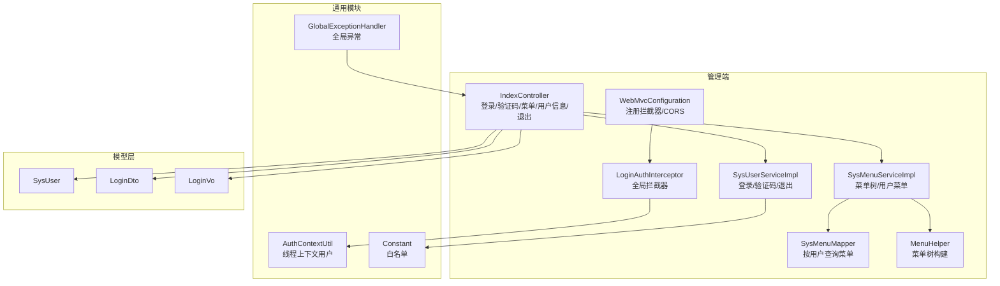
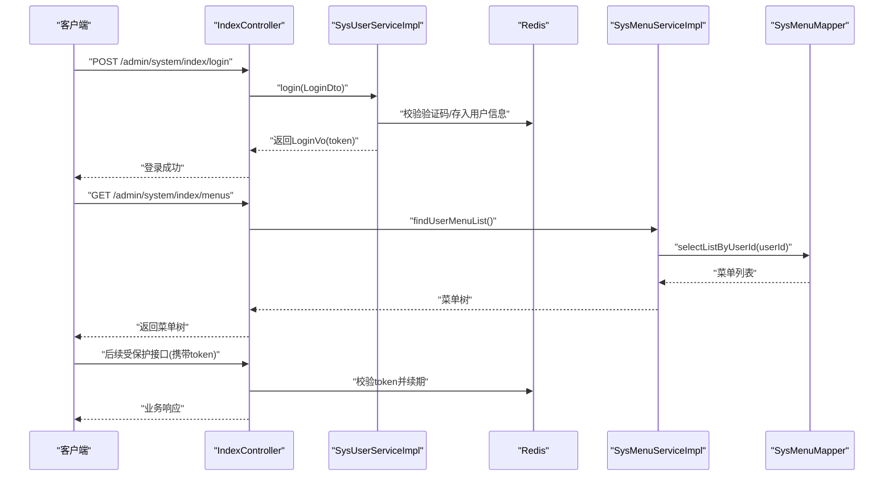
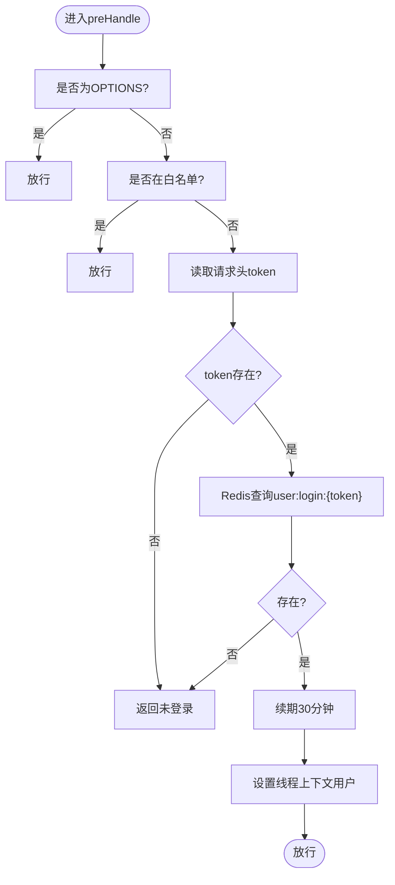
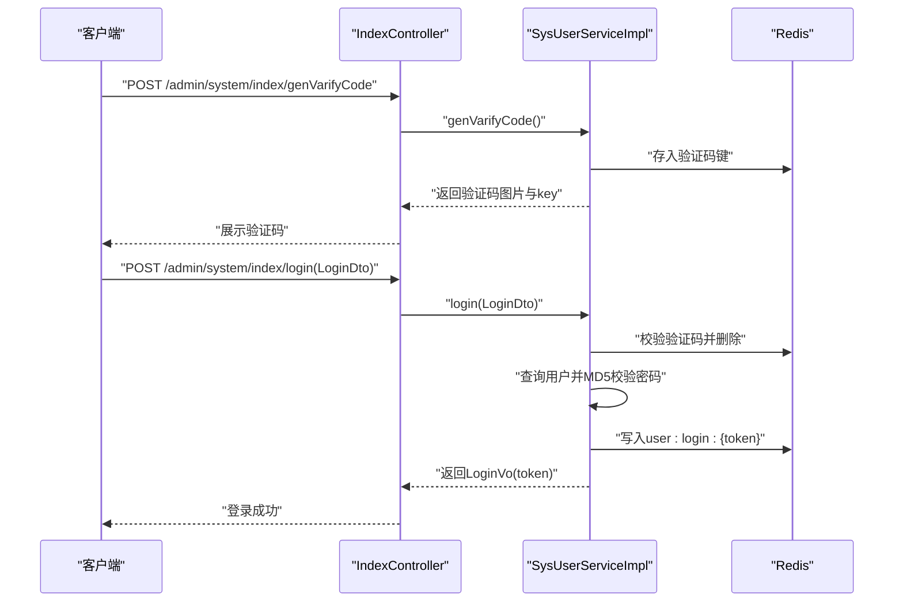
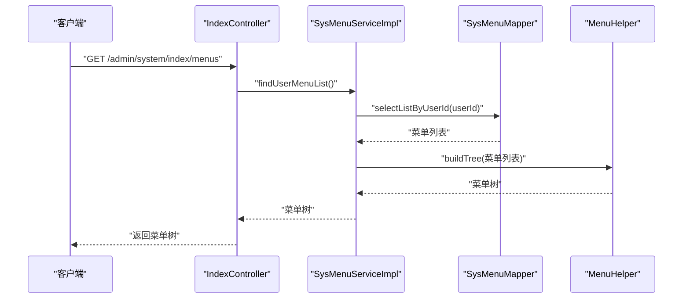
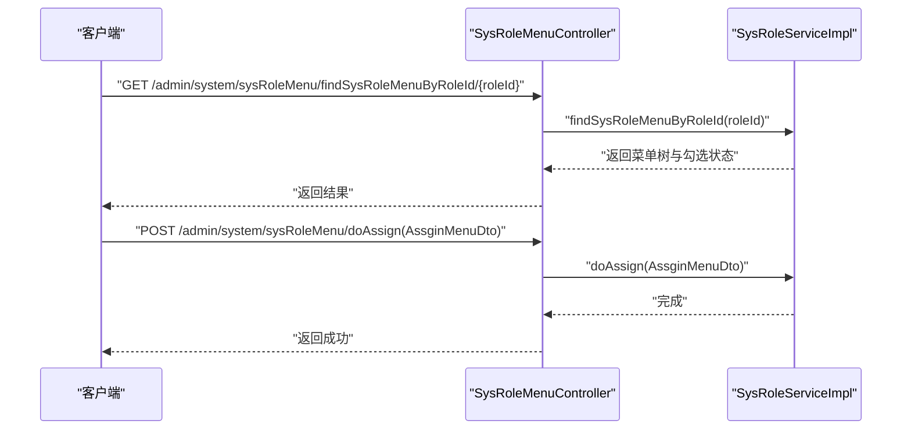
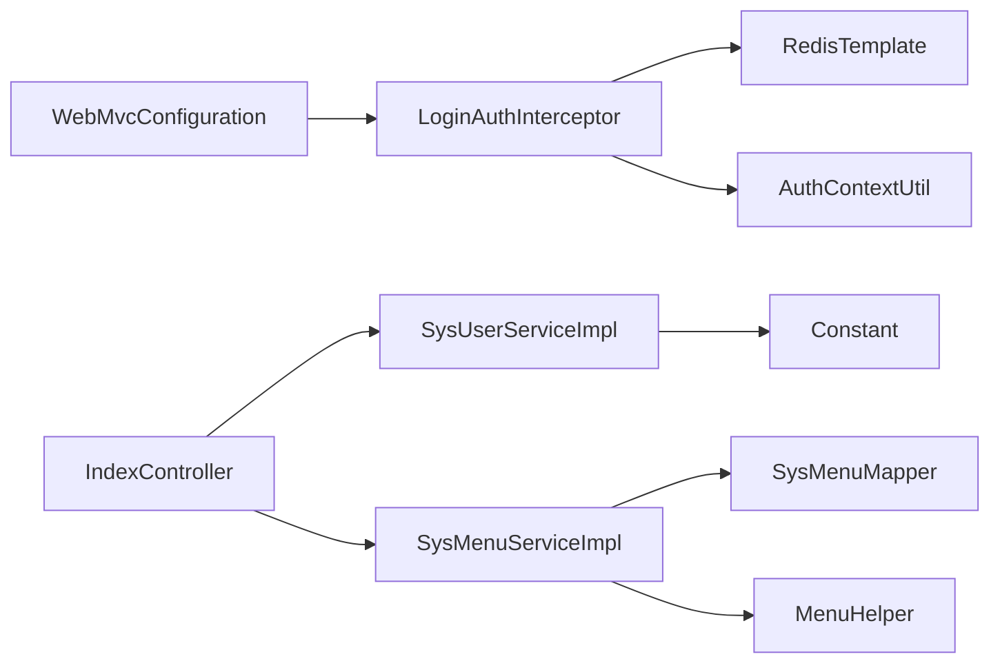

# 权限认证机制

<cite>
**本文引用的文件**
- [spzx-manager/src/main/java/com/joker/spzx/manager/config/LoginAuthInterceptor.java](file://spzx-manager/src/main/java/com/joker/spzx/manager/config/LoginAuthInterceptor.java)
- [spzx-manager/src/main/java/com/joker/spzx/manager/config/WebMvcConfiguration.java](file://spzx-manager/src/main/java/com/joker/spzx/manager/config/WebMvcConfiguration.java)
- [spzx-manager/src/main/java/com/joker/spzx/manager/controller/IndexController.java](file://spzx-manager/src/main/java/com/joker/spzx/manager/controller/IndexController.java)
- [spzx-manager/src/main/java/com/joker/spzx/manager/service/impl/SysUserServiceImpl.java](file://spzx-manager/src/main/java/com/joker/spzx/manager/service/impl/SysUserServiceImpl.java)
- [spzx-manager/src/main/java/com/joker/spzx/manager/service/impl/SysMenuServiceImpl.java](file://spzx-manager/src/main/java/com/joker/spzx/manager/service/impl/SysMenuServiceImpl.java)
- [spzx-manager/src/main/java/com/joker/spzx/manager/mapper/SysMenuMapper.java](file://spzx-manager/src/main/java/com/joker/spzx/manager/mapper/SysMenuMapper.java)
- [spzx-manager/src/main/java/com/joker/spzx/manager/helper/MenuHelper.java](file://spzx-manager/src/main/java/com/joker/spzx/manager/helper/MenuHelper.java)
- [spzx-manager/src/main/java/com/joker/spzx/manager/controller/SysRoleMenuController.java](file://spzx-manager/src/main/java/com/joker/spzx/manager/controller/SysRoleMenuController.java)
- [spzx-manager/src/main/java/com/joker/spzx/manager/service/impl/SysRoleServiceImpl.java](file://spzx-manager/src/main/java/com/joker/spzx/manager/service/impl/SysRoleServiceImpl.java)
- [spzx-common/common-util/src/main/java/com/joker/spzx/utils/AuthContextUtil.java](file://spzx-common/common-util/src/main/java/com/joker/spzx/utils/AuthContextUtil.java)
- [spzx-common/common-util/src/main/java/com/joker/spzx/utils/Constant.java](file://spzx-common/common-util/src/main/java/com/joker/spzx/utils/Constant.java)
- [spzx-common/common-service/src/main/java/com/joker/spzx/common/exception/GlobalExceptionHandler.java](file://spzx-common/common-service/src/main/java/com/joker/spzx/common/exception/GlobalExceptionHandler.java)
- [spzx-model/src/main/java/com/joker/spzx/model/entity/system/SysUser.java](file://spzx-model/src/main/java/com/joker/spzx/model/entity/system/SysUser.java)
- [spzx-model/src/main/java/com/joker/spzx/model/vo/system/LoginVo.java](file://spzx-model/src/main/java/com/joker/spzx/model/vo/system/LoginVo.java)
- [spzx-model/src/main/java/com/joker/spzx/model/dto/system/LoginDto.java](file://spzx-model/src/main/java/com/joker/spzx/model/dto/system/LoginDto.java)
</cite>

## 目录
1. [简介](#简介)
2. [项目结构](#项目结构)
3. [核心组件](#核心组件)
4. [架构总览](#架构总览)
5. [详细组件分析](#详细组件分析)
6. [依赖分析](#依赖分析)
7. [性能考虑](#性能考虑)
8. [故障排查指南](#故障排查指南)
9. [结论](#结论)
10. [附录](#附录)

## 简介
本文件面向SPZX项目的权限认证机制，围绕“基于Token的认证流程、登录拦截器实现、Redis会话管理策略”展开，同时覆盖“JWT Token的生成、验证与刷新机制”、“用户权限控制、菜单权限分配与操作权限验证”、“认证流程图、拦截器配置与安全策略”、“权限系统与业务系统的集成与扩展方法”，并提供“安全最佳实践、防护措施与常见攻击防范”的指导。

## 项目结构
SPZX采用前后端分离架构，后端以Spring Boot + Spring MVC + MyBatis-Plus构建，权限控制集中在管理端模块（spzx-manager），通过拦截器统一鉴权，使用Redis进行会话存储；通用工具与常量位于common模块；模型层定义了用户、登录DTO/VO等基础数据结构。

图表来源
- [spzx-manager/src/main/java/com/joker/spzx/manager/controller/IndexController.java:1-68](file://spzx-manager/src/main/java/com/joker/spzx/manager/controller/IndexController.java#L1-L68)
- [spzx-manager/src/main/java/com/joker/spzx/manager/service/impl/SysUserServiceImpl.java:56-111](file://spzx-manager/src/main/java/com/joker/spzx/manager/service/impl/SysUserServiceImpl.java#L56-L111)
- [spzx-manager/src/main/java/com/joker/spzx/manager/service/impl/SysMenuServiceImpl.java:93-116](file://spzx-manager/src/main/java/com/joker/spzx/manager/service/impl/SysMenuServiceImpl.java#L93-L116)
- [spzx-manager/src/main/java/com/joker/spzx/manager/mapper/SysMenuMapper.java:21-22](file://spzx-manager/src/main/java/com/joker/spzx/manager/mapper/SysMenuMapper.java#L21-L22)
- [spzx-manager/src/main/java/com/joker/spzx/manager/helper/MenuHelper.java:16-43](file://spzx-manager/src/main/java/com/joker/spzx/manager/helper/MenuHelper.java#L16-L43)
- [spzx-manager/src/main/java/com/joker/spzx/manager/config/LoginAuthInterceptor.java:29-58](file://spzx-manager/src/main/java/com/joker/spzx/manager/config/LoginAuthInterceptor.java#L29-L58)
- [spzx-manager/src/main/java/com/joker/spzx/manager/config/WebMvcConfiguration.java:19-25](file://spzx-manager/src/main/java/com/joker/spzx/manager/config/WebMvcConfiguration.java#L19-L25)
- [spzx-common/common-util/src/main/java/com/joker/spzx/utils/AuthContextUtil.java:5-20](file://spzx-common/common-util/src/main/java/com/joker/spzx/utils/AuthContextUtil.java#L5-L20)
- [spzx-common/common-util/src/main/java/com/joker/spzx/utils/Constant.java:9-25](file://spzx-common/common-util/src/main/java/com/joker/spzx/utils/Constant.java#L9-L25)
- [spzx-common/common-service/src/main/java/com/joker/spzx/common/exception/GlobalExceptionHandler.java:1-20](file://spzx-common/common-service/src/main/java/com/joker/spzx/common/exception/GlobalExceptionHandler.java#L1-L20)
- [spzx-model/src/main/java/com/joker/spzx/model/entity/system/SysUser.java:1-42](file://spzx-model/src/main/java/com/joker/spzx/model/entity/system/SysUser.java#L1-L42)
- [spzx-model/src/main/java/com/joker/spzx/model/vo/system/LoginVo.java:1-17](file://spzx-model/src/main/java/com/joker/spzx/model/vo/system/LoginVo.java#L1-L17)
- [spzx-model/src/main/java/com/joker/spzx/model/dto/system/LoginDto.java:1-28](file://spzx-model/src/main/java/com/joker/spzx/model/dto/system/LoginDto.java#L1-L28)

章节来源
- [spzx-manager/src/main/java/com/joker/spzx/manager/config/WebMvcConfiguration.java:19-25](file://spzx-manager/src/main/java/com/joker/spzx/manager/config/WebMvcConfiguration.java#L19-L25)
- [spzx-common/common-util/src/main/java/com/joker/spzx/utils/Constant.java:9-25](file://spzx-common/common-util/src/main/java/com/joker/spzx/utils/Constant.java#L9-L25)

## 核心组件
- 登录拦截器：统一校验token、放行白名单、续期Redis会话、注入当前用户至线程上下文，并在请求完成后清理。
- WebMvc配置：注册拦截器并对路径进行匹配，同时配置跨域策略。
- 用户服务：登录时校验验证码、校验账号密码、生成token并写入Redis；提供生成验证码、获取用户信息、退出登录等能力。
- 菜单服务：按用户查询可访问菜单，构建菜单树，供前端动态渲染。
- 认证上下文：ThreadLocal保存当前用户，便于业务层直接读取。
- 白名单常量：定义无需登录即可访问的URL集合。
- 全局异常：统一封装异常返回格式。

章节来源
- [spzx-manager/src/main/java/com/joker/spzx/manager/config/LoginAuthInterceptor.java:29-58](file://spzx-manager/src/main/java/com/joker/spzx/manager/config/LoginAuthInterceptor.java#L29-L58)
- [spzx-manager/src/main/java/com/joker/spzx/manager/config/WebMvcConfiguration.java:19-25](file://spzx-manager/src/main/java/com/joker/spzx/manager/config/WebMvcConfiguration.java#L19-L25)
- [spzx-manager/src/main/java/com/joker/spzx/manager/service/impl/SysUserServiceImpl.java:56-111](file://spzx-manager/src/main/java/com/joker/spzx/manager/service/impl/SysUserServiceImpl.java#L56-L111)
- [spzx-manager/src/main/java/com/joker/spzx/manager/service/impl/SysMenuServiceImpl.java:93-116](file://spzx-manager/src/main/java/com/joker/spzx/manager/service/impl/SysMenuServiceImpl.java#L93-L116)
- [spzx-common/common-util/src/main/java/com/joker/spzx/utils/AuthContextUtil.java:5-20](file://spzx-common/common-util/src/main/java/com/joker/spzx/utils/AuthContextUtil.java#L5-L20)
- [spzx-common/common-util/src/main/java/com/joker/spzx/utils/Constant.java:9-25](file://spzx-common/common-util/src/main/java/com/joker/spzx/utils/Constant.java#L9-L25)
- [spzx-common/common-service/src/main/java/com/joker/spzx/common/exception/GlobalExceptionHandler.java:1-20](file://spzx-common/common-service/src/main/java/com/joker/spzx/common/exception/GlobalExceptionHandler.java#L1-L20)

## 架构总览
下图展示了从客户端发起请求到后端鉴权、菜单加载与业务处理的整体流程，以及与Redis的交互。

图表来源
- [spzx-manager/src/main/java/com/joker/spzx/manager/controller/IndexController.java:32-66](file://spzx-manager/src/main/java/com/joker/spzx/manager/controller/IndexController.java#L32-L66)
- [spzx-manager/src/main/java/com/joker/spzx/manager/service/impl/SysUserServiceImpl.java:56-111](file://spzx-manager/src/main/java/com/joker/spzx/manager/service/impl/SysUserServiceImpl.java#L56-L111)
- [spzx-manager/src/main/java/com/joker/spzx/manager/service/impl/SysMenuServiceImpl.java:93-116](file://spzx-manager/src/main/java/com/joker/spzx/manager/service/impl/SysMenuServiceImpl.java#L93-L116)
- [spzx-manager/src/main/java/com/joker/spzx/manager/mapper/SysMenuMapper.java:21-22](file://spzx-manager/src/main/java/com/joker/spzx/manager/mapper/SysMenuMapper.java#L21-L22)

## 详细组件分析

### 登录拦截器与会话管理
- 白名单放行：对OPTIONS请求与白名单路径直接放行。
- Token校验：从请求头读取token，若缺失或Redis中不存在则返回未登录状态。
- 会话续期：命中后更新Redis键过期时间为30分钟，避免频繁登录。
- 上下文注入：解析用户信息并写入线程上下文，便于业务层读取。
- 清理资源：请求完成后移除线程上下文，防止内存泄漏。

图表来源
- [spzx-manager/src/main/java/com/joker/spzx/manager/config/LoginAuthInterceptor.java:29-58](file://spzx-manager/src/main/java/com/joker/spzx/manager/config/LoginAuthInterceptor.java#L29-L58)
- [spzx-common/common-util/src/main/java/com/joker/spzx/utils/Constant.java:9-25](file://spzx-common/common-util/src/main/java/com/joker/spzx/utils/Constant.java#L9-L25)

章节来源
- [spzx-manager/src/main/java/com/joker/spzx/manager/config/LoginAuthInterceptor.java:29-58](file://spzx-manager/src/main/java/com/joker/spzx/manager/config/LoginAuthInterceptor.java#L29-L58)
- [spzx-manager/src/main/java/com/joker/spzx/manager/config/WebMvcConfiguration.java:19-25](file://spzx-manager/src/main/java/com/joker/spzx/manager/config/WebMvcConfiguration.java#L19-L25)
- [spzx-common/common-util/src/main/java/com/joker/spzx/utils/AuthContextUtil.java:5-20](file://spzx-common/common-util/src/main/java/com/joker/spzx/utils/AuthContextUtil.java#L5-L20)

### 用户登录与会话存储
- 验证码校验：登录前先获取验证码，提交时校验codeKey与captcha，通过后删除该验证码键。
- 密码校验：MD5摘要比对数据库密码。
- 会话存储：生成UUID作为token，将用户JSON串写入Redis键"user:login:{token}"，有效期365天。
- 返回结构：LoginVo包含token字段（refresh_token可为空）。

图表来源
- [spzx-manager/src/main/java/com/joker/spzx/manager/controller/IndexController.java:32-44](file://spzx-manager/src/main/java/com/joker/spzx/manager/controller/IndexController.java#L32-L44)
- [spzx-manager/src/main/java/com/joker/spzx/manager/service/impl/SysUserServiceImpl.java:56-100](file://spzx-manager/src/main/java/com/joker/spzx/manager/service/impl/SysUserServiceImpl.java#L56-L100)
- [spzx-model/src/main/java/com/joker/spzx/model/dto/system/LoginDto.java:1-28](file://spzx-model/src/main/java/com/joker/spzx/model/dto/system/LoginDto.java#L1-L28)
- [spzx-model/src/main/java/com/joker/spzx/model/vo/system/LoginVo.java:1-17](file://spzx-model/src/main/java/com/joker/spzx/model/vo/system/LoginVo.java#L1-L17)

章节来源
- [spzx-manager/src/main/java/com/joker/spzx/manager/controller/IndexController.java:32-44](file://spzx-manager/src/main/java/com/joker/spzx/manager/controller/IndexController.java#L32-L44)
- [spzx-manager/src/main/java/com/joker/spzx/manager/service/impl/SysUserServiceImpl.java:56-100](file://spzx-manager/src/main/java/com/joker/spzx/manager/service/impl/SysUserServiceImpl.java#L56-L100)
- [spzx-model/src/main/java/com/joker/spzx/model/dto/system/LoginDto.java:1-28](file://spzx-model/src/main/java/com/joker/spzx/model/dto/system/LoginDto.java#L1-L28)
- [spzx-model/src/main/java/com/joker/spzx/model/vo/system/LoginVo.java:1-17](file://spzx-model/src/main/java/com/joker/spzx/model/vo/system/LoginVo.java#L1-L17)

### 菜单权限与动态菜单
- 用户菜单查询：通过SysMenuMapper按用户ID查询其可访问菜单，再由MenuHelper构建树形结构。
- 前端渲染：IndexController提供/menus接口返回菜单树，支持前端路由与按钮级权限控制。

图表来源
- [spzx-manager/src/main/java/com/joker/spzx/manager/controller/IndexController.java:61-66](file://spzx-manager/src/main/java/com/joker/spzx/manager/controller/IndexController.java#L61-L66)
- [spzx-manager/src/main/java/com/joker/spzx/manager/service/impl/SysMenuServiceImpl.java:93-116](file://spzx-manager/src/main/java/com/joker/spzx/manager/service/impl/SysMenuServiceImpl.java#L93-L116)
- [spzx-manager/src/main/java/com/joker/spzx/manager/mapper/SysMenuMapper.java:21-22](file://spzx-manager/src/main/java/com/joker/spzx/manager/mapper/SysMenuMapper.java#L21-L22)
- [spzx-manager/src/main/java/com/joker/spzx/manager/helper/MenuHelper.java:16-43](file://spzx-manager/src/main/java/com/joker/spzx/manager/helper/MenuHelper.java#L16-L43)

章节来源
- [spzx-manager/src/main/java/com/joker/spzx/manager/service/impl/SysMenuServiceImpl.java:93-116](file://spzx-manager/src/main/java/com/joker/spzx/manager/service/impl/SysMenuServiceImpl.java#L93-L116)
- [spzx-manager/src/main/java/com/joker/spzx/manager/mapper/SysMenuMapper.java:21-22](file://spzx-manager/src/main/java/com/joker/spzx/manager/mapper/SysMenuMapper.java#L21-L22)
- [spzx-manager/src/main/java/com/joker/spzx/manager/helper/MenuHelper.java:16-43](file://spzx-manager/src/main/java/com/joker/spzx/manager/helper/MenuHelper.java#L16-L43)

### 角色与菜单权限分配
- 角色菜单查询：根据角色ID查询菜单树及勾选状态，用于后台配置。
- 角色菜单分配：接收分配请求，持久化角色与菜单关联关系。

图表来源
- [spzx-manager/src/main/java/com/joker/spzx/manager/controller/SysRoleMenuController.java:30-42](file://spzx-manager/src/main/java/com/joker/spzx/manager/controller/SysRoleMenuController.java#L30-L42)
- [spzx-manager/src/main/java/com/joker/spzx/manager/service/impl/SysRoleServiceImpl.java:71-82](file://spzx-manager/src/main/java/com/joker/spzx/manager/service/impl/SysRoleServiceImpl.java#L71-L82)

章节来源
- [spzx-manager/src/main/java/com/joker/spzx/manager/controller/SysRoleMenuController.java:30-42](file://spzx-manager/src/main/java/com/joker/spzx/manager/controller/SysRoleMenuController.java#L30-L42)
- [spzx-manager/src/main/java/com/joker/spzx/manager/service/impl/SysRoleServiceImpl.java:71-82](file://spzx-manager/src/main/java/com/joker/spzx/manager/service/impl/SysRoleServiceImpl.java#L71-L82)

### JWT Token的生成、验证与刷新机制
- 生成：登录成功后生成UUID作为token，写入Redis并返回给前端。
- 验证：拦截器从请求头读取token并在Redis中校验是否存在。
- 刷新：当前实现未提供refresh_token与刷新逻辑。建议在LoginVo中启用refresh_token字段，并在拦截器中增加刷新策略（如双token模式）。

章节来源
- [spzx-manager/src/main/java/com/joker/spzx/manager/service/impl/SysUserServiceImpl.java:79-83](file://spzx-manager/src/main/java/com/joker/spzx/manager/service/impl/SysUserServiceImpl.java#L79-L83)
- [spzx-manager/src/main/java/com/joker/spzx/manager/config/LoginAuthInterceptor.java:40-52](file://spzx-manager/src/main/java/com/joker/spzx/manager/config/LoginAuthInterceptor.java#L40-L52)
- [spzx-model/src/main/java/com/joker/spzx/model/vo/system/LoginVo.java:10-14](file://spzx-model/src/main/java/com/joker/spzx/model/vo/system/LoginVo.java#L10-L14)

### 用户权限控制、菜单权限分配与操作权限验证
- 用户权限控制：通过拦截器校验token，确保只有已登录用户可访问受保护接口。
- 菜单权限分配：SysRoleMenuController提供角色菜单分配接口，配合SysRoleServiceImpl维护角色与菜单关系。
- 操作权限验证：当前拦截器未对具体操作（如按钮权限）进行细粒度校验，可在业务层结合菜单树与用户角色进一步扩展。

章节来源
- [spzx-manager/src/main/java/com/joker/spzx/manager/config/LoginAuthInterceptor.java:29-58](file://spzx-manager/src/main/java/com/joker/spzx/manager/config/LoginAuthInterceptor.java#L29-L58)
- [spzx-manager/src/main/java/com/joker/spzx/manager/controller/SysRoleMenuController.java:37-42](file://spzx-manager/src/main/java/com/joker/spzx/manager/controller/SysRoleMenuController.java#L37-L42)
- [spzx-manager/src/main/java/com/joker/spzx/manager/service/impl/SysRoleServiceImpl.java:71-82](file://spzx-manager/src/main/java/com/joker/spzx/manager/service/impl/SysRoleServiceImpl.java#L71-L82)

### 权限系统与业务系统的集成与扩展方法
- 集成点：拦截器统一接入，业务层通过AuthContextUtil读取当前用户；菜单树驱动前端权限。
- 扩展方向：
  - 在拦截器中增加基于URL/方法的操作权限校验。
  - 引入注解式权限控制（如@PreAuthorize）与AOP切面。
  - 完善JWT刷新策略与黑名单机制。
  - 增加审计日志与异常监控。

章节来源
- [spzx-common/common-util/src/main/java/com/joker/spzx/utils/AuthContextUtil.java:5-20](file://spzx-common/common-util/src/main/java/com/joker/spzx/utils/AuthContextUtil.java#L5-L20)
- [spzx-manager/src/main/java/com/joker/spzx/manager/config/LoginAuthInterceptor.java:29-58](file://spzx-manager/src/main/java/com/joker/spzx/manager/config/LoginAuthInterceptor.java#L29-L58)

## 依赖分析
- 组件耦合：拦截器依赖RedisTemplate与Constant白名单；WebMvcConfiguration依赖拦截器；IndexController依赖用户与菜单服务；菜单服务依赖Mapper与MenuHelper。
- 外部依赖：Redis用于会话存储；MyBatis-Plus用于菜单查询；Swagger用于接口文档。

图表来源
- [spzx-manager/src/main/java/com/joker/spzx/manager/config/LoginAuthInterceptor.java:26-27](file://spzx-manager/src/main/java/com/joker/spzx/manager/config/LoginAuthInterceptor.java#L26-L27)
- [spzx-manager/src/main/java/com/joker/spzx/manager/config/WebMvcConfiguration.java:17-18](file://spzx-manager/src/main/java/com/joker/spzx/manager/config/WebMvcConfiguration.java#L17-L18)
- [spzx-manager/src/main/java/com/joker/spzx/manager/controller/IndexController.java:26-30](file://spzx-manager/src/main/java/com/joker/spzx/manager/controller/IndexController.java#L26-L30)
- [spzx-manager/src/main/java/com/joker/spzx/manager/service/impl/SysMenuServiceImpl.java:33-36](file://spzx-manager/src/main/java/com/joker/spzx/manager/service/impl/SysMenuServiceImpl.java#L33-L36)
- [spzx-manager/src/main/java/com/joker/spzx/manager/mapper/SysMenuMapper.java:21-22](file://spzx-manager/src/main/java/com/joker/spzx/manager/mapper/SysMenuMapper.java#L21-L22)
- [spzx-manager/src/main/java/com/joker/spzx/manager/helper/MenuHelper.java:1-45](file://spzx-manager/src/main/java/com/joker/spzx/manager/helper/MenuHelper.java#L1-L45)
- [spzx-manager/src/main/java/com/joker/spzx/manager/service/impl/SysUserServiceImpl.java:49-50](file://spzx-manager/src/main/java/com/joker/spzx/manager/service/impl/SysUserServiceImpl.java#L49-L50)
- [spzx-common/common-util/src/main/java/com/joker/spzx/utils/Constant.java:9-25](file://spzx-common/common-util/src/main/java/com/joker/spzx/utils/Constant.java#L9-L25)

章节来源
- [spzx-manager/src/main/java/com/joker/spzx/manager/config/LoginAuthInterceptor.java:26-27](file://spzx-manager/src/main/java/com/joker/spzx/manager/config/LoginAuthInterceptor.java#L26-L27)
- [spzx-manager/src/main/java/com/joker/spzx/manager/config/WebMvcConfiguration.java:17-18](file://spzx-manager/src/main/java/com/joker/spzx/manager/config/WebMvcConfiguration.java#L17-L18)
- [spzx-manager/src/main/java/com/joker/spzx/manager/controller/IndexController.java:26-30](file://spzx-manager/src/main/java/com/joker/spzx/manager/controller/IndexController.java#L26-L30)

## 性能考虑
- Redis热点键：user:login:{token}可能成为热点，建议使用Redis集群与合理的过期策略。
- 过期时间：当前拦截器续期为30分钟，登录态有效期为365天，建议根据业务场景调整。
- 序列化开销：用户对象序列化为JSON存储，建议评估对象大小与序列化成本。
- 缓存穿透：验证码键与登录态键均设置过期，避免长期占用内存。

## 故障排查指南
- 未登录返回：拦截器在token缺失或Redis中不存在时返回未登录状态，检查请求头token与Redis键是否存在。
- 验证码错误：登录时验证码不匹配会抛出自定义异常，确认codeKey与captcha是否一致且未过期。
- CORS问题：WebMvcConfiguration配置了跨域，若前端无法访问，检查allowedOrigins与allowedHeaders设置。
- 全局异常：全局异常处理器统一捕获异常并返回标准格式，便于定位问题。

章节来源
- [spzx-manager/src/main/java/com/joker/spzx/manager/config/LoginAuthInterceptor.java:40-52](file://spzx-manager/src/main/java/com/joker/spzx/manager/config/LoginAuthInterceptor.java#L40-L52)
- [spzx-manager/src/main/java/com/joker/spzx/manager/service/impl/SysUserServiceImpl.java:59-63](file://spzx-manager/src/main/java/com/joker/spzx/manager/service/impl/SysUserServiceImpl.java#L59-L63)
- [spzx-manager/src/main/java/com/joker/spzx/manager/config/WebMvcConfiguration.java:27-35](file://spzx-manager/src/main/java/com/joker/spzx/manager/config/WebMvcConfiguration.java#L27-L35)
- [spzx-common/common-service/src/main/java/com/joker/spzx/common/exception/GlobalExceptionHandler.java:9-19](file://spzx-common/common-service/src/main/java/com/joker/spzx/common/exception/GlobalExceptionHandler.java#L9-L19)

## 结论
SPZX当前采用“基于Token的会话管理 + 全局拦截器 + Redis存储”的认证方案，实现了登录、菜单权限与基本的跨域支持。建议后续完善JWT刷新机制、细化操作权限校验、引入更完善的审计与风控体系，以满足生产环境的安全与稳定性要求。

## 附录
- 安全最佳实践
  - 强制HTTPS传输，避免明文泄露token。
  - 合理设置token过期时间与续期策略，避免长期有效令牌。
  - 对敏感接口增加二次校验（如短信/邮箱验证码）。
  - 使用随机性强的token，避免可预测性。
  - 定期轮换密钥与清理无效会话。
- 防护措施与常见攻击防范
  - 防暴力破解：限制登录尝试次数与频率，验证码+滑动验证。
  - 防重放攻击：引入时间戳与随机数，服务端校验。
  - 防XSS/CSRF：前端严格转义与同源策略，后端校验Referer与SameSite Cookie。
  - 防枚举：对错误信息进行脱敏，避免泄露内部细节。