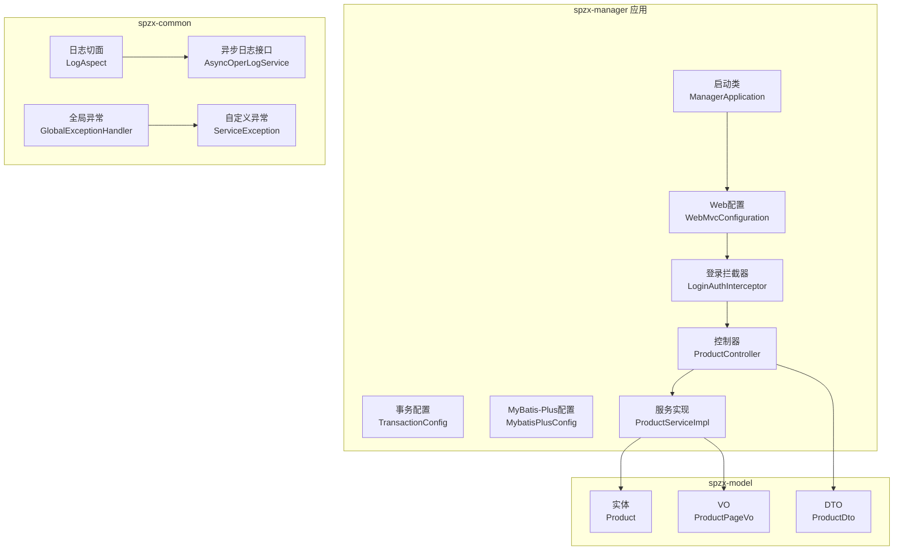
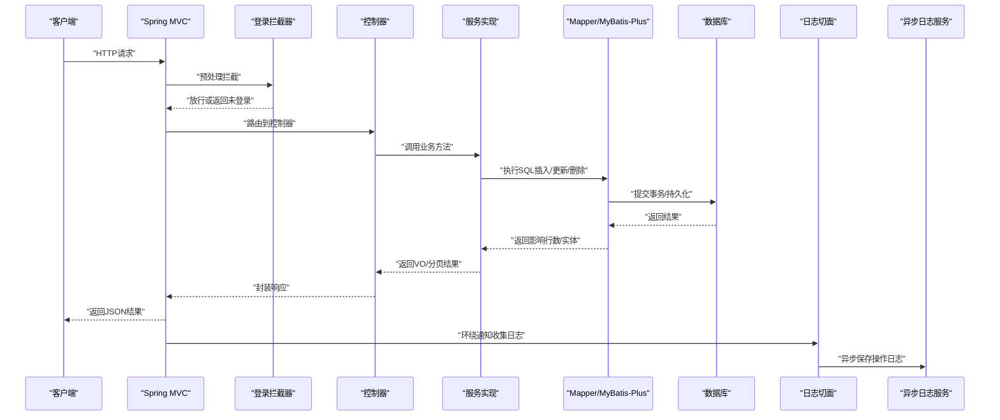
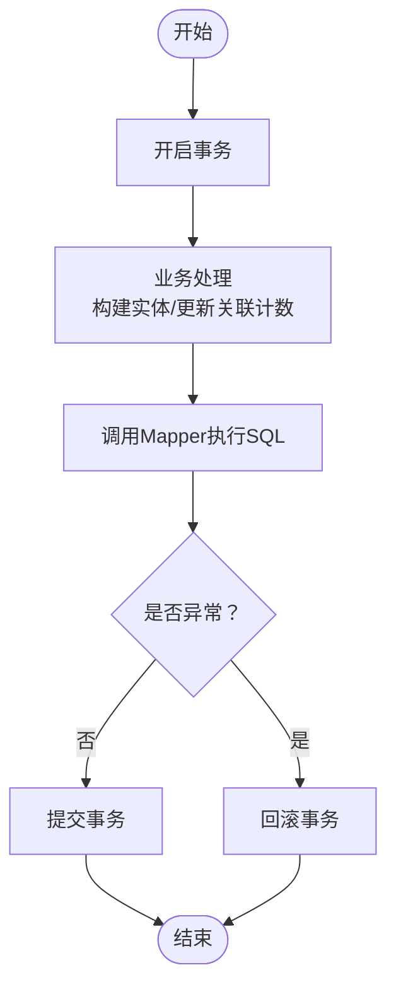
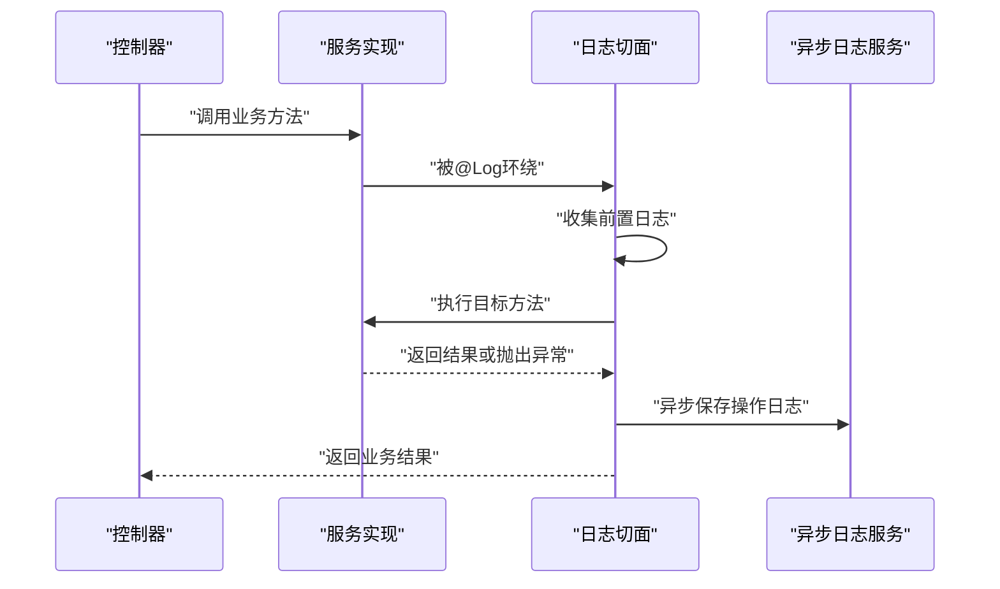
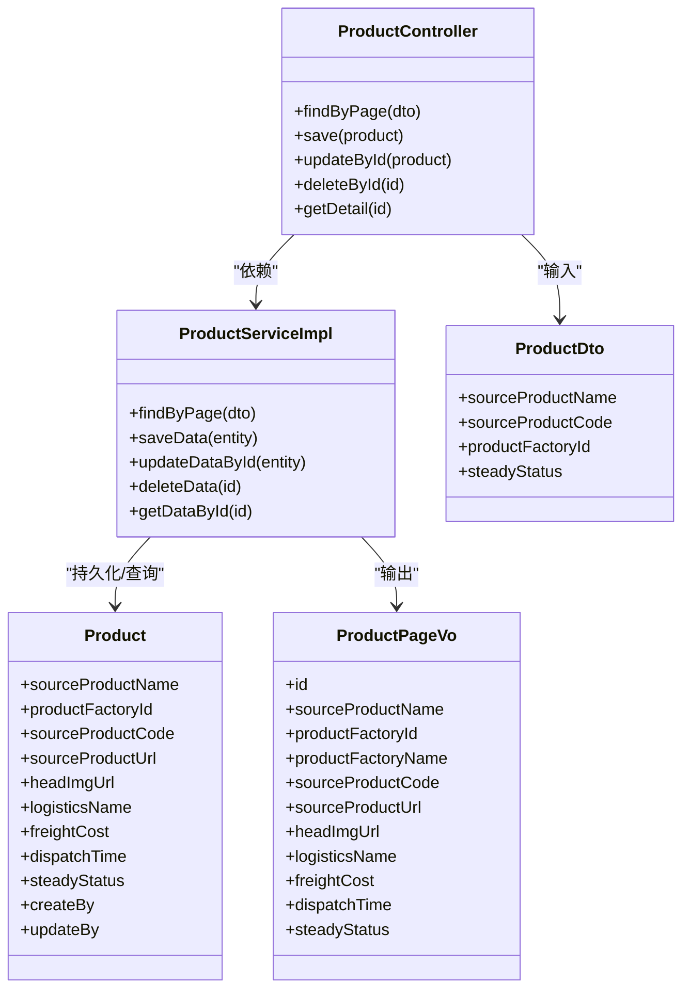
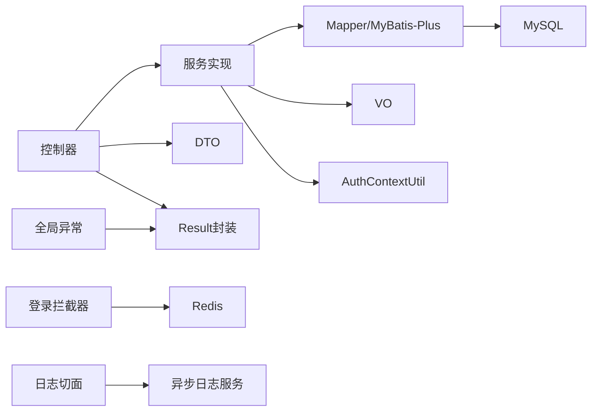

# 数据流设计

<cite>
**本文引用的文件**
- [ManagerApplication.java](file://spzx-manager/src/main/java/com/joker/spzx/manager/ManagerApplication.java)
- [WebMvcConfiguration.java](file://spzx-manager/src/main/java/com/joker/spzx/manager/config/WebMvcConfiguration.java)
- [LoginAuthInterceptor.java](file://spzx-manager/src/main/java/com/joker/spzx/manager/config/LoginAuthInterceptor.java)
- [TransactionConfig.java](file://spzx-manager/src/main/java/com/joker/spzx/manager/config/TransactionConfig.java)
- [MybatisPlusConfig.java](file://spzx-manager/src/main/java/com/joker/spzx/manager/config/MybatisPlusConfig.java)
- [LogAspect.java](file://spzx-common/common-log/src/main/java/com/joker/spzx/common/aspect/LogAspect.java)
- [AsyncOperLogService.java](file://spzx-common/common-log/src/main/java/com/joker/spzx/common/service/AsyncOperLogService.java)
- [GlobalExceptionHandler.java](file://spzx-common/common-service/src/main/java/com/joker/spzx/common/exception/GlobalExceptionHandler.java)
- [ServiceException.java](file://spzx-common/common-service/src/main/java/com/joker/spzx/common/exception/ServiceException.java)
- [ProductController.java](file://spzx-manager/src/main/java/com/joker/spzx/manager/controller/ProductController.java)
- [ProductServiceImpl.java](file://spzx-manager/src/main/java/com/joker/spzx/manager/service/impl/ProductServiceImpl.java)
- [Product.java](file://spzx-model/src/main/java/com/joker/spzx/model/entity/product/Product.java)
- [ProductDto.java](file://spzx-model/src/main/java/com/joker/spzx/model/dto/product/ProductDto.java)
- [ProductPageVo.java](file://spzx-model/src/main/java/com/joker/spzx/model/vo/product/ProductPageVo.java)
- [application.yml](file://spzx-manager/src/main/resources/application.yml)
</cite>

## 目录
1. [引言](#引言)
2. [项目结构](#项目结构)
3. [核心组件](#核心组件)
4. [架构总览](#架构总览)
5. [详细组件分析](#详细组件分析)
6. [依赖分析](#依赖分析)
7. [性能考虑](#性能考虑)
8. [故障排查指南](#故障排查指南)
9. [结论](#结论)
10. [附录](#附录)

## 引言
本文件面向SPZX项目的“数据流设计”，系统性梳理从HTTP请求到数据库操作的完整数据流转过程，覆盖请求接收、参数验证、业务处理、数据持久化、异步日志、事务管理、异常处理与安全控制等环节，并提供数据流图与时序图，帮助开发者与运维人员快速理解与优化系统。

## 项目结构
SPZX采用多模块分层架构：
- spzx-manager：管理端应用，包含控制器、服务、配置、拦截器、MyBatis-Plus配置、任务调度等。
- spzx-model：领域模型与DTO/VO，定义实体、查询条件与返回视图。
- spzx-common：通用能力，包括全局异常、日志切面与异步日志服务接口。

图表来源
- [ManagerApplication.java:1-20](file://spzx-manager/src/main/java/com/joker/spzx/manager/ManagerApplication.java#L1-L20)
- [WebMvcConfiguration.java:1-39](file://spzx-manager/src/main/java/com/joker/spzx/manager/config/WebMvcConfiguration.java#L1-L39)
- [LoginAuthInterceptor.java:1-81](file://spzx-manager/src/main/java/com/joker/spzx/manager/config/LoginAuthInterceptor.java#L1-L81)
- [TransactionConfig.java:1-19](file://spzx-manager/src/main/java/com/joker/spzx/manager/config/TransactionConfig.java#L1-L19)
- [MybatisPlusConfig.java:1-132](file://spzx-manager/src/main/java/com/joker/spzx/manager/config/MybatisPlusConfig.java#L1-L132)
- [ProductController.java:1-59](file://spzx-manager/src/main/java/com/joker/spzx/manager/controller/ProductController.java#L1-L59)
- [ProductServiceImpl.java:1-141](file://spzx-manager/src/main/java/com/joker/spzx/manager/service/impl/ProductServiceImpl.java#L1-L141)
- [Product.java:1-58](file://spzx-model/src/main/java/com/joker/spzx/model/entity/product/Product.java#L1-L58)
- [ProductDto.java:1-24](file://spzx-model/src/main/java/com/joker/spzx/model/dto/product/ProductDto.java#L1-L24)
- [ProductPageVo.java:1-46](file://spzx-model/src/main/java/com/joker/spzx/model/vo/product/ProductPageVo.java#L1-L46)
- [LogAspect.java:1-47](file://spzx-common/common-log/src/main/java/com/joker/spzx/common/aspect/LogAspect.java#L1-L47)
- [AsyncOperLogService.java:1-9](file://spzx-common/common-log/src/main/java/com/joker/spzx/common/service/AsyncOperLogService.java#L1-L9)
- [GlobalExceptionHandler.java:1-20](file://spzx-common/common-service/src/main/java/com/joker/spzx/common/exception/GlobalExceptionHandler.java#L1-L20)
- [ServiceException.java:1-26](file://spzx-common/common-service/src/main/java/com/joker/spzx/common/exception/ServiceException.java#L1-L26)

章节来源
- [application.yml:1-5](file://spzx-manager/src/main/resources/application.yml#L1-L5)

## 核心组件
- 启动与装配
  - 应用入口启用日志切面与Spring Boot自动装配，确保AOP与组件扫描生效。
- Web与安全
  - Web配置注册拦截器与CORS策略；登录拦截器从Redis读取用户会话，注入上下文并刷新过期时间。
- 事务与持久化
  - 事务管理器基于数据源；MyBatis-Plus配置乐观锁、分页与线程池，提升并发与分页性能。
- 日志与异常
  - 切面式操作日志收集与异步落库；全局异常统一包装返回；自定义异常携带状态码与消息。
- 控制器与服务
  - 控制器接收请求，封装DTO/VO；服务层执行业务逻辑与事务；Mapper负责SQL执行。

章节来源
- [ManagerApplication.java:1-20](file://spzx-manager/src/main/java/com/joker/spzx/manager/ManagerApplication.java#L1-L20)
- [WebMvcConfiguration.java:1-39](file://spzx-manager/src/main/java/com/joker/spzx/manager/config/WebMvcConfiguration.java#L1-L39)
- [LoginAuthInterceptor.java:1-81](file://spzx-manager/src/main/java/com/joker/spzx/manager/config/LoginAuthInterceptor.java#L1-L81)
- [TransactionConfig.java:1-19](file://spzx-manager/src/main/java/com/joker/spzx/manager/config/TransactionConfig.java#L1-L19)
- [MybatisPlusConfig.java:1-132](file://spzx-manager/src/main/java/com/joker/spzx/manager/config/MybatisPlusConfig.java#L1-L132)
- [LogAspect.java:1-47](file://spzx-common/common-log/src/main/java/com/joker/spzx/common/aspect/LogAspect.java#L1-L47)
- [AsyncOperLogService.java:1-9](file://spzx-common/common-log/src/main/java/com/joker/spzx/common/service/AsyncOperLogService.java#L1-L9)
- [GlobalExceptionHandler.java:1-20](file://spzx-common/common-service/src/main/java/com/joker/spzx/common/exception/GlobalExceptionHandler.java#L1-L20)
- [ServiceException.java:1-26](file://spzx-common/common-service/src/main/java/com/joker/spzx/common/exception/ServiceException.java#L1-L26)
- [ProductController.java:1-59](file://spzx-manager/src/main/java/com/joker/spzx/manager/controller/ProductController.java#L1-L59)
- [ProductServiceImpl.java:1-141](file://spzx-manager/src/main/java/com/joker/spzx/manager/service/impl/ProductServiceImpl.java#L1-L141)

## 架构总览
下图展示一次典型HTTP请求从进入应用到数据库写入的全链路数据流，包括鉴权、参数绑定、业务处理、事务与持久化、异步入库与异常处理。

图表来源
- [WebMvcConfiguration.java:1-39](file://spzx-manager/src/main/java/com/joker/spzx/manager/config/WebMvcConfiguration.java#L1-L39)
- [LoginAuthInterceptor.java:1-81](file://spzx-manager/src/main/java/com/joker/spzx/manager/config/LoginAuthInterceptor.java#L1-L81)
- [ProductController.java:1-59](file://spzx-manager/src/main/java/com/joker/spzx/manager/controller/ProductController.java#L1-L59)
- [ProductServiceImpl.java:1-141](file://spzx-manager/src/main/java/com/joker/spzx/manager/service/impl/ProductServiceImpl.java#L1-L141)
- [LogAspect.java:1-47](file://spzx-common/common-log/src/main/java/com/joker/spzx/common/aspect/LogAspect.java#L1-L47)
- [AsyncOperLogService.java:1-9](file://spzx-common/common-log/src/main/java/com/joker/spzx/common/service/AsyncOperLogService.java#L1-L9)

## 详细组件分析

### 请求接收与参数绑定
- 控制器层使用@RestController与@RequestMapping进行路径映射；GET/POST/PUT/DELETE分别对应分页查询、新增、更新、删除。
- 参数绑定遵循Spring MVC约定：@RequestBody用于JSON体，@RequestParam用于查询参数，@PathVariable用于路径变量。
- 返回值统一由Result封装，便于前端消费与异常捕获。

章节来源
- [ProductController.java:1-59](file://spzx-manager/src/main/java/com/joker/spzx/manager/controller/ProductController.java#L1-L59)

### 参数验证与安全控制
- 登录拦截器对OPTIONS预检请求放行，对白名单路径放行，其余请求必须携带token。
- 从Redis读取用户会话，若不存在则返回未登录；存在则刷新过期时间并将用户信息注入上下文。
- CORS允许本地开发源与凭证传递，便于前端联调。

章节来源
- [LoginAuthInterceptor.java:1-81](file://spzx-manager/src/main/java/com/joker/spzx/manager/config/LoginAuthInterceptor.java#L1-L81)
- [WebMvcConfiguration.java:1-39](file://spzx-manager/src/main/java/com/joker/spzx/manager/config/WebMvcConfiguration.java#L1-L39)

### 业务处理与DTO/VO转换
- 控制器接收DTO，服务层执行业务逻辑，返回VO或分页结果。
- 实体类包含字段映射注解，与数据库表字段一一对应。
- 分页查询通过MyBatis-Plus分页插件与方言配置实现，限制最大条数并优化JOIN。

章节来源
- [ProductServiceImpl.java:1-141](file://spzx-manager/src/main/java/com/joker/spzx/manager/service/impl/ProductServiceImpl.java#L1-L141)
- [ProductDto.java:1-24](file://spzx-model/src/main/java/com/joker/spzx/model/dto/product/ProductDto.java#L1-L24)
- [ProductPageVo.java:1-46](file://spzx-model/src/main/java/com/joker/spzx/model/vo/product/ProductPageVo.java#L1-L46)
- [Product.java:1-58](file://spzx-model/src/main/java/com/joker/spzx/model/entity/product/Product.java#L1-L58)
- [MybatisPlusConfig.java:1-132](file://spzx-manager/src/main/java/com/joker/spzx/manager/config/MybatisPlusConfig.java#L1-L132)

### 数据持久化与事务管理
- 事务管理器基于数据源，服务方法标注@Transactional以保证一致性。
- 新增/删除/批量软删除均在单事务内完成，避免脏写。
- MyBatis-Plus乐观锁拦截器防止并发覆盖，分页插件限制最大条数并优化JOIN。

图表来源
- [TransactionConfig.java:1-19](file://spzx-manager/src/main/java/com/joker/spzx/manager/config/TransactionConfig.java#L1-L19)
- [ProductServiceImpl.java:1-141](file://spzx-manager/src/main/java/com/joker/spzx/manager/service/impl/ProductServiceImpl.java#L1-L141)

### 异步日志与审计
- 切面围绕标注@Log的方法执行，先收集前置信息，再在成功或异常分支收集后置信息。
- 最终异步调用异步日志服务保存操作日志，避免阻塞主业务线程。

图表来源
- [LogAspect.java:1-47](file://spzx-common/common-log/src/main/java/com/joker/spzx/common/aspect/LogAspect.java#L1-L47)
- [AsyncOperLogService.java:1-9](file://spzx-common/common-log/src/main/java/com/joker/spzx/common/service/AsyncOperLogService.java#L1-L9)

### 错误处理与异常体系
- 自定义ServiceException携带状态码与消息；全局异常处理器统一捕获并返回标准Result格式。
- 对于非ServiceException异常，返回统一错误码与提示，便于前端统一处理。

章节来源
- [GlobalExceptionHandler.java:1-20](file://spzx-common/common-service/src/main/java/com/joker/spzx/common/exception/GlobalExceptionHandler.java#L1-L20)
- [ServiceException.java:1-26](file://spzx-common/common-service/src/main/java/com/joker/spzx/common/exception/ServiceException.java#L1-L26)

### 类关系与数据模型

图表来源
- [ProductController.java:1-59](file://spzx-manager/src/main/java/com/joker/spzx/manager/controller/ProductController.java#L1-L59)
- [ProductServiceImpl.java:1-141](file://spzx-manager/src/main/java/com/joker/spzx/manager/service/impl/ProductServiceImpl.java#L1-L141)
- [Product.java:1-58](file://spzx-model/src/main/java/com/joker/spzx/model/entity/product/Product.java#L1-L58)
- [ProductDto.java:1-24](file://spzx-model/src/main/java/com/joker/spzx/model/dto/product/ProductDto.java#L1-L24)
- [ProductPageVo.java:1-46](file://spzx-model/src/main/java/com/joker/spzx/model/vo/product/ProductPageVo.java#L1-L46)

## 依赖分析
- 组件耦合
  - 控制器仅依赖服务接口，降低对实现细节的耦合。
  - 服务实现依赖Mapper与上下文工具，保持业务逻辑清晰。
  - 日志切面与异步日志服务通过接口解耦，便于替换实现。
- 外部依赖
  - Redis用于会话存储与过期刷新。
  - MySQL配合MyBatis-Plus与分页方言。
  - Spring Task线程池用于异步任务调度（由配置类提供）。

图表来源
- [ProductController.java:1-59](file://spzx-manager/src/main/java/com/joker/spzx/manager/controller/ProductController.java#L1-L59)
- [ProductServiceImpl.java:1-141](file://spzx-manager/src/main/java/com/joker/spzx/manager/service/impl/ProductServiceImpl.java#L1-L141)
- [LoginAuthInterceptor.java:1-81](file://spzx-manager/src/main/java/com/joker/spzx/manager/config/LoginAuthInterceptor.java#L1-L81)
- [LogAspect.java:1-47](file://spzx-common/common-log/src/main/java/com/joker/spzx/common/aspect/LogAspect.java#L1-L47)
- [GlobalExceptionHandler.java:1-20](file://spzx-common/common-service/src/main/java/com/joker/spzx/common/exception/GlobalExceptionHandler.java#L1-L20)

## 性能考虑
- 线程池与并发
  - 管理端线程池按CPU核数动态配置，队列容量适中，拒绝策略采用调用者运行，避免任务丢失。
- 分页与查询
  - 分页插件限制最大条数并开启JOIN优化，减少超大数据量查询风险。
- 乐观锁
  - 启用乐观锁拦截器，降低高并发下的数据覆盖风险。
- 缓存策略
  - 登录态缓存于Redis，设置合理过期时间并刷新；可扩展热点数据缓存（建议）。
- 异步化
  - 操作日志异步落库，降低IO对主业务的影响。
- 安全控制
  - 白名单与CORS策略明确；拦截器对未登录请求直接返回，避免无效计算。

章节来源
- [MybatisPlusConfig.java:1-132](file://spzx-manager/src/main/java/com/joker/spzx/manager/config/MybatisPlusConfig.java#L1-L132)
- [LoginAuthInterceptor.java:1-81](file://spzx-manager/src/main/java/com/joker/spzx/manager/config/LoginAuthInterceptor.java#L1-L81)

## 故障排查指南
- 登录失败/未登录
  - 检查拦截器是否正确读取token与Redis键是否存在；确认刷新过期时间逻辑。
- 事务未生效
  - 确认方法可见性与调用链是否跨类；检查事务管理器配置与数据源。
- 分页异常/超大结果
  - 检查分页最大条数限制与查询条件；避免一次性拉取过多数据。
- 日志未入库
  - 检查切面是否生效、异步任务线程池是否正常、异步实现是否可用。
- 全局异常未按预期返回
  - 确认异常类型与捕获顺序；自定义异常需携带状态码枚举。

章节来源
- [LoginAuthInterceptor.java:1-81](file://spzx-manager/src/main/java/com/joker/spzx/manager/config/LoginAuthInterceptor.java#L1-L81)
- [TransactionConfig.java:1-19](file://spzx-manager/src/main/java/com/joker/spzx/manager/config/TransactionConfig.java#L1-L19)
- [MybatisPlusConfig.java:1-132](file://spzx-manager/src/main/java/com/joker/spzx/manager/config/MybatisPlusConfig.java#L1-L132)
- [LogAspect.java:1-47](file://spzx-common/common-log/src/main/java/com/joker/spzx/common/aspect/LogAspect.java#L1-L47)
- [GlobalExceptionHandler.java:1-20](file://spzx-common/common-service/src/main/java/com/joker/spzx/common/exception/GlobalExceptionHandler.java#L1-L20)
- [ServiceException.java:1-26](file://spzx-common/common-service/src/main/java/com/joker/spzx/common/exception/ServiceException.java#L1-L26)

## 结论
SPZX的数据流设计以“控制器-服务-持久层”三层分离为核心，结合拦截器鉴权、MyBatis-Plus分页与乐观锁、AOP异步入库与全局异常处理，形成稳定、可扩展且具备可观测性的数据流转闭环。建议后续在热点数据缓存、慢查询治理与更细粒度的权限控制方面持续优化。

## 附录
- 关键配置参考
  - 应用名称与环境激活：application.yml
  - 线程池与分页/乐观锁：MybatisPlusConfig
  - 事务管理：TransactionConfig
  - 登录拦截与CORS：WebMvcConfiguration
  - 登录态存储与刷新：LoginAuthInterceptor
  - 日志切面与异步日志：LogAspect、AsyncOperLogService
  - 全局异常与自定义异常：GlobalExceptionHandler、ServiceException
  - 控制器与服务：ProductController、ProductServiceImpl
  - 数据模型：Product、ProductDto、ProductPageVo

章节来源
- [application.yml:1-5](file://spzx-manager/src/main/resources/application.yml#L1-L5)
- [MybatisPlusConfig.java:1-132](file://spzx-manager/src/main/java/com/joker/spzx/manager/config/MybatisPlusConfig.java#L1-L132)
- [TransactionConfig.java:1-19](file://spzx-manager/src/main/java/com/joker/spzx/manager/config/TransactionConfig.java#L1-L19)
- [WebMvcConfiguration.java:1-39](file://spzx-manager/src/main/java/com/joker/spzx/manager/config/WebMvcConfiguration.java#L1-L39)
- [LoginAuthInterceptor.java:1-81](file://spzx-manager/src/main/java/com/joker/spzx/manager/config/LoginAuthInterceptor.java#L1-L81)
- [LogAspect.java:1-47](file://spzx-common/common-log/src/main/java/com/joker/spzx/common/aspect/LogAspect.java#L1-L47)
- [AsyncOperLogService.java:1-9](file://spzx-common/common-log/src/main/java/com/joker/spzx/common/service/AsyncOperLogService.java#L1-L9)
- [GlobalExceptionHandler.java:1-20](file://spzx-common/common-service/src/main/java/com/joker/spzx/common/exception/GlobalExceptionHandler.java#L1-L20)
- [ServiceException.java:1-26](file://spzx-common/common-service/src/main/java/com/joker/spzx/common/exception/ServiceException.java#L1-L26)
- [ProductController.java:1-59](file://spzx-manager/src/main/java/com/joker/spzx/manager/controller/ProductController.java#L1-L59)
- [ProductServiceImpl.java:1-141](file://spzx-manager/src/main/java/com/joker/spzx/manager/service/impl/ProductServiceImpl.java#L1-L141)
- [Product.java:1-58](file://spzx-model/src/main/java/com/joker/spzx/model/entity/product/Product.java#L1-L58)
- [ProductDto.java:1-24](file://spzx-model/src/main/java/com/joker/spzx/model/dto/product/ProductDto.java#L1-L24)
- [ProductPageVo.java:1-46](file://spzx-model/src/main/java/com/joker/spzx/model/vo/product/ProductPageVo.java#L1-L46)