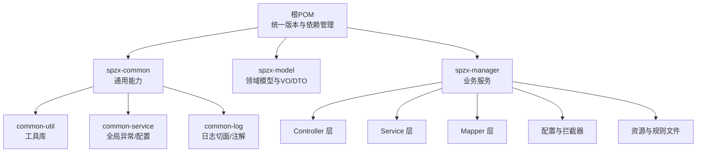
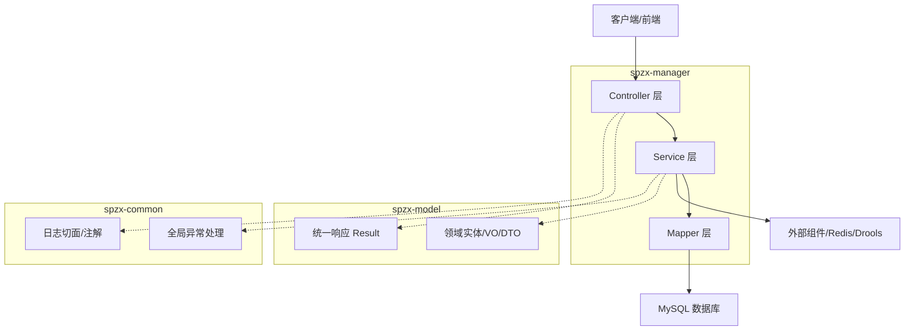
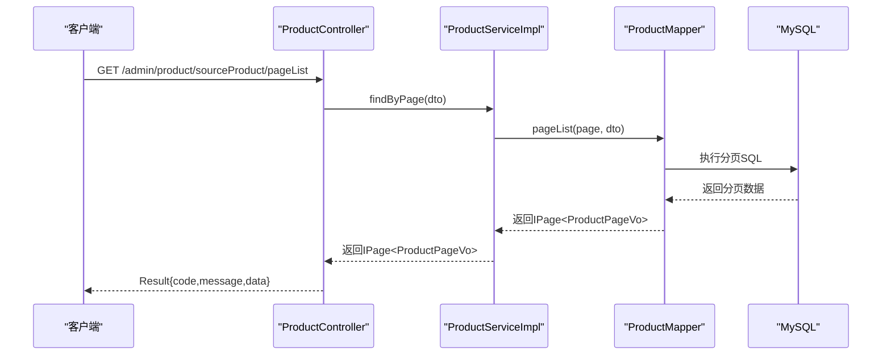
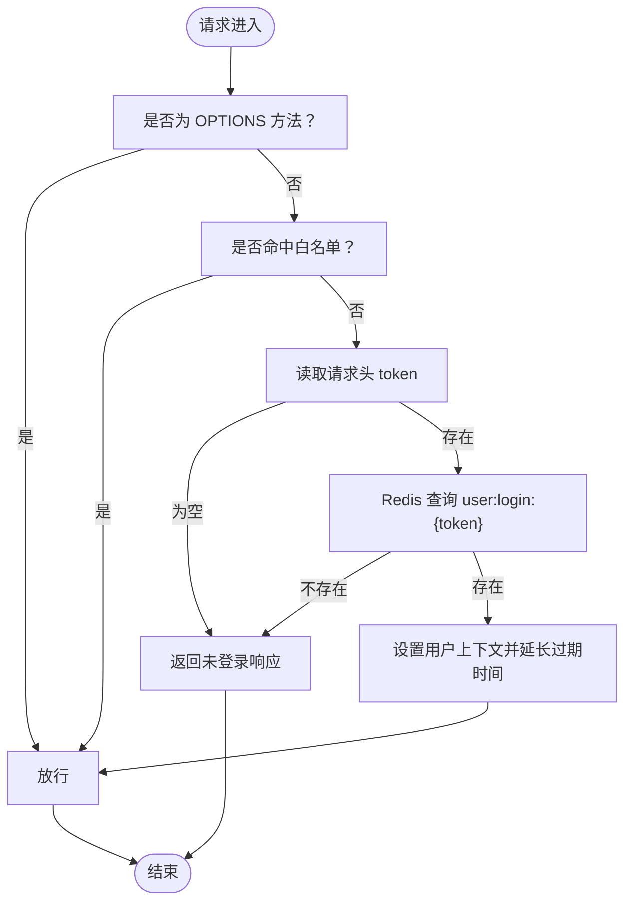
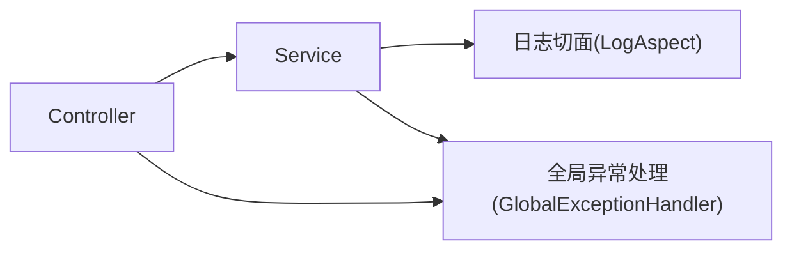
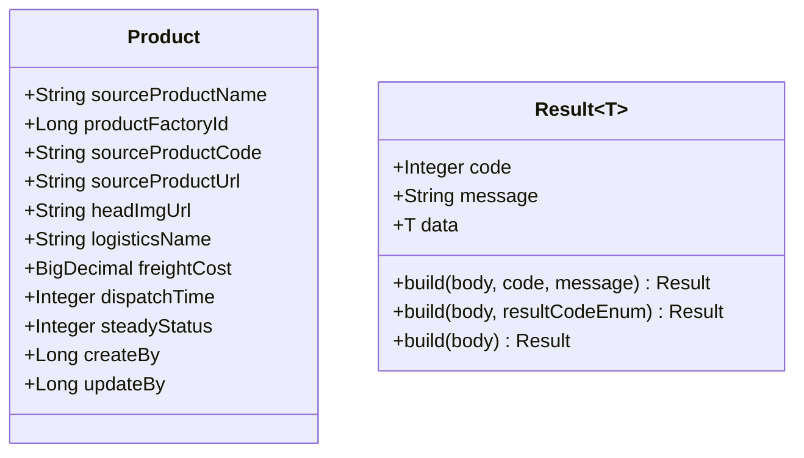
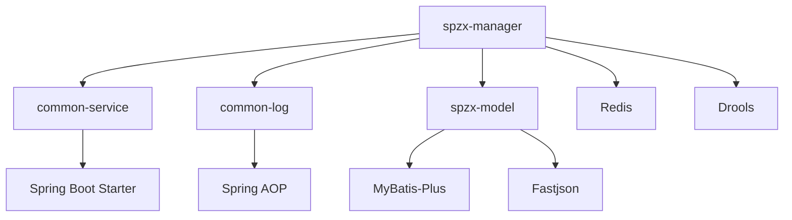

# 整体架构设计

<cite>
**本文引用的文件**
- [pom.xml](file://pom.xml)
- [spzx-manager/pom.xml](file://spzx-manager/pom.xml)
- [spzx-common/pom.xml](file://spzx-common/pom.xml)
- [spzx-model/pom.xml](file://spzx-model/pom.xml)
- [ManagerApplication.java](file://spzx-manager/src/main/java/com/joker/spzx/manager/ManagerApplication.java)
- [application.yml](file://spzx-manager/src/main/resources/application.yml)
- [WebMvcConfiguration.java](file://spzx-manager/src/main/java/com/joker/spzx/manager/config/WebMvcConfiguration.java)
- [LoginAuthInterceptor.java](file://spzx-manager/src/main/java/com/joker/spzx/manager/config/LoginAuthInterceptor.java)
- [GlobalExceptionHandler.java](file://spzx-common/common-service/src/main/java/com/joker/spzx/common/exception/GlobalExceptionHandler.java)
- [EnableLogAspect.java](file://spzx-common/common-log/src/main/java/com/joker/spzx/common/annotation/EnableLogAspect.java)
- [ProductController.java](file://spzx-manager/src/main/java/com/joker/spzx/manager/controller/ProductController.java)
- [ProductServiceImpl.java](file://spzx-manager/src/main/java/com/joker/spzx/manager/service/impl/ProductServiceImpl.java)
- [ProductMapper.java](file://spzx-manager/src/main/java/com/joker/spzx/manager/mapper/ProductMapper.java)
- [Product.java](file://spzx-model/src/main/java/com/joker/spzx/model/entity/product/Product.java)
- [Result.java](file://spzx-model/src/main/java/com/joker/spzx/model/vo/common/Result.java)
</cite>

## 目录
1. [引言](#引言)
2. [项目结构](#项目结构)
3. [核心组件](#核心组件)
4. [架构总览](#架构总览)
5. [详细组件分析](#详细组件分析)
6. [依赖分析](#依赖分析)
7. [性能考虑](#性能考虑)
8. [故障排查指南](#故障排查指南)
9. [结论](#结论)
10. [附录](#附录)

## 引言
本文件面向SPZX电商管理系统，系统采用Spring Boot构建，围绕“表现层-业务层-数据访问层”的分层架构与MVC模式组织代码；同时以模块化方式拆分为spzx-common（通用能力）、spzx-model（领域模型与VO/DTO）、spzx-manager（业务服务）三大核心模块，形成可复用、可维护、可扩展的工程化架构。本文将从技术栈选择、架构演进与设计权衡出发，系统阐述各层职责、调用关系、数据流转，并给出架构图与组件交互示意。

## 项目结构
SPZX为多模块Maven聚合工程，顶层统一管理版本与依赖，子模块按职责划分：
- spzx-common：通用能力模块，包含工具库、日志切面、全局异常处理等
- spzx-model：领域模型、VO/DTO、枚举与基础实体
- spzx-manager：业务服务模块，包含Controller、Service、Mapper及配置

图表来源
- [pom.xml:1-90](file://pom.xml#L1-L90)
- [spzx-common/pom.xml:1-44](file://spzx-common/pom.xml#L1-L44)
- [spzx-model/pom.xml:1-82](file://spzx-model/pom.xml#L1-L82)
- [spzx-manager/pom.xml:1-101](file://spzx-manager/pom.xml#L1-L101)

章节来源
- [pom.xml:1-90](file://pom.xml#L1-L90)
- [spzx-common/pom.xml:1-44](file://spzx-common/pom.xml#L1-L44)
- [spzx-model/pom.xml:1-82](file://spzx-model/pom.xml#L1-L82)
- [spzx-manager/pom.xml:1-101](file://spzx-manager/pom.xml#L1-L101)

## 核心组件
- 表现层（Controller）
  - 职责：接收HTTP请求，参数校验与封装，调用Service，组装Result统一响应
  - 示例：商品控制器负责分页查询、保存、更新、删除、详情查询等接口
- 业务层（Service）
  - 职责：编排业务流程、事务控制、调用Mapper、与外部组件协作
  - 示例：商品服务实现类完成分页查询、保存/更新/删除的原子性操作
- 数据访问层（Mapper）
  - 职责：MyBatis-Plus映射数据库表，提供条件构造器与分页查询
  - 示例：商品Mapper定义分页列表、详情查询等方法
- 领域模型与统一响应
  - Model：领域实体（如商品）与VO/DTO
  - VO/DTO：前后端交互的数据传输对象
  - 统一响应：Result封装业务状态码、消息与数据
- 通用能力
  - 日志切面与注解：统一记录操作日志
  - 全局异常处理：集中捕获异常并返回标准格式
  - 登录鉴权拦截器：基于Redis令牌校验与上下文注入

章节来源
- [ProductController.java:1-59](file://spzx-manager/src/main/java/com/joker/spzx/manager/controller/ProductController.java#L1-L59)
- [ProductServiceImpl.java:1-141](file://spzx-manager/src/main/java/com/joker/spzx/manager/service/impl/ProductServiceImpl.java#L1-L141)
- [ProductMapper.java:1-28](file://spzx-manager/src/main/java/com/joker/spzx/manager/mapper/ProductMapper.java#L1-L28)
- [Product.java:1-58](file://spzx-model/src/main/java/com/joker/spzx/model/entity/product/Product.java#L1-L58)
- [Result.java:1-45](file://spzx-model/src/main/java/com/joker/spzx/model/vo/common/Result.java#L1-L45)
- [EnableLogAspect.java:1-17](file://spzx-common/common-log/src/main/java/com/joker/spzx/common/annotation/EnableLogAspect.java#L1-L17)
- [GlobalExceptionHandler.java:1-20](file://spzx-common/common-service/src/main/java/com/joker/spzx/common/exception/GlobalExceptionHandler.java#L1-L20)

## 架构总览
SPZX采用“分层+模块化”双维度架构：
- 分层架构
  - 表现层：Controller接收请求，调用Service
  - 业务层：Service编排业务、事务控制、调用Mapper
  - 数据访问层：Mapper使用MyBatis-Plus进行数据库操作
- 模块化设计
  - spzx-manager：业务服务入口，暴露REST接口
  - spzx-model：共享领域模型与统一响应
  - spzx-common：横切能力（日志、异常、工具）

图表来源
- [ManagerApplication.java:1-20](file://spzx-manager/src/main/java/com/joker/spzx/manager/ManagerApplication.java#L1-L20)
- [WebMvcConfiguration.java:1-39](file://spzx-manager/src/main/java/com/joker/spzx/manager/config/WebMvcConfiguration.java#L1-L39)
- [LoginAuthInterceptor.java:1-81](file://spzx-manager/src/main/java/com/joker/spzx/manager/config/LoginAuthInterceptor.java#L1-L81)
- [GlobalExceptionHandler.java:1-20](file://spzx-common/common-service/src/main/java/com/joker/spzx/common/exception/GlobalExceptionHandler.java#L1-L20)
- [EnableLogAspect.java:1-17](file://spzx-common/common-log/src/main/java/com/joker/spzx/common/annotation/EnableLogAspect.java#L1-L17)
- [ProductController.java:1-59](file://spzx-manager/src/main/java/com/joker/spzx/manager/controller/ProductController.java#L1-L59)
- [ProductServiceImpl.java:1-141](file://spzx-manager/src/main/java/com/joker/spzx/manager/service/impl/ProductServiceImpl.java#L1-L141)
- [ProductMapper.java:1-28](file://spzx-manager/src/main/java/com/joker/spzx/manager/mapper/ProductMapper.java#L1-L28)
- [Result.java:1-45](file://spzx-model/src/main/java/com/joker/spzx/model/vo/common/Result.java#L1-L45)

## 详细组件分析

### MVC调用链与数据流
以“商品管理”为例，展示Controller-Service-Mapper的调用链与数据流转：

图表来源
- [ProductController.java:28-32](file://spzx-manager/src/main/java/com/joker/spzx/manager/controller/ProductController.java#L28-L32)
- [ProductServiceImpl.java:40-45](file://spzx-manager/src/main/java/com/joker/spzx/manager/service/impl/ProductServiceImpl.java#L40-L45)
- [ProductMapper.java:22](file://spzx-manager/src/main/java/com/joker/spzx/manager/mapper/ProductMapper.java#L22)
- [Result.java:27-42](file://spzx-model/src/main/java/com/joker/spzx/model/vo/common/Result.java#L27-L42)

章节来源
- [ProductController.java:1-59](file://spzx-manager/src/main/java/com/joker/spzx/manager/controller/ProductController.java#L1-L59)
- [ProductServiceImpl.java:1-141](file://spzx-manager/src/main/java/com/joker/spzx/manager/service/impl/ProductServiceImpl.java#L1-L141)
- [ProductMapper.java:1-28](file://spzx-manager/src/main/java/com/joker/spzx/manager/mapper/ProductMapper.java#L1-L28)
- [Result.java:1-45](file://spzx-model/src/main/java/com/joker/spzx/model/vo/common/Result.java#L1-L45)

### 登录鉴权与拦截器流程
登录鉴权拦截器在请求进入Controller前执行，校验白名单、Token与Redis会话，成功后将用户信息注入上下文，失败返回统一错误响应。

图表来源
- [LoginAuthInterceptor.java:30-58](file://spzx-manager/src/main/java/com/joker/spzx/manager/config/LoginAuthInterceptor.java#L30-L58)
- [WebMvcConfiguration.java:20-25](file://spzx-manager/src/main/java/com/joker/spzx/manager/config/WebMvcConfiguration.java#L20-L25)
- [Result.java:27-42](file://spzx-model/src/main/java/com/joker/spzx/model/vo/common/Result.java#L27-L42)

章节来源
- [LoginAuthInterceptor.java:1-81](file://spzx-manager/src/main/java/com/joker/spzx/manager/config/LoginAuthInterceptor.java#L1-L81)
- [WebMvcConfiguration.java:1-39](file://spzx-manager/src/main/java/com/joker/spzx/manager/config/WebMvcConfiguration.java#L1-L39)
- [Result.java:1-45](file://spzx-model/src/main/java/com/joker/spzx/model/vo/common/Result.java#L1-L45)

### 统一日志切面与异常处理
- 日志切面：通过@EnableLogAspect启用，对标注的方法进行环绕增强，统一记录操作日志
- 全局异常：@RestControllerAdvice集中捕获异常，区分自定义异常与通用异常，返回Result标准格式

图表来源
- [EnableLogAspect.java:12-16](file://spzx-common/common-log/src/main/java/com/joker/spzx/common/annotation/EnableLogAspect.java#L12-L16)
- [GlobalExceptionHandler.java:7-19](file://spzx-common/common-service/src/main/java/com/joker/spzx/common/exception/GlobalExceptionHandler.java#L7-L19)

章节来源
- [EnableLogAspect.java:1-17](file://spzx-common/common-log/src/main/java/com/joker/spzx/common/annotation/EnableLogAspect.java#L1-L17)
- [GlobalExceptionHandler.java:1-20](file://spzx-common/common-service/src/main/java/com/joker/spzx/common/exception/GlobalExceptionHandler.java#L1-L20)

### 领域模型与统一响应
- 领域模型：如商品实体包含字段映射与业务含义
- 统一响应：Result提供静态工厂方法，便于Controller直接返回标准结构

图表来源
- [Product.java:10-58](file://spzx-model/src/main/java/com/joker/spzx/model/entity/product/Product.java#L10-L58)
- [Result.java:8-44](file://spzx-model/src/main/java/com/joker/spzx/model/vo/common/Result.java#L8-L44)

章节来源
- [Product.java:1-58](file://spzx-model/src/main/java/com/joker/spzx/model/entity/product/Product.java#L1-L58)
- [Result.java:1-45](file://spzx-model/src/main/java/com/joker/spzx/model/vo/common/Result.java#L1-L45)

## 依赖分析
- 模块间依赖
  - spzx-manager依赖spzx-common（日志、异常、配置）与spzx-model（实体与VO/DTO）
  - spzx-model依赖MyBatis-Plus与JSON序列化等基础设施
  - spzx-common内部模块解耦，通过API边界提供能力
- 技术栈与版本管理
  - Spring Boot 3.4.0 + Java 21
  - MyBatis-Plus 3.5.9 + MySQL Connector 8.0.33
  - Fastjson 2.0.21 + Lombok 1.18.34
  - Drools 8.44.2.Final（规则引擎）
- 关键特性
  - MyBatis-Plus简化CRUD与分页
  - Knife4j用于OpenAPI文档
  - Redis用于会话存储与令牌校验
  - 拦截器+统一异常处理提升可维护性

图表来源
- [spzx-manager/pom.xml:40-83](file://spzx-manager/pom.xml#L40-L83)
- [spzx-common/pom.xml:26-43](file://spzx-common/pom.xml#L26-L43)
- [spzx-model/pom.xml:19-81](file://spzx-model/pom.xml#L19-L81)
- [pom.xml:37-75](file://pom.xml#L37-L75)

章节来源
- [spzx-manager/pom.xml:1-101](file://spzx-manager/pom.xml#L1-L101)
- [spzx-common/pom.xml:1-44](file://spzx-common/pom.xml#L1-L44)
- [spzx-model/pom.xml:1-82](file://spzx-model/pom.xml#L1-L82)
- [pom.xml:1-90](file://pom.xml#L1-L90)

## 性能考虑
- 分页查询：使用MyBatis-Plus分页，避免一次性加载大结果集
- 缓存策略：Redis存储登录态，减少数据库压力；注意过期时间与热点Key
- 事务边界：Service层明确事务范围，避免长事务占用连接
- 序列化：统一使用Fastjson，注意循环引用与字段过滤
- 规则引擎：Drools规则复杂度需评估，建议离线测试与灰度发布

## 故障排查指南
- 登录鉴权失败
  - 检查请求头token是否存在与Redis中键值是否匹配
  - 核对白名单配置与跨域设置
- 统一异常返回
  - 全局异常处理器会捕获所有异常，优先检查自定义ServiceException
- 控制器返回格式
  - 确保Controller始终返回Result封装，避免直接抛出对象

章节来源
- [LoginAuthInterceptor.java:30-74](file://spzx-manager/src/main/java/com/joker/spzx/manager/config/LoginAuthInterceptor.java#L30-L74)
- [GlobalExceptionHandler.java:9-19](file://spzx-common/common-service/src/main/java/com/joker/spzx/common/exception/GlobalExceptionHandler.java#L9-L19)
- [Result.java:27-42](file://spzx-model/src/main/java/com/joker/spzx/model/vo/common/Result.java#L27-L42)

## 结论
SPZX电商管理系统以Spring Boot为核心，采用分层与模块化设计，结合MyBatis-Plus、Redis、Drools等技术栈，实现了高内聚、低耦合的工程化架构。通过统一响应、日志切面与全局异常处理，提升了系统的可观测性与可维护性。未来可在微服务化演进中进一步拆分业务域模块，引入网关与注册中心，持续优化性能与扩展性。

## 附录
- 启动入口与环境
  - 应用启动类位于spzx-manager模块，激活dev环境
- 配置要点
  - WebMvc拦截器与跨域配置、登录鉴权拦截器、Knife4j文档配置

章节来源
- [ManagerApplication.java:10-15](file://spzx-manager/src/main/java/com/joker/spzx/manager/ManagerApplication.java#L10-L15)
- [application.yml:1-5](file://spzx-manager/src/main/resources/application.yml#L1-L5)
- [WebMvcConfiguration.java:14-38](file://spzx-manager/src/main/java/com/joker/spzx/manager/config/WebMvcConfiguration.java#L14-L38)