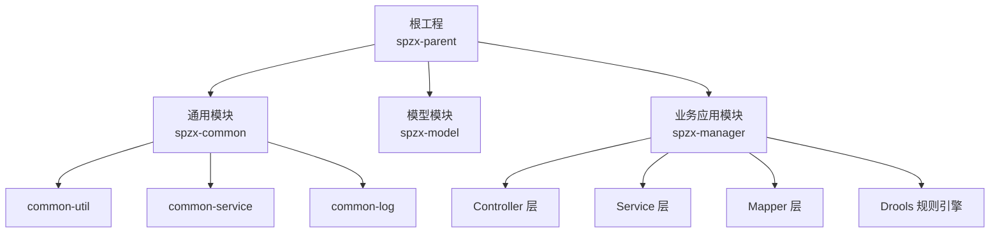
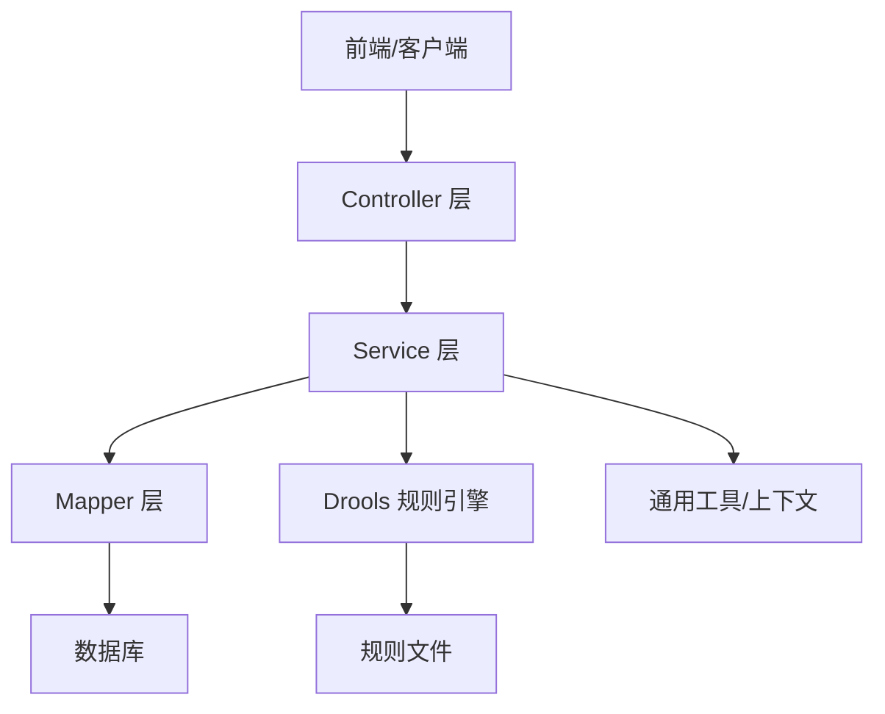
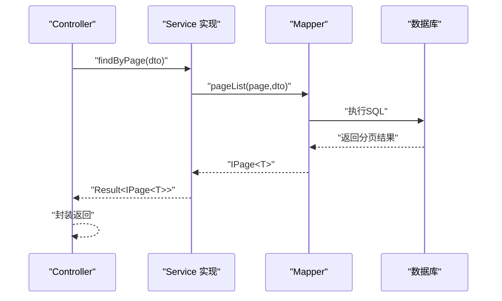
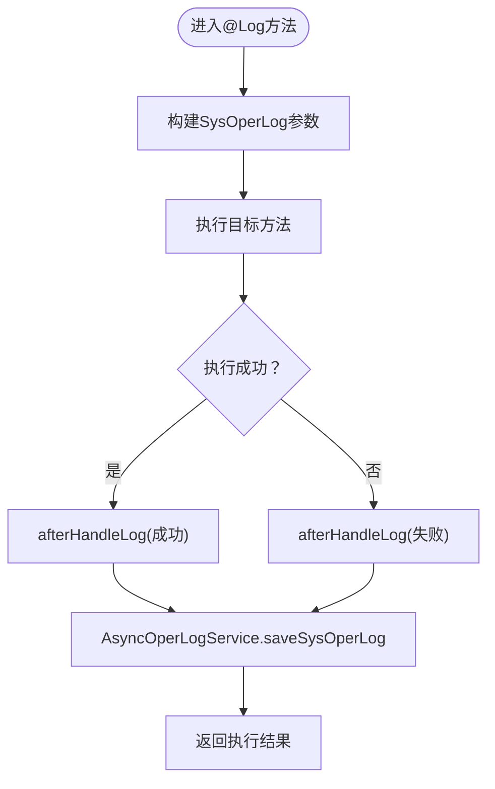
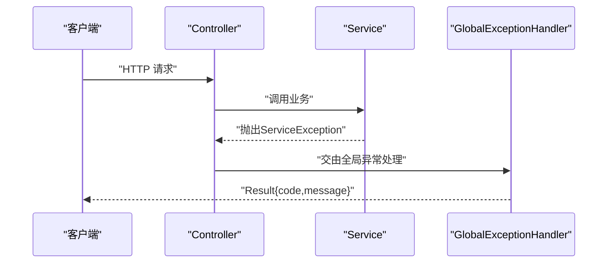
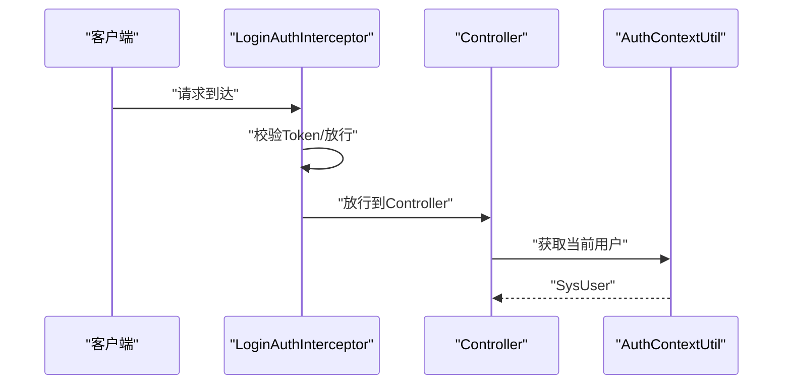
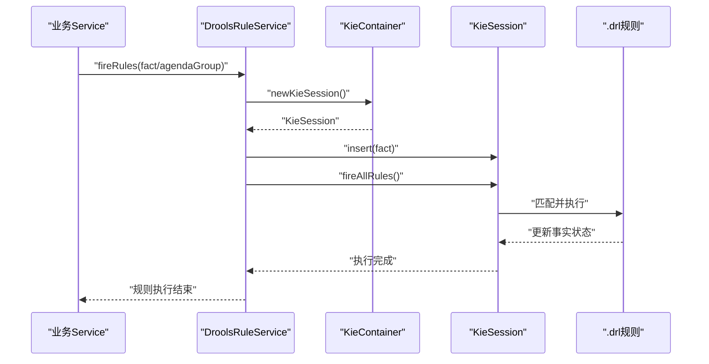
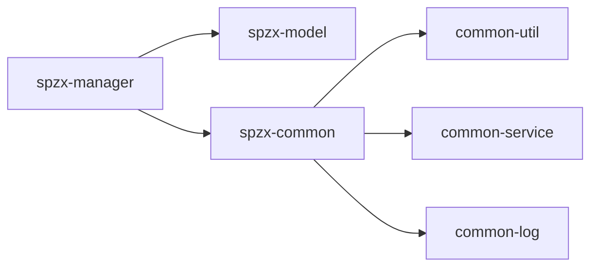

# 架构设计

<cite>
**本文引用的文件**
- [pom.xml](file://pom.xml)
- [spzx-manager/pom.xml](file://spzx-manager/pom.xml)
- [spzx-common/pom.xml](file://spzx-common/pom.xml)
- [spzx-model/pom.xml](file://spzx-model/pom.xml)
- [ManagerApplication.java](file://spzx-manager/src/main/java/com/joker/spzx/manager/ManagerApplication.java)
- [application.yml](file://spzx-manager/src/main/resources/application.yml)
- [WebMvcConfiguration.java](file://spzx-manager/src/main/java/com/joker/spzx/manager/config/WebMvcConfiguration.java)
- [LoginAuthInterceptor.java](file://spzx-manager/src/main/java/com/joker/spzx/manager/config/LoginAuthInterceptor.java)
- [GlobalExceptionHandler.java](file://spzx-common/common-service/src/main/java/com/joker/spzx/common/exception/GlobalExceptionHandler.java)
- [LogAspect.java](file://spzx-common/common-log/src/main/java/com/joker/spzx/common/aspect/LogAspect.java)
- [EnableLogAspect.java](file://spzx-common/common-log/src/main/java/com/joker/spzx/common/annotation/EnableLogAspect.java)
- [AsyncOperLogService.java](file://spzx-common/common-log/src/main/java/com/joker/spzx/common/service/AsyncOperLogService.java)
- [LogUtil.java](file://spzx-common/common-log/src/main/java/com/joker/spzx/common/util/LogUtil.java)
- [AuthContextUtil.java](file://spzx-common/common-util/src/main/java/com/joker/spzx/utils/AuthContextUtil.java)
- [BaseEntity.java](file://spzx-model/src/main/java/com/joker/spzx/model/entity/base/BaseEntity.java)
- [ProductController.java](file://spzx-manager/src/main/java/com/joker/spzx/manager/controller/ProductController.java)
- [ProductService.java](file://spzx-manager/src/main/java/com/joker/spzx/manager/service/ProductService.java)
- [ProductServiceImpl.java](file://spzx-manager/src/main/java/com/joker/spzx/manager/service/impl/ProductServiceImpl.java)
- [ProductMapper.java](file://spzx-manager/src/main/java/com/joker/spzx/manager/mapper/ProductMapper.java)
- [DroolsRuleService.java](file://spzx-manager/src/main/java/com/joker/spzx/manager/drools/DroolsRuleService.java)
- [DroolsConfig.java](file://spzx-manager/src/main/java/com/joker/spzx/manager/config/DroolsConfig.java)
- [DroolsProperties.java](file://spzx-manager/src/main/java/com/joker/spzx/manager/config/DroolsProperties.java)
- [KieContainerFactory.java](file://spzx-manager/src/main/java/com/joker/spzx/manager/drools/KieContainerFactory.java)
- [OrderDiscountFact.java](file://spzx-manager/src/main/java/com/joker/spzx/manager/drools/model/OrderDiscountFact.java)
- [order-discount.drl](file://spzx-manager/src/main/resources/rules/order-discount.drl)
</cite>

## 目录
1. [引言](#引言)
2. [项目结构](#项目结构)
3. [核心组件](#核心组件)
4. [架构总览](#架构总览)
5. [详细组件分析](#详细组件分析)
6. [依赖分析](#依赖分析)
7. [性能考虑](#性能考虑)
8. [故障排查指南](#故障排查指南)
9. [结论](#结论)
10. [附录](#附录)

## 引言
本文件面向SPZX电商管理系统，系统采用多模块分层架构，围绕“spzx-common（通用层）、spzx-model（模型层）、spzx-manager（业务应用层）”进行模块化设计。系统以Spring Boot为基础，结合MyBatis-Plus、Drools规则引擎、Knife4j等技术栈，实现清晰的职责分离与高内聚低耦合的组件交互。

## 项目结构
项目采用Maven聚合工程组织，顶层pom统一管理版本与依赖；子模块按功能域拆分：
- spzx-common：通用能力封装（工具、日志切面、全局异常处理）
- spzx-model：领域模型与数据传输对象（DTO/VO/Entity）
- spzx-manager：业务应用模块，包含Controller-Service-Mapper三层以及规则引擎集成

图表来源
- [pom.xml:11-15](file://pom.xml#L11-L15)
- [spzx-common/pom.xml:14-18](file://spzx-common/pom.xml#L14-L18)
- [spzx-manager/pom.xml:19-84](file://spzx-manager/pom.xml#L19-L84)

章节来源
- [pom.xml:1-90](file://pom.xml#L1-L90)
- [spzx-common/pom.xml:1-44](file://spzx-common/pom.xml#L1-L44)
- [spzx-model/pom.xml:1-82](file://spzx-model/pom.xml#L1-L82)
- [spzx-manager/pom.xml:1-101](file://spzx-manager/pom.xml#L1-L101)

## 核心组件
- 应用入口与启动
  - 应用入口类启用日志切面注解，加载全局配置与拦截器，激活调度任务。
- MVC三层架构
  - Controller：接收HTTP请求，装配DTO/VO，调用Service，返回Result封装结果。
  - Service：业务编排与事务控制，协调Mapper与外部能力。
  - Mapper：基于MyBatis-Plus接口，提供数据访问能力。
- 通用能力
  - 日志切面：环绕通知记录操作日志，异步落库。
  - 全局异常：统一捕获异常，返回标准结果结构。
  - 认证上下文：线程本地存储当前用户，贯穿业务流程。
- 规则引擎
  - 基于Drools，提供事实对象规则执行能力，支持单事实与批量事实。

章节来源
- [ManagerApplication.java:1-20](file://spzx-manager/src/main/java/com/joker/spzx/manager/ManagerApplication.java#L1-L20)
- [WebMvcConfiguration.java:1-39](file://spzx-manager/src/main/java/com/joker/spzx/manager/config/WebMvcConfiguration.java#L1-L39)
- [LogAspect.java:1-47](file://spzx-common/common-log/src/main/java/com/joker/spzx/common/aspect/LogAspect.java#L1-L47)
- [GlobalExceptionHandler.java:1-20](file://spzx-common/common-service/src/main/java/com/joker/spzx/common/exception/GlobalExceptionHandler.java#L1-L20)
- [AuthContextUtil.java:1-21](file://spzx-common/common-util/src/main/java/com/joker/spzx/utils/AuthContextUtil.java#L1-L21)
- [DroolsRuleService.java:1-54](file://spzx-manager/src/main/java/com/joker/spzx/manager/drools/DroolsRuleService.java#L1-L54)

## 架构总览
系统采用分层+模块化架构，职责边界清晰：
- spzx-model：纯数据模型与传输对象，不依赖其他模块，仅被spzx-manager使用。
- spzx-common：提供横切能力（日志、异常、工具），被spzx-manager直接依赖。
- spzx-manager：业务实现与对外接口，依赖spzx-model与spzx-common，并集成规则引擎。

图表来源
- [ProductController.java:22-58](file://spzx-manager/src/main/java/com/joker/spzx/manager/controller/ProductController.java#L22-L58)
- [ProductServiceImpl.java:31-141](file://spzx-manager/src/main/java/com/joker/spzx/manager/service/impl/ProductServiceImpl.java#L31-L141)
- [ProductMapper.java:19-27](file://spzx-manager/src/main/java/com/joker/spzx/manager/mapper/ProductMapper.java#L19-L27)
- [DroolsRuleService.java:14-54](file://spzx-manager/src/main/java/com/joker/spzx/manager/drools/DroolsRuleService.java#L14-L54)

## 详细组件分析

### MVC三层架构实现
- 控制器层
  - 统一返回Result包装，使用注解驱动REST接口，参数校验与分页查询由DTO承载。
- 服务层
  - 使用IService扩展，集中事务控制与复杂业务编排，协调多Mapper与规则引擎。
- 数据访问层
  - 基于MyBatis-Plus的BaseMapper，提供分页查询与条件构造器，减少XML配置。

图表来源
- [ProductController.java:28-32](file://spzx-manager/src/main/java/com/joker/spzx/manager/controller/ProductController.java#L28-L32)
- [ProductService.java:19](file://spzx-manager/src/main/java/com/joker/spzx/manager/service/ProductService.java#L19)
- [ProductServiceImpl.java:40-45](file://spzx-manager/src/main/java/com/joker/spzx/manager/service/impl/ProductServiceImpl.java#L40-L45)
- [ProductMapper.java:22](file://spzx-manager/src/main/java/com/joker/spzx/manager/mapper/ProductMapper.java#L22)

章节来源
- [ProductController.java:1-59](file://spzx-manager/src/main/java/com/joker/spzx/manager/controller/ProductController.java#L1-L59)
- [ProductService.java:1-33](file://spzx-manager/src/main/java/com/joker/spzx/manager/service/ProductService.java#L1-L33)
- [ProductServiceImpl.java:1-141](file://spzx-manager/src/main/java/com/joker/spzx/manager/service/impl/ProductServiceImpl.java#L1-L141)
- [ProductMapper.java:1-28](file://spzx-manager/src/main/java/com/joker/spzx/manager/mapper/ProductMapper.java#L1-L28)

### 日志切面与AOP
- 切面逻辑
  - 基于@Around环绕通知，统一构建操作日志实体，捕获异常并标记状态，最终异步持久化。
- 注解驱动
  - 通过@EnableLogAspect启用，对标注@Log的方法织入横切逻辑。
- 异步落库
  - 使用AsyncOperLogService异步写入系统操作日志表，避免阻塞主业务链路。

图表来源
- [LogAspect.java:21-46](file://spzx-common/common-log/src/main/java/com/joker/spzx/common/aspect/LogAspect.java#L21-L46)
- [EnableLogAspect.java](file://spzx-common/common-log/src/main/java/com/joker/spzx/common/annotation/EnableLogAspect.java)
- [AsyncOperLogService.java](file://spzx-common/common-log/src/main/java/com/joker/spzx/common/service/AsyncOperLogService.java)
- [LogUtil.java](file://spzx-common/common-log/src/main/java/com/joker/spzx/common/util/LogUtil.java)

章节来源
- [LogAspect.java:1-47](file://spzx-common/common-log/src/main/java/com/joker/spzx/common/aspect/LogAspect.java#L1-L47)
- [EnableLogAspect.java](file://spzx-common/common-log/src/main/java/com/joker/spzx/common/annotation/EnableLogAspect.java)
- [AsyncOperLogService.java](file://spzx-common/common-log/src/main/java/com/joker/spzx/common/service/AsyncOperLogService.java)
- [LogUtil.java](file://spzx-common/common-log/src/main/java/com/joker/spzx/common/util/LogUtil.java)

### 全局异常处理
- 统一异常映射
  - 捕获通用异常与自定义ServiceException，返回标准化Result结构，便于前端统一处理。
- 结果封装
  - Result作为统一响应载体，配合枚举状态码，保证接口一致性。

图表来源
- [GlobalExceptionHandler.java:9-19](file://spzx-common/common-service/src/main/java/com/joker/spzx/common/exception/GlobalExceptionHandler.java#L9-L19)

章节来源
- [GlobalExceptionHandler.java:1-20](file://spzx-common/common-service/src/main/java/com/joker/spzx/common/exception/GlobalExceptionHandler.java#L1-L20)

### 认证上下文与拦截器
- 上下文工具
  - 通过ThreadLocal维护当前登录用户，贯穿Controller-Service-Mapper层。
- 登录拦截
  - WebMvcConfiguration注册LoginAuthInterceptor，白名单放行，其余路径统一鉴权。

图表来源
- [WebMvcConfiguration.java:19-25](file://spzx-manager/src/main/java/com/joker/spzx/manager/config/WebMvcConfiguration.java#L19-L25)
- [LoginAuthInterceptor.java](file://spzx-manager/src/main/java/com/joker/spzx/manager/config/LoginAuthInterceptor.java)
- [AuthContextUtil.java:5-20](file://spzx-common/common-util/src/main/java/com/joker/spzx/utils/AuthContextUtil.java#L5-L20)

章节来源
- [WebMvcConfiguration.java:1-39](file://spzx-manager/src/main/java/com/joker/spzx/manager/config/WebMvcConfiguration.java#L1-L39)
- [AuthContextUtil.java:1-21](file://spzx-common/common-util/src/main/java/com/joker/spzx/utils/AuthContextUtil.java#L1-L21)

### 规则引擎集成（Drools）
- 容器与会话
  - KieContainerFactory创建容器，DroolsRuleService负责创建KieSession并插入事实对象执行规则。
- 调用方式
  - 支持单事实、批量事实与按agenda-group聚焦执行，确保规则执行可控与高效。
- 规则文件
  - 通过resources/rules目录下的.drl文件定义业务规则，如订单折扣计算。

图表来源
- [DroolsRuleService.java:21-39](file://spzx-manager/src/main/java/com/joker/spzx/manager/drools/DroolsRuleService.java#L21-L39)
- [DroolsConfig.java](file://spzx-manager/src/main/java/com/joker/spzx/manager/config/DroolsConfig.java)
- [DroolsProperties.java](file://spzx-manager/src/main/java/com/joker/spzx/manager/config/DroolsProperties.java)
- [KieContainerFactory.java](file://spzx-manager/src/main/java/com/joker/spzx/manager/drools/KieContainerFactory.java)
- [OrderDiscountFact.java](file://spzx-manager/src/main/java/com/joker/spzx/manager/drools/model/OrderDiscountFact.java)
- [order-discount.drl](file://spzx-manager/src/main/resources/rules/order-discount.drl)

章节来源
- [DroolsRuleService.java:1-54](file://spzx-manager/src/main/java/com/joker/spzx/manager/drools/DroolsRuleService.java#L1-L54)

### 设计模式应用
- 工厂模式
  - KieContainerFactory负责容器创建与管理，隐藏规则引擎初始化细节，供业务按需获取会话。
- 策略模式
  - 可在规则引擎中通过agenda-group或不同规则集实现策略切换，按业务场景选择性执行。
- AOP切面编程
  - LogAspect对@Log方法进行统一横切，实现日志采集、异常处理与异步落库，降低重复代码。

章节来源
- [KieContainerFactory.java](file://spzx-manager/src/main/java/com/joker/spzx/manager/drools/KieContainerFactory.java)
- [LogAspect.java:1-47](file://spzx-common/common-log/src/main/java/com/joker/spzx/common/aspect/LogAspect.java#L1-L47)

## 依赖分析
模块间依赖关系如下：
- spzx-manager依赖spzx-model（实体/DTO/VO）、spzx-common（日志、异常、工具）
- spzx-common内部模块相互独立，对外暴露能力
- spzx-model不反向依赖其他模块，保持纯净的数据模型

图表来源
- [spzx-manager/pom.xml:40-63](file://spzx-manager/pom.xml#L40-L63)
- [spzx-common/pom.xml:14-18](file://spzx-common/pom.xml#L14-L18)
- [spzx-model/pom.xml:19-82](file://spzx-model/pom.xml#L19-L82)

章节来源
- [spzx-manager/pom.xml:1-101](file://spzx-manager/pom.xml#L1-L101)
- [spzx-common/pom.xml:1-44](file://spzx-common/pom.xml#L1-L44)
- [spzx-model/pom.xml:1-82](file://spzx-model/pom.xml#L1-L82)

## 性能考虑
- 分页查询与条件构造器
  - 使用MyBatis-Plus分页与Lambda条件构造器，减少SQL拼接与全表扫描风险。
- 异步日志
  - 操作日志异步写入，避免阻塞主业务链路。
- 规则引擎会话复用
  - 合理管理KieSession生命周期，批量执行时尽量复用会话，减少创建销毁开销。
- 缓存与限流
  - 建议在spzx-manager中引入Redis缓存热点数据，结合网关或拦截器做限流保护。

## 故障排查指南
- 控制器层
  - 检查请求参数与DTO绑定是否正确，确认Result封装是否包含错误信息。
- 服务层
  - 关注事务边界与异常传播，确保异常被捕获并转为标准Result。
- 数据访问层
  - 核对Mapper方法签名与XML映射，确认分页参数与条件构造器使用正确。
- 日志与异常
  - 查看全局异常处理器输出，定位异常类型与状态码；检查日志切面是否正常织入。
- 规则引擎
  - 确认规则文件加载路径与容器初始化，验证事实对象是否正确插入与匹配。

章节来源
- [GlobalExceptionHandler.java:1-20](file://spzx-common/common-service/src/main/java/com/joker/spzx/common/exception/GlobalExceptionHandler.java#L1-L20)
- [LogAspect.java:1-47](file://spzx-common/common-log/src/main/java/com/joker/spzx/common/aspect/LogAspect.java#L1-L47)
- [DroolsRuleService.java:1-54](file://spzx-manager/src/main/java/com/joker/spzx/manager/drools/DroolsRuleService.java#L1-L54)

## 结论
SPZX电商管理系统通过多模块分层架构实现了清晰的职责划分与良好的扩展性。MVC三层架构在spzx-manager中得到完整体现，配合spzx-model的纯数据模型与spzx-common的横切能力，形成稳定高效的业务开发基座。Drools规则引擎的引入进一步提升了业务规则的可维护性与可演进性。建议后续在缓存、限流与监控方面持续完善，以支撑更高并发与更复杂的业务场景。

## 附录
- 配置文件
  - 应用名称与环境激活：application.yml
  - 启动类启用日志切面：ManagerApplication.java
- 关键实体
  - 基础实体字段：BaseEntity
- 示例控制器/服务/Mapper
  - 商品管理：ProductController/ProductService/ProductMapper

章节来源
- [application.yml:1-5](file://spzx-manager/src/main/resources/application.yml#L1-L5)
- [ManagerApplication.java:1-20](file://spzx-manager/src/main/java/com/joker/spzx/manager/ManagerApplication.java#L1-L20)
- [BaseEntity.java:1-34](file://spzx-model/src/main/java/com/joker/spzx/model/entity/base/BaseEntity.java#L1-L34)
- [ProductController.java:1-59](file://spzx-manager/src/main/java/com/joker/spzx/manager/controller/ProductController.java#L1-L59)
- [ProductService.java:1-33](file://spzx-manager/src/main/java/com/joker/spzx/manager/service/ProductService.java#L1-L33)
- [ProductMapper.java:1-28](file://spzx-manager/src/main/java/com/joker/spzx/manager/mapper/ProductMapper.java#L1-L28)