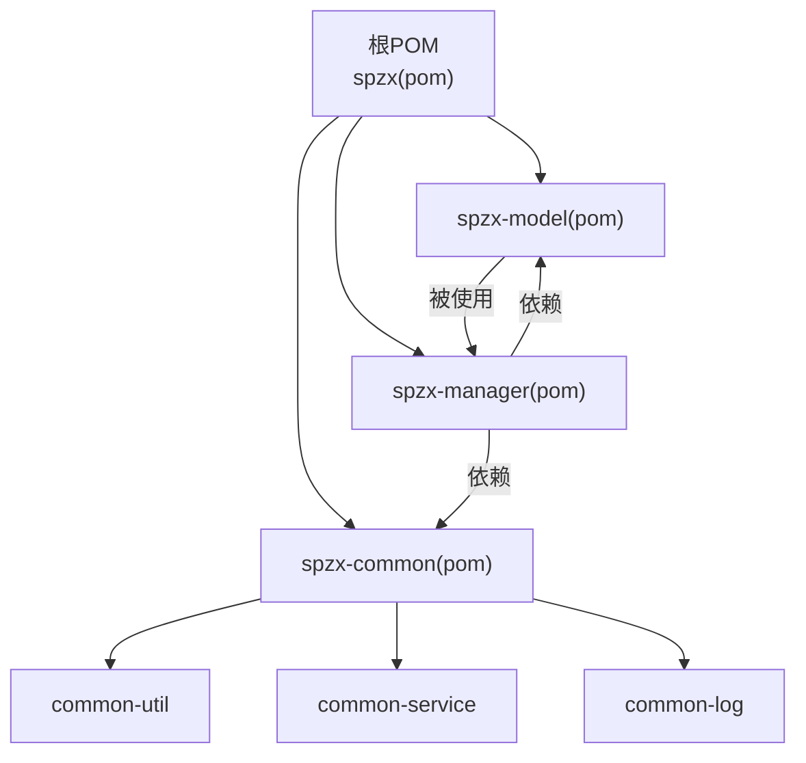
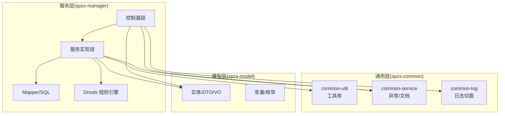
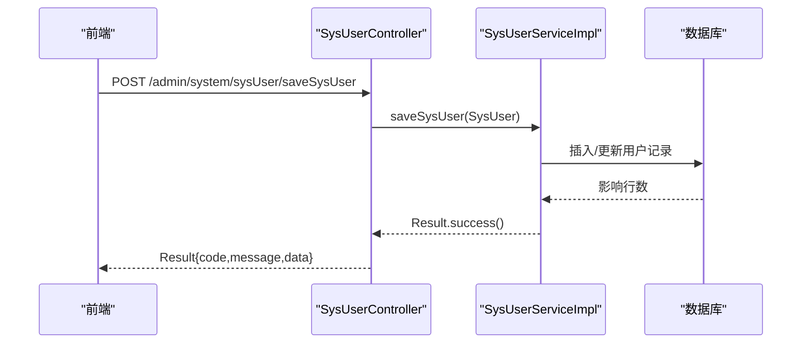
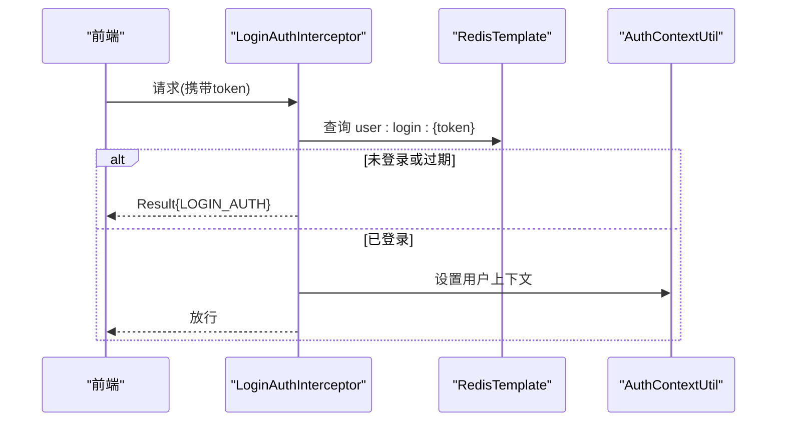
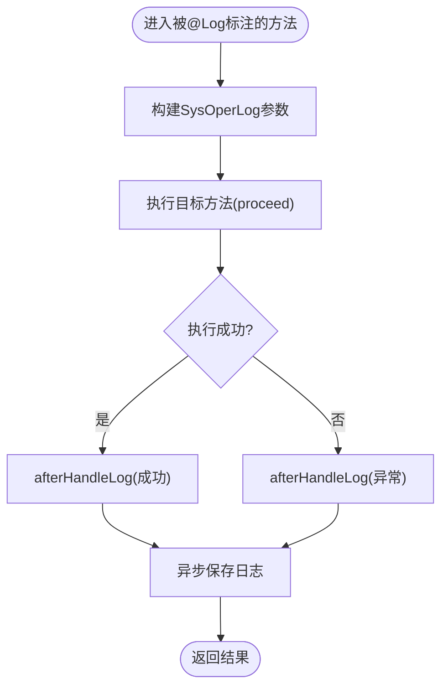
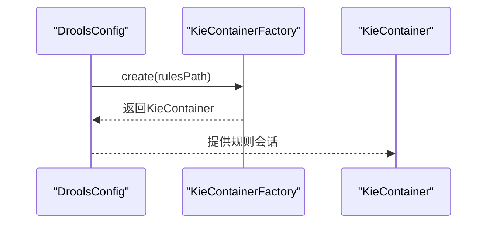
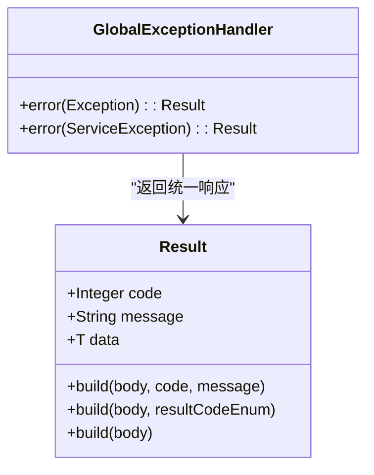
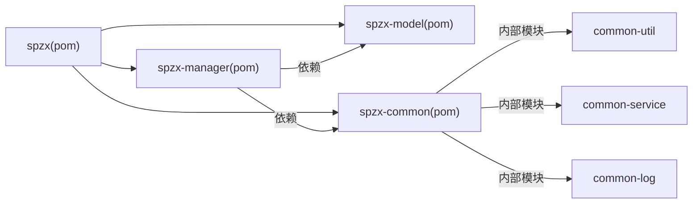

# 模块化设计

<cite>
**本文引用的文件**
- [根POM](file://pom.xml)
- [spzx-common 模块POM](file://spzx-common/pom.xml)
- [spzx-model 模块POM](file://spzx-model/pom.xml)
- [spzx-manager 模块POM](file://spzx-manager/pom.xml)
- [spzx-manager 应用配置](file://spzx-manager/src/main/resources/application.yml)
- [Web MVC 配置](file://spzx-manager/src/main/java/com/joker/spzx/manager/config/WebMvcConfiguration.java)
- [登录鉴权拦截器](file://spzx-manager/src/main/java/com/joker/spzx/manager/config/LoginAuthInterceptor.java)
- [全局异常处理器](file://spzx-common/common-service/src/main/java/com/joker/spzx/common/exception/GlobalExceptionHandler.java)
- [Knife4j 文档配置](file://spzx-common/common-service/src/main/java/com/joker/spzx/common/config/Knife4jConfig.java)
- [日志切面](file://spzx-common/common-log/src/main/java/com/joker/spzx/common/aspect/LogAspect.java)
- [认证上下文工具](file://spzx-common/common-util/src/main/java/com/joker/spzx/utils/AuthContextUtil.java)
- [用户控制器示例](file://spzx-manager/src/main/java/com/joker/spzx/manager/controller/SysUserController.java)
- [用户服务实现示例](file://spzx-manager/src/main/java/com/joker/spzx/manager/service/impl/SysUserServiceImpl.java)
- [用户实体模型](file://spzx-model/src/main/java/com/joker/spzx/model/entity/system/SysUser.java)
- [统一响应封装](file://spzx-model/src/main/java/com/joker/spzx/model/vo/common/Result.java)
- [Drools 规则引擎配置](file://spzx-manager/src/main/java/com/joker/spzx/manager/config/DroolsConfig.java)
</cite>

## 目录
1. [引言](#引言)
2. [项目结构](#项目结构)
3. [核心组件](#核心组件)
4. [架构总览](#架构总览)
5. [详细组件分析](#详细组件分析)
6. [依赖分析](#依赖分析)
7. [性能考虑](#性能考虑)
8. [故障排查指南](#故障排查指南)
9. [结论](#结论)
10. [附录](#附录)

## 引言
本文件面向 SPZX 项目的模块化设计，系统性阐述 Maven 多模块组织结构、各模块职责与边界、模块间依赖关系与版本管理策略，并结合实际源码解析模块间通信机制、接口定义规范与数据传递约定。通过模块化设计，SPZX 实现了代码复用、职责分离、独立部署与可维护性、可扩展性的显著提升。

## 项目结构
SPZX 采用 Maven 聚合工程组织，顶层 POM 定义版本属性与依赖管理，子模块按“通用能力”“领域模型”“业务服务”的层次划分：
- spzx-common：通用能力层，包含工具库、日志切面与通用服务（异常处理、文档配置等）
- spzx-model：领域模型层，定义 DTO/VO/Entity 及通用常量、枚举
- spzx-manager：业务服务层，提供管理端控制器、服务实现、持久层与规则引擎集成

图表来源
- [根POM:11-15](file://pom.xml#L11-L15)
- [spzx-common 模块POM:14-18](file://spzx-common/pom.xml#L14-L18)
- [spzx-manager 模块POM:40-63](file://spzx-manager/pom.xml#L40-L63)

章节来源
- [根POM:11-15](file://pom.xml#L11-L15)
- [spzx-common 模块POM:14-18](file://spzx-common/pom.xml#L14-L18)
- [spzx-model 模块POM:1-18](file://spzx-model/pom.xml#L1-L18)
- [spzx-manager 模块POM:19-84](file://spzx-manager/pom.xml#L19-L84)

## 核心组件
- spzx-common：提供跨模块复用的工具、日志与通用服务，降低重复开发成本
- spzx-model：沉淀统一的数据传输与业务实体，确保接口契约一致
- spzx-manager：承载具体业务逻辑与对外接口，依赖通用层与模型层

模块化带来的收益：
- 代码复用：通用工具与异常处理在多个模块共享
- 职责分离：模型层专注数据结构，服务层专注业务流程
- 独立部署：各模块可独立构建与打包，便于微服务化演进
- 可维护性：清晰的边界与依赖方向，降低变更影响面
- 可扩展性：新增功能优先在模型层定义契约，再在服务层实现

章节来源
- [spzx-common 模块POM:26-43](file://spzx-common/pom.xml#L26-L43)
- [spzx-model 模块POM:19-81](file://spzx-model/pom.xml#L19-L81)
- [spzx-manager 模块POM:19-84](file://spzx-manager/pom.xml#L19-L84)

## 架构总览
SPZX 的模块化架构以“模型驱动、服务承载、通用支撑”为核心，形成从接口到实现的完整链路。

图表来源
- [spzx-manager 模块POM:40-83](file://spzx-manager/pom.xml#L40-L83)
- [spzx-model 模块POM:19-81](file://spzx-model/pom.xml#L19-L81)
- [spzx-common 模块POM:14-18](file://spzx-common/pom.xml#L14-L18)
- [Drools 规则引擎配置:1-24](file://spzx-manager/src/main/java/com/joker/spzx/manager/config/DroolsConfig.java#L1-L24)

## 详细组件分析

### 统一响应与接口契约
- 统一响应封装：服务层返回统一的 Result 结构，前端通过 code/message/data 解析
- 接口定义规范：控制器使用 Swagger 注解标注接口元信息，配合 Knife4j 分组展示
- 数据传递约定：请求体使用 DTO，响应体使用 VO 或 Result；分页场景使用 IPage

图表来源
- [用户控制器示例:42-54](file://spzx-manager/src/main/java/com/joker/spzx/manager/controller/SysUserController.java#L42-L54)
- [用户服务实现示例:123-131](file://spzx-manager/src/main/java/com/joker/spzx/manager/service/impl/SysUserServiceImpl.java#L123-L131)
- [统一响应封装:27-42](file://spzx-model/src/main/java/com/joker/spzx/model/vo/common/Result.java#L27-L42)

章节来源
- [统一响应封装:1-45](file://spzx-model/src/main/java/com/joker/spzx/model/vo/common/Result.java#L1-L45)
- [用户控制器示例:1-70](file://spzx-manager/src/main/java/com/joker/spzx/manager/controller/SysUserController.java#L1-L70)
- [用户服务实现示例:1-174](file://spzx-manager/src/main/java/com/joker/spzx/manager/service/impl/SysUserServiceImpl.java#L1-L174)

### 登录鉴权与跨域配置
- 登录鉴权：拦截器从请求头读取 token，校验 Redis 中的登录态，失败返回统一错误码
- 跨域支持：开放本地前端地址与常用请求头/方法，保障开发调试体验
- 认证上下文：通过 ThreadLocal 在请求生命周期内传递当前用户

图表来源
- [登录鉴权拦截器:30-58](file://spzx-manager/src/main/java/com/joker/spzx/manager/config/LoginAuthInterceptor.java#L30-L58)
- [认证上下文工具:9-19](file://spzx-common/common-util/src/main/java/com/joker/spzx/utils/AuthContextUtil.java#L9-L19)
- [Web MVC 配置:19-35](file://spzx-manager/src/main/java/com/joker/spzx/manager/config/WebMvcConfiguration.java#L19-L35)

章节来源
- [Web MVC 配置:1-39](file://spzx-manager/src/main/java/com/joker/spzx/manager/config/WebMvcConfiguration.java#L1-L39)
- [登录鉴权拦截器:1-81](file://spzx-manager/src/main/java/com/joker/spzx/manager/config/LoginAuthInterceptor.java#L1-L81)
- [认证上下文工具:1-21](file://spzx-common/common-util/src/main/java/com/joker/spzx/utils/AuthContextUtil.java#L1-L21)

### 日志切面与异步操作
- 切面注解：通过 @Log 注解标记需要记录的操作日志
- 环绕通知：在方法前后收集请求/响应、异常信息并异步落库
- 异步写入：避免阻塞主业务线程，提升吞吐

图表来源
- [日志切面:21-46](file://spzx-common/common-log/src/main/java/com/joker/spzx/common/aspect/LogAspect.java#L21-L46)

章节来源
- [日志切面:1-47](file://spzx-common/common-log/src/main/java/com/joker/spzx/common/aspect/LogAspect.java#L1-L47)

### 规则引擎集成
- 条件装配：基于配置开关启用 Drools 容器
- 规则加载：通过工厂类加载本地规则文件，供业务决策使用

图表来源
- [Drools 规则引擎配置:19-22](file://spzx-manager/src/main/java/com/joker/spzx/manager/config/DroolsConfig.java#L19-L22)

章节来源
- [Drools 规则引擎配置:1-24](file://spzx-manager/src/main/java/com/joker/spzx/manager/config/DroolsConfig.java#L1-L24)

### 异常处理与全局响应
- 全局异常：统一捕获运行时异常与自定义业务异常，返回 Result
- 业务异常：通过枚举码与消息映射，保证前后端一致的错误语义

图表来源
- [全局异常处理器:1-20](file://spzx-common/common-service/src/main/java/com/joker/spzx/common/exception/GlobalExceptionHandler.java#L1-L20)
- [统一响应封装:1-45](file://spzx-model/src/main/java/com/joker/spzx/model/vo/common/Result.java#L1-L45)

章节来源
- [全局异常处理器:1-20](file://spzx-common/common-service/src/main/java/com/joker/spzx/common/exception/GlobalExceptionHandler.java#L1-L20)
- [统一响应封装:1-45](file://spzx-model/src/main/java/com/joker/spzx/model/vo/common/Result.java#L1-L45)

## 依赖分析
- 版本管理：顶层 POM 使用 dependencyManagement 锁定关键依赖版本，避免冲突
- 模块依赖：
  - spzx-manager 依赖 spzx-common 与 spzx-model
  - spzx-common 内部模块相互独立，向外暴露能力
  - spzx-model 不反向依赖其他模块，仅被服务层使用

图表来源
- [根POM:37-75](file://pom.xml#L37-L75)
- [spzx-manager 模块POM:40-63](file://spzx-manager/pom.xml#L40-L63)
- [spzx-model 模块POM:19-81](file://spzx-model/pom.xml#L19-L81)
- [spzx-common 模块POM:14-18](file://spzx-common/pom.xml#L14-L18)

章节来源
- [根POM:24-75](file://pom.xml#L24-L75)
- [spzx-manager 模块POM:19-84](file://spzx-manager/pom.xml#L19-L84)
- [spzx-model 模块POM:14-81](file://spzx-model/pom.xml#L14-L81)
- [spzx-common 模块POM:20-43](file://spzx-common/pom.xml#L20-L43)

## 性能考虑
- 异步日志：日志切面异步落库，避免阻塞主业务
- 缓存登录态：Redis 存储 token 与用户信息，减少数据库压力
- 分页查询：MyBatis-Plus 分页插件，控制单页规模
- 规则引擎：按需启用，规则文件集中管理，避免频繁 IO

## 故障排查指南
- 登录失败：检查拦截器是否正确读取 token，Redis 中是否存在 user:login: 前缀键
- 统一异常：确认全局异常处理器是否生效，自定义异常是否抛出 ServiceException
- 跨域问题：核对 CORS 配置的 allowedOrigins 与 allowedHeaders
- 文档访问：确认 Knife4j 分组路径与控制器路径匹配

章节来源
- [登录鉴权拦截器:40-58](file://spzx-manager/src/main/java/com/joker/spzx/manager/config/LoginAuthInterceptor.java#L40-L58)
- [全局异常处理器:9-19](file://spzx-common/common-service/src/main/java/com/joker/spzx/common/exception/GlobalExceptionHandler.java#L9-L19)
- [Web MVC 配置:28-35](file://spzx-manager/src/main/java/com/joker/spzx/manager/config/WebMvcConfiguration.java#L28-L35)
- [Knife4j 文档配置:14-35](file://spzx-common/common-service/src/main/java/com/joker/spzx/common/config/Knife4jConfig.java#L14-L35)

## 结论
SPZX 的模块化设计以“模型驱动、服务承载、通用支撑”为原则，通过统一响应、鉴权拦截、日志切面与规则引擎等通用能力，实现了高内聚低耦合的工程结构。该设计提升了系统的可维护性与扩展性，为后续微服务化与多端协同提供了坚实基础。

## 附录
- 应用命名与环境：服务名为 service-manager，激活 dev 环境
- 开发工具：Knife4j 提供接口文档分组，便于联调与测试

章节来源
- [spzx-manager 应用配置:1-5](file://spzx-manager/src/main/resources/application.yml#L1-L5)