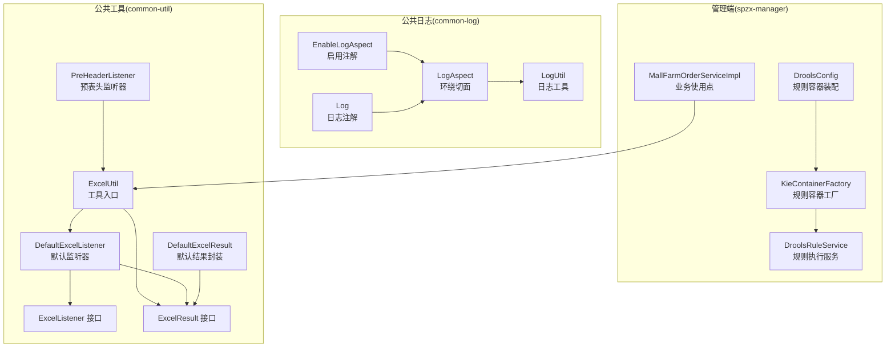
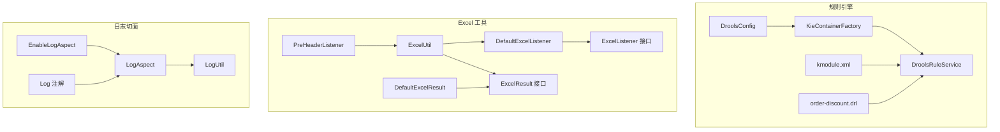
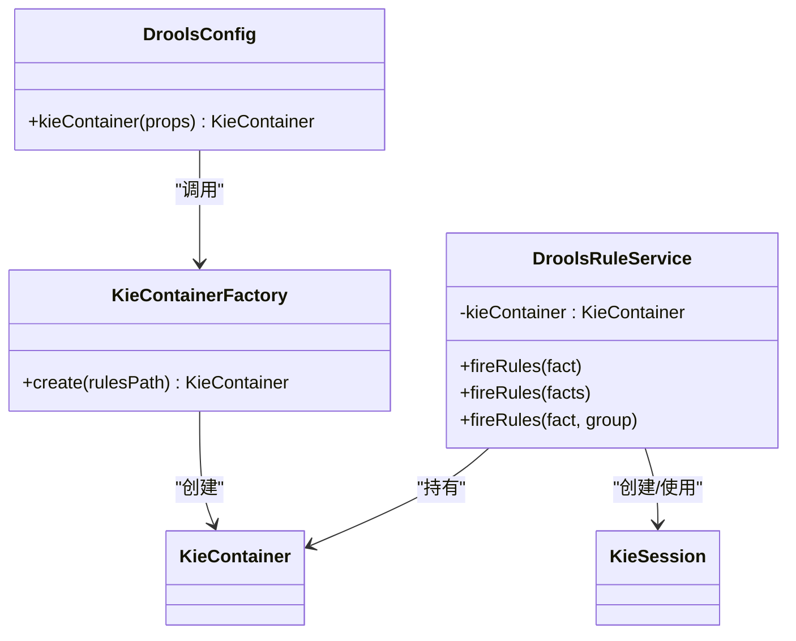
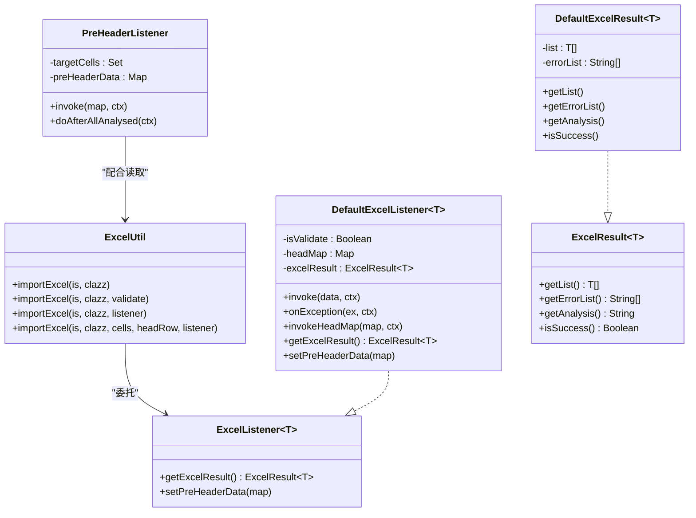
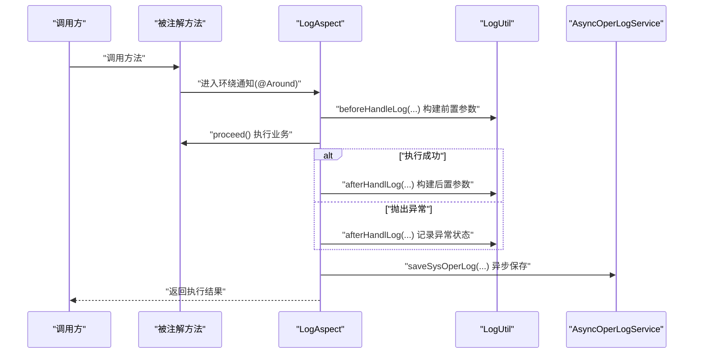
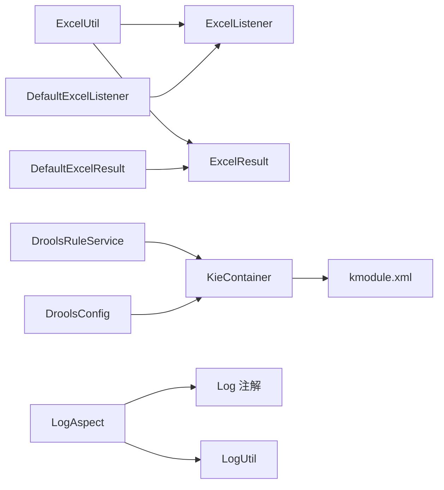

# 设计模式应用

<cite>
**本文引用的文件**
- [spzx-manager/src/main/java/com/joker/spzx/manager/drools/KieContainerFactory.java](file://spzx-manager/src/main/java/com/joker/spzx/manager/drools/KieContainerFactory.java)
- [spzx-manager/src/main/java/com/joker/spzx/manager/drools/DroolsRuleService.java](file://spzx-manager/src/main/java/com/joker/spzx/manager/drools/DroolsRuleService.java)
- [spzx-manager/src/main/java/com/joker/spzx/manager/config/DroolsConfig.java](file://spzx-manager/src/main/java/com/joker/spzx/manager/config/DroolsConfig.java)
- [spzx-manager/src/main/java/com/joker/spzx/manager/config/DroolsProperties.java](file://spzx-manager/src/main/java/com/joker/spzx/manager/config/DroolsProperties.java)
- [spzx-manager/src/main/resources/META-INF/kmodule.xml](file://spzx-manager/src/main/resources/META-INF/kmodule.xml)
- [spzx-manager/src/main/resources/rules/order-discount.drl](file://spzx-manager/src/main/resources/rules/order-discount.drl)
- [spzx-common/common-log/src/main/java/com/joker/spzx/common/annotation/EnableLogAspect.java](file://spzx-common/common-log/src/main/java/com/joker/spzx/common/annotation/EnableLogAspect.java)
- [spzx-common/common-log/src/main/java/com/joker/spzx/common/annotation/Log.java](file://spzx-common/common-log/src/main/java/com/joker/spzx/common/annotation/Log.java)
- [spzx-common/common-log/src/main/java/com/joker/spzx/common/aspect/LogAspect.java](file://spzx-common/common-log/src/main/java/com/joker/spzx/common/aspect/LogAspect.java)
- [spzx-common/common-log/src/main/java/com/joker/spzx/common/util/LogUtil.java](file://spzx-common/common-log/src/main/java/com/joker/spzx/common/util/LogUtil.java)
- [spzx-common/common-util/src/main/java/com/joker/spzx/utils/excel/ExcelUtil.java](file://spzx-common/common-util/src/main/java/com/joker/spzx/utils/excel/ExcelUtil.java)
- [spzx-common/common-util/src/main/java/com/joker/spzx/utils/excel/ExcelListener.java](file://spzx-common/common-util/src/main/java/com/joker/spzx/utils/excel/ExcelListener.java)
- [spzx-common/common-util/src/main/java/com/joker/spzx/utils/excel/DefaultExcelListener.java](file://spzx-common/common-util/src/main/java/com/joker/spzx/utils/excel/DefaultExcelListener.java)
- [spzx-common/common-util/src/main/java/com/joker/spzx/utils/excel/ExcelResult.java](file://spzx-common/common-util/src/main/java/com/joker/spzx/utils/excel/ExcelResult.java)
- [spzx-common/common-util/src/main/java/com/joker/spzx/utils/excel/DefaultExcelResult.java](file://spzx-common/common-util/src/main/java/com/joker/spzx/utils/excel/DefaultExcelResult.java)
- [spzx-common/common-util/src/main/java/com/joker/spzx/utils/excel/PreHeaderListener.java](file://spzx-common/common-util/src/main/java/com/joker/spzx/utils/excel/PreHeaderListener.java)
- [spzx-manager/src/main/java/com/joker/spzx/manager/service/impl/MallFarmOrderServiceImpl.java](file://spzx-manager/src/main/java/com/joker/spzx/manager/service/impl/MallFarmOrderServiceImpl.java)
- [spzx-manager/src/test/java/com/joker/spzx/manager/drools/OrderDiscountDroolsTest.java](file://spzx-manager/src/test/java/com/joker/spzx/manager/drools/OrderDiscountDroolsTest.java)
</cite>

## 目录
1. [简介](#简介)
2. [项目结构](#项目结构)
3. [核心组件](#核心组件)
4. [架构总览](#架构总览)
5. [详细组件分析](#详细组件分析)
6. [依赖分析](#依赖分析)
7. [性能考虑](#性能考虑)
8. [故障排查指南](#故障排查指南)
9. [结论](#结论)
10. [附录](#附录)

## 简介
本文件聚焦于 SPZX 项目中设计模式的应用与落地，围绕以下模式展开系统化分析：
- 工厂模式：Drools 规则引擎工厂（KieContainerFactory），用于从 classpath 构建 KieContainer，便于与 Spring 解耦并支持单元测试。
- 策略模式：Excel 导入导出策略（ExcelUtil + ExcelListener 接口族），通过接口与默认实现分离策略，支持多种监听器与结果封装。
- 单例模式：工具类（如 ExcelUtil、LogUtil）采用静态方法与私有构造，避免重复实例化，提升访问效率与一致性。
- 装饰器模式（AOP 切面）：基于注解驱动的日志切面（LogAspect），在不侵入业务方法的前提下统一记录操作日志。

通过对上述模式的具体实现、应用场景、优缺点与最佳实践进行深入剖析，帮助读者理解如何在实际工程中以最小代价获得高可读性、可维护性与可扩展性。

## 项目结构
SPZX 采用多模块分层组织，管理端模块负责业务逻辑与集成，公共日志与工具模块提供横切能力与通用工具。设计模式主要分布在以下模块：
- 管理端（spzx-manager）：规则引擎、日志切面、Excel 工具使用点。
- 公共日志（common-log）：注解、切面与工具类。
- 公共工具（common-util）：Excel 工具与监听器策略族。

图表来源
- [spzx-manager/src/main/java/com/joker/spzx/manager/config/DroolsConfig.java:17-22](file://spzx-manager/src/main/java/com/joker/spzx/manager/config/DroolsConfig.java#L17-L22)
- [spzx-manager/src/main/java/com/joker/spzx/manager/drools/KieContainerFactory.java:17-22](file://spzx-manager/src/main/java/com/joker/spzx/manager/drools/KieContainerFactory.java#L17-L22)
- [spzx-manager/src/main/java/com/joker/spzx/manager/drools/DroolsRuleService.java:14-52](file://spzx-manager/src/main/java/com/joker/spzx/manager/drools/DroolsRuleService.java#L14-L52)
- [spzx-manager/src/main/java/com/joker/spzx/manager/service/impl/MallFarmOrderServiceImpl.java:200-220](file://spzx-manager/src/main/java/com/joker/spzx/manager/service/impl/MallFarmOrderServiceImpl.java#L200-L220)
- [spzx-common/common-log/src/main/java/com/joker/spzx/common/annotation/EnableLogAspect.java:14-16](file://spzx-common/common-log/src/main/java/com/joker/spzx/common/annotation/EnableLogAspect.java#L14-L16)
- [spzx-common/common-log/src/main/java/com/joker/spzx/common/annotation/Log.java:10-20](file://spzx-common/common-log/src/main/java/com/joker/spzx/common/annotation/Log.java#L10-L20)
- [spzx-common/common-log/src/main/java/com/joker/spzx/common/aspect/LogAspect.java:17-46](file://spzx-common/common-log/src/main/java/com/joker/spzx/common/aspect/LogAspect.java#L17-L46)
- [spzx-common/common-log/src/main/java/com/joker/spzx/common/util/LogUtil.java:17-61](file://spzx-common/common-log/src/main/java/com/joker/spzx/common/util/LogUtil.java#L17-L61)
- [spzx-common/common-util/src/main/java/com/joker/spzx/utils/excel/ExcelUtil.java:29-110](file://spzx-common/common-util/src/main/java/com/joker/spzx/utils/excel/ExcelUtil.java#L29-L110)
- [spzx-common/common-util/src/main/java/com/joker/spzx/utils/excel/ExcelListener.java:7-16](file://spzx-common/common-util/src/main/java/com/joker/spzx/utils/excel/ExcelListener.java#L7-L16)
- [spzx-common/common-util/src/main/java/com/joker/spzx/utils/excel/DefaultExcelListener.java:23-98](file://spzx-common/common-util/src/main/java/com/joker/spzx/utils/excel/DefaultExcelListener.java#L23-L98)
- [spzx-common/common-util/src/main/java/com/joker/spzx/utils/excel/ExcelResult.java:5-23](file://spzx-common/common-util/src/main/java/com/joker/spzx/utils/excel/ExcelResult.java#L5-L23)
- [spzx-common/common-util/src/main/java/com/joker/spzx/utils/excel/DefaultExcelResult.java:10-72](file://spzx-common/common-util/src/main/java/com/joker/spzx/utils/excel/DefaultExcelResult.java#L10-L72)
- [spzx-common/common-util/src/main/java/com/joker/spzx/utils/excel/PreHeaderListener.java:21-84](file://spzx-common/common-util/src/main/java/com/joker/spzx/utils/excel/PreHeaderListener.java#L21-L84)

章节来源
- [spzx-manager/src/main/java/com/joker/spzx/manager/config/DroolsConfig.java:17-22](file://spzx-manager/src/main/java/com/joker/spzx/manager/config/DroolsConfig.java#L17-L22)
- [spzx-manager/src/main/java/com/joker/spzx/manager/drools/KieContainerFactory.java:17-22](file://spzx-manager/src/main/java/com/joker/spzx/manager/drools/KieContainerFactory.java#L17-L22)
- [spzx-common/common-log/src/main/java/com/joker/spzx/common/annotation/EnableLogAspect.java:14-16](file://spzx-common/common-log/src/main/java/com/joker/spzx/common/annotation/EnableLogAspect.java#L14-L16)
- [spzx-common/common-util/src/main/java/com/joker/spzx/utils/excel/ExcelUtil.java:29-110](file://spzx-common/common-util/src/main/java/com/joker/spzx/utils/excel/ExcelUtil.java#L29-L110)

## 核心组件
- 规则引擎工厂与服务
  - KieContainerFactory：提供静态工厂方法，从 classpath 构建 KieContainer，便于脱离 Spring 进行单元测试。
  - DroolsRuleService：面向业务的服务类，封装 KieSession 的创建、插入事实、执行规则与资源释放。
  - DroolsConfig + DroolsProperties：Spring 配置与属性绑定，按需装配 KieContainer Bean。
  - kmodule.xml：声明规则命名空间与会话配置；order-discount.drl：规则文件示例。
- 日志切面与注解
  - EnableLogAspect：启用切面的组合注解。
  - Log：方法级日志注解，声明标题、操作类型、业务类型与是否保存请求/响应数据。
  - LogAspect：环绕通知切面，统一收集请求上下文、调用 LogUtil 前置处理、捕获异常并保存日志。
  - LogUtil：日志参数构建工具，提取请求 URL、IP、方法签名、参数等。
- Excel 工具与策略族
  - ExcelUtil：工具入口，提供同步/异步导入、带预表头读取等重载方法。
  - ExcelListener 接口与 DefaultExcelListener：监听器策略接口与默认实现，支持错误收集与结果封装。
  - ExcelResult 接口与 DefaultExcelResult：导入结果抽象与默认实现，提供分析文本与成功判断。
  - PreHeaderListener：预表头读取监听器，支持指定单元格位置集合的快速采集。

章节来源
- [spzx-manager/src/main/java/com/joker/spzx/manager/drools/KieContainerFactory.java:17-22](file://spzx-manager/src/main/java/com/joker/spzx/manager/drools/KieContainerFactory.java#L17-L22)
- [spzx-manager/src/main/java/com/joker/spzx/manager/drools/DroolsRuleService.java:14-52](file://spzx-manager/src/main/java/com/joker/spzx/manager/drools/DroolsRuleService.java#L14-L52)
- [spzx-manager/src/main/java/com/joker/spzx/manager/config/DroolsConfig.java:17-22](file://spzx-manager/src/main/java/com/joker/spzx/manager/config/DroolsConfig.java#L17-L22)
- [spzx-manager/src/main/java/com/joker/spzx/manager/config/DroolsProperties.java:8-19](file://spzx-manager/src/main/java/com/joker/spzx/manager/config/DroolsProperties.java#L8-L19)
- [spzx-manager/src/main/resources/META-INF/kmodule.xml:1-6](file://spzx-manager/src/main/resources/META-INF/kmodule.xml#L1-L6)
- [spzx-manager/src/main/resources/rules/order-discount.drl:1-19](file://spzx-manager/src/main/resources/rules/order-discount.drl#L1-L19)
- [spzx-common/common-log/src/main/java/com/joker/spzx/common/annotation/EnableLogAspect.java:14-16](file://spzx-common/common-log/src/main/java/com/joker/spzx/common/annotation/EnableLogAspect.java#L14-L16)
- [spzx-common/common-log/src/main/java/com/joker/spzx/common/annotation/Log.java:10-20](file://spzx-common/common-log/src/main/java/com/joker/spzx/common/annotation/Log.java#L10-L20)
- [spzx-common/common-log/src/main/java/com/joker/spzx/common/aspect/LogAspect.java:17-46](file://spzx-common/common-log/src/main/java/com/joker/spzx/common/aspect/LogAspect.java#L17-L46)
- [spzx-common/common-log/src/main/java/com/joker/spzx/common/util/LogUtil.java:17-61](file://spzx-common/common-log/src/main/java/com/joker/spzx/common/util/LogUtil.java#L17-L61)
- [spzx-common/common-util/src/main/java/com/joker/spzx/utils/excel/ExcelUtil.java:29-110](file://spzx-common/common-util/src/main/java/com/joker/spzx/utils/excel/ExcelUtil.java#L29-L110)
- [spzx-common/common-util/src/main/java/com/joker/spzx/utils/excel/ExcelListener.java:7-16](file://spzx-common/common-util/src/main/java/com/joker/spzx/utils/excel/ExcelListener.java#L7-L16)
- [spzx-common/common-util/src/main/java/com/joker/spzx/utils/excel/DefaultExcelListener.java:23-98](file://spzx-common/common-util/src/main/java/com/joker/spzx/utils/excel/DefaultExcelListener.java#L23-L98)
- [spzx-common/common-util/src/main/java/com/joker/spzx/utils/excel/ExcelResult.java:5-23](file://spzx-common/common-util/src/main/java/com/joker/spzx/utils/excel/ExcelResult.java#L5-L23)
- [spzx-common/common-util/src/main/java/com/joker/spzx/utils/excel/DefaultExcelResult.java:10-72](file://spzx-common/common-util/src/main/java/com/joker/spzx/utils/excel/DefaultExcelResult.java#L10-L72)
- [spzx-common/common-util/src/main/java/com/joker/spzx/utils/excel/PreHeaderListener.java:21-84](file://spzx-common/common-util/src/main/java/com/joker/spzx/utils/excel/PreHeaderListener.java#L21-L84)

## 架构总览
下图展示了“规则引擎 + Excel 工具 + 日志切面”三类设计模式在系统中的交互关系与职责边界。

图表来源
- [spzx-manager/src/main/java/com/joker/spzx/manager/drools/KieContainerFactory.java:17-22](file://spzx-manager/src/main/java/com/joker/spzx/manager/drools/KieContainerFactory.java#L17-L22)
- [spzx-manager/src/main/java/com/joker/spzx/manager/config/DroolsConfig.java:17-22](file://spzx-manager/src/main/java/com/joker/spzx/manager/config/DroolsConfig.java#L17-L22)
- [spzx-manager/src/main/resources/META-INF/kmodule.xml:1-6](file://spzx-manager/src/main/resources/META-INF/kmodule.xml#L1-L6)
- [spzx-manager/src/main/resources/rules/order-discount.drl:1-19](file://spzx-manager/src/main/resources/rules/order-discount.drl#L1-L19)
- [spzx-common/common-util/src/main/java/com/joker/spzx/utils/excel/ExcelUtil.java:29-110](file://spzx-common/common-util/src/main/java/com/joker/spzx/utils/excel/ExcelUtil.java#L29-L110)
- [spzx-common/common-util/src/main/java/com/joker/spzx/utils/excel/DefaultExcelListener.java:23-98](file://spzx-common/common-util/src/main/java/com/joker/spzx/utils/excel/DefaultExcelListener.java#L23-L98)
- [spzx-common/common-util/src/main/java/com/joker/spzx/utils/excel/DefaultExcelResult.java:10-72](file://spzx-common/common-util/src/main/java/com/joker/spzx/utils/excel/DefaultExcelResult.java#L10-L72)
- [spzx-common/common-util/src/main/java/com/joker/spzx/utils/excel/PreHeaderListener.java:21-84](file://spzx-common/common-util/src/main/java/com/joker/spzx/utils/excel/PreHeaderListener.java#L21-L84)
- [spzx-common/common-log/src/main/java/com/joker/spzx/common/annotation/EnableLogAspect.java:14-16](file://spzx-common/common-log/src/main/java/com/joker/spzx/common/annotation/EnableLogAspect.java#L14-L16)
- [spzx-common/common-log/src/main/java/com/joker/spzx/common/aspect/LogAspect.java:17-46](file://spzx-common/common-log/src/main/java/com/joker/spzx/common/aspect/LogAspect.java#L17-L46)
- [spzx-common/common-log/src/main/java/com/joker/spzx/common/util/LogUtil.java:17-61](file://spzx-common/common-log/src/main/java/com/joker/spzx/common/util/LogUtil.java#L17-L61)

## 详细组件分析

### 工厂模式：Drools 规则引擎工厂
- 实现要点
  - KieContainerFactory 提供静态工厂方法，通过 KieServices 从 classpath 构建 KieContainer，避免直接依赖 Spring 容器，便于单元测试。
  - DroolsConfig 作为 Spring Bean 装配器，结合 DroolsProperties 与 kmodule.xml，按配置动态启用规则容器。
  - DroolsRuleService 通过依赖注入获得 KieContainer，并在每次执行规则时创建 KieSession，插入事实后 fireAllRules，最后释放资源。
- 应用场景
  - 在业务流程中需要根据订单金额与会员等级动态计算折扣，通过规则文件集中管理策略，避免硬编码分支。
- 优势
  - 解耦 Spring 与规则引擎初始化，提升可测试性；规则集中管理，便于维护与演进。
- 代码示例路径
  - [KieContainerFactory.create(...):17-22](file://spzx-manager/src/main/java/com/joker/spzx/manager/drools/KieContainerFactory.java#L17-L22)
  - [DroolsConfig.kieContainer(...):19-22](file://spzx-manager/src/main/java/com/joker/spzx/manager/config/DroolsConfig.java#L19-L22)
  - [DroolsRuleService.fireRules(...):21-52](file://spzx-manager/src/main/java/com/joker/spzx/manager/drools/DroolsRuleService.java#L21-L52)
  - [kmodule.xml:1-6](file://spzx-manager/src/main/resources/META-INF/kmodule.xml#L1-L6)
  - [order-discount.drl:1-19](file://spzx-manager/src/main/resources/rules/order-discount.drl#L1-L19)

图表来源
- [spzx-manager/src/main/java/com/joker/spzx/manager/drools/KieContainerFactory.java:17-22](file://spzx-manager/src/main/java/com/joker/spzx/manager/drools/KieContainerFactory.java#L17-L22)
- [spzx-manager/src/main/java/com/joker/spzx/manager/config/DroolsConfig.java:19-22](file://spzx-manager/src/main/java/com/joker/spzx/manager/config/DroolsConfig.java#L19-L22)
- [spzx-manager/src/main/java/com/joker/spzx/manager/drools/DroolsRuleService.java:14-52](file://spzx-manager/src/main/java/com/joker/spzx/manager/drools/DroolsRuleService.java#L14-L52)

章节来源
- [spzx-manager/src/main/java/com/joker/spzx/manager/drools/KieContainerFactory.java:17-22](file://spzx-manager/src/main/java/com/joker/spzx/manager/drools/KieContainerFactory.java#L17-L22)
- [spzx-manager/src/main/java/com/joker/spzx/manager/config/DroolsConfig.java:17-22](file://spzx-manager/src/main/java/com/joker/spzx/manager/config/DroolsConfig.java#L17-L22)
- [spzx-manager/src/main/java/com/joker/spzx/manager/drools/DroolsRuleService.java:14-52](file://spzx-manager/src/main/java/com/joker/spzx/manager/drools/DroolsRuleService.java#L14-L52)
- [spzx-manager/src/main/resources/META-INF/kmodule.xml:1-6](file://spzx-manager/src/main/resources/META-INF/kmodule.xml#L1-L6)
- [spzx-manager/src/main/resources/rules/order-discount.drl:1-19](file://spzx-manager/src/main/resources/rules/order-discount.drl#L1-L19)

### 策略模式：Excel 导入导出策略
- 实现要点
  - ExcelUtil 提供多种重载方法，统一入口，内部委派给不同监听器实现。
  - ExcelListener 接口定义监听器契约，DefaultExcelListener 提供默认实现，支持错误收集与结果封装。
  - ExcelResult 接口抽象导入结果，DefaultExcelResult 提供默认实现，包含分析文本与成功判断。
  - PreHeaderListener 支持预读取指定单元格位置的表头数据，配合 ExcelUtil 的多参数重载实现灵活读取。
- 应用场景
  - 业务服务在导入大量数据时，可通过传入不同监听器实现差异化处理（如校验开关、自定义错误处理、预表头映射）。
- 优势
  - 通过接口隔离变化，易于扩展新策略；工具类静态入口降低调用复杂度；结果封装统一便于上层处理。
- 代码示例路径
  - [ExcelUtil.importExcel(...):29-110](file://spzx-common/common-util/src/main/java/com/joker/spzx/utils/excel/ExcelUtil.java#L29-L110)
  - [ExcelListener 接口:7-16](file://spzx-common/common-util/src/main/java/com/joker/spzx/utils/excel/ExcelListener.java#L7-L16)
  - [DefaultExcelListener:23-98](file://spzx-common/common-util/src/main/java/com/joker/spzx/utils/excel/DefaultExcelListener.java#L23-L98)
  - [ExcelResult 接口:5-23](file://spzx-common/common-util/src/main/java/com/joker/spzx/utils/excel/ExcelResult.java#L5-L23)
  - [DefaultExcelResult:10-72](file://spzx-common/common-util/src/main/java/com/joker/spzx/utils/excel/DefaultExcelResult.java#L10-L72)
  - [PreHeaderListener:21-84](file://spzx-common/common-util/src/main/java/com/joker/spzx/utils/excel/PreHeaderListener.java#L21-L84)
  - [MallFarmOrderServiceImpl.importOrderData(...):200-220](file://spzx-manager/src/main/java/com/joker/spzx/manager/service/impl/MallFarmOrderServiceImpl.java#L200-L220)

图表来源
- [spzx-common/common-util/src/main/java/com/joker/spzx/utils/excel/ExcelUtil.java:29-110](file://spzx-common/common-util/src/main/java/com/joker/spzx/utils/excel/ExcelUtil.java#L29-L110)
- [spzx-common/common-util/src/main/java/com/joker/spzx/utils/excel/ExcelListener.java:7-16](file://spzx-common/common-util/src/main/java/com/joker/spzx/utils/excel/ExcelListener.java#L7-L16)
- [spzx-common/common-util/src/main/java/com/joker/spzx/utils/excel/DefaultExcelListener.java:23-98](file://spzx-common/common-util/src/main/java/com/joker/spzx/utils/excel/DefaultExcelListener.java#L23-L98)
- [spzx-common/common-util/src/main/java/com/joker/spzx/utils/excel/ExcelResult.java:5-23](file://spzx-common/common-util/src/main/java/com/joker/spzx/utils/excel/ExcelResult.java#L5-L23)
- [spzx-common/common-util/src/main/java/com/joker/spzx/utils/excel/DefaultExcelResult.java:10-72](file://spzx-common/common-util/src/main/java/com/joker/spzx/utils/excel/DefaultExcelResult.java#L10-L72)
- [spzx-common/common-util/src/main/java/com/joker/spzx/utils/excel/PreHeaderListener.java:21-84](file://spzx-common/common-util/src/main/java/com/joker/spzx/utils/excel/PreHeaderListener.java#L21-L84)

章节来源
- [spzx-common/common-util/src/main/java/com/joker/spzx/utils/excel/ExcelUtil.java:29-110](file://spzx-common/common-util/src/main/java/com/joker/spzx/utils/excel/ExcelUtil.java#L29-L110)
- [spzx-common/common-util/src/main/java/com/joker/spzx/utils/excel/ExcelListener.java:7-16](file://spzx-common/common-util/src/main/java/com/joker/spzx/utils/excel/ExcelListener.java#L7-L16)
- [spzx-common/common-util/src/main/java/com/joker/spzx/utils/excel/DefaultExcelListener.java:23-98](file://spzx-common/common-util/src/main/java/com/joker/spzx/utils/excel/DefaultExcelListener.java#L23-L98)
- [spzx-common/common-util/src/main/java/com/joker/spzx/utils/excel/ExcelResult.java:5-23](file://spzx-common/common-util/src/main/java/com/joker/spzx/utils/excel/ExcelResult.java#L5-L23)
- [spzx-common/common-util/src/main/java/com/joker/spzx/utils/excel/DefaultExcelResult.java:10-72](file://spzx-common/common-util/src/main/java/com/joker/spzx/utils/excel/DefaultExcelResult.java#L10-L72)
- [spzx-common/common-util/src/main/java/com/joker/spzx/utils/excel/PreHeaderListener.java:21-84](file://spzx-common/common-util/src/main/java/com/joker/spzx/utils/excel/PreHeaderListener.java#L21-L84)
- [spzx-manager/src/main/java/com/joker/spzx/manager/service/impl/MallFarmOrderServiceImpl.java:200-220](file://spzx-manager/src/main/java/com/joker/spzx/manager/service/impl/MallFarmOrderServiceImpl.java#L200-L220)

### 单例模式：工具类
- 实现要点
  - ExcelUtil、LogUtil 采用私有构造与静态方法，避免实例化，保证全局唯一访问点。
- 优势
  - 简化调用方式，减少对象创建开销；全局一致的工具行为，便于维护。
- 适用范围
  - 仅包含静态方法与常量的工具类，适合单例化以提升可读性与一致性。

章节来源
- [spzx-common/common-util/src/main/java/com/joker/spzx/utils/excel/ExcelUtil.java:20-21](file://spzx-common/common-util/src/main/java/com/joker/spzx/utils/excel/ExcelUtil.java#L20-L21)
- [spzx-common/common-log/src/main/java/com/joker/spzx/common/util/LogUtil.java:17-17](file://spzx-common/common-log/src/main/java/com/joker/spzx/common/util/LogUtil.java#L17-L17)

### 装饰器模式（AOP 切面）：日志切面
- 实现要点
  - EnableLogAspect 组合注解，导入 LogAspect，简化启用步骤。
  - Log 注解标注在方法上，声明标题、操作类型、业务类型与是否保存请求/响应数据。
  - LogAspect 通过环绕通知拦截方法执行，使用 LogUtil 构建前置参数，捕获异常并统一保存日志。
- 优势
  - 非侵入式横切日志记录，复用性强；通过注解控制粒度，降低重复代码。
- 代码示例路径
  - [EnableLogAspect:14-16](file://spzx-common/common-log/src/main/java/com/joker/spzx/common/annotation/EnableLogAspect.java#L14-L16)
  - [Log 注解:10-20](file://spzx-common/common-log/src/main/java/com/joker/spzx/common/annotation/Log.java#L10-L20)
  - [LogAspect:17-46](file://spzx-common/common-log/src/main/java/com/joker/spzx/common/aspect/LogAspect.java#L17-L46)
  - [LogUtil:17-61](file://spzx-common/common-log/src/main/java/com/joker/spzx/common/util/LogUtil.java#L17-L61)

图表来源
- [spzx-common/common-log/src/main/java/com/joker/spzx/common/aspect/LogAspect.java:17-46](file://spzx-common/common-log/src/main/java/com/joker/spzx/common/aspect/LogAspect.java#L17-L46)
- [spzx-common/common-log/src/main/java/com/joker/spzx/common/util/LogUtil.java:17-61](file://spzx-common/common-log/src/main/java/com/joker/spzx/common/util/LogUtil.java#L17-L61)

章节来源
- [spzx-common/common-log/src/main/java/com/joker/spzx/common/annotation/EnableLogAspect.java:14-16](file://spzx-common/common-log/src/main/java/com/joker/spzx/common/annotation/EnableLogAspect.java#L14-L16)
- [spzx-common/common-log/src/main/java/com/joker/spzx/common/annotation/Log.java:10-20](file://spzx-common/common-log/src/main/java/com/joker/spzx/common/annotation/Log.java#L10-L20)
- [spzx-common/common-log/src/main/java/com/joker/spzx/common/aspect/LogAspect.java:17-46](file://spzx-common/common-log/src/main/java/com/joker/spzx/common/aspect/LogAspect.java#L17-L46)
- [spzx-common/common-log/src/main/java/com/joker/spzx/common/util/LogUtil.java:17-61](file://spzx-common/common-log/src/main/java/com/joker/spzx/common/util/LogUtil.java#L17-L61)

## 依赖分析
- 组件耦合
  - DroolsRuleService 依赖 KieContainer，通过 Spring 条件装配启用；KieContainerFactory 与 Spring 低耦合，利于测试。
  - ExcelUtil 依赖 EasyExcel 与监听器策略族，通过接口隔离具体实现，便于替换与扩展。
  - LogAspect 依赖注解与工具类，通过环绕通知实现横切，不侵入业务方法签名。
- 外部依赖
  - Drools：规则引擎核心库。
  - EasyExcel：Excel 读写库。
  - Spring AOP/AspectJ：切面框架。

图表来源
- [spzx-common/common-util/src/main/java/com/joker/spzx/utils/excel/ExcelUtil.java:29-110](file://spzx-common/common-util/src/main/java/com/joker/spzx/utils/excel/ExcelUtil.java#L29-L110)
- [spzx-common/common-util/src/main/java/com/joker/spzx/utils/excel/ExcelListener.java:7-16](file://spzx-common/common-util/src/main/java/com/joker/spzx/utils/excel/ExcelListener.java#L7-L16)
- [spzx-common/common-util/src/main/java/com/joker/spzx/utils/excel/DefaultExcelListener.java:23-98](file://spzx-common/common-util/src/main/java/com/joker/spzx/utils/excel/DefaultExcelListener.java#L23-L98)
- [spzx-common/common-util/src/main/java/com/joker/spzx/utils/excel/ExcelResult.java:5-23](file://spzx-common/common-util/src/main/java/com/joker/spzx/utils/excel/ExcelResult.java#L5-L23)
- [spzx-common/common-util/src/main/java/com/joker/spzx/utils/excel/DefaultExcelResult.java:10-72](file://spzx-common/common-util/src/main/java/com/joker/spzx/utils/excel/DefaultExcelResult.java#L10-L72)
- [spzx-manager/src/main/java/com/joker/spzx/manager/drools/DroolsRuleService.java:14-52](file://spzx-manager/src/main/java/com/joker/spzx/manager/drools/DroolsRuleService.java#L14-L52)
- [spzx-manager/src/main/java/com/joker/spzx/manager/config/DroolsConfig.java:17-22](file://spzx-manager/src/main/java/com/joker/spzx/manager/config/DroolsConfig.java#L17-L22)
- [spzx-manager/src/main/resources/META-INF/kmodule.xml:1-6](file://spzx-manager/src/main/resources/META-INF/kmodule.xml#L1-L6)
- [spzx-common/common-log/src/main/java/com/joker/spzx/common/aspect/LogAspect.java:17-46](file://spzx-common/common-log/src/main/java/com/joker/spzx/common/aspect/LogAspect.java#L17-L46)
- [spzx-common/common-log/src/main/java/com/joker/spzx/common/annotation/Log.java:10-20](file://spzx-common/common-log/src/main/java/com/joker/spzx/common/annotation/Log.java#L10-L20)
- [spzx-common/common-log/src/main/java/com/joker/spzx/common/util/LogUtil.java:17-61](file://spzx-common/common-log/src/main/java/com/joker/spzx/common/util/LogUtil.java#L17-L61)

章节来源
- [spzx-common/common-util/src/main/java/com/joker/spzx/utils/excel/ExcelUtil.java:29-110](file://spzx-common/common-util/src/main/java/com/joker/spzx/utils/excel/ExcelUtil.java#L29-L110)
- [spzx-manager/src/main/java/com/joker/spzx/manager/drools/DroolsRuleService.java:14-52](file://spzx-manager/src/main/java/com/joker/spzx/manager/drools/DroolsRuleService.java#L14-L52)
- [spzx-manager/src/main/java/com/joker/spzx/manager/config/DroolsConfig.java:17-22](file://spzx-manager/src/main/java/com/joker/spzx/manager/config/DroolsConfig.java#L17-L22)
- [spzx-common/common-log/src/main/java/com/joker/spzx/common/aspect/LogAspect.java:17-46](file://spzx-common/common-log/src/main/java/com/joker/spzx/common/aspect/LogAspect.java#L17-L46)

## 性能考虑
- 规则引擎
  - KieSession 创建与销毁成本较高，应尽量复用或批量处理；在高频场景下可考虑池化或长生命周期会话。
  - 规则文件数量与复杂度直接影响匹配与执行时间，建议拆分规则、合理设置 salience 与分组。
- Excel 导入
  - 大数据量导入建议使用异步监听器与分页读取，避免内存峰值；预表头读取仅在必要时开启。
  - 校验与转换异常处理会增加耗时，应在业务允许范围内启用校验。
- 日志切面
  - 异步保存日志可降低主流程延迟；注意日志大小与敏感信息脱敏，避免过度序列化。

## 故障排查指南
- 规则引擎
  - 症状：规则未生效或执行异常。
  - 排查：确认 kmodule.xml 中命名空间与会话名一致；检查规则文件路径与内容；验证事实对象字段与规则条件匹配。
  - 参考
    - [kmodule.xml:1-6](file://spzx-manager/src/main/resources/META-INF/kmodule.xml#L1-L6)
    - [order-discount.drl:1-19](file://spzx-manager/src/main/resources/rules/order-discount.drl#L1-L19)
    - [DroolsRuleService.fireRules(...):21-52](file://spzx-manager/src/main/java/com/joker/spzx/manager/drools/DroolsRuleService.java#L21-L52)
    - [KieContainerFactory.create(...):17-22](file://spzx-manager/src/main/java/com/joker/spzx/manager/drools/KieContainerFactory.java#L17-L22)
- Excel 导入
  - 症状：解析异常、校验失败、预表头读取错误。
  - 排查：检查输入流是否正确读取；确认监听器实现与结果封装；查看错误列表与分析文本；核对表头行数与目标单元格集合。
  - 参考
    - [ExcelUtil.importExcel(...):71-110](file://spzx-common/common-util/src/main/java/com/joker/spzx/utils/excel/ExcelUtil.java#L71-L110)
    - [DefaultExcelListener.onException(...):51-74](file://spzx-common/common-util/src/main/java/com/joker/spzx/utils/excel/DefaultExcelListener.java#L51-L74)
    - [PreHeaderListener.invoke(...):62-73](file://spzx-common/common-util/src/main/java/com/joker/spzx/utils/excel/PreHeaderListener.java#L62-L73)
- 日志切面
  - 症状：日志缺失或异常未记录。
  - 排查：确认方法已添加 Log 注解；检查 EnableLogAspect 是否启用；核对注解参数与 AsyncOperLogService 是否可用。
  - 参考
    - [EnableLogAspect:14-16](file://spzx-common/common-log/src/main/java/com/joker/spzx/common/annotation/EnableLogAspect.java#L14-L16)
    - [Log 注解:10-20](file://spzx-common/common-log/src/main/java/com/joker/spzx/common/annotation/Log.java#L10-L20)
    - [LogAspect.doAroundAdvice(...):21-46](file://spzx-common/common-log/src/main/java/com/joker/spzx/common/aspect/LogAspect.java#L21-L46)

章节来源
- [spzx-manager/src/main/resources/META-INF/kmodule.xml:1-6](file://spzx-manager/src/main/resources/META-INF/kmodule.xml#L1-L6)
- [spzx-manager/src/main/resources/rules/order-discount.drl:1-19](file://spzx-manager/src/main/resources/rules/order-discount.drl#L1-L19)
- [spzx-manager/src/main/java/com/joker/spzx/manager/drools/DroolsRuleService.java:21-52](file://spzx-manager/src/main/java/com/joker/spzx/manager/drools/DroolsRuleService.java#L21-L52)
- [spzx-manager/src/main/java/com/joker/spzx/manager/drools/KieContainerFactory.java:17-22](file://spzx-manager/src/main/java/com/joker/spzx/manager/drools/KieContainerFactory.java#L17-L22)
- [spzx-common/common-util/src/main/java/com/joker/spzx/utils/excel/ExcelUtil.java:71-110](file://spzx-common/common-util/src/main/java/com/joker/spzx/utils/excel/ExcelUtil.java#L71-L110)
- [spzx-common/common-util/src/main/java/com/joker/spzx/utils/excel/DefaultExcelListener.java:51-74](file://spzx-common/common-util/src/main/java/com/joker/spzx/utils/excel/DefaultExcelListener.java#L51-L74)
- [spzx-common/common-util/src/main/java/com/joker/spzx/utils/excel/PreHeaderListener.java:62-73](file://spzx-common/common-util/src/main/java/com/joker/spzx/utils/excel/PreHeaderListener.java#L62-L73)
- [spzx-common/common-log/src/main/java/com/joker/spzx/common/annotation/EnableLogAspect.java:14-16](file://spzx-common/common-log/src/main/java/com/joker/spzx/common/annotation/EnableLogAspect.java#L14-L16)
- [spzx-common/common-log/src/main/java/com/joker/spzx/common/annotation/Log.java:10-20](file://spzx-common/common-log/src/main/java/com/joker/spzx/common/annotation/Log.java#L10-L20)
- [spzx-common/common-log/src/main/java/com/joker/spzx/common/aspect/LogAspect.java:21-46](file://spzx-common/common-log/src/main/java/com/joker/spzx/common/aspect/LogAspect.java#L21-L46)

## 结论
SPZX 项目在规则引擎、Excel 工具与日志切面三个维度有效应用了工厂、策略、单例与装饰器（AOP）等设计模式：
- 工厂模式使规则引擎初始化与 Spring 解耦，提升可测试性；
- 策略模式通过接口与默认实现分离导入策略，增强扩展性；
- 单例模式统一工具类访问，降低心智负担；
- 装饰器模式以注解驱动的日志切面实现横切关注点，提高代码复用与一致性。

这些模式共同提升了系统的可读性、可维护性与可扩展性，建议在后续迭代中持续遵循“接口隔离 + 默认实现 + 条件装配”的原则，进一步完善配置化与可观测性。

## 附录
- 最佳实践建议
  - 规则引擎：按业务域拆分规则文件，明确 salience 与 agenda-group；对高频事实进行批处理。
  - Excel 工具：大文件优先异步监听器；校验与转换异常统一收集；预表头仅在必要时启用。
  - 日志切面：统一注解参数与异步落库；对敏感字段脱敏；结合监控指标评估日志开销。
- 测试参考
  - 规则引擎单元测试：通过 KieContainerFactory 直接创建容器，构造事实对象验证规则效果。
  - Excel 导入测试：构造输入流与监听器，断言结果列表与错误列表。
  - 日志切面测试：通过组合注解启用切面，断言日志实体保存成功。

章节来源
- [spzx-manager/src/test/java/com/joker/spzx/manager/drools/OrderDiscountDroolsTest.java:17-21](file://spzx-manager/src/test/java/com/joker/spzx/manager/drools/OrderDiscountDroolsTest.java#L17-L21)
- [spzx-manager/src/main/java/com/joker/spzx/manager/drools/KieContainerFactory.java:17-22](file://spzx-manager/src/main/java/com/joker/spzx/manager/drools/KieContainerFactory.java#L17-L22)
- [spzx-common/common-util/src/main/java/com/joker/spzx/utils/excel/ExcelUtil.java:29-110](file://spzx-common/common-util/src/main/java/com/joker/spzx/utils/excel/ExcelUtil.java#L29-L110)
- [spzx-common/common-log/src/main/java/com/joker/spzx/common/aspect/LogAspect.java:17-46](file://spzx-common/common-log/src/main/java/com/joker/spzx/common/aspect/LogAspect.java#L17-L46)