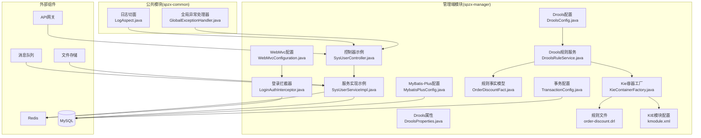
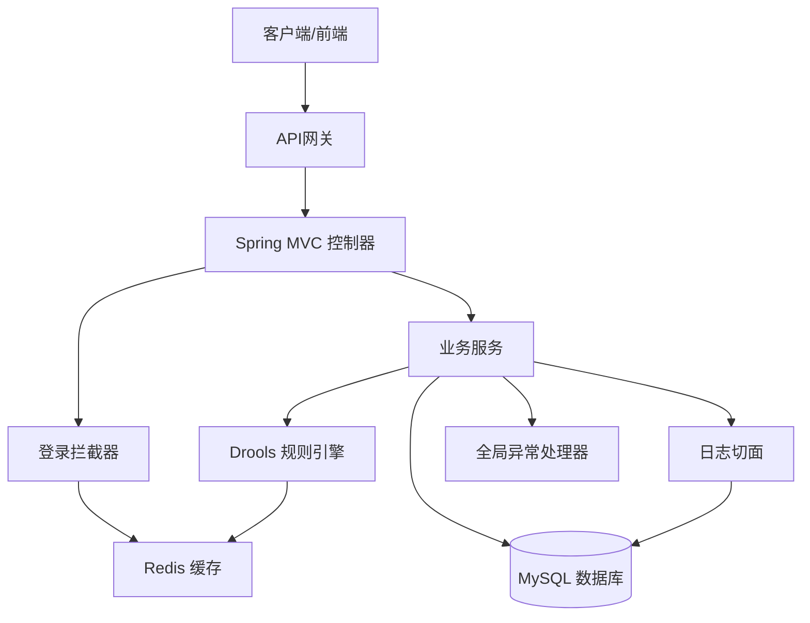
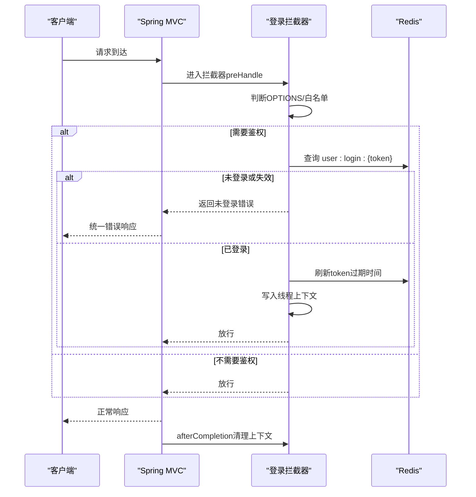
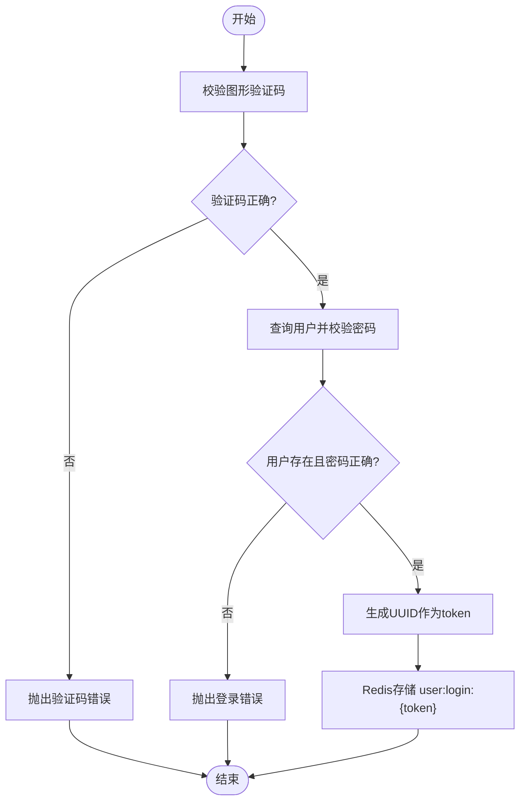
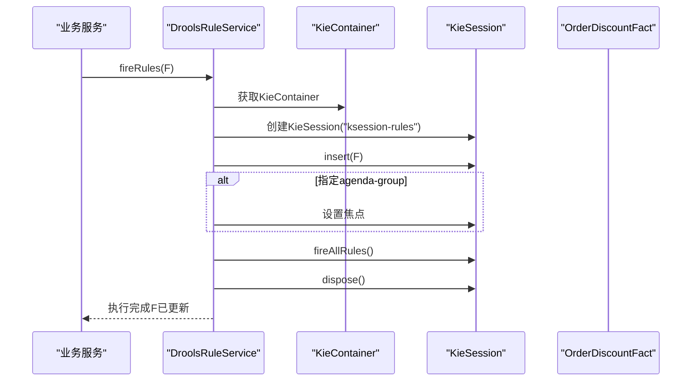
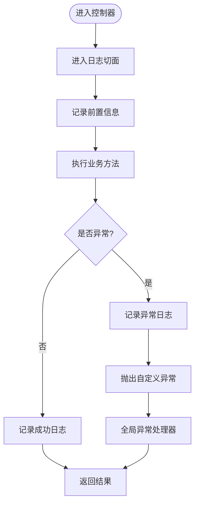
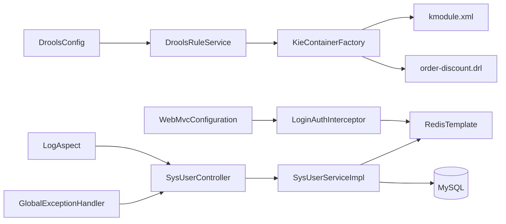

# 集成模式设计

<cite>
**本文引用的文件**
- [application.yml](file://spzx-manager/src/main/resources/application.yml)
- [application-dev.yml](file://spzx-manager/src/main/resources/application-dev.yml)
- [WebMvcConfiguration.java](file://spzx-manager/src/main/java/com/joker/spzx/manager/config/WebMvcConfiguration.java)
- [LoginAuthInterceptor.java](file://spzx-manager/src/main/java/com/joker/spzx/manager/config/LoginAuthInterceptor.java)
- [DroolsConfig.java](file://spzx-manager/src/main/java/com/joker/spzx/manager/config/DroolsConfig.java)
- [DroolsProperties.java](file://spzx-manager/src/main/java/com/joker/spzx/manager/config/DroolsProperties.java)
- [MybatisPlusConfig.java](file://spzx-manager/src/main/java/com/joker/spzx/manager/config/MybatisPlusConfig.java)
- [TransactionConfig.java](file://spzx-manager/src/main/java/com/joker/spzx/manager/config/TransactionConfig.java)
- [DroolsRuleService.java](file://spzx-manager/src/main/java/com/joker/spzx/manager/drools/DroolsRuleService.java)
- [KieContainerFactory.java](file://spzx-manager/src/main/java/com/joker/spzx/manager/drools/KieContainerFactory.java)
- [OrderDiscountFact.java](file://spzx-manager/src/main/java/com/joker/spzx/manager/drools/model/OrderDiscountFact.java)
- [order-discount.drl](file://spzx-manager/src/main/resources/rules/order-discount.drl)
- [kmodule.xml](file://spzx-manager/src/main/resources/META-INF/kmodule.xml)
- [SysUserController.java](file://spzx-manager/src/main/java/com/joker/spzx/manager/controller/SysUserController.java)
- [SysUserServiceImpl.java](file://spzx-manager/src/main/java/com/joker/spzx/manager/service/impl/SysUserServiceImpl.java)
- [LogAspect.java](file://spzx-common/common-log/src/main/java/com/joker/spzx/common/aspect/LogAspect.java)
- [GlobalExceptionHandler.java](file://spzx-common/common-service/src/main/java/com/joker/spzx/common/exception/GlobalExceptionHandler.java)
</cite>

## 目录
1. [引言](#引言)
2. [项目结构](#项目结构)
3. [核心组件](#核心组件)
4. [架构总览](#架构总览)
5. [详细组件分析](#详细组件分析)
6. [依赖分析](#依赖分析)
7. [性能考虑](#性能考虑)
8. [故障排查指南](#故障排查指南)
9. [结论](#结论)
10. [附录](#附录)

## 引言
本文件面向SPZX项目的集成模式设计，系统性阐述系统与外部组件的集成方式，涵盖Spring MVC配置、拦截器集成、AOP切面集成；深入解析JWT认证集成（基于Redis Token）、Redis缓存集成、MySQL数据库集成；详细说明规则引擎Drools的集成模式（规则加载、规则执行、结果返回）；并给出第三方服务集成的最佳实践（API网关、消息队列、文件存储），以及异常处理与监控方案。

## 项目结构
SPZX采用多模块结构，核心业务位于spzx-manager模块，公共日志与异常处理位于spzx-common模块。管理端通过Spring MVC对外提供REST接口，使用拦截器进行统一鉴权，结合Redis实现无状态认证，使用MyBatis-Plus进行数据访问，并通过Drools规则引擎对业务规则进行解耦执行。

图表来源
- [WebMvcConfiguration.java:14-38](file://spzx-manager/src/main/java/com/joker/spzx/manager/config/WebMvcConfiguration.java#L14-L38)
- [LoginAuthInterceptor.java:23-80](file://spzx-manager/src/main/java/com/joker/spzx/manager/config/LoginAuthInterceptor.java#L23-L80)
- [SysUserController.java:24-69](file://spzx-manager/src/main/java/com/joker/spzx/manager/controller/SysUserController.java#L24-L69)
- [SysUserServiceImpl.java:46-173](file://spzx-manager/src/main/java/com/joker/spzx/manager/service/impl/SysUserServiceImpl.java#L46-L173)
- [DroolsConfig.java:17-23](file://spzx-manager/src/main/java/com/joker/spzx/manager/config/DroolsConfig.java#L17-L23)
- [DroolsRuleService.java:14-53](file://spzx-manager/src/main/java/com/joker/spzx/manager/drools/DroolsRuleService.java#L14-L53)
- [KieContainerFactory.java:12-23](file://spzx-manager/src/main/java/com/joker/spzx/manager/drools/KieContainerFactory.java#L12-L23)
- [order-discount.drl:1-20](file://spzx-manager/src/main/resources/rules/order-discount.drl#L1-L20)
- [kmodule.xml:1-7](file://spzx-manager/src/main/resources/META-INF/kmodule.xml#L1-L7)
- [MybatisPlusConfig.java:20-53](file://spzx-manager/src/main/java/com/joker/spzx/manager/config/MybatisPlusConfig.java#L20-L53)
- [TransactionConfig.java:11-19](file://spzx-manager/src/main/java/com/joker/spzx/manager/config/TransactionConfig.java#L11-L19)
- [LogAspect.java:14-46](file://spzx-common/common-log/src/main/java/com/joker/spzx/common/aspect/LogAspect.java#L14-L46)
- [GlobalExceptionHandler.java:7-19](file://spzx-common/common-service/src/main/java/com/joker/spzx/common/exception/GlobalExceptionHandler.java#L7-L19)

章节来源
- [application.yml:1-5](file://spzx-manager/src/main/resources/application.yml#L1-L5)
- [application-dev.yml:1-65](file://spzx-manager/src/main/resources/application-dev.yml#L1-L65)

## 核心组件
- Spring MVC与拦截器集成
  - WebMvc配置注册拦截器与跨域策略，拦截器负责鉴权与上下文清理。
  - 登录拦截器从请求头读取token，校验Redis中的用户信息，刷新过期时间，并将用户信息写入线程上下文。
- JWT认证集成（基于Redis）
  - 登录成功生成UUID作为token，存储到Redis并设置长期有效期；后续请求携带token访问受保护资源。
  - 登录拦截器在preHandle阶段校验token有效性并在afterCompletion清理上下文。
- Redis缓存集成
  - 使用RedisTemplate进行字符串键值操作，存储登录态、验证码等。
  - 提供token与验证码的过期控制与清理。
- MySQL数据库集成
  - MyBatis-Plus配置乐观锁、分页插件与MySQL方言；事务由DataSourceTransactionManager统一管理。
  - 控制器与服务层通过Mapper与Service实现数据持久化。
- 规则引擎Drools集成
  - 通过DroolsConfig与DroolsProperties加载规则；KieContainerFactory从classpath加载kmodule与DRL。
  - DroolsRuleService封装规则执行，支持单事实与批量事实执行，并可按agenda-group聚焦执行。
- AOP日志与异常处理
  - LogAspect环绕通知记录操作日志，异步落库；GlobalExceptionHandler统一捕获异常并返回标准结果。

章节来源
- [WebMvcConfiguration.java:14-38](file://spzx-manager/src/main/java/com/joker/spzx/manager/config/WebMvcConfiguration.java#L14-L38)
- [LoginAuthInterceptor.java:23-80](file://spzx-manager/src/main/java/com/joker/spzx/manager/config/LoginAuthInterceptor.java#L23-L80)
- [SysUserServiceImpl.java:56-111](file://spzx-manager/src/main/java/com/joker/spzx/manager/service/impl/SysUserServiceImpl.java#L56-L111)
- [MybatisPlusConfig.java:20-53](file://spzx-manager/src/main/java/com/joker/spzx/manager/config/MybatisPlusConfig.java#L20-L53)
- [TransactionConfig.java:11-19](file://spzx-manager/src/main/java/com/joker/spzx/manager/config/TransactionConfig.java#L11-L19)
- [DroolsConfig.java:17-23](file://spzx-manager/src/main/java/com/joker/spzx/manager/config/DroolsConfig.java#L17-L23)
- [DroolsRuleService.java:14-53](file://spzx-manager/src/main/java/com/joker/spzx/manager/drools/DroolsRuleService.java#L14-L53)
- [KieContainerFactory.java:12-23](file://spzx-manager/src/main/java/com/joker/spzx/manager/drools/KieContainerFactory.java#L12-L23)
- [LogAspect.java:14-46](file://spzx-common/common-log/src/main/java/com/joker/spzx/common/aspect/LogAspect.java#L14-L46)
- [GlobalExceptionHandler.java:7-19](file://spzx-common/common-service/src/main/java/com/joker/spzx/common/exception/GlobalExceptionHandler.java#L7-L19)

## 架构总览
下图展示系统与外部组件的集成关系与数据流：

图表来源
- [WebMvcConfiguration.java:14-38](file://spzx-manager/src/main/java/com/joker/spzx/manager/config/WebMvcConfiguration.java#L14-L38)
- [LoginAuthInterceptor.java:23-80](file://spzx-manager/src/main/java/com/joker/spzx/manager/config/LoginAuthInterceptor.java#L23-L80)
- [SysUserController.java:24-69](file://spzx-manager/src/main/java/com/joker/spzx/manager/controller/SysUserController.java#L24-L69)
- [SysUserServiceImpl.java:46-173](file://spzx-manager/src/main/java/com/joker/spzx/manager/service/impl/SysUserServiceImpl.java#L46-L173)
- [DroolsRuleService.java:14-53](file://spzx-manager/src/main/java/com/joker/spzx/manager/drools/DroolsRuleService.java#L14-L53)
- [LogAspect.java:14-46](file://spzx-common/common-log/src/main/java/com/joker/spzx/common/aspect/LogAspect.java#L14-L46)
- [GlobalExceptionHandler.java:7-19](file://spzx-common/common-service/src/main/java/com/joker/spzx/common/exception/GlobalExceptionHandler.java#L7-L19)

## 详细组件分析

### Spring MVC与拦截器集成
- WebMvc配置
  - 注册登录拦截器，对所有路径生效，排除白名单。
  - 配置跨域策略，允许特定来源与方法。
- 登录拦截器
  - OPTIONS请求直接放行；白名单直接放行。
  - 从请求头读取token，查询Redis中的用户信息，校验失败返回统一错误；成功则刷新过期时间并将用户写入线程上下文；请求结束后清理上下文。

图表来源
- [WebMvcConfiguration.java:19-35](file://spzx-manager/src/main/java/com/joker/spzx/manager/config/WebMvcConfiguration.java#L19-L35)
- [LoginAuthInterceptor.java:29-79](file://spzx-manager/src/main/java/com/joker/spzx/manager/config/LoginAuthInterceptor.java#L29-L79)

章节来源
- [WebMvcConfiguration.java:14-38](file://spzx-manager/src/main/java/com/joker/spzx/manager/config/WebMvcConfiguration.java#L14-L38)
- [LoginAuthInterceptor.java:23-80](file://spzx-manager/src/main/java/com/joker/spzx/manager/config/LoginAuthInterceptor.java#L23-L80)

### JWT认证集成（基于Redis）
- 登录流程
  - 验证图形验证码（Redis存储），验证通过后查询用户并校验密码。
  - 生成UUID作为token，将用户信息以JSON形式写入Redis并设置长期有效期。
- 退出流程
  - 删除Redis中的token键，使旧token失效。
- 客户端携带token访问受保护接口，拦截器负责校验与续期。

图表来源
- [SysUserServiceImpl.java:56-84](file://spzx-manager/src/main/java/com/joker/spzx/manager/service/impl/SysUserServiceImpl.java#L56-L84)
- [LoginAuthInterceptor.java:46-52](file://spzx-manager/src/main/java/com/joker/spzx/manager/config/LoginAuthInterceptor.java#L46-L52)

章节来源
- [SysUserServiceImpl.java:56-111](file://spzx-manager/src/main/java/com/joker/spzx/manager/service/impl/SysUserServiceImpl.java#L56-L111)

### Redis缓存集成
- 键命名规范
  - 登录态键：user:login:{token}
  - 验证码键：user:login:validatecode:{key}
- 过期策略
  - 登录态长期有效；验证码短期有效（分钟级）。
- 使用场景
  - 登录拦截器读取用户信息；登录服务生成与存储token；验证码校验与清理。

章节来源
- [LoginAuthInterceptor.java:46-52](file://spzx-manager/src/main/java/com/joker/spzx/manager/config/LoginAuthInterceptor.java#L46-L52)
- [SysUserServiceImpl.java:60-66](file://spzx-manager/src/main/java/com/joker/spzx/manager/service/impl/SysUserServiceImpl.java#L60-L66)
- [SysUserServiceImpl.java:94-95](file://spzx-manager/src/main/java/com/joker/spzx/manager/service/impl/SysUserServiceImpl.java#L94-L95)

### MySQL数据库集成
- MyBatis-Plus配置
  - 乐观锁插件、分页插件（MySQL方言、最大限制、优化JOIN）。
  - 自定义线程池用于异步任务（非数据库连接池）。
- 事务管理
  - 基于DataSourceTransactionManager，注解@EnableTransactionManagement开启。
- 控制器与服务层
  - 控制器接收请求，服务层通过Mapper执行SQL，返回统一结果包装。

章节来源
- [MybatisPlusConfig.java:20-53](file://spzx-manager/src/main/java/com/joker/spzx/manager/config/MybatisPlusConfig.java#L20-L53)
- [TransactionConfig.java:11-19](file://spzx-manager/src/main/java/com/joker/spzx/manager/config/TransactionConfig.java#L11-L19)
- [SysUserController.java:24-69](file://spzx-manager/src/main/java/com/joker/spzx/manager/controller/SysUserController.java#L24-L69)
- [SysUserServiceImpl.java:114-120](file://spzx-manager/src/main/java/com/joker/spzx/manager/service/impl/SysUserServiceImpl.java#L114-L120)

### 规则引擎Drools集成
- 配置与加载
  - DroolsConfig根据drools.enabled与rules-path创建KieContainer。
  - KieContainerFactory通过KieServices加载classpath下的kmodule.xml与rules目录。
- 规则执行
  - DroolsRuleService创建KieSession，插入事实对象，按需设置agenda-group焦点，fireAllRules后释放会话。
  - 事实模型OrderDiscountFact在preprocess中预计算条件标志位，避免DRL中复杂判断。
- 规则文件
  - order-discount.drl定义两条规则，按优先级应用折扣。

图表来源
- [DroolsRuleService.java:21-39](file://spzx-manager/src/main/java/com/joker/spzx/manager/drools/DroolsRuleService.java#L21-L39)
- [KieContainerFactory.java:17-22](file://spzx-manager/src/main/java/com/joker/spzx/manager/drools/KieContainerFactory.java#L17-L22)
- [kmodule.xml:2-6](file://spzx-manager/src/main/resources/META-INF/kmodule.xml#L2-L6)
- [order-discount.drl:1-20](file://spzx-manager/src/main/resources/rules/order-discount.drl#L1-L20)
- [OrderDiscountFact.java:46-68](file://spzx-manager/src/main/java/com/joker/spzx/manager/drools/model/OrderDiscountFact.java#L46-L68)

章节来源
- [DroolsConfig.java:17-23](file://spzx-manager/src/main/java/com/joker/spzx/manager/config/DroolsConfig.java#L17-L23)
- [DroolsProperties.java:8-19](file://spzx-manager/src/main/java/com/joker/spzx/manager/config/DroolsProperties.java#L8-L19)
- [DroolsRuleService.java:14-53](file://spzx-manager/src/main/java/com/joker/spzx/manager/drools/DroolsRuleService.java#L14-L53)
- [KieContainerFactory.java:12-23](file://spzx-manager/src/main/java/com/joker/spzx/manager/drools/KieContainerFactory.java#L12-L23)
- [OrderDiscountFact.java:12-69](file://spzx-manager/src/main/java/com/joker/spzx/manager/drools/model/OrderDiscountFact.java#L12-L69)
- [order-discount.drl:1-20](file://spzx-manager/src/main/resources/rules/order-discount.drl#L1-L20)
- [kmodule.xml:1-7](file://spzx-manager/src/main/resources/META-INF/kmodule.xml#L1-L7)

### AOP日志与异常处理
- 日志切面
  - 基于注解@Log，环绕通知在方法前后收集请求与响应信息，异步写入操作日志。
- 全局异常处理
  - RestControllerAdvice统一捕获Exception与ServiceException，返回标准化结果。

图表来源
- [LogAspect.java:17-46](file://spzx-common/common-log/src/main/java/com/joker/spzx/common/aspect/LogAspect.java#L17-L46)
- [GlobalExceptionHandler.java:7-19](file://spzx-common/common-service/src/main/java/com/joker/spzx/common/exception/GlobalExceptionHandler.java#L7-L19)

章节来源
- [LogAspect.java:14-46](file://spzx-common/common-log/src/main/java/com/joker/spzx/common/aspect/LogAspect.java#L14-L46)
- [GlobalExceptionHandler.java:7-19](file://spzx-common/common-service/src/main/java/com/joker/spzx/common/exception/GlobalExceptionHandler.java#L7-L19)

### 第三方服务集成最佳实践
- API网关集成
  - 通过网关统一分流与限流，管理端仅暴露REST接口；拦截器负责鉴权。
- 消息队列集成
  - 异步任务建议使用消息队列解耦（如订单统计、报表生成），避免阻塞主线程。
- 文件存储集成
  - 图片/文件上传建议接入对象存储（如MinIO、OSS），并记录元数据至MySQL。

[本节为概念性指导，无需列出具体文件来源]

## 依赖分析
- 组件内聚与耦合
  - 登录拦截器与Redis强耦合，但通过线程上下文解耦业务层；服务层通过Mapper与事务管理器解耦数据库。
  - DroolsRuleService通过KieContainer与KieSession解耦规则加载与执行。
- 外部依赖
  - Redis用于认证与验证码；MySQL用于持久化；Drools用于规则执行。

图表来源
- [WebMvcConfiguration.java:14-38](file://spzx-manager/src/main/java/com/joker/spzx/manager/config/WebMvcConfiguration.java#L14-L38)
- [LoginAuthInterceptor.java:23-80](file://spzx-manager/src/main/java/com/joker/spzx/manager/config/LoginAuthInterceptor.java#L23-L80)
- [SysUserController.java:24-69](file://spzx-manager/src/main/java/com/joker/spzx/manager/controller/SysUserController.java#L24-L69)
- [SysUserServiceImpl.java:46-173](file://spzx-manager/src/main/java/com/joker/spzx/manager/service/impl/SysUserServiceImpl.java#L46-L173)
- [DroolsConfig.java:17-23](file://spzx-manager/src/main/java/com/joker/spzx/manager/config/DroolsConfig.java#L17-L23)
- [DroolsRuleService.java:14-53](file://spzx-manager/src/main/java/com/joker/spzx/manager/drools/DroolsRuleService.java#L14-L53)
- [KieContainerFactory.java:12-23](file://spzx-manager/src/main/java/com/joker/spzx/manager/drools/KieContainerFactory.java#L12-L23)
- [kmodule.xml:1-7](file://spzx-manager/src/main/resources/META-INF/kmodule.xml#L1-L7)
- [order-discount.drl:1-20](file://spzx-manager/src/main/resources/rules/order-discount.drl#L1-L20)
- [LogAspect.java:14-46](file://spzx-common/common-log/src/main/java/com/joker/spzx/common/aspect/LogAspect.java#L14-L46)
- [GlobalExceptionHandler.java:7-19](file://spzx-common/common-service/src/main/java/com/joker/spzx/common/exception/GlobalExceptionHandler.java#L7-L19)

章节来源
- [MybatisPlusConfig.java:20-53](file://spzx-manager/src/main/java/com/joker/spzx/manager/config/MybatisPlusConfig.java#L20-L53)
- [TransactionConfig.java:11-19](file://spzx-manager/src/main/java/com/joker/spzx/manager/config/TransactionConfig.java#L11-L19)

## 性能考虑
- Redis热点键
  - 登录态键可能成为热点，建议使用集群或主从复制提升可用性与读扩展。
- 数据库优化
  - 合理设置分页上限与JOIN优化；乐观锁减少并发冲突。
- 规则引擎
  - 规则数量增长时，注意KieSession生命周期管理与内存占用；必要时拆分规则集或引入缓存。

[本节为通用性能建议，无需列出具体文件来源]

## 故障排查指南
- 登录拦截器返回未登录
  - 检查请求头token是否存在；确认Redis中user:login:{token}是否存在且未过期。
- 登录失败或验证码错误
  - 核对验证码键值与Redis中的验证码；确认登录密码MD5一致性。
- 规则未生效
  - 检查drools.enabled与rules-path配置；确认kmodule.xml与DRL文件路径正确；确保事实对象preprocess已执行。
- 全局异常未捕获
  - 确认@RestControllerAdvice生效范围；检查自定义异常类型映射。

章节来源
- [LoginAuthInterceptor.java:40-52](file://spzx-manager/src/main/java/com/joker/spzx/manager/config/LoginAuthInterceptor.java#L40-L52)
- [SysUserServiceImpl.java:56-84](file://spzx-manager/src/main/java/com/joker/spzx/manager/service/impl/SysUserServiceImpl.java#L56-L84)
- [DroolsConfig.java:16-17](file://spzx-manager/src/main/java/com/joker/spzx/manager/config/DroolsConfig.java#L16-L17)
- [kmodule.xml:2-6](file://spzx-manager/src/main/resources/META-INF/kmodule.xml#L2-L6)
- [GlobalExceptionHandler.java:7-19](file://spzx-common/common-service/src/main/java/com/joker/spzx/common/exception/GlobalExceptionHandler.java#L7-L19)

## 结论
SPZX项目通过Spring MVC+拦截器实现统一鉴权，结合Redis实现无状态认证；MyBatis-Plus与事务管理保障数据一致性；Drools规则引擎实现业务规则解耦。整体架构清晰、职责分离明确，具备良好的扩展性与可维护性。建议在生产环境中进一步完善消息队列与文件存储集成，并持续优化规则与数据库性能。

## 附录
- 配置示例（要点）
  - 应用名称与环境激活：见application.yml。
  - 数据源与Redis连接、Drools规则路径：见application-dev.yml。
  - MVC拦截器与跨域：见WebMvcConfiguration。
  - Drools属性与启用开关：见DroolsProperties与DroolsConfig。
  - MyBatis-Plus插件与事务管理：见MybatisPlusConfig与TransactionConfig。

章节来源
- [application.yml:1-5](file://spzx-manager/src/main/resources/application.yml#L1-L5)
- [application-dev.yml:1-65](file://spzx-manager/src/main/resources/application-dev.yml#L1-L65)
- [WebMvcConfiguration.java:14-38](file://spzx-manager/src/main/java/com/joker/spzx/manager/config/WebMvcConfiguration.java#L14-L38)
- [DroolsProperties.java:8-19](file://spzx-manager/src/main/java/com/joker/spzx/manager/config/DroolsProperties.java#L8-L19)
- [DroolsConfig.java:16-17](file://spzx-manager/src/main/java/com/joker/spzx/manager/config/DroolsConfig.java#L16-L17)
- [MybatisPlusConfig.java:20-53](file://spzx-manager/src/main/java/com/joker/spzx/manager/config/MybatisPlusConfig.java#L20-L53)
- [TransactionConfig.java:11-19](file://spzx-manager/src/main/java/com/joker/spzx/manager/config/TransactionConfig.java#L11-L19)