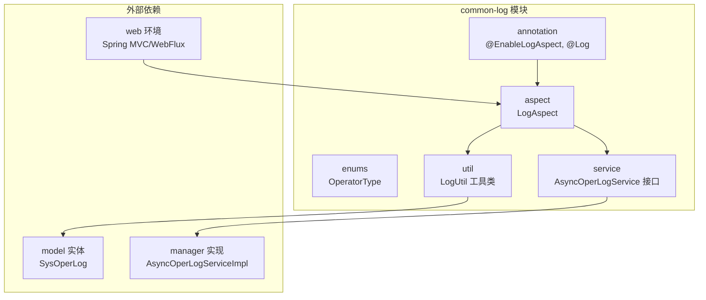
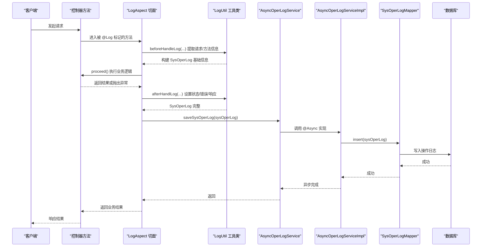
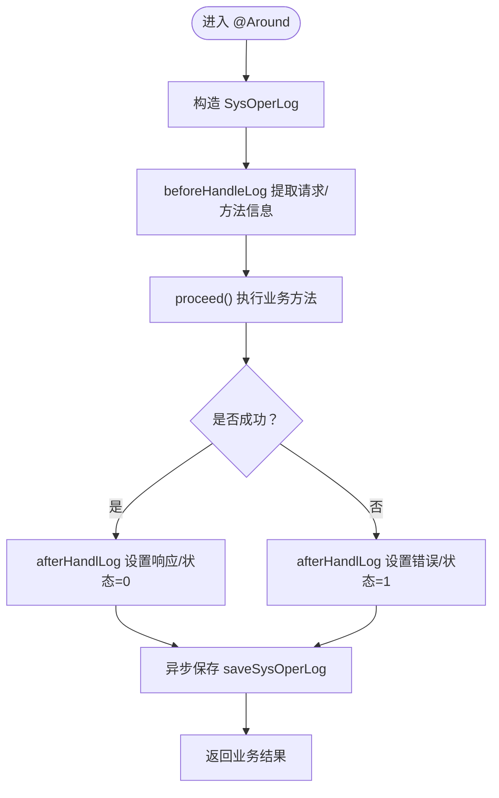
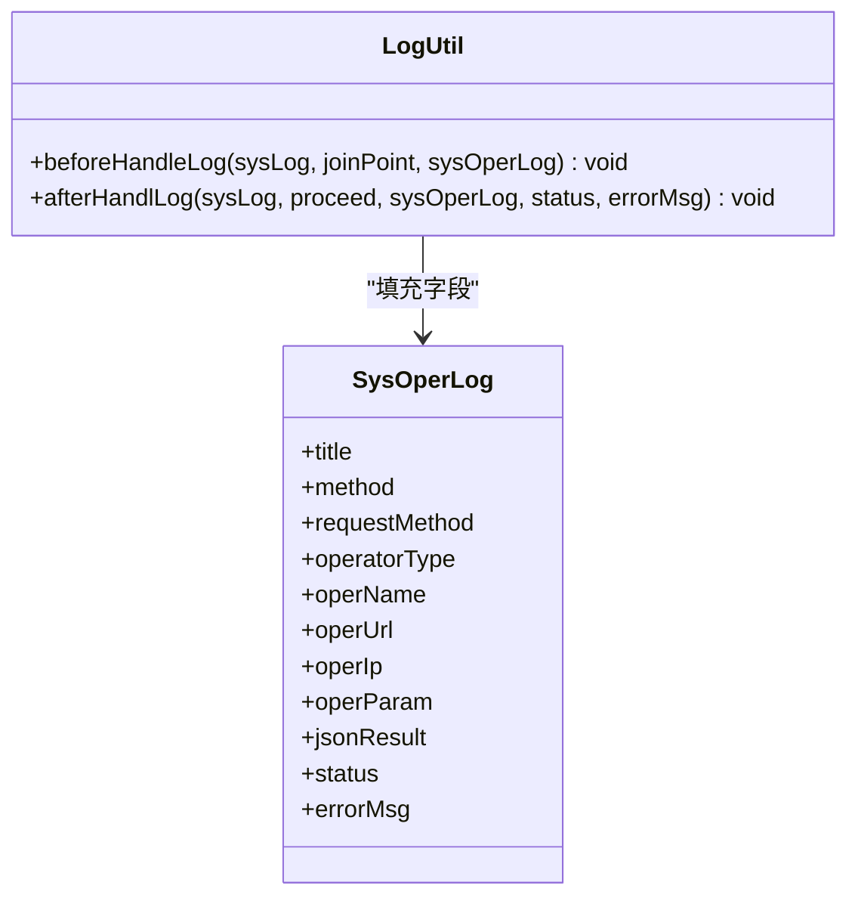
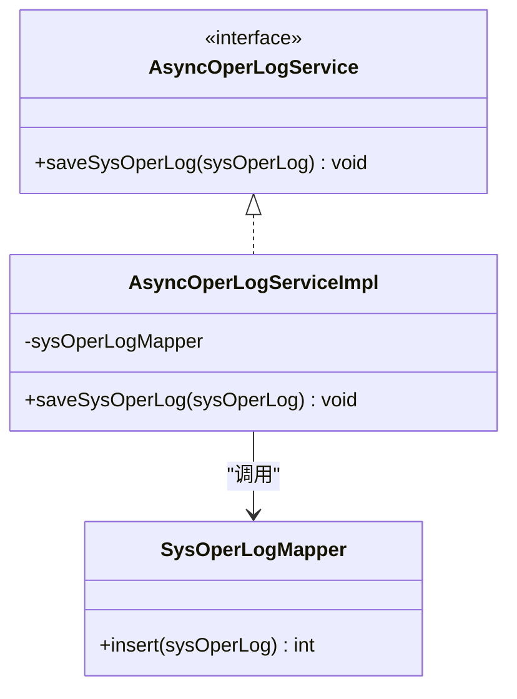
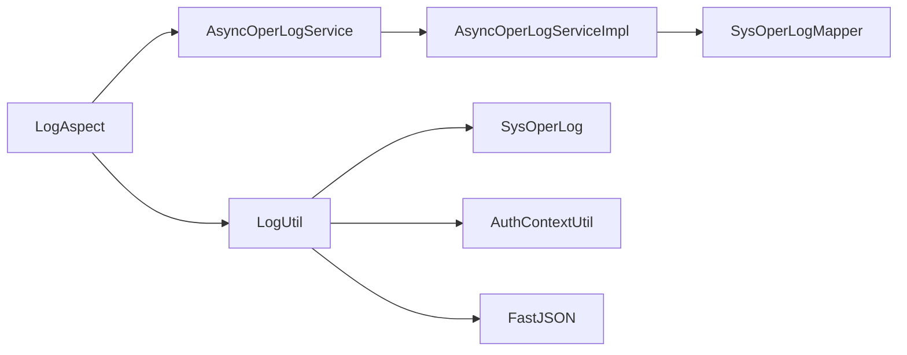

# common-log 日志组件

<cite>
**本文引用的文件列表**
- [EnableLogAspect.java](file://spzx-common/common-log/src/main/java/com/joker/spzx/common/annotation/EnableLogAspect.java)
- [Log.java](file://spzx-common/common-log/src/main/java/com/joker/spzx/common/annotation/Log.java)
- [LogAspect.java](file://spzx-common/common-log/src/main/java/com/joker/spzx/common/aspect/LogAspect.java)
- [OperatorType.java](file://spzx-common/common-log/src/main/java/com/joker/spzx/common/enums/OperatorType.java)
- [AsyncOperLogService.java](file://spzx-common/common-log/src/main/java/com/joker/spzx/common/service/AsyncOperLogService.java)
- [LogUtil.java](file://spzx-common/common-log/src/main/java/com/joker/spzx/common/util/LogUtil.java)
- [SysOperLog.java](file://spzx-model/src/main/java/com/joker/spzx/model/entity/system/SysOperLog.java)
- [AsyncOperLogServiceImpl.java](file://spzx-manager/src/main/java/com/joker/spzx/manager/service/impl/AsyncOperLogServiceImpl.java)
- [pom.xml](file://spzx-common/common-log/pom.xml)
</cite>

## 目录
1. [简介](#简介)
2. [项目结构](#项目结构)
3. [核心组件](#核心组件)
4. [架构总览](#架构总览)
5. [详细组件分析](#详细组件分析)
6. [依赖分析](#依赖分析)
7. [性能考虑](#性能考虑)
8. [故障排除指南](#故障排除指南)
9. [结论](#结论)
10. [附录：使用示例与最佳实践](#附录使用示例与最佳实践)

## 简介
本文件为 common-log 日志组件的技术文档，聚焦于基于 Spring AOP 的操作日志切面实现，涵盖：
- LogAspect 切面的拦截流程、参数提取、执行时长统计与异常处理
- @Log 注解的语义与字段含义
- @EnableLogAspect 的自动装配机制
- OperatorType 枚举的操作类型定义
- AsyncOperLogService 异步日志持久化策略
- LogUtil 工具类的日志构建与格式化能力
- 配置项、性能优化建议与常见问题排查

## 项目结构
common-log 组件位于 spzx-common/common-log 模块，采用按职责分层组织：
- annotation：注解定义（@EnableLogAspect、@Log）
- aspect：AOP 切面（LogAspect）
- enums：枚举（OperatorType）
- service：接口（AsyncOperLogService）
- util：工具类（LogUtil）

图表来源
- [LogAspect.java:1-47](file://spzx-common/common-log/src/main/java/com/joker/spzx/common/aspect/LogAspect.java#L1-L47)
- [LogUtil.java:1-62](file://spzx-common/common-log/src/main/java/com/joker/spzx/common/util/LogUtil.java#L1-L62)
- [AsyncOperLogService.java:1-9](file://spzx-common/common-log/src/main/java/com/joker/spzx/common/service/AsyncOperLogService.java#L1-L9)
- [AsyncOperLogServiceImpl.java:1-22](file://spzx-manager/src/main/java/com/joker/spzx/manager/service/impl/AsyncOperLogServiceImpl.java#L1-L22)
- [SysOperLog.java:1-60](file://spzx-model/src/main/java/com/joker/spzx/model/entity/system/SysOperLog.java#L1-L60)

章节来源
- [pom.xml:1-57](file://spzx-common/common-log/pom.xml#L1-L57)

## 核心组件
- 注解层
  - @EnableLogAspect：通过 @Import 将 LogAspect 注册为 Spring Bean，启用 AOP 切面。
  - @Log：在方法上声明，控制日志标题、操作类型、业务类型以及是否保存请求/响应数据。
- 切面层
  - LogAspect：环绕通知，负责拦截带 @Log 的方法，构造 SysOperLog，调用 LogUtil 完成前后处理，并异步保存。
- 工具层
  - LogUtil：从请求上下文与方法签名提取请求参数、URL、IP、方法名等；根据是否保存响应决定序列化结果；设置状态与错误信息。
- 服务层
  - AsyncOperLogService：异步日志持久化接口；由 AsyncOperLogServiceImpl 实现，使用 @Async 异步写入数据库。
- 数据模型
  - SysOperLog：操作日志实体，包含标题、方法、请求方式、操作类型、操作人、URL、IP、请求参数、返回结果、状态、错误信息等字段。

章节来源
- [EnableLogAspect.java:1-17](file://spzx-common/common-log/src/main/java/com/joker/spzx/common/annotation/EnableLogAspect.java#L1-L17)
- [Log.java:1-20](file://spzx-common/common-log/src/main/java/com/joker/spzx/common/annotation/Log.java#L1-L20)
- [LogAspect.java:1-47](file://spzx-common/common-log/src/main/java/com/joker/spzx/common/aspect/LogAspect.java#L1-L47)
- [LogUtil.java:1-62](file://spzx-common/common-log/src/main/java/com/joker/spzx/common/util/LogUtil.java#L1-L62)
- [AsyncOperLogService.java:1-9](file://spzx-common/common-log/src/main/java/com/joker/spzx/common/service/AsyncOperLogService.java#L1-L9)
- [AsyncOperLogServiceImpl.java:1-22](file://spzx-manager/src/main/java/com/joker/spzx/manager/service/impl/AsyncOperLogServiceImpl.java#L1-L22)
- [SysOperLog.java:1-60](file://spzx-model/src/main/java/com/joker/spzx/model/entity/system/SysOperLog.java#L1-L60)

## 架构总览
下图展示从控制器到切面再到异步持久化的完整链路。

图表来源
- [LogAspect.java:21-46](file://spzx-common/common-log/src/main/java/com/joker/spzx/common/aspect/LogAspect.java#L21-L46)
- [LogUtil.java:31-61](file://spzx-common/common-log/src/main/java/com/joker/spzx/common/util/LogUtil.java#L31-L61)
- [AsyncOperLogServiceImpl.java:16-20](file://spzx-manager/src/main/java/com/joker/spzx/manager/service/impl/AsyncOperLogServiceImpl.java#L16-L20)
- [SysOperLog.java:12-60](file://spzx-model/src/main/java/com/joker/spzx/model/entity/system/SysOperLog.java#L12-L60)

## 详细组件分析

### 注解体系：@EnableLogAspect 与 @Log
- @EnableLogAspect
  - 作用：通过 @Import 注入 LogAspect，使项目具备 AOP 切面能力。
  - 使用位置：通常在启动类或配置类上标注以启用。
- @Log
  - 字段含义：
    - title：模块标题（用于标识业务域）
    - operatorType：操作人类别（OTHER/MANAGE/MOBILE）
    - businessType：业务类型（0 其它，1 新增，2 修改，3 删除）
    - isSaveRequestData：是否保存请求参数
    - isSaveResponseData：是否保存响应结果
  - 应用位置：方法级别，对需要记录操作日志的业务方法进行标注。

章节来源
- [EnableLogAspect.java:12-16](file://spzx-common/common-log/src/main/java/com/joker/spzx/common/annotation/EnableLogAspect.java#L12-L16)
- [Log.java:10-20](file://spzx-common/common-log/src/main/java/com/joker/spzx/common/annotation/Log.java#L10-L20)

### 枚举：OperatorType
- 取值：
  - OTHER：其他
  - MANAGE：后台用户
  - MOBILE：手机端用户
- 用途：与 @Log.operatorType 搭配，标识操作来源类型。

章节来源
- [OperatorType.java:3-7](file://spzx-common/common-log/src/main/java/com/joker/spzx/common/enums/OperatorType.java#L3-L7)

### 切面：LogAspect 的 AOP 实现
- 拦截点：@Around("@annotation(sysLog)")，匹配带 @Log 的方法。
- 关键流程：
  - 构造 SysOperLog 对象
  - 调用 LogUtil.beforeHandleLog 提取请求上下文、方法签名、请求参数、操作人等
  - proceed() 执行业务方法
  - 正常：调用 LogUtil.afterHandlLog 设置响应结果与状态
  - 异常：捕获 Throwable，记录错误消息，抛出运行时异常
  - 异步保存：调用 AsyncOperLogService.saveSysOperLog
  - 返回业务结果

图表来源
- [LogAspect.java:21-46](file://spzx-common/common-log/src/main/java/com/joker/spzx/common/aspect/LogAspect.java#L21-L46)
- [LogUtil.java:19-28](file://spzx-common/common-log/src/main/java/com/joker/spzx/common/util/LogUtil.java#L19-L28)

章节来源
- [LogAspect.java:17-46](file://spzx-common/common-log/src/main/java/com/joker/spzx/common/aspect/LogAspect.java#L17-L46)

### 工具类：LogUtil 的日志构建与格式化
- beforeHandleLog：
  - 设置标题、操作类型
  - 解析方法签名，获取类名
  - 从 RequestContextHolder 获取 HttpServletRequest，填充请求方式、URL、IP
  - 条件保存请求参数（仅对 POST/PUT 请求）
  - 设置操作人（来自 AuthContextUtil）
- afterHandlLog：
  - 条件保存响应结果（JSON 序列化）
  - 设置状态（0 正常/1 异常）
  - 设置错误消息（异常时）

图表来源
- [LogUtil.java:31-61](file://spzx-common/common-log/src/main/java/com/joker/spzx/common/util/LogUtil.java#L31-L61)
- [SysOperLog.java:16-60](file://spzx-model/src/main/java/com/joker/spzx/model/entity/system/SysOperLog.java#L16-L60)

章节来源
- [LogUtil.java:17-62](file://spzx-common/common-log/src/main/java/com/joker/spzx/common/util/LogUtil.java#L17-L62)

### 异步服务：AsyncOperLogService 与实现
- 接口 AsyncOperLogService：
  - saveSysOperLog：接收 SysOperLog 并持久化
- 实现 AsyncOperLogServiceImpl：
  - 使用 @Async 异步执行插入
  - 通过 SysOperLogMapper 完成数据库写入
- 设计要点：
  - 异步避免阻塞主业务线程
  - 通过 Spring 异步任务执行器调度

图表来源
- [AsyncOperLogService.java:5-8](file://spzx-common/common-log/src/main/java/com/joker/spzx/common/service/AsyncOperLogService.java#L5-L8)
- [AsyncOperLogServiceImpl.java:10-22](file://spzx-manager/src/main/java/com/joker/spzx/manager/service/impl/AsyncOperLogServiceImpl.java#L10-L22)

章节来源
- [AsyncOperLogService.java:1-9](file://spzx-common/common-log/src/main/java/com/joker/spzx/common/service/AsyncOperLogService.java#L1-L9)
- [AsyncOperLogServiceImpl.java:1-22](file://spzx-manager/src/main/java/com/joker/spzx/manager/service/impl/AsyncOperLogServiceImpl.java#L1-L22)

### 数据模型：SysOperLog
- 字段概览（节选）：
  - title：模块标题
  - method：方法全限定名
  - requestMethod：HTTP 方法
  - operatorType：操作类型字符串
  - operName：操作人
  - operUrl：请求 URL
  - operIp：客户端 IP
  - operParam：请求参数
  - jsonResult：响应结果 JSON
  - status：状态（0 正常/1 异常）
  - errorMsg：错误消息
- 用途：承载一次操作日志的完整信息，供异步持久化与查询展示。

章节来源
- [SysOperLog.java:12-60](file://spzx-model/src/main/java/com/joker/spzx/model/entity/system/SysOperLog.java#L12-L60)

## 依赖分析
- 模块依赖
  - common-log 依赖 spzx-model（SysOperLog）、common-util（AuthContextUtil）、Spring Web/AOP、Log4j2
  - manager 模块提供 AsyncOperLogServiceImpl 实现
- 组件耦合
  - LogAspect 依赖 AsyncOperLogService 与 LogUtil
  - AsyncOperLogServiceImpl 依赖 SysOperLogMapper
  - LogUtil 依赖 HttpServletRequest、AuthContextUtil、FastJSON

图表来源
- [LogAspect.java:18-19](file://spzx-common/common-log/src/main/java/com/joker/spzx/common/aspect/LogAspect.java#L18-L19)
- [LogUtil.java:3-12](file://spzx-common/common-log/src/main/java/com/joker/spzx/common/util/LogUtil.java#L3-L12)
- [AsyncOperLogServiceImpl.java:13-14](file://spzx-manager/src/main/java/com/joker/spzx/manager/service/impl/AsyncOperLogServiceImpl.java#L13-L14)

章节来源
- [pom.xml:20-56](file://spzx-common/common-log/pom.xml#L20-L56)

## 性能考虑
- 异步落库
  - 使用 @Async 将日志写入与业务执行解耦，降低 RT 影响
  - 建议配置合适的线程池大小与队列容量，避免积压
- 参数序列化
  - 仅在 isSaveResponseData=true 时序列化响应，减少序列化开销
  - 对大对象响应谨慎开启保存，必要时只保存关键字段
- 请求参数保存
  - 仅对 POST/PUT 保存参数，避免 GET 大量查询参数带来的冗余
- 日志字段裁剪
  - 如需高吞吐，可关闭请求/响应保存，仅保留必要字段
- 异常处理
  - 切面内捕获异常并设置状态与错误消息，避免异常传播影响业务
- 缓存与去重
  - 对高频重复操作可做去重或采样，降低写库压力

## 故障排除指南
- 切面未生效
  - 确认已在启动类或配置类上使用 @EnableLogAspect
  - 确保 @Log 注解标注在可被 Spring AOP 拦截的方法上（非同包自调用）
- 日志未入库
  - 检查 AsyncOperLogServiceImpl 是否被 Spring 管理（@Service）
  - 确认线程池配置与 @Async 注解生效
  - 检查 SysOperLogMapper 是否存在且映射正确
- 请求参数为空
  - 确认请求为 POST/PUT，GET 不会保存参数
  - 确认 isSaveRequestData=true
- 操作人为空
  - 确认 AuthContextUtil 中已正确注入当前用户
- 响应结果未保存
  - 确认 isSaveResponseData=true
- 异常未记录
  - 确认异常被捕获并设置状态与错误消息
  - 检查日志输出级别与日志框架配置

章节来源
- [EnableLogAspect.java:12-16](file://spzx-common/common-log/src/main/java/com/joker/spzx/common/annotation/EnableLogAspect.java#L12-L16)
- [LogAspect.java:34-39](file://spzx-common/common-log/src/main/java/com/joker/spzx/common/aspect/LogAspect.java#L34-L39)
- [LogUtil.java:53-59](file://spzx-common/common-log/src/main/java/com/joker/spzx/common/util/LogUtil.java#L53-L59)
- [AsyncOperLogServiceImpl.java:16-20](file://spzx-manager/src/main/java/com/joker/spzx/manager/service/impl/AsyncOperLogServiceImpl.java#L16-L20)

## 结论
common-log 通过简洁的注解与 AOP 切面，实现了对业务方法的操作日志自动化采集与异步持久化。其设计遵循“低侵入、可配置、可扩展”的原则：通过 @Log 控制日志粒度，通过 @EnableLogAspect 快速启用，通过 AsyncOperLogService 抽象异步策略，配合 LogUtil 完成请求/响应信息的提取与格式化。结合合理的异步配置与参数裁剪，可在保证可观测性的同时兼顾性能。

## 附录：使用示例与最佳实践
- 启用切面
  - 在启动类或配置类上添加 @EnableLogAspect
- 标注方法
  - 在需要记录日志的业务方法上添加 @Log，合理设置 title、operatorType、businessType、isSaveRequestData、isSaveResponseData
- 最佳实践
  - 仅对关键业务方法加 @Log，避免过度记录
  - 对敏感字段（如密码）避免保存请求/响应参数
  - 对高频接口可关闭响应保存，仅保留必要字段
  - 使用异步持久化，确保不阻塞主业务线程
  - 在异常场景下，确保错误消息被正确记录
  - 对重复操作进行去重或采样，降低写库压力