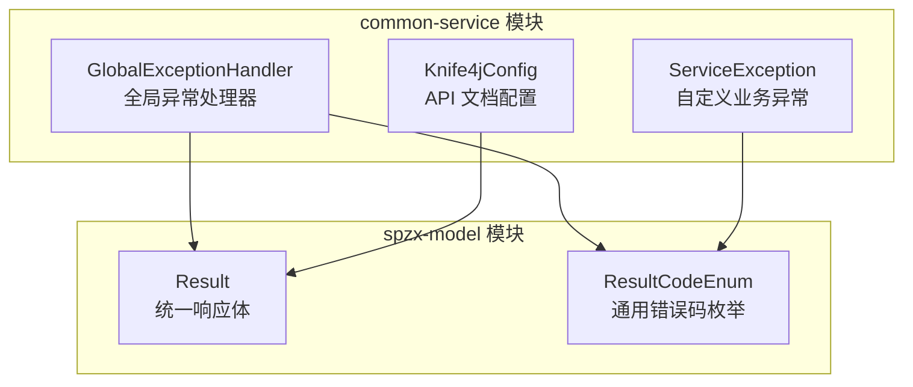
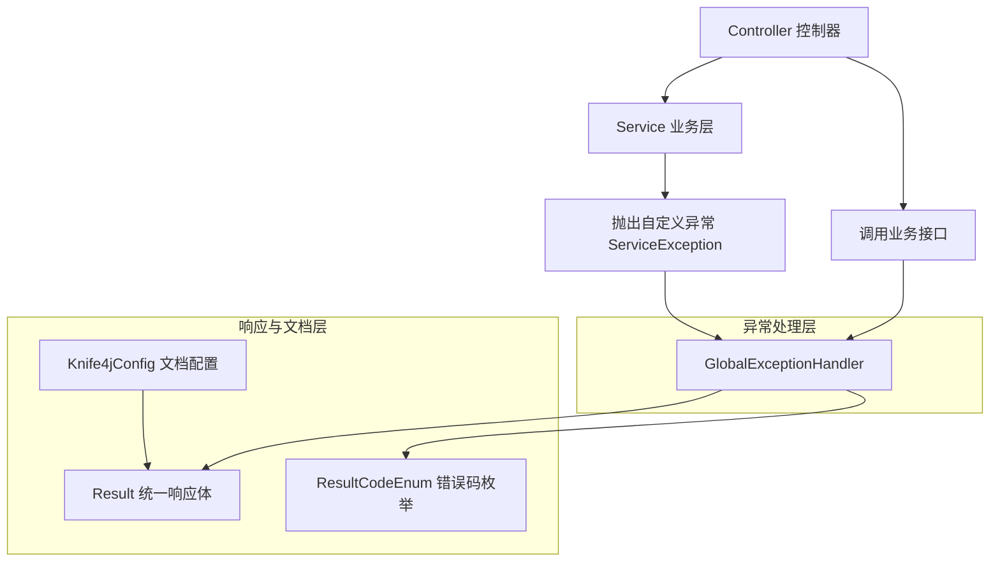
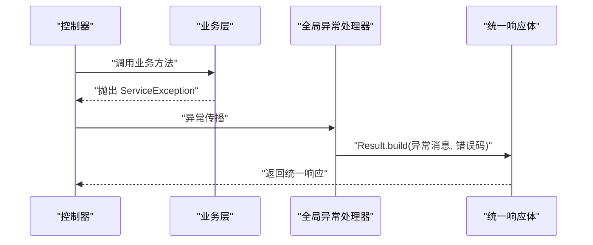
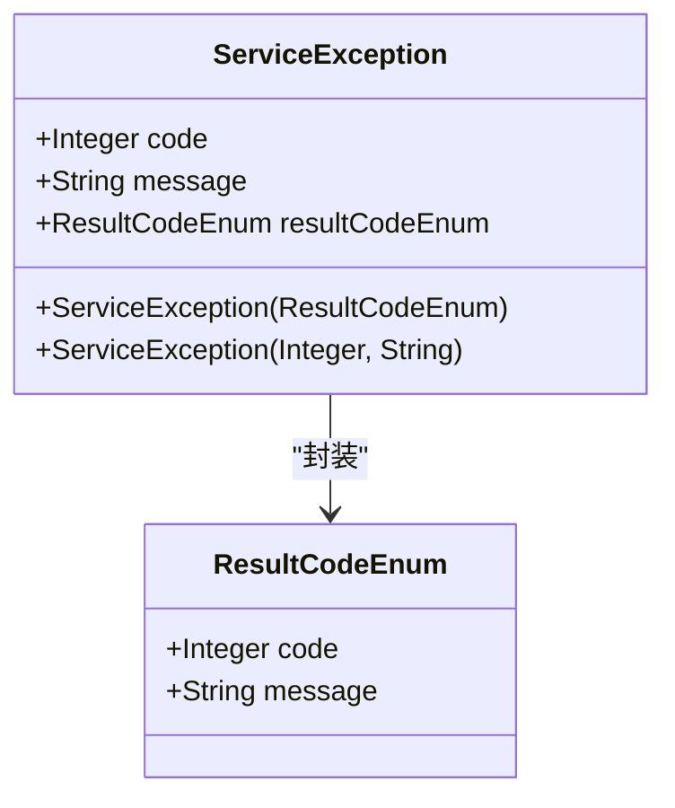
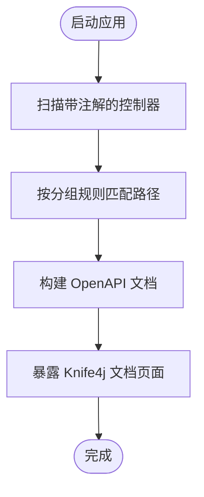
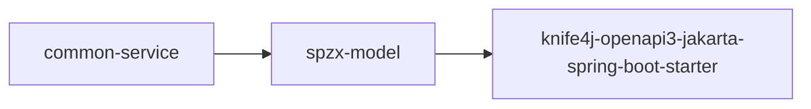

# common-service 服务组件

<cite>
**本文引用的文件**
- [GlobalExceptionHandler.java](file://spzx-common/common-service/src/main/java/com/joker/spzx/common/exception/GlobalExceptionHandler.java)
- [ServiceException.java](file://spzx-common/common-service/src/main/java/com/joker/spzx/common/exception/ServiceException.java)
- [Knife4jConfig.java](file://spzx-common/common-service/src/main/java/com/joker/spzx/common/config/Knife4jConfig.java)
- [Result.java](file://spzx-model/src/main/java/com/joker/spzx/model/vo/common/Result.java)
- [ResultCodeEnum.java](file://spzx-model/src/main/java/com/joker/spzx/model/vo/common/ResultCodeEnum.java)
- [pom.xml（common-service）](file://spzx-common/common-service/pom.xml)
- [pom.xml（spzx-model）](file://spzx-model/pom.xml)
</cite>

## 目录
1. [简介](#简介)
2. [项目结构](#项目结构)
3. [核心组件](#核心组件)
4. [架构总览](#架构总览)
5. [详细组件分析](#详细组件分析)
6. [依赖分析](#依赖分析)
7. [性能考虑](#性能考虑)
8. [故障排查指南](#故障排查指南)
9. [结论](#结论)
10. [附录](#附录)

## 简介
本文件面向 common-service 服务组件，围绕以下目标展开：  
- 全局异常处理器的异常捕获机制、错误响应格式化与异常分类处理策略  
- 自定义业务异常 ServiceException 的设计理念、错误码定义与异常信息传递机制  
- Knife4j API 文档配置的集成方式、增强功能启用与 Swagger/OpenAPI 文档生成配置  
- 异常处理最佳实践、API 文档维护方法与系统监控策略  
- 提供可落地的异常处理示例与配置指南

## 项目结构
common-service 作为公共能力模块，主要提供：
- 全局异常处理：统一拦截运行时异常与自定义业务异常，输出标准化响应
- 自定义业务异常：封装业务错误码与消息，便于上层控制器直接抛出
- API 文档配置：基于 SpringDoc/OpenAPI 与 Knife4j 的分组与元信息配置

图示来源
- [GlobalExceptionHandler.java:1-20](file://spzx-common/common-service/src/main/java/com/joker/spzx/common/exception/GlobalExceptionHandler.java#L1-L20)
- [ServiceException.java:1-26](file://spzx-common/common-service/src/main/java/com/joker/spzx/common/exception/ServiceException.java#L1-L26)
- [Knife4jConfig.java:1-36](file://spzx-common/common-service/src/main/java/com/joker/spzx/common/config/Knife4jConfig.java#L1-L36)
- [Result.java:1-45](file://spzx-model/src/main/java/com/joker/spzx/model/vo/common/Result.java#L1-L45)
- [ResultCodeEnum.java:1-32](file://spzx-model/src/main/java/com/joker/spzx/model/vo/common/ResultCodeEnum.java#L1-L32)

章节来源
- [pom.xml（common-service）:19-47](file://spzx-common/common-service/pom.xml#L19-L47)
- [pom.xml（spzx-model）:27-31](file://spzx-model/pom.xml#L27-L31)

## 核心组件
- 全局异常处理器：对 Exception 与 ServiceException 进行分类处理，统一返回 Result 结构
- 自定义业务异常：支持从 ResultCodeEnum 枚举或自定义 code/message 构造
- API 文档配置：通过 SpringDoc 配置 OpenAPI 元信息与接口分组，结合 Knife4j 增强

章节来源
- [GlobalExceptionHandler.java:7-20](file://spzx-common/common-service/src/main/java/com/joker/spzx/common/exception/GlobalExceptionHandler.java#L7-L20)
- [ServiceException.java:7-26](file://spzx-common/common-service/src/main/java/com/joker/spzx/common/exception/ServiceException.java#L7-L26)
- [Knife4jConfig.java:11-35](file://spzx-common/common-service/src/main/java/com/joker/spzx/common/config/Knife4jConfig.java#L11-L35)

## 架构总览
全局异常处理与 API 文档配置在 common-service 中以最小侵入的方式提供给上层服务模块使用。

图示来源
- [GlobalExceptionHandler.java:9-19](file://spzx-common/common-service/src/main/java/com/joker/spzx/common/exception/GlobalExceptionHandler.java#L9-L19)
- [Result.java:27-42](file://spzx-model/src/main/java/com/joker/spzx/model/vo/common/Result.java#L27-L42)
- [ResultCodeEnum.java:6-31](file://spzx-model/src/main/java/com/joker/spzx/model/vo/common/ResultCodeEnum.java#L6-L31)
- [Knife4jConfig.java:14-34](file://spzx-common/common-service/src/main/java/com/joker/spzx/common/config/Knife4jConfig.java#L14-L34)

## 详细组件分析

### 全局异常处理器（GlobalExceptionHandler）
- 职责
  - 捕获顶层异常并统一返回 Result 结构
  - 对 ServiceException 进行分类处理，读取其错误码与消息，映射到 Result
- 异常捕获机制
  - 使用注解式切面拦截控制器与业务层抛出的异常
  - 对未匹配的异常默认返回固定提示与状态码
  - 对 ServiceException 读取其封装的错误码与消息
- 错误响应格式化
  - 通过 Result.build(...) 构造统一响应体，包含 code、message、data
  - 对 ServiceException 使用 ResultCodeEnum 的 code 与 message
- 异常分类处理策略
  - 顶层异常：固定提示与状态码
  - 自定义业务异常：使用 ServiceException 内部错误码与消息

图示来源
- [GlobalExceptionHandler.java:9-19](file://spzx-common/common-service/src/main/java/com/joker/spzx/common/exception/GlobalExceptionHandler.java#L9-L19)
- [Result.java:27-38](file://spzx-model/src/main/java/com/joker/spzx/model/vo/common/Result.java#L27-L38)
- [ServiceException.java:15-24](file://spzx-common/common-service/src/main/java/com/joker/spzx/common/exception/ServiceException.java#L15-L24)

章节来源
- [GlobalExceptionHandler.java:7-20](file://spzx-common/common-service/src/main/java/com/joker/spzx/common/exception/GlobalExceptionHandler.java#L7-L20)
- [Result.java:8-44](file://spzx-model/src/main/java/com/joker/spzx/model/vo/common/Result.java#L8-L44)
- [ResultCodeEnum.java:6-31](file://spzx-model/src/main/java/com/joker/spzx/model/vo/common/ResultCodeEnum.java#L6-L31)

### 自定义业务异常（ServiceException）
- 设计理念
  - 将业务错误抽象为可序列化的异常对象，便于在各层之间传递
  - 支持两种构造方式：从 ResultCodeEnum 枚举构造；或自定义 code/message
- 错误码定义
  - 通过 ResultCodeEnum 统一管理业务状态码与消息
  - 可扩展枚举项以覆盖新的业务场景
- 异常信息传递机制
  - ServiceException 内部同时持有 code/message 与 ResultCodeEnum
  - 在全局异常处理器中优先使用枚举提供的 code/message

图示来源
- [ServiceException.java:7-26](file://spzx-common/common-service/src/main/java/com/joker/spzx/common/exception/ServiceException.java#L7-L26)
- [ResultCodeEnum.java:6-31](file://spzx-model/src/main/java/com/joker/spzx/model/vo/common/ResultCodeEnum.java#L6-L31)

章节来源
- [ServiceException.java:7-26](file://spzx-common/common-service/src/main/java/com/joker/spzx/common/exception/ServiceException.java#L7-L26)
- [ResultCodeEnum.java:6-31](file://spzx-model/src/main/java/com/joker/spzx/model/vo/common/ResultCodeEnum.java#L6-L31)

### API 文档配置（Knife4jConfig）
- 集成方式
  - 通过 SpringDoc 的 GroupedOpenApi 定义接口分组，按路径匹配生成文档
  - 通过 OpenAPI Bean 配置标题、版本、描述与联系人等元信息
- 增强功能启用
  - 依赖 spzx-model 中的 knife4j-openapi3-jakarta-spring-boot-starter
  - 无需额外注解即可生成 Knife4j 增强界面
- 文档生成配置
  - 分组 group 与路径匹配 pathsToMatch 决定接口可见范围
  - OpenAPI info 决定文档标题、版本与作者信息

图示来源
- [Knife4jConfig.java:14-34](file://spzx-common/common-service/src/main/java/com/joker/spzx/common/config/Knife4jConfig.java#L14-L34)
- [pom.xml（spzx-model）:27-31](file://spzx-model/pom.xml#L27-L31)

章节来源
- [Knife4jConfig.java:11-35](file://spzx-common/common-service/src/main/java/com/joker/spzx/common/config/Knife4jConfig.java#L11-L35)
- [pom.xml（spzx-model）:27-31](file://spzx-model/pom.xml#L27-L31)

## 依赖分析
- common-service 依赖 spzx-model 提供统一响应体与错误码枚举
- spzx-model 依赖 knife4j-openapi3-jakarta-spring-boot-starter 提供 Knife4j 文档增强
- common-service 未直接声明 Knife4j 依赖，但通过 spzx-model 间接获得

图示来源
- [pom.xml（common-service）:21-33](file://spzx-common/common-service/pom.xml#L21-L33)
- [pom.xml（spzx-model）:27-31](file://spzx-model/pom.xml#L27-L31)

章节来源
- [pom.xml（common-service）:19-47](file://spzx-common/common-service/pom.xml#L19-L47)
- [pom.xml（spzx-model）:19-81](file://spzx-model/pom.xml#L19-L81)

## 性能考虑
- 全局异常处理仅做格式化与转发，不引入复杂计算，性能开销极低
- 建议避免在异常处理器中进行耗时操作（如远程调用、大对象序列化），保持轻量
- 对于频繁发生的业务异常，建议在业务层尽早校验并抛出 ServiceException，减少后续处理成本

## 故障排查指南
- 异常未被 ServiceException 捕获
  - 检查是否在业务层正确抛出 ServiceException
  - 确认异常未被上层 catch 消费
- 统一响应未按预期返回
  - 核对 Result.build(...) 的参数与 ResultCodeEnum 的取值
  - 检查全局异常处理器是否被加载（确保类位于可扫描包内）
- 文档未显示或路径不匹配
  - 核对 Knife4jConfig 中的分组名称与路径匹配规则
  - 确认 knife4j 依赖已在依赖树中

章节来源
- [GlobalExceptionHandler.java:9-19](file://spzx-common/common-service/src/main/java/com/joker/spzx/common/exception/GlobalExceptionHandler.java#L9-L19)
- [Knife4jConfig.java:14-20](file://spzx-common/common-service/src/main/java/com/joker/spzx/common/config/Knife4jConfig.java#L14-L20)
- [pom.xml（spzx-model）:27-31](file://spzx-model/pom.xml#L27-L31)

## 结论
common-service 通过全局异常处理器与自定义业务异常，实现了统一的错误处理与响应格式化；通过 Knife4jConfig 提供了清晰的 API 文档分组与元信息配置。二者配合，既保证了系统的可观测性与一致性，也为上层服务提供了即插即用的公共能力。

## 附录

### 异常处理最佳实践
- 在业务层尽早校验输入与前置条件，抛出 ServiceException 以明确失败原因
- 使用 ResultCodeEnum 统一错误码，避免散落的 magic number
- 不在异常处理器中执行阻塞或昂贵操作，保持响应速度
- 对敏感信息进行脱敏，避免异常堆栈泄露

### API 文档维护方法
- 为每个接口添加语义明确的摘要与说明，提升可读性
- 合理划分分组，按模块或权限域组织接口，便于定位
- 定期更新 OpenAPI 元信息，确保标题、版本与描述与实际一致

### 系统监控策略
- 记录 ServiceException 的发生次数与分布，识别高频问题
- 对顶层异常进行告警，快速定位未知错误
- 关注文档访问量与异常率，评估接口健康度

### 示例与配置指南
- 抛出 ServiceException 的示例路径
  - [ServiceException.java:15-24](file://spzx-common/common-service/src/main/java/com/joker/spzx/common/exception/ServiceException.java#L15-L24)
- 全局异常处理示例路径
  - [GlobalExceptionHandler.java:9-19](file://spzx-common/common-service/src/main/java/com/joker/spzx/common/exception/GlobalExceptionHandler.java#L9-L19)
- API 文档配置示例路径
  - [Knife4jConfig.java:14-34](file://spzx-common/common-service/src/main/java/com/joker/spzx/common/config/Knife4jConfig.java#L14-L34)