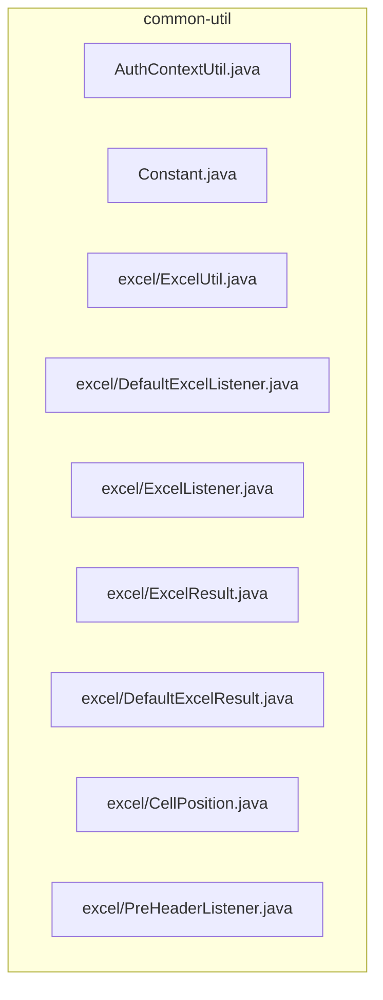
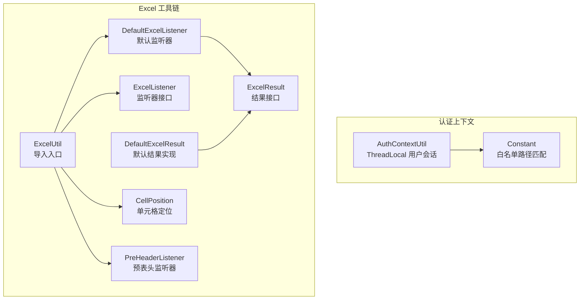
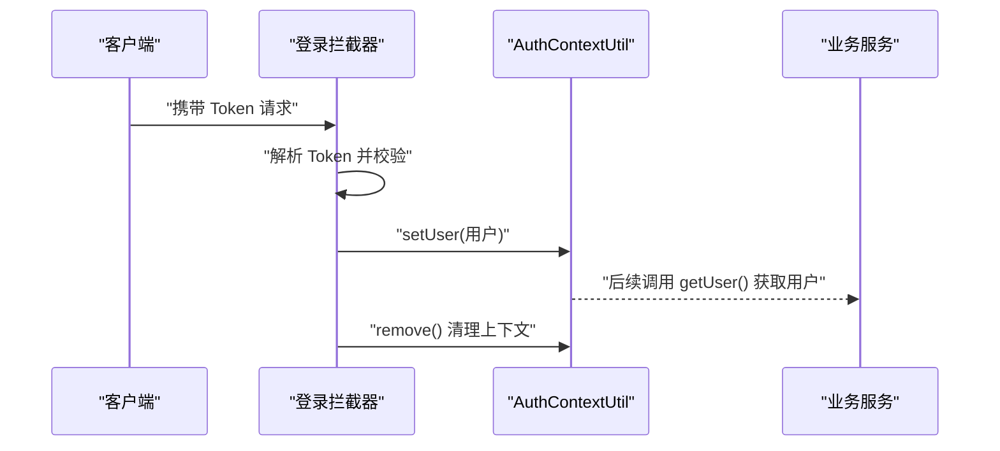
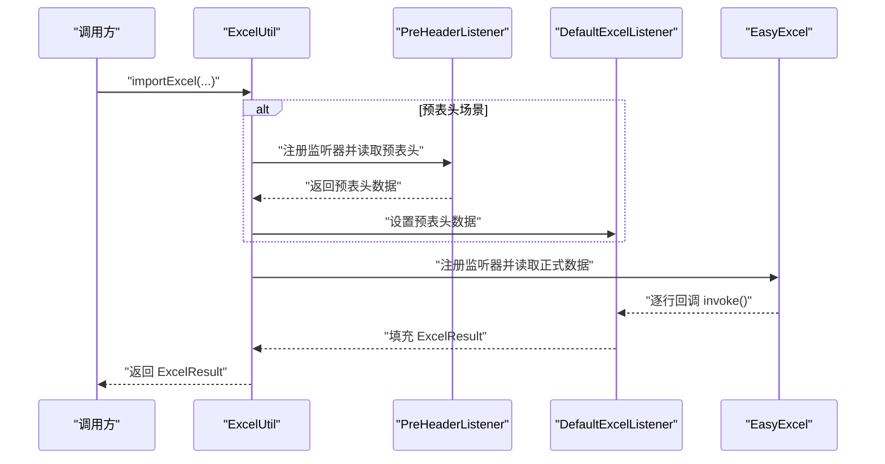
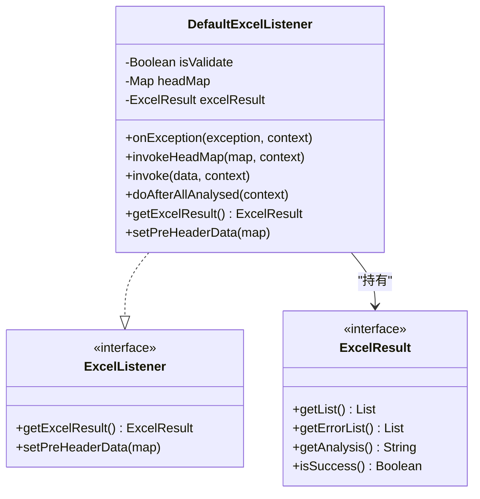
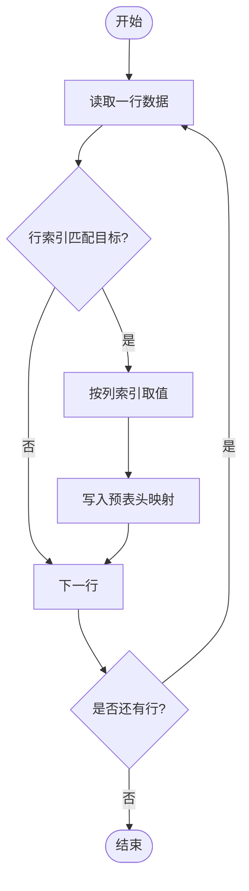
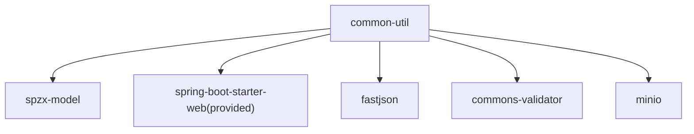

# common-util 工具类库

<cite>
**本文引用的文件**
- [AuthContextUtil.java](file://spzx-common/common-util/src/main/java/com/joker/spzx/utils/AuthContextUtil.java)
- [Constant.java](file://spzx-common/common-util/src/main/java/com/joker/spzx/utils/Constant.java)
- [ExcelUtil.java](file://spzx-common/common-util/src/main/java/com/joker/spzx/utils/excel/ExcelUtil.java)
- [DefaultExcelListener.java](file://spzx-common/common-util/src/main/java/com/joker/spzx/utils/excel/DefaultExcelListener.java)
- [ExcelListener.java](file://spzx-common/common-util/src/main/java/com/joker/spzx/utils/excel/ExcelListener.java)
- [ExcelResult.java](file://spzx-common/common-util/src/main/java/com/joker/spzx/utils/excel/ExcelResult.java)
- [DefaultExcelResult.java](file://spzx-common/common-util/src/main/java/com/joker/spzx/utils/excel/DefaultExcelResult.java)
- [CellPosition.java](file://spzx-common/common-util/src/main/java/com/joker/spzx/utils/excel/CellPosition.java)
- [PreHeaderListener.java](file://spzx-common/common-util/src/main/java/com/joker/spzx/utils/excel/PreHeaderListener.java)
- [pom.xml](file://spzx-common/common-util/pom.xml)
</cite>

## 目录
1. [简介](#简介)
2. [项目结构](#项目结构)
3. [核心组件](#核心组件)
4. [架构总览](#架构总览)
5. [详细组件分析](#详细组件分析)
6. [依赖分析](#依赖分析)
7. [性能考虑](#性能考虑)
8. [故障排查指南](#故障排查指南)
9. [结论](#结论)
10. [附录：使用示例与最佳实践](#附录使用示例与最佳实践)

## 简介
本文件面向 common-util 工具类库，系统性梳理以下能力：
- 认证上下文工具 AuthContextUtil 的用户会话管理、Token 验证与权限获取机制
- Excel 工具链：ExcelUtil 主工具类、DefaultExcelListener 默认监听器、ExcelListener 接口、ExcelResult 结果封装、CellPosition 单元格定位、PreHeaderListener 预头部处理监听器与 DefaultExcelResult 默认结果处理
- 常量定义与工具类使用示例
- 性能优化建议与最佳实践

## 项目结构
common-util 位于 spzx-common/common-util 模块，主要包含两类工具：
- 认证上下文与常量：AuthContextUtil、Constant
- Excel 工具链：ExcelUtil 及其配套的监听器、结果封装、单元格定位与预头部处理

图表来源
- [AuthContextUtil.java:1-21](file://spzx-common/common-util/src/main/java/com/joker/spzx/utils/AuthContextUtil.java#L1-L21)
- [Constant.java:1-40](file://spzx-common/common-util/src/main/java/com/joker/spzx/utils/Constant.java#L1-L40)
- [ExcelUtil.java:1-112](file://spzx-common/common-util/src/main/java/com/joker/spzx/utils/excel/ExcelUtil.java#L1-L112)
- [DefaultExcelListener.java:1-104](file://spzx-common/common-util/src/main/java/com/joker/spzx/utils/excel/DefaultExcelListener.java#L1-L104)
- [ExcelListener.java:1-19](file://spzx-common/common-util/src/main/java/com/joker/spzx/utils/excel/ExcelListener.java#L1-L19)
- [ExcelResult.java:1-25](file://spzx-common/common-util/src/main/java/com/joker/spzx/utils/excel/ExcelResult.java#L1-L25)
- [DefaultExcelResult.java:1-75](file://spzx-common/common-util/src/main/java/com/joker/spzx/utils/excel/DefaultExcelResult.java#L1-L75)
- [CellPosition.java:1-53](file://spzx-common/common-util/src/main/java/com/joker/spzx/utils/excel/CellPosition.java#L1-L53)
- [PreHeaderListener.java:1-87](file://spzx-common/common-util/src/main/java/com/joker/spzx/utils/excel/PreHeaderListener.java#L1-L87)

章节来源
- [pom.xml:1-49](file://spzx-common/common-util/pom.xml#L1-L49)

## 核心组件
- 认证上下文工具：基于 ThreadLocal 的用户会话存储与清理，提供线程安全的用户上下文访问
- 常量工具：内置白名单路径集合与 Ant 风格匹配方法，便于统一鉴权放行策略
- Excel 工具链：围绕 EasyExcel 的导入流程封装，支持同步/异步、校验、预表头读取、自定义监听器与结果封装

章节来源
- [AuthContextUtil.java:1-21](file://spzx-common/common-util/src/main/java/com/joker/spzx/utils/AuthContextUtil.java#L1-L21)
- [Constant.java:1-40](file://spzx-common/common-util/src/main/java/com/joker/spzx/utils/Constant.java#L1-L40)
- [ExcelUtil.java:1-112](file://spzx-common/common-util/src/main/java/com/joker/spzx/utils/excel/ExcelUtil.java#L1-L112)

## 架构总览
common-util 的整体架构围绕“认证上下文 + Excel 工具链”两条主线展开，二者均以工具类形式提供静态方法或简单对象，降低耦合度，便于在业务模块复用。

图表来源
- [AuthContextUtil.java:1-21](file://spzx-common/common-util/src/main/java/com/joker/spzx/utils/AuthContextUtil.java#L1-L21)
- [Constant.java:1-40](file://spzx-common/common-util/src/main/java/com/joker/spzx/utils/Constant.java#L1-L40)
- [ExcelUtil.java:1-112](file://spzx-common/common-util/src/main/java/com/joker/spzx/utils/excel/ExcelUtil.java#L1-L112)
- [DefaultExcelListener.java:1-104](file://spzx-common/common-util/src/main/java/com/joker/spzx/utils/excel/DefaultExcelListener.java#L1-L104)
- [ExcelListener.java:1-19](file://spzx-common/common-util/src/main/java/com/joker/spzx/utils/excel/ExcelListener.java#L1-L19)
- [ExcelResult.java:1-25](file://spzx-common/common-util/src/main/java/com/joker/spzx/utils/excel/ExcelResult.java#L1-L25)
- [DefaultExcelResult.java:1-75](file://spzx-common/common-util/src/main/java/com/joker/spzx/utils/excel/DefaultExcelResult.java#L1-L75)
- [CellPosition.java:1-53](file://spzx-common/common-util/src/main/java/com/joker/spzx/utils/excel/CellPosition.java#L1-L53)
- [PreHeaderListener.java:1-87](file://spzx-common/common-util/src/main/java/com/joker/spzx/utils/excel/PreHeaderListener.java#L1-L87)

## 详细组件分析

### 认证上下文工具 AuthContextUtil
- 设计要点
  - 使用 ThreadLocal 存储当前线程的用户对象，避免跨线程污染
  - 提供设置、获取与移除方法，配合拦截器/过滤器在请求生命周期内维护用户上下文
- Token 验证与权限获取
  - 该工具不直接处理 Token 解析与权限判定，而是作为“上下文容器”，通常由鉴权层（如拦截器）解析 Token 并通过 setUser 写入用户信息；后续业务可通过 getUser 获取用户身份进行权限判断
- 线程安全与内存泄漏防护
  - 在请求结束时调用 remove 清理 ThreadLocal，防止线程池复用导致的内存泄漏

图表来源
- [AuthContextUtil.java:1-21](file://spzx-common/common-util/src/main/java/com/joker/spzx/utils/AuthContextUtil.java#L1-L21)

章节来源
- [AuthContextUtil.java:1-21](file://spzx-common/common-util/src/main/java/com/joker/spzx/utils/AuthContextUtil.java#L1-L21)

### 常量定义 Constant
- 白名单路径集合：内置多条无需鉴权的路径，支持 Ant 风格通配符匹配
- isWhitePath 方法：遍历白名单并使用 AntPathMatcher 进行匹配，返回布尔值
- 应用场景：网关或拦截器可直接调用该方法快速判断是否放行

章节来源
- [Constant.java:1-40](file://spzx-common/common-util/src/main/java/com/joker/spzx/utils/Constant.java#L1-L40)

### Excel 工具链

#### ExcelUtil 主工具类
- 功能概览
  - 同步导入：适用于小数据量，直接返回解析后的对象列表
  - 异步导入 + 校验监听器：通过 DefaultExcelListener 支持数据校验与错误收集
  - 异步导入 + 自定义监听器：允许业务自定义解析逻辑与结果封装
  - 异步导入 + 预表头 + 自定义监听器：先读取指定单元格的预表头数据，再读取正式数据，并将预表头数据注入监听器
- 关键流程
  - 读取输入流字节，必要时复制两次以支持预读取与正式读取
  - 预表头阶段使用 PreHeaderListener 与无模型读取模式
  - 正式读取阶段使用模型映射与监听器回调
  - 返回 ExcelResult，包含数据列表、错误列表与分析摘要

图表来源
- [ExcelUtil.java:1-112](file://spzx-common/common-util/src/main/java/com/joker/spzx/utils/excel/ExcelUtil.java#L1-L112)
- [PreHeaderListener.java:1-87](file://spzx-common/common-util/src/main/java/com/joker/spzx/utils/excel/PreHeaderListener.java#L1-L87)
- [DefaultExcelListener.java:1-104](file://spzx-common/common-util/src/main/java/com/joker/spzx/utils/excel/DefaultExcelListener.java#L1-L104)

章节来源
- [ExcelUtil.java:1-112](file://spzx-common/common-util/src/main/java/com/joker/spzx/utils/excel/ExcelUtil.java#L1-L112)

#### DefaultExcelListener 默认监听器
- 角色：实现 ExcelListener 接口，提供默认的解析、校验与错误收集逻辑
- 核心行为
  - onException：捕获单元格转换异常与 Bean 校验异常，记录行号、列号与表头信息，追加到错误列表并抛出分析异常
  - invoke：可选启用 Bean 校验（注释掉），将每行数据加入结果列表
  - invokeHeadMap：缓存表头映射，便于异常定位
  - getExcelResult：返回封装好的 ExcelResult
  - setPreHeaderData：占位实现（当前未使用）

图表来源
- [DefaultExcelListener.java:1-104](file://spzx-common/common-util/src/main/java/com/joker/spzx/utils/excel/DefaultExcelListener.java#L1-L104)
- [ExcelListener.java:1-19](file://spzx-common/common-util/src/main/java/com/joker/spzx/utils/excel/ExcelListener.java#L1-L19)
- [ExcelResult.java:1-25](file://spzx-common/common-util/src/main/java/com/joker/spzx/utils/excel/ExcelResult.java#L1-L25)

章节来源
- [DefaultExcelListener.java:1-104](file://spzx-common/common-util/src/main/java/com/joker/spzx/utils/excel/DefaultExcelListener.java#L1-L104)
- [ExcelListener.java:1-19](file://spzx-common/common-util/src/main/java/com/joker/spzx/utils/excel/ExcelListener.java#L1-L19)
- [ExcelResult.java:1-25](file://spzx-common/common-util/src/main/java/com/joker/spzx/utils/excel/ExcelResult.java#L1-L25)

#### ExcelListener 接口与 ExcelResult 结果封装
- ExcelListener：扩展 EasyExcel 的 ReadListener，新增 getExcelResult 与 setPreHeaderData 两个方法，便于监听器向工具类返回结果与注入预表头数据
- ExcelResult：定义统一的结果契约，包含数据列表、错误列表、分析摘要与成功状态

章节来源
- [ExcelListener.java:1-19](file://spzx-common/common-util/src/main/java/com/joker/spzx/utils/excel/ExcelListener.java#L1-L19)
- [ExcelResult.java:1-25](file://spzx-common/common-util/src/main/java/com/joker/spzx/utils/excel/ExcelResult.java#L1-L25)

#### DefaultExcelResult 默认结果处理
- 实现 ExcelResult，提供默认的分析摘要与成功状态判断
- 分析摘要规则：无数据则提示失败；全成功则返回成功统计；存在错误则返回空字符串（由上层决定展示策略）

章节来源
- [DefaultExcelResult.java:1-75](file://spzx-common/common-util/src/main/java/com/joker/spzx/utils/excel/DefaultExcelResult.java#L1-L75)

#### CellPosition 单元格定位
- 功能：将行列索引与列字母互转，支持以“行+列字母”的方式声明目标单元格
- 使用场景：与 PreHeaderListener 配合，精准提取预表头数据

章节来源
- [CellPosition.java:1-53](file://spzx-common/common-util/src/main/java/com/joker/spzx/utils/excel/CellPosition.java#L1-L53)

#### PreHeaderListener 预头部处理监听器
- 功能：在无模型读取模式下扫描指定 CellPosition 集合，提取对应单元格值并以“行+列字母”为键保存到预表头数据映射
- 流程：遍历每一行，匹配行索引，若命中则按列索引取值并写入映射；最终由 ExcelUtil 注入到自定义监听器

图表来源
- [PreHeaderListener.java:1-87](file://spzx-common/common-util/src/main/java/com/joker/spzx/utils/excel/PreHeaderListener.java#L1-L87)
- [CellPosition.java:1-53](file://spzx-common/common-util/src/main/java/com/joker/spzx/utils/excel/CellPosition.java#L1-L53)

章节来源
- [PreHeaderListener.java:1-87](file://spzx-common/common-util/src/main/java/com/joker/spzx/utils/excel/PreHeaderListener.java#L1-L87)
- [CellPosition.java:1-53](file://spzx-common/common-util/src/main/java/com/joker/spzx/utils/excel/CellPosition.java#L1-L53)

## 依赖分析
- 模块依赖
  - spzx-model：提供实体与枚举等基础模型
  - spring-boot-starter-web（provided）：提供 Web 相关能力（在运行时由宿主应用提供）
  - fastjson：JSON 序列化/反序列化
  - commons-validator：Bean 校验支持
  - minio：对象存储客户端（可用于 Excel 导出到云端）
- 外部框架
  - EasyExcel：Excel 读写核心
  - Hutool：字符串工具（日志格式化等）
  - Apache Commons：IO 工具与集合工具

图表来源
- [pom.xml:1-49](file://spzx-common/common-util/pom.xml#L1-L49)

章节来源
- [pom.xml:1-49](file://spzx-common/common-util/pom.xml#L1-L49)

## 性能考虑
- 导入策略选择
  - 小数据量：使用同步导入，减少监听器开销
  - 大数据量：使用异步导入，结合监听器分批处理，避免内存峰值
- 预表头读取
  - 仅在需要时启用预表头读取，避免不必要的二次读取
  - 预表头监听器应尽量缩小扫描范围（减少 CellPosition 数量）
- 校验策略
  - 默认监听器保留了校验开关，可根据业务需求开启/关闭，平衡准确性与性能
- 流式处理
  - 使用 EasyExcel 的流式读取，避免一次性加载整表到内存
- 线程安全
  - ExcelUtil 内部对输入流进行字节复制，确保多次读取；注意大文件时的内存占用

[本节为通用指导，不直接分析具体文件]

## 故障排查指南
- 单元格转换异常
  - 现象：解析到具体单元格时抛出转换异常
  - 定位：异常回调中包含行号、列号与表头名称，结合日志快速定位
- Bean 校验异常
  - 现象：数据不符合约束条件
  - 处理：收集约束违反消息，汇总到错误列表
- 预表头读取失败
  - 现象：预表头数据为空
  - 排查：确认 CellPosition 的行列索引与列字母是否正确；检查 headRowNum 与表头行数是否一致
- 监听器未生效
  - 现象：自定义监听器未被调用
  - 排查：确认已正确注册监听器并返回 ExcelResult；检查监听器是否覆盖关键回调

章节来源
- [DefaultExcelListener.java:1-104](file://spzx-common/common-util/src/main/java/com/joker/spzx/utils/excel/DefaultExcelListener.java#L1-L104)
- [ExcelUtil.java:1-112](file://spzx-common/common-util/src/main/java/com/joker/spzx/utils/excel/ExcelUtil.java#L1-L112)

## 结论
common-util 提供了简洁而强大的认证上下文与 Excel 工具链：
- AuthContextUtil 以 ThreadLocal 为核心，配合拦截器实现轻量级用户上下文管理
- Excel 工具链围绕 EasyExcel 构建，支持多种导入模式、灵活的监听器扩展与完善的错误处理
- 建议在生产环境中结合业务规模选择合适的导入策略，并充分利用预表头与监听器扩展能力提升易用性与可维护性

[本节为总结性内容，不直接分析具体文件]

## 附录：使用示例与最佳实践

### 认证上下文使用示例
- 登录拦截器中解析 Token 后设置用户上下文
- 业务层通过 AuthContextUtil.getUser() 获取用户信息
- 请求结束时调用 AuthContextUtil.remove() 清理上下文

章节来源
- [AuthContextUtil.java:1-21](file://spzx-common/common-util/src/main/java/com/joker/spzx/utils/AuthContextUtil.java#L1-L21)

### Excel 工具链使用示例
- 同步导入（小数据量）
  - 调用 ExcelUtil.importExcel(InputStream, Class)
  - 直接获得对象列表
- 异步导入 + 校验监听器
  - 调用 ExcelUtil.importExcel(InputStream, Class, true/false)
  - 通过 ExcelResult 获取数据与错误列表
- 异步导入 + 自定义监听器
  - 实现 ExcelListener 接口，注册到 ExcelUtil.importExcel(...)
  - 在 invoke 中处理业务逻辑，在异常回调中记录错误
- 异步导入 + 预表头 + 自定义监听器
  - 准备 CellPosition 集合，指定目标单元格
  - 调用 ExcelUtil.importExcel(InputStream, Class, targetCells, headRowNum, listener)
  - 在监听器中通过 setPreHeaderData 获取预表头数据

章节来源
- [ExcelUtil.java:1-112](file://spzx-common/common-util/src/main/java/com/joker/spzx/utils/excel/ExcelUtil.java#L1-L112)
- [DefaultExcelListener.java:1-104](file://spzx-common/common-util/src/main/java/com/joker/spzx/utils/excel/DefaultExcelListener.java#L1-L104)
- [ExcelListener.java:1-19](file://spzx-common/common-util/src/main/java/com/joker/spzx/utils/excel/ExcelListener.java#L1-L19)
- [CellPosition.java:1-53](file://spzx-common/common-util/src/main/java/com/joker/spzx/utils/excel/CellPosition.java#L1-L53)
- [PreHeaderListener.java:1-87](file://spzx-common/common-util/src/main/java/com/joker/spzx/utils/excel/PreHeaderListener.java#L1-L87)

### 最佳实践
- 导入策略
  - 小于 1000 行：优先同步导入
  - 大于 10000 行：采用异步导入并分批处理
- 监听器设计
  - 将业务逻辑集中在 invoke，异常集中在 onException 统一处理
  - 保持监听器无状态或最小状态，便于并发安全
- 预表头使用
  - 明确表头行数 headRowNum，避免误读
  - 仅注册必要的 CellPosition，减少扫描成本
- 错误处理
  - 将错误信息与行号、列号绑定，便于前端展示与定位
  - 对于可恢复错误，可在监听器中尝试修复并继续处理

[本节为通用指导，不直接分析具体文件]