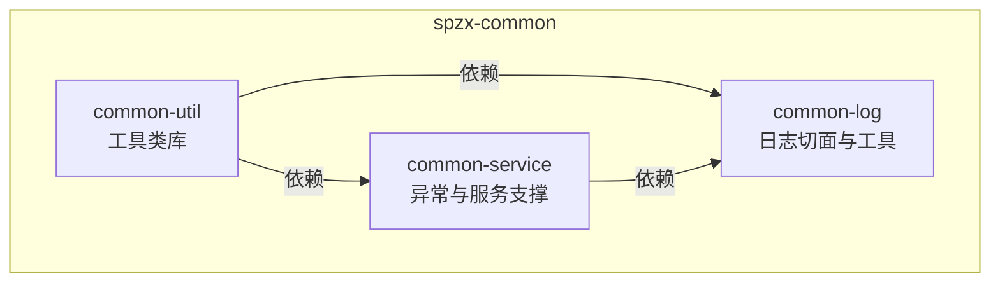
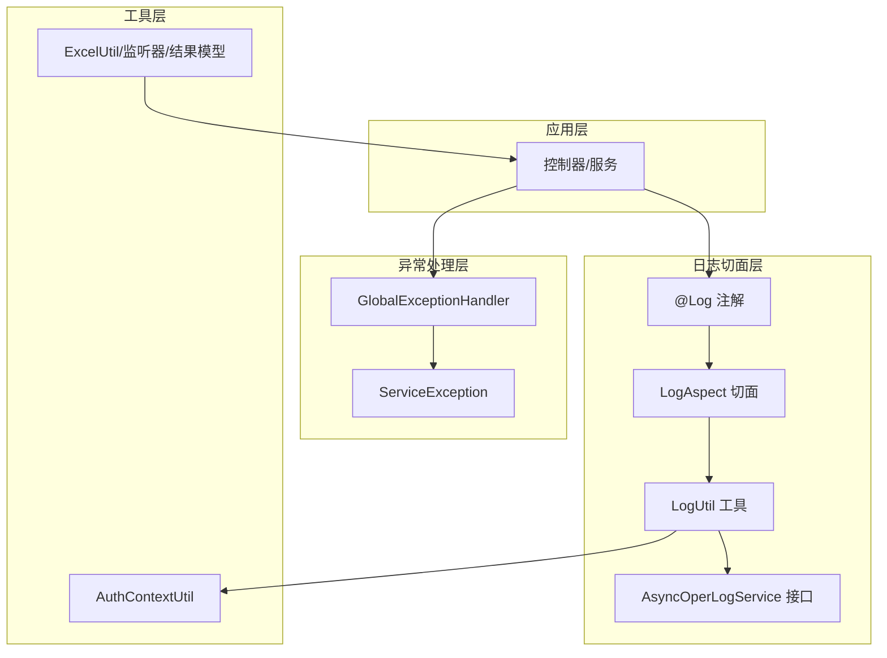
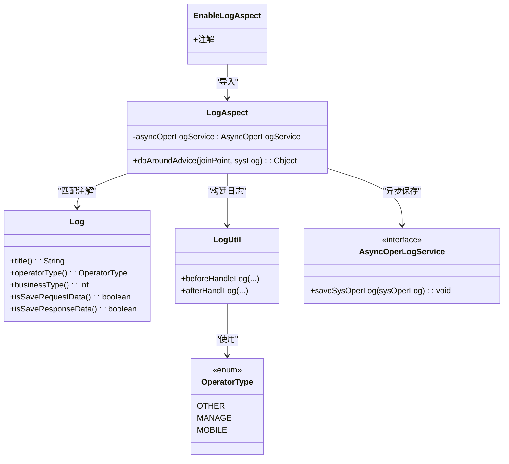
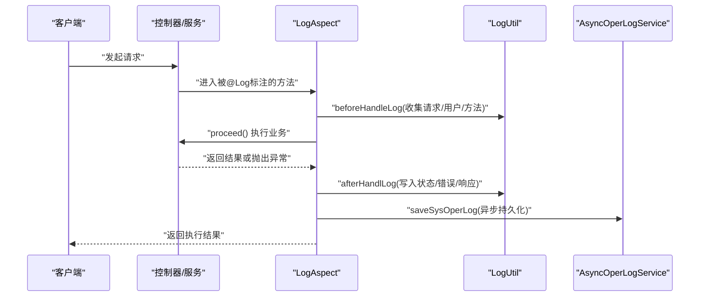
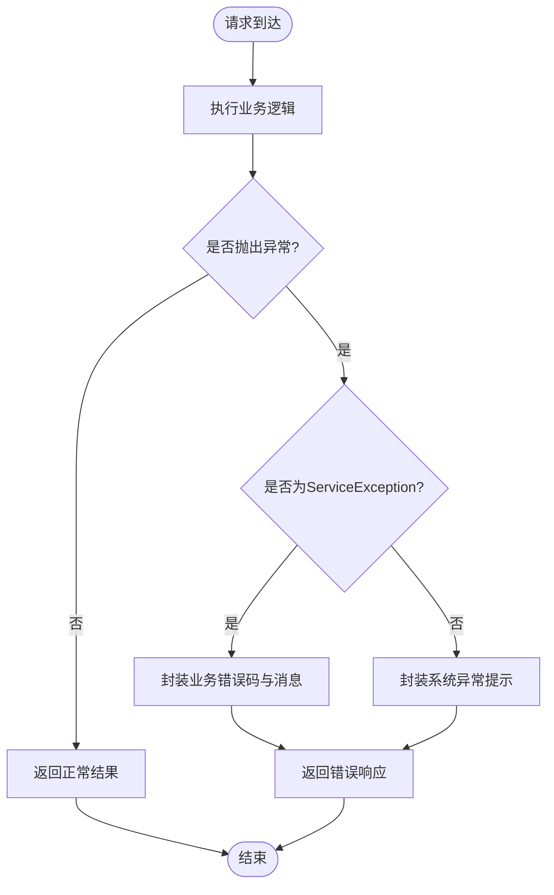
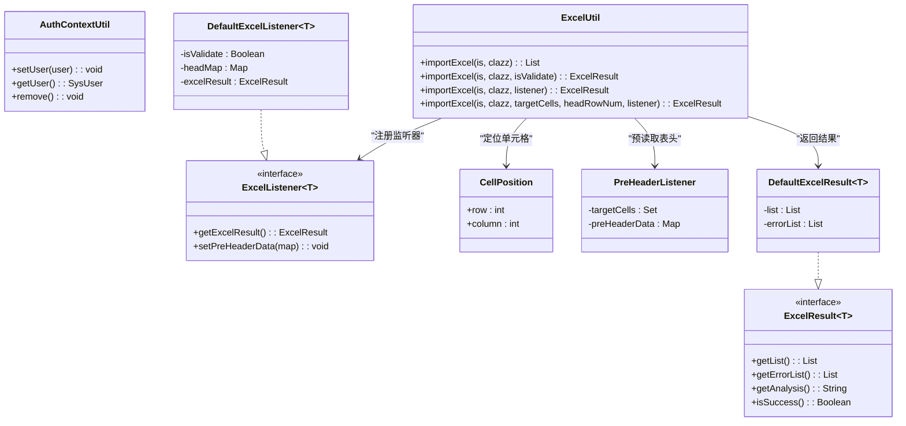
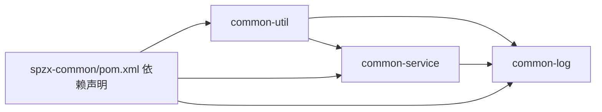

# spzx-common 通用组件模块

<cite>
**本文引用的文件**
- [EnableLogAspect.java](file://spzx-common/common-log/src/main/java/com/joker/spzx/common/annotation/EnableLogAspect.java)
- [Log.java](file://spzx-common/common-log/src/main/java/com/joker/spzx/common/annotation/Log.java)
- [LogAspect.java](file://spzx-common/common-log/src/main/java/com/joker/spzx/common/aspect/LogAspect.java)
- [AsyncOperLogService.java](file://spzx-common/common-log/src/main/java/com/joker/spzx/common/service/AsyncOperLogService.java)
- [LogUtil.java](file://spzx-common/common-log/src/main/java/com/joker/spzx/common/util/LogUtil.java)
- [OperatorType.java](file://spzx-common/common-log/src/main/java/com/joker/spzx/common/enums/OperatorType.java)
- [GlobalExceptionHandler.java](file://spzx-common/common-service/src/main/java/com/joker/spzx/common/exception/GlobalExceptionHandler.java)
- [ServiceException.java](file://spzx-common/common-service/src/main/java/com/joker/spzx/common/exception/ServiceException.java)
- [AuthContextUtil.java](file://spzx-common/common-util/src/main/java/com/joker/spzx/utils/AuthContextUtil.java)
- [ExcelUtil.java](file://spzx-common/common-util/src/main/java/com/joker/spzx/utils/excel/ExcelUtil.java)
- [ExcelListener.java](file://spzx-common/common-util/src/main/java/com/joker/spzx/utils/excel/ExcelListener.java)
- [DefaultExcelListener.java](file://spzx-common/common-util/src/main/java/com/joker/spzx/utils/excel/DefaultExcelListener.java)
- [ExcelResult.java](file://spzx-common/common-util/src/main/java/com/joker/spzx/utils/excel/ExcelResult.java)
- [DefaultExcelResult.java](file://spzx-common/common-util/src/main/java/com/joker/spzx/utils/excel/DefaultExcelResult.java)
- [CellPosition.java](file://spzx-common/common-util/src/main/java/com/joker/spzx/utils/excel/CellPosition.java)
- [PreHeaderListener.java](file://spzx-common/common-util/src/main/java/com/joker/spzx/utils/excel/PreHeaderListener.java)
- [pom.xml](file://spzx-common/pom.xml)
</cite>

## 目录
1. [简介](#简介)
2. [项目结构](#项目结构)
3. [核心组件](#核心组件)
4. [架构总览](#架构总览)
5. [详细组件分析](#详细组件分析)
6. [依赖分析](#依赖分析)
7. [性能考虑](#性能考虑)
8. [故障排除指南](#故障排除指南)
9. [结论](#结论)
10. [附录](#附录)

## 简介
本文件为 spzx-common 通用组件模块的技术文档，覆盖以下关键能力：
- 日志组件：基于 AOP 的环绕切面实现，通过注解驱动自动记录操作日志，并异步落库。
- 异常处理：全局异常捕获与自定义业务异常统一返回格式。
- 工具类库：认证上下文工具与 Excel 导入导出工具集，支持多种读取模式与校验。
- 注解系统：启用日志切面的条件注解与操作日志记录注解。

文档将从设计模式、扩展点、最佳实践、使用示例与故障排除等维度进行系统化阐述，帮助开发者快速理解与正确使用该模块。

## 项目结构
spzx-common 采用多模块聚合结构，分别提供通用工具、服务支撑与日志切面能力：
- common-util：工具类库，包括认证上下文与 Excel 工具。
- common-service：服务支撑，包括全局异常处理与业务异常定义。
- common-log：日志切面与日志实体、枚举、工具与异步服务接口。

图表来源
- [pom.xml:14-18](file://spzx-common/pom.xml#L14-L18)

章节来源
- [pom.xml:1-44](file://spzx-common/pom.xml#L1-L44)

## 核心组件
- 日志切面与注解体系：通过 @EnableLogAspect 启用切面，@Log 注解标记需要记录的方法，LogAspect 实现环绕通知，LogUtil 统一构建日志对象，AsyncOperLogService 异步持久化。
- 全局异常处理：GlobalExceptionHandler 统一拦截异常，ServiceException 提供可携带状态码与消息的业务异常。
- 认证上下文工具：AuthContextUtil 基于 ThreadLocal 维护当前登录用户，贯穿会话生命周期。
- Excel 工具链：ExcelUtil 提供多种导入方式；DefaultExcelListener/ExcelListener/ExcelResult/DefaultExcelResult 定义读取监听与结果模型；CellPosition/PreHeaderListener 支持预表头读取与定位。

章节来源
- [LogAspect.java:17-46](file://spzx-common/common-log/src/main/java/com/joker/spzx/common/aspect/LogAspect.java#L17-L46)
- [Log.java:12-20](file://spzx-common/common-log/src/main/java/com/joker/spzx/common/annotation/Log.java#L12-L20)
- [EnableLogAspect.java:12-16](file://spzx-common/common-log/src/main/java/com/joker/spzx/common/annotation/EnableLogAspect.java#L12-L16)
- [LogUtil.java:19-61](file://spzx-common/common-log/src/main/java/com/joker/spzx/common/util/LogUtil.java#L19-L61)
- [AsyncOperLogService.java:5-8](file://spzx-common/common-log/src/main/java/com/joker/spzx/common/service/AsyncOperLogService.java#L5-L8)
- [GlobalExceptionHandler.java:7-19](file://spzx-common/common-service/src/main/java/com/joker/spzx/common/exception/GlobalExceptionHandler.java#L7-L19)
- [ServiceException.java:7-26](file://spzx-common/common-service/src/main/java/com/joker/spzx/common/exception/ServiceException.java#L7-L26)
- [AuthContextUtil.java:5-20](file://spzx-common/common-util/src/main/java/com/joker/spzx/utils/AuthContextUtil.java#L5-L20)
- [ExcelUtil.java:20-111](file://spzx-common/common-util/src/main/java/com/joker/spzx/utils/excel/ExcelUtil.java#L20-L111)
- [ExcelListener.java:7-17](file://spzx-common/common-util/src/main/java/com/joker/spzx/utils/excel/ExcelListener.java#L7-L17)
- [DefaultExcelListener.java:21-103](file://spzx-common/common-util/src/main/java/com/joker/spzx/utils/excel/DefaultExcelListener.java#L21-L103)
- [ExcelResult.java:5-23](file://spzx-common/common-util/src/main/java/com/joker/spzx/utils/excel/ExcelResult.java#L5-L23)
- [DefaultExcelResult.java:10-74](file://spzx-common/common-util/src/main/java/com/joker/spzx/utils/excel/DefaultExcelResult.java#L10-L74)
- [CellPosition.java:12-51](file://spzx-common/common-util/src/main/java/com/joker/spzx/utils/excel/CellPosition.java#L12-L51)
- [PreHeaderListener.java:19-84](file://spzx-common/common-util/src/main/java/com/joker/spzx/utils/excel/PreHeaderListener.java#L19-L84)

## 架构总览
通用组件围绕“注解 + AOP + 工具 + 异常”四条主线协同工作：
- 注解层：@EnableLogAspect 与 @Log 提供声明式开关与行为描述。
- AOP 层：LogAspect 围绕标注方法执行前后织入日志采集与异常兜底。
- 工具层：LogUtil 统一封装请求上下文、参数与用户信息；ExcelUtil 封装多种读取策略。
- 异常层：GlobalExceptionHandler 统一返回；ServiceException 提供业务态。

图表来源
- [LogAspect.java:17-46](file://spzx-common/common-log/src/main/java/com/joker/spzx/common/aspect/LogAspect.java#L17-L46)
- [LogUtil.java:19-61](file://spzx-common/common-log/src/main/java/com/joker/spzx/common/util/LogUtil.java#L19-L61)
- [AsyncOperLogService.java:5-8](file://spzx-common/common-log/src/main/java/com/joker/spzx/common/service/AsyncOperLogService.java#L5-L8)
- [GlobalExceptionHandler.java:7-19](file://spzx-common/common-service/src/main/java/com/joker/spzx/common/exception/GlobalExceptionHandler.java#L7-L19)
- [ServiceException.java:7-26](file://spzx-common/common-service/src/main/java/com/joker/spzx/common/exception/ServiceException.java#L7-L26)
- [AuthContextUtil.java:5-20](file://spzx-common/common-util/src/main/java/com/joker/spzx/utils/AuthContextUtil.java#L5-L20)
- [ExcelUtil.java:20-111](file://spzx-common/common-util/src/main/java/com/joker/spzx/utils/excel/ExcelUtil.java#L20-L111)

## 详细组件分析

### 日志组件：AOP 切面与注解系统
- @EnableLogAspect：通过 Spring @Import 导入 LogAspect，实现按需启用日志切面。
- @Log：方法级注解，声明标题、操作人类别、业务类型、是否保存请求/响应数据。
- LogAspect：环绕通知，先构建 SysOperLog，再执行目标方法，最后根据结果或异常写入状态与错误信息，并异步保存。
- LogUtil：负责收集请求上下文（URL、IP、方法、参数）、用户信息（来自 AuthContextUtil）与响应结果。
- AsyncOperLogService：异步落库接口，由具体实现类完成持久化。

图表来源
- [EnableLogAspect.java:12-16](file://spzx-common/common-log/src/main/java/com/joker/spzx/common/annotation/EnableLogAspect.java#L12-L16)
- [Log.java:12-20](file://spzx-common/common-log/src/main/java/com/joker/spzx/common/annotation/Log.java#L12-L20)
- [LogAspect.java:17-46](file://spzx-common/common-log/src/main/java/com/joker/spzx/common/aspect/LogAspect.java#L17-L46)
- [LogUtil.java:19-61](file://spzx-common/common-log/src/main/java/com/joker/spzx/common/util/LogUtil.java#L19-L61)
- [AsyncOperLogService.java:5-8](file://spzx-common/common-log/src/main/java/com/joker/spzx/common/service/AsyncOperLogService.java#L5-L8)
- [OperatorType.java:3-7](file://spzx-common/common-log/src/main/java/com/joker/spzx/common/enums/OperatorType.java#L3-L7)

图表来源
- [LogAspect.java:21-42](file://spzx-common/common-log/src/main/java/com/joker/spzx/common/aspect/LogAspect.java#L21-L42)
- [LogUtil.java:19-61](file://spzx-common/common-log/src/main/java/com/joker/spzx/common/util/LogUtil.java#L19-L61)
- [AsyncOperLogService.java:5-8](file://spzx-common/common-log/src/main/java/com/joker/spzx/common/service/AsyncOperLogService.java#L5-L8)

章节来源
- [EnableLogAspect.java:12-16](file://spzx-common/common-log/src/main/java/com/joker/spzx/common/annotation/EnableLogAspect.java#L12-L16)
- [Log.java:10-20](file://spzx-common/common-log/src/main/java/com/joker/spzx/common/annotation/Log.java#L10-L20)
- [LogAspect.java:17-46](file://spzx-common/common-log/src/main/java/com/joker/spzx/common/aspect/LogAspect.java#L17-L46)
- [LogUtil.java:19-61](file://spzx-common/common-log/src/main/java/com/joker/spzx/common/util/LogUtil.java#L19-L61)
- [AsyncOperLogService.java:5-8](file://spzx-common/common-log/src/main/java/com/joker/spzx/common/service/AsyncOperLogService.java#L5-L8)
- [OperatorType.java:3-7](file://spzx-common/common-log/src/main/java/com/joker/spzx/common/enums/OperatorType.java#L3-L7)

### 异常处理机制：全局异常捕获与业务异常
- GlobalExceptionHandler：统一拦截 Exception 与 ServiceException，前者返回固定提示，后者返回自定义状态码与消息。
- ServiceException：支持两种构造方式，既可传入 ResultCodeEnum，也可直接传入 code/message，便于灵活扩展。

图表来源
- [GlobalExceptionHandler.java:7-19](file://spzx-common/common-service/src/main/java/com/joker/spzx/common/exception/GlobalExceptionHandler.java#L7-L19)
- [ServiceException.java:7-26](file://spzx-common/common-service/src/main/java/com/joker/spzx/common/exception/ServiceException.java#L7-L26)

章节来源
- [GlobalExceptionHandler.java:7-19](file://spzx-common/common-service/src/main/java/com/joker/spzx/common/exception/GlobalExceptionHandler.java#L7-L19)
- [ServiceException.java:7-26](file://spzx-common/common-service/src/main/java/com/joker/spzx/common/exception/ServiceException.java#L7-L26)

### 工具类库：认证上下文与 Excel 工具
- 认证上下文工具 AuthContextUtil：基于 ThreadLocal 维护当前用户，提供 set/get/remove，适合在请求线程内传递用户信息。
- Excel 工具链：
  - ExcelUtil：提供同步/异步导入、带/不带校验、指定监听器、预表头读取等多形态读取。
  - DefaultExcelListener/ExcelListener/ExcelResult/DefaultExcelResult：定义监听器接口与默认实现，支持异常收集、校验信息拼接与分析报告。
  - CellPosition/PreHeaderListener：支持行列定位与预表头读取，便于复杂表头场景。

图表来源
- [AuthContextUtil.java:5-20](file://spzx-common/common-util/src/main/java/com/joker/spzx/utils/AuthContextUtil.java#L5-L20)
- [ExcelUtil.java:20-111](file://spzx-common/common-util/src/main/java/com/joker/spzx/utils/excel/ExcelUtil.java#L20-L111)
- [ExcelListener.java:7-17](file://spzx-common/common-util/src/main/java/com/joker/spzx/utils/excel/ExcelListener.java#L7-L17)
- [DefaultExcelListener.java:21-103](file://spzx-common/common-util/src/main/java/com/joker/spzx/utils/excel/DefaultExcelListener.java#L21-L103)
- [ExcelResult.java:5-23](file://spzx-common/common-util/src/main/java/com/joker/spzx/utils/excel/ExcelResult.java#L5-L23)
- [DefaultExcelResult.java:10-74](file://spzx-common/common-util/src/main/java/com/joker/spzx/utils/excel/DefaultExcelResult.java#L10-L74)
- [CellPosition.java:12-51](file://spzx-common/common-util/src/main/java/com/joker/spzx/utils/excel/CellPosition.java#L12-L51)
- [PreHeaderListener.java:19-84](file://spzx-common/common-util/src/main/java/com/joker/spzx/utils/excel/PreHeaderListener.java#L19-L84)

章节来源
- [AuthContextUtil.java:5-20](file://spzx-common/common-util/src/main/java/com/joker/spzx/utils/AuthContextUtil.java#L5-L20)
- [ExcelUtil.java:20-111](file://spzx-common/common-util/src/main/java/com/joker/spzx/utils/excel/ExcelUtil.java#L20-L111)
- [ExcelListener.java:7-17](file://spzx-common/common-util/src/main/java/com/joker/spzx/utils/excel/ExcelListener.java#L7-L17)
- [DefaultExcelListener.java:21-103](file://spzx-common/common-util/src/main/java/com/joker/spzx/utils/excel/DefaultExcelListener.java#L21-L103)
- [ExcelResult.java:5-23](file://spzx-common/common-util/src/main/java/com/joker/spzx/utils/excel/ExcelResult.java#L5-L23)
- [DefaultExcelResult.java:10-74](file://spzx-common/common-util/src/main/java/com/joker/spzx/utils/excel/DefaultExcelResult.java#L10-L74)
- [CellPosition.java:12-51](file://spzx-common/common-util/src/main/java/com/joker/spzx/utils/excel/CellPosition.java#L12-L51)
- [PreHeaderListener.java:19-84](file://spzx-common/common-util/src/main/java/com/joker/spzx/utils/excel/PreHeaderListener.java#L19-L84)

## 依赖分析
- common-log 依赖 common-service（日志切面依赖异常处理与实体），common-util（日志工具依赖认证上下文）。
- common-service 与 common-util 彼此独立，但共同被上层业务模块复用。
- 三方依赖：EasyExcel、Hutool、Guava 在通用模块集中引入，避免重复配置。

图表来源
- [pom.xml:26-43](file://spzx-common/pom.xml#L26-L43)

章节来源
- [pom.xml:26-43](file://spzx-common/pom.xml#L26-L43)

## 性能考虑
- 日志异步化：通过 AsyncOperLogService 异步保存，避免阻塞主业务流程。
- Excel 导入：
  - 大数据量建议使用异步监听器模式，避免内存峰值过高。
  - 预表头读取会增加一次扫描，仅在确有需要时启用。
  - 合理设置 headRowNum 与监听器，减少不必要的字段解析。
- 线程安全：AuthContextUtil 使用 ThreadLocal，确保线程隔离；注意在异步或线程池场景及时清理。

## 故障排除指南
- 日志未记录
  - 检查是否在启动类或配置类上使用了 @EnableLogAspect。
  - 确认目标方法是否标注 @Log。
  - 核对 AsyncOperLogService 实现有无注入与实现。
- 异常未按预期返回
  - 自定义异常请继承 ServiceException 并提供 ResultCodeEnum 或 code/message。
  - 全局异常处理器已拦截 Exception 与 ServiceException，请确认未被更细粒度的异常处理器覆盖。
- Excel 导入报错
  - 单元格类型转换异常：检查数据类型与实体映射，关注监听器 onException 输出。
  - 校验异常：查看约束校验信息，逐条修正。
  - 预表头读取失败：确认 CellPosition 行列索引与目标单元格一致。
- 认证上下文为空
  - 确保在请求入口设置用户信息；在异步任务结束后调用 remove 清理。

章节来源
- [EnableLogAspect.java:12-16](file://spzx-common/common-log/src/main/java/com/joker/spzx/common/annotation/EnableLogAspect.java#L12-L16)
- [Log.java:10-20](file://spzx-common/common-log/src/main/java/com/joker/spzx/common/annotation/Log.java#L10-L20)
- [LogAspect.java:17-46](file://spzx-common/common-log/src/main/java/com/joker/spzx/common/aspect/LogAspect.java#L17-L46)
- [GlobalExceptionHandler.java:7-19](file://spzx-common/common-service/src/main/java/com/joker/spzx/common/exception/GlobalExceptionHandler.java#L7-L19)
- [ServiceException.java:7-26](file://spzx-common/common-service/src/main/java/com/joker/spzx/common/exception/ServiceException.java#L7-L26)
- [ExcelUtil.java:20-111](file://spzx-common/common-util/src/main/java/com/joker/spzx/utils/excel/ExcelUtil.java#L20-L111)
- [DefaultExcelListener.java:50-74](file://spzx-common/common-util/src/main/java/com/joker/spzx/utils/excel/DefaultExcelListener.java#L50-L74)
- [AuthContextUtil.java:5-20](file://spzx-common/common-util/src/main/java/com/joker/spzx/utils/AuthContextUtil.java#L5-L20)

## 结论
spzx-common 通过注解 + AOP + 工具 + 异常的组合，提供了高内聚、低耦合的通用能力：
- 日志切面以最小侵入实现统一记录，异步化保障性能。
- 全局异常处理与业务异常配合，形成清晰的错误语义。
- Excel 工具链覆盖常见导入场景，具备良好的扩展性。
- 认证上下文工具简化会话管理，适合多线程环境。

## 附录
- 使用示例（步骤说明）
  - 启用日志切面：在启动类或配置类上添加 @EnableLogAspect。
  - 标记方法：在需要记录的操作方法上添加 @Log，并设置标题、业务类型等。
  - 自定义异常：在业务异常场景抛出 ServiceException，统一由 GlobalExceptionHandler 处理。
  - Excel 导入：根据数据规模选择同步/异步导入；如需校验与错误汇总，使用 DefaultExcelListener 或自定义监听器。
  - 认证上下文：在登录后设置用户信息，请求结束或异步任务完成后移除。
- 最佳实践
  - 日志：尽量使用 @Log 标注关键业务操作；避免记录敏感字段。
  - 异常：优先使用 ServiceException 传递业务态；避免吞异常。
  - Excel：大文件优先异步监听器；必要时开启预表头读取；对空值与非法值进行显式校验。
  - 认证上下文：在过滤器/拦截器中设置用户；在 finally 中 remove，防止内存泄漏。