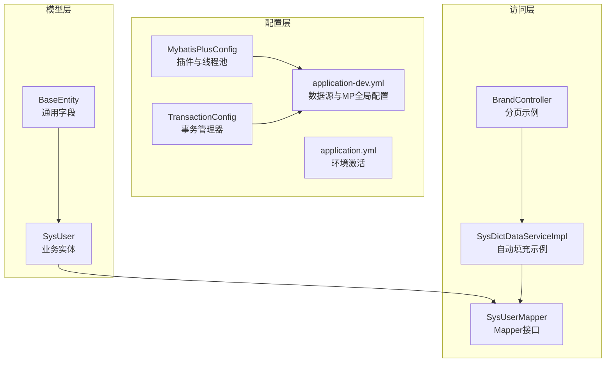
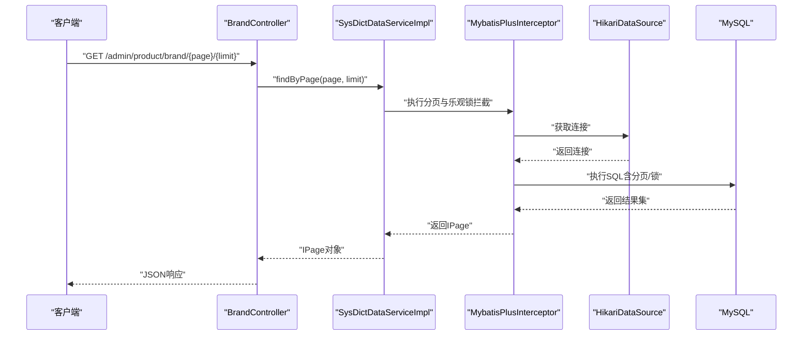
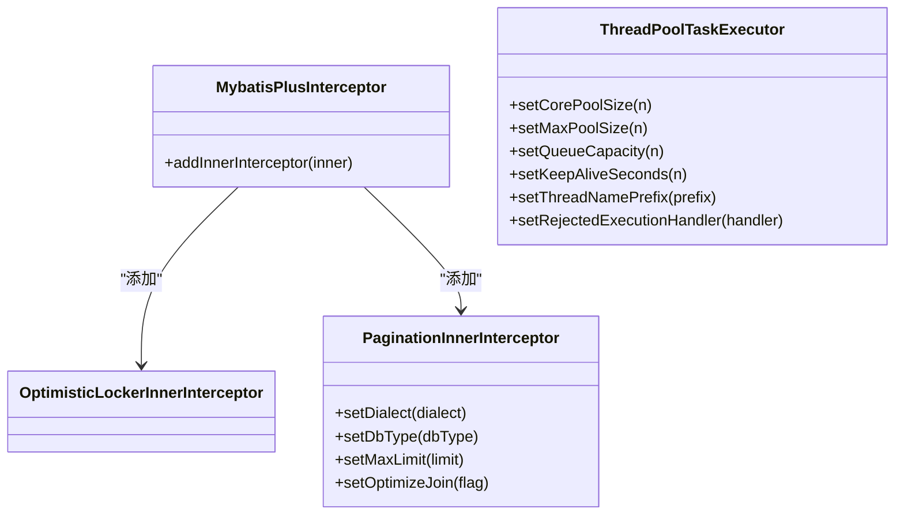
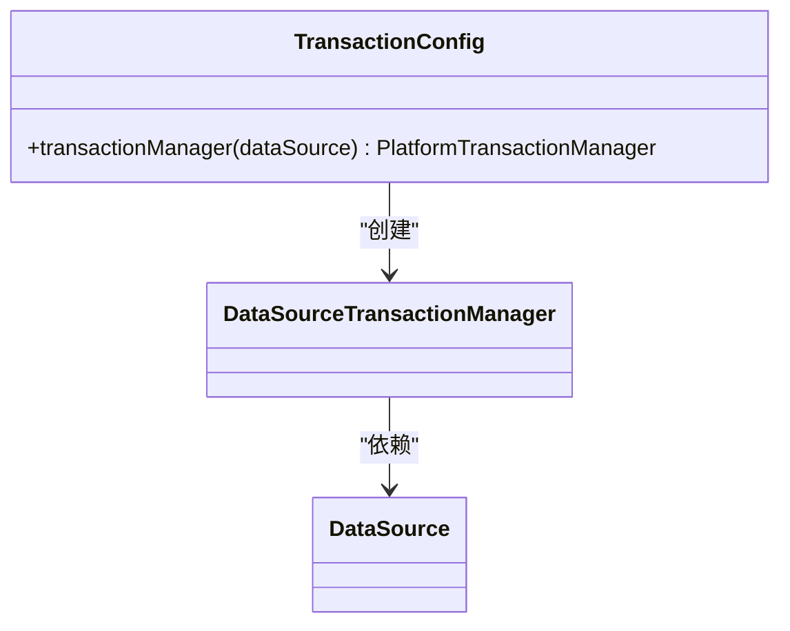
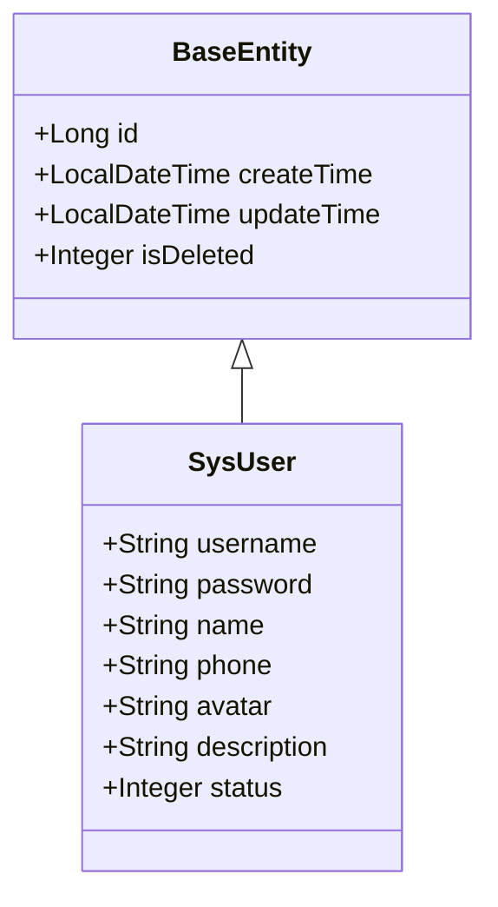
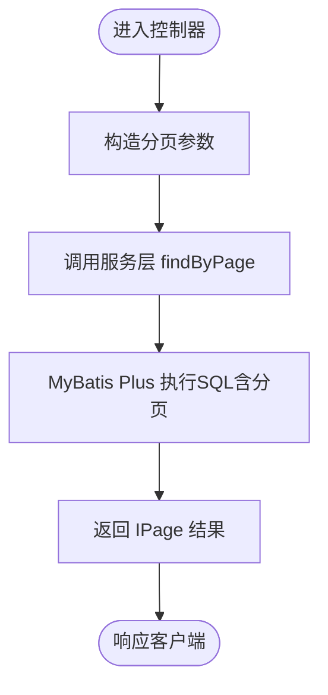
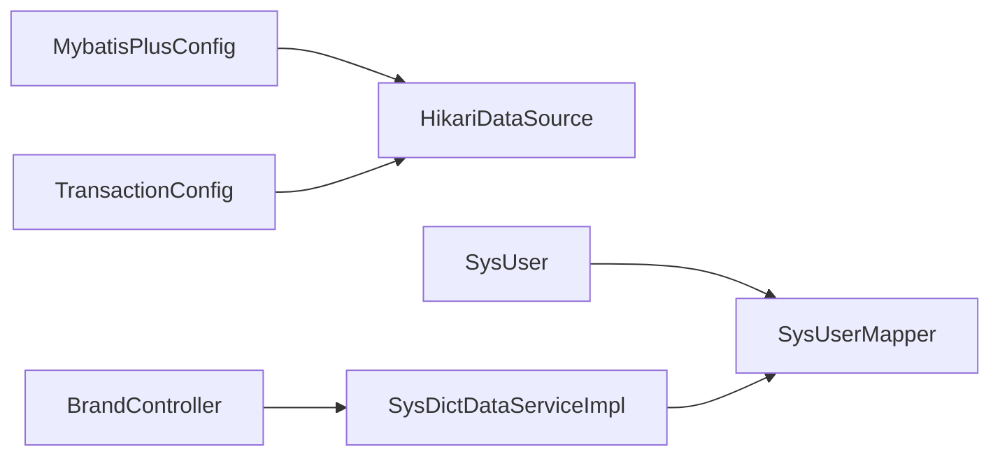

# MyBatis Plus配置

<cite>
**本文引用的文件**
- [MybatisPlusConfig.java](file://spzx-manager/src/main/java/com/joker/spzx/manager/config/MybatisPlusConfig.java)
- [TransactionConfig.java](file://spzx-manager/src/main/java/com/joker/spzx/manager/config/TransactionConfig.java)
- [application-dev.yml](file://spzx-manager/src/main/resources/application-dev.yml)
- [application.yml](file://spzx-manager/src/main/resources/application.yml)
- [BaseEntity.java](file://spzx-model/src/main/java/com/joker/spzx/model/entity/base/BaseEntity.java)
- [SysUser.java](file://spzx-model/src/main/java/com/joker/spzx/model/entity/system/SysUser.java)
- [SysUserMapper.java](file://spzx-manager/src/main/java/com/joker/spzx/manager/mapper/SysUserMapper.java)
- [PageParam.java](file://spzx-model/src/main/java/com/joker/spzx/model/dto/system/PageParam.java)
- [BrandController.java](file://spzx-manager/src/main/java/com/joker/spzx/manager/controller/BrandController.java)
- [SysDictDataServiceImpl.java](file://spzx-manager/src/main/java/com/joker/spzx/manager/service/impl/SysDictDataServiceImpl.java)
- [WebMvcConfiguration.java](file://spzx-manager/src/main/java/com/joker/spzx/manager/config/WebMvcConfiguration.java)
</cite>

## 目录
1. [简介](#简介)
2. [项目结构](#项目结构)
3. [核心组件](#核心组件)
4. [架构总览](#架构总览)
5. [详细组件分析](#详细组件分析)
6. [依赖分析](#依赖分析)
7. [性能考虑](#性能考虑)
8. [故障排查指南](#故障排查指南)
9. [结论](#结论)
10. [附录](#附录)

## 简介
本技术文档围绕 MyBatis Plus 在 spzx-manager 模块中的配置与使用进行系统化梳理，重点覆盖以下方面：
- MyBatis Plus 插件配置：分页插件、乐观锁插件、日志输出与方言设置
- 自动填充机制：基于实体基类的通用字段填充策略
- 事务配置：事务管理器装配与默认传播行为说明
- 主键策略与字段映射：全局 ID 类型、驼峰映射、逻辑删除字段
- 批量与性能优化：连接池参数、SQL 日志、分页限制与连接预热
- 安全与防护：跨域配置、SQL 注入防护要点与建议
- 实战示例：分页查询流程、事务管理最佳实践与数据库性能调优

## 项目结构
spzx-manager 模块中与 MyBatis Plus 相关的关键位置如下：
- 配置类：MyBatis Plus 插件与线程池配置、事务管理器配置
- 数据源与 MyBatis Plus 全局配置：application-dev.yml
- 实体与映射：BaseEntity（通用字段）、具体实体类（如 SysUser）
- 控制器与服务：分页查询示例、事务注解使用
- Web 配置：跨域与拦截器配置

**图表来源**
- [MybatisPlusConfig.java:1-53](file://spzx-manager/src/main/java/com/joker/spzx/manager/config/MybatisPlusConfig.java#L1-53)
- [TransactionConfig.java:1-19](file://spzx-manager/src/main/java/com/joker/spzx/manager/config/TransactionConfig.java#L1-19)
- [application-dev.yml:1-65](file://spzx-manager/src/main/resources/application-dev.yml#L1-65)
- [application.yml:1-5](file://spzx-manager/src/main/resources/application.yml#L1-5)
- [BaseEntity.java:1-34](file://spzx-model/src/main/java/com/joker/spzx/model/entity/base/BaseEntity.java#L1-34)
- [SysUser.java:1-42](file://spzx-model/src/main/java/com/joker/spzx/model/entity/system/SysUser.java#L1-42)
- [SysUserMapper.java:1-19](file://spzx-manager/src/main/java/com/joker/spzx/manager/mapper/SysUserMapper.java#L1-19)
- [BrandController.java:1-46](file://spzx-manager/src/main/java/com/joker/spzx/manager/controller/BrandController.java#L1-46)
- [SysDictDataServiceImpl.java:1-51](file://spzx-manager/src/main/java/com/joker/spzx/manager/service/impl/SysDictDataServiceImpl.java#L1-51)

**章节来源**
- [MybatisPlusConfig.java:1-53](file://spzx-manager/src/main/java/com/joker/spzx/manager/config/MybatisPlusConfig.java#L1-53)
- [TransactionConfig.java:1-19](file://spzx-manager/src/main/java/com/joker/spzx/manager/config/TransactionConfig.java#L1-19)
- [application-dev.yml:1-65](file://spzx-manager/src/main/resources/application-dev.yml#L1-65)
- [application.yml:1-5](file://spzx-manager/src/main/resources/application.yml#L1-5)

## 核心组件
- MyBatis Plus 插件与线程池
  - 乐观锁插件：通过 MyBatis Plus 拦截器实现并发写入保护
  - 分页插件：MySQL 方言、最大记录限制、连接优化
  - 线程池：用于异步任务或批处理场景的线程池配置
- 事务管理器
  - 基于数据源的事务管理器装配，启用注解式事务
- 数据源与 MyBatis Plus 全局配置
  - HikariCP 连接池参数、SQL 日志输出、Mapper XML 路径、全局 ID 类型等

**章节来源**
- [MybatisPlusConfig.java:21-51](file://spzx-manager/src/main/java/com/joker/spzx/manager/config/MybatisPlusConfig.java#L21-L51)
- [TransactionConfig.java:15-18](file://spzx-manager/src/main/java/com/joker/spzx/manager/config/TransactionConfig.java#L15-L18)
- [application-dev.yml:12-65](file://spzx-manager/src/main/resources/application-dev.yml#L12-L65)

## 架构总览
下图展示了从请求到数据库访问的整体链路，以及 MyBatis Plus 插件在其中的作用。

**图表来源**
- [BrandController.java:33-38](file://spzx-manager/src/main/java/com/joker/spzx/manager/controller/BrandController.java#L33-L38)
- [MybatisPlusConfig.java:39-51](file://spzx-manager/src/main/java/com/joker/spzx/manager/config/MybatisPlusConfig.java#L39-L51)
- [application-dev.yml:12-32](file://spzx-manager/src/main/resources/application-dev.yml#L12-L32)

## 详细组件分析

### MyBatis Plus 插件与线程池配置
- 乐观锁插件
  - 通过拦截器在更新时自动带上版本号条件，避免并发覆盖
- 分页插件
  - MySQL 方言与数据库类型设置
  - 最大记录限制与连接优化开关
  - 与 PageParam 协作完成分页
- 线程池
  - 动态根据 CPU 核心数计算核心/最大线程数
  - 队列容量与拒绝策略配置，便于异步批处理

**图表来源**
- [MybatisPlusConfig.java:39-51](file://spzx-manager/src/main/java/com/joker/spzx/manager/config/MybatisPlusConfig.java#L39-L51)

**章节来源**
- [MybatisPlusConfig.java:21-51](file://spzx-manager/src/main/java/com/joker/spzx/manager/config/MybatisPlusConfig.java#L21-L51)

### 事务配置
- 事务管理器装配
  - 基于数据源创建 DataSourceTransactionManager
  - 启用注解式事务管理
- 默认传播行为与回滚规则
  - 默认传播行为：REQUIRED
  - 异常回滚：声明式默认对运行时异常回滚；若需对检查异常回滚，需显式指定 rollbackFor

**图表来源**
- [TransactionConfig.java:15-18](file://spzx-manager/src/main/java/com/joker/spzx/manager/config/TransactionConfig.java#L15-L18)

**章节来源**
- [TransactionConfig.java:11-19](file://spzx-manager/src/main/java/com/joker/spzx/manager/config/TransactionConfig.java#L11-L19)

### 主键策略、字段映射与自动填充
- 主键策略
  - 全局 ID 类型：自增（auto），适用于 MySQL 自增主键
- 字段映射
  - 通用字段：BaseEntity 中定义了 id、create_time、update_time、is_deleted 等
  - 实体字段：SysUser 映射到 sys_user 表，字段通过 @TableField 指定
- 自动填充
  - 服务层在保存/更新时设置创建/更新时间与操作人字段，体现自动填充思想

**图表来源**
- [BaseEntity.java:14-34](file://spzx-model/src/main/java/com/joker/spzx/model/entity/base/BaseEntity.java#L14-L34)
- [SysUser.java:10-42](file://spzx-model/src/main/java/com/joker/spzx/model/entity/system/SysUser.java#L10-L42)

**章节来源**
- [application-dev.yml:53-59](file://spzx-manager/src/main/resources/application-dev.yml#L53-L59)
- [BaseEntity.java:17-32](file://spzx-model/src/main/java/com/joker/spzx/model/entity/base/BaseEntity.java#L17-L32)
- [SysUser.java:10-42](file://spzx-model/src/main/java/com/joker/spzx/model/entity/system/SysUser.java#L10-L42)
- [SysDictDataServiceImpl.java:35-49](file://spzx-manager/src/main/java/com/joker/spzx/manager/service/impl/SysDictDataServiceImpl.java#L35-L49)

### 分页查询流程
- 控制器接收分页参数，构造 IPage 并调用服务
- 服务层使用分页插件与 SQL 片段完成查询
- 返回 IPage 对象给前端

**图表来源**
- [BrandController.java:33-38](file://spzx-manager/src/main/java/com/joker/spzx/manager/controller/BrandController.java#L33-L38)
- [PageParam.java:10-19](file://spzx-model/src/main/java/com/joker/spzx/model/dto/system/PageParam.java#L10-L19)

**章节来源**
- [BrandController.java:33-38](file://spzx-manager/src/main/java/com/joker/spzx/manager/controller/BrandController.java#L33-L38)
- [PageParam.java:10-19](file://spzx-model/src/main/java/com/joker/spzx/model/dto/system/PageParam.java#L10-L19)

### 事务管理最佳实践
- 使用 @Transactional 标注在服务层，确保业务原子性
- 对需要回滚的异常明确指定 rollbackFor
- 将复杂业务拆分为多个小事务，降低锁竞争
- 避免在事务内执行耗时操作（IO、RPC）

**章节来源**
- [SysDictDataServiceImpl.java:22-51](file://spzx-manager/src/main/java/com/joker/spzx/manager/service/impl/SysDictDataServiceImpl.java#L22-L51)
- [TransactionConfig.java:11-19](file://spzx-manager/src/main/java/com/joker/spzx/manager/config/TransactionConfig.java#L11-L19)

### 数据库连接池与性能优化
- HikariCP 参数建议
  - maximum-pool-size：根据并发与数据库承载能力设置
  - minimum-idle：保持空闲连接数，减少频繁创建
  - connection-timeout：连接超时时间，避免长时间等待
  - validation-timeout：连接校验超时
  - leak-detection-threshold：连接泄漏检测阈值
  - cachePrepStmts、prepStmtCacheSize、prepStmtCacheSqlLimit：预编译语句缓存优化
- MyBatis Plus 日志
  - 开启 SQL 日志有助于定位慢查询与异常
- 分页限制
  - 设置合理 maxLimit，防止超大分页导致资源消耗

**章节来源**
- [application-dev.yml:18-32](file://spzx-manager/src/main/resources/application-dev.yml#L18-L32)
- [application-dev.yml:53-60](file://spzx-manager/src/main/resources/application-dev.yml#L53-L60)
- [MybatisPlusConfig.java:44-49](file://spzx-manager/src/main/java/com/joker/spzx/manager/config/MybatisPlusConfig.java#L44-L49)

### 安全与防护
- 跨域配置
  - 放行路径与允许的方法、头、来源可按需调整
- SQL 注入防护
  - 使用 MyBatis Plus 的条件构造器与预编译参数，避免拼接 SQL
  - 后台接口尽量使用 DTO/VO，避免直接暴露实体字段
- 认证与授权
  - 登录拦截器白名单配置，确保敏感接口受控

**章节来源**
- [WebMvcConfiguration.java:19-34](file://spzx-manager/src/main/java/com/joker/spzx/manager/config/WebMvcConfiguration.java#L19-L34)
- [application.yml:4-5](file://spzx-manager/src/main/resources/application.yml#L4-L5)

## 依赖分析
- 组件耦合
  - MyBatis Plus 插件依赖数据源与数据库方言
  - 事务管理器依赖数据源
  - 实体与 Mapper 通过注解建立映射关系
- 外部依赖
  - HikariCP、MySQL 驱动、MyBatis Plus、Spring Transaction

**图表来源**
- [MybatisPlusConfig.java:39-51](file://spzx-manager/src/main/java/com/joker/spzx/manager/config/MybatisPlusConfig.java#L39-L51)
- [TransactionConfig.java:15-18](file://spzx-manager/src/main/java/com/joker/spzx/manager/config/TransactionConfig.java#L15-L18)
- [SysUser.java:10-12](file://spzx-model/src/main/java/com/joker/spzx/model/entity/system/SysUser.java#L10-L12)
- [SysUserMapper.java:15-16](file://spzx-manager/src/main/java/com/joker/spzx/manager/mapper/SysUserMapper.java#L15-L16)
- [BrandController.java:30-38](file://spzx-manager/src/main/java/com/joker/spzx/manager/controller/BrandController.java#L30-L38)
- [SysDictDataServiceImpl.java:22-51](file://spzx-manager/src/main/java/com/joker/spzx/manager/service/impl/SysDictDataServiceImpl.java#L22-L51)

**章节来源**
- [MybatisPlusConfig.java:1-53](file://spzx-manager/src/main/java/com/joker/spzx/manager/config/MybatisPlusConfig.java#L1-53)
- [TransactionConfig.java:1-19](file://spzx-manager/src/main/java/com/joker/spzx/manager/config/TransactionConfig.java#L1-19)
- [SysUser.java:1-42](file://spzx-model/src/main/java/com/joker/spzx/model/entity/system/SysUser.java#L1-42)
- [SysUserMapper.java:1-19](file://spzx-manager/src/main/java/com/joker/spzx/manager/mapper/SysUserMapper.java#L1-19)
- [BrandController.java:1-46](file://spzx-manager/src/main/java/com/joker/spzx/manager/controller/BrandController.java#L1-46)
- [SysDictDataServiceImpl.java:1-51](file://spzx-manager/src/main/java/com/joker/spzx/manager/service/impl/SysDictDataServiceImpl.java#L1-51)

## 性能考虑
- 连接池参数调优
  - 根据 QPS 与 RT 调整 maximum-pool-size 与 connection-timeout
  - 合理设置 validation-timeout 与 idle-timeout
- SQL 优化
  - 使用分页插件限制最大记录数
  - 预编译语句缓存提升重复 SQL 执行效率
- 日志与监控
  - 开启 SQL 日志辅助定位问题
  - 结合数据库慢查询日志与 APM 工具进行综合分析

[本节为通用指导，无需特定文件引用]

## 故障排查指南
- 分页异常
  - 检查分页参数与 maxLimit 设置
  - 确认 PageParam 的 pageNum/pageSize 是否正确传入
- 乐观锁冲突
  - 检查实体是否包含版本字段（如未使用自动填充，需手动维护）
  - 观察更新失败原因，必要时重试或提示用户
- 事务不生效
  - 确认 @Transactional 注解作用范围与可见性
  - 检查异常类型是否触发回滚
- 连接池问题
  - 关注连接泄漏阈值与连接超时
  - 查看连接池日志与数据库连接数

**章节来源**
- [MybatisPlusConfig.java:44-49](file://spzx-manager/src/main/java/com/joker/spzx/manager/config/MybatisPlusConfig.java#L44-L49)
- [application-dev.yml:18-32](file://spzx-manager/src/main/resources/application-dev.yml#L18-L32)
- [SysDictDataServiceImpl.java:35-49](file://spzx-manager/src/main/java/com/joker/spzx/manager/service/impl/SysDictDataServiceImpl.java#L35-L49)

## 结论
本项目在 MyBatis Plus 配置上实现了：
- 分页与乐观锁插件的开箱即用
- 基于 HikariCP 的高性能连接池
- 通过实体基类实现的自动填充策略
- 基于注解的事务管理
配合合理的安全与性能优化策略，能够满足大多数业务场景下的数据访问需求。后续可在自动填充与审计字段层面进一步抽象，以统一治理各实体的创建/更新信息。

[本节为总结性内容，无需特定文件引用]

## 附录
- 关键配置项速览
  - 数据源：HikariCP、驱动、URL、账号密码
  - MyBatis Plus：Mapper XML 路径、全局 ID 类型、SQL 日志
  - 环境：dev 环境激活
- 参考路径
  - [application-dev.yml:12-65](file://spzx-manager/src/main/resources/application-dev.yml#L12-L65)
  - [application.yml:1-5](file://spzx-manager/src/main/resources/application.yml#L1-L5)
  - [MybatisPlusConfig.java:39-51](file://spzx-manager/src/main/java/com/joker/spzx/manager/config/MybatisPlusConfig.java#L39-L51)
  - [TransactionConfig.java:15-18](file://spzx-manager/src/main/java/com/joker/spzx/manager/config/TransactionConfig.java#L15-L18)

[本节为参考汇总，无需特定文件引用]