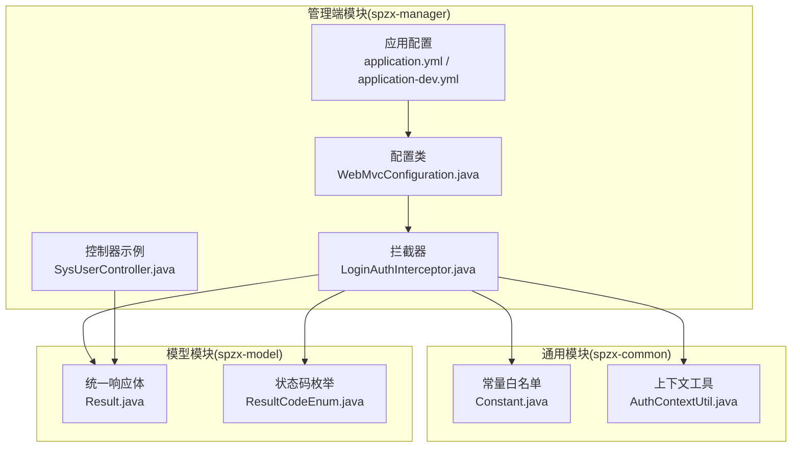
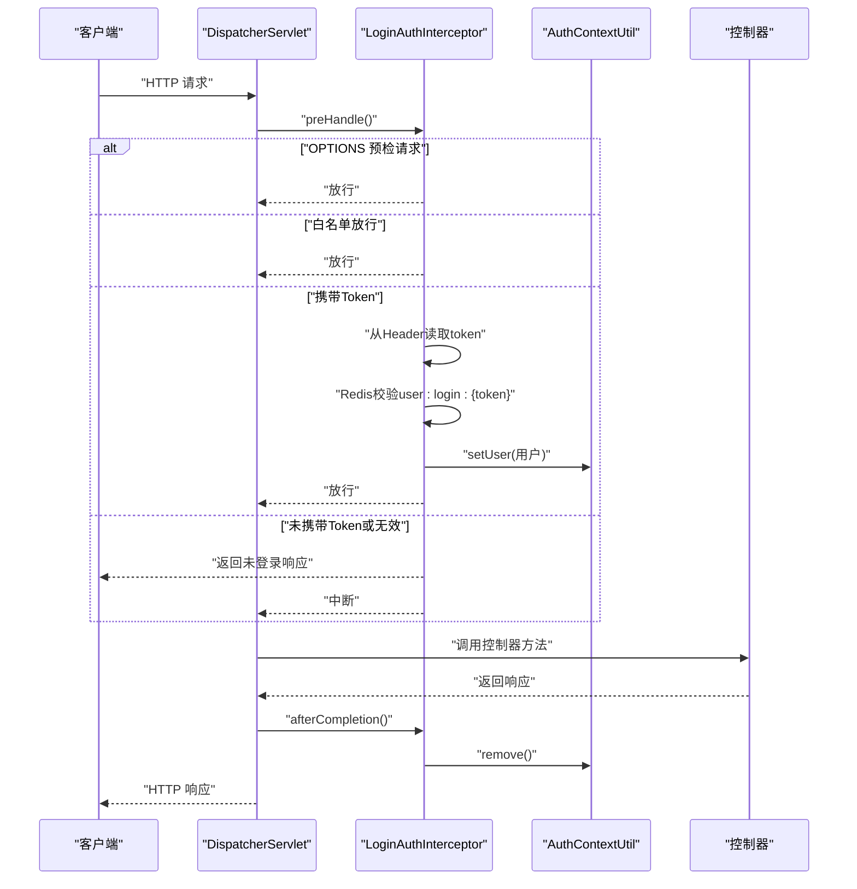
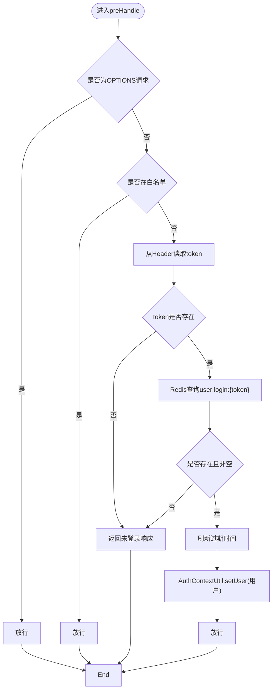
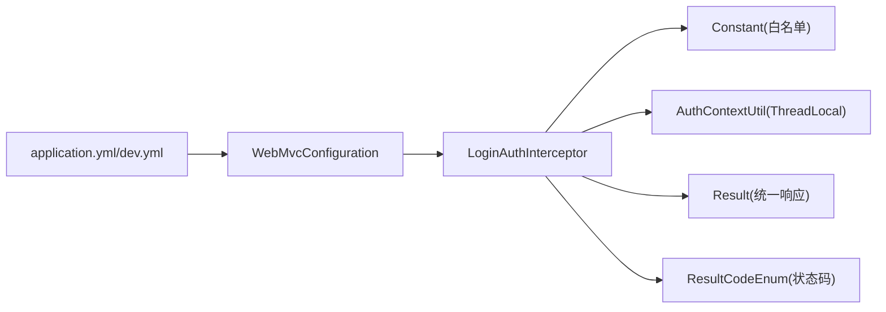

# Web MVC配置

<cite>
**本文引用的文件**
- [WebMvcConfiguration.java](file://spzx-manager/src/main/java/com/joker/spzx/manager/config/WebMvcConfiguration.java)
- [LoginAuthInterceptor.java](file://spzx-manager/src/main/java/com/joker/spzx/manager/config/LoginAuthInterceptor.java)
- [Constant.java](file://spzx-common/common-util/src/main/java/com/joker/spzx/utils/Constant.java)
- [AuthContextUtil.java](file://spzx-common/common-util/src/main/java/com/joker/spzx/utils/AuthContextUtil.java)
- [application.yml](file://spzx-manager/src/main/resources/application.yml)
- [application-dev.yml](file://spzx-manager/src/main/resources/application-dev.yml)
- [SysUserController.java](file://spzx-manager/src/main/java/com/joker/spzx/manager/controller/SysUserController.java)
- [Result.java](file://spzx-model/src/main/java/com/joker/spzx/model/vo/common/Result.java)
- [ResultCodeEnum.java](file://spzx-model/src/main/java/com/joker/spzx/model/vo/common/ResultCodeEnum.java)
- [SysUserServiceImpl.java](file://spzx-manager/src/main/java/com/joker/spzx/manager/service/impl/SysUserServiceImpl.java)
</cite>

## 目录
1. [简介](#简介)
2. [项目结构](#项目结构)
3. [核心组件](#核心组件)
4. [架构总览](#架构总览)
5. [详细组件分析](#详细组件分析)
6. [依赖分析](#依赖分析)
7. [性能考虑](#性能考虑)
8. [故障排查指南](#故障排查指南)
9. [结论](#结论)
10. [附录](#附录)

## 简介
本技术文档围绕Web MVC配置展开，重点解析以下内容：
- WebMvcConfiguration类的配置方法：拦截器注册、跨域配置等。
- 登录认证拦截器LoginAuthInterceptor的实现原理：拦截规则、Token验证流程、权限检查机制与异常处理策略。
- 拦截器链的执行顺序、预处理与后处理逻辑。
- 拦截器配置示例、自定义拦截器开发指南与常见拦截问题的解决方案。
- RESTful API开发规范与前端交互注意事项。

## 项目结构
本项目采用多模块结构，Web MVC相关的关键代码集中在管理端模块（spzx-manager）以及通用工具与模型模块（spzx-common、spzx-model）。Web层配置主要位于管理端的config包内，拦截器与白名单常量分别由拦截器与通用工具模块提供。

图表来源
- [WebMvcConfiguration.java:14-38](file://spzx-manager/src/main/java/com/joker/spzx/manager/config/WebMvcConfiguration.java#L14-L38)
- [LoginAuthInterceptor.java:23-80](file://spzx-manager/src/main/java/com/joker/spzx/manager/config/LoginAuthInterceptor.java#L23-L80)
- [Constant.java:7-26](file://spzx-common/common-util/src/main/java/com/joker/spzx/utils/Constant.java#L7-L26)
- [AuthContextUtil.java:5-20](file://spzx-common/common-util/src/main/java/com/joker/spzx/utils/AuthContextUtil.java#L5-L20)
- [application.yml:1-5](file://spzx-manager/src/main/resources/application.yml#L1-L5)
- [application-dev.yml:39-46](file://spzx-manager/src/main/resources/application-dev.yml#L39-L46)
- [SysUserController.java:22-69](file://spzx-manager/src/main/java/com/joker/spzx/manager/controller/SysUserController.java#L22-L69)
- [Result.java:8-44](file://spzx-model/src/main/java/com/joker/spzx/model/vo/common/Result.java#L8-L44)
- [ResultCodeEnum.java:6-31](file://spzx-model/src/main/java/com/joker/spzx/model/vo/common/ResultCodeEnum.java#L6-L31)

章节来源
- [WebMvcConfiguration.java:14-38](file://spzx-manager/src/main/java/com/joker/spzx/manager/config/WebMvcConfiguration.java#L14-L38)
- [application.yml:1-5](file://spzx-manager/src/main/resources/application.yml#L1-L5)
- [application-dev.yml:39-46](file://spzx-manager/src/main/resources/application-dev.yml#L39-L46)

## 核心组件
- WebMvcConfiguration：实现WebMvcConfigurer，负责注册拦截器与配置跨域策略。
- LoginAuthInterceptor：实现HandlerInterceptor，完成登录态校验、白名单放行、Token从请求头提取、Redis会话校验、上下文注入与清理。
- Constant：维护白名单URL集合，用于放行无需登录即可访问的资源或接口。
- AuthContextUtil：基于ThreadLocal的用户上下文工具，便于在请求处理链中获取当前登录用户。
- 应用配置：application.yml与application-dev.yml提供基础运行参数，如端口、Redis、日期格式等。

章节来源
- [WebMvcConfiguration.java:14-38](file://spzx-manager/src/main/java/com/joker/spzx/manager/config/WebMvcConfiguration.java#L14-L38)
- [LoginAuthInterceptor.java:23-80](file://spzx-manager/src/main/java/com/joker/spzx/manager/config/LoginAuthInterceptor.java#L23-L80)
- [Constant.java:7-26](file://spzx-common/common-util/src/main/java/com/joker/spzx/utils/Constant.java#L7-L26)
- [AuthContextUtil.java:5-20](file://spzx-common/common-util/src/main/java/com/joker/spzx/utils/AuthContextUtil.java#L5-L20)
- [application.yml:1-5](file://spzx-manager/src/main/resources/application.yml#L1-L5)
- [application-dev.yml:39-46](file://spzx-manager/src/main/resources/application-dev.yml#L39-L46)

## 架构总览
Web请求在进入控制器之前，先经过拦截器链。LoginAuthInterceptor负责对除白名单外的所有请求进行登录态校验；通过后，将当前用户写入上下文，供后续业务处理使用；请求结束后，清理上下文，避免线程复用导致的数据泄漏。

图表来源
- [LoginAuthInterceptor.java:29-79](file://spzx-manager/src/main/java/com/joker/spzx/manager/config/LoginAuthInterceptor.java#L29-L79)
- [AuthContextUtil.java:9-19](file://spzx-common/common-util/src/main/java/com/joker/spzx/utils/AuthContextUtil.java#L9-L19)

## 详细组件分析

### WebMvcConfiguration配置类
- 拦截器注册
  - 注册LoginAuthInterceptor，并对所有路径“/**”生效。
  - 排除白名单路径，避免对登录、验证码、静态资源等接口进行拦截。
- 跨域配置
  - 允许凭据（Cookie）、通配符源、通配符方法与通配符头。
  - 显式允许本地前端地址作为来源之一，便于开发联调。

章节来源
- [WebMvcConfiguration.java:19-35](file://spzx-manager/src/main/java/com/joker/spzx/manager/config/WebMvcConfiguration.java#L19-L35)
- [Constant.java:9-25](file://spzx-common/common-util/src/main/java/com/joker/spzx/utils/Constant.java#L9-L25)

### LoginAuthInterceptor拦截器
- 拦截规则
  - 放行OPTIONS预检请求。
  - 放行白名单中的URI。
  - 其余请求均需携带有效的token。
- Token验证流程
  - 从请求头提取token。
  - 在Redis中以“user:login:{token}”键名读取用户信息。
  - 若不存在或为空，则返回未登录状态给前端。
  - 成功后刷新token过期时间（保持会话活跃）。
- 权限检查机制
  - 当前实现仅做登录态校验，未包含业务权限校验。
  - 可扩展点：在拦截器中增加角色/菜单/资源级权限判断。
- 异常处理策略
  - 未登录时返回统一响应体（包含状态码与提示），字符集与类型设置为UTF-8与HTML文本。
- 上下文注入与清理
  - 通过AuthContextUtil将当前用户写入ThreadLocal，在请求结束时清理，防止内存泄漏。

图表来源
- [LoginAuthInterceptor.java:29-58](file://spzx-manager/src/main/java/com/joker/spzx/manager/config/LoginAuthInterceptor.java#L29-L58)
- [AuthContextUtil.java:9-19](file://spzx-common/common-util/src/main/java/com/joker/spzx/utils/AuthContextUtil.java#L9-L19)

章节来源
- [LoginAuthInterceptor.java:29-79](file://spzx-manager/src/main/java/com/joker/spzx/manager/config/LoginAuthInterceptor.java#L29-L79)
- [Result.java:27-38](file://spzx-model/src/main/java/com/joker/spzx/model/vo/common/Result.java#L27-L38)
- [ResultCodeEnum.java:10-11](file://spzx-model/src/main/java/com/joker/spzx/model/vo/common/ResultCodeEnum.java#L10-L11)

### 拦截器链执行顺序与生命周期
- 执行顺序
  - 多个拦截器按注册顺序依次执行，preHandle按顺序执行，afterCompletion按相反顺序执行。
- 生命周期
  - 预处理：preHandle返回true继续，false中断。
  - 后处理：afterCompletion在视图渲染完成后执行，用于清理上下文。

章节来源
- [LoginAuthInterceptor.java:76-79](file://spzx-manager/src/main/java/com/joker/spzx/manager/config/LoginAuthInterceptor.java#L76-L79)

### 自定义拦截器开发指南
- 实现HandlerInterceptor接口，覆盖preHandle与afterCompletion。
- 在WebMvcConfiguration中注册拦截器并设置路径匹配与排除规则。
- 使用ThreadLocal或上下文工具在请求间传递用户信息。
- 统一异常输出使用Result与ResultCodeEnum，确保前后端一致的响应格式。

章节来源
- [WebMvcConfiguration.java:19-25](file://spzx-manager/src/main/java/com/joker/spzx/manager/config/WebMvcConfiguration.java#L19-L25)
- [AuthContextUtil.java:9-19](file://spzx-common/common-util/src/main/java/com/joker/spzx/utils/AuthContextUtil.java#L9-L19)
- [Result.java:27-38](file://spzx-model/src/main/java/com/joker/spzx/model/vo/common/Result.java#L27-L38)
- [ResultCodeEnum.java:6-31](file://spzx-model/src/main/java/com/joker/spzx/model/vo/common/ResultCodeEnum.java#L6-L31)

### RESTful API开发规范与前端交互注意事项
- 控制器命名与路径
  - 使用语义化路径与HTTP动词，如“/admin/system/sysUser”。
  - 分页查询建议使用路径变量或查询参数，避免超长请求体。
- 统一响应体
  - 使用Result封装响应，包含状态码、消息与数据。
  - 使用ResultCodeEnum定义业务状态码，保证一致性。
- 前端交互
  - 登录成功后保存token，后续请求在Header中携带“token”字段。
  - 跨域时注意Cookie传递（允许凭据），确保域名与端口一致。
- 安全与健壮性
  - 对敏感接口进行登录拦截。
  - 对上传文件大小、请求体大小进行限制（已在应用配置中设置）。
  - 对Redis键命名规范，避免冲突与泄露。

章节来源
- [SysUserController.java:22-69](file://spzx-manager/src/main/java/com/joker/spzx/manager/controller/SysUserController.java#L22-L69)
- [Result.java:8-44](file://spzx-model/src/main/java/com/joker/spzx/model/vo/common/Result.java#L8-L44)
- [ResultCodeEnum.java:6-31](file://spzx-model/src/main/java/com/joker/spzx/model/vo/common/ResultCodeEnum.java#L6-L31)
- [application-dev.yml:8-11](file://spzx-manager/src/main/resources/application-dev.yml#L8-L11)

## 依赖分析
- WebMvcConfiguration依赖LoginAuthInterceptor与Constant白名单。
- LoginAuthInterceptor依赖RedisTemplate、AuthContextUtil、Result与ResultCodeEnum。
- 应用配置提供Redis与MVC相关参数，影响拦截器与控制器行为。

图表来源
- [WebMvcConfiguration.java:16-17](file://spzx-manager/src/main/java/com/joker/spzx/manager/config/WebMvcConfiguration.java#L16-L17)
- [LoginAuthInterceptor.java:26-27](file://spzx-manager/src/main/java/com/joker/spzx/manager/config/LoginAuthInterceptor.java#L26-L27)
- [Constant.java:9-25](file://spzx-common/common-util/src/main/java/com/joker/spzx/utils/Constant.java#L9-L25)
- [AuthContextUtil.java:7](file://spzx-common/common-util/src/main/java/com/joker/spzx/utils/AuthContextUtil.java#L7)
- [Result.java:27-38](file://spzx-model/src/main/java/com/joker/spzx/model/vo/common/Result.java#L27-L38)
- [ResultCodeEnum.java:10-11](file://spzx-model/src/main/java/com/joker/spzx/model/vo/common/ResultCodeEnum.java#L10-L11)
- [application.yml:1-5](file://spzx-manager/src/main/resources/application.yml#L1-L5)
- [application-dev.yml:39-46](file://spzx-manager/src/main/resources/application-dev.yml#L39-L46)

章节来源
- [WebMvcConfiguration.java:16-17](file://spzx-manager/src/main/java/com/joker/spzx/manager/config/WebMvcConfiguration.java#L16-L17)
- [LoginAuthInterceptor.java:26-27](file://spzx-manager/src/main/java/com/joker/spzx/manager/config/LoginAuthInterceptor.java#L26-L27)
- [application.yml:1-5](file://spzx-manager/src/main/resources/application.yml#L1-L5)
- [application-dev.yml:39-46](file://spzx-manager/src/main/resources/application-dev.yml#L39-L46)

## 性能考虑
- Redis会话缓存
  - 使用Redis存储登录态，避免Session膨胀与集群共享问题。
  - 刷新过期时间可提升用户体验，但需关注热点key的并发更新。
- 拦截器开销
  - 每次请求都会进行白名单判断与Redis查询，建议合理设置白名单范围与Redis连接池。
- 跨域配置
  - 允许通配符源与方法，便于开发调试，生产环境建议收敛来源与方法列表。

## 故障排查指南
- 未登录返回
  - 现象：接口返回未登录状态。
  - 排查：确认前端是否携带token、token是否有效、Redis中是否存在对应键。
- 白名单误放行
  - 现象：某些接口被错误放行。
  - 排查：核对Constant中的白名单列表，确保路径匹配规则正确。
- 跨域问题
  - 现象：前端无法接收Cookie或出现跨域错误。
  - 排查：确认跨域配置中允许凭据与目标来源，浏览器控制台查看实际请求头与响应头。
- 上传文件失败
  - 现象：上传超过限制或超时。
  - 排查：检查application-dev.yml中的文件大小与连接超时配置。

章节来源
- [LoginAuthInterceptor.java:61-74](file://spzx-manager/src/main/java/com/joker/spzx/manager/config/LoginAuthInterceptor.java#L61-L74)
- [Constant.java:9-25](file://spzx-common/common-util/src/main/java/com/joker/spzx/utils/Constant.java#L9-L25)
- [application-dev.yml:8-11](file://spzx-manager/src/main/resources/application-dev.yml#L8-L11)

## 结论
本项目的Web MVC配置通过拦截器与跨域策略实现了统一的登录态校验与跨域支持。LoginAuthInterceptor以白名单为基础，结合Redis进行会话校验，并通过ThreadLocal向业务层传递用户上下文。配合统一响应体与明确的状态码约定，前后端交互更加规范。建议在生产环境中进一步收紧跨域来源、完善业务权限校验，并持续优化Redis与拦截器性能。

## 附录
- 登录流程与会话存储
  - 登录成功后生成token并写入Redis，后续请求携带token进行校验。
  - 会话信息在拦截器中刷新过期时间，保持活跃。

章节来源
- [SysUserServiceImpl.java:56-84](file://spzx-manager/src/main/java/com/joker/spzx/manager/service/impl/SysUserServiceImpl.java#L56-L84)
- [LoginAuthInterceptor.java:46-52](file://spzx-manager/src/main/java/com/joker/spzx/manager/config/LoginAuthInterceptor.java#L46-L52)