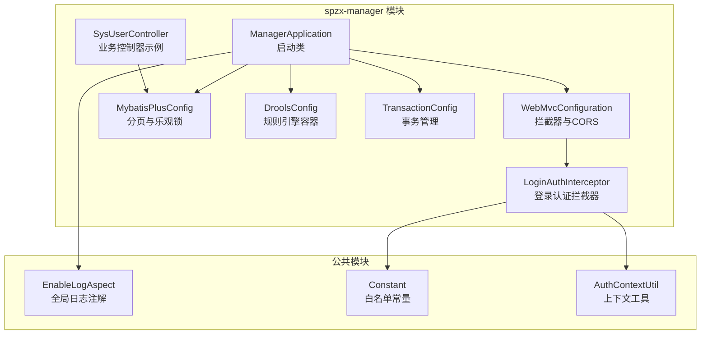
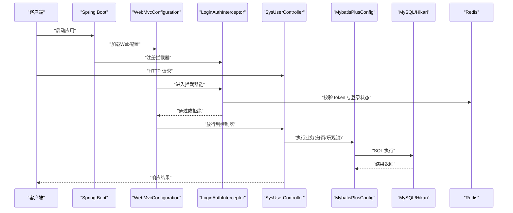
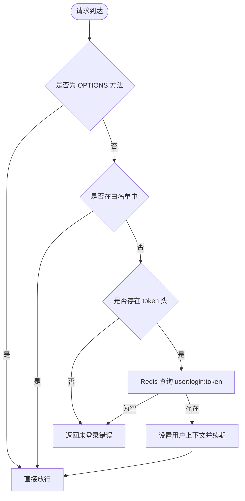
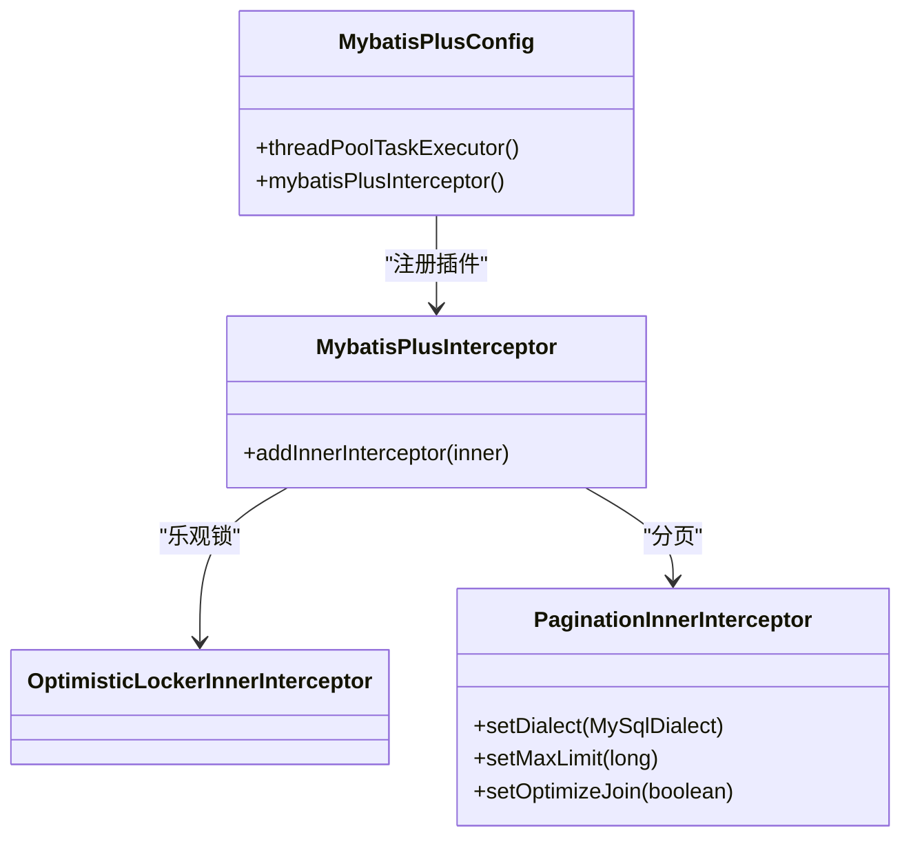
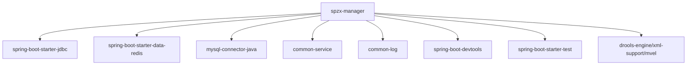
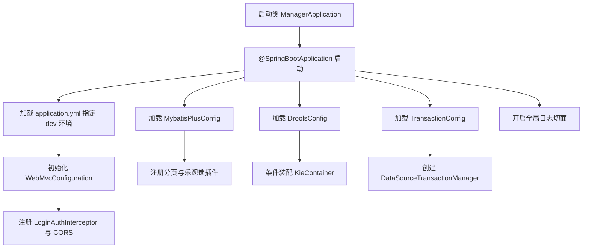

# spzx-manager 管理服务模块

<cite>
**本文引用的文件**
- [ManagerApplication.java](file://spzx-manager/src/main/java/com/joker/spzx/manager/ManagerApplication.java)
- [application.yml](file://spzx-manager/src/main/resources/application.yml)
- [application-dev.yml](file://spzx-manager/src/main/resources/application-dev.yml)
- [WebMvcConfiguration.java](file://spzx-manager/src/main/java/com/joker/spzx/manager/config/WebMvcConfiguration.java)
- [LoginAuthInterceptor.java](file://spzx-manager/src/main/java/com/joker/spzx/manager/config/LoginAuthInterceptor.java)
- [MybatisPlusConfig.java](file://spzx-manager/src/main/java/com/joker/spzx/manager/config/MybatisPlusConfig.java)
- [DroolsConfig.java](file://spzx-manager/src/main/java/com/joker/spzx/manager/config/DroolsConfig.java)
- [DroolsProperties.java](file://spzx-manager/src/main/java/com/joker/spzx/manager/config/DroolsProperties.java)
- [TransactionConfig.java](file://spzx-manager/src/main/java/com/joker/spzx/manager/config/TransactionConfig.java)
- [EnableLogAspect.java](file://spzx-common/common-log/src/main/java/com/joker/spzx/common/annotation/EnableLogAspect.java)
- [Constant.java](file://spzx-common/common-util/src/main/java/com/joker/spzx/utils/Constant.java)
- [AuthContextUtil.java](file://spzx-common/common-util/src/main/java/com/joker/spzx/utils/AuthContextUtil.java)
- [SysUserController.java](file://spzx-manager/src/main/java/com/joker/spzx/manager/controller/SysUserController.java)
- [kmodule.xml](file://spzx-manager/src/main/resources/META-INF/kmodule.xml)
- [log4j2-spring.xml](file://spzx-manager/src/main/resources/log4j2-spring.xml)
- [pom.xml](file://spzx-manager/pom.xml)
</cite>

## 目录
1. [简介](#简介)
2. [项目结构](#项目结构)
3. [核心组件](#核心组件)
4. [架构总览](#架构总览)
5. [详细组件分析](#详细组件分析)
6. [依赖分析](#依赖分析)
7. [性能考虑](#性能考虑)
8. [故障排查指南](#故障排查指南)
9. [结论](#结论)
10. [附录](#附录)

## 简介
本文件为 spzx-manager 管理服务模块的技术文档，聚焦于 Spring Boot 应用的启动流程、配置管理、拦截器机制与 MyBatis Plus 集成。文档详细说明模块启动类配置、WebMvc 配置、登录认证拦截器、分页插件配置、Drools 规则引擎集成、事务管理、全局日志切面（通过注解@EnableLogAspect 启用）等核心能力，并给出模块配置文件说明、开发与生产环境差异、启动流程图、常见问题解决方案与最佳实践。

## 项目结构
spzx-manager 是一个基于 Spring Boot 的后端服务模块，采用多模块聚合工程组织，主要包含以下层次：
- 启动入口：ManagerApplication
- 配置层：application.yml、application-dev.yml、WebMvcConfiguration、MybatisPlusConfig、DroolsConfig、TransactionConfig
- 拦截器层：LoginAuthInterceptor
- 控制器层：大量业务控制器（如 SysUserController）
- 工具与常量：Constant、AuthContextUtil
- 日志与通用能力：common-log 注解@EnableLogAspect、common-service 异常处理与 Knife4j 文档配置
- 规则引擎：Drools 配置与规则文件

图表来源
- [ManagerApplication.java:1-20](file://spzx-manager/src/main/java/com/joker/spzx/manager/ManagerApplication.java#L1-L20)
- [WebMvcConfiguration.java:1-39](file://spzx-manager/src/main/java/com/joker/spzx/manager/config/WebMvcConfiguration.java#L1-L39)
- [LoginAuthInterceptor.java:1-81](file://spzx-manager/src/main/java/com/joker/spzx/manager/config/LoginAuthInterceptor.java#L1-L81)
- [MybatisPlusConfig.java:1-132](file://spzx-manager/src/main/java/com/joker/spzx/manager/config/MybatisPlusConfig.java#L1-L132)
- [DroolsConfig.java:1-24](file://spzx-manager/src/main/java/com/joker/spzx/manager/config/DroolsConfig.java#L1-L24)
- [TransactionConfig.java:1-19](file://spzx-manager/src/main/java/com/joker/spzx/manager/config/TransactionConfig.java#L1-L19)
- [SysUserController.java:1-70](file://spzx-manager/src/main/java/com/joker/spzx/manager/controller/SysUserController.java#L1-L70)
- [EnableLogAspect.java:1-17](file://spzx-common/common-log/src/main/java/com/joker/spzx/common/annotation/EnableLogAspect.java#L1-L17)
- [Constant.java:1-27](file://spzx-common/common-util/src/main/java/com/joker/spzx/utils/Constant.java#L1-L27)
- [AuthContextUtil.java:1-21](file://spzx-common/common-util/src/main/java/com/joker/spzx/utils/AuthContextUtil.java#L1-L21)

章节来源
- [ManagerApplication.java:1-20](file://spzx-manager/src/main/java/com/joker/spzx/manager/ManagerApplication.java#L1-L20)
- [application.yml:1-5](file://spzx-manager/src/main/resources/application.yml#L1-L5)
- [application-dev.yml:1-65](file://spzx-manager/src/main/resources/application-dev.yml#L1-L65)

## 核心组件
- 启动类与全局日志：启动类使用 @SpringBootApplication 并通过 @EnableLogAspect 开启全局日志切面，实现统一操作日志记录。
- WebMvc 配置：注册登录认证拦截器与 CORS 跨域策略，统一处理白名单放行与跨域访问。
- 登录认证拦截器：从请求头读取 token，校验 Redis 中的登录状态，设置用户上下文并在完成后清理。
- MyBatis Plus 配置：注册乐观锁与分页插件，配置方言与最大限制；同时提供自定义线程池 Bean。
- Drools 规则引擎：按配置属性动态启用，加载 kmodule.xml 定义的规则集。
- 事务管理：基于数据源的平台事务管理器。
- 配置文件：application.yml 指定激活环境，application-dev.yml 提供开发环境数据库、Redis、Drools、MyBatis Plus 等配置。

章节来源
- [EnableLogAspect.java:1-17](file://spzx-common/common-log/src/main/java/com/joker/spzx/common/annotation/EnableLogAspect.java#L1-L17)
- [WebMvcConfiguration.java:1-39](file://spzx-manager/src/main/java/com/joker/spzx/manager/config/WebMvcConfiguration.java#L1-L39)
- [LoginAuthInterceptor.java:1-81](file://spzx-manager/src/main/java/com/joker/spzx/manager/config/LoginAuthInterceptor.java#L1-L81)
- [MybatisPlusConfig.java:1-132](file://spzx-manager/src/main/java/com/joker/spzx/manager/config/MybatisPlusConfig.java#L1-L132)
- [DroolsConfig.java:1-24](file://spzx-manager/src/main/java/com/joker/spzx/manager/config/DroolsConfig.java#L1-L24)
- [DroolsProperties.java:1-20](file://spzx-manager/src/main/java/com/joker/spzx/manager/config/DroolsProperties.java#L1-L20)
- [TransactionConfig.java:1-19](file://spzx-manager/src/main/java/com/joker/spzx/manager/config/TransactionConfig.java#L1-L19)
- [application.yml:1-5](file://spzx-manager/src/main/resources/application.yml#L1-L5)
- [application-dev.yml:1-65](file://spzx-manager/src/main/resources/application-dev.yml#L1-L65)

## 架构总览
下图展示模块启动到请求处理的关键路径：启动类 -> WebMvc 配置 -> 拦截器 -> 控制器 -> MyBatis Plus -> 数据库/Redis/Drools。

图表来源
- [ManagerApplication.java:1-20](file://spzx-manager/src/main/java/com/joker/spzx/manager/ManagerApplication.java#L1-L20)
- [WebMvcConfiguration.java:1-39](file://spzx-manager/src/main/java/com/joker/spzx/manager/config/WebMvcConfiguration.java#L1-L39)
- [LoginAuthInterceptor.java:1-81](file://spzx-manager/src/main/java/com/joker/spzx/manager/config/LoginAuthInterceptor.java#L1-L81)
- [SysUserController.java:1-70](file://spzx-manager/src/main/java/com/joker/spzx/manager/controller/SysUserController.java#L1-L70)
- [MybatisPlusConfig.java:1-132](file://spzx-manager/src/main/java/com/joker/spzx/manager/config/MybatisPlusConfig.java#L1-L132)
- [application-dev.yml:1-65](file://spzx-manager/src/main/resources/application-dev.yml#L1-L65)

## 详细组件分析

### 启动类与全局日志
- 启动类使用 @SpringBootApplication 启动 Spring 上下文，通过 @EnableLogAspect 导入全局日志切面，实现对标注方法的操作日志自动记录。
- 全局日志切面由注解导入，无需额外 XML 或 Java 配置即可生效。

章节来源
- [ManagerApplication.java:1-20](file://spzx-manager/src/main/java/com/joker/spzx/manager/ManagerApplication.java#L1-L20)
- [EnableLogAspect.java:1-17](file://spzx-common/common-log/src/main/java/com/joker/spzx/common/annotation/EnableLogAspect.java#L1-L17)

### WebMvc 配置与拦截器
- 拦截器注册：在 WebMvcConfiguration 中注入 LoginAuthInterceptor，并对所有路径放行白名单以外的请求。
- 白名单：Constant.whiteList 包含登录、验证码、静态资源、Swagger 等路径，避免被拦截。
- CORS：允许 Credentials、指定允许来源、方法与头，满足前端本地开发跨域需求。
- 定时任务：开启 @EnableScheduling 以便后续任务调度。

图表来源
- [WebMvcConfiguration.java:1-39](file://spzx-manager/src/main/java/com/joker/spzx/manager/config/WebMvcConfiguration.java#L1-L39)
- [LoginAuthInterceptor.java:1-81](file://spzx-manager/src/main/java/com/joker/spzx/manager/config/LoginAuthInterceptor.java#L1-L81)
- [Constant.java:1-27](file://spzx-common/common-util/src/main/java/com/joker/spzx/utils/Constant.java#L1-L27)

章节来源
- [WebMvcConfiguration.java:1-39](file://spzx-manager/src/main/java/com/joker/spzx/manager/config/WebMvcConfiguration.java#L1-L39)
- [LoginAuthInterceptor.java:1-81](file://spzx-manager/src/main/java/com/joker/spzx/manager/config/LoginAuthInterceptor.java#L1-L81)
- [Constant.java:1-27](file://spzx-common/common-util/src/main/java/com/joker/spzx/utils/Constant.java#L1-L27)

### 登录认证拦截器
- 核心逻辑：
  - 忽略 OPTIONS 预检请求
  - 白名单直接放行
  - 从请求头读取 token，查询 Redis 键 user:login:{token}
  - 若不存在则返回未登录错误；若存在则更新过期时间并将用户对象写入线程上下文
  - 请求结束后清理线程上下文
- 返回格式：统一使用 Result 对象与状态码枚举，便于前端处理。

章节来源
- [LoginAuthInterceptor.java:1-81](file://spzx-manager/src/main/java/com/joker/spzx/manager/config/LoginAuthInterceptor.java#L1-L81)
- [AuthContextUtil.java:1-21](file://spzx-common/common-util/src/main/java/com/joker/spzx/utils/AuthContextUtil.java#L1-L21)

### MyBatis Plus 配置
- 插件配置：
  - 乐观锁插件：用于并发更新时的版本控制
  - 分页插件：配置 MySQL 方言、最大限制、优化 JOIN
- 线程池：提供名为 SpzxManagerThreadPoolTaskExecutor 的线程池 Bean，便于异步任务与批处理。
- Mapper 映射：application-dev.yml 指定 mapper-locations 为 classpath*:/mapper/**/*.xml。

图表来源
- [MybatisPlusConfig.java:1-132](file://spzx-manager/src/main/java/com/joker/spzx/manager/config/MybatisPlusConfig.java#L1-L132)

章节来源
- [MybatisPlusConfig.java:1-132](file://spzx-manager/src/main/java/com/joker/spzx/manager/config/MybatisPlusConfig.java#L1-L132)
- [application-dev.yml:53-59](file://spzx-manager/src/main/resources/application-dev.yml#L53-L59)

### Drools 规则引擎
- 属性配置：DroolsProperties 提供 enabled 与 rulesPath 两个属性，默认启用并指向 classpath:rules/
- 条件装配：@ConditionalOnProperty 在 drools.enabled=true 时创建 KieContainer Bean
- 规则加载：kmodule.xml 指定规则包路径为 rules，KieContainerFactory 创建容器

章节来源
- [DroolsConfig.java:1-24](file://spzx-manager/src/main/java/com/joker/spzx/manager/config/DroolsConfig.java#L1-L24)
- [DroolsProperties.java:1-20](file://spzx-manager/src/main/java/com/joker/spzx/manager/config/DroolsProperties.java#L1-L20)
- [kmodule.xml:1-7](file://spzx-manager/src/main/resources/META-INF/kmodule.xml#L1-L7)

### 事务管理
- 使用 @EnableTransactionManagement 开启注解式事务
- 通过 DataSource 创建 DataSourceTransactionManager，交由 Spring 管理声明式事务

章节来源
- [TransactionConfig.java:1-19](file://spzx-manager/src/main/java/com/joker/spzx/manager/config/TransactionConfig.java#L1-L19)

### 控制器示例与分页
- SysUserController 展示了标准的分页查询、保存、更新、删除与角色分配接口
- 分页能力由 MyBatis Plus 分页插件提供，控制器直接接收 IPage 结果并封装为 Result

章节来源
- [SysUserController.java:1-70](file://spzx-manager/src/main/java/com/joker/spzx/manager/controller/SysUserController.java#L1-L70)
- [MybatisPlusConfig.java:1-132](file://spzx-manager/src/main/java/com/joker/spzx/manager/config/MybatisPlusConfig.java#L1-L132)

## 依赖分析
- Maven 依赖概览：
  - spring-boot-starter-jdbc、spring-boot-starter-data-redis、mysql-connector-java
  - common-service、common-log
  - devtools、测试依赖
  - Drools 规则引擎相关依赖
- 资源过滤：resources 目录启用 filtering，便于 profile 注入变量

图表来源
- [pom.xml:1-101](file://spzx-manager/pom.xml#L1-L101)

章节来源
- [pom.xml:1-101](file://spzx-manager/pom.xml#L1-L101)

## 性能考虑
- 数据库连接池：HikariCP 参数已调优，包括最大池大小、最小空闲、空闲超时、连接超时、验证超时与池名，适合中等规模并发。
- 分页限制：分页插件设置最大限制与 JOIN 优化，防止超大分页导致性能问题。
- 线程池：自定义线程池参数根据 CPU 核心数动态配置，兼顾吞吐与稳定性。
- Redis 缓存：登录态存储在 Redis，建议结合过期策略与键命名规范，避免内存泄漏。
- 规则引擎：Drools 规则加载与会话管理需关注规则复杂度与热更新策略。

## 故障排查指南
- 登录拦截返回未登录
  - 检查请求头是否携带 token
  - 校验 Redis 中 user:login:{token} 是否存在且未过期
  - 确认 Constant.whiteList 是否包含当前路径
- 跨域问题
  - 确认 WebMvcConfiguration 中 allowedOrigins 与 allowedMethods 配置
  - 浏览器控制台查看预检请求是否成功
- 分页异常或性能问题
  - 检查分页参数与最大限制
  - 关注 SQL JOIN 优化与索引
- 规则引擎不生效
  - 确认 drools.enabled=true 且 rulesPath 正确
  - 检查 kmodule.xml 包扫描路径与规则文件位置
- 日志输出
  - log4j2-spring.xml 控制台输出级别，必要时调整 Root level

章节来源
- [LoginAuthInterceptor.java:1-81](file://spzx-manager/src/main/java/com/joker/spzx/manager/config/LoginAuthInterceptor.java#L1-L81)
- [WebMvcConfiguration.java:1-39](file://spzx-manager/src/main/java/com/joker/spzx/manager/config/WebMvcConfiguration.java#L1-L39)
- [MybatisPlusConfig.java:1-132](file://spzx-manager/src/main/java/com/joker/spzx/manager/config/MybatisPlusConfig.java#L1-L132)
- [DroolsConfig.java:1-24](file://spzx-manager/src/main/java/com/joker/spzx/manager/config/DroolsConfig.java#L1-L24)
- [log4j2-spring.xml:1-13](file://spzx-manager/src/main/resources/log4j2-spring.xml#L1-L13)

## 结论
spzx-manager 模块以 Spring Boot 为基础，通过合理的配置与插件化设计，实现了统一的登录认证、跨域支持、分页与乐观锁、规则引擎与事务管理。借助 @EnableLogAspect 实现全局日志记录，配合 Redis 与 Constant 白名单机制，保障了安全与易维护性。开发与生产环境通过 profile 与配置文件差异化管理，便于快速切换与部署。

## 附录

### 启动流程图

图表来源
- [ManagerApplication.java:1-20](file://spzx-manager/src/main/java/com/joker/spzx/manager/ManagerApplication.java#L1-L20)
- [application.yml:1-5](file://spzx-manager/src/main/resources/application.yml#L1-L5)
- [WebMvcConfiguration.java:1-39](file://spzx-manager/src/main/java/com/joker/spzx/manager/config/WebMvcConfiguration.java#L1-L39)
- [MybatisPlusConfig.java:1-132](file://spzx-manager/src/main/java/com/joker/spzx/manager/config/MybatisPlusConfig.java#L1-L132)
- [DroolsConfig.java:1-24](file://spzx-manager/src/main/java/com/joker/spzx/manager/config/DroolsConfig.java#L1-L24)
- [TransactionConfig.java:1-19](file://spzx-manager/src/main/java/com/joker/spzx/manager/config/TransactionConfig.java#L1-L19)

### 配置项说明（摘录）
- 应用名称与环境
  - spring.application.name: service-manager
  - spring.profiles.active: dev
- 服务器与文件上传
  - server.port: 8501
  - spring.servlet.multipart.max-file-size: 20MB
  - spring.servlet.multipart.max-request-size: 30MB
- 数据源（HikariCP）
  - spring.datasource.type: HikariDataSource
  - spring.datasource.driver-class-name: com.mysql.cj.jdbc.Driver
  - spring.datasource.url/username/password: 数据库连接信息
  - spring.datasource.hikari.*: 连接池参数
- Redis
  - spring.data.redis.host/port: Redis 地址
- MVC
  - spring.mvc.servlet.load-on-startup: 1
  - spring.mvc.format.date-time: yyyy-MM-dd HH:mm:ss
- 主要配置
  - spring.main.lazy-initialization: false
  - spring.main.allow-bean-definition-overriding: true
- Drools
  - drools.enabled: true
  - drools.rules-path: rules/
- MyBatis Plus
  - mybatis-plus.mapper-locations: classpath*:/mapper/**/*.xml
  - mybatis-plus.global-config.db-config.id-type: auto
  - mybatis-plus.configuration.log-impl: StdOutImpl

章节来源
- [application.yml:1-5](file://spzx-manager/src/main/resources/application.yml#L1-L5)
- [application-dev.yml:1-65](file://spzx-manager/src/main/resources/application-dev.yml#L1-L65)