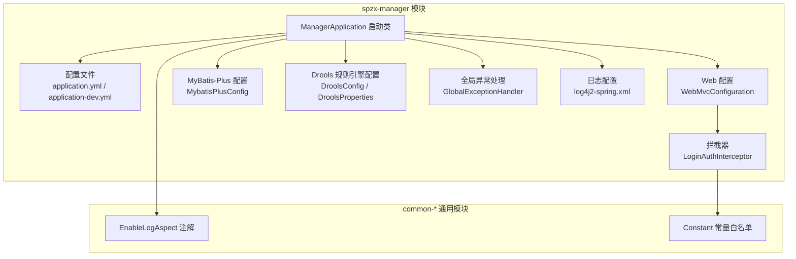
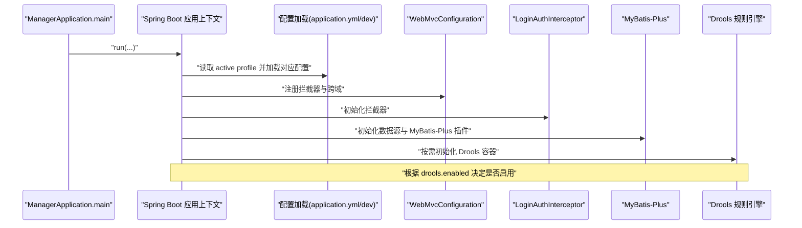
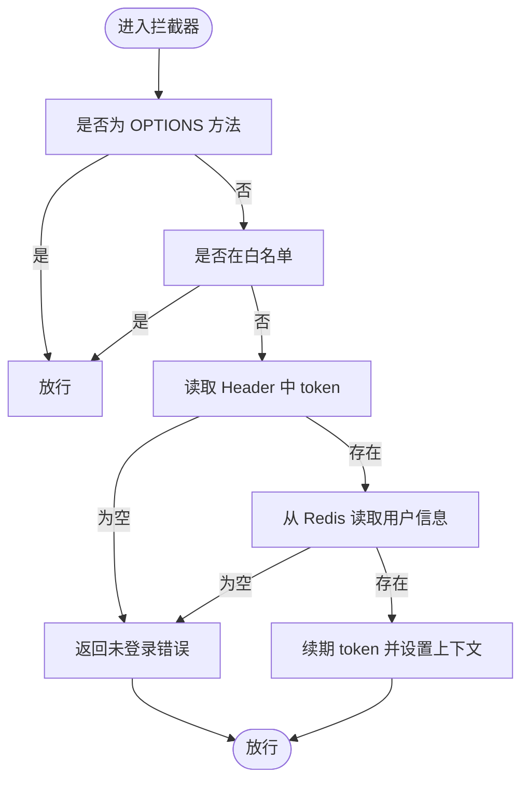
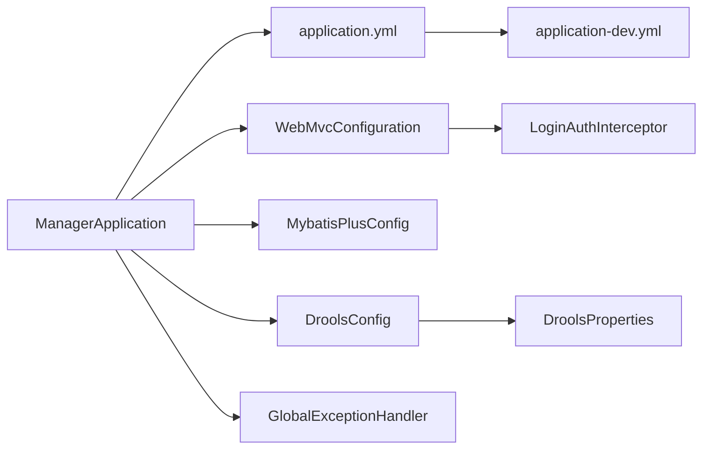

# 模块启动与配置

<cite>
**本文引用的文件列表**
- [ManagerApplication.java](file://spzx-manager/src/main/java/com/joker/spzx/manager/ManagerApplication.java)
- [application.yml](file://spzx-manager/src/main/resources/application.yml)
- [application-dev.yml](file://spzx-manager/src/main/resources/application-dev.yml)
- [WebMvcConfiguration.java](file://spzx-manager/src/main/java/com/joker/spzx/manager/config/WebMvcConfiguration.java)
- [MybatisPlusConfig.java](file://spzx-manager/src/main/java/com/joker/spzx/manager/config/MybatisPlusConfig.java)
- [LoginAuthInterceptor.java](file://spzx-manager/src/main/java/com/joker/spzx/manager/config/LoginAuthInterceptor.java)
- [DroolsConfig.java](file://spzx-manager/src/main/java/com/joker/spzx/manager/config/DroolsConfig.java)
- [DroolsProperties.java](file://spzx-manager/src/main/java/com/joker/spzx/manager/config/DroolsProperties.java)
- [GlobalExceptionHandler.java](file://spzx-common/common-service/src/main/java/com/joker/spzx/common/exception/GlobalExceptionHandler.java)
- [EnableLogAspect.java](file://spzx-common/common-log/src/main/java/com/joker/spzx/common/annotation/EnableLogAspect.java)
- [log4j2-spring.xml](file://spzx-manager/src/main/resources/log4j2-spring.xml)
- [Constant.java](file://spzx-common/common-util/src/main/java/com/joker/spzx/utils/Constant.java)
- [pom.xml](file://spzx-manager/pom.xml)
</cite>

## 目录
1. [简介](#简介)
2. [项目结构](#项目结构)
3. [核心组件](#核心组件)
4. [架构总览](#架构总览)
5. [详细组件分析](#详细组件分析)
6. [依赖分析](#依赖分析)
7. [性能考虑](#性能考虑)
8. [故障排查指南](#故障排查指南)
9. [结论](#结论)
10. [附录](#附录)

## 简介
本文件面向 spzx-manager 模块的启动与配置，系统性解析以下内容：
- 启动类注解与 Spring Boot 自动配置机制
- application.yml 与 application-dev.yml 的关键配置项及含义
- 开发环境与生产环境的配置差异与 profiles 切换方式
- 启动参数、JVM 调优与性能监控建议
- 配置最佳实践与常见问题排查

## 项目结构
spzx-manager 作为独立的 Spring Boot 应用模块，采用标准的 Maven 结构组织，核心启动类位于主资源目录，配置文件位于 resources 目录，业务配置类（拦截器、MyBatis-Plus、Drools）位于 config 包中，通用日志与异常处理来自 common-* 模块。

图表来源
- [ManagerApplication.java:1-20](file://spzx-manager/src/main/java/com/joker/spzx/manager/ManagerApplication.java#L1-L20)
- [application.yml:1-5](file://spzx-manager/src/main/resources/application.yml#L1-L5)
- [application-dev.yml:1-65](file://spzx-manager/src/main/resources/application-dev.yml#L1-L65)
- [WebMvcConfiguration.java:1-39](file://spzx-manager/src/main/java/com/joker/spzx/manager/config/WebMvcConfiguration.java#L1-L39)
- [LoginAuthInterceptor.java:1-81](file://spzx-manager/src/main/java/com/joker/spzx/manager/config/LoginAuthInterceptor.java#L1-L81)
- [MybatisPlusConfig.java:1-132](file://spzx-manager/src/main/java/com/joker/spzx/manager/config/MybatisPlusConfig.java#L1-L132)
- [DroolsConfig.java:1-24](file://spzx-manager/src/main/java/com/joker/spzx/manager/config/DroolsConfig.java#L1-L24)
- [DroolsProperties.java:1-20](file://spzx-manager/src/main/java/com/joker/spzx/manager/config/DroolsProperties.java#L1-L20)
- [GlobalExceptionHandler.java:1-20](file://spzx-common/common-service/src/main/java/com/joker/spzx/common/exception/GlobalExceptionHandler.java#L1-L20)
- [log4j2-spring.xml:1-13](file://spzx-manager/src/main/resources/log4j2-spring.xml#L1-L13)
- [EnableLogAspect.java:1-17](file://spzx-common/common-log/src/main/java/com/joker/spzx/common/annotation/EnableLogAspect.java#L1-L17)
- [Constant.java:1-27](file://spzx-common/common-util/src/main/java/com/joker/spzx/utils/Constant.java#L1-L27)

章节来源
- [ManagerApplication.java:1-20](file://spzx-manager/src/main/java/com/joker/spzx/manager/ManagerApplication.java#L1-L20)
- [application.yml:1-5](file://spzx-manager/src/main/resources/application.yml#L1-L5)
- [application-dev.yml:1-65](file://spzx-manager/src/main/resources/application-dev.yml#L1-L65)

## 核心组件
- 启动类与自动配置
  - 启动类使用 @SpringBootApplication 启动 Spring Boot 应用上下文，并通过 @EnableLogAspect 导入日志切面能力。
  - 通过 application.yml 指定激活的 profile 为 dev，从而加载 application-dev.yml 中的开发环境配置。
- Web 层配置
  - WebMvcConfiguration 注册拦截器与跨域策略，拦截器基于 Redis 校验登录态，白名单由 Constant 提供。
- 数据访问层配置
  - MybatisPlusConfig 提供分页与乐观锁插件，以及一个基于 CPU 核心数的线程池执行器 Bean。
- 规则引擎配置
  - DroolsConfig 基于 DroolsProperties 动态启用规则容器，受 drools.enabled 控制。
- 全局异常处理
  - GlobalExceptionHandler 统一捕获异常并返回标准化结果对象。

章节来源
- [ManagerApplication.java:1-20](file://spzx-manager/src/main/java/com/joker/spzx/manager/ManagerApplication.java#L1-L20)
- [WebMvcConfiguration.java:1-39](file://spzx-manager/src/main/java/com/joker/spzx/manager/config/WebMvcConfiguration.java#L1-L39)
- [LoginAuthInterceptor.java:1-81](file://spzx-manager/src/main/java/com/joker/spzx/manager/config/LoginAuthInterceptor.java#L1-L81)
- [MybatisPlusConfig.java:1-132](file://spzx-manager/src/main/java/com/joker/spzx/manager/config/MybatisPlusConfig.java#L1-L132)
- [DroolsConfig.java:1-24](file://spzx-manager/src/main/java/com/joker/spzx/manager/config/DroolsConfig.java#L1-L24)
- [DroolsProperties.java:1-20](file://spzx-manager/src/main/java/com/joker/spzx/manager/config/DroolsProperties.java#L1-L20)
- [GlobalExceptionHandler.java:1-20](file://spzx-common/common-service/src/main/java/com/joker/spzx/common/exception/GlobalExceptionHandler.java#L1-L20)

## 架构总览
下图展示从启动到请求处理的关键流程：应用启动、配置加载、拦截器链路、数据访问与规则引擎。

图表来源
- [ManagerApplication.java:12-14](file://spzx-manager/src/main/java/com/joker/spzx/manager/ManagerApplication.java#L12-L14)
- [application.yml:4-5](file://spzx-manager/src/main/resources/application.yml#L4-L5)
- [application-dev.yml:1-65](file://spzx-manager/src/main/resources/application-dev.yml#L1-L65)
- [WebMvcConfiguration.java:19-35](file://spzx-manager/src/main/java/com/joker/spzx/manager/config/WebMvcConfiguration.java#L19-L35)
- [LoginAuthInterceptor.java:29-58](file://spzx-manager/src/main/java/com/joker/spzx/manager/config/LoginAuthInterceptor.java#L29-L58)
- [MybatisPlusConfig.java:42-53](file://spzx-manager/src/main/java/com/joker/spzx/manager/config/MybatisPlusConfig.java#L42-L53)
- [DroolsConfig.java:16-22](file://spzx-manager/src/main/java/com/joker/spzx/manager/config/DroolsConfig.java#L16-L22)

## 详细组件分析

### 启动类与自动配置
- @SpringBootApplication
  - 启动 Spring Boot 应用上下文，扫描组件并启用自动配置。
- @EnableLogAspect
  - 通过 @Import 导入日志切面实现，统一记录操作日志。
- application.yml
  - 指定 spring.application.name 与 spring.profiles.active: dev，确保加载 application-dev.yml。

章节来源
- [ManagerApplication.java:8-14](file://spzx-manager/src/main/java/com/joker/spzx/manager/ManagerApplication.java#L8-L14)
- [application.yml:1-5](file://spzx-manager/src/main/resources/application.yml#L1-L5)

### 配置文件详解（application.yml 与 application-dev.yml）
- application.yml
  - spring.application.name: 应用名称
  - spring.profiles.active: 激活的 profile（dev）
- application-dev.yml（开发环境）
  - server.port: 服务端口
  - server.tomcat.connection-timeout: 连接超时
  - spring.servlet.multipart: 文件上传大小限制
  - spring.datasource: 数据库连接与 HikariCP 参数
  - spring.data.redis: Redis 连接参数
  - spring.mvc.servlet.load-on-startup: Servlet 启动优先级
  - spring.mvc.format.date-time: 日期格式
  - spring.main: 延迟初始化、Bean 覆盖策略
  - drools: 规则引擎开关与规则路径
  - mybatis-plus: Mapper 扫描、ID 策略、日志输出

章节来源
- [application.yml:1-5](file://spzx-manager/src/main/resources/application.yml#L1-L5)
- [application-dev.yml:1-65](file://spzx-manager/src/main/resources/application-dev.yml#L1-L65)

### Web 层配置与拦截器
- WebMvcConfiguration
  - 注册拦截器：对所有路径生效，排除白名单
  - 跨域配置：允许本地前端地址、允许 Credentials、允许所有方法与 Header
- LoginAuthInterceptor
  - 校验逻辑：跳过 OPTIONS；校验白名单；从 Header 获取 token；从 Redis 读取用户信息并续期；设置上下文；释放上下文
  - 白名单：登录、验证码、静态资源、Swagger 文档等

图表来源
- [LoginAuthInterceptor.java:29-58](file://spzx-manager/src/main/java/com/joker/spzx/manager/config/LoginAuthInterceptor.java#L29-L58)
- [Constant.java:9-25](file://spzx-common/common-util/src/main/java/com/joker/spzx/utils/Constant.java#L9-L25)

章节来源
- [WebMvcConfiguration.java:19-35](file://spzx-manager/src/main/java/com/joker/spzx/manager/config/WebMvcConfiguration.java#L19-L35)
- [LoginAuthInterceptor.java:1-81](file://spzx-manager/src/main/java/com/joker/spzx/manager/config/LoginAuthInterceptor.java#L1-L81)
- [Constant.java:1-27](file://spzx-common/common-util/src/main/java/com/joker/spzx/utils/Constant.java#L1-L27)

### 数据访问层配置（MyBatis-Plus）
- 插件配置
  - 乐观锁插件：防止并发覆盖
  - 分页插件：MySQL 方言、最大限制、优化 Join
- 线程池配置
  - 基于 CPU 核心数动态计算线程池参数，CallerRunsPolicy 拒绝策略，便于异步任务与批处理场景

章节来源
- [MybatisPlusConfig.java:42-53](file://spzx-manager/src/main/java/com/joker/spzx/manager/config/MybatisPlusConfig.java#L42-L53)
- [MybatisPlusConfig.java:23-38](file://spzx-manager/src/main/java/com/joker/spzx/manager/config/MybatisPlusConfig.java#L23-L38)

### 规则引擎配置（Drools）
- DroolsProperties
  - enabled: 是否启用规则引擎
  - rulesPath: 规则文件目录（classpath 下）
- DroolsConfig
  - 条件化装配：当 drools.enabled 为 true 时创建 KieContainer
  - 通过 KieContainerFactory 创建规则容器

章节来源
- [DroolsProperties.java:1-20](file://spzx-manager/src/main/java/com/joker/spzx/manager/config/DroolsProperties.java#L1-L20)
- [DroolsConfig.java:16-22](file://spzx-manager/src/main/java/com/joker/spzx/manager/config/DroolsConfig.java#L16-L22)

### 日志与异常处理
- EnableLogAspect
  - 通过 @Import 导入日志切面，启用统一日志记录
- log4j2-spring.xml
  - 控制台输出，按固定模式打印日志
- GlobalExceptionHandler
  - 统一捕获异常并返回标准化结果对象，区分自定义异常

章节来源
- [EnableLogAspect.java:1-17](file://spzx-common/common-log/src/main/java/com/joker/spzx/common/annotation/EnableLogAspect.java#L1-L17)
- [log4j2-spring.xml:1-13](file://spzx-manager/src/main/resources/log4j2-spring.xml#L1-L13)
- [GlobalExceptionHandler.java:1-20](file://spzx-common/common-service/src/main/java/com/joker/spzx/common/exception/GlobalExceptionHandler.java#L1-L20)

## 依赖分析
- 启动类与配置类之间的依赖关系
  - ManagerApplication -> application.yml -> application-dev.yml
  - WebMvcConfiguration -> LoginAuthInterceptor -> RedisTemplate
  - MybatisPlusConfig -> MyBatis-Plus 插件
  - DroolsConfig -> DroolsProperties -> KieContainerFactory
  - GlobalExceptionHandler -> Result/自定义异常

图表来源
- [ManagerApplication.java:1-20](file://spzx-manager/src/main/java/com/joker/spzx/manager/ManagerApplication.java#L1-L20)
- [application.yml:1-5](file://spzx-manager/src/main/resources/application.yml#L1-L5)
- [application-dev.yml:1-65](file://spzx-manager/src/main/resources/application-dev.yml#L1-L65)
- [WebMvcConfiguration.java:1-39](file://spzx-manager/src/main/java/com/joker/spzx/manager/config/WebMvcConfiguration.java#L1-L39)
- [LoginAuthInterceptor.java:1-81](file://spzx-manager/src/main/java/com/joker/spzx/manager/config/LoginAuthInterceptor.java#L1-L81)
- [MybatisPlusConfig.java:1-132](file://spzx-manager/src/main/java/com/joker/spzx/manager/config/MybatisPlusConfig.java#L1-L132)
- [DroolsConfig.java:1-24](file://spzx-manager/src/main/java/com/joker/spzx/manager/config/DroolsConfig.java#L1-L24)
- [DroolsProperties.java:1-20](file://spzx-manager/src/main/java/com/joker/spzx/manager/config/DroolsProperties.java#L1-L20)
- [GlobalExceptionHandler.java:1-20](file://spzx-common/common-service/src/main/java/com/joker/spzx/common/exception/GlobalExceptionHandler.java#L1-L20)

章节来源
- [pom.xml:1-101](file://spzx-manager/pom.xml#L1-L101)

## 性能考虑
- 数据库连接池
  - HikariCP 已配置最大池大小、最小空闲、连接超时、验证超时、泄漏检测阈值等，适合高并发场景
- 线程池
  - MyBatis-Plus 配置的线程池基于 CPU 核心数，队列容量适中，拒绝策略采用 CallerRunsPolicy，避免丢弃任务
- 规则引擎
  - drools.enabled 受配置控制，默认启用，可根据业务需要关闭以减少启动开销
- 日志
  - 使用 log4j2 控制台输出，便于开发调试；生产环境可替换为文件或远程日志

章节来源
- [application-dev.yml:18-32](file://spzx-manager/src/main/resources/application-dev.yml#L18-L32)
- [MybatisPlusConfig.java:23-38](file://spzx-manager/src/main/java/com/joker/spzx/manager/config/MybatisPlusConfig.java#L23-L38)
- [DroolsConfig.java:16-16](file://spzx-manager/src/main/java/com/joker/spzx/manager/config/DroolsConfig.java#L16-L16)
- [log4j2-spring.xml:1-13](file://spzx-manager/src/main/resources/log4j2-spring.xml#L1-L13)

## 故障排查指南
- 登录拦截失败
  - 检查 token 是否正确传入 Header；确认 Redis 中是否存在 user:login: 前缀键；核对白名单是否包含当前路径
- 跨域问题
  - 确认 WebMvcConfiguration 中允许的来源与方法；开发环境可允许 http://localhost:3000
- 数据库连接异常
  - 核对 application-dev.yml 中的数据库 URL、用户名、密码与驱动；检查 HikariCP 参数是否合理
- 规则引擎未生效
  - 确认 drools.enabled 为 true；检查 rulesPath 对应的 classpath 路径是否存在规则文件
- 全局异常未捕获
  - 确认 @RestControllerAdvice 生效；检查自定义异常类型是否被 ServiceException 捕获

章节来源
- [LoginAuthInterceptor.java:29-58](file://spzx-manager/src/main/java/com/joker/spzx/manager/config/LoginAuthInterceptor.java#L29-L58)
- [WebMvcConfiguration.java:28-35](file://spzx-manager/src/main/java/com/joker/spzx/manager/config/WebMvcConfiguration.java#L28-L35)
- [application-dev.yml:12-32](file://spzx-manager/src/main/resources/application-dev.yml#L12-L32)
- [DroolsConfig.java:16-22](file://spzx-manager/src/main/java/com/joker/spzx/manager/config/DroolsConfig.java#L16-L22)
- [GlobalExceptionHandler.java:7-20](file://spzx-common/common-service/src/main/java/com/joker/spzx/common/exception/GlobalExceptionHandler.java#L7-L20)

## 结论
spzx-manager 模块通过清晰的启动类与配置文件组织，结合拦截器、数据访问与规则引擎等组件，实现了可扩展、可维护的管理后台服务。开发环境默认启用，具备完善的日志与异常处理机制。建议在生产环境中进一步细化数据库、Redis、日志与规则引擎配置，并结合 JVM 与容器监控进行持续优化。

## 附录

### 配置文件模板与说明
- application.yml
  - spring.application.name: 应用名称
  - spring.profiles.active: 当前激活的 profile（如 dev、prod）
- application-dev.yml
  - server.port: 服务端口
  - spring.servlet.multipart: 最大文件大小与请求大小
  - spring.datasource: 数据源类型、驱动、URL、用户名、密码与 HikariCP 参数
  - spring.data.redis: Redis 主机与端口
  - spring.mvc: 启动优先级、日期格式
  - spring.main: 延迟初始化、Bean 覆盖策略
  - drools: enabled、rulesPath
  - mybatis-plus: mapperLocations、idType、日志实现

章节来源
- [application.yml:1-5](file://spzx-manager/src/main/resources/application.yml#L1-L5)
- [application-dev.yml:1-65](file://spzx-manager/src/main/resources/application-dev.yml#L1-L65)

### 开发与生产环境差异
- 开发环境（application-dev.yml）
  - 默认端口、较宽松的文件上传限制、开启日志输出、规则引擎默认启用
- 生产环境（可通过新增 application-prod.yml 实现）
  - 更严格的连接池参数、更短的日志级别、关闭不必要的功能、更严格的跨域策略

章节来源
- [application-dev.yml:1-65](file://spzx-manager/src/main/resources/application-dev.yml#L1-L65)

### 启动参数与 JVM 调优建议
- JVM 参数示例（可根据实际资源调整）
  - -Xms2g -Xmx4g：初始与最大堆内存
  - -XX:+UseG1GC：启用 G1 垃圾收集器
  - -XX:MaxDirectMemorySize=2g：直接内存上限
  - -Djava.awt.headless=true：无头模式
  - -Dfile.encoding=UTF-8：字符编码
- Spring Boot 启动参数
  - --spring.profiles.active=prod：指定生产环境
  - --server.port=8080：指定端口
  - --spring.datasource.hikari.maximum-pool-size=20：连接池大小

[本节为通用建议，不直接分析具体文件]

### 性能监控配置建议
- 日志
  - 生产环境建议使用文件或远程日志，避免控制台输出过多影响性能
- 数据库
  - 监控慢查询与连接池指标，结合 HikariCP 的 leak detection 与 validation timeout
- 规则引擎
  - 在启用 drools.enabled 的同时，定期评估规则复杂度与加载时间

[本节为通用建议，不直接分析具体文件]