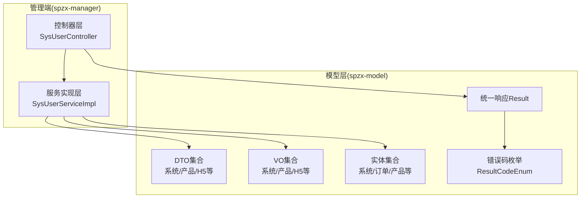
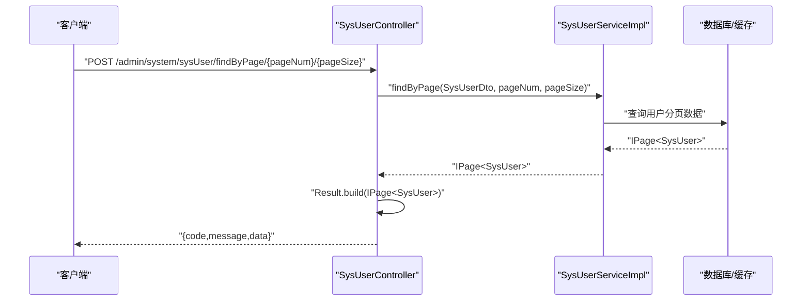
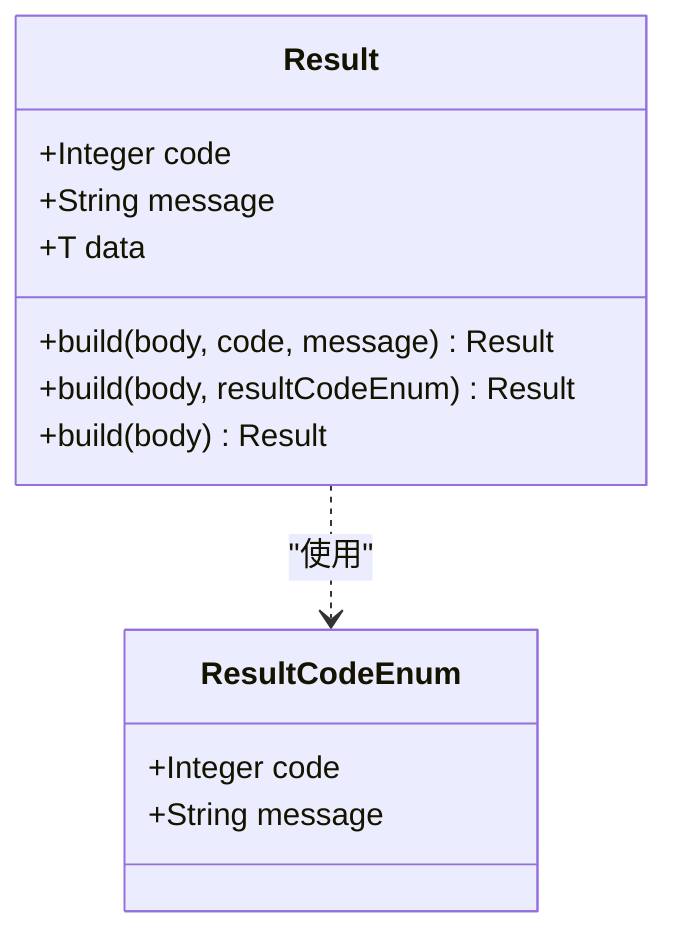
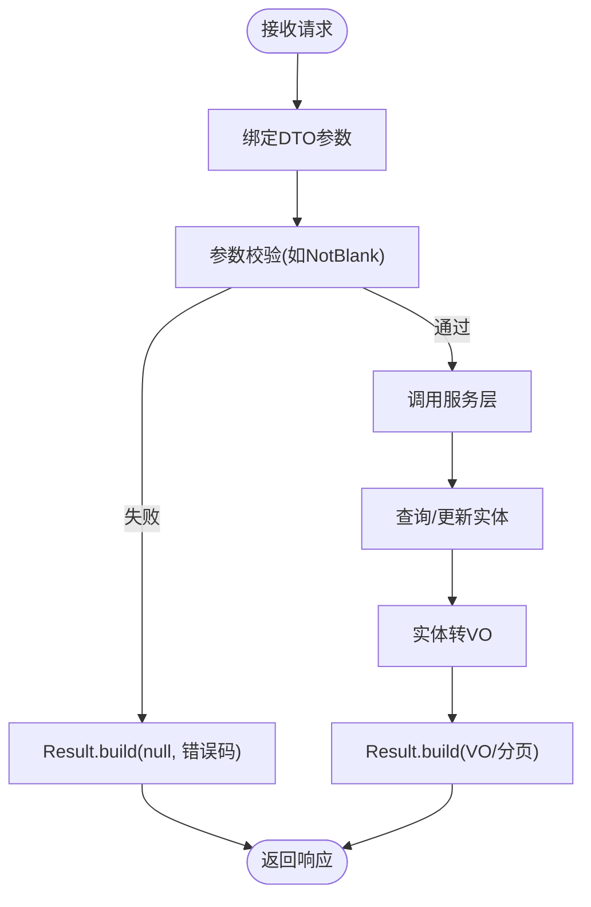
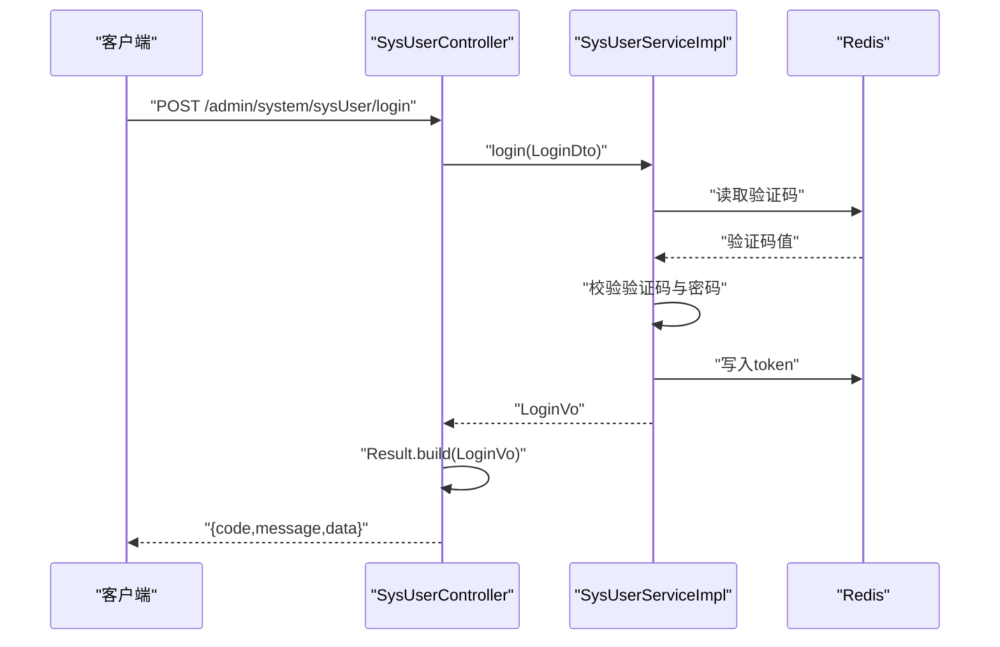
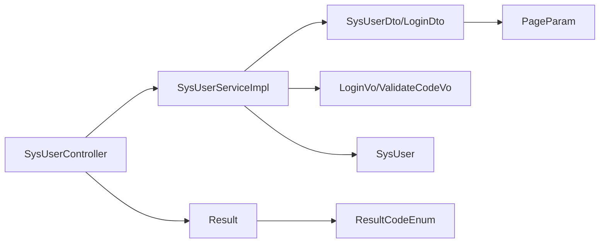

# DTO/VO数据传输对象

<cite>
**本文引用的文件**
- [Result.java](file://spzx-model/src/main/java/com/joker/spzx/model/vo/common/Result.java)
- [ResultCodeEnum.java](file://spzx-model/src/main/java/com/joker/spzx/model/vo/common/ResultCodeEnum.java)
- [LoginDto.java](file://spzx-model/src/main/java/com/joker/spzx/model/dto/system/LoginDto.java)
- [UserLoginDto.java](file://spzx-model/src/main/java/com/joker/spzx/model/dto/h5/UserLoginDto.java)
- [SysUserDto.java](file://spzx-model/src/main/java/com/joker/spzx/model/dto/system/SysUserDto.java)
- [PageParam.java](file://spzx-model/src/main/java/com/joker/spzx/model/dto/system/PageParam.java)
- [ProductDto.java](file://spzx-model/src/main/java/com/joker/spzx/model/dto/product/ProductDto.java)
- [UserInfoVo.java](file://spzx-model/src/main/java/com/joker/spzx/model/vo/h5/UserInfoVo.java)
- [ProductPageVo.java](file://spzx-model/src/main/java/com/joker/spzx/model/vo/product/ProductPageVo.java)
- [LoginVo.java](file://spzx-model/src/main/java/com/joker/spzx/model/vo/system/LoginVo.java)
- [ValidateCodeVo.java](file://spzx-model/src/main/java/com/joker/spzx/model/vo/system/ValidateCodeVo.java)
- [SysUserServiceImpl.java](file://spzx-manager/src/main/java/com/joker/spzx/manager/service/impl/SysUserServiceImpl.java)
- [SysUserController.java](file://spzx-manager/src/main/java/com/joker/spzx/manager/controller/SysUserController.java)
- [SysUser.java](file://spzx-model/src/main/java/com/joker/spzx/model/entity/system/SysUser.java)
</cite>

## 目录
1. [引言](#引言)
2. [项目结构](#项目结构)
3. [核心组件](#核心组件)
4. [架构总览](#架构总览)
5. [详细组件分析](#详细组件分析)
6. [依赖分析](#依赖分析)
7. [性能考虑](#性能考虑)
8. [故障排查指南](#故障排查指南)
9. [结论](#结论)
10. [附录](#附录)

## 引言
本文件围绕DTO（数据传输对象）与VO（视图对象）在系统各层级之间的数据传递与职责边界展开，结合统一响应包装Result与ResultCodeEnum错误码体系，系统性阐述数据对象的设计原则、使用方式与最佳实践。文档同时覆盖H5端、管理端、运营端等多业务场景下的DTO/VO设计差异与落地示例，帮助开发者快速理解并规范使用数据传输对象。

## 项目结构
本项目采用按领域与层次分离的组织方式：
- spzx-model：模型与数据传输对象集中于此，包含dto、vo以及基础实体entity
- spzx-manager：管理端服务与控制器，负责业务编排与对外接口
- spzx-common：通用模块，包含日志、异常处理、工具等

图表来源
- [SysUserController.java:1-70](file://spzx-manager/src/main/java/com/joker/spzx/manager/controller/SysUserController.java#L1-L70)
- [SysUserServiceImpl.java:1-174](file://spzx-manager/src/main/java/com/joker/spzx/manager/service/impl/SysUserServiceImpl.java#L1-L174)
- [Result.java:1-45](file://spzx-model/src/main/java/com/joker/spzx/model/vo/common/Result.java#L1-L45)
- [ResultCodeEnum.java:1-32](file://spzx-model/src/main/java/com/joker/spzx/model/vo/common/ResultCodeEnum.java#L1-L32)

章节来源
- [SysUserController.java:1-70](file://spzx-manager/src/main/java/com/joker/spzx/manager/controller/SysUserController.java#L1-L70)
- [SysUserServiceImpl.java:1-174](file://spzx-manager/src/main/java/com/joker/spzx/manager/service/impl/SysUserServiceImpl.java#L1-L174)

## 核心组件
- 统一响应Result：提供泛型封装，承载业务状态码、消息与数据体，简化前端统一处理
- 错误码枚举ResultCodeEnum：集中定义业务状态码与消息，保证前后端一致
- DTO：面向接口的请求参数对象，强调“传入”与“查询条件”
- VO：面向展示的响应对象，强调“输出”与“视图字段”
- 分页参数PageParam：统一分页参数与MyBatis-Plus分页对象的转换

章节来源
- [Result.java:1-45](file://spzx-model/src/main/java/com/joker/spzx/model/vo/common/Result.java#L1-L45)
- [ResultCodeEnum.java:1-32](file://spzx-model/src/main/java/com/joker/spzx/model/vo/common/ResultCodeEnum.java#L1-L32)
- [PageParam.java:1-22](file://spzx-model/src/main/java/com/joker/spzx/model/dto/system/PageParam.java#L1-L22)

## 架构总览
下图展示了从控制器到服务再到数据访问的典型调用链路，以及Result与错误码的使用位置：

图表来源
- [SysUserController.java:33-40](file://spzx-manager/src/main/java/com/joker/spzx/manager/controller/SysUserController.java#L33-L40)
- [SysUserServiceImpl.java:114-120](file://spzx-manager/src/main/java/com/joker/spzx/manager/service/impl/SysUserServiceImpl.java#L114-L120)
- [Result.java:27-42](file://spzx-model/src/main/java/com/joker/spzx/model/vo/common/Result.java#L27-L42)

## 详细组件分析

### 统一响应Result与错误码ResultCodeEnum
- 设计理念
  - Result作为所有HTTP响应的统一载体，屏蔽业务状态码与消息细节，前端仅需解析code与data
  - ResultCodeEnum集中管理业务状态码与消息，避免魔法数与重复定义
- 结构要点
  - Result包含code、message、data三要素；提供多种build静态方法以适配不同场景
  - ResultCodeEnum包含code与message，支持通过枚举直接构建Result
- 使用建议
  - 成功场景优先使用默认build，失败场景使用对应ResultCodeEnum
  - 对于复杂错误，可自定义ResultCodeEnum条目或在上层包装

图表来源
- [Result.java:8-44](file://spzx-model/src/main/java/com/joker/spzx/model/vo/common/Result.java#L8-L44)
- [ResultCodeEnum.java:6-31](file://spzx-model/src/main/java/com/joker/spzx/model/vo/common/ResultCodeEnum.java#L6-L31)

章节来源
- [Result.java:1-45](file://spzx-model/src/main/java/com/joker/spzx/model/vo/common/Result.java#L1-L45)
- [ResultCodeEnum.java:1-32](file://spzx-model/src/main/java/com/joker/spzx/model/vo/common/ResultCodeEnum.java#L1-L32)

### DTO在各层的职责与转换
- 控制器层
  - 接收前端请求参数，通常映射为DTO对象
  - 将DTO交由服务层处理，返回Result统一封装
- 服务层
  - 解析DTO中的查询条件与业务参数
  - 调用数据访问层获取实体，进行必要的业务计算
  - 将实体转换为VO返回给控制器
- 数据访问层
  - 持久化实体，不暴露实体细节给上层

图表来源
- [SysUserController.java:33-68](file://spzx-manager/src/main/java/com/joker/spzx/manager/controller/SysUserController.java#L33-L68)
- [SysUserServiceImpl.java:114-120](file://spzx-manager/src/main/java/com/joker/spzx/manager/service/impl/SysUserServiceImpl.java#L114-L120)
- [Result.java:27-42](file://spzx-model/src/main/java/com/joker/spzx/model/vo/common/Result.java#L27-L42)

章节来源
- [SysUserController.java:1-70](file://spzx-manager/src/main/java/com/joker/spzx/manager/controller/SysUserController.java#L1-L70)
- [SysUserServiceImpl.java:1-174](file://spzx-manager/src/main/java/com/joker/spzx/manager/service/impl/SysUserServiceImpl.java#L1-L174)

### 管理端登录流程示例（DTO/VO/Result）
- 请求参数：LoginDto（用户名、密码、验证码、验证码key）
- 处理逻辑：服务层校验验证码、查询用户、比对密码、生成token并写入缓存
- 响应对象：LoginVo（token等）
- 统一响应：Result.build(LoginVo)

图表来源
- [SysUserController.java:33-68](file://spzx-manager/src/main/java/com/joker/spzx/manager/controller/SysUserController.java#L33-L68)
- [SysUserServiceImpl.java:55-84](file://spzx-manager/src/main/java/com/joker/spzx/manager/service/impl/SysUserServiceImpl.java#L55-L84)
- [LoginDto.java:1-28](file://spzx-model/src/main/java/com/joker/spzx/model/dto/system/LoginDto.java#L1-L28)
- [LoginVo.java:1-17](file://spzx-model/src/main/java/com/joker/spzx/model/vo/system/LoginVo.java#L1-L17)

章节来源
- [SysUserController.java:1-70](file://spzx-manager/src/main/java/com/joker/spzx/manager/controller/SysUserController.java#L1-L70)
- [SysUserServiceImpl.java:55-84](file://spzx-manager/src/main/java/com/joker/spzx/manager/service/impl/SysUserServiceImpl.java#L55-L84)
- [LoginDto.java:1-28](file://spzx-model/src/main/java/com/joker/spzx/model/dto/system/LoginDto.java#L1-L28)
- [LoginVo.java:1-17](file://spzx-model/src/main/java/com/joker/spzx/model/vo/system/LoginVo.java#L1-L17)

### H5端用户登录与信息展示
- 请求参数：UserLoginDto（用户名、密码）
- 响应对象：UserInfoVo（昵称、头像）
- 场景特点：字段精简、关注用户体验与加载性能

章节来源
- [UserLoginDto.java:1-15](file://spzx-model/src/main/java/com/joker/spzx/model/dto/h5/UserLoginDto.java#L1-L15)
- [UserInfoVo.java:1-16](file://spzx-model/src/main/java/com/joker/spzx/model/vo/h5/UserInfoVo.java#L1-L16)

### 商品搜索与分页展示
- 查询条件：ProductDto（继承PageParam），包含关键词、编码、工厂ID等
- 响应对象：ProductPageVo（商品列表视图字段）
- 场景特点：分页查询、字段裁剪、便于前端渲染

章节来源
- [ProductDto.java:1-24](file://spzx-model/src/main/java/com/joker/spzx/model/dto/product/ProductDto.java#L1-L24)
- [PageParam.java:1-22](file://spzx-model/src/main/java/com/joker/spzx/model/dto/system/PageParam.java#L1-L22)
- [ProductPageVo.java:1-46](file://spzx-model/src/main/java/com/joker/spzx/model/vo/product/ProductPageVo.java#L1-L46)

### 系统用户管理（CRUD与角色分配）
- 查询：SysUserDto（关键字、时间范围）
- 实体：SysUser（持久化字段）
- 响应：Result包裹分页或空数据
- 角色分配：AssginRoleDto（用户ID+角色ID列表）

章节来源
- [SysUserDto.java:1-20](file://spzx-model/src/main/java/com/joker/spzx/model/dto/system/SysUserDto.java#L1-L20)
- [SysUser.java:1-42](file://spzx-model/src/main/java/com/joker/spzx/model/entity/system/SysUser.java#L1-L42)
- [SysUserController.java:33-68](file://spzx-manager/src/main/java/com/joker/spzx/manager/controller/SysUserController.java#L33-L68)
- [SysUserServiceImpl.java:114-171](file://spzx-manager/src/main/java/com/joker/spzx/manager/service/impl/SysUserServiceImpl.java#L114-L171)

## 依赖分析
- 控制器依赖服务接口，服务实现依赖DTO/VO与实体
- Result与ResultCodeEnum被广泛用于服务与控制器层
- PageParam提供分页参数与MyBatis-Plus分页对象的桥接

图表来源
- [SysUserController.java:1-70](file://spzx-manager/src/main/java/com/joker/spzx/manager/controller/SysUserController.java#L1-L70)
- [SysUserServiceImpl.java:1-174](file://spzx-manager/src/main/java/com/joker/spzx/manager/service/impl/SysUserServiceImpl.java#L1-L174)
- [Result.java:1-45](file://spzx-model/src/main/java/com/joker/spzx/model/vo/common/Result.java#L1-L45)
- [ResultCodeEnum.java:1-32](file://spzx-model/src/main/java/com/joker/spzx/model/vo/common/ResultCodeEnum.java#L1-L32)
- [PageParam.java:1-22](file://spzx-model/src/main/java/com/joker/spzx/model/dto/system/PageParam.java#L1-L22)

章节来源
- [SysUserController.java:1-70](file://spzx-manager/src/main/java/com/joker/spzx/manager/controller/SysUserController.java#L1-L70)
- [SysUserServiceImpl.java:1-174](file://spzx-manager/src/main/java/com/joker/spzx/manager/service/impl/SysUserServiceImpl.java#L1-L174)

## 性能考虑
- DTO/VO字段裁剪：仅暴露必要字段，减少序列化体积
- 分页查询：使用PageParam与IPage，避免一次性加载全量数据
- 缓存策略：验证码、登录态等敏感数据放入Redis，降低数据库压力
- 统一响应：前端统一处理Result，减少分支判断与重复代码

## 故障排查指南
- 登录失败
  - 验证码错误：检查验证码key与Redis存储键是否匹配
  - 用户名或密码错误：确认密码加密规则与查询逻辑
- 业务异常
  - 使用ResultCodeEnum对应错误码，确保前后端一致
  - 自定义异常抛出时，建议指定ResultCodeEnum，便于统一处理
- 分页异常
  - 确认PageParam的pageNum与pageSize默认值与前端约定一致
  - 检查服务层是否正确构造IPage并返回

章节来源
- [SysUserServiceImpl.java:55-84](file://spzx-manager/src/main/java/com/joker/spzx/manager/service/impl/SysUserServiceImpl.java#L55-L84)
- [ResultCodeEnum.java:1-32](file://spzx-model/src/main/java/com/joker/spzx/model/vo/common/ResultCodeEnum.java#L1-L32)

## 结论
通过Result与ResultCodeEnum的统一响应机制，结合清晰的DTO/VO职责划分，系统实现了跨层级、跨端的一致数据契约。管理端、H5端等不同业务场景下的DTO/VO设计遵循“输入即DTO、输出即VO”的原则，配合分页与缓存策略，既提升了开发效率也保障了运行性能。建议在新增接口时严格遵循现有模式，保持风格一致与扩展性良好。

## 附录
- 最佳实践清单
  - 所有对外接口统一返回Result
  - 错误码集中维护在ResultCodeEnum
  - DTO仅承载请求参数，避免携带业务逻辑
  - VO仅承载展示字段，必要时进行脱敏与裁剪
  - 分页查询统一使用PageParam与IPage
  - 登录态与验证码等敏感数据走缓存层
- 常见问题速查
  - 前端收到非预期字段：检查VO字段是否过多
  - 接口报错但提示不明确：确认ResultCodeEnum是否存在且消息准确
  - 分页数据异常：核对pageNum/pageSize与服务端分页构造