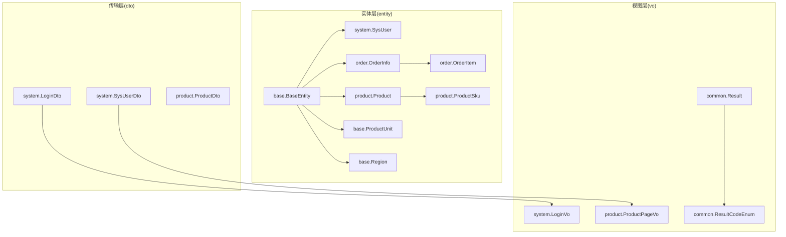
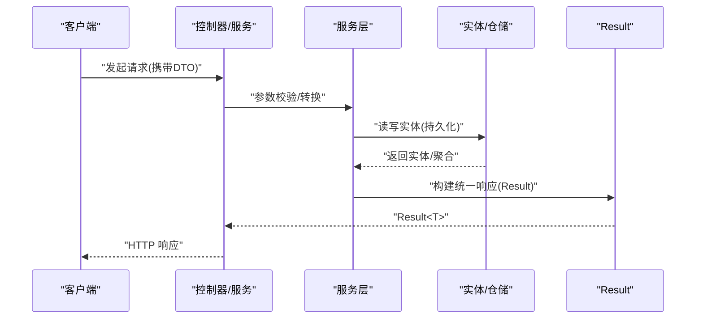
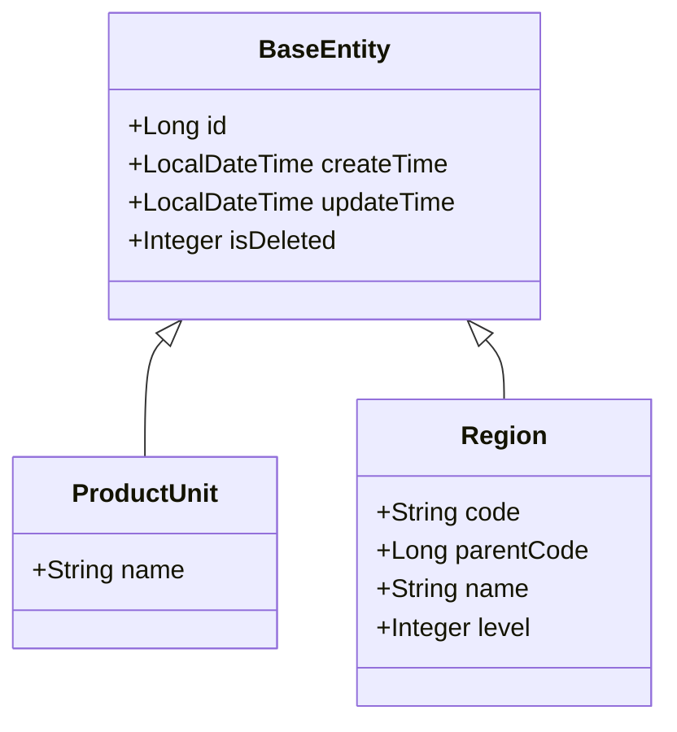
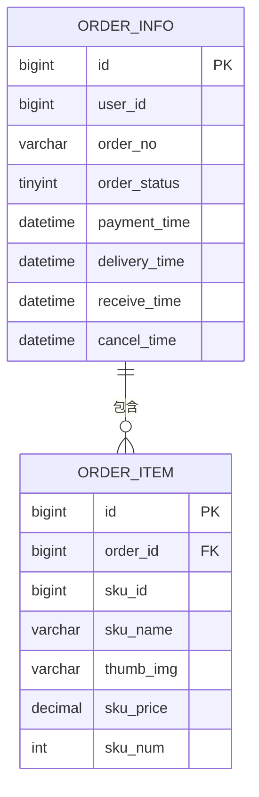
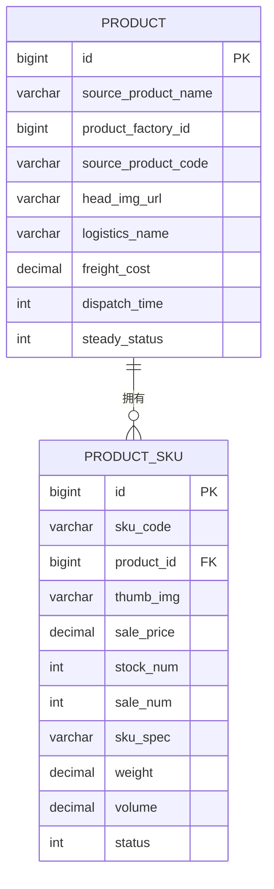
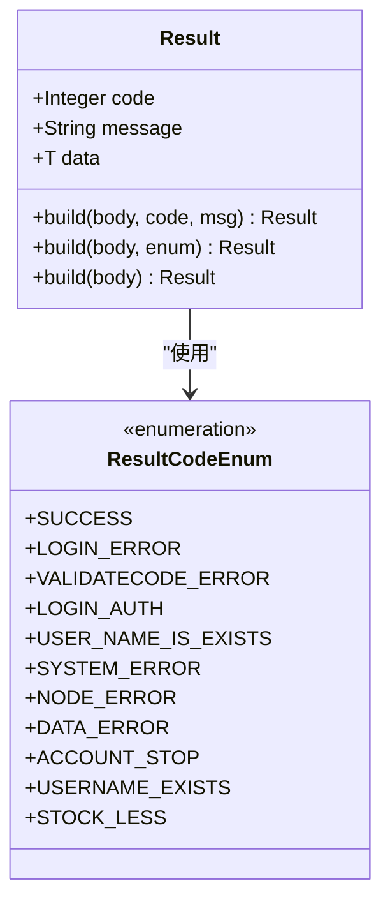
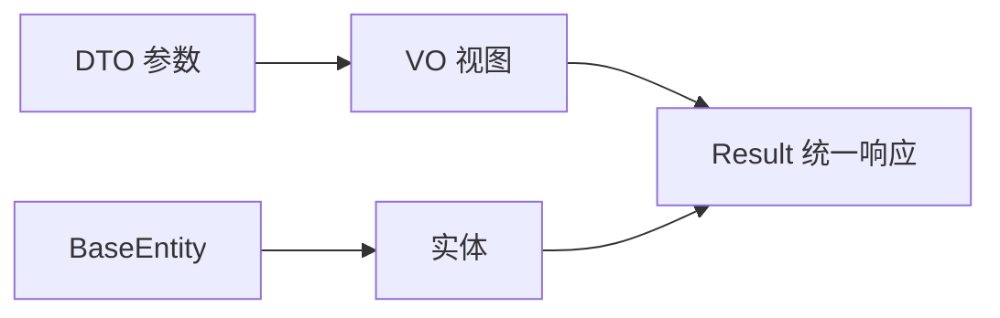

# spzx-model 数据模型模块

<cite>
**本文引用的文件**
- [BaseEntity.java](file://spzx-model/src/main/java/com/joker/spzx/model/entity/base/BaseEntity.java)
- [ProductUnit.java](file://spzx-model/src/main/java/com/joker/spzx/model/entity/base/ProductUnit.java)
- [Region.java](file://spzx-model/src/main/java/com/joker/spzx/model/entity/base/Region.java)
- [SysUser.java](file://spzx-model/src/main/java/com/joker/spzx/model/entity/system/SysUser.java)
- [OrderInfo.java](file://spzx-model/src/main/java/com/joker/spzx/model/entity/order/OrderInfo.java)
- [OrderItem.java](file://spzx-model/src/main/java/com/joker/spzx/model/entity/order/OrderItem.java)
- [Product.java](file://spzx-model/src/main/java/com/joker/spzx/model/entity/product/Product.java)
- [ProductSku.java](file://spzx-model/src/main/java/com/joker/spzx/model/entity/product/ProductSku.java)
- [LoginDto.java](file://spzx-model/src/main/java/com/joker/spzx/model/dto/system/LoginDto.java)
- [SysUserDto.java](file://spzx-model/src/main/java/com/joker/spzx/model/dto/system/SysUserDto.java)
- [ProductDto.java](file://spzx-model/src/main/java/com/joker/spzx/model/dto/product/ProductDto.java)
- [LoginVo.java](file://spzx-model/src/main/java/com/joker/spzx/model/vo/system/LoginVo.java)
- [ProductPageVo.java](file://spzx-model/src/main/java/com/joker/spzx/model/vo/product/ProductPageVo.java)
- [Result.java](file://spzx-model/src/main/java/com/joker/spzx/model/vo/common/Result.java)
- [ResultCodeEnum.java](file://spzx-model/src/main/java/com/joker/spzx/model/vo/common/ResultCodeEnum.java)
</cite>

## 目录
1. [简介](#简介)
2. [项目结构](#项目结构)
3. [核心组件](#核心组件)
4. [架构总览](#架构总览)
5. [详细组件分析](#详细组件分析)
6. [依赖分析](#依赖分析)
7. [性能考虑](#性能考虑)
8. [故障排查指南](#故障排查指南)
9. [结论](#结论)
10. [附录](#附录)

## 简介
本文件面向 spzx-model 数据模型模块，系统性梳理实体模型设计原则、DTO/VO 数据传输对象结构、枚举类型与基础模型抽象，并结合实体类字段定义、注解使用、主键策略与外键关系进行深入解析。同时，阐明 DTO 和 VO 在不同层级间的数据传递作用，以及 Result 统一响应包装机制。文档提供实体关系图、数据模型设计规范与最佳实践，辅以具体实体类示例与使用场景，帮助开发者快速理解并正确应用该模块。

## 项目结构
spzx-model 模块采用按领域分层的包组织方式：
- entity：持久化实体，按业务域细分（如 system、order、product、base 等）
- dto：请求/查询参数对象，按业务域细分（如 system、product、order 等）
- vo：对外输出视图对象，按业务域细分（如 system、product、common 等）

图表来源
- [BaseEntity.java:1-34](file://spzx-model/src/main/java/com/joker/spzx/model/entity/base/BaseEntity.java#L1-L34)
- [SysUser.java:1-42](file://spzx-model/src/main/java/com/joker/spzx/model/entity/system/SysUser.java#L1-L42)
- [OrderInfo.java:1-113](file://spzx-model/src/main/java/com/joker/spzx/model/entity/order/OrderInfo.java#L1-L113)
- [OrderItem.java:1-42](file://spzx-model/src/main/java/com/joker/spzx/model/entity/order/OrderItem.java#L1-L42)
- [Product.java:1-58](file://spzx-model/src/main/java/com/joker/spzx/model/entity/product/Product.java#L1-L58)
- [ProductSku.java:1-68](file://spzx-model/src/main/java/com/joker/spzx/model/entity/product/ProductSku.java#L1-L68)
- [LoginDto.java:1-28](file://spzx-model/src/main/java/com/joker/spzx/model/dto/system/LoginDto.java#L1-L28)
- [SysUserDto.java:1-20](file://spzx-model/src/main/java/com/joker/spzx/model/dto/system/SysUserDto.java#L1-L20)
- [ProductDto.java:1-24](file://spzx-model/src/main/java/com/joker/spzx/model/dto/product/ProductDto.java#L1-L24)
- [LoginVo.java:1-17](file://spzx-model/src/main/java/com/joker/spzx/model/vo/system/LoginVo.java#L1-L17)
- [ProductPageVo.java:1-46](file://spzx-model/src/main/java/com/joker/spzx/model/vo/product/ProductPageVo.java#L1-L46)
- [Result.java:1-45](file://spzx-model/src/main/java/com/joker/spzx/model/vo/common/Result.java#L1-L45)
- [ResultCodeEnum.java:1-32](file://spzx-model/src/main/java/com/joker/spzx/model/vo/common/ResultCodeEnum.java#L1-L32)

章节来源
- [BaseEntity.java:1-34](file://spzx-model/src/main/java/com/joker/spzx/model/entity/base/BaseEntity.java#L1-L34)
- [SysUser.java:1-42](file://spzx-model/src/main/java/com/joker/spzx/model/entity/system/SysUser.java#L1-L42)
- [OrderInfo.java:1-113](file://spzx-model/src/main/java/com/joker/spzx/model/entity/order/OrderInfo.java#L1-L113)
- [OrderItem.java:1-42](file://spzx-model/src/main/java/com/joker/spzx/model/entity/order/OrderItem.java#L1-L42)
- [Product.java:1-58](file://spzx-model/src/main/java/com/joker/spzx/model/entity/product/Product.java#L1-L58)
- [ProductSku.java:1-68](file://spzx-model/src/main/java/com/joker/spzx/model/entity/product/ProductSku.java#L1-L68)
- [LoginDto.java:1-28](file://spzx-model/src/main/java/com/joker/spzx/model/dto/system/LoginDto.java#L1-L28)
- [SysUserDto.java:1-20](file://spzx-model/src/main/java/com/joker/spzx/model/dto/system/SysUserDto.java#L1-L20)
- [ProductDto.java:1-24](file://spzx-model/src/main/java/com/joker/spzx/model/dto/product/ProductDto.java#L1-L24)
- [LoginVo.java:1-17](file://spzx-model/src/main/java/com/joker/spzx/model/vo/system/LoginVo.java#L1-L17)
- [ProductPageVo.java:1-46](file://spzx-model/src/main/java/com/joker/spzx/model/vo/product/ProductPageVo.java#L1-L46)
- [Result.java:1-45](file://spzx-model/src/main/java/com/joker/spzx/model/vo/common/Result.java#L1-L45)
- [ResultCodeEnum.java:1-32](file://spzx-model/src/main/java/com/joker/spzx/model/vo/common/ResultCodeEnum.java#L1-L32)

## 核心组件
- 基础模型抽象
  - BaseEntity：统一的持久化基类，提供通用主键、创建/更新时间、逻辑删除等字段及注解，所有实体继承该类以复用公共能力。
  - ProductUnit、Region：扩展 BaseEntity 的业务基础实体，用于产品单位与区域管理等通用维度。
- 实体模型
  - 系统域：SysUser 用户实体，承载用户基本信息与状态。
  - 订单域：OrderInfo 订单主表、OrderItem 订单明细，体现一对多关系。
  - 商品域：Product 商品、ProductSku SKU，体现商品与 SKU 的一对多关系。
- DTO/VO
  - DTO：LoginDto 登录参数、SysUserDto 查询参数、ProductDto 商品查询参数等，用于接收前端或上层调用传入的参数。
  - VO：LoginVo 登录成功返回令牌、ProductPageVo 商品分页展示字段集合等，用于对外输出。
  - Result/ResultCodeEnum：统一响应封装与状态码枚举，保证接口返回风格一致。
- 注解与约定
  - 使用 MyBatis-Plus 注解标注表名、字段映射与主键策略。
  - 使用 Swagger 注解标注字段含义，便于接口文档生成。
  - 使用 Lombok 注解简化 POJO 构造与访问器。

章节来源
- [BaseEntity.java:1-34](file://spzx-model/src/main/java/com/joker/spzx/model/entity/base/BaseEntity.java#L1-L34)
- [ProductUnit.java:1-13](file://spzx-model/src/main/java/com/joker/spzx/model/entity/base/ProductUnit.java#L1-L13)
- [Region.java:1-22](file://spzx-model/src/main/java/com/joker/spzx/model/entity/base/Region.java#L1-L22)
- [SysUser.java:1-42](file://spzx-model/src/main/java/com/joker/spzx/model/entity/system/SysUser.java#L1-L42)
- [OrderInfo.java:1-113](file://spzx-model/src/main/java/com/joker/spzx/model/entity/order/OrderInfo.java#L1-L113)
- [OrderItem.java:1-42](file://spzx-model/src/main/java/com/joker/spzx/model/entity/order/OrderItem.java#L1-L42)
- [Product.java:1-58](file://spzx-model/src/main/java/com/joker/spzx/model/entity/product/Product.java#L1-L58)
- [ProductSku.java:1-68](file://spzx-model/src/main/java/com/joker/spzx/model/entity/product/ProductSku.java#L1-L68)
- [LoginDto.java:1-28](file://spzx-model/src/main/java/com/joker/spzx/model/dto/system/LoginDto.java#L1-L28)
- [SysUserDto.java:1-20](file://spzx-model/src/main/java/com/joker/spzx/model/dto/system/SysUserDto.java#L1-L20)
- [ProductDto.java:1-24](file://spzx-model/src/main/java/com/joker/spzx/model/dto/product/ProductDto.java#L1-L24)
- [LoginVo.java:1-17](file://spzx-model/src/main/java/com/joker/spzx/model/vo/system/LoginVo.java#L1-L17)
- [ProductPageVo.java:1-46](file://spzx-model/src/main/java/com/joker/spzx/model/vo/product/ProductPageVo.java#L1-L46)
- [Result.java:1-45](file://spzx-model/src/main/java/com/joker/spzx/model/vo/common/Result.java#L1-L45)
- [ResultCodeEnum.java:1-32](file://spzx-model/src/main/java/com/joker/spzx/model/vo/common/ResultCodeEnum.java#L1-L32)

## 架构总览
统一的“实体-传输-视图”三层模型贯穿系统：
- 实体层：承载数据库映射与业务语义，统一继承 BaseEntity。
- 传输层：DTO 接收参数，避免直接暴露实体细节。
- 视图层：VO 输出数据，封装对外展示所需字段与格式。
- 统一响应：Result 封装 code/message/data，ResultCodeEnum 提供标准状态码。

图表来源
- [LoginDto.java:1-28](file://spzx-model/src/main/java/com/joker/spzx/model/dto/system/LoginDto.java#L1-L28)
- [LoginVo.java:1-17](file://spzx-model/src/main/java/com/joker/spzx/model/vo/system/LoginVo.java#L1-L17)
- [Result.java:1-45](file://spzx-model/src/main/java/com/joker/spzx/model/vo/common/Result.java#L1-L45)
- [ResultCodeEnum.java:1-32](file://spzx-model/src/main/java/com/joker/spzx/model/vo/common/ResultCodeEnum.java#L1-L32)

## 详细组件分析

### 基础模型抽象：BaseEntity 及其扩展
- 设计原则
  - 统一主键策略：自增主键，减少业务耦合。
  - 时间字段标准化：创建/更新时间统一格式化输出。
  - 逻辑删除：isDeleted 字段支持软删除，便于审计与恢复。
- 扩展实体
  - ProductUnit：产品单位，继承 BaseEntity，扩展名称字段。
  - Region：区域实体，继承 BaseEntity，扩展编码、父编码、名称与级别等地理层级字段。

图表来源
- [BaseEntity.java:1-34](file://spzx-model/src/main/java/com/joker/spzx/model/entity/base/BaseEntity.java#L1-L34)
- [ProductUnit.java:1-13](file://spzx-model/src/main/java/com/joker/spzx/model/entity/base/ProductUnit.java#L1-L13)
- [Region.java:1-22](file://spzx-model/src/main/java/com/joker/spzx/model/entity/base/Region.java#L1-L22)

章节来源
- [BaseEntity.java:1-34](file://spzx-model/src/main/java/com/joker/spzx/model/entity/base/BaseEntity.java#L1-L34)
- [ProductUnit.java:1-13](file://spzx-model/src/main/java/com/joker/spzx/model/entity/base/ProductUnit.java#L1-L13)
- [Region.java:1-22](file://spzx-model/src/main/java/com/joker/spzx/model/entity/base/Region.java#L1-L22)

### 系统域实体：SysUser
- 字段说明
  - 用户名、密码、姓名、手机号、头像、描述、状态等，均通过注解映射到 sys_user 表字段。
- 设计要点
  - 密码等敏感字段不建议在 VO 中直接返回，需在安全策略下处理。
  - 状态字段建议使用枚举或字典管理，避免魔法数字。

章节来源
- [SysUser.java:1-42](file://spzx-model/src/main/java/com/joker/spzx/model/entity/system/SysUser.java#L1-L42)

### 订单域实体：OrderInfo 与 OrderItem
- 关系说明
  - OrderInfo 为主单，OrderItem 为明细，二者通过 orderId 建立一对多关联。
- 字段要点
  - 订单状态、支付方式、收货信息、时间戳、优惠与金额等字段完整覆盖订单生命周期。
  - 明细包含 SKU 编号、名称、图片、单价与数量等，支撑订单详情展示。
- 复杂度与性能
  - 订单查询常伴随明细加载，建议分页与懒加载策略，避免 N+1 查询。

图表来源
- [OrderInfo.java:1-113](file://spzx-model/src/main/java/com/joker/spzx/model/entity/order/OrderInfo.java#L1-L113)
- [OrderItem.java:1-42](file://spzx-model/src/main/java/com/joker/spzx/model/entity/order/OrderItem.java#L1-L42)

章节来源
- [OrderInfo.java:1-113](file://spzx-model/src/main/java/com/joker/spzx/model/entity/order/OrderInfo.java#L1-L113)
- [OrderItem.java:1-42](file://spzx-model/src/main/java/com/joker/spzx/model/entity/order/OrderItem.java#L1-L42)

### 商品域实体：Product 与 ProductSku
- 关系说明
  - Product 为商品主信息，ProductSku 为具体销售单元，二者通过 productId 建立一对多关联。
- 字段要点
  - 商品包含货源信息、头图、物流与费用、稳定性状态、创建/更新人等。
  - SKU 包含价格、库存、销量、规格、重量/体积、上下架状态等。
- 设计建议
  - SKU 作为高频交易单元，建议对关键字段建立索引，提升查询与扣减效率。

图表来源
- [Product.java:1-58](file://spzx-model/src/main/java/com/joker/spzx/model/entity/product/Product.java#L1-L58)
- [ProductSku.java:1-68](file://spzx-model/src/main/java/com/joker/spzx/model/entity/product/ProductSku.java#L1-L68)

章节来源
- [Product.java:1-58](file://spzx-model/src/main/java/com/joker/spzx/model/entity/product/Product.java#L1-L58)
- [ProductSku.java:1-68](file://spzx-model/src/main/java/com/joker/spzx/model/entity/product/ProductSku.java#L1-L68)

### DTO/VO 与统一响应

#### DTO：参数与查询载体
- LoginDto：登录请求参数，包含用户名、密码、验证码与验证码 key，使用非空校验注解保障输入合法性。
- SysUserDto：系统用户查询参数，支持关键词与时间范围筛选。
- ProductDto：商品查询参数，继承分页参数，支持货源名称/编码、工厂 ID、稳定状态等过滤条件。

章节来源
- [LoginDto.java:1-28](file://spzx-model/src/main/java/com/joker/spzx/model/dto/system/LoginDto.java#L1-L28)
- [SysUserDto.java:1-20](file://spzx-model/src/main/java/com/joker/spzx/model/dto/system/SysUserDto.java#L1-L20)
- [ProductDto.java:1-24](file://spzx-model/src/main/java/com/joker/spzx/model/dto/product/ProductDto.java#L1-L24)

#### VO：对外输出载体
- LoginVo：登录成功返回 token 与 refresh_token。
- ProductPageVo：商品分页展示字段集合，包含货源信息、图片、物流、费用与稳定性状态等。

章节来源
- [LoginVo.java:1-17](file://spzx-model/src/main/java/com/joker/spzx/model/vo/system/LoginVo.java#L1-L17)
- [ProductPageVo.java:1-46](file://spzx-model/src/main/java/com/joker/spzx/model/vo/product/ProductPageVo.java#L1-L46)

#### 统一响应：Result 与 ResultCodeEnum
- Result：泛型封装 code、message、data，提供多种静态构建方法，支持通过枚举设置状态码与消息。
- ResultCodeEnum：集中定义业务状态码与消息，覆盖登录、验证码、权限、数据异常、库存不足等场景。

图表来源
- [Result.java:1-45](file://spzx-model/src/main/java/com/joker/spzx/model/vo/common/Result.java#L1-L45)
- [ResultCodeEnum.java:1-32](file://spzx-model/src/main/java/com/joker/spzx/model/vo/common/ResultCodeEnum.java#L1-L32)

章节来源
- [Result.java:1-45](file://spzx-model/src/main/java/com/joker/spzx/model/vo/common/Result.java#L1-L45)
- [ResultCodeEnum.java:1-32](file://spzx-model/src/main/java/com/joker/spzx/model/vo/common/ResultCodeEnum.java#L1-L32)

## 依赖分析
- 内聚与耦合
  - 实体层内聚于业务语义，通过 BaseEntity 统一公共字段，降低重复。
  - DTO/VO 与实体解耦，仅传递必要字段，避免泄露内部结构。
- 外部依赖
  - MyBatis-Plus 注解驱动 ORM 映射。
  - Swagger 注解辅助接口文档生成。
  - Lombok 简化 POJO 开发。
- 循环依赖
  - 当前结构未见循环依赖，各层职责清晰。

图表来源
- [BaseEntity.java:1-34](file://spzx-model/src/main/java/com/joker/spzx/model/entity/base/BaseEntity.java#L1-L34)
- [Result.java:1-45](file://spzx-model/src/main/java/com/joker/spzx/model/vo/common/Result.java#L1-L45)

章节来源
- [BaseEntity.java:1-34](file://spzx-model/src/main/java/com/joker/spzx/model/entity/base/BaseEntity.java#L1-L34)
- [Result.java:1-45](file://spzx-model/src/main/java/com/joker/spzx/model/vo/common/Result.java#L1-L45)

## 性能考虑
- 查询优化
  - 对高频过滤字段（如订单状态、用户 ID、SKU 编码）建立索引。
  - 分页查询时避免 SELECT *，仅取必要字段。
- 关联查询
  - 订单明细加载建议按需分页，避免一次性拉取大量明细导致内存压力。
- 写入优化
  - 批量插入/更新时使用 MyBatis-Plus 批处理能力，减少往返。
- 缓存策略
  - SKU 库存、商品基础信息可引入缓存，注意缓存一致性与过期策略。

## 故障排查指南
- 常见问题
  - 字段映射失败：检查实体注解中的表名与字段名是否与数据库一致。
  - 主键冲突：确认主键策略与数据导入流程，避免手动指定自增主键。
  - 统一响应缺失：确保服务层始终通过 Result 构建返回，避免直接抛出异常。
- 定位手段
  - 查看 ResultCodeEnum 中对应的状态码与提示，快速定位业务错误类型。
  - 结合 DTO 参数校验注解，排查输入非法导致的异常。

章节来源
- [ResultCodeEnum.java:1-32](file://spzx-model/src/main/java/com/joker/spzx/model/vo/common/ResultCodeEnum.java#L1-L32)
- [LoginDto.java:1-28](file://spzx-model/src/main/java/com/joker/spzx/model/dto/system/LoginDto.java#L1-L28)

## 结论
spzx-model 模块通过 BaseEntity 抽象与清晰的分层设计，实现了实体、DTO/VO 与统一响应的一致性与可维护性。围绕订单与商品两大核心域，建立了稳定的实体关系与数据流转规范。建议在实际开发中严格遵循字段命名规范、注解使用约定与统一响应机制，持续优化查询与写入性能，并加强缓存与一致性策略，以支撑高并发场景下的稳定运行。

## 附录
- 设计规范与最佳实践
  - 字段命名：采用下划线风格，与数据库字段保持一致。
  - 注解使用：MyBatis-Plus 注解明确表/字段映射；Swagger 注解完善文档；Lombok 简化代码。
  - 主键策略：优先使用自增主键，避免跨库分片带来的复杂性。
  - 外键关系：通过实体字段与注解表达关系，DAO 层负责具体关联查询。
  - 统一响应：所有接口必须返回 Result，状态码来自 ResultCodeEnum。
  - DTO/VO：仅传递必要字段，避免过度映射与信息泄露。