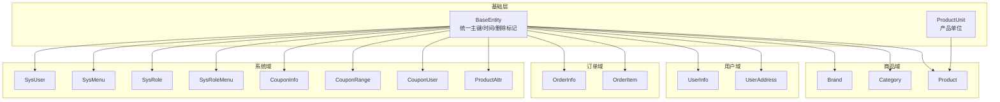
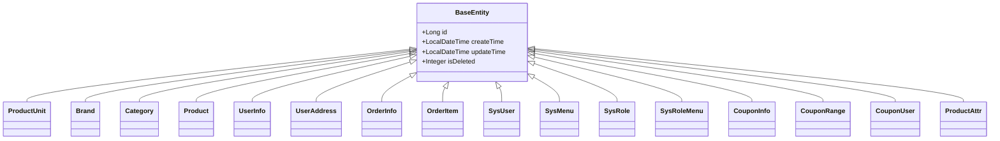
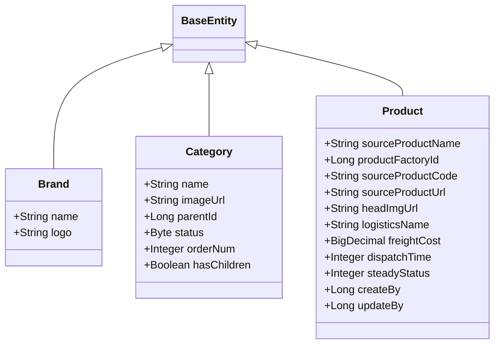
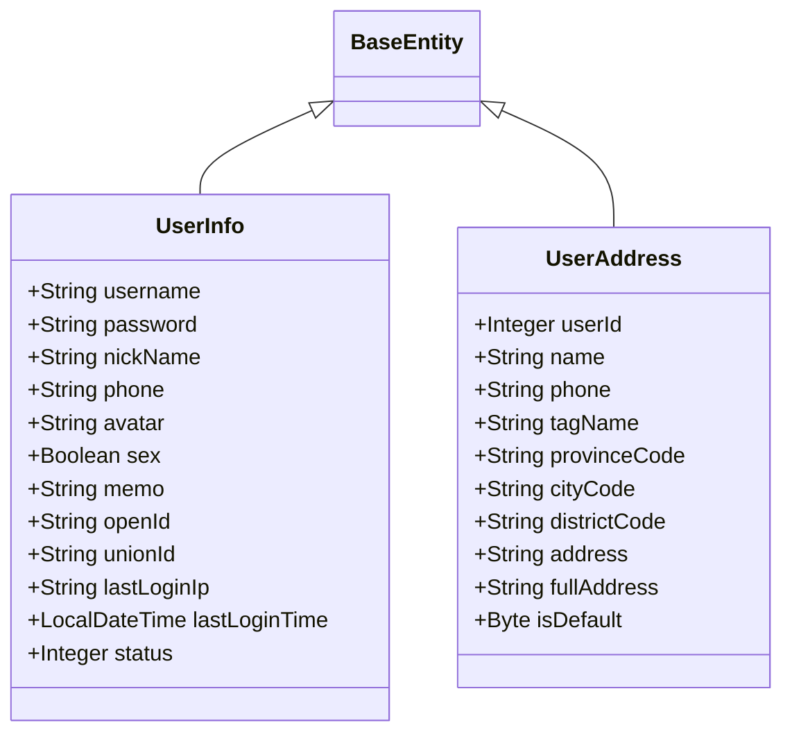
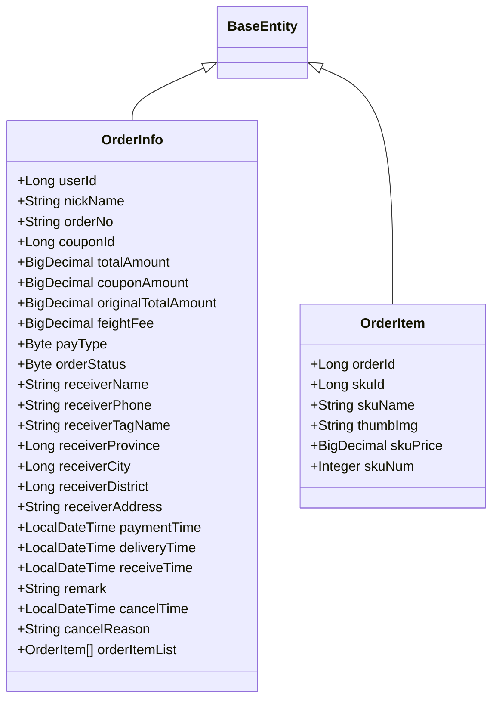
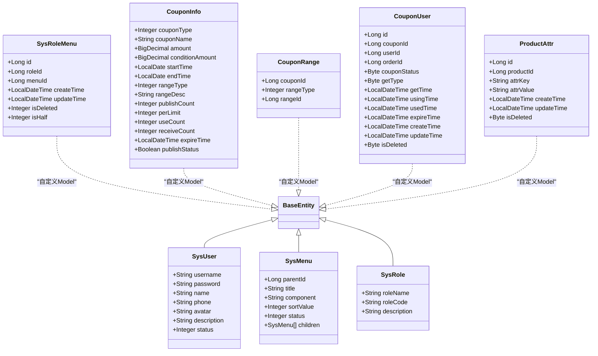
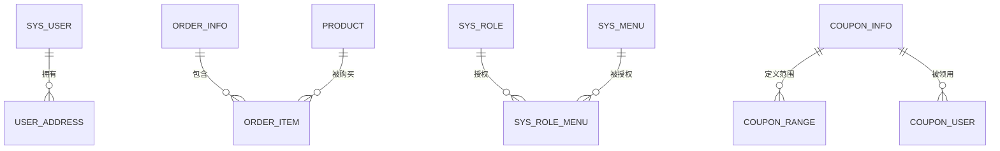
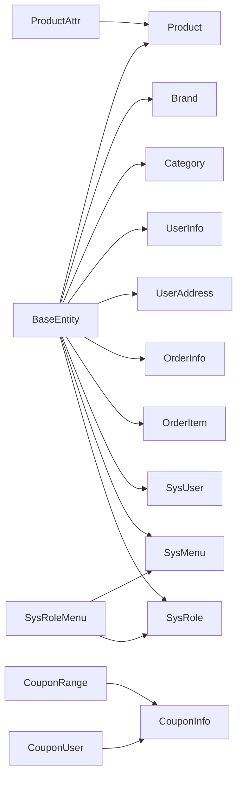

# 实体模型设计

<cite>
**本文引用的文件**
- [BaseEntity.java](file://spzx-model/src/main/java/com/joker/spzx/model/entity/base/BaseEntity.java)
- [Product.java](file://spzx-model/src/main/java/com/joker/spzx/model/entity/product/Product.java)
- [Brand.java](file://spzx-model/src/main/java/com/joker/spzx/model/entity/product/Brand.java)
- [Category.java](file://spzx-model/src/main/java/com/joker/spzx/model/entity/product/Category.java)
- [UserInfo.java](file://spzx-model/src/main/java/com/joker/spzx/model/entity/user/UserInfo.java)
- [UserAddress.java](file://spzx-model/src/main/java/com/joker/spzx/model/entity/user/UserAddress.java)
- [OrderInfo.java](file://spzx-model/src/main/java/com/joker/spzx/model/entity/order/OrderInfo.java)
- [OrderItem.java](file://spzx-model/src/main/java/com/joker/spzx/model/entity/order/OrderItem.java)
- [SysUser.java](file://spzx-model/src/main/java/com/joker/spzx/model/entity/system/SysUser.java)
- [SysMenu.java](file://spzx-model/src/main/java/com/joker/spzx/model/entity/system/SysMenu.java)
- [SysRole.java](file://spzx-model/src/main/java/com/joker/spzx/model/entity/system/SysRole.java)
- [SysRoleMenu.java](file://spzx-model/src/main/java/com/joker/spzx/model/entity/system/SysRoleMenu.java)
- [CouponInfo.java](file://spzx-model/src/main/java/com/joker/spzx/model/entity/system/CouponInfo.java)
- [CouponRange.java](file://spzx-model/src/main/java/com/joker/spzx/model/entity/system/CouponRange.java)
- [CouponUser.java](file://spzx-model/src/main/java/com/joker/spzx/model/entity/system/CouponUser.java)
- [ProductAttr.java](file://spzx-model/src/main/java/com/joker/spzx/model/entity/system/ProductAttr.java)
- [ProductUnit.java](file://spzx-model/src/main/java/com/joker/spzx/model/entity/base/ProductUnit.java)
</cite>

## 目录
1. [引言](#引言)
2. [项目结构](#项目结构)
3. [核心组件](#核心组件)
4. [架构总览](#架构总览)
5. [详细组件分析](#详细组件分析)
6. [依赖分析](#依赖分析)
7. [性能考虑](#性能考虑)
8. [故障排查指南](#故障排查指南)
9. [结论](#结论)
10. [附录](#附录)

## 引言
本文件面向后端与全栈开发者，系统化梳理实体模型设计，重点解析基础抽象类 BaseEntity 的设计理念与通用字段，以及商品、用户、订单、系统管理等模块的实体字段、注解使用、主键策略与外键关系。文档通过类图、时序图与流程图，帮助读者快速掌握数据模型的设计原则与最佳实践。

## 项目结构
实体模型位于 spzx-model 模块的 entity 包中，按领域分层组织：
- base：基础抽象与通用单元
- product：商品相关（品牌、分类、商品、SKU、规格、绑定关系、详情）
- user：用户相关（用户、地址、浏览历史、收藏、消费记录）
- order：订单相关（订单、订单项、日志、统计、支付）
- system：系统管理（用户、菜单、角色、字典、操作日志、登录日志、优惠券、商品属性等）
- h5、oper、pay：前端交互、运营支撑、支付相关扩展实体

图表来源
- [BaseEntity.java:1-34](file://spzx-model/src/main/java/com/joker/spzx/model/entity/base/BaseEntity.java#L1-L34)
- [Product.java:1-58](file://spzx-model/src/main/java/com/joker/spzx/model/entity/product/Product.java#L1-L58)
- [Brand.java:1-21](file://spzx-model/src/main/java/com/joker/spzx/model/entity/product/Brand.java#L1-L21)
- [Category.java:1-43](file://spzx-model/src/main/java/com/joker/spzx/model/entity/product/Category.java#L1-L43)
- [UserInfo.java:1-64](file://spzx-model/src/main/java/com/joker/spzx/model/entity/user/UserInfo.java#L1-L64)
- [UserAddress.java:1-51](file://spzx-model/src/main/java/com/joker/spzx/model/entity/user/UserAddress.java#L1-L51)
- [OrderInfo.java:1-113](file://spzx-model/src/main/java/com/joker/spzx/model/entity/order/OrderInfo.java#L1-L113)
- [OrderItem.java:1-42](file://spzx-model/src/main/java/com/joker/spzx/model/entity/order/OrderItem.java#L1-L42)
- [SysUser.java:1-42](file://spzx-model/src/main/java/com/joker/spzx/model/entity/system/SysUser.java#L1-L42)
- [SysMenu.java:1-41](file://spzx-model/src/main/java/com/joker/spzx/model/entity/system/SysMenu.java#L1-L41)
- [SysRole.java:1-28](file://spzx-model/src/main/java/com/joker/spzx/model/entity/system/SysRole.java#L1-L28)
- [SysRoleMenu.java:1-60](file://spzx-model/src/main/java/com/joker/spzx/model/entity/system/SysRoleMenu.java#L1-L60)
- [CouponInfo.java:1-85](file://spzx-model/src/main/java/com/joker/spzx/model/entity/system/CouponInfo.java#L1-L85)
- [CouponRange.java:1-38](file://spzx-model/src/main/java/com/joker/spzx/model/entity/system/CouponRange.java#L1-L38)
- [CouponUser.java:1-88](file://spzx-model/src/main/java/com/joker/spzx/model/entity/system/CouponUser.java#L1-L88)
- [ProductAttr.java:1-64](file://spzx-model/src/main/java/com/joker/spzx/model/entity/system/ProductAttr.java#L1-L64)

章节来源
- [BaseEntity.java:1-34](file://spzx-model/src/main/java/com/joker/spzx/model/entity/base/BaseEntity.java#L1-L34)

## 核心组件
- 基础抽象类 BaseEntity
  - 统一主键 id（自增）、创建时间、更新时间、逻辑删除标记 is_deleted
  - 使用 MyBatis-Plus 注解映射数据库字段，支持 Swagger 文档注解
  - 扩展 Model，便于单表 CRUD 便捷调用
- 产品单位 ProductUnit
  - 继承 BaseEntity，提供通用单位实体能力

章节来源
- [BaseEntity.java:1-34](file://spzx-model/src/main/java/com/joker/spzx/model/entity/base/BaseEntity.java#L1-L34)
- [ProductUnit.java:1-13](file://spzx-model/src/main/java/com/joker/spzx/model/entity/base/ProductUnit.java#L1-L13)

## 架构总览
实体层采用“基础抽象 + 领域细分”的分层设计，所有业务实体均继承 BaseEntity，确保一致的时间与删除语义。系统域、商品域、用户域、订单域分别封装各自领域的实体与关系，避免跨域耦合。

图表来源
- [BaseEntity.java:1-34](file://spzx-model/src/main/java/com/joker/spzx/model/entity/base/BaseEntity.java#L1-L34)
- [ProductUnit.java:1-13](file://spzx-model/src/main/java/com/joker/spzx/model/entity/base/ProductUnit.java#L1-L13)
- [Product.java:1-58](file://spzx-model/src/main/java/com/joker/spzx/model/entity/product/Product.java#L1-L58)
- [Brand.java:1-21](file://spzx-model/src/main/java/com/joker/spzx/model/entity/product/Brand.java#L1-L21)
- [Category.java:1-43](file://spzx-model/src/main/java/com/joker/spzx/model/entity/product/Category.java#L1-L43)
- [UserInfo.java:1-64](file://spzx-model/src/main/java/com/joker/spzx/model/entity/user/UserInfo.java#L1-L64)
- [UserAddress.java:1-51](file://spzx-model/src/main/java/com/joker/spzx/model/entity/user/UserAddress.java#L1-L51)
- [OrderInfo.java:1-113](file://spzx-model/src/main/java/com/joker/spzx/model/entity/order/OrderInfo.java#L1-L113)
- [OrderItem.java:1-42](file://spzx-model/src/main/java/com/joker/spzx/model/entity/order/OrderItem.java#L1-L42)
- [SysUser.java:1-42](file://spzx-model/src/main/java/com/joker/spzx/model/entity/system/SysUser.java#L1-L42)
- [SysMenu.java:1-41](file://spzx-model/src/main/java/com/joker/spzx/model/entity/system/SysMenu.java#L1-L41)
- [SysRole.java:1-28](file://spzx-model/src/main/java/com/joker/spzx/model/entity/system/SysRole.java#L1-L28)
- [SysRoleMenu.java:1-60](file://spzx-model/src/main/java/com/joker/spzx/model/entity/system/SysRoleMenu.java#L1-L60)
- [CouponInfo.java:1-85](file://spzx-model/src/main/java/com/joker/spzx/model/entity/system/CouponInfo.java#L1-L85)
- [CouponRange.java:1-38](file://spzx-model/src/main/java/com/joker/spzx/model/entity/system/CouponRange.java#L1-L38)
- [CouponUser.java:1-88](file://spzx-model/src/main/java/com/joker/spzx/model/entity/system/CouponUser.java#L1-L88)
- [ProductAttr.java:1-64](file://spzx-model/src/main/java/com/joker/spzx/model/entity/system/ProductAttr.java#L1-L64)

## 详细组件分析

### 基础抽象类 BaseEntity 设计
- 字段与注解
  - 主键：@TableId(value = "id", type = IdType.AUTO)，统一自增主键策略
  - 创建/更新时间：@TableField("create_time"/"update_time")，JSON 序列化格式化
  - 逻辑删除：@TableField("is_deleted")，统一软删除标记
- 设计理念
  - 通过继承实现“横切关注点”复用，减少重复代码
  - 保持数据库字段命名规范与接口文档一致性
- 使用建议
  - 新增实体优先继承 BaseEntity
  - 对于需要独立主键策略或非软删除的表，可直接声明字段并覆盖注解

章节来源
- [BaseEntity.java:1-34](file://spzx-model/src/main/java/com/joker/spzx/model/entity/base/BaseEntity.java#L1-L34)

### 商品相关实体
- 品牌 Brand
  - 表名：brand；字段：name、logo
  - 继承 BaseEntity，具备统一主键与时间戳
- 分类 Category
  - 表名：category；字段：name、imageUrl、parentId、status、orderNum
  - hasChildren、children 为存在性与树形结构的内存字段（exist = false）
- 商品 Product
  - 表名：product；字段：sourceProductName、productFactoryId、sourceProductCode、sourceProductUrl、headImgUrl、logisticsName、freightCost、dispatchTime、steadyStatus、createBy、updateBy
  - 继承 BaseEntity，扩展业务关键字段

图表来源
- [Brand.java:1-21](file://spzx-model/src/main/java/com/joker/spzx/model/entity/product/Brand.java#L1-L21)
- [Category.java:1-43](file://spzx-model/src/main/java/com/joker/spzx/model/entity/product/Category.java#L1-L43)
- [Product.java:1-58](file://spzx-model/src/main/java/com/joker/spzx/model/entity/product/Product.java#L1-L58)

章节来源
- [Brand.java:1-21](file://spzx-model/src/main/java/com/joker/spzx/model/entity/product/Brand.java#L1-L21)
- [Category.java:1-43](file://spzx-model/src/main/java/com/joker/spzx/model/entity/product/Category.java#L1-L43)
- [Product.java:1-58](file://spzx-model/src/main/java/com/joker/spzx/model/entity/product/Product.java#L1-L58)

### 用户相关实体
- 用户 UserInfo
  - 表名：user_info；字段：username、password、nickName、phone、avatar、sex、memo、openId、unionId、lastLoginIp、lastLoginTime、status
  - 继承 BaseEntity，扩展用户认证与状态字段
- 用户地址 UserAddress
  - 表名：user_address；字段：userId、name、phone、tagName、provinceCode、cityCode、districtCode、address、fullAddress、isDefault
  - 继承 BaseEntity，扩展地址与默认标记

图表来源
- [UserInfo.java:1-64](file://spzx-model/src/main/java/com/joker/spzx/model/entity/user/UserInfo.java#L1-L64)
- [UserAddress.java:1-51](file://spzx-model/src/main/java/com/joker/spzx/model/entity/user/UserAddress.java#L1-L51)

章节来源
- [UserInfo.java:1-64](file://spzx-model/src/main/java/com/joker/spzx/model/entity/user/UserInfo.java#L1-L64)
- [UserAddress.java:1-51](file://spzx-model/src/main/java/com/joker/spzx/model/entity/user/UserAddress.java#L1-L51)

### 订单相关实体
- 订单 OrderInfo
  - 表名：order_info；字段：userId、nickName、orderNo、couponId、totalAmount、couponAmount、originalTotalAmount、feightFee、payType、orderStatus、receiver_*、paymentTime、deliveryTime、receiveTime、remark、cancelTime、cancelReason
  - 组合字段：orderItemList（内存字段，用于聚合展示）
- 订单项 OrderItem
  - 表名：order_item；字段：orderId、skuId、skuName、thumbImg、skuPrice、skuNum
  - 继承 BaseEntity，体现订单与商品 SKU 的多对一关系

图表来源
- [OrderInfo.java:1-113](file://spzx-model/src/main/java/com/joker/spzx/model/entity/order/OrderInfo.java#L1-L113)
- [OrderItem.java:1-42](file://spzx-model/src/main/java/com/joker/spzx/model/entity/order/OrderItem.java#L1-L42)

章节来源
- [OrderInfo.java:1-113](file://spzx-model/src/main/java/com/joker/spzx/model/entity/order/OrderInfo.java#L1-L113)
- [OrderItem.java:1-42](file://spzx-model/src/main/java/com/joker/spzx/model/entity/order/OrderItem.java#L1-L42)

### 系统管理实体
- 用户 SysUser
  - 表名：sys_user；字段：username、password、name、phone、avatar、description、status
- 菜单 SysMenu
  - 表名：sys_menu；字段：parentId、title、component、sortValue、status
  - children 为树形结构内存字段（exist = false）
- 角色 SysRole
  - 表名：sys_role；字段：roleName、roleCode、description
- 角色-菜单 SysRoleMenu
  - 表名：sys_role_menu；字段：roleId、menuId、createTime、updateTime、isDeleted、isHalf
  - 自定义 Model，显式声明主键与逻辑删除
- 优惠券相关
  - 优惠券信息 CouponInfo：couponType、couponName、amount、conditionAmount、startTime、endTime、rangeType、rangeDesc、publishCount、perLimit、useCount、receiveCount、expireTime、publishStatus
  - 优惠券范围 CouponRange：couponId、rangeType、rangeId
  - 优惠券领用 CouponUser：couponId、userId、orderId、couponStatus、getType、getTime、usingTime、usedTime、expireTime、createTime、updateTime、isDeleted
- 商品属性 ProductAttr
  - 表名：product_attr；字段：productId、attrKey、attrValue、createTime、updateTime、isDeleted

图表来源
- [SysUser.java:1-42](file://spzx-model/src/main/java/com/joker/spzx/model/entity/system/SysUser.java#L1-L42)
- [SysMenu.java:1-41](file://spzx-model/src/main/java/com/joker/spzx/model/entity/system/SysMenu.java#L1-L41)
- [SysRole.java:1-28](file://spzx-model/src/main/java/com/joker/spzx/model/entity/system/SysRole.java#L1-L28)
- [SysRoleMenu.java:1-60](file://spzx-model/src/main/java/com/joker/spzx/model/entity/system/SysRoleMenu.java#L1-L60)
- [CouponInfo.java:1-85](file://spzx-model/src/main/java/com/joker/spzx/model/entity/system/CouponInfo.java#L1-L85)
- [CouponRange.java:1-38](file://spzx-model/src/main/java/com/joker/spzx/model/entity/system/CouponRange.java#L1-L38)
- [CouponUser.java:1-88](file://spzx-model/src/main/java/com/joker/spzx/model/entity/system/CouponUser.java#L1-L88)
- [ProductAttr.java:1-64](file://spzx-model/src/main/java/com/joker/spzx/model/entity/system/ProductAttr.java#L1-L64)

章节来源
- [SysUser.java:1-42](file://spzx-model/src/main/java/com/joker/spzx/model/entity/system/SysUser.java#L1-L42)
- [SysMenu.java:1-41](file://spzx-model/src/main/java/com/joker/spzx/model/entity/system/SysMenu.java#L1-L41)
- [SysRole.java:1-28](file://spzx-model/src/main/java/com/joker/spzx/model/entity/system/SysRole.java#L1-L28)
- [SysRoleMenu.java:1-60](file://spzx-model/src/main/java/com/joker/spzx/model/entity/system/SysRoleMenu.java#L1-L60)
- [CouponInfo.java:1-85](file://spzx-model/src/main/java/com/joker/spzx/model/entity/system/CouponInfo.java#L1-L85)
- [CouponRange.java:1-38](file://spzx-model/src/main/java/com/joker/spzx/model/entity/system/CouponRange.java#L1-L38)
- [CouponUser.java:1-88](file://spzx-model/src/main/java/com/joker/spzx/model/entity/system/CouponUser.java#L1-L88)
- [ProductAttr.java:1-64](file://spzx-model/src/main/java/com/joker/spzx/model/entity/system/ProductAttr.java#L1-L64)

### 关联关系与继承体系
- 继承体系
  - 多数实体继承 BaseEntity，统一主键与时间戳
  - 少量实体（如 SysRoleMenu、CouponInfo/Range/User、ProductAttr）采用 MyBatis-Plus Model 手写主键与逻辑删除
- 关联关系
  - 用户与地址：一对多（用户 -> 地址）
  - 订单与订单项：一对多（订单 -> 订单项）
  - 商品与 SKU：一对多（商品 -> SKU），订单项中以 SKU 维度存储
  - 角色与菜单：多对多（SysRoleMenu 作为中间表）
  - 优惠券与范围：一对多（优惠券 -> 范围）
  - 优惠券与用户：一对一（优惠券 -> 领用记录）

图表来源
- [SysUser.java:1-42](file://spzx-model/src/main/java/com/joker/spzx/model/entity/system/SysUser.java#L1-L42)
- [UserAddress.java:1-51](file://spzx-model/src/main/java/com/joker/spzx/model/entity/user/UserAddress.java#L1-L51)
- [OrderInfo.java:1-113](file://spzx-model/src/main/java/com/joker/spzx/model/entity/order/OrderInfo.java#L1-L113)
- [OrderItem.java:1-42](file://spzx-model/src/main/java/com/joker/spzx/model/entity/order/OrderItem.java#L1-L42)
- [Product.java:1-58](file://spzx-model/src/main/java/com/joker/spzx/model/entity/product/Product.java#L1-L58)
- [SysRole.java:1-28](file://spzx-model/src/main/java/com/joker/spzx/model/entity/system/SysRole.java#L1-L28)
- [SysRoleMenu.java:1-60](file://spzx-model/src/main/java/com/joker/spzx/model/entity/system/SysRoleMenu.java#L1-L60)
- [SysMenu.java:1-41](file://spzx-model/src/main/java/com/joker/spzx/model/entity/system/SysMenu.java#L1-L41)
- [CouponInfo.java:1-85](file://spzx-model/src/main/java/com/joker/spzx/model/entity/system/CouponInfo.java#L1-L85)
- [CouponRange.java:1-38](file://spzx-model/src/main/java/com/joker/spzx/model/entity/system/CouponRange.java#L1-L38)
- [CouponUser.java:1-88](file://spzx-model/src/main/java/com/joker/spzx/model/entity/system/CouponUser.java#L1-L88)

## 依赖分析
- 内聚性
  - 各实体按领域内聚，字段与注解清晰表达业务含义
- 耦合度
  - 通过统一继承 BaseEntity 降低跨表重复代码
  - 中间表（SysRoleMenu、CouponRange、CouponUser）明确多对多关系
- 外部依赖
  - MyBatis-Plus 注解驱动 ORM 映射
  - Swagger 注解用于接口文档生成

图表来源
- [BaseEntity.java:1-34](file://spzx-model/src/main/java/com/joker/spzx/model/entity/base/BaseEntity.java#L1-L34)
- [Product.java:1-58](file://spzx-model/src/main/java/com/joker/spzx/model/entity/product/Product.java#L1-L58)
- [Brand.java:1-21](file://spzx-model/src/main/java/com/joker/spzx/model/entity/product/Brand.java#L1-L21)
- [Category.java:1-43](file://spzx-model/src/main/java/com/joker/spzx/model/entity/product/Category.java#L1-L43)
- [UserInfo.java:1-64](file://spzx-model/src/main/java/com/joker/spzx/model/entity/user/UserInfo.java#L1-L64)
- [UserAddress.java:1-51](file://spzx-model/src/main/java/com/joker/spzx/model/entity/user/UserAddress.java#L1-L51)
- [OrderInfo.java:1-113](file://spzx-model/src/main/java/com/joker/spzx/model/entity/order/OrderInfo.java#L1-L113)
- [OrderItem.java:1-42](file://spzx-model/src/main/java/com/joker/spzx/model/entity/order/OrderItem.java#L1-L42)
- [SysUser.java:1-42](file://spzx-model/src/main/java/com/joker/spzx/model/entity/system/SysUser.java#L1-L42)
- [SysMenu.java:1-41](file://spzx-model/src/main/java/com/joker/spzx/model/entity/system/SysMenu.java#L1-L41)
- [SysRole.java:1-28](file://spzx-model/src/main/java/com/joker/spzx/model/entity/system/SysRole.java#L1-L28)
- [SysRoleMenu.java:1-60](file://spzx-model/src/main/java/com/joker/spzx/model/entity/system/SysRoleMenu.java#L1-L60)
- [CouponInfo.java:1-85](file://spzx-model/src/main/java/com/joker/spzx/model/entity/system/CouponInfo.java#L1-L85)
- [CouponRange.java:1-38](file://spzx-model/src/main/java/com/joker/spzx/model/entity/system/CouponRange.java#L1-L38)
- [CouponUser.java:1-88](file://spzx-model/src/main/java/com/joker/spzx/model/entity/system/CouponUser.java#L1-L88)
- [ProductAttr.java:1-64](file://spzx-model/src/main/java/com/joker/spzx/model/entity/system/ProductAttr.java#L1-L64)

章节来源
- [SysRoleMenu.java:1-60](file://spzx-model/src/main/java/com/joker/spzx/model/entity/system/SysRoleMenu.java#L1-L60)
- [CouponRange.java:1-38](file://spzx-model/src/main/java/com/joker/spzx/model/entity/system/CouponRange.java#L1-L38)
- [CouponUser.java:1-88](file://spzx-model/src/main/java/com/joker/spzx/model/entity/system/CouponUser.java#L1-L88)
- [ProductAttr.java:1-64](file://spzx-model/src/main/java/com/joker/spzx/model/entity/system/ProductAttr.java#L1-L64)

## 性能考虑
- 主键策略
  - BaseEntity 默认自增主键，适合高并发写入场景；对于分布式 ID 可在具体实体上覆盖注解
- 逻辑删除
  - is_deleted 统一软删，查询时需注意过滤条件，避免误读历史数据
- 查询优化
  - 对高频查询字段建立索引（如订单号、用户 ID、SKU ID、优惠券 ID）
  - 避免 N+1 查询，聚合查询时使用 JOIN 或批量加载
- 时间字段
  - 统一使用 LocalDateTime 并格式化输出，注意时区配置与数据库时区一致

## 故障排查指南
- 字段映射异常
  - 检查 @TableField 与数据库字段名是否一致，尤其是驼峰与下划线转换
- 主键冲突
  - 确认实体主键策略（自增或手动赋值），避免重复插入
- 逻辑删除导致的数据缺失
  - 查询时增加 is_deleted 过滤条件，或使用框架提供的条件构造器
- 多对多关系异常
  - 校验中间表字段（如 SysRoleMenu、CouponRange）是否正确维护

章节来源
- [BaseEntity.java:1-34](file://spzx-model/src/main/java/com/joker/spzx/model/entity/base/BaseEntity.java#L1-L34)
- [SysRoleMenu.java:1-60](file://spzx-model/src/main/java/com/joker/spzx/model/entity/system/SysRoleMenu.java#L1-L60)
- [CouponRange.java:1-38](file://spzx-model/src/main/java/com/joker/spzx/model/entity/system/CouponRange.java#L1-L38)
- [CouponUser.java:1-88](file://spzx-model/src/main/java/com/joker/spzx/model/entity/system/CouponUser.java#L1-L88)

## 结论
该实体模型通过 BaseEntity 提供统一的基础设施，结合领域内聚与中间表设计，形成清晰、可扩展的数据模型。遵循本文的设计原则与最佳实践，可在保证一致性的同时提升开发效率与系统稳定性。

## 附录
- 字段注解使用清单
  - @TableName：表名映射
  - @TableId/@TableField：主键与字段映射
  - @Schema：接口文档描述
  - @JsonFormat：时间序列化格式
  - exist=false：内存字段，不参与数据库映射
- 主键策略建议
  - 一般业务实体：自增主键（BaseEntity 默认）
  - 分布式场景：雪花 ID 或数据库序列
  - 中间表：复合主键或单独自增 ID（视业务而定）