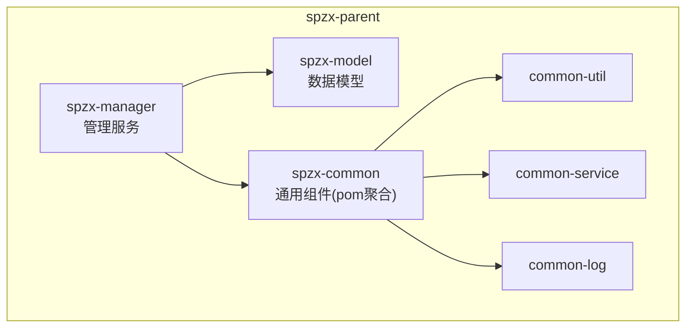
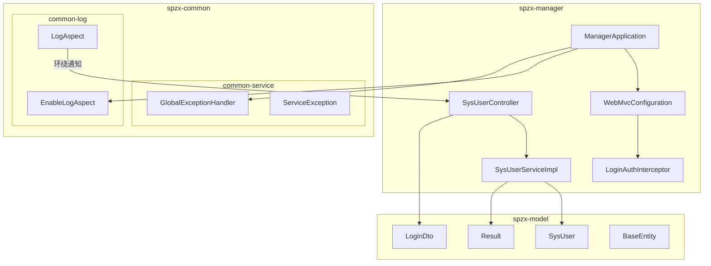
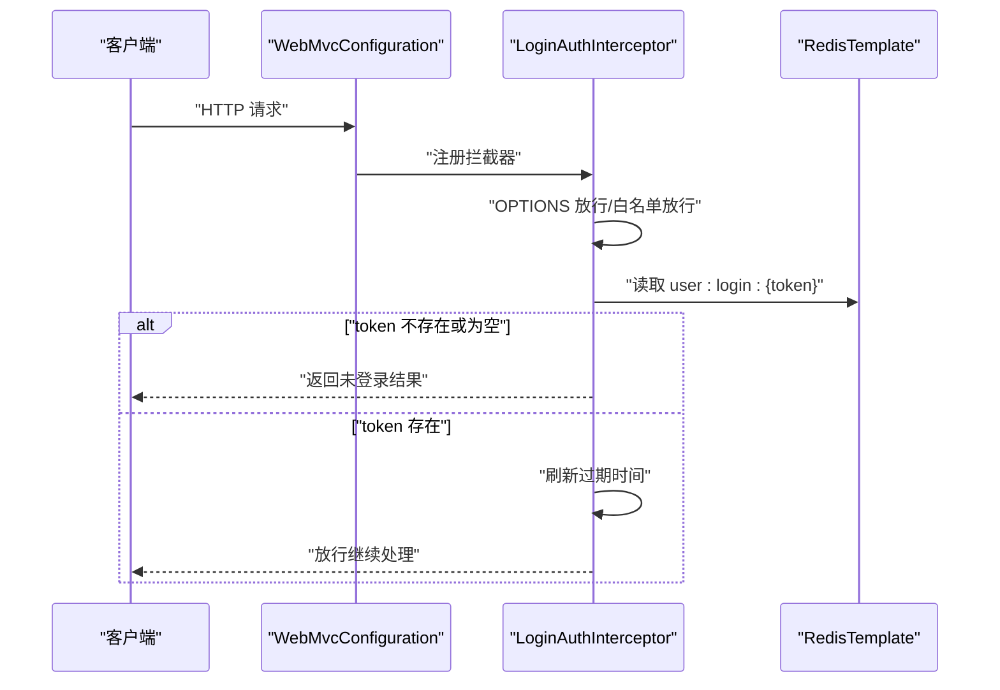
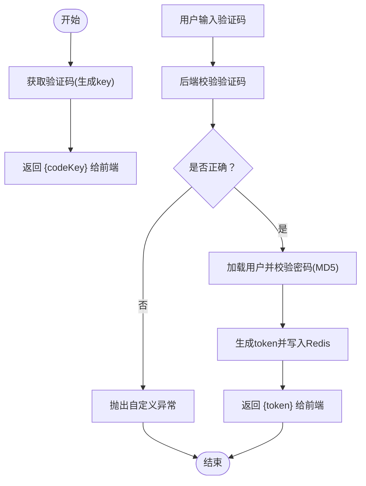
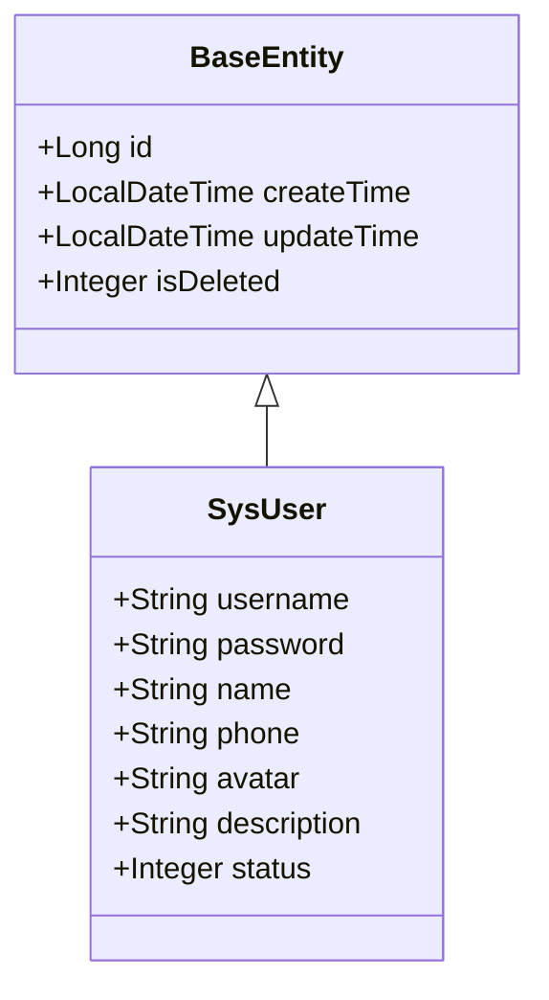
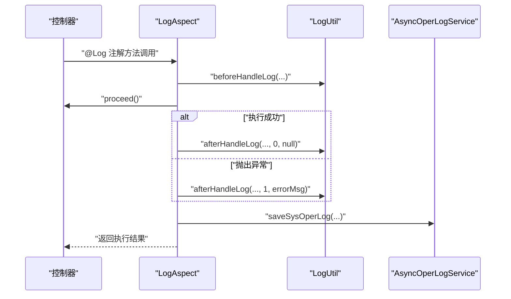
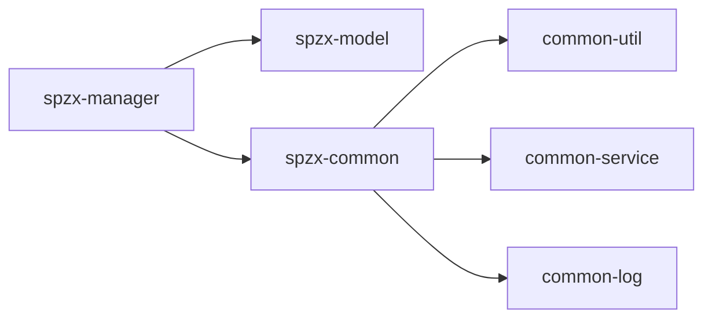

# 核心模块详解

<cite>
**本文引用的文件**
- [ManagerApplication.java](file://spzx-manager/src/main/java/com/joker/spzx/manager/ManagerApplication.java)
- [WebMvcConfiguration.java](file://spzx-manager/src/main/java/com/joker/spzx/manager/config/WebMvcConfiguration.java)
- [LoginAuthInterceptor.java](file://spzx-manager/src/main/java/com/joker/spzx/manager/config/LoginAuthInterceptor.java)
- [SysUserServiceImpl.java](file://spzx-manager/src/main/java/com/joker/spzx/manager/service/impl/SysUserServiceImpl.java)
- [SysUserController.java](file://spzx-manager/src/main/java/com/joker/spzx/manager/controller/SysUserController.java)
- [pom.xml（spzx-manager）](file://spzx-manager/pom.xml)
- [GlobalExceptionHandler.java](file://spzx-common/common-service/src/main/java/com/joker/spzx/common/exception/GlobalExceptionHandler.java)
- [ServiceException.java](file://spzx-common/common-service/src/main/java/com/joker/spzx/common/exception/ServiceException.java)
- [EnableLogAspect.java](file://spzx-common/common-log/src/main/java/com/joker/spzx/common/annotation/EnableLogAspect.java)
- [LogAspect.java](file://spzx-common/common-log/src/main/java/com/joker/spzx/common/aspect/LogAspect.java)
- [pom.xml（spzx-common）](file://spzx-common/pom.xml)
- [SysUser.java](file://spzx-model/src/main/java/com/joker/spzx/model/entity/system/SysUser.java)
- [LoginDto.java](file://spzx-model/src/main/java/com/joker/spzx/model/dto/system/LoginDto.java)
- [Result.java](file://spzx-model/src/main/java/com/joker/spzx/model/vo/common/Result.java)
- [BaseEntity.java](file://spzx-model/src/main/java/com/joker/spzx/model/entity/base/BaseEntity.java)
- [pom.xml（spzx-model）](file://spzx-model/pom.xml)
</cite>

## 目录
1. [引言](#引言)
2. [项目结构](#项目结构)
3. [核心组件](#核心组件)
4. [架构总览](#架构总览)
5. [详细组件分析](#详细组件分析)
6. [依赖分析](#依赖分析)
7. [性能考量](#性能考量)
8. [故障排查指南](#故障排查指南)
9. [结论](#结论)
10. [附录](#附录)

## 引言
本文件面向SPZX电商管理系统的核心模块，系统性梳理并解析以下三大部分：
- spzx-manager 管理服务：负责系统后台管理功能的控制器、业务逻辑与拦截器等。
- spzx-model 数据模型：统一定义实体、DTO、VO与基础模型，确保前后端与服务间的数据契约一致。
- spzx-common 通用组件：提供全局异常处理、日志切面与工具能力，支撑上层服务的横切关注点。

文档将从职责边界、接口定义、内部协作机制、模块间依赖、数据与控制流、启动流程、配置管理与扩展点等方面进行深入说明，并给出可视化图示与实践建议。

## 项目结构
SPZX采用多模块聚合结构，父工程统一管理版本与依赖，子模块按“管理服务、数据模型、通用组件”划分，职责清晰、边界明确。

图表来源
- [pom.xml（spzx-manager）:1-101](file://spzx-manager/pom.xml#L1-L101)
- [pom.xml（spzx-common）:1-44](file://spzx-common/pom.xml#L1-L44)
- [pom.xml（spzx-model）:1-82](file://spzx-model/pom.xml#L1-L82)

章节来源
- [pom.xml（spzx-manager）:1-101](file://spzx-manager/pom.xml#L1-L101)
- [pom.xml（spzx-common）:1-44](file://spzx-common/pom.xml#L1-L44)
- [pom.xml（spzx-model）:1-82](file://spzx-model/pom.xml#L1-L82)

## 核心组件
本节聚焦三大模块的关键构件与其职责：

- spzx-manager
  - 启动入口：应用引导与注解启用日志切面。
  - Web配置：跨域与拦截器注册，统一鉴权。
  - 控制器：系统用户管理等业务接口。
  - 业务实现：用户登录、验证码生成、分页查询、角色分配等。
  - 规则引擎：集成Drools用于订单折扣等业务规则。

- spzx-model
  - 实体：系统用户、商品、订单、字典等业务实体。
  - DTO/VO：请求参数、返回值封装与状态码枚举。
  - 基础模型：统一主键、时间戳与软删除字段。

- spzx-common
  - 异常处理：全局异常与自定义业务异常。
  - 日志切面：基于注解的环绕通知，异步记录操作日志。
  - 注解导入：通过@EnableLogAspect启用切面。

章节来源
- [ManagerApplication.java:1-20](file://spzx-manager/src/main/java/com/joker/spzx/manager/ManagerApplication.java#L1-L20)
- [WebMvcConfiguration.java:1-39](file://spzx-manager/src/main/java/com/joker/spzx/manager/config/WebMvcConfiguration.java#L1-L39)
- [LoginAuthInterceptor.java:1-81](file://spzx-manager/src/main/java/com/joker/spzx/manager/config/LoginAuthInterceptor.java#L1-L81)
- [SysUserController.java:1-70](file://spzx-manager/src/main/java/com/joker/spzx/manager/controller/SysUserController.java#L1-L70)
- [SysUserServiceImpl.java:1-174](file://spzx-manager/src/main/java/com/joker/spzx/manager/service/impl/SysUserServiceImpl.java#L1-L174)
- [GlobalExceptionHandler.java:1-20](file://spzx-common/common-service/src/main/java/com/joker/spzx/common/exception/GlobalExceptionHandler.java#L1-L20)
- [ServiceException.java:1-26](file://spzx-common/common-service/src/main/java/com/joker/spzx/common/exception/ServiceException.java#L1-L26)
- [EnableLogAspect.java:1-17](file://spzx-common/common-log/src/main/java/com/joker/spzx/common/annotation/EnableLogAspect.java#L1-L17)
- [LogAspect.java:1-47](file://spzx-common/common-log/src/main/java/com/joker/spzx/common/aspect/LogAspect.java#L1-L47)
- [SysUser.java:1-42](file://spzx-model/src/main/java/com/joker/spzx/model/entity/system/SysUser.java#L1-L42)
- [LoginDto.java:1-28](file://spzx-model/src/main/java/com/joker/spzx/model/dto/system/LoginDto.java#L1-L28)
- [Result.java:1-45](file://spzx-model/src/main/java/com/joker/spzx/model/vo/common/Result.java#L1-L45)
- [BaseEntity.java:1-34](file://spzx-model/src/main/java/com/joker/spzx/model/entity/base/BaseEntity.java#L1-L34)

## 架构总览
下图展示模块间依赖与交互关系：管理服务依赖数据模型与通用组件；通用组件内部再细分为工具、服务与日志三个子模块；模型层提供实体与契约。

图表来源
- [ManagerApplication.java:1-20](file://spzx-manager/src/main/java/com/joker/spzx/manager/ManagerApplication.java#L1-L20)
- [WebMvcConfiguration.java:1-39](file://spzx-manager/src/main/java/com/joker/spzx/manager/config/WebMvcConfiguration.java#L1-L39)
- [LoginAuthInterceptor.java:1-81](file://spzx-manager/src/main/java/com/joker/spzx/manager/config/LoginAuthInterceptor.java#L1-L81)
- [SysUserController.java:1-70](file://spzx-manager/src/main/java/com/joker/spzx/manager/controller/SysUserController.java#L1-L70)
- [SysUserServiceImpl.java:1-174](file://spzx-manager/src/main/java/com/joker/spzx/manager/service/impl/SysUserServiceImpl.java#L1-L174)
- [GlobalExceptionHandler.java:1-20](file://spzx-common/common-service/src/main/java/com/joker/spzx/common/exception/GlobalExceptionHandler.java#L1-L20)
- [ServiceException.java:1-26](file://spzx-common/common-service/src/main/java/com/joker/spzx/common/exception/ServiceException.java#L1-L26)
- [EnableLogAspect.java:1-17](file://spzx-common/common-log/src/main/java/com/joker/spzx/common/annotation/EnableLogAspect.java#L1-L17)
- [LogAspect.java:1-47](file://spzx-common/common-log/src/main/java/com/joker/spzx/common/aspect/LogAspect.java#L1-L47)
- [SysUser.java:1-42](file://spzx-model/src/main/java/com/joker/spzx/model/entity/system/SysUser.java#L1-L42)
- [LoginDto.java:1-28](file://spzx-model/src/main/java/com/joker/spzx/model/dto/system/LoginDto.java#L1-L28)
- [Result.java:1-45](file://spzx-model/src/main/java/com/joker/spzx/model/vo/common/Result.java#L1-L45)
- [BaseEntity.java:1-34](file://spzx-model/src/main/java/com/joker/spzx/model/entity/base/BaseEntity.java#L1-L34)

## 详细组件分析

### spzx-manager 管理服务
- 启动入口
  - 应用类通过注解启用日志切面，确保后续业务方法可被环绕记录。
  - 参考路径：[ManagerApplication.java:1-20](file://spzx-manager/src/main/java/com/joker/spzx/manager/ManagerApplication.java#L1-L20)

- Web配置与拦截器
  - 跨域策略：允许本地前端访问，支持凭证与全部方法/头。
  - 登录拦截器：白名单放行，非OPTIONS请求需携带token并在Redis中校验。
  - 参考路径：
    - [WebMvcConfiguration.java:1-39](file://spzx-manager/src/main/java/com/joker/spzx/manager/config/WebMvcConfiguration.java#L1-L39)
    - [LoginAuthInterceptor.java:1-81](file://spzx-manager/src/main/java/com/joker/spzx/manager/config/LoginAuthInterceptor.java#L1-L81)

- 控制器与业务实现
  - 控制器：提供用户分页查询、新增、修改、删除与角色分配接口。
  - 业务实现：登录校验验证码、MD5加密码、Redis会话存储、分页查询、保存/更新/软删除、批量角色分配。
  - 参考路径：
    - [SysUserController.java:1-70](file://spzx-manager/src/main/java/com/joker/spzx/manager/controller/SysUserController.java#L1-L70)
    - [SysUserServiceImpl.java:1-174](file://spzx-manager/src/main/java/com/joker/spzx/manager/service/impl/SysUserServiceImpl.java#L1-L174)

- 拦截器调用序列

图表来源
- [WebMvcConfiguration.java:1-39](file://spzx-manager/src/main/java/com/joker/spzx/manager/config/WebMvcConfiguration.java#L1-L39)
- [LoginAuthInterceptor.java:1-81](file://spzx-manager/src/main/java/com/joker/spzx/manager/config/LoginAuthInterceptor.java#L1-L81)

- 登录流程（含验证码）

图表来源
- [SysUserServiceImpl.java:1-174](file://spzx-manager/src/main/java/com/joker/spzx/manager/service/impl/SysUserServiceImpl.java#L1-L174)

章节来源
- [ManagerApplication.java:1-20](file://spzx-manager/src/main/java/com/joker/spzx/manager/ManagerApplication.java#L1-L20)
- [WebMvcConfiguration.java:1-39](file://spzx-manager/src/main/java/com/joker/spzx/manager/config/WebMvcConfiguration.java#L1-L39)
- [LoginAuthInterceptor.java:1-81](file://spzx-manager/src/main/java/com/joker/spzx/manager/config/LoginAuthInterceptor.java#L1-L81)
- [SysUserController.java:1-70](file://spzx-manager/src/main/java/com/joker/spzx/manager/controller/SysUserController.java#L1-L70)
- [SysUserServiceImpl.java:1-174](file://spzx-manager/src/main/java/com/joker/spzx/manager/service/impl/SysUserServiceImpl.java#L1-L174)

### spzx-model 数据模型
- 实体与基础模型
  - BaseEntity：统一主键、创建/更新时间、软删除字段。
  - SysUser：用户基本信息与状态。
  - 参考路径：
    - [BaseEntity.java:1-34](file://spzx-model/src/main/java/com/joker/spzx/model/entity/base/BaseEntity.java#L1-L34)
    - [SysUser.java:1-42](file://spzx-model/src/main/java/com/joker/spzx/model/entity/system/SysUser.java#L1-L42)

- DTO/VO与契约
  - LoginDto：登录请求参数校验。
  - Result：统一响应体封装，支持静态工厂方法。
  - 参考路径：
    - [LoginDto.java:1-28](file://spzx-model/src/main/java/com/joker/spzx/model/dto/system/LoginDto.java#L1-L28)
    - [Result.java:1-45](file://spzx-model/src/main/java/com/joker/spzx/model/vo/common/Result.java#L1-L45)

- 类关系图

图表来源
- [BaseEntity.java:1-34](file://spzx-model/src/main/java/com/joker/spzx/model/entity/base/BaseEntity.java#L1-L34)
- [SysUser.java:1-42](file://spzx-model/src/main/java/com/joker/spzx/model/entity/system/SysUser.java#L1-L42)

章节来源
- [BaseEntity.java:1-34](file://spzx-model/src/main/java/com/joker/spzx/model/entity/base/BaseEntity.java#L1-L34)
- [SysUser.java:1-42](file://spzx-model/src/main/java/com/joker/spzx/model/entity/system/SysUser.java#L1-L42)
- [LoginDto.java:1-28](file://spzx-model/src/main/java/com/joker/spzx/model/dto/system/LoginDto.java#L1-L28)
- [Result.java:1-45](file://spzx-model/src/main/java/com/joker/spzx/model/vo/common/Result.java#L1-L45)

### spzx-common 通用组件
- 全局异常处理
  - 对未捕获异常统一返回，对自定义业务异常按枚举状态码返回。
  - 参考路径：[GlobalExceptionHandler.java:1-20](file://spzx-common/common-service/src/main/java/com/joker/spzx/common/exception/GlobalExceptionHandler.java#L1-L20)

- 自定义业务异常
  - 封装错误码与消息，便于上层统一处理。
  - 参考路径：[ServiceException.java:1-26](file://spzx-common/common-service/src/main/java/com/joker/spzx/common/exception/ServiceException.java#L1-L26)

- 日志切面
  - 通过注解@EnableLogAspect启用，环绕通知收集请求上下文与结果，异步落库。
  - 参考路径：
    - [EnableLogAspect.java:1-17](file://spzx-common/common-log/src/main/java/com/joker/spzx/common/annotation/EnableLogAspect.java#L1-L17)
    - [LogAspect.java:1-47](file://spzx-common/common-log/src/main/java/com/joker/spzx/common/aspect/LogAspect.java#L1-L47)

- 切面调用序列

图表来源
- [LogAspect.java:1-47](file://spzx-common/common-log/src/main/java/com/joker/spzx/common/aspect/LogAspect.java#L1-L47)

章节来源
- [GlobalExceptionHandler.java:1-20](file://spzx-common/common-service/src/main/java/com/joker/spzx/common/exception/GlobalExceptionHandler.java#L1-L20)
- [ServiceException.java:1-26](file://spzx-common/common-service/src/main/java/com/joker/spzx/common/exception/ServiceException.java#L1-L26)
- [EnableLogAspect.java:1-17](file://spzx-common/common-log/src/main/java/com/joker/spzx/common/annotation/EnableLogAspect.java#L1-L17)
- [LogAspect.java:1-47](file://spzx-common/common-log/src/main/java/com/joker/spzx/common/aspect/LogAspect.java#L1-L47)

## 依赖分析
- 模块依赖
  - spzx-manager 依赖 spzx-model 与 spzx-common。
  - spzx-common 为聚合模块，内部包含 common-util、common-service、common-log。
  - spzx-model 依赖MyBatis-Plus、Swagger、EasyExcel等基础设施。
- 关键外部依赖
  - Redis：会话与验证码缓存。
  - MySQL：持久化存储。
  - Drools：业务规则引擎（订单折扣等）。
- 依赖关系图

图表来源
- [pom.xml（spzx-manager）:1-101](file://spzx-manager/pom.xml#L1-L101)
- [pom.xml（spzx-common）:1-44](file://spzx-common/pom.xml#L1-L44)
- [pom.xml（spzx-model）:1-82](file://spzx-model/pom.xml#L1-L82)

章节来源
- [pom.xml（spzx-manager）:1-101](file://spzx-manager/pom.xml#L1-L101)
- [pom.xml（spzx-common）:1-44](file://spzx-common/pom.xml#L1-L44)
- [pom.xml（spzx-model）:1-82](file://spzx-model/pom.xml#L1-L82)

## 性能考量
- 缓存优化
  - 登录态与验证码使用Redis短时缓存，减少数据库压力。
  - 建议：合理设置过期时间与内存上限，避免热点key雪崩。
- 分页查询
  - 使用MyBatis-Plus分页插件，注意SQL索引与分页大小限制。
- 异步日志
  - 操作日志异步落库，避免阻塞主业务线程。
- 规则引擎
  - Drools规则复杂度应受控，建议拆分规则集并做性能测试。

## 故障排查指南
- 登录失败
  - 检查验证码key与输入值是否匹配；确认Redis中验证码是否存在且未过期。
  - 参考路径：[SysUserServiceImpl.java:1-174](file://spzx-manager/src/main/java/com/joker/spzx/manager/service/impl/SysUserServiceImpl.java#L1-L174)
- 未登录拦截
  - 检查请求头token是否携带；确认Redis中会话键是否存在且未过期。
  - 参考路径：[LoginAuthInterceptor.java:1-81](file://spzx-manager/src/main/java/com/joker/spzx/manager/config/LoginAuthInterceptor.java#L1-L81)
- 全局异常
  - 查看全局异常处理器返回的状态码与消息；定位ServiceException抛出处。
  - 参考路径：
    - [GlobalExceptionHandler.java:1-20](file://spzx-common/common-service/src/main/java/com/joker/spzx/common/exception/GlobalExceptionHandler.java#L1-L20)
    - [ServiceException.java:1-26](file://spzx-common/common-service/src/main/java/com/joker/spzx/common/exception/ServiceException.java#L1-L26)

章节来源
- [SysUserServiceImpl.java:1-174](file://spzx-manager/src/main/java/com/joker/spzx/manager/service/impl/SysUserServiceImpl.java#L1-L174)
- [LoginAuthInterceptor.java:1-81](file://spzx-manager/src/main/java/com/joker/spzx/manager/config/LoginAuthInterceptor.java#L1-L81)
- [GlobalExceptionHandler.java:1-20](file://spzx-common/common-service/src/main/java/com/joker/spzx/common/exception/GlobalExceptionHandler.java#L1-L20)
- [ServiceException.java:1-26](file://spzx-common/common-service/src/main/java/com/joker/spzx/common/exception/ServiceException.java#L1-L26)

## 结论
SPZX通过模块化设计实现了“管理服务、数据模型、通用组件”的清晰分工与低耦合协作：
- spzx-manager 负责业务编排与对外接口；
- spzx-model 提供稳定的数据契约；
- spzx-common 抽象横切关注点，提升可维护性与一致性。

该架构便于扩展新功能、替换底层实现（如缓存、规则引擎），并为后续微服务演进打下良好基础。

## 附录
- 启动流程
  - 应用启动 → 加载Web配置与拦截器 → 注册全局异常处理 → 启用日志切面 → 暴露REST接口。
  - 参考路径：
    - [ManagerApplication.java:1-20](file://spzx-manager/src/main/java/com/joker/spzx/manager/ManagerApplication.java#L1-L20)
    - [WebMvcConfiguration.java:1-39](file://spzx-manager/src/main/java/com/joker/spzx/manager/config/WebMvcConfiguration.java#L1-L39)
    - [GlobalExceptionHandler.java:1-20](file://spzx-common/common-service/src/main/java/com/joker/spzx/common/exception/GlobalExceptionHandler.java#L1-L20)
    - [EnableLogAspect.java:1-17](file://spzx-common/common-log/src/main/java/com/joker/spzx/common/annotation/EnableLogAspect.java#L1-L17)
- 配置管理与扩展点
  - Web跨域与拦截器：在WebMvcConfiguration中集中管理。
  - 日志切面：通过@EnableLogAspect启用，可在任意业务方法上添加@Log注解。
  - 参考路径：
    - [WebMvcConfiguration.java:1-39](file://spzx-manager/src/main/java/com/joker/spzx/manager/config/WebMvcConfiguration.java#L1-L39)
    - [EnableLogAspect.java:1-17](file://spzx-common/common-log/src/main/java/com/joker/spzx/common/annotation/EnableLogAspect.java#L1-L17)
    - [LogAspect.java:1-47](file://spzx-common/common-log/src/main/java/com/joker/spzx/common/aspect/LogAspect.java#L1-L47)