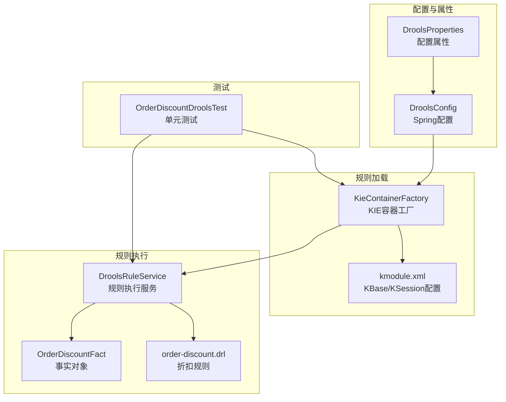
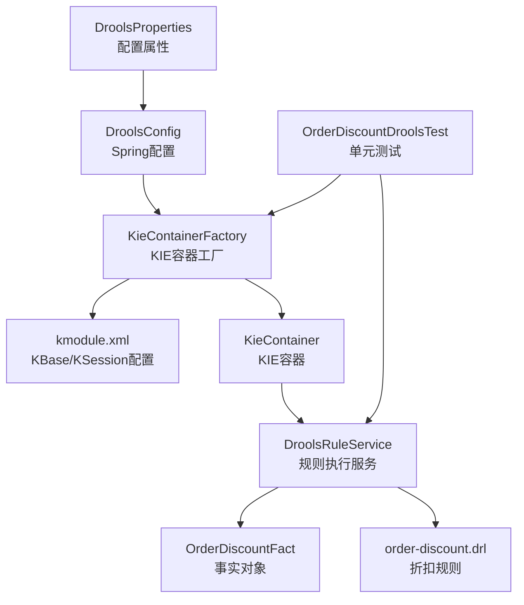
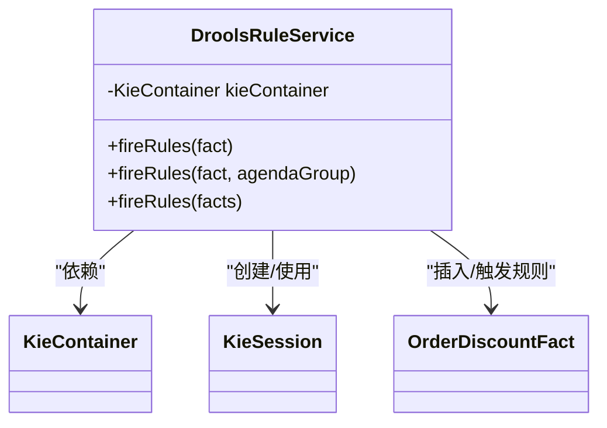
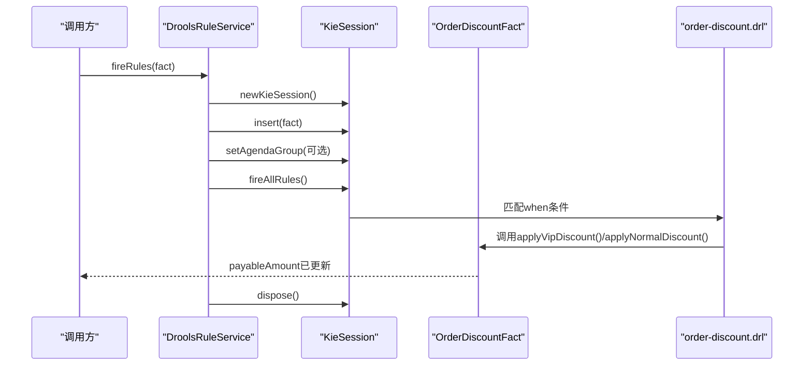
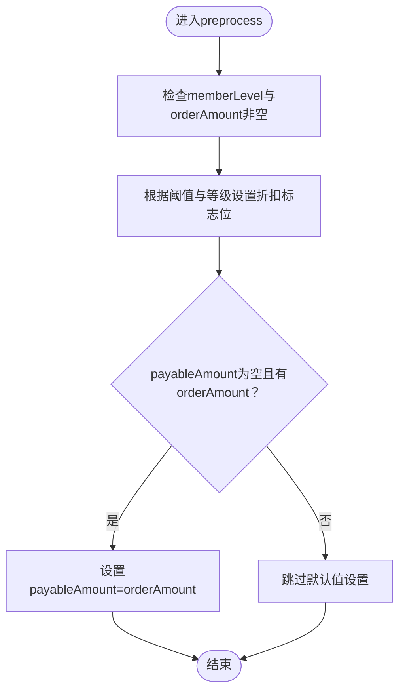
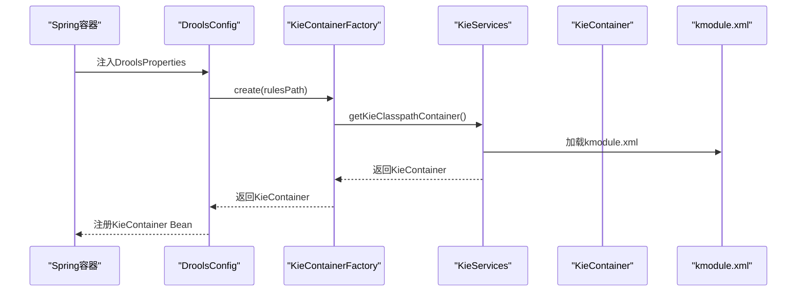
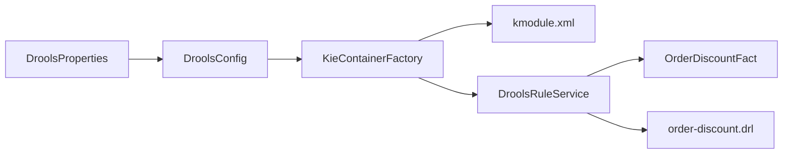

# 规则引擎集成

<cite>
**本文引用的文件**
- [spzx-manager/src/main/java/com/joker/spzx/manager/config/DroolsConfig.java](file://spzx-manager/src/main/java/com/joker/spzx/manager/config/DroolsConfig.java)
- [spzx-manager/src/main/java/com/joker/spzx/manager/config/DroolsProperties.java](file://spzx-manager/src/main/java/com/joker/spzx/manager/config/DroolsProperties.java)
- [spzx-manager/src/main/java/com/joker/spzx/manager/drools/KieContainerFactory.java](file://spzx-manager/src/main/java/com/joker/spzx/manager/drools/KieContainerFactory.java)
- [spzx-manager/src/main/java/com/joker/spzx/manager/drools/DroolsRuleService.java](file://spzx-manager/src/main/java/com/joker/spzx/manager/drools/DroolsRuleService.java)
- [spzx-manager/src/main/java/com/joker/spzx/manager/drools/model/OrderDiscountFact.java](file://spzx-manager/src/main/java/com/joker/spzx/manager/drools/model/OrderDiscountFact.java)
- [spzx-manager/src/main/resources/META-INF/kmodule.xml](file://spzx-manager/src/main/resources/META-INF/kmodule.xml)
- [spzx-manager/src/main/resources/rules/order-discount.drl](file://spzx-manager/src/main/resources/rules/order-discount.drl)
- [spzx-manager/src/test/java/com/joker/spzx/manager/drools/OrderDiscountDroolsTest.java](file://spzx-manager/src/test/java/com/joker/spzx/manager/drools/OrderDiscountDroolsTest.java)
- [spzx-manager/src/main/resources/application.yml](file://spzx-manager/src/main/resources/application.yml)
- [spzx-manager/src/main/java/com/joker/spzx/manager/service/impl/OrderInfoServiceImpl.java](file://spzx-manager/src/main/java/com/joker/spzx/manager/service/impl/OrderInfoServiceImpl.java)
</cite>

## 目录
1. [引言](#引言)
2. [项目结构](#项目结构)
3. [核心组件](#核心组件)
4. [架构总览](#架构总览)
5. [详细组件分析](#详细组件分析)
6. [依赖分析](#依赖分析)
7. [性能考虑](#性能考虑)
8. [故障排查指南](#故障排查指南)
9. [结论](#结论)
10. [附录](#附录)

## 引言
本文件面向SPZX项目中Drools规则引擎的集成与落地，重点围绕电商系统中的订单折扣计算场景，系统性阐述规则定义语法、事实对象设计、规则执行流程、配置管理、KIE容器工厂与规则加载机制，并提供折扣规则示例、业务场景分析与扩展方法。同时对比规则引擎与传统编程方式的差异与优势，给出调试、性能优化与维护策略，帮助读者快速理解并安全地在生产环境中使用规则引擎。

## 项目结构
SPZX项目采用多模块结构，规则引擎相关代码集中在spzx-manager模块中，主要涉及以下位置：
- 配置与属性：config包下的DroolsConfig与DroolsProperties
- 规则加载与容器：drools包下的KieContainerFactory
- 规则执行服务：DroolsRuleService
- 事实对象：drools/model下的OrderDiscountFact
- 规则文件：resources/rules/order-discount.drl
- 容器与会话配置：resources/META-INF/kmodule.xml
- 测试：test/java/com/joker/spzx/manager/drools/OrderDiscountDroolsTest.java
- 应用配置：application.yml

图表来源
- [spzx-manager/src/main/java/com/joker/spzx/manager/config/DroolsConfig.java:1-24](file://spzx-manager/src/main/java/com/joker/spzx/manager/config/DroolsConfig.java#L1-L24)
- [spzx-manager/src/main/java/com/joker/spzx/manager/config/DroolsProperties.java:1-20](file://spzx-manager/src/main/java/com/joker/spzx/manager/config/DroolsProperties.java#L1-L20)
- [spzx-manager/src/main/java/com/joker/spzx/manager/drools/KieContainerFactory.java:1-24](file://spzx-manager/src/main/java/com/joker/spzx/manager/drools/KieContainerFactory.java#L1-L24)
- [spzx-manager/src/main/resources/META-INF/kmodule.xml:1-7](file://spzx-manager/src/main/resources/META-INF/kmodule.xml#L1-L7)
- [spzx-manager/src/main/java/com/joker/spzx/manager/drools/DroolsRuleService.java:1-54](file://spzx-manager/src/main/java/com/joker/spzx/manager/drools/DroolsRuleService.java#L1-L54)
- [spzx-manager/src/main/java/com/joker/spzx/manager/drools/model/OrderDiscountFact.java:1-70](file://spzx-manager/src/main/java/com/joker/spzx/manager/drools/model/OrderDiscountFact.java#L1-L70)
- [spzx-manager/src/main/resources/rules/order-discount.drl:1-20](file://spzx-manager/src/main/resources/rules/order-discount.drl#L1-L20)
- [spzx-manager/src/test/java/com/joker/spzx/manager/drools/OrderDiscountDroolsTest.java:1-57](file://spzx-manager/src/test/java/com/joker/spzx/manager/drools/OrderDiscountDroolsTest.java#L1-L57)

章节来源
- [spzx-manager/src/main/java/com/joker/spzx/manager/config/DroolsConfig.java:1-24](file://spzx-manager/src/main/java/com/joker/spzx/manager/config/DroolsConfig.java#L1-L24)
- [spzx-manager/src/main/java/com/joker/spzx/manager/config/DroolsProperties.java:1-20](file://spzx-manager/src/main/java/com/joker/spzx/manager/config/DroolsProperties.java#L1-L20)
- [spzx-manager/src/main/java/com/joker/spzx/manager/drools/KieContainerFactory.java:1-24](file://spzx-manager/src/main/java/com/joker/spzx/manager/drools/KieContainerFactory.java#L1-L24)
- [spzx-manager/src/main/resources/META-INF/kmodule.xml:1-7](file://spzx-manager/src/main/resources/META-INF/kmodule.xml#L1-L7)
- [spzx-manager/src/main/resources/rules/order-discount.drl:1-20](file://spzx-manager/src/main/resources/rules/order-discount.drl#L1-L20)
- [spzx-manager/src/test/java/com/joker/spzx/manager/drools/OrderDiscountDroolsTest.java:1-57](file://spzx-manager/src/test/java/com/joker/spzx/manager/drools/OrderDiscountDroolsTest.java#L1-L57)

## 核心组件
- 配置与属性
  - DroolsProperties：通过@ConfigurationProperties绑定配置项，支持开关控制与规则文件目录配置。
  - DroolsConfig：基于条件注解按需创建KieContainer Bean，确保规则引擎仅在启用时初始化。
- 规则加载与容器
  - KieContainerFactory：通过KieServices从classpath加载kmodule.xml与规则文件，构建KieContainer，便于单元测试与Spring解耦。
- 规则执行服务
  - DroolsRuleService：提供对单个或批量事实对象的规则执行能力，支持按agenda-group聚焦执行，保证每次会话独立生命周期。
- 事实对象
  - OrderDiscountFact：封装订单折扣计算所需的输入与输出字段，并提供预处理与折扣应用方法，降低DRL复杂度。
- 规则文件
  - order-discount.drl：定义VIP与普通会员的折扣规则，使用salience控制优先级，规则通过方法调用更新应付金额。

章节来源
- [spzx-manager/src/main/java/com/joker/spzx/manager/config/DroolsProperties.java:1-20](file://spzx-manager/src/main/java/com/joker/spzx/manager/config/DroolsProperties.java#L1-L20)
- [spzx-manager/src/main/java/com/joker/spzx/manager/config/DroolsConfig.java:1-24](file://spzx-manager/src/main/java/com/joker/spzx/manager/config/DroolsConfig.java#L1-L24)
- [spzx-manager/src/main/java/com/joker/spzx/manager/drools/KieContainerFactory.java:1-24](file://spzx-manager/src/main/java/com/joker/spzx/manager/drools/KieContainerFactory.java#L1-L24)
- [spzx-manager/src/main/java/com/joker/spzx/manager/drools/DroolsRuleService.java:1-54](file://spzx-manager/src/main/java/com/joker/spzx/manager/drools/DroolsRuleService.java#L1-L54)
- [spzx-manager/src/main/java/com/joker/spzx/manager/drools/model/OrderDiscountFact.java:1-70](file://spzx-manager/src/main/java/com/joker/spzx/manager/drools/model/OrderDiscountFact.java#L1-L70)
- [spzx-manager/src/main/resources/rules/order-discount.drl:1-20](file://spzx-manager/src/main/resources/rules/order-discount.drl#L1-L20)

## 架构总览
下图展示了规则引擎在SPZX中的整体运行架构：配置与属性驱动容器创建，容器加载规则，服务层通过KieSession插入事实并触发规则，最终由事实对象承载计算结果。

图表来源
- [spzx-manager/src/main/java/com/joker/spzx/manager/config/DroolsConfig.java:1-24](file://spzx-manager/src/main/java/com/joker/spzx/manager/config/DroolsConfig.java#L1-L24)
- [spzx-manager/src/main/java/com/joker/spzx/manager/config/DroolsProperties.java:1-20](file://spzx-manager/src/main/java/com/joker/spzx/manager/config/DroolsProperties.java#L1-L20)
- [spzx-manager/src/main/java/com/joker/spzx/manager/drools/KieContainerFactory.java:1-24](file://spzx-manager/src/main/java/com/joker/spzx/manager/drools/KieContainerFactory.java#L1-L24)
- [spzx-manager/src/main/resources/META-INF/kmodule.xml:1-7](file://spzx-manager/src/main/resources/META-INF/kmodule.xml#L1-L7)
- [spzx-manager/src/main/java/com/joker/spzx/manager/drools/DroolsRuleService.java:1-54](file://spzx-manager/src/main/java/com/joker/spzx/manager/drools/DroolsRuleService.java#L1-L54)
- [spzx-manager/src/main/java/com/joker/spzx/manager/drools/model/OrderDiscountFact.java:1-70](file://spzx-manager/src/main/java/com/joker/spzx/manager/drools/model/OrderDiscountFact.java#L1-L70)
- [spzx-manager/src/main/resources/rules/order-discount.drl:1-20](file://spzx-manager/src/main/resources/rules/order-discount.drl#L1-L20)
- [spzx-manager/src/test/java/com/joker/spzx/manager/drools/OrderDiscountDroolsTest.java:1-57](file://spzx-manager/src/test/java/com/joker/spzx/manager/drools/OrderDiscountDroolsTest.java#L1-L57)

## 详细组件分析

### 组件A：规则执行服务（DroolsRuleService）
职责与行为
- 单事实执行：创建KieSession，插入事实，按需设置agenda-group焦点，fireAllRules后释放资源。
- 批量事实执行：批量插入后统一fireAllRules，适合多条记录的规则评估。
- 生命周期管理：每次执行新建会话，finally中释放，避免内存泄漏与状态污染。

图表来源
- [spzx-manager/src/main/java/com/joker/spzx/manager/drools/DroolsRuleService.java:1-54](file://spzx-manager/src/main/java/com/joker/spzx/manager/drools/DroolsRuleService.java#L1-L54)

章节来源
- [spzx-manager/src/main/java/com/joker/spzx/manager/drools/DroolsRuleService.java:1-54](file://spzx-manager/src/main/java/com/joker/spzx/manager/drools/DroolsRuleService.java#L1-L54)

### 组件B：规则定义与执行流程（order-discount.drl）
业务逻辑
- VIP满额折扣：当满足VIP且订单金额达到阈值时，应用VIP折扣率。
- 普通会员折扣：当满足普通会员且订单金额达到阈值时，应用普通折扣率。
- 优先级：通过salience设定VIP规则优先于普通会员规则。
- 方法调用：规则在then分支直接调用事实对象的方法更新应付金额。

图表来源
- [spzx-manager/src/main/java/com/joker/spzx/manager/drools/DroolsRuleService.java:1-54](file://spzx-manager/src/main/java/com/joker/spzx/manager/drools/DroolsRuleService.java#L1-L54)
- [spzx-manager/src/main/resources/rules/order-discount.drl:1-20](file://spzx-manager/src/main/resources/rules/order-discount.drl#L1-L20)
- [spzx-manager/src/main/java/com/joker/spzx/manager/drools/model/OrderDiscountFact.java:1-70](file://spzx-manager/src/main/java/com/joker/spzx/manager/drools/model/OrderDiscountFact.java#L1-L70)

章节来源
- [spzx-manager/src/main/resources/rules/order-discount.drl:1-20](file://spzx-manager/src/main/resources/rules/order-discount.drl#L1-L20)
- [spzx-manager/src/main/java/com/joker/spzx/manager/drools/model/OrderDiscountFact.java:1-70](file://spzx-manager/src/main/java/com/joker/spzx/manager/drools/model/OrderDiscountFact.java#L1-L70)

### 组件C：事实对象设计（OrderDiscountFact）
设计要点
- 字段隔离：将“是否满足折扣条件”等布尔标志在preprocess阶段预计算，避免在DRL中进行null判断与字符串比较。
- 默认值保护：若应付金额未设置，则默认使用原始订单金额，确保规则未命中时保持原价。
- 方法化副作用：将折扣应用逻辑下沉至事实对象方法，简化DRL表达式，提升可读性与可维护性。

图表来源
- [spzx-manager/src/main/java/com/joker/spzx/manager/drools/model/OrderDiscountFact.java:1-70](file://spzx-manager/src/main/java/com/joker/spzx/manager/drools/model/OrderDiscountFact.java#L1-L70)

章节来源
- [spzx-manager/src/main/java/com/joker/spzx/manager/drools/model/OrderDiscountFact.java:1-70](file://spzx-manager/src/main/java/com/joker/spzx/manager/drools/model/OrderDiscountFact.java#L1-L70)

### 组件D：配置与加载机制（DroolsConfig、KieContainerFactory、kmodule.xml）
- 属性开关：DroolsProperties提供enabled与rulesPath，DroolsConfig基于条件注解按需装配。
- 容器创建：KieContainerFactory通过KieServices从classpath加载kmodule.xml与规则目录，返回KieContainer。
- 会话配置：kmodule.xml声明kbase与ksession，ksession-rules作为默认会话名供服务层使用。

图表来源
- [spzx-manager/src/main/java/com/joker/spzx/manager/config/DroolsConfig.java:1-24](file://spzx-manager/src/main/java/com/joker/spzx/manager/config/DroolsConfig.java#L1-L24)
- [spzx-manager/src/main/java/com/joker/spzx/manager/config/DroolsProperties.java:1-20](file://spzx-manager/src/main/java/com/joker/spzx/manager/config/DroolsProperties.java#L1-L20)
- [spzx-manager/src/main/java/com/joker/spzx/manager/drools/KieContainerFactory.java:1-24](file://spzx-manager/src/main/java/com/joker/spzx/manager/drools/KieContainerFactory.java#L1-L24)
- [spzx-manager/src/main/resources/META-INF/kmodule.xml:1-7](file://spzx-manager/src/main/resources/META-INF/kmodule.xml#L1-L7)

章节来源
- [spzx-manager/src/main/java/com/joker/spzx/manager/config/DroolsConfig.java:1-24](file://spzx-manager/src/main/java/com/joker/spzx/manager/config/DroolsConfig.java#L1-L24)
- [spzx-manager/src/main/java/com/joker/spzx/manager/config/DroolsProperties.java:1-20](file://spzx-manager/src/main/java/com/joker/spzx/manager/config/DroolsProperties.java#L1-L20)
- [spzx-manager/src/main/java/com/joker/spzx/manager/drools/KieContainerFactory.java:1-24](file://spzx-manager/src/main/java/com/joker/spzx/manager/drools/KieContainerFactory.java#L1-L24)
- [spzx-manager/src/main/resources/META-INF/kmodule.xml:1-7](file://spzx-manager/src/main/resources/META-INF/kmodule.xml#L1-L7)

### 组件E：业务场景与扩展方法
- 场景一：VIP满100享8折
  - 条件：memberLevel为VIP且orderAmount≥100；优先级高。
  - 结果：应付金额=原价×0.8。
- 场景二：普通会员满200享95折
  - 条件：memberLevel为NORMAL且orderAmount≥200；优先级低。
  - 结果：应付金额=原价×0.95。
- 扩展建议
  - 多层级会员：引入等级阈值与对应折扣率，通过枚举或字典表管理。
  - 促销叠加：新增促销券/限时折扣等规则，使用agenda-group分组执行，控制顺序与互斥。
  - 动态阈值：将阈值与折扣率参数化，支持运营后台动态调整。
  - 规则版本：通过规则文件命名与版本号管理，配合灰度发布。

章节来源
- [spzx-manager/src/main/resources/rules/order-discount.drl:1-20](file://spzx-manager/src/main/resources/rules/order-discount.drl#L1-L20)
- [spzx-manager/src/main/java/com/joker/spzx/manager/drools/model/OrderDiscountFact.java:1-70](file://spzx-manager/src/main/java/com/joker/spzx/manager/drools/model/OrderDiscountFact.java#L1-L70)

### 组件F：与传统编程方式的对比与优势
- 可维护性：规则集中于DRL文件，业务人员可参与评审与修改，减少代码变更风险。
- 可测试性：通过单元测试验证不同输入组合下的折扣结果，回归成本低。
- 可扩展性：新增规则无需改动Java代码，只需扩展DRL与必要方法。
- 可观测性：结合日志与规则计数，追踪规则命中情况与性能瓶颈。

## 依赖分析
- 组件内聚与耦合
  - DroolsRuleService对KieContainer与KieSession有直接依赖，但通过构造注入与会话生命周期管理降低耦合。
  - OrderDiscountFact承担业务语义与副作用，与DRL紧密协作，但保持简单接口，利于测试。
- 外部依赖
  - Drools核心API：KieServices、KieContainer、KieSession。
  - Spring条件装配：基于属性开关与Bean存在性控制规则引擎初始化。
- 潜在循环依赖
  - 当前结构无循环依赖，配置、工厂、服务、模型与规则文件相互独立。

图表来源
- [spzx-manager/src/main/java/com/joker/spzx/manager/config/DroolsConfig.java:1-24](file://spzx-manager/src/main/java/com/joker/spzx/manager/config/DroolsConfig.java#L1-L24)
- [spzx-manager/src/main/java/com/joker/spzx/manager/config/DroolsProperties.java:1-20](file://spzx-manager/src/main/java/com/joker/spzx/manager/config/DroolsProperties.java#L1-L20)
- [spzx-manager/src/main/java/com/joker/spzx/manager/drools/KieContainerFactory.java:1-24](file://spzx-manager/src/main/java/com/joker/spzx/manager/drools/KieContainerFactory.java#L1-L24)
- [spzx-manager/src/main/java/com/joker/spzx/manager/drools/DroolsRuleService.java:1-54](file://spzx-manager/src/main/java/com/joker/spzx/manager/drools/DroolsRuleService.java#L1-L54)
- [spzx-manager/src/main/resources/META-INF/kmodule.xml:1-7](file://spzx-manager/src/main/resources/META-INF/kmodule.xml#L1-L7)
- [spzx-manager/src/main/java/com/joker/spzx/manager/drools/model/OrderDiscountFact.java:1-70](file://spzx-manager/src/main/java/com/joker/spzx/manager/drools/model/OrderDiscountFact.java#L1-L70)
- [spzx-manager/src/main/resources/rules/order-discount.drl:1-20](file://spzx-manager/src/main/resources/rules/order-discount.drl#L1-L20)

章节来源
- [spzx-manager/src/main/java/com/joker/spzx/manager/config/DroolsConfig.java:1-24](file://spzx-manager/src/main/java/com/joker/spzx/manager/config/DroolsConfig.java#L1-L24)
- [spzx-manager/src/main/java/com/joker/spzx/manager/config/DroolsProperties.java:1-20](file://spzx-manager/src/main/java/com/joker/spzx/manager/config/DroolsProperties.java#L1-L20)
- [spzx-manager/src/main/java/com/joker/spzx/manager/drools/DroolsRuleService.java:1-54](file://spzx-manager/src/main/java/com/joker/spzx/manager/drools/DroolsRuleService.java#L1-L54)
- [spzx-manager/src/main/java/com/joker/spzx/manager/drools/model/OrderDiscountFact.java:1-70](file://spzx-manager/src/main/java/com/joker/spzx/manager/drools/model/OrderDiscountFact.java#L1-L70)
- [spzx-manager/src/main/resources/META-INF/kmodule.xml:1-7](file://spzx-manager/src/main/resources/META-INF/kmodule.xml#L1-L7)
- [spzx-manager/src/main/resources/rules/order-discount.drl:1-20](file://spzx-manager/src/main/resources/rules/order-discount.drl#L1-L20)

## 性能考虑
- 会话复用与生命周期
  - 当前实现每次执行新建会话并在finally释放，避免状态污染，但频繁创建销毁可能带来开销。建议在高并发场景下引入会话池或长生命周期会话，并在事务边界显式清理。
- 规则数量与复杂度
  - 控制规则数量与条件复杂度，合理拆分规则集，使用agenda-group分组执行，减少不必要的匹配。
- 事实对象设计
  - 将可预计算的布尔标志与默认值在preprocess阶段完成，降低DRL中的计算与判断，提升匹配效率。
- 阈值与折扣率参数化
  - 将阈值与折扣率抽取为外部配置，避免硬编码带来的编译与部署成本。
- 日志与监控
  - 记录规则命中次数、平均执行时间与异常堆栈，结合指标系统进行容量规划与性能优化。

## 故障排查指南
- 规则未生效
  - 检查kmodule.xml中ksession名称是否与服务层一致。
  - 确认DroolsProperties.enabled=true且rulesPath正确指向规则目录。
  - 使用单元测试验证规则文件是否被正确加载。
- 折扣结果异常
  - 核对OrderDiscountFact.preprocess是否正确设置折扣标志位与默认应付金额。
  - 检查规则优先级（salience）是否符合预期，避免低优先级覆盖高优先级。
- 会话资源泄露
  - 确保每次执行后会话均被dispose，避免长时间运行导致内存占用上升。
- 配置问题
  - application.yml中profile与环境变量一致，确保DroolsConfig按预期加载。

章节来源
- [spzx-manager/src/main/resources/application.yml:1-5](file://spzx-manager/src/main/resources/application.yml#L1-L5)
- [spzx-manager/src/main/java/com/joker/spzx/manager/drools/DroolsRuleService.java:1-54](file://spzx-manager/src/main/java/com/joker/spzx/manager/drools/DroolsRuleService.java#L1-L54)
- [spzx-manager/src/test/java/com/joker/spzx/manager/drools/OrderDiscountDroolsTest.java:1-57](file://spzx-manager/src/test/java/com/joker/spzx/manager/drools/OrderDiscountDroolsTest.java#L1-L57)

## 结论
SPZX项目通过Drools实现了订单折扣计算的规则化与可维护化。借助清晰的事实对象设计、规范的规则定义与完善的执行服务，系统在保持高性能的同时具备良好的扩展性与可观测性。建议在生产环境中结合会话池、参数化配置与监控告警，持续优化规则执行性能与稳定性。

## 附录
- 规则文件路径与内容参考
  - [order-discount.drl:1-20](file://spzx-manager/src/main/resources/rules/order-discount.drl#L1-L20)
- 配置文件与容器配置
  - [application.yml:1-5](file://spzx-manager/src/main/resources/application.yml#L1-L5)
  - [kmodule.xml:1-7](file://spzx-manager/src/main/resources/META-INF/kmodule.xml#L1-L7)
- 测试用例参考
  - [OrderDiscountDroolsTest.java:1-57](file://spzx-manager/src/test/java/com/joker/spzx/manager/drools/OrderDiscountDroolsTest.java#L1-L57)
- 服务层示例（统计查询，非折扣逻辑）
  - [OrderInfoServiceImpl.java:1-55](file://spzx-manager/src/main/java/com/joker/spzx/manager/service/impl/OrderInfoServiceImpl.java#L1-L55)