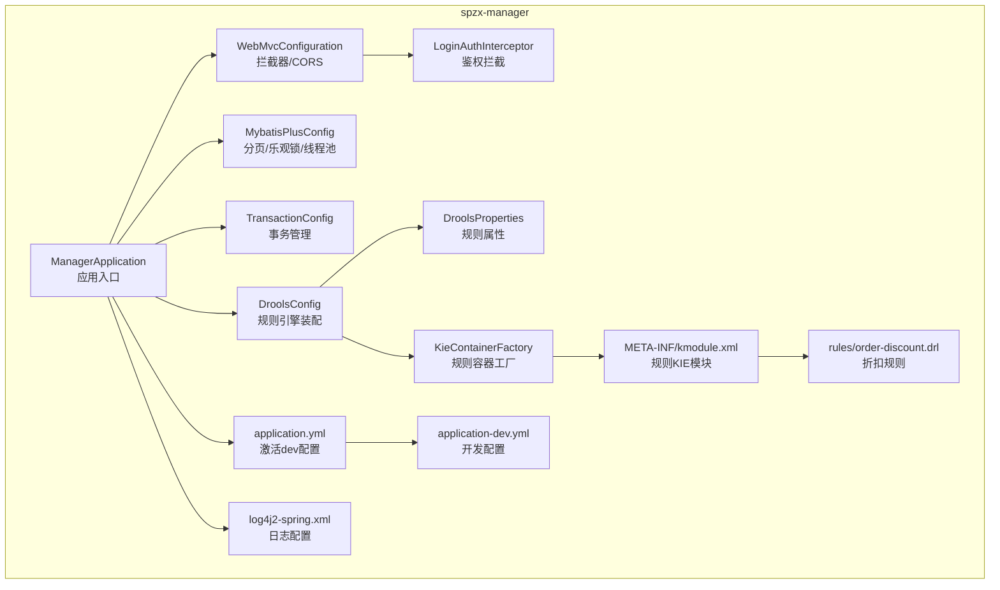
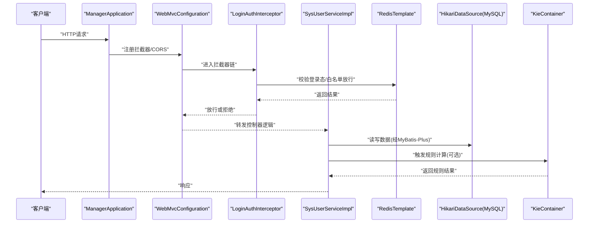
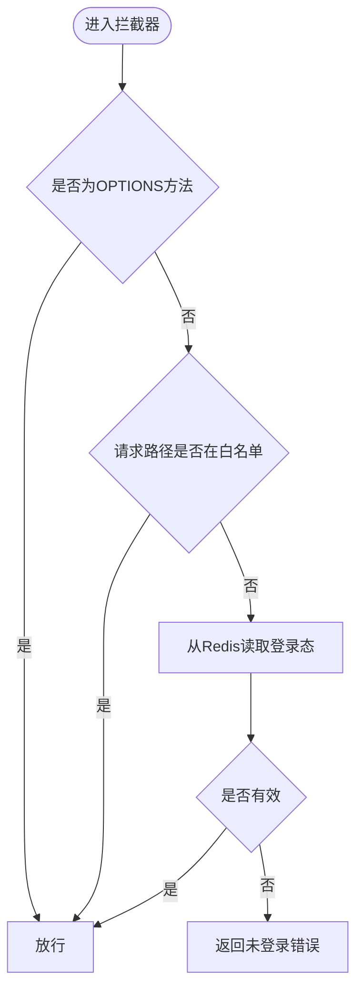
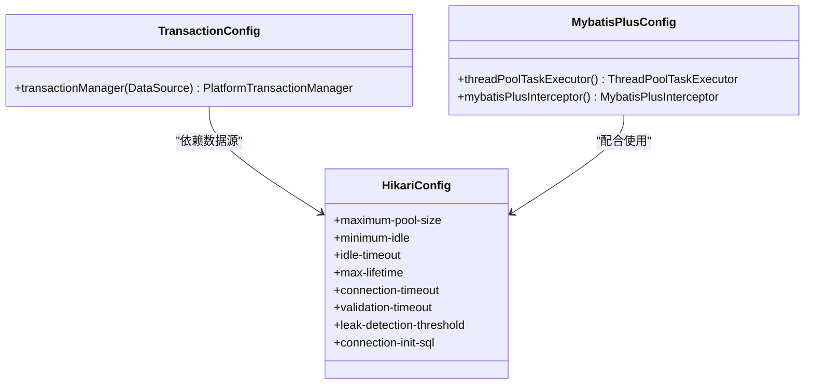
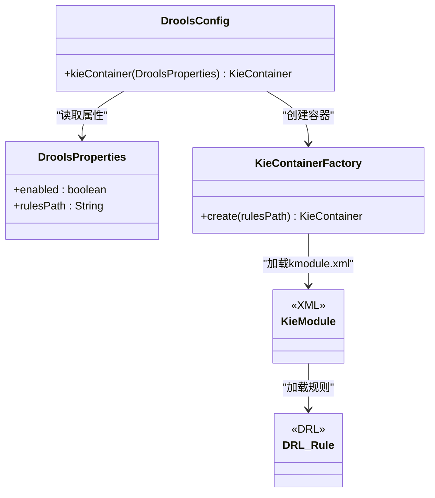
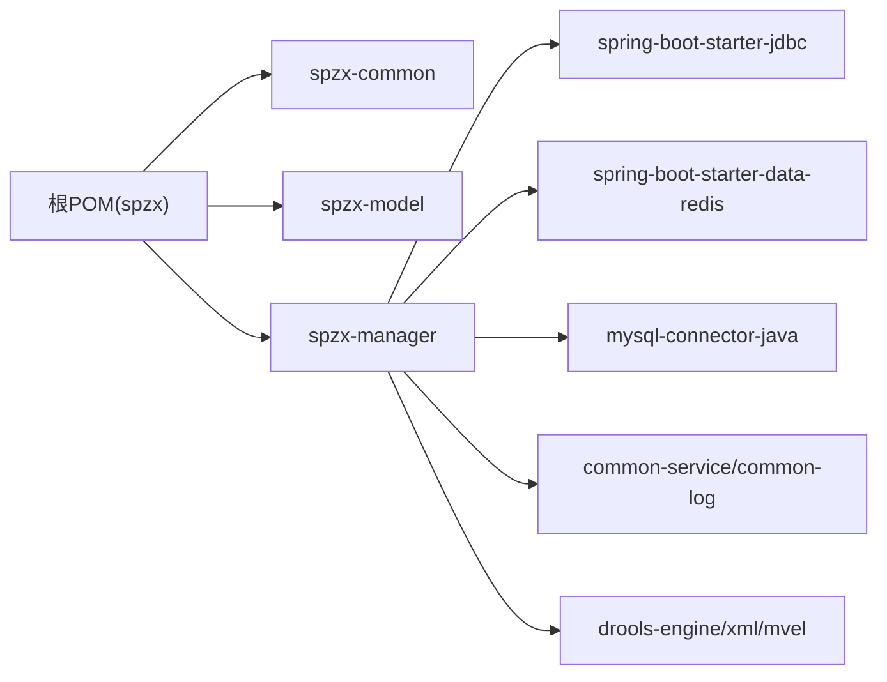

# 部署配置

<cite>
**本文引用的文件**
- [application.yml](file://spzx-manager/src/main/resources/application.yml)
- [application-dev.yml](file://spzx-manager/src/main/resources/application-dev.yml)
- [log4j2-spring.xml](file://spzx-manager/src/main/resources/log4j2-spring.xml)
- [kmodule.xml](file://spzx-manager/src/main/resources/META-INF/kmodule.xml)
- [order-discount.drl](file://spzx-manager/src/main/resources/rules/order-discount.drl)
- [ManagerApplication.java](file://spzx-manager/src/main/java/com/joker/spzx/manager/ManagerApplication.java)
- [WebMvcConfiguration.java](file://spzx-manager/src/main/java/com/joker/spzx/manager/config/WebMvcConfiguration.java)
- [LoginAuthInterceptor.java](file://spzx-manager/src/main/java/com/joker/spzx/manager/config/LoginAuthInterceptor.java)
- [MybatisPlusConfig.java](file://spzx-manager/src/main/java/com/joker/spzx/manager/config/MybatisPlusConfig.java)
- [TransactionConfig.java](file://spzx-manager/src/main/java/com/joker/spzx/manager/config/TransactionConfig.java)
- [DroolsConfig.java](file://spzx-manager/src/main/java/com/joker/spzx/manager/config/DroolsConfig.java)
- [DroolsProperties.java](file://spzx-manager/src/main/java/com/joker/spzx/manager/config/DroolsProperties.java)
- [KieContainerFactory.java](file://spzx-manager/src/main/java/com/joker/spzx/manager/drools/KieContainerFactory.java)
- [SysUserServiceImpl.java](file://spzx-manager/src/main/java/com/joker/spzx/manager/service/impl/SysUserServiceImpl.java)
- [Constant.java](file://spzx-common/common-util/src/main/java/com/joker/spzx/utils/Constant.java)
- [pom.xml（spzx-manager）](file://spzx-manager/pom.xml)
- [pom.xml（根工程）](file://pom.xml)
</cite>

## 目录
1. [简介](#简介)
2. [项目结构](#项目结构)
3. [核心组件](#核心组件)
4. [架构总览](#架构总览)
5. [详细组件分析](#详细组件分析)
6. [依赖关系分析](#依赖关系分析)
7. [性能考虑](#性能考虑)
8. [故障排除指南](#故障排除指南)
9. [结论](#结论)
10. [附录](#附录)

## 简介
本文件面向SPZX项目的生产部署与运维，围绕以下目标展开：明确生产环境配置要点、给出Docker容器化与云平台部署建议、解释配置文件与环境变量管理及敏感信息保护策略、提供数据库连接池与缓存配置参考、给出性能调优、监控与告警建议、说明热部署与滚动更新策略，并补充安全加固、防火墙与SSL证书管理要点。内容基于仓库中现有配置与代码进行提炼与扩展，帮助团队在不同环境下稳定交付与持续演进。

## 项目结构
SPZX采用多模块Maven工程组织，核心模块包括公共组件、模型层与业务服务模块。服务侧以Spring Boot启动类作为入口，结合拦截器、事务与MyBatis-Plus等配置完成运行期能力装配；规则引擎Drools通过classpath加载规则文件并注入容器。

图示来源
- [ManagerApplication.java:1-20](file://spzx-manager/src/main/java/com/joker/spzx/manager/ManagerApplication.java#L1-L20)
- [WebMvcConfiguration.java:1-39](file://spzx-manager/src/main/java/com/joker/spzx/manager/config/WebMvcConfiguration.java#L1-L39)
- [LoginAuthInterceptor.java:1-38](file://spzx-manager/src/main/java/com/joker/spzx/manager/config/LoginAuthInterceptor.java#L1-L38)
- [MybatisPlusConfig.java:1-53](file://spzx-manager/src/main/java/com/joker/spzx/manager/config/MybatisPlusConfig.java#L1-L53)
- [TransactionConfig.java:1-19](file://spzx-manager/src/main/java/com/joker/spzx/manager/config/TransactionConfig.java#L1-L19)
- [DroolsConfig.java:1-23](file://spzx-manager/src/main/java/com/joker/spzx/manager/config/DroolsConfig.java#L1-L23)
- [DroolsProperties.java:1-19](file://spzx-manager/src/main/java/com/joker/spzx/manager/config/DroolsProperties.java#L1-L19)
- [KieContainerFactory.java:1-23](file://spzx-manager/src/main/java/com/joker/spzx/manager/drools/KieContainerFactory.java#L1-L23)
- [application.yml:1-5](file://spzx-manager/src/main/resources/application.yml#L1-L5)
- [application-dev.yml:1-65](file://spzx-manager/src/main/resources/application-dev.yml#L1-L65)
- [log4j2-spring.xml:1-13](file://spzx-manager/src/main/resources/log4j2-spring.xml#L1-L13)
- [kmodule.xml:1-7](file://spzx-manager/src/main/resources/META-INF/kmodule.xml#L1-L7)
- [order-discount.drl:1-20](file://spzx-manager/src/main/resources/rules/order-discount.drl#L1-L20)

章节来源
- [pom.xml（根工程）:1-90](file://pom.xml#L1-L90)
- [pom.xml（spzx-manager）:1-101](file://spzx-manager/pom.xml#L1-L101)

## 核心组件
- 应用入口与启动：应用入口负责启动Spring Boot容器，加载配置与自动装配。
- Web与安全：通过拦截器实现登录态校验与白名单放行，CORS跨域策略按需开放。
- 数据访问：MyBatis-Plus提供分页、乐观锁与MySQL方言支持；事务由数据源事务管理器统一管理。
- 规则引擎：Drools通过属性与工厂类装配，规则位于classpath下的规则目录。
- 日志：Log4j2控制台输出，便于容器化与云平台日志采集。

章节来源
- [ManagerApplication.java:1-20](file://spzx-manager/src/main/java/com/joker/spzx/manager/ManagerApplication.java#L1-L20)
- [WebMvcConfiguration.java:1-39](file://spzx-manager/src/main/java/com/joker/spzx/manager/config/WebMvcConfiguration.java#L1-L39)
- [LoginAuthInterceptor.java:1-38](file://spzx-manager/src/main/java/com/joker/spzx/manager/config/LoginAuthInterceptor.java#L1-L38)
- [MybatisPlusConfig.java:1-53](file://spzx-manager/src/main/java/com/joker/spzx/manager/config/MybatisPlusConfig.java#L1-L53)
- [TransactionConfig.java:1-19](file://spzx-manager/src/main/java/com/joker/spzx/manager/config/TransactionConfig.java#L1-L19)
- [DroolsConfig.java:1-23](file://spzx-manager/src/main/java/com/joker/spzx/manager/config/DroolsConfig.java#L1-L23)
- [DroolsProperties.java:1-19](file://spzx-manager/src/main/java/com/joker/spzx/manager/config/DroolsProperties.java#L1-L19)
- [KieContainerFactory.java:1-23](file://spzx-manager/src/main/java/com/joker/spzx/manager/drools/KieContainerFactory.java#L1-L23)
- [log4j2-spring.xml:1-13](file://spzx-manager/src/main/resources/log4j2-spring.xml#L1-L13)

## 架构总览
下图展示服务启动到请求处理的关键流程，以及规则引擎与Redis在业务中的位置。

图示来源
- [ManagerApplication.java:1-20](file://spzx-manager/src/main/java/com/joker/spzx/manager/ManagerApplication.java#L1-L20)
- [WebMvcConfiguration.java:1-39](file://spzx-manager/src/main/java/com/joker/spzx/manager/config/WebMvcConfiguration.java#L1-L39)
- [LoginAuthInterceptor.java:1-38](file://spzx-manager/src/main/java/com/joker/spzx/manager/config/LoginAuthInterceptor.java#L1-L38)
- [SysUserServiceImpl.java:30-66](file://spzx-manager/src/main/java/com/joker/spzx/manager/service/impl/SysUserServiceImpl.java#L30-L66)
- [MybatisPlusConfig.java:1-53](file://spzx-manager/src/main/java/com/joker/spzx/manager/config/MybatisPlusConfig.java#L1-L53)
- [DroolsConfig.java:1-23](file://spzx-manager/src/main/java/com/joker/spzx/manager/config/DroolsConfig.java#L1-L23)

## 详细组件分析

### 配置文件与环境管理
- 配置激活：通过主配置激活开发环境配置文件，便于本地与CI/CD环境切换。
- 开发配置要点：端口、Tomcat超时、文件上传限制、Hikari连接池参数、Redis地址、Drools开关与规则路径、MyBatis-Plus映射与日志实现等。
- 日志：控制台输出格式化，便于容器标准输出采集。

章节来源
- [application.yml:1-5](file://spzx-manager/src/main/resources/application.yml#L1-L5)
- [application-dev.yml:1-65](file://spzx-manager/src/main/resources/application-dev.yml#L1-L65)
- [log4j2-spring.xml:1-13](file://spzx-manager/src/main/resources/log4j2-spring.xml#L1-L13)

### 安全与鉴权拦截
- 白名单：常量类维护无需登录即可访问的路径集合。
- 拦截器：对除白名单外的所有请求进行登录态校验，支持OPTIONS预检请求直接放行。
- Redis：用于存储验证码与登录态键值，拦截器基于Redis进行校验与续期。

图示来源
- [LoginAuthInterceptor.java:1-38](file://spzx-manager/src/main/java/com/joker/spzx/manager/config/LoginAuthInterceptor.java#L1-L38)
- [Constant.java:1-26](file://spzx-common/common-util/src/main/java/com/joker/spzx/utils/Constant.java#L1-L26)
- [SysUserServiceImpl.java:30-66](file://spzx-manager/src/main/java/com/joker/spzx/manager/service/impl/SysUserServiceImpl.java#L30-L66)

章节来源
- [LoginAuthInterceptor.java:1-38](file://spzx-manager/src/main/java/com/joker/spzx/manager/config/LoginAuthInterceptor.java#L1-L38)
- [Constant.java:1-26](file://spzx-common/common-util/src/main/java/com/joker/spzx/utils/Constant.java#L1-L26)
- [SysUserServiceImpl.java:30-66](file://spzx-manager/src/main/java/com/joker/spzx/manager/service/impl/SysUserServiceImpl.java#L30-L66)

### 数据库连接池与事务
- 连接池：HikariCP在开发配置中集中定义，包含最大池大小、最小空闲、空闲超时、生命周期、连接超时、验证超时、泄漏检测阈值、连接初始化SQL与预编译缓存参数等。
- 事务：基于数据源的事务管理器，确保数据库操作一致性。
- MyBatis-Plus：提供分页插件与乐观锁内核，MySQL方言与连接优化。

图示来源
- [TransactionConfig.java:1-19](file://spzx-manager/src/main/java/com/joker/spzx/manager/config/TransactionConfig.java#L1-L19)
- [MybatisPlusConfig.java:1-53](file://spzx-manager/src/main/java/com/joker/spzx/manager/config/MybatisPlusConfig.java#L1-L53)
- [application-dev.yml:12-32](file://spzx-manager/src/main/resources/application-dev.yml#L12-L32)

章节来源
- [TransactionConfig.java:1-19](file://spzx-manager/src/main/java/com/joker/spzx/manager/config/TransactionConfig.java#L1-L19)
- [MybatisPlusConfig.java:1-53](file://spzx-manager/src/main/java/com/joker/spzx/manager/config/MybatisPlusConfig.java#L1-L53)
- [application-dev.yml:12-32](file://spzx-manager/src/main/resources/application-dev.yml#L12-L32)

### 规则引擎（Drools）
- 属性与装配：通过属性类与配置类在条件满足时创建KIE容器，加载classpath下的规则模块。
- 规则文件：规则以DRL形式存在，通过KIE容器统一调度。
- 工厂类：独立于Spring上下文，便于单元测试与解耦。

图示来源
- [DroolsProperties.java:1-19](file://spzx-manager/src/main/java/com/joker/spzx/manager/config/DroolsProperties.java#L1-L19)
- [DroolsConfig.java:1-23](file://spzx-manager/src/main/java/com/joker/spzx/manager/config/DroolsConfig.java#L1-L23)
- [KieContainerFactory.java:1-23](file://spzx-manager/src/main/java/com/joker/spzx/manager/drools/KieContainerFactory.java#L1-L23)
- [kmodule.xml:1-7](file://spzx-manager/src/main/resources/META-INF/kmodule.xml#L1-L7)
- [order-discount.drl:1-20](file://spzx-manager/src/main/resources/rules/order-discount.drl#L1-L20)

章节来源
- [DroolsProperties.java:1-19](file://spzx-manager/src/main/java/com/joker/spzx/manager/config/DroolsProperties.java#L1-L19)
- [DroolsConfig.java:1-23](file://spzx-manager/src/main/java/com/joker/spzx/manager/config/DroolsConfig.java#L1-L23)
- [KieContainerFactory.java:1-23](file://spzx-manager/src/main/java/com/joker/spzx/manager/drools/KieContainerFactory.java#L1-L23)
- [kmodule.xml:1-7](file://spzx-manager/src/main/resources/META-INF/kmodule.xml#L1-L7)
- [order-discount.drl:1-20](file://spzx-manager/src/main/resources/rules/order-discount.drl#L1-L20)

### 缓存配置（Redis）
- 配置位置：开发配置中声明Redis主机与端口。
- 使用场景：拦截器与业务层用于验证码与登录态存储，提升鉴权效率与用户体验。
- 建议：生产环境应独立部署高可用Redis集群，并开启持久化与备份策略。

章节来源
- [application-dev.yml:34-38](file://spzx-manager/src/main/resources/application-dev.yml#L34-L38)
- [LoginAuthInterceptor.java:1-38](file://spzx-manager/src/main/java/com/joker/spzx/manager/config/LoginAuthInterceptor.java#L1-L38)
- [SysUserServiceImpl.java:30-66](file://spzx-manager/src/main/java/com/joker/spzx/manager/service/impl/SysUserServiceImpl.java#L30-L66)

### 日志与可观测性
- 日志：控制台输出，格式包含时间、级别、Logger与消息体，适合容器日志采集。
- 建议：生产环境接入集中式日志系统（如ELK/云日志服务），并按环境调整日志级别与采样策略。

章节来源
- [log4j2-spring.xml:1-13](file://spzx-manager/src/main/resources/log4j2-spring.xml#L1-L13)

## 依赖关系分析
- 模块依赖：根POM聚合三个子模块，spzx-manager依赖common-service与common-log等公共模块，并引入Drools引擎与MySQL驱动。
- 版本管理：父POM集中管理Spring Boot、MyBatis-Plus、Drools等版本，避免冲突。

图示来源
- [pom.xml（根工程）:1-90](file://pom.xml#L1-L90)
- [pom.xml（spzx-manager）:1-101](file://spzx-manager/pom.xml#L1-L101)

章节来源
- [pom.xml（根工程）:1-90](file://pom.xml#L1-L90)
- [pom.xml（spzx-manager）:1-101](file://spzx-manager/pom.xml#L1-L101)

## 性能考虑
- 连接池参数：根据并发与数据库承载能力调整最大池大小、空闲与生命周期参数，避免连接泄漏与抖动。
- 线程池：业务线程池基于CPU核数自适应配置，队列容量与拒绝策略需结合QPS与RT目标调优。
- 分页与查询：合理设置分页上限与连接优化，避免大表全量扫描。
- 规则引擎：规则复杂度与匹配数量直接影响性能，建议在生产环境评估规则集规模与执行成本。
- 缓存：热点数据尽量命中Redis，减少数据库压力；注意过期与淘汰策略。

## 故障排除指南
- 登录失败/验证码错误：检查Redis中验证码键是否存在与有效期，确认拦截器读取逻辑。
- 跨域问题：确认CORS配置是否包含前端域名与所需方法/头。
- 数据库连接异常：核对连接池参数与数据库连通性，关注连接泄漏阈值与初始化超时。
- 规则未生效：确认规则引擎属性开关与规则路径，检查KIE模块与DRL文件是否正确打包。
- 日志缺失：确认Log4j2配置是否生效，容器日志采集是否正常。

章节来源
- [LoginAuthInterceptor.java:1-38](file://spzx-manager/src/main/java/com/joker/spzx/manager/config/LoginAuthInterceptor.java#L1-L38)
- [WebMvcConfiguration.java:1-39](file://spzx-manager/src/main/java/com/joker/spzx/manager/config/WebMvcConfiguration.java#L1-L39)
- [application-dev.yml:12-32](file://spzx-manager/src/main/resources/application-dev.yml#L12-L32)
- [DroolsConfig.java:1-23](file://spzx-manager/src/main/java/com/joker/spzx/manager/config/DroolsConfig.java#L1-L23)
- [log4j2-spring.xml:1-13](file://spzx-manager/src/main/resources/log4j2-spring.xml#L1-L13)

## 结论
本文基于仓库现有配置与代码，梳理了SPZX服务的启动流程、安全拦截、数据访问、规则引擎与日志体系，并给出了生产部署与运维的通用建议。实际落地时，应结合业务流量与资源情况细化参数，完善监控与告警，确保系统在高可用与高性能前提下稳定运行。

## 附录

### 生产环境配置清单（建议）
- 环境隔离：通过profile或环境变量切换生产配置，避免硬编码。
- 数据库：使用生产数据库实例，连接池参数按压测结果调优。
- 缓存：独立Redis集群，开启RDB/AOF持久化与备份。
- 安全：强制HTTPS、严格CORS白名单、接口限流与WAF防护。
- 日志：集中式日志采集与索引，分级日志与脱敏。
- 监控：Prometheus/Grafana或云监控，关键指标（QPS、RT、错误率、连接池使用率、GC）。
- 备份：数据库与规则文件定期备份，回滚策略明确。

### Docker容器化与云平台部署建议
- 容器镜像：基于JRE镜像构建，暴露应用端口，挂载日志目录。
- 编排：Kubernetes建议使用Deployment+HPA+Service，配置健康检查与就绪探针。
- 存储：持久化日志与配置，使用ConfigMap管理非敏感配置，Secret管理密钥。
- 云平台：阿里云/腾讯云ECS或容器服务，结合SLB/NLB做负载均衡，按需开启弹性伸缩。

### 环境变量与敏感信息保护
- 环境变量：数据库账号密码、Redis地址、规则引擎开关等通过环境变量注入。
- 密钥管理：使用平台密钥管理服务（如KMS/凭据中心），避免明文入仓。
- 配置加密：对敏感字段进行加密存储，运行时解密。

### 负载均衡与高可用
- 负载均衡：Nginx/SLB分发请求，后端多副本部署。
- 健康检查：基于HTTP探针与数据库探针，及时摘除故障实例。
- 会话：无状态设计或集中式会话存储，避免粘性会话引发单点。

### 数据库连接池与缓存配置要点
- 连接池：最大池大小、空闲超时、生命周期、验证超时、泄漏检测阈值、预编译缓存参数。
- 缓存：热点键分区、过期策略、淘汰算法、读写分离与降级策略。

### 性能调优与监控指标
- 指标：QPS、P95/P99延迟、错误率、连接池活跃/空闲数、Redis命中率、GC停顿时间。
- 调优：线程池队列长度、分页上限、规则复杂度、缓存命中率、数据库索引与慢查询。

### 热部署、滚动更新与回滚策略
- 滚动更新：灰度发布，逐步替换实例，结合探针与熔断。
- 回滚：保留最近几个版本镜像，快速回滚；变更记录与自动化测试保障。
- 配置热更：仅限非敏感配置，通过配置中心动态刷新。

### 安全加固、防火墙与SSL
- 防火墙：仅开放必要端口，内网访问数据库与缓存。
- SSL：启用TLS，证书由平台CA签发或ACME自动签发。
- 审计：登录与关键操作审计日志，保留至少90天。