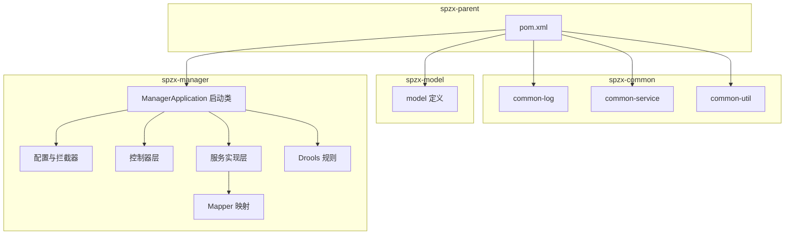
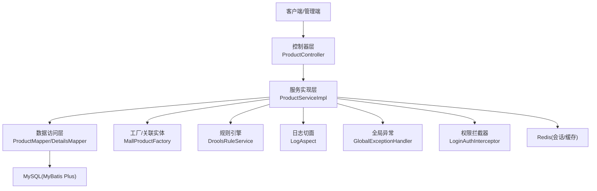
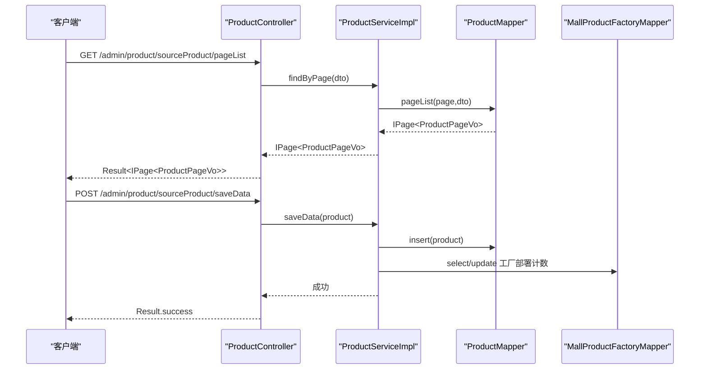
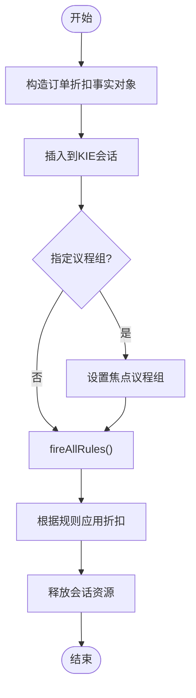
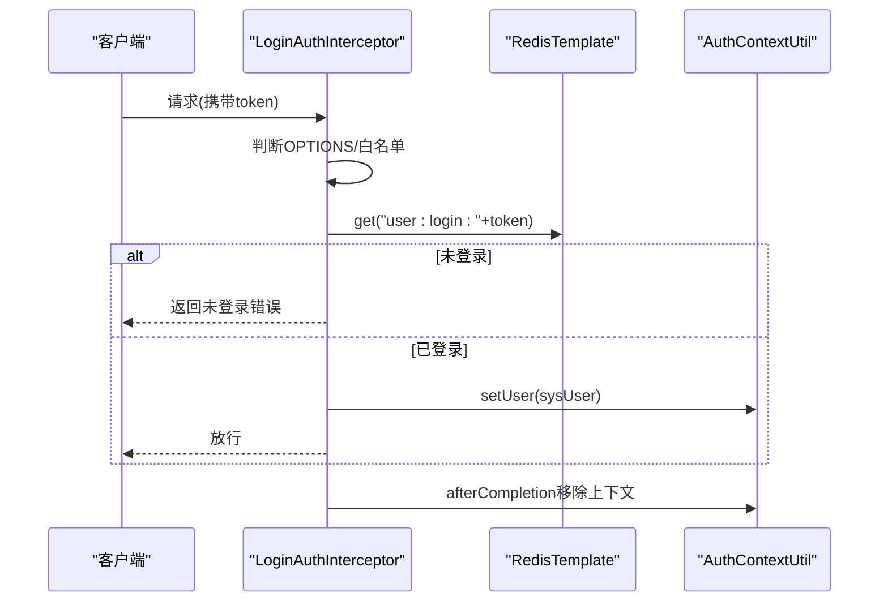
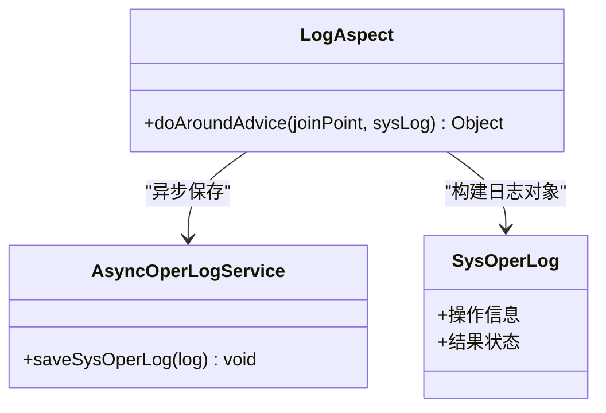
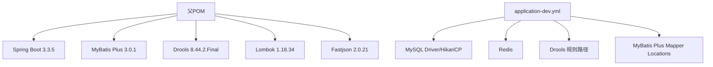

# 项目概述

<cite>
**本文引用的文件**
- [pom.xml](file://pom.xml)
- [ManagerApplication.java](file://spzx-manager/src/main/java/com/joker/spzx/manager/ManagerApplication.java)
- [application.yml](file://spzx-manager/src/main/resources/application.yml)
- [application-dev.yml](file://spzx-manager/src/main/resources/application-dev.yml)
- [BaseEntity.java](file://spzx-model/src/main/java/com/joker/spzx/model/entity/base/BaseEntity.java)
- [Product.java](file://spzx-model/src/main/java/com/joker/spzx/model/entity/product/Product.java)
- [OrderInfo.java](file://spzx-model/src/main/java/com/joker/spzx/model/entity/order/OrderInfo.java)
- [SysUser.java](file://spzx-model/src/main/java/com/joker/spzx/model/entity/system/SysUser.java)
- [ProductController.java](file://spzx-manager/src/main/java/com/joker/spzx/manager/controller/ProductController.java)
- [ProductServiceImpl.java](file://spzx-manager/src/main/java/com/joker/spzx/manager/service/impl/ProductServiceImpl.java)
- [LoginAuthInterceptor.java](file://spzx-manager/src/main/java/com/joker/spzx/manager/config/LoginAuthInterceptor.java)
- [GlobalExceptionHandler.java](file://spzx-common/common-service/src/main/java/com/joker/spzx/common/exception/GlobalExceptionHandler.java)
- [LogAspect.java](file://spzx-common/common-log/src/main/java/com/joker/spzx/common/aspect/LogAspect.java)
- [DroolsRuleService.java](file://spzx-manager/src/main/java/com/joker/spzx/manager/drools/DroolsRuleService.java)
- [order-discount.drl](file://spzx-manager/src/main/resources/rules/order-discount.drl)
</cite>

## 目录
1. [引言](#引言)
2. [项目结构](#项目结构)
3. [核心组件](#核心组件)
4. [架构总览](#架构总览)
5. [详细组件分析](#详细组件分析)
6. [依赖分析](#依赖分析)
7. [性能考虑](#性能考虑)
8. [故障排查指南](#故障排查指南)
9. [结论](#结论)
10. [附录](#附录)

## 引言
SPZX电商管理系统是一个基于Spring Boot 3与MyBatis Plus的企业级电商后台管理平台，采用多模块分层架构设计，覆盖商品管理、订单处理、用户与权限体系、日志与规则引擎等核心能力。项目以“模块化、可扩展、易维护”为目标，结合Redis会话认证、Drools规则引擎、统一异常处理与操作日志切面，形成从接口到持久化的完整闭环。

本项目适合初学者快速上手，也具备足够的技术深度供资深开发者参考与二次开发。

## 项目结构
项目采用Maven多模块聚合结构，核心模块如下：
- spzx-parent：父工程，统一版本与依赖管理
- spzx-common：通用能力模块（日志切面、全局异常、工具类）
- spzx-model：领域模型与DTO/VO定义
- spzx-manager：业务服务模块（控制器、服务、映射、规则）

图表来源
- [pom.xml:1-90](file://pom.xml#L1-L90)
- [ManagerApplication.java:1-20](file://spzx-manager/src/main/java/com/joker/spzx/manager/ManagerApplication.java#L1-L20)

章节来源
- [pom.xml:1-90](file://pom.xml#L1-L90)
- [application.yml:1-5](file://spzx-manager/src/main/resources/application.yml#L1-L5)
- [application-dev.yml:1-65](file://spzx-manager/src/main/resources/application-dev.yml#L1-L65)

## 核心组件
- 应用启动与配置
  - 启动类启用日志切面注解，负责应用初始化与自动装配
  - 环境配置通过profiles激活dev环境，集中管理数据库、Redis、MyBatis Plus、Drools等参数
- 统一异常处理
  - 全局异常处理器捕获未处理异常并返回标准化结果
- 权限与会话
  - 登录拦截器从请求头读取token，校验Redis中的登录态，注入当前用户上下文
- 日志切面
  - 基于注解的环绕通知，记录操作日志并异步落库
- 规则引擎
  - 基于Drools的事实对象与规则文件，支持按优先级执行折扣策略
- 领域模型
  - 统一基类包含主键、时间戳与逻辑删除字段
  - 商品、订单、用户等核心实体承载业务属性

章节来源
- [ManagerApplication.java:1-20](file://spzx-manager/src/main/java/com/joker/spzx/manager/ManagerApplication.java#L1-L20)
- [application.yml:1-5](file://spzx-manager/src/main/resources/application.yml#L1-L5)
- [application-dev.yml:1-65](file://spzx-manager/src/main/resources/application-dev.yml#L1-L65)
- [GlobalExceptionHandler.java:1-20](file://spzx-common/common-service/src/main/java/com/joker/spzx/common/exception/GlobalExceptionHandler.java#L1-L20)
- [LoginAuthInterceptor.java:1-81](file://spzx-manager/src/main/java/com/joker/spzx/manager/config/LoginAuthInterceptor.java#L1-L81)
- [LogAspect.java:1-47](file://spzx-common/common-log/src/main/java/com/joker/spzx/common/aspect/LogAspect.java#L1-L47)
- [DroolsRuleService.java:1-54](file://spzx-manager/src/main/java/com/joker/spzx/manager/drools/DroolsRuleService.java#L1-L54)
- [BaseEntity.java:1-34](file://spzx-model/src/main/java/com/joker/spzx/model/entity/base/BaseEntity.java#L1-L34)
- [Product.java:1-58](file://spzx-model/src/main/java/com/joker/spzx/model/entity/product/Product.java#L1-L58)
- [OrderInfo.java:1-113](file://spzx-model/src/main/java/com/joker/spzx/model/entity/order/OrderInfo.java#L1-L113)
- [SysUser.java:1-42](file://spzx-model/src/main/java/com/joker/spzx/model/entity/system/SysUser.java#L1-L42)

## 架构总览
系统采用前后端分离的典型三层架构：Web层（控制器）、业务层（服务）、数据访问层（Mapper）。核心交互路径如下：

图表来源
- [ProductController.java:1-59](file://spzx-manager/src/main/java/com/joker/spzx/manager/controller/ProductController.java#L1-L59)
- [ProductServiceImpl.java:1-141](file://spzx-manager/src/main/java/com/joker/spzx/manager/service/impl/ProductServiceImpl.java#L1-L141)
- [LoginAuthInterceptor.java:1-81](file://spzx-manager/src/main/java/com/joker/spzx/manager/config/LoginAuthInterceptor.java#L1-L81)
- [LogAspect.java:1-47](file://spzx-common/common-log/src/main/java/com/joker/spzx/common/aspect/LogAspect.java#L1-L47)
- [GlobalExceptionHandler.java:1-20](file://spzx-common/common-service/src/main/java/com/joker/spzx/common/exception/GlobalExceptionHandler.java#L1-L20)
- [DroolsRuleService.java:1-54](file://spzx-manager/src/main/java/com/joker/spzx/manager/drools/DroolsRuleService.java#L1-L54)
- [application-dev.yml:1-65](file://spzx-manager/src/main/resources/application-dev.yml#L1-L65)

## 详细组件分析

### 商品管理模块
- 控制器职责：提供分页查询、新增、修改、删除、详情获取等REST接口
- 服务实现要点：
  - 分页查询通过Mapper的XML分页方法实现
  - 新增时写入创建时间与创建人，并更新工厂部署计数
  - 修改时判断工厂变更并同步更新工厂计数
  - 删除采用软删除，同时对SKU与详情进行批量逻辑删除
- 数据模型：商品实体继承统一基类，包含来源信息、物流与稳定状态等字段

图表来源
- [ProductController.java:28-32](file://spzx-manager/src/main/java/com/joker/spzx/manager/controller/ProductController.java#L28-L32)
- [ProductController.java:34-38](file://spzx-manager/src/main/java/com/joker/spzx/manager/controller/ProductController.java#L34-L38)
- [ProductServiceImpl.java:41-45](file://spzx-manager/src/main/java/com/joker/spzx/manager/service/impl/ProductServiceImpl.java#L41-L45)
- [ProductServiceImpl.java:48-62](file://spzx-manager/src/main/java/com/joker/spzx/manager/service/impl/ProductServiceImpl.java#L48-L62)

章节来源
- [ProductController.java:1-59](file://spzx-manager/src/main/java/com/joker/spzx/manager/controller/ProductController.java#L1-L59)
- [ProductServiceImpl.java:1-141](file://spzx-manager/src/main/java/com/joker/spzx/manager/service/impl/ProductServiceImpl.java#L1-L141)
- [Product.java:1-58](file://spzx-model/src/main/java/com/joker/spzx/model/entity/product/Product.java#L1-L58)

### 订单处理与规则引擎
- 订单实体包含用户、收货信息、支付与状态流转等字段
- 规则引擎通过Drools加载规则文件，按优先级匹配并应用折扣策略
- 服务侧可注入DroolsRuleService，向会话插入事实对象并触发规则执行

图表来源
- [DroolsRuleService.java:21-39](file://spzx-manager/src/main/java/com/joker/spzx/manager/drools/DroolsRuleService.java#L21-L39)
- [order-discount.drl:1-20](file://spzx-manager/src/main/resources/rules/order-discount.drl#L1-L20)

章节来源
- [OrderInfo.java:1-113](file://spzx-model/src/main/java/com/joker/spzx/model/entity/order/OrderInfo.java#L1-L113)
- [DroolsRuleService.java:1-54](file://spzx-manager/src/main/java/com/joker/spzx/manager/drools/DroolsRuleService.java#L1-L54)
- [order-discount.drl:1-20](file://spzx-manager/src/main/resources/rules/order-discount.drl#L1-L20)

### 用户与权限控制
- 登录拦截器从请求头读取token，校验Redis中的登录态，刷新过期时间并将用户信息注入上下文
- 白名单机制放行OPTIONS与无需鉴权的请求
- 全局异常处理器统一捕获异常并返回标准化错误码

图表来源
- [LoginAuthInterceptor.java:30-58](file://spzx-manager/src/main/java/com/joker/spzx/manager/config/LoginAuthInterceptor.java#L30-L58)
- [LoginAuthInterceptor.java:77-79](file://spzx-manager/src/main/java/com/joker/spzx/manager/config/LoginAuthInterceptor.java#L77-L79)

章节来源
- [LoginAuthInterceptor.java:1-81](file://spzx-manager/src/main/java/com/joker/spzx/manager/config/LoginAuthInterceptor.java#L1-L81)
- [GlobalExceptionHandler.java:1-20](file://spzx-common/common-service/src/main/java/com/joker/spzx/common/exception/GlobalExceptionHandler.java#L1-L20)

### 日志与审计
- 基于注解的切面在方法前后收集调用信息、结果与异常，异步写入操作日志
- 适用于审计追踪与问题定位

图表来源
- [LogAspect.java:21-46](file://spzx-common/common-log/src/main/java/com/joker/spzx/common/aspect/LogAspect.java#L21-L46)

章节来源
- [LogAspect.java:1-47](file://spzx-common/common-log/src/main/java/com/joker/spzx/common/aspect/LogAspect.java#L1-L47)

## 依赖分析
- 版本与依赖管理
  - 父POM统一管理Spring Boot、MyBatis Plus、Drools、Lombok、Fastjson等版本
  - 通过dependencyManagement锁定子模块依赖版本，避免冲突
- 运行时依赖
  - MySQL驱动、HikariCP连接池、Redis客户端、MyBatis Plus配置
  - 开发环境配置示例：数据库、Redis、Drools规则路径、MyBatis Plus映射路径

图表来源
- [pom.xml:36-75](file://pom.xml#L36-L75)
- [application-dev.yml:12-32](file://spzx-manager/src/main/resources/application-dev.yml#L12-L32)
- [application-dev.yml:48-52](file://spzx-manager/src/main/resources/application-dev.yml#L48-L52)
- [application-dev.yml:53-59](file://spzx-manager/src/main/resources/application-dev.yml#L53-L59)

章节来源
- [pom.xml:1-90](file://pom.xml#L1-L90)
- [application-dev.yml:1-65](file://spzx-manager/src/main/resources/application-dev.yml#L1-L65)

## 性能考虑
- 连接池与超时
  - HikariCP连接池参数（最大连接数、空闲连接、最大生命周期、连接超时、验证超时）需结合QPS与事务时长调优
- 规则引擎
  - 使用议程组聚焦与规则优先级（salience）控制执行范围，避免全量规则扫描
- 缓存与会话
  - Redis登录态有效期建议与业务场景匹配，防止频繁重连与过期抖动
- 分页与查询
  - Mapper分页与条件过滤需配合索引优化，避免全表扫描

## 故障排查指南
- 登录鉴权失败
  - 检查请求头token是否存在与Redis中键值格式是否正确
  - 关注拦截器对OPTIONS与白名单的放行逻辑
- 接口异常
  - 查看全局异常处理器返回的错误码与消息
  - 结合日志切面输出定位具体方法与异常堆栈
- 规则未生效
  - 确认规则文件路径与Drools开关配置
  - 检查事实对象是否正确插入与议程组焦点设置

章节来源
- [LoginAuthInterceptor.java:30-58](file://spzx-manager/src/main/java/com/joker/spzx/manager/config/LoginAuthInterceptor.java#L30-L58)
- [GlobalExceptionHandler.java:9-19](file://spzx-common/common-service/src/main/java/com/joker/spzx/common/exception/GlobalExceptionHandler.java#L9-L19)
- [LogAspect.java:34-38](file://spzx-common/common-log/src/main/java/com/joker/spzx/common/aspect/LogAspect.java#L34-L38)
- [application-dev.yml:48-52](file://spzx-manager/src/main/resources/application-dev.yml#L48-L52)

## 结论
SPZX电商管理系统以模块化与分层架构为核心，结合规则引擎、统一异常与日志切面，构建了高内聚、低耦合的后台管理能力。通过规范的实体模型与标准的控制器-服务-映射交互，既满足快速迭代需求，也为后续扩展（如营销活动、库存策略、报表统计）提供了良好基础。

## 附录
- 系统截图
  - 登录拦截器校验流程示意
  - 商品分页查询与新增流程示意
  - 订单折扣规则执行流程示意
- 架构图
  - 多模块结构与运行时依赖关系
- 核心流程图
  - 商品新增与工厂计数联动
  - 订单折扣规则匹配与应用